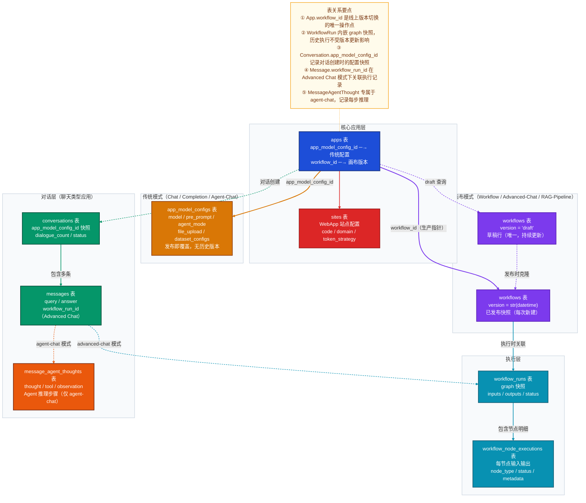

### 4.2 完整参考原图

> 展示 Dify 应用管理域：核心应用层 → 传统模式 / 画布模式 → 执行层 → 对话层的完整表关系

```mermaid
flowchart TB
    classDef appStyle    fill:#1d4ed8,stroke:#1e3a8a,stroke-width:2.5px,color:#fff
    classDef configStyle fill:#d97706,stroke:#92400e,stroke-width:2px,color:#fff
    classDef wfStyle     fill:#7c3aed,stroke:#5b21b6,stroke-width:2px,color:#fff
    classDef runStyle    fill:#0891b2,stroke:#155e75,stroke-width:2px,color:#fff
    classDef chatStyle   fill:#059669,stroke:#064e3b,stroke-width:2px,color:#fff
    classDef siteStyle   fill:#dc2626,stroke:#991b1b,stroke-width:2px,color:#fff
    classDef agentStyle  fill:#ea580c,stroke:#7c2d12,stroke-width:2px,color:#fff
    classDef noteStyle   fill:#fffbeb,stroke:#f59e0b,stroke-width:1.5px,color:#78350f
    classDef layerStyle  fill:#f8fafc,stroke:#cbd5e0,stroke-width:1.5px

    subgraph CORE["核心应用层"]
        APP["apps 表<br>app_model_config_id ─→ 传统配置<br>workflow_id ─→ 画布版本"]:::appStyle
        SITE["sites 表<br>WebApp 站点配置<br>code / domain / token_strategy"]:::siteStyle
    end
    class CORE layerStyle

    subgraph TRAD["传统模式（Chat / Completion / Agent-Chat）"]
        AMC["app_model_configs 表<br>model / pre_prompt / agent_mode<br>file_upload / dataset_configs<br>发布即覆盖，无历史版本"]:::configStyle
    end
    class TRAD layerStyle

    subgraph CANVAS["画布模式（Workflow / Advanced-Chat / RAG-Pipeline）"]
        direction LR
        DRAFT["workflows 表<br>version = 'draft'<br>草稿行（唯一，持续更新）"]:::wfStyle
        PUB["workflows 表<br>version = str(datetime)<br>已发布快照（每次新建）"]:::wfStyle
    end
    class CANVAS layerStyle

    subgraph EXEC["执行层"]
        direction LR
        WFR["workflow_runs 表<br>graph 快照<br>inputs / outputs / status"]:::runStyle
        WNE["workflow_node_executions 表<br>每节点输入输出<br>node_type / status / metadata"]:::runStyle
    end
    class EXEC layerStyle

    subgraph DIALOG["对话层（聊天类型应用）"]
        direction LR
        CONV["conversations 表<br>app_model_config_id 快照<br>dialogue_count / status"]:::chatStyle
        MSG["messages 表<br>query / answer<br>workflow_run_id（Advanced Chat）"]:::chatStyle
        MAT["message_agent_thoughts 表<br>thought / tool / observation<br>Agent 推理步骤（仅 agent-chat）"]:::agentStyle
    end
    class DIALOG layerStyle

    APP --> SITE
    APP -->|"app_model_config_id"| AMC
    APP -->|"workflow_id（生产指针）"| PUB
    APP -.->|"draft 查询"| DRAFT
    DRAFT -.->|"发布时克隆"| PUB
    PUB -->|"执行时关联"| WFR
    WFR -->|"包含节点明细"| WNE
    CONV -->|"包含多条"| MSG
    MSG -->|"agent-chat 模式"| MAT
    MSG -.->|"advanced-chat 模式"| WFR
    APP -.->|"对话创建"| CONV

    NOTE["表关系要点<br>① App.workflow_id 是线上版本切换的唯一操作点<br>② WorkflowRun 内嵌 graph 快照，历史执行不受版本更新影响<br>③ Conversation.app_model_config_id 记录对话创建时的配置快照<br>④ Message.workflow_run_id 在 Advanced Chat 模式下关联执行记录<br>⑤ MessageAgentThought 专属于 agent-chat，记录每步推理"]:::noteStyle
    NOTE -.- APP

    %% 边索引：0-11，共 12 条
    linkStyle 0 stroke:#dc2626,stroke-width:2px
    linkStyle 1 stroke:#d97706,stroke-width:2.5px
    linkStyle 2 stroke:#7c3aed,stroke-width:2.5px
    linkStyle 3 stroke:#7c3aed,stroke-width:1.5px,stroke-dasharray:4 3
    linkStyle 4 stroke:#7c3aed,stroke-width:1.5px,stroke-dasharray:4 3
    linkStyle 5 stroke:#0891b2,stroke-width:2px
    linkStyle 6 stroke:#0891b2,stroke-width:2px
    linkStyle 7 stroke:#059669,stroke-width:2px
    linkStyle 8 stroke:#ea580c,stroke-width:1.5px,stroke-dasharray:4 3
    linkStyle 9 stroke:#0891b2,stroke-width:1.5px,stroke-dasharray:4 3
    linkStyle 10 stroke:#059669,stroke-width:1.5px,stroke-dasharray:4 3
    linkStyle 11 stroke:#f59e0b,stroke-width:1px,stroke-dasharray:2 2
```