# 深度学习模型分析 Mermaid 作图规范与参考

> 整合五种深度学习分析图表的区别说明、完整原图参考与最佳实践速查。\
> 分析任意深度学习模型时，可按本文档的图表类型和风格规范绘图。

***

## 一、图表类型总览与选择

### 1.1 五类图表对比

| 图表类型            | 回答的问题            | 典型方向 | 核心关注点          |
| --------------- | ---------------- | ---- | -------------- |
| **① 模型整体架构图**   | 模型由哪些模块构成？层级与依赖？ | `LR` | 模块组成、层级职责、接口形状 |
| **② 前向传播/张量流图** | 数据如何流动？维度如何变化？   | `LR` | 张量形状变换、分支与汇聚   |
| **③ 模块内部结构图**   | 核心算子的内部实现细节？     | `TB` | 矩阵操作、算子组合      |
| **④ 训练流程图**     | 完整训练循环如何运转？      | `LR` | 前向/反向/优化器/调度器  |
| **⑤ 数据处理流水线图**  | 数据如何从原始格式到模型输入？  | `LR` | 预处理、增强、批次化     |

### 1.2 分析顺序建议

```
第一步：模型整体架构图  →  建立模块认知（有哪些模块？如何分层？）
    ↓
第二步：前向传播/张量流图  →  追踪数据变换（维度怎么变？哪里是计算瓶颈？）
    ↓
第三步：模块内部结构图  →  深入核心组件（关键算子如何实现？）
    ↓
第四步：训练流程图  →  理解优化过程（梯度如何传播？策略如何组合？）
    ↓
第五步：数据处理流水线图  →  理解数据输入（增强在哪里？IO 如何优化？）
```

一个模型对应一张整体架构图，但可以有多张张量流图（分别分析不同输入路径）和多张模块内部图（分别展示不同核心算子）。

### 1.3 文字分析层级

Mermaid 图表呈现**结构关系**，配套的文字分析呈现**职责意图**，两者互补缺一不可。

文字分析按以下三层组织，与 Mermaid 的 `subgraph` 嵌套结构一一对应：

| 层级        | 对应 Mermaid 元素 | 文字需说明的内容                |
| --------- | ------------- | ----------------------- |
| **功能模块层** | 外层 `subgraph` | 该模块在整体模型中的定位 + 职责（负责什么） |
| **子模块层**  | 内层 `subgraph` | 该子模块的计算职责 + 在功能模块内的作用   |
| **算子层**   | 节点            | 该算子的具体操作 + 为什么选用这个算子    |

每层文字分析的核心问题：**这是什么 → 职责是什么 → 为什么这样设计**

### 1.4 全局配色规范

所有图表使用统一配色体系，按模块职责着色：

| 职责          | 颜色   | 十六进制      | classDef 名称    |
| ----------- | ---- | --------- | -------------- |
| 原始输入 / 最终输出 | 深蓝   | `#1e40af` | `inputStyle`   |
| 嵌入 / 位置编码   | 靛蓝   | `#4f46e5` | `embedStyle`   |
| 主干编码器 / 骨干  | 青色   | `#0891b2` | `encoderStyle` |
| 注意力机制       | 红色   | `#dc2626` | `attnStyle`    |
| 前馈网络 / MLP  | 琥珀   | `#d97706` | `ffnStyle`     |
| 任务头 / 输出层   | 绿色   | `#059669` | `headStyle`    |
| 损失函数        | 深红   | `#991b1b` | `lossStyle`    |
| 优化器 / 调度器   | 紫色   | `#7c3aed` | `optStyle`     |
| 数据加载 / 增强   | 橙色   | `#ea580c` | `dataStyle`    |
| 数据库 / 存储    | 深灰   | `#374151` | `dbStyle`      |
| 设计注记        | 暖黄背景 | `#fffbeb` | `noteStyle`    |
| 子图背景        | 浅灰   | `#f8fafc` | `layerStyle`   |

***

## 二、模型整体架构图（静态结构视图）

### 2.1 适用场景

用于回答以下四个层次的问题：

- **功能模块层**：这个模型由哪些功能模块构成？每个功能模块的职责是什么（如 Encoder 负责编码源序列语义、Backbone 负责多尺度特征提取）？
- **子模块层**：每个功能模块内部由哪些子模块组成？各子模块的职责是什么（如 Self-Attention 负责捕获全局依赖、FFN 负责特征非线性变换）？
- **连接关系**：功能模块之间如何连接？是串行、并行还是跨模块的特征复用（如 Cross-Attention 桥接 Encoder 与 Decoder）？
- **数据接口**：关键节点的输入输出张量形状是什么？哪里发生了维度变化？

初次阅读一篇论文或一个模型代码库时，首先绘制此图建立整体认知。

### 2.2 分层策略：功能模块 → 子模块

模型架构图的核心原则是**按职责划分层级**，而非按数据路径划分。每一层 `subgraph` 对应一个有明确职责边界的模块：

```
外层 subgraph  →  功能模块（Encoder / Decoder / Backbone / Neck / Head）
内层 subgraph  →  子模块（嵌入层 / 注意力层 / FFN 层 / Stage）
节点            →  具体算子（Linear / Conv / LayerNorm）
```

| 规则              | 说明                                                               |
| --------------- | ---------------------------------------------------------------- |
| **外层方向**        | 功能模块间的拓扑关系用 `LR`（并行或串行均适用）                                       |
| **内层方向**        | 子模块内部的计算顺序用 `TB`；同级子模块横排用 `LR`                                   |
| **subgraph 命名** | 外层写功能模块名（如 `"编码器 Encoder（功能模块）"`），内层写子模块编号与名称（如 `"② 编码器层 ×N_e"`） |
| **维度标注**        | 在关键节点 `<br>` 后标注张量形状（如 `[B, S, D]`），接口处标注维度变化                    |
| **层数表示**        | 重复堆叠的子模块在子图标题用 `×N` 标注，内部只展示单层结构                                 |

### 2.3 完整参考原图

> 展示 Transformer Encoder-Decoder 标准架构。Encoder 与 Decoder 是两个并列的**功能模块**，各自内部再划分**嵌入层**和**编解码器层**两级子模块

```mermaid
flowchart LR
    %% ── 配色主题：按模型阶段职责分色 ─────────────────────────────
    classDef inputStyle    fill:#1e40af,stroke:#1e3a8a,stroke-width:2px,color:#fff
    classDef embedStyle    fill:#4f46e5,stroke:#3730a3,stroke-width:2px,color:#fff
    classDef encoderStyle  fill:#0891b2,stroke:#155e75,stroke-width:2px,color:#fff
    classDef attnStyle     fill:#dc2626,stroke:#991b1b,stroke-width:2.5px,color:#fff
    classDef ffnStyle      fill:#d97706,stroke:#92400e,stroke-width:2px,color:#fff
    classDef headStyle     fill:#059669,stroke:#064e3b,stroke-width:2px,color:#fff
    classDef noteStyle     fill:#fffbeb,stroke:#f59e0b,stroke-width:1.5px,color:#78350f
    classDef layerStyle    fill:#f8fafc,stroke:#cbd5e0,stroke-width:1.5px

    SRC["源序列<br>[B, S]"]:::inputStyle
    TGT["目标序列<br>[B, T]"]:::inputStyle

    %% ── 功能模块一：编码器 ───────────────────────────────────────
    subgraph ENCODER["编码器 Encoder（功能模块：将源序列编码为上下文表示）"]
        direction TB
        subgraph ENC_EMB["① 嵌入层 Embedding Layer"]
            direction LR
            E_EMB["词元嵌入 + 位置编码<br>Token Embedding + Positional Encoding<br>[B, S, D]"]:::embedStyle
        end
        subgraph ENC_LAYER["② 编码器层 ×N_e（子模块：捕获源序列全局依赖）"]
            direction LR
            E_ATTN["多头自注意力<br>Multi-Head Self-Attention<br>[B, S, D]"]:::attnStyle
            E_NORM1["残差连接 + 层归一化<br>Add & LayerNorm<br>[B, S, D]"]:::encoderStyle
            E_FFN["前馈网络<br>Feed-Forward Network<br>[B, S, D→4D→D]"]:::ffnStyle
            E_NORM2["残差连接 + 层归一化<br>Add & LayerNorm<br>[B, S, D]"]:::encoderStyle
        end
    end
    class ENCODER layerStyle

    %% ── 功能模块二：解码器 ───────────────────────────────────────
    subgraph DECODER["解码器 Decoder（功能模块：自回归生成目标序列）"]
        direction TB
        subgraph DEC_EMB["① 嵌入层 Embedding Layer"]
            direction LR
            D_EMB["词元嵌入 + 位置编码<br>Token Embedding + Positional Encoding<br>[B, T, D]"]:::embedStyle
        end
        subgraph DEC_LAYER["② 解码器层 ×N_d（子模块：融合源端语义生成输出）"]
            direction LR
            D_ATTN["掩码自注意力<br>Masked Multi-Head Self-Attention<br>[B, T, D]"]:::attnStyle
            D_NORM1["残差连接 + 层归一化<br>Add & LayerNorm<br>[B, T, D]"]:::encoderStyle
            D_XATTN["交叉注意力<br>Cross-Attention<br>Q←解码器  K/V←编码器"]:::attnStyle
            D_NORM2["残差连接 + 层归一化<br>Add & LayerNorm<br>[B, T, D]"]:::encoderStyle
            D_FFN["前馈网络<br>Feed-Forward Network<br>[B, T, D→4D→D]"]:::ffnStyle
            D_NORM3["残差连接 + 层归一化<br>Add & LayerNorm<br>[B, T, D]"]:::encoderStyle
        end
    end
    class DECODER layerStyle

    %% ── 输出头 ───────────────────────────────────────────────────
    OUT["线性投影 + Softmax<br>Linear Projection + Softmax<br>Output Logits [B, T, V]"]:::headStyle

    %% ── 数据流 ───────────────────────────────────────────────────
    SRC     --> E_EMB
    TGT     --> D_EMB
    E_EMB   --> E_ATTN
    E_ATTN  --> E_NORM1
    E_NORM1 --> E_FFN
    E_FFN   --> E_NORM2
    E_NORM2 -->|"编码表示 [B, S, D]"| D_XATTN
    D_EMB   --> D_ATTN
    D_ATTN  --> D_NORM1
    D_NORM1 --> D_XATTN
    D_XATTN --> D_NORM2
    D_NORM2 --> D_FFN
    D_FFN   --> D_NORM3
    D_NORM3 -->|"[B, T, D]"| OUT

    %% ── 设计注记 ─────────────────────────────────────────────────
    NOTE["设计要点<br>① Encoder / Decoder 是独立功能模块，职责边界清晰，可单独替换<br>② 归一化类型：Transformer 原始版本用 Post-LayerNorm，后续多数用 Pre-LayerNorm<br>③ Decoder Masked Self-Attn 防未来信息泄露（因果掩码 Causal Mask）<br>④ Cross-Attention 是跨功能模块连接：Q 来自解码器，K/V 来自编码器"]:::noteStyle
    NOTE -.- DECODER

    %% 边索引：0-13，共 14 条；NOTE -.- 为边 14
    linkStyle 0,1     stroke:#1e40af,stroke-width:2px
    linkStyle 2,3,4,5,6 stroke:#0891b2,stroke-width:2px
    linkStyle 7,8,9   stroke:#d97706,stroke-width:2px
    linkStyle 10,11,12,13 stroke:#059669,stroke-width:2px
```



***

## 三、前向传播 / 张量流图（动态数据流视图）

### 3.1 适用场景

用于回答：一条数据从输入到输出经历了哪些变换？每一步的张量维度是什么？哪里发生了维度变化或分支汇聚？

调试 shape 不匹配错误、理解模型的数据处理路径、向他人讲解模型工作机制时使用。

- **方向选择**：用 `LR` 强调数据从左到右的流动顺序
- **维度标注**：每个节点或连接线上标注关键张量形状，格式为 `[B, L, D]`（批次、序列长、维度）
- **循环表示**：重复计算块（如堆叠 L 层 Transformer）用 `-.->|"×(L-1) 层循环"|` 虚线箭头表示回路

### 3.2 完整参考原图

> **适用架构说明**：以下示例为 **Encoder-only（仅编码器）** 架构（BERT 风格），适用于文本分类、序列标注等判别式任务。不同架构的张量流差异如下：
>
> - **Encoder-only**（BERT/RoBERTa）：输入序列 → 双向自注意力 → `[CLS]` Token 提取 → 分类头
> - **Decoder-only**（GPT/LLaMA）：输入序列 → 因果自注意力（无 `[CLS]`）→ 最后一个 Token 的隐状态 → 语言模型头
> - **Encoder-Decoder**（T5/BART）：参考第二节架构图
>
> 展示 BERT 前向传播的完整张量流，追踪 `[B, L]` → `[B, L, D]` → `[B, D]` 的维度变化

```mermaid
flowchart LR
    %% ── 配色主题 ───────────────────────────────────────────────
    classDef inputStyle    fill:#1e40af,stroke:#1e3a8a,stroke-width:2px,color:#fff
    classDef embedStyle    fill:#4f46e5,stroke:#3730a3,stroke-width:2px,color:#fff
    classDef procStyle     fill:#0891b2,stroke:#155e75,stroke-width:2px,color:#fff
    classDef attnStyle     fill:#dc2626,stroke:#991b1b,stroke-width:2.5px,color:#fff
    classDef headStyle     fill:#059669,stroke:#064e3b,stroke-width:2px,color:#fff
    classDef noteStyle     fill:#fffbeb,stroke:#f59e0b,stroke-width:1.5px,color:#78350f
    classDef layerStyle    fill:#f8fafc,stroke:#cbd5e0,stroke-width:1.5px

    %% ── 输入 ─────────────────────────────────────────────────────
    INPUT["Token IDs<br>[B, L]"]:::inputStyle

    %% ── 嵌入层 ───────────────────────────────────────────────────
    subgraph EMB["嵌入层 Embedding Layer"]
        direction LR
        TOK["词元嵌入<br>Token Embedding<br>[B, L, D]"]:::embedStyle
        POS["位置嵌入<br>Position Embedding<br>[1, L, D]"]:::embedStyle
        SEG["段落嵌入<br>Segment Embedding<br>[B, L, D]"]:::embedStyle
        SUM["三路相加<br>Element-wise Add"]:::procStyle
        LN0["层归一化<br>LayerNorm<br>[B, L, D]"]:::procStyle
    end
    class EMB layerStyle

    %% ── Transformer Block ────────────────────────────────────────
    subgraph BLOCK["Transformer Block ×L（逐层堆叠）"]
        direction LR
        ATTN["多头自注意力<br>Multi-Head Self-Attention<br>[B, L, D] → [B, L, D]"]:::attnStyle
        LN1["残差连接 + 层归一化<br>Add & LayerNorm<br>[B, L, D]"]:::procStyle
        FFN["前馈网络<br>FFN: Linear→GELU→Linear<br>[B, L, D→4D→D]"]:::procStyle
        LN2["残差连接 + 层归一化<br>Add & LayerNorm<br>[B, L, D]"]:::procStyle
    end
    class BLOCK layerStyle

    %% ── 特征提取 ─────────────────────────────────────────────────
    subgraph POOL["特征提取 Feature Extraction"]
        direction LR
        CLS["取 [CLS] Token<br>[B, D]"]:::headStyle
        POOLER["池化层<br>Pooler: Linear + Tanh<br>[B, D]"]:::headStyle
    end
    class POOL layerStyle

    OUT["下游任务头<br>Downstream Task Head"]:::headStyle

    %% ── 数据流 ───────────────────────────────────────────────────
    INPUT  --> TOK
    TOK    --> SUM
    POS    --> SUM
    SEG    --> SUM
    SUM    --> LN0
    LN0    -->|"[B, L, D]"| ATTN
    ATTN   --> LN1
    LN1    --> FFN
    FFN    --> LN2
    LN2    -.->|"×(L-1) 层循环"| ATTN
    LN2    --> CLS
    CLS    --> POOLER
    POOLER -->|"[B, D]"| OUT

    %% ── 设计注记 ─────────────────────────────────────────────────
    NOTE["张量流要点<br>① 三路嵌入相加：维度始终保持 D<br>② FFN 内部扩展 4×（D → 4D → D），增强表达能力<br>③ 每层 Transformer Block 内维度固定为 [B, L, D]<br>④ [CLS] Token 汇聚序列级语义，用于分类任务"]:::noteStyle
    NOTE -.- BLOCK

    %% 边索引：0-12，共 13 条；NOTE -.- 为边 13
    linkStyle 0     stroke:#1e40af,stroke-width:2px
    linkStyle 1,2,3 stroke:#4f46e5,stroke-width:1.5px
    linkStyle 4,5   stroke:#4f46e5,stroke-width:2px
    linkStyle 6,7,8 stroke:#0891b2,stroke-width:2px
    linkStyle 9     stroke:#dc2626,stroke-width:1.5px,stroke-dasharray:4 3
    linkStyle 10,11 stroke:#059669,stroke-width:2px
    linkStyle 12    stroke:#059669,stroke-width:2.5px
```



***

## 四、模块内部结构图（核心算子详解）

### 4.1 适用场景

用于回答：某个核心模块（如注意力、卷积、归一化）内部是如何运算的？矩阵维度如何变换？参数在哪里？

深入理解论文提出的关键机制、对比不同算子实现、分析计算复杂度时使用。

- **方向选择**：用 `LR` 展示计算步骤的纵向依赖；并行分支（如 Q/K/V 三路投影）在同一层横向排布
- **维度标注**：每个节点都标注输入输出形状，清楚说明每步变换
- **参数标注**：在节点标签中标注可学习参数（如 `W_Q ∈ ℝ^{D×D}`）

### 4.2 完整参考原图

> 展示 Multi-Head Self-Attention 内部完整计算流程

```mermaid
flowchart LR
    %% ── 配色主题 ───────────────────────────────────────────────
    classDef inputStyle    fill:#1e40af,stroke:#1e3a8a,stroke-width:2px,color:#fff
    classDef projStyle     fill:#4f46e5,stroke:#3730a3,stroke-width:2px,color:#fff
    classDef splitStyle    fill:#0891b2,stroke:#155e75,stroke-width:2px,color:#fff
    classDef attnStyle     fill:#dc2626,stroke:#991b1b,stroke-width:2.5px,color:#fff
    classDef mergeStyle    fill:#d97706,stroke:#92400e,stroke-width:2px,color:#fff
    classDef outputStyle   fill:#059669,stroke:#064e3b,stroke-width:2px,color:#fff
    classDef noteStyle     fill:#fffbeb,stroke:#f59e0b,stroke-width:1.5px,color:#78350f
    classDef layerStyle    fill:#f8fafc,stroke:#cbd5e0,stroke-width:1.5px

    IN["输入 X<br>[B, L, D]"]:::inputStyle

    %% ── 三路线性投影 ─────────────────────────────────────────────
    subgraph PROJ["线性投影层（可学习参数 W_Q / W_K / W_V）"]
        direction LR
        WQ["W_Q 投影<br>[B, L, D] → [B, L, D]"]:::projStyle
        WK["W_K 投影<br>[B, L, D] → [B, L, D]"]:::projStyle
        WV["W_V 投影<br>[B, L, D] → [B, L, D]"]:::projStyle
    end
    class PROJ layerStyle

    %% ── 多头拆分 ─────────────────────────────────────────────────
    subgraph SPLIT["多头拆分 Reshape + Transpose"]
        direction LR
        SQ["Q: [B, h, L, d_k]"]:::splitStyle
        SK["K: [B, h, L, d_k]"]:::splitStyle
        SV["V: [B, h, L, d_v]"]:::splitStyle
    end
    class SPLIT layerStyle

    %% ── 缩放点积注意力 ───────────────────────────────────────────
    subgraph SDPA["缩放点积注意力 Scaled Dot-Product Attention（×h 头并行）"]
        direction LR
        MATMUL1["矩阵乘法 Q·K^T<br>Query-Key MatMul<br>[B, h, L, L]"]:::attnStyle
        SCALE["缩放防数值溢出<br>Scale ÷ √d_k"]:::attnStyle
        MASK["掩码（可选）<br>Mask<br>因果掩码 / 填充掩码"]:::attnStyle
        SOFTMAX["注意力权重归一化<br>Softmax<br>[B, h, L, L]"]:::attnStyle
        MATMUL2["加权求和<br>Attn-Weight × V<br>[B, h, L, d_v]"]:::attnStyle
    end
    class SDPA layerStyle

    CONCAT["拼接多头 + 重塑<br>Concat Heads + Reshape<br>[B, L, D]"]:::mergeStyle
    WO["输出线性投影<br>W_O Output Projection<br>[B, L, D] → [B, L, D]"]:::outputStyle
    OUT["输出<br>[B, L, D]"]:::outputStyle

    %% ── 数据流 ───────────────────────────────────────────────────
    IN      --> WQ
    IN      --> WK
    IN      --> WV
    WQ      --> SQ
    WK      --> SK
    WV      --> SV
    SQ      --> MATMUL1
    SK      --> MATMUL1
    MATMUL1 --> SCALE
    SCALE   --> MASK
    MASK    --> SOFTMAX
    SOFTMAX --> MATMUL2
    SV      --> MATMUL2
    MATMUL2 --> CONCAT
    CONCAT  --> WO
    WO      --> OUT

    %% ── 设计注记 ─────────────────────────────────────────────────
    NOTE["关键参数与复杂度<br>D = h × d_k（总维度 = 头数 × 每头维度）<br>时间复杂度：O(L² · D)（序列长度平方增长）<br>空间复杂度：注意力矩阵 [B, h, L, L] 是显存瓶颈<br>FlashAttention 通过分块计算规避 L² 显存问题"]:::noteStyle
    NOTE -.- SDPA

    %% 边索引：0-15，共 16 条；NOTE -.- 为边 16
    linkStyle 0,1,2   stroke:#1e40af,stroke-width:2px
    linkStyle 3,4,5   stroke:#4f46e5,stroke-width:1.5px
    linkStyle 6,7     stroke:#0891b2,stroke-width:2px
    linkStyle 8,9,10,11 stroke:#dc2626,stroke-width:2px
    linkStyle 12      stroke:#0891b2,stroke-width:1.5px
    linkStyle 13,14   stroke:#d97706,stroke-width:2px
    linkStyle 15      stroke:#059669,stroke-width:2.5px
```



***

## 五、训练流程图（Training Loop）

### 5.1 适用场景

用于回答：完整训练循环如何运转？梯度如何在前向/反向传播中流动？优化器和学习率调度器在哪里介入？

理解一个模型的训练策略（混合精度、梯度累积、早停等）、设计或复现训练管道时使用。

- **方向选择**：用 `LR` 展示训练步骤的线性流动；循环（下一个 Batch）用 `-.->` 虚线表示
- **主循环与副循环**：内层训练循环用实线箭头，验证/评估的分支循环用虚线箭头
- **关键工程细节**：在 NOTE 节点标注混合精度、梯度累积、学习率调度等实际训练技巧

### 5.2 完整参考原图

> 展示完整训练循环：数据加载 → 前向传播 → 损失计算 → 反向传播 → 参数更新 → 验证评估

```mermaid
flowchart LR
    %% ── 配色主题 ───────────────────────────────────────────────
    classDef dataStyle     fill:#1e40af,stroke:#1e3a8a,stroke-width:2px,color:#fff
    classDef forwardStyle  fill:#0891b2,stroke:#155e75,stroke-width:2px,color:#fff
    classDef lossStyle     fill:#dc2626,stroke:#991b1b,stroke-width:2.5px,color:#fff
    classDef backwardStyle fill:#d97706,stroke:#92400e,stroke-width:2px,color:#fff
    classDef optStyle      fill:#7c3aed,stroke:#4c1d95,stroke-width:2px,color:#fff
    classDef evalStyle     fill:#059669,stroke:#064e3b,stroke-width:2px,color:#fff
    classDef ctrlStyle     fill:#374151,stroke:#111827,stroke-width:2px,color:#fff
    classDef noteStyle     fill:#fffbeb,stroke:#f59e0b,stroke-width:1.5px,color:#78350f
    classDef layerStyle    fill:#f8fafc,stroke:#cbd5e0,stroke-width:1.5px

    DATASET[("数据集<br>Dataset")]:::dataStyle

    %% ── 数据加载 ─────────────────────────────────────────────────
    subgraph LOADER["数据加载 Data Loading"]
        direction LR
        DL["数据加载器<br>DataLoader<br>采样 + 批次化"]:::dataStyle
        AUG["在线数据增强<br>On-the-fly Augment"]:::dataStyle
    end
    class LOADER layerStyle

    %% ── 前向传播 ─────────────────────────────────────────────────
    subgraph FORWARD["前向传播 Forward Pass"]
        direction LR
        FW["模型前向<br>Model Forward"]:::forwardStyle
        PRED["预测输出<br>Predictions / Logits"]:::forwardStyle
    end
    class FORWARD layerStyle

    LOSS["损失计算<br>Loss Function<br>CE / MSE / CTC ..."]:::lossStyle

    %% ── 反向传播 ─────────────────────────────────────────────────
    subgraph BACKWARD["反向传播 Backward Pass"]
        direction LR
        BW["loss.backward()<br>计算梯度"]:::backwardStyle
        CLIP["梯度裁剪<br>Gradient Clip<br>max_norm=1.0"]:::backwardStyle
    end
    class BACKWARD layerStyle

    %% ── 参数更新 ─────────────────────────────────────────────────
    subgraph OPTIM["参数更新 Optimization"]
        direction LR
        OPT["optimizer.step()<br>SGD / Adam / AdamW"]:::optStyle
        LRS["scheduler.step()<br>学习率调度"]:::optStyle
        ZERO["optimizer.zero_grad()<br>清零梯度"]:::optStyle
    end
    class OPTIM layerStyle

    %% ── 验证评估 ─────────────────────────────────────────────────
    subgraph EVAL["验证评估 Validation（每 N Epoch）"]
        direction LR
        VAL["验证集前向<br>with torch.no_grad()"]:::evalStyle
        METRIC["指标计算<br>Acc / F1 / BLEU ..."]:::evalStyle
        CKPT["模型保存<br>Checkpoint"]:::evalStyle
    end
    class EVAL layerStyle

    DONE["训练结束<br>Final Model"]:::ctrlStyle

    %% ── 数据流 ───────────────────────────────────────────────────
    DATASET --> DL
    DL      --> AUG
    AUG     -->|"Batch [B, ...]"| FW
    FW      --> PRED
    PRED    --> LOSS
    LOSS    --> BW
    BW      --> CLIP
    CLIP    --> OPT
    OPT     --> LRS
    LRS     --> ZERO
    ZERO    -.->|"下一个 Batch"| DL
    OPT     -->|"每 N Epoch 触发"| VAL
    VAL     --> METRIC
    METRIC  --> CKPT
    CKPT    -.->|"早停判断"| DONE

    %% ── 设计注记 ─────────────────────────────────────────────────
    NOTE["训练策略要点<br>① 混合精度（AMP）：GradScaler + autocast 节省显存<br>② 梯度累积：每 K 步才执行 optimizer.step()<br>③ 学习率预热（Warmup）→ 余弦退火 / 线性衰减<br>④ 早停（EarlyStopping）监控验证集指标防过拟合<br>⑤ 梯度裁剪（Gradient Clip）防梯度爆炸"]:::noteStyle
    NOTE -.- OPTIM

    %% 边索引：0-14，共 15 条；NOTE -.- 为边 15
    linkStyle 0,1,2   stroke:#1e40af,stroke-width:2px
    linkStyle 3,4     stroke:#0891b2,stroke-width:2px
    linkStyle 5,6,7   stroke:#dc2626,stroke-width:2px
    linkStyle 8,9     stroke:#7c3aed,stroke-width:2px
    linkStyle 10,11   stroke:#7c3aed,stroke-width:1.5px,stroke-dasharray:4 3
    linkStyle 12,13   stroke:#059669,stroke-width:2px
    linkStyle 14      stroke:#059669,stroke-width:1.5px,stroke-dasharray:4 3
```



***

## 六、数据处理流水线图（Data Pipeline）

### 6.1 适用场景

用于回答：数据如何从原始文件到模型可消费的 Tensor？哪些步骤是离线的？哪些是在线的？如何优化 IO 性能？

设计数据预处理方案、排查训练数据瓶颈、对比不同增强策略时使用。

- **离线 vs 在线**：离线预处理（一次性执行）和在线增强（每次迭代执行）用不同颜色的子图区分
- **增强策略**：将数据增强操作显式列出，便于记录用了哪些增强、顺序如何
- **工程优化**：在批次化子图中标注 `num_workers`、`pin_memory` 等工程配置

### 6.2 完整参考原图

> **适用场景说明**：以下示例为 **计算机视觉（CV）** 任务的数据流水线（图像输入）。不同任务的流水线差异如下：
>
> - **CV 图像分类/检测**：JPEG/PNG → Resize → Normalize → 增强（Flip/Crop/Jitter）→ `[B, C, H, W]`
> - **NLP 文本分类**：原始文本 → Tokenizer（分词 + 编码）→ Truncation/Padding → `[B, L]` Token IDs
> - **多模态**：图像分支 + 文本分支分别处理后，在模型入口拼接或对齐
>
> 展示计算机视觉任务典型数据流水线：原始图像 → 离线预处理 → 在线增强 → 批次化 → 模型输入

```mermaid
flowchart LR
    %% ── 配色主题 ───────────────────────────────────────────────
    classDef rawStyle      fill:#374151,stroke:#111827,stroke-width:2px,color:#fff
    classDef prepStyle     fill:#4f46e5,stroke:#3730a3,stroke-width:2px,color:#fff
    classDef augStyle      fill:#d97706,stroke:#92400e,stroke-width:2px,color:#fff
    classDef batchStyle    fill:#0891b2,stroke:#155e75,stroke-width:2px,color:#fff
    classDef outputStyle   fill:#059669,stroke:#064e3b,stroke-width:2px,color:#fff
    classDef storeStyle    fill:#ea580c,stroke:#7c2d12,stroke-width:2px,color:#fff
    classDef noteStyle     fill:#fffbeb,stroke:#f59e0b,stroke-width:1.5px,color:#78350f
    classDef layerStyle    fill:#f8fafc,stroke:#cbd5e0,stroke-width:1.5px

    %% ── 原始数据 ─────────────────────────────────────────────────
    subgraph RAW["原始数据 Raw Data"]
        direction LR
        IMG[("图像文件<br>JPEG / PNG")]:::rawStyle
        ANN[("标注文件<br>JSON / XML")]:::rawStyle
        SPLIT[("数据集划分<br>train / val / test")]:::rawStyle
    end
    class RAW layerStyle

    %% ── 离线预处理 ───────────────────────────────────────────────
    subgraph PREPROCESS["离线预处理（一次性执行）"]
        direction LR
        RESIZE["统一尺寸<br>Resize → 224×224"]:::prepStyle
        NORM["标准化<br>Normalize(mean, std)"]:::prepStyle
        CACHE[("特征缓存<br>LMDB / HDF5")]:::storeStyle
    end
    class PREPROCESS layerStyle

    %% ── 在线数据增强 ─────────────────────────────────────────────
    subgraph AUGMENT["在线数据增强（每次迭代，训练时开启）"]
        direction LR
        FLIP["随机水平翻转<br>RandomHorizontalFlip"]:::augStyle
        CROP["随机裁剪<br>RandomResizedCrop"]:::augStyle
        COLOR["颜色扰动<br>ColorJitter"]:::augStyle
        ERASE["随机擦除<br>RandomErasing"]:::augStyle
        MIXUP["样本混合<br>MixUp / CutMix"]:::augStyle
    end
    class AUGMENT layerStyle

    %% ── 批次化 ───────────────────────────────────────────────────
    subgraph BATCH["批次化 Batching"]
        direction LR
        COLLATE["Collate Function<br>变长序列补齐 Padding"]:::batchStyle
        PIN["Pin Memory<br>页面锁定内存"]:::batchStyle
        WORKER["多进程加载<br>num_workers = N"]:::batchStyle
    end
    class BATCH layerStyle

    MODEL["模型输入<br>Tensor [B, C, H, W]"]:::outputStyle

    %% ── 数据流 ───────────────────────────────────────────────────
    IMG    --> RESIZE
    ANN    --> SPLIT
    SPLIT  --> RESIZE
    RESIZE --> NORM
    NORM   --> CACHE
    CACHE  --> FLIP
    FLIP   --> CROP
    CROP   --> COLOR
    COLOR  --> ERASE
    ERASE  --> MIXUP
    MIXUP  --> COLLATE
    COLLATE --> PIN
    PIN    --> WORKER
    WORKER -->|"GPU 异步传输<br>non_blocking=True"| MODEL

    %% ── 设计注记 ─────────────────────────────────────────────────
    NOTE["工程优化要点<br>① 离线预处理：减少重复 IO，结果缓存到 LMDB<br>② 增强策略：训练时全开，验证 / 测试时仅做 Resize + Normalize<br>③ num_workers = CPU 核数 / 2（经验值，实际需调优）<br>④ Pin Memory + non_blocking=True 实现 CPU-GPU 数据并行传输<br>⑤ MixUp / CutMix 在 Collate 阶段对一批样本执行"]:::noteStyle
    NOTE -.- AUGMENT

    %% 边索引：0-13，共 14 条；NOTE -.- 为边 14
    linkStyle 0,1,2   stroke:#374151,stroke-width:2px
    linkStyle 3,4     stroke:#4f46e5,stroke-width:2px
    linkStyle 5,6,7,8,9,10 stroke:#d97706,stroke-width:2px
    linkStyle 11,12,13 stroke:#0891b2,stroke-width:2px
```



***

## 七、最佳实践速查

| 设计原则                       | 说明                                                                                                                                                                                                                                                                                                       |
| -------------------------- | -------------------------------------------------------------------------------------------------------------------------------------------------------------------------------------------------------------------------------------------------------------------------------------------------------- |
| **图表类型先选对**                | 优先确认要回答的问题：静态结构 → 架构图；数据流动 → 张量流图；单模块细节 → 内部结构图；训练过程 → 训练流程图；数据准备 → 流水线图                                                                                                                                                                                                                                 |
| **功能模块层级划分**               | 外层 `subgraph` 对应**功能模块**（职责独立、可单独替换的最大单元，如 Encoder / Backbone / Neck / Head）；内层 `subgraph` 对应**子模块**（功能模块内部的计算阶段，如嵌入层 / 注意力层 / FFN 层 / Stage）；节点对应**具体算子**（Linear / Conv / LayerNorm）。按职责划分层级，而非按数据路径                                                                                                    |
| **功能模块注释职责**               | 外层 `subgraph` 标题除模块名外，括号内补充一句职责描述，格式：`"模块名 ModuleName（功能模块：职责简述）"`；例：`"编码器 Encoder（功能模块：将源序列编码为上下文表示）"`                                                                                                                                                                                                  |
| **子模块编号与职责**               | 内层 `subgraph` 标题按执行顺序编号，格式：`"① 子模块名 SubModuleName（子模块：职责简述）"`；例：`"② 编码器层 ×N_e（子模块：捕获源序列全局依赖）"`                                                                                                                                                                                                           |
| **归一化类型区分**                | 不能仅写 `Norm`，须区分具体类型并给出中英双语：层归一化 `LayerNorm`（Transformer 标准，对每个样本的特征维度归一化）、批归一化 `BatchNorm`（CNN 常用，对批次维度归一化）、组归一化 `GroupNorm`（小批次场景）、均方根归一化 `RMSNorm`（LLaMA 等现代 LLM）；节点写法示例：`"残差连接 + 层归一化<br>Add & LayerNorm<br>[B, L, D]"`                                                                               |
| **缩写展开规范**                 | 对**论文专有命名或无法从缩写推断含义**的模块，在文字分析和节点标签中首次出现时必须展开，格式：`缩写（英文全称，中文全称）`；节点中展开写法：`["CSP 模块<br>Cross Stage Partial，跨阶段局部网络<br>[B, C, H, W]"]`。**必须展开**：模型专有模块（CSP / C3 / SPPF / PANet / FPN / SE / CBAM 等）、论文自创缩写；**无需展开**：约定俗成的通用算子（Conv / BN / LN / ReLU / GELU / FFN / MLP / MaxPool 等）；文字分析中首次出现后，后续段落可直接使用缩写 |
| **中英双语覆盖**                 | 节点标签首行写中文名称，`<br>` 后写英文全称，第三行可加张量维度；核心术语对照：多头自注意力 `Multi-Head Self-Attention`、掩码自注意力 `Masked Self-Attention`、交叉注意力 `Cross-Attention`、前馈网络 `Feed-Forward Network`、残差连接 `Residual Connection`、词元嵌入 `Token Embedding`、位置编码 `Positional Encoding`                                                            |
| **全局配色统一**                 | 通过 `classDef` 预定义各职责节点的颜色，在同一项目的所有图表中使用同一套配色（见第一节配色规范），保持视觉一致性                                                                                                                                                                                                                                           |
| **张量维度标注**                 | 在关键节点标签的 `<br>` 后标注张量形状（如 `[B, L, D]`），帮助读者追踪维度变化；B=批次，L/S/T=序列长，D=隐层维度，h=头数，V=词表大小；FFN 内部扩展写法：`[B, L, D→4D→D]`                                                                                                                                                                                          |
| **循环与分支表示**                | `-->` 主流程同步调用；`-.->` 循环回路 / 异步 / 可选路径；`==>` 关键/强制路径；连接线标签简明描述数据内容或操作（如 `"编码表示 [B, S, D]"`、`"×(L-1) 层循环"`）                                                                                                                                                                                                |
| **`linkStyle`** **索引精准计数** | `linkStyle N` 按边的**声明顺序**从 0 开始编号，索引越界会触发渲染崩溃。两条规避守则：① **展开** **`&`**：`A & B --> C` 会展开为多条独立边，凡使用 `linkStyle` 的图一律拆成独立行；② **注释标注边总数**：在连接线声明结束后、`linkStyle` 之前插入 `%% 边索引：0-N，共 X 条` 注释强制核对                                                                                                               |
| **节点形状语义**                 | `["text"]` 矩形 → 计算模块 / 算子；`[("text")]` 圆柱体 → 存储 / 嵌入 / 数据库；`(["text"])` 圆角矩形 → 软件组件 / 工具；形状与颜色双重编码，直观区分计算与存储职责                                                                                                                                                                                           |
| **节点换行**                   | 节点文本内换行须使用 `<br>` 标签；首行中文名，`<br>` 后英文名，第三行张量维度；`\n` 和 `<br/>` 在大多数渲染器中无效                                                                                                                                                                                                                                 |
| **辅助 NOTE 注记**             | 对核心算子的复杂度、关键超参数、设计决策，通过 `NOTE` 节点附加说明；使用 `NOTE -.- 核心子图` 悬浮注记模式，与主流程视觉隔离；NOTE 中可补充 Pre-LN vs Post-LN、归一化类型选择理由等设计细节                                                                                                                                                                                      |
| **subgraph 长标题处理**        | Mermaid 对 `subgraph` 标题**不支持 HTML 实体**（`&nbsp;` 等会导致整图渲染失败），且标题高度与内容起始位置独立计算，在标题内追加空行无法推开子节点。**正确做法**：① 将 `subgraph` 标题缩短为纯模块名（一行不换行）；② 把原本想放在标题括号内的职责描述，改为 `subgraph` 内部第一个节点，使用 `noteStyle` 样式作为副标题，例：`MODULE_DESC["功能模块：职责描述"]:::noteStyle`。**NOTE 节点与内部副标题节点的语义区分**：内部副标题节点描述该模块自身属性，置于 `subgraph` 内部；`NOTE -.- 子图` 的悬浮模式用于跨模块的全局补充说明，置于 `subgraph` 外部，两者不可混用 |
| **层数与重复**                  | 重复堆叠的模块在子图标题中用 `×N` 标注；内部循环用 \`-.->                                                                                                                                                                                                                                                                      |
| **图表组合使用**                 | 一个模型分析项目中：先画整体架构图建立全局认知（功能模块 → 子模块），再画张量流图追踪维度变化，最后画模块内部图深入关键算子；三张图形成由宏观到微观的完整分析链                                                                                                                                                                                                                        |

