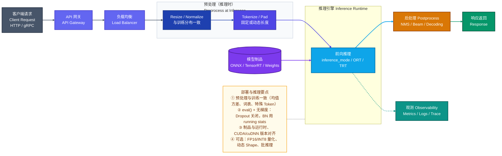

## 七、推理与部署流水线图（Inference & Deployment Pipeline）

### 7.1 适用场景

用于回答：模型**上线后**如何被调用？请求从客户端到最终响应经过哪些环节？推理使用哪种**运行时**与**制品**（checkpoint / ONNX / TensorRT 等）？后处理与训练阶段有何不同？观测与版本管理如何接入？

撰写部署文档、做模型交付、对比「训练流水线」与「线上流水线」差异、排查线上 shape/精度问题时使用。

- **方向选择**：用 `LR` 表示请求从左到右流经各阶段；若需强调「制品加载进引擎」，可用 `ART --> RT` 独立边表达。
- **与训练图的分工**：训练流程图（第四节）强调 **loss / backward / optimizer**；本图**不出现反向传播与梯度**，仅保留前向推理链路与工程组件（网关、负载均衡、观测等）。
- **可选分支**：量化路径（INT8/FP16）、动态 batch、流式生成多步循环等，用 `-.->` 标注为可选或条件路径，避免与主链路混淆。
- **配色**：客户端 / 网关 / 推理引擎 / 后处理 / 观测 / 制品使用第一节 **1.4** 中 `clientStyle`、`gatewayStyle`、`inferStyle`、`postStyle`、`obsStyle`、`artifactStyle`，与训练、数据流水线图区分职责。

### 7.2 分层与节点约定

| 层级 | 建议 subgraph 或节点 | 文字需说明的内容 |
|------|---------------------|----------------|
| **接入层** | 客户端、API 网关、负载均衡 | 协议（HTTP/gRPC）、鉴权、限流、路由规则 |
| **预处理（推理时）** | Resize、Normalize、Tokenizer、Padding | 与训练预处理**一致性与差异**（无数据增强或仅轻量增强） |
| **推理引擎** | PyTorch `inference_mode`、ONNX Runtime、TensorRT、Triton 等 | 运行时选型理由、batch 策略、设备（CPU/GPU） |
| **模型制品** | ONNX、Engine、原始权重 | 导出方式、版本号、与依赖库版本绑定 |
| **后处理** | NMS、阈值、Beam Search、解码、后校准 | 与论文指标对齐时的后处理细节 |
| **观测与运维** | 指标、日志、Tracing | 延迟分位、错误率、资源占用 |

节点标签仍遵循：**中文名 + ` ` 英文术语 + 可选第三行说明**；NOTE 中可写「推理时 BN 使用 running mean/var」「eval() 关闭 Dropout」等与训练差异要点。

### 7.3 完整参考原图

> **适用场景说明**：以下为**通用在线推理**参考（单区域、同步请求）。实际部署可替换为：Kubernetes + Ingress、边缘设备 + 云端回传、流式生成（长连接）等，仅需增删 subgraph 与边，配色与职责分层保持一致。
>
> 展示：客户端请求 → 网关与负载均衡 → 推理侧预处理 → 模型制品加载至推理引擎 → 后处理 → 响应；并行观测与制品依赖。

### 7.4 变体提示（按需增删）

| 变体 | 图中如何体现 |
|------|-------------|
| **仅单机脚本推理** | 省略 GW、LB；`CLIENT` 可直接连 `PRE` 或 `RT`。 |
| **流式生成（LLM）** | 在 `ENGINE` 内用 `-.->|"多步自回归 / 流式输出"|` 虚线回路表示 token 循环；`POST` 可标流式拼接与停止条件。 |
| **边缘 + 云端** | 两个并列 `subgraph`：边缘只做轻量预处理或小模型，`-.->` 云端大模型。 |
| **A/B 或多版本路由** | `gatewayStyle` 节点后分叉到 `RT_v1` / `RT_v2`，用标签注明流量比例。 |

---