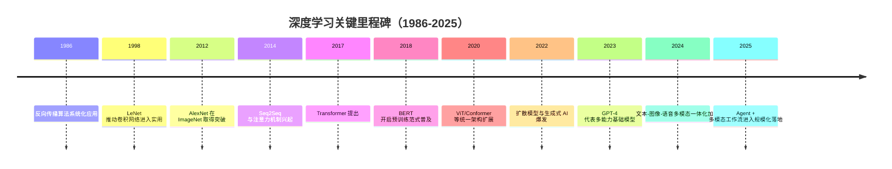

## 历史演进 / 里程碑 mermaid 时间线图风格参考

> 在展示历史事件、技术演进或产品关键节点时使用 Mermaid 时间线图，可参考以下风格规范。
> 时间线图适合呈现**离散的关键节点**，而非连续任务；它没有时长和依赖概念，重点是**时间顺序**与**事件意义**，回答"什么时候发生了什么"，而非"持续多久、前后如何协作"。
> 这是一份风格参考而非硬性要求，根据内容密度和叙事需求灵活取舍。

## 时间线图示例
> 展示深度学习领域的关键里程碑，体现年份粒度、多事件合并与线性叙事的典型写法

---

## 最佳实践速查

| 设计原则 | 说明 |
|----------|------|
| **与甘特图的场景区别** | 时间线图适合"某时间点发生了什么"的**叙事场景**（技术史、产品版本发布、里程碑回顾）；甘特图适合"任务持续多久、先后依赖如何"的**规划场景**；两者互补，按内容性质选用，不可混用 |
| **时间点格式自由** | 时间点标签不要求严格日期格式，可以是年份（`2017`）、季度（`2024 Q2`）、月份（`2026-03`）或自定义版本号（`v2.0`）；选择与内容语义匹配的粒度，不必追求精确到日 |
| **每个时间点支持多事件** | 语法为 `时间点 : 事件一 : 事件二 : 事件三`，以多个 ` : ` 分隔；同一时期的相关事件应合并至同一节点，避免时间点碎片化、节点密集难读 |
| **section 分类叙事** | 可用 `section` 将事件按主题分组（如 `section 模型架构` / `section 应用落地`），同一时间点下的事件在不同分组中共享时间轴，适合**多线并行演进**的历史叙述 |
| **描述简洁** | 每个事件描述控制在 **10-20 字**以内；时间线图是高层次概览工具，详细解释应放在配套文档中；描述过长会挤压相邻节点的显示空间，且反而模糊重点 |
| **时间跨度与粒度匹配** | 数十年演进选年份粒度，年度 roadmap 选季度，月度计划选月份；**粒度过细（如按天）会导致节点堆叠**，失去时间线图的可读优势；若需要天级精度，优先改用甘特图 |
| **顺序即意义** | 时间线图天然强调顺序关系，节点应按时间**升序排列**；若需突出某节点的重要性，可在描述中加修饰词（如"首次提出"、"重大突破"、"规模化落地"），而不是依赖颜色或样式 |
| **标题定义叙事边界** | `title` 应同时包含主题与时间范围（如"深度学习关键里程碑（1986-2025）"），让图表自解释；时间范围写入标题也便于后续扩展时判断是否需要新图 |
| **适用场景边界** | 时间线图**不适合**展示任务并行度、资源分配或精确工期；如需呈现"多个团队并行推进的任务"，应改用甘特图；如需呈现"系统各层组件关系"，应改用架构图 |
