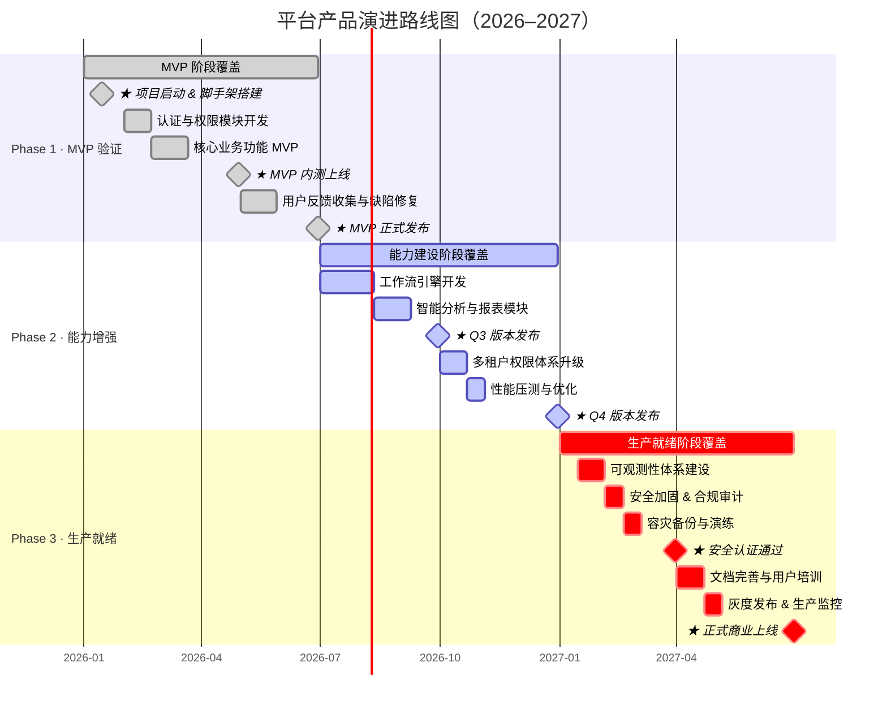

## 项目排期 mermaid 甘特图风格参考（增强版）

> 本模板融合了两种甘特图写法的优点：
> - **依赖链写法**（适合单线顺序推进的项目排期）：用 `after` 串联任务，延期自动顺延
> - **演进周期写法**（适合多线并行或版本历史展示）：背景条展示全段覆盖 + 里程碑点位打标
>
> 这是一份风格参考而非硬性要求，根据图表场景与复杂度灵活取舍。

## 甘特图示例
> 展示平台产品三阶段演进路线：每阶段含"演进周期"背景条、依赖任务链、★ 关键里程碑

---

## 最佳实践速查

| 设计原则 | 说明 |
|----------|------|
| **颜色方案：状态修饰符即调色盘** | 甘特图没有 `classDef` 机制，颜色由任务状态修饰符控制：`done`（灰绿）、`active`（蓝色）、`crit`（红色）、`crit, done`（深红/暗）、`crit, active`（橙红）、`active, done`（蓝灰）。**为每个 section 指定一个固定状态**，所有任务和里程碑继承该状态，形成与架构图 `classDef` 同等效果的"分层配色"。颜色无需硬编码，状态语义本身即是颜色 |
| **演进周期背景条** | 在 section 首行声明一条覆盖全段时间的普通任务（如 `MVP 阶段覆盖 :done, ph1_bg, 2026-01-01, 2026-06-30`），作为视觉底层"色带"；背景条不代表工作量，仅标示阶段边界，ID 命名建议加 `_bg` 后缀加以区分 |
| **★ 关键节点标注** | 在里程碑任务名称前加 `★`（如 `★ 正式上线`），不影响渲染语法，但在图表文本中形成视觉焦点；适用于版本首发、重大交付、外部评审等不可延误节点；普通里程碑无需 `★`，控制密度避免失效 |
| **里程碑声明规范** | 里程碑固定时长写 `0d`，语法为 `任务名 : [状态,] milestone, id, 日期, 0d`；时间点须与背景条的日期范围一致，否则节点会渲染在色带之外 |
| **注释分隔符** | 使用 `%% ── 标题（状态 · 颜色说明）────` 在每个 section 前插入可读注释，说明该 section 的颜色策略；注释不参与渲染，但显著提升图源代码的可维护性 |
| **两种写法混用策略** | **依赖链写法**：任务间有明确先后关系时，用 `after id` 串联，延期自动顺延，适合单线推进的项目阶段；**背景条 + 里程碑写法**：展示多框架/多产品并行演进或版本历史时，用绝对日期打点，更直观地呈现时间分布；两种写法可在同一图内共存，在同一 section 内混合使用 |
| **任务 ID 命名规范** | 以阶段前缀 + 类型 + 序号命名：背景条用 `ph1_bg`，普通任务用 `ph1_t1`，里程碑用 `ph1_m1`；分类前缀让 `after` 引用时来源一目了然，也便于后续扩展 |
| **section 标题设计** | 同时包含序号与阶段语义（如 `Phase 1 · MVP 验证`），`·` 作分隔符比 `—` 更轻量；标题全称写入 section 名，背景条任务名可简化为"XX 阶段覆盖" |
| **日期格式双轨制** | `dateFormat` 控制输入解析（固定用 `YYYY-MM-DD`），`axisFormat` 控制横轴展示（月级用 `%Y-%m`，日级用 `%m-%d`）；两者独立声明，`axisFormat` 粒度与时间跨度匹配 |
| **控制图表复杂度** | 背景条 + 里程碑模式下，每个 section 里程碑建议不超过 8 个，`★` 标注不超过 3 个；过密的节点会让时间轴拥挤，失去概览价值；精细子任务建议拆分至独立子图或配套文档 |
