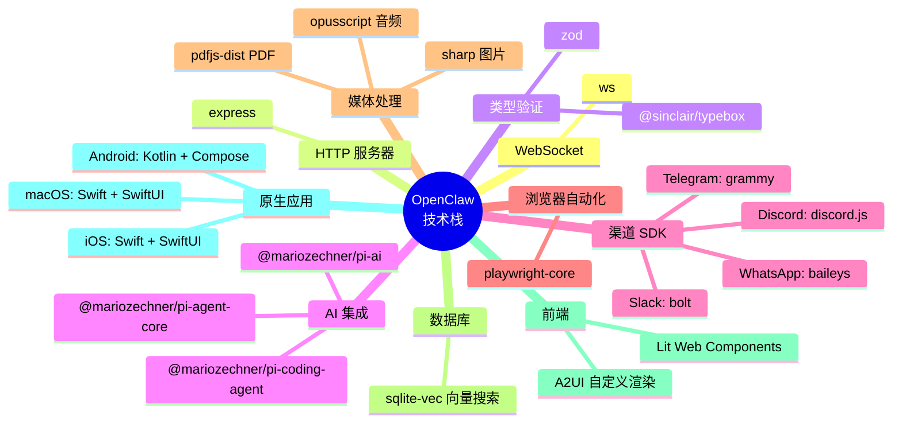

#### 关键依赖库

```mermaid
mindmap
  root((OpenClaw<br/>技术栈))
    WebSocket
      ws
    HTTP 服务器
      express
    类型验证
      @sinclair/typebox
      zod
    AI 集成
      @mariozechner/pi-agent-core
      @mariozechner/pi-ai
      @mariozechner/pi-coding-agent
    渠道 SDK
      WhatsApp: baileys
      Telegram: grammy
      Slack: bolt
      Discord: discord.js
    浏览器自动化
      playwright-core
    媒体处理
      sharp 图片
      opusscript 音频
      pdfjs-dist PDF
    数据库
      sqlite-vec 向量搜索
    前端
      Lit Web Components
      A2UI 自定义渲染
    原生应用
      macOS: Swift + SwiftUI
      iOS: Swift + SwiftUI
      Android: Kotlin + Compose
```