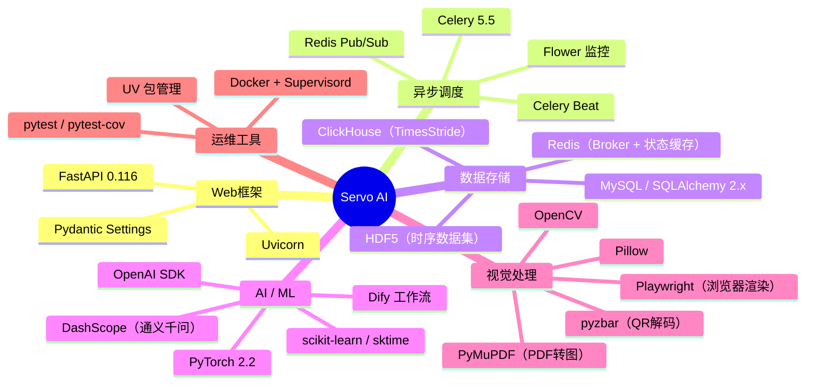

## 2. 技术栈全景

```mermaid
mindmap
  root((Servo AI))
    Web框架
      FastAPI 0.116
      Uvicorn
      Pydantic Settings
    异步调度
      Celery 5.5
      Redis Pub/Sub
      Celery Beat
      Flower 监控
    数据存储
      MySQL / SQLAlchemy 2.x
      ClickHouse（TimesStride）
      Redis（Broker + 状态缓存）
      HDF5（时序数据集）
    AI / ML
      OpenAI SDK
      DashScope（通义千问）
      Dify 工作流
      PyTorch 2.2
      scikit-learn / sktime
    视觉处理
      OpenCV
      Pillow
      PyMuPDF（PDF转图）
      pyzbar（QR解码）
      Playwright（浏览器渲染）
    运维工具
      Docker + Supervisord
      UV 包管理
      pytest / pytest-cov
```