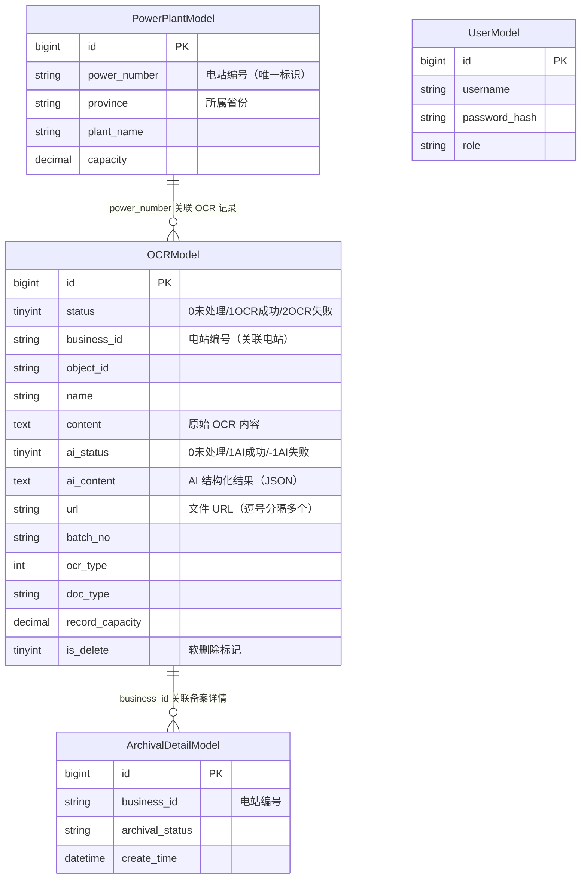

### 5.6 数据访问层

```mermaid
erDiagram
    OCRModel {
        bigint id PK
        tinyint status "0未处理/1OCR成功/2OCR失败"
        string business_id "电站编号（关联电站）"
        string object_id
        string name
        text content "原始 OCR 内容"
        tinyint ai_status "0未处理/1AI成功/-1AI失败"
        text ai_content "AI 结构化结果（JSON）"
        string url "文件 URL（逗号分隔多个）"
        string batch_no
        int ocr_type
        string doc_type
        decimal record_capacity
        tinyint is_delete "软删除标记"
    }

    ArchivalDetailModel {
        bigint id PK
        string business_id "电站编号"
        string archival_status
        datetime create_time
    }

    PowerPlantModel {
        bigint id PK
        string power_number "电站编号（唯一标识）"
        string province "所属省份"
        string plant_name
        decimal capacity
    }

    UserModel {
        bigint id PK
        string username
        string password_hash
        string role
    }

    OCRModel ||--o{ ArchivalDetailModel : "business_id 关联备案详情"
    PowerPlantModel ||--o{ OCRModel : "power_number 关联 OCR 记录"
```