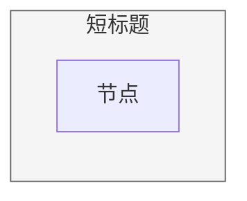
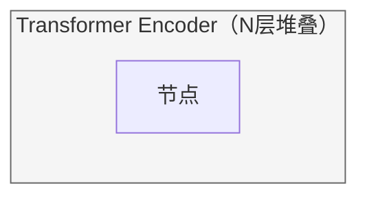
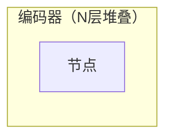
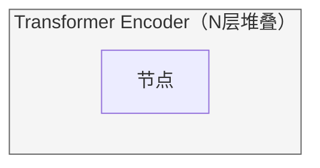

# Mermaid 子图标题测试

## 测试 1：短标题（正常显示）

```mermaid
flowchart LR
    classDef subgraphStyle fill:#f5f5f5,stroke:#666,stroke-width:1px,rounded:10px
    
    subgraph shortTitle["短标题"]
        A["节点"]
    end
    class shortTitle subgraphStyle
```

## 测试 2：长标题（BERT 中的标题）

```mermaid
flowchart LR
    classDef subgraphStyle fill:#f5f5f5,stroke:#666,stroke-width:1px,rounded:10px
    
    subgraph longTitle["Transformer Encoder（N层堆叠）"]
        A["节点"]
    end
    class longTitle subgraphStyle
```

## 测试 3：Transformer 中的标题

```mermaid
flowchart LR
    classDef subgraphStyle fill:#f5f5f5,stroke:#666,stroke-width:1px,rounded:10px
    
    subgraph transformerTitle["编码器（N层堆叠）"]
        A["节点"]
    end
    class longTitle subgraphStyle
```

## 测试 4：调整布局方向为 TB

```mermaid
flowchart TB
    classDef subgraphStyle fill:#f5f5f5,stroke:#666,stroke-width:1px,rounded:10px
    
    subgraph longTitle["Transformer Encoder（N层堆叠）"]
        A["节点"]
    end
    class longTitle subgraphStyle
```