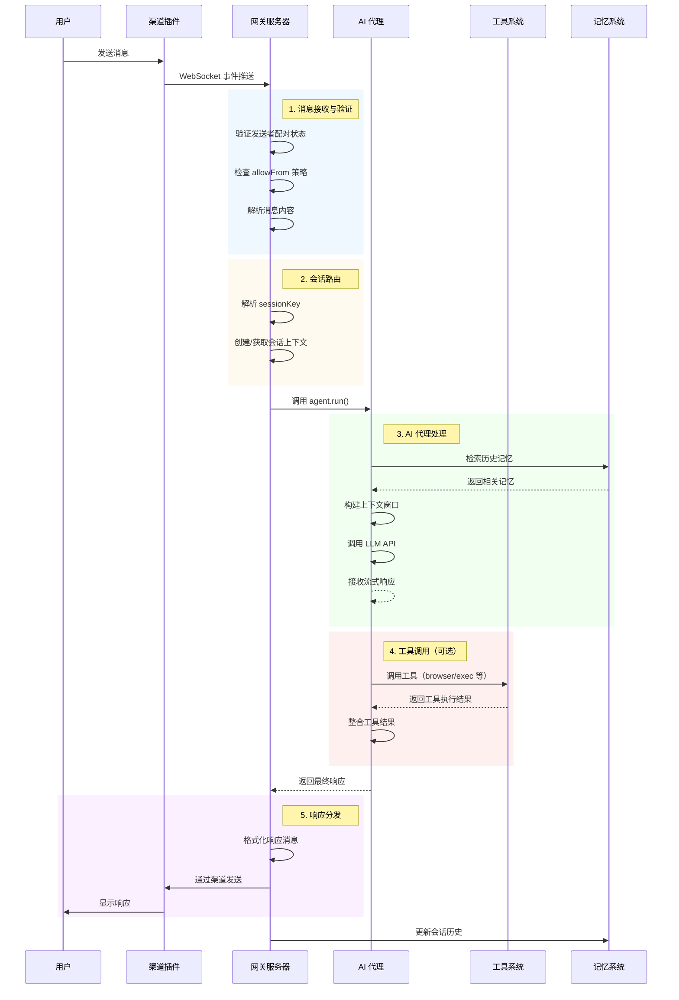

### 3.1 消息处理流程（后端请求流）

这是 OpenClaw 最核心的功能链路：用户通过通讯渠道发送消息 → 网关接收并路由 → AI 代理处理 → 返回响应。

```mermaid
sequenceDiagram
    participant User as 用户
    participant Channel as 渠道插件
    participant Gateway as 网关服务器
    participant Agent as AI 代理
    participant Tools as 工具系统
    participant Memory as 记忆系统
    
    User->>Channel: 发送消息
    Channel->>Gateway: WebSocket 事件推送
    
    rect rgb(240, 248, 255)
        Note right of Gateway: 1. 消息接收与验证
        Gateway->>Gateway: 验证发送者配对状态
        Gateway->>Gateway: 检查 allowFrom 策略
        Gateway->>Gateway: 解析消息内容
    end
    
    rect rgb(255, 250, 240)
        Note right of Gateway: 2. 会话路由
        Gateway->>Gateway: 解析 sessionKey
        Gateway->>Gateway: 创建/获取会话上下文
    end
    
    Gateway->>Agent: 调用 agent.run()
    
    rect rgb(240, 255, 240)
        Note right of Agent: 3. AI 代理处理
        Agent->>Memory: 检索历史记忆
        Memory-->>Agent: 返回相关记忆
        Agent->>Agent: 构建上下文窗口
        Agent->>Agent: 调用 LLM API
        Agent-->>Agent: 接收流式响应
    end
    
    rect rgb(255, 240, 240)
        Note right of Agent: 4. 工具调用（可选）
        Agent->>Tools: 调用工具（browser/exec 等）
        Tools-->>Agent: 返回工具执行结果
        Agent->>Agent: 整合工具结果
    end
    
    Agent-->>Gateway: 返回最终响应
    
    rect rgb(250, 240, 255)
        Note right of Gateway: 5. 响应分发
        Gateway->>Gateway: 格式化响应消息
        Gateway->>Channel: 通过渠道发送
        Channel->>User: 显示响应
    end
    
    Gateway->>Memory: 更新会话历史
```