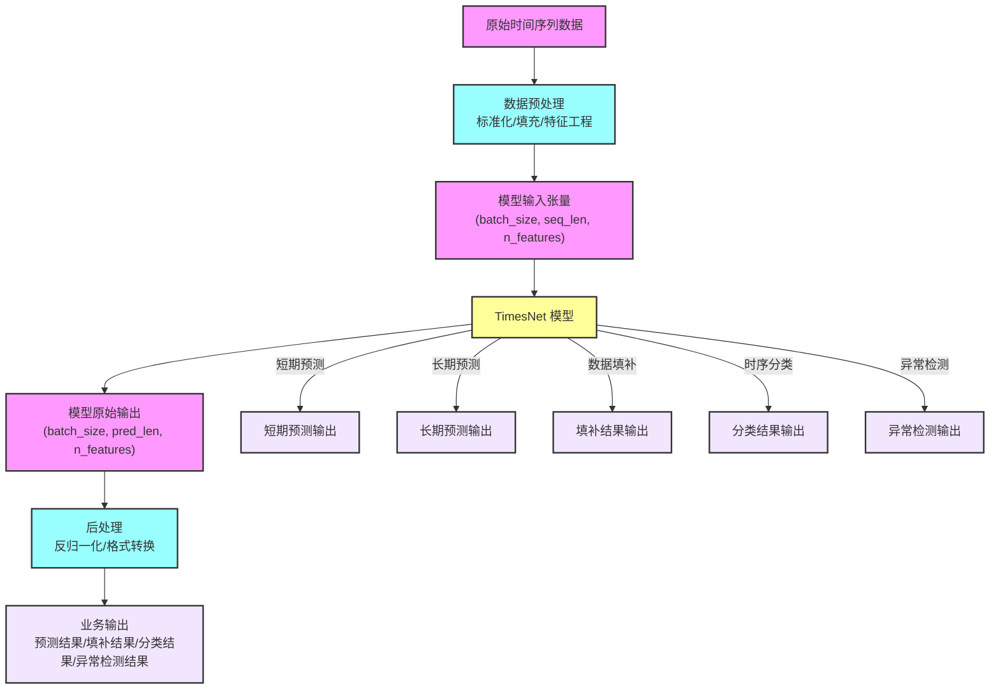

**标准 TimesNet 架构图**（时序预测SOTA模型，严格贴合论文核心：**1D时序→2D周期变换、时序分解、多尺度时间卷积、TimesBlock堆叠**），风格和你之前全套深度学习架构完全统一，可直接用于笔记/PPT。

# TimesNet 完整架构流程图

```mermaid
flowchart LR
    %% 统一样式（和Transformer/YOLO/SimCLR风格一致）
    classDef inputStyle fill:#f9f,stroke:#333,stroke-width:2px,rounded:8px
    classDef embedStyle fill:#ffd700,stroke:#333,stroke-width:2px,rounded:8px
    classDef blockStyle fill:#9ff,stroke:#333,stroke-width:2px,rounded:8px
    classDef convStyle fill:#9f9,stroke:#333,stroke-width:2px,rounded:8px
    classDef decompStyle fill:#ff9,stroke:#333,stroke-width:2px,rounded:8px
    classDef headStyle fill:#f2e6ff,stroke:#333,stroke-width:2px,rounded:8px
    classDef subgraphStyle fill:#f5f5f5,stroke:#666,stroke-width:1px,rounded:10px
    classDef coreNoteStyle fill:#fff8e6,stroke:#ffb74d,stroke-width:1px,rounded:8px

    %% 1. 输入层
    subgraph InputLayer["输入层"]
        A[一维时间序列<br/>Input Time Series]:::inputStyle
    end
    class InputLayer subgraphStyle

    %% 2. 嵌入层
    subgraph EmbedLayer["时序嵌入层"]
        B[Value Embedding<br/>数值嵌入]:::embedStyle
        C[Positional Embedding<br/>位置嵌入]:::embedStyle
        D[Embedding Sum<br/>特征融合]:::embedStyle
    end
    class EmbedLayer subgraphStyle

    %% 3. 核心：TimesBlock 堆叠（N层）
    subgraph TimesBlockStack["TimesBlock 堆叠 × N（核心）"]
        %% 单个TimesBlock
        subgraph TimesBlock["单层 TimesBlock"]
            %% 时序分解（趋势+季节+残差）
            subgraph STD["STD 时序分解"]
                E1[Trend 趋势项]:::decompStyle
                E2[Seasonal 季节项]:::decompStyle
                E3[Residual 残差项]:::decompStyle
            end
            class STD subgraphStyle

            %% TimesNet核心创新：1D→2D周期变换
            F1[FFT 周期检测<br/>频域分析确定周期长度]:::blockStyle
            F[1D→2D 周期变换<br/>按周期展开为二维矩阵]:::blockStyle

            %% 多尺度时间卷积（Inception结构）
            subgraph MultiScaleConv["多尺度时间卷积"]
                G[Conv1×1<br/>短周期]:::convStyle
                H[Conv3×3<br/>中周期]:::convStyle
                I[Conv5×5<br/>长周期]:::convStyle
            end
            class MultiScaleConv subgraphStyle

            J[Concat 特征拼接]:::convStyle
            K[Linear 投影<br/>周期特征融合]:::convStyle

            %% 残差连接+层归一化
            L[Add & Layer Norm]:::blockStyle
        end
        class TimesBlock subgraphStyle
    end
    class TimesBlockStack subgraphStyle

    %% 4. 预测输出层
    subgraph OutputLayer["预测头"]
        M[Flatten 展平<br/>2D→1D]:::headStyle
        N[Linear 预测层<br/>输出预测序列]:::headStyle
        O[预测结果<br/>Forecasting Output]:::inputStyle
    end
    class OutputLayer subgraphStyle

    %% 核心注释（TimesNet创新点）
    Note["TimesNet 核心创新：<br/>1. FFT 频域分析自动检测周期长度<br/>2. 1D时序转2D周期矩阵，用卷积捕获周期依赖<br/>3. 时序分解(STD)分离趋势/季节/噪声<br/>4. 多尺度卷积适配长短周期<br/>5. 专为长时序预测设计"]:::coreNoteStyle

    %% 数据流
    A --> B --> D
    A --> C --> D

    D --> STD
    E2 --> F1 --> F --> G & H & I --> J --> K --> L
    E1 --> L
    E3 --> L
    L --> M --> N --> O

    %% 连接线样式
    linkStyle 0,1,2,3 stroke:#ff7043,stroke-width:1.5px
    linkStyle 4,5,6,7,8,9,10,11,12,13 stroke:#4299e1,stroke-width:2px
    linkStyle 14,15,16 stroke:#9c27b0,stroke-width:2px
```

---

# TimesNet 极简核心总结

1. **定位**：**长时序预测** SOTA 模型，解决时序周期依赖建模难题
2. **核心Backbone**：**TimesBlock** 堆叠
3. **最大创新**
    - FFT 频域分析**自动检测周期长度**
    - 把**一维时序 → 二维周期矩阵**，用卷积高效提取周期特征
    - 时序分解（STD）分离**趋势项 + 季节项 + 残差项**
    - 多尺度卷积适配**短/中/长**不同周期
4. **结构范式**
输入 → 嵌入 → TimesBlock（分解+FFT周期检测+2D变换+多尺度卷积）→ 预测头

---

# 数据流转逻辑

## 一、模型输入

### 1. 原始数据形态
- **业务场景**：
  - 传感器监测数据（温度、湿度、压力等）
  - 金融市场数据（股票价格、交易量等）
  - 能源消耗数据（电力、水、燃气等）
  - 交通流量数据（车流量、客流量等）
- **数据格式**：
  - 时间序列数据，通常为 CSV、JSON 或数据库存储
  - 包含时间戳和多个特征值

### 2. 预处理后格式
- **张量维度**：`(batch_size, seq_len, n_features)`
  - `batch_size`：批量大小，通常为 32、64 或 128
  - `seq_len`：输入序列长度，根据任务不同可设置为 24、48、96 等
  - `n_features`：特征维度，即每个时间步的特征数量
- **数据类型**：
  - 数值型张量，通常为 float32 或 float64
- **预处理步骤**：
  - 标准化：将输入序列归一化到均值为 0、标准差为 1
  - 缺失值处理：使用插值或填充方法处理缺失数据
  - 特征工程：根据业务需求添加额外特征

### 3. 关键输入组件
- **Value Embedding**：将输入特征映射到高维空间
- **Positional Embedding**：添加位置信息，区分不同时间步
- **周期信息**：可选的外部周期信息（如星期几、节假日等）

## 二、模型输出

### 1. 模型原始输出
- **张量维度**：`(batch_size, pred_len, n_features)`
  - `pred_len`：预测长度，根据任务不同可设置为 1、24、48 等
- **数值类型**：float32 或 float64
- **输出含义**：预测的未来时间步的特征值

### 2. 后处理后结果
- **反归一化**：将预测值从标准化空间转换回原始数据空间
- **格式转换**：将张量转换为业务系统可处理的格式（如 CSV、JSON 等）
- **阈值处理**：对于分类任务，应用阈值将概率转换为类别

### 3. 业务含义
- **预测任务**：预测未来一段时间的数值
- **填补任务**：填充缺失的时间点数据
- **分类任务**：预测时间序列的类别标签
- **异常检测**：识别时间序列中的异常点

## 三、任务支持

### 1. 短期预测
- **输入**：近期历史数据（如过去 24 小时）
- **输出**：未来短期预测（如未来 1-6 小时）
- **模型调整**：无需特殊调整，使用默认架构

### 2. 长期预测
- **输入**：较长历史数据（如过去 7 天或更长）
- **输出**：未来长期预测（如未来 1-7 天）
- **模型调整**：
  - 增加 TimesBlock 堆叠层数
  - 调整序列长度和预测长度
  - 可能需要更多的计算资源

### 3. 数据填补
- **输入**：包含缺失值的时间序列
- **输出**：填补后的完整时间序列
- **模型调整**：
  - 调整损失函数，专注于缺失区域
  - 可能需要特殊的输入掩码

### 4. 时序分类
- **输入**：完整的时间序列
- **输出**：类别标签或概率分布
- **模型调整**：
  - 替换预测头为分类头（添加 Softmax 层）
  - 调整损失函数为交叉熵损失

### 5. 时序异常检测
- **输入**：正常和异常的时间序列
- **输出**：异常分数或异常标签
- **模型调整**：
  - 可以使用自编码器架构，计算重构误差作为异常分数
  - 或使用分类头直接预测异常标签

## 四、数据流转示意图

