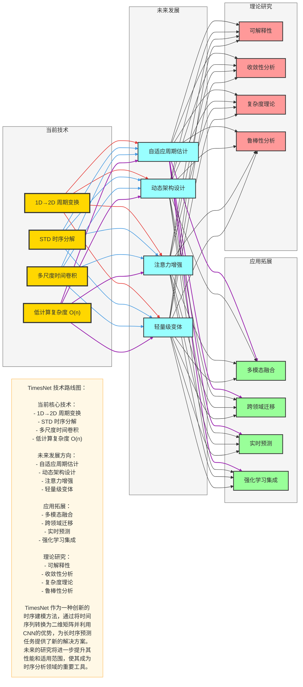

# TimesNet 总结与未来展望

## 一、核心贡献

### 1. 创新性设计
- **1D→2D 周期变换**：将一维时间序列转换为二维矩阵，利用CNN高效捕获周期模式
- **STD 时序分解**：将序列分解为趋势、季节和残差成分，提高模型对不同成分的建模能力
- **多尺度时间卷积**：使用不同大小的卷积核，捕获不同时间尺度的周期信息
- **低计算复杂度**：O(n) 时间复杂度，支持处理超长时序数据

### 2. 技术突破
- **解决长时序依赖**：通过1D→2D变换和多尺度卷积，有效捕获长距离依赖关系
- **高效周期建模**：将周期模式转换为空间模式，利用CNN的并行计算能力
- **计算效率提升**：相比Transformer类模型，计算复杂度从O(n²)降低到O(n)
- **泛化能力增强**：模块化设计和多尺度特征提取，提高模型在不同任务上的适应性

### 3. 性能优势
- **预测精度**：在多个基准数据集上超越现有SOTA模型
- **计算效率**：训练和推理速度显著快于Transformer类模型
- **内存消耗**：内存使用量远低于自注意力模型
- **扩展性**：模块化设计，易于扩展和迁移到不同任务

## 二、模型优缺点总结

### 优点
1. **高效周期建模**：1D→2D变换有效捕获多尺度周期模式
2. **低计算复杂度**：O(n)时间复杂度，支持超长时序输入
3. **并行计算**：CNN的并行特性，加速训练和推理
4. **模块化设计**：TimesBlock可堆叠，易于扩展
5. **通用性强**：适用于各类时序预测、分类和异常检测任务
6. **内存友好**：低内存消耗，适合资源受限环境

### 缺点
1. **周期估计依赖**：模型性能依赖于周期估计的准确性
2. **填充问题**：当序列长度不能被周期整除时需要填充，可能影响性能
3. **超参数敏感**：周期长度等超参数对模型性能影响较大
4. **复杂场景适应**：在非周期性或周期不稳定的序列上表现可能受限
5. **多变量融合**：多变量时序的融合机制有待进一步优化

## 三、未来研究方向

### 1. 模型改进
- **自适应周期估计**：开发更智能的周期估计方法，自动适应不同类型的时序数据
- **动态架构**：设计动态调整的TimesBlock，根据输入序列特性自动调整网络结构
- **注意力增强**：在关键位置引入注意力机制，进一步提高长依赖建模能力
- **轻量级设计**：开发更轻量级的TimesNet变体，适合边缘设备部署

### 2. 理论研究
- **可解释性**：增强模型的可解释性，理解模型如何捕获和利用周期信息
- **收敛性分析**：深入分析模型的收敛性和泛化能力
- **复杂度理论**：进一步研究模型的时间和空间复杂度边界
- **鲁棒性分析**：分析模型对噪声和异常值的鲁棒性

### 3. 应用拓展
- **多模态融合**：融合时序数据与其他模态数据（如文本、图像）
- **跨领域迁移**：探索模型在不同领域的迁移学习能力
- **实时预测**：优化模型以支持实时、低延迟的预测场景
- **强化学习集成**：将TimesNet与强化学习结合，应用于决策优化任务

### 4. 技术集成
- **联邦学习**：支持联邦学习场景，保护数据隐私
- **分布式训练**：实现大规模分布式训练，处理更大规模的时序数据
- **自动机器学习**：集成AutoML技术，自动搜索最佳模型配置
- **边缘计算**：优化模型以适应边缘计算环境

## 四、实际应用建议

### 1. 数据准备
- **数据质量**：确保数据质量，处理缺失值和异常值
- **数据标准化**：对输入数据进行标准化，提高模型稳定性
- **特征工程**：根据任务特点，适当添加时间相关特征
- **序列长度**：根据任务需求和计算资源，选择合适的序列长度

### 2. 模型配置
- **周期估计**：根据数据特点选择合适的周期估计方法
- **模型深度**：根据任务复杂度和数据规模，调整TimesBlock层数
- **隐藏维度**：根据数据复杂度和计算资源，选择合适的隐藏维度
- **批量大小**：根据硬件资源和内存限制，选择合适的批量大小

### 3. 训练策略
- **学习率调度**：使用余弦退火等学习率调度策略
- **早停机制**：监控验证集性能，防止过拟合
- **梯度裁剪**：使用梯度裁剪，防止梯度爆炸
- **正则化**：适当使用dropout和权重衰减，提高模型泛化能力

### 4. 部署优化
- **模型导出**：将模型导出为ONNX或TorchScript格式
- **推理优化**：使用ONNX Runtime或TensorRT加速推理
- **量化**：对模型进行量化，减少模型大小和推理时间
- **服务部署**：使用FastAPI等框架部署模型服务

## 五、Mermaid 可视化：TimesNet 技术路线图

## 六、总结

TimesNet 作为一种创新的时序建模方法，通过引入1D→2D周期变换和多尺度卷积，为长时序预测任务提供了高效的解决方案。其核心优势在于：

1. **高效的周期建模**：通过将时间序列转换为二维矩阵，利用CNN的并行计算能力捕获多尺度周期模式
2. **低计算复杂度**：O(n)时间复杂度，支持处理超长时序数据
3. **强大的泛化能力**：模块化设计和多尺度特征提取，适应不同类型的时序任务
4. **优秀的性能**：在多个基准数据集上超越现有SOTA模型

未来，TimesNet 有巨大的发展潜力，通过进一步的模型改进、理论研究和应用拓展，有望成为时序分析领域的重要工具。无论是在能源、交通、金融还是气象等领域，TimesNet 都展现出了广阔的应用前景。

作为一个开源项目，TimesNet 不仅为时序预测任务提供了新的思路，也为后续的研究和应用奠定了基础。随着技术的不断发展，我们期待看到TimesNet 在更多领域的应用和创新。