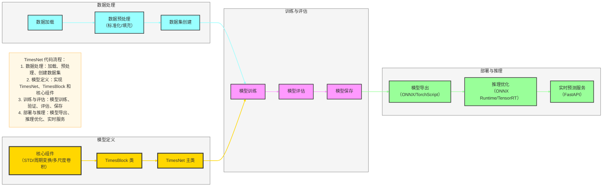

# TimesNet 代码实现与部署

## 一、Mermaid 可视化：TimesNet 代码流程



## 二、核心代码结构

### 1. 模型定义

#### TimesNet 主类
```python
import torch
import torch.nn as nn

class TimesNet(nn.Module):
    def __init__(self, seq_len, pred_len, hidden_dim=64, num_blocks=4):
        super(TimesNet, self).__init__()
        self.seq_len = seq_len
        self.pred_len = pred_len
        self.hidden_dim = hidden_dim
        
        # 嵌入层
        self.value_embedding = nn.Linear(1, hidden_dim)
        self.pos_embedding = nn.Parameter(torch.randn(seq_len, hidden_dim))
        
        # TimesBlock 堆叠
        self.blocks = nn.ModuleList([
            TimesBlock(hidden_dim) for _ in range(num_blocks)
        ])
        
        # 预测头
        self.flatten = nn.Flatten()
        self.linear = nn.Linear(seq_len * hidden_dim, pred_len)
    
    def forward(self, x):
        # 输入形状: (batch_size, seq_len, 1)
        batch_size = x.shape[0]
        
        # 嵌入
        x = self.value_embedding(x)
        x = x + self.pos_embedding
        
        # TimesBlock 处理
        for block in self.blocks:
            x = block(x)
        
        # 预测
        x = self.flatten(x)
        x = self.linear(x)
        
        return x
```

#### TimesBlock 类
```python
class TimesBlock(nn.Module):
    def __init__(self, hidden_dim):
        super(TimesBlock, self).__init__()
        self.hidden_dim = hidden_dim
        
        # STD 时序分解
        self.decompose = STDDecompose()
        
        # 1D→2D 周期变换
        self.transform = PeriodicTransform()
        
        # 多尺度卷积
        self.multi_scale_conv = MultiScaleConv(hidden_dim)
        
        # 残差连接和层归一化
        self.norm = nn.LayerNorm(hidden_dim)
    
    def forward(self, x):
        # 输入形状: (batch_size, seq_len, hidden_dim)
        batch_size, seq_len, hidden_dim = x.shape
        
        # STD 分解
        trend, seasonal = self.decompose(x)
        
        # 1D→2D 变换
        seasonal_2d = self.transform(seasonal)
        
        # 多尺度卷积
        seasonal_out = self.multi_scale_conv(seasonal_2d)
        
        # 残差连接
        out = trend + seasonal_out
        out = self.norm(out)
        
        return out
```

### 2. 核心组件实现

#### STD 时序分解
```python
class STDDecompose(nn.Module):
    def __init__(self, kernel_size=25):
        super(STDDecompose, self).__init__()
        self.kernel_size = kernel_size
        self.avg_pool = nn.AvgPool1d(kernel_size, stride=1, padding=kernel_size//2)
    
    def forward(self, x):
        # 输入形状: (batch_size, seq_len, hidden_dim)
        batch_size, seq_len, hidden_dim = x.shape
        
        # 趋势项：移动平均
        x = x.permute(0, 2, 1)
        trend = self.avg_pool(x)
        trend = trend.permute(0, 2, 1)
        
        # 季节项：原始值 - 趋势项
        seasonal = x.permute(0, 2, 1) - trend.permute(0, 2, 1)
        seasonal = seasonal.permute(0, 2, 1)
        
        return trend, seasonal
```

#### 1D→2D 周期变换
```python
class PeriodicTransform(nn.Module):
    def __init__(self):
        super(PeriodicTransform, self).__init__()
    
    def forward(self, x):
        # 输入形状: (batch_size, seq_len, hidden_dim)
        batch_size, seq_len, hidden_dim = x.shape
        
        # 简化版：假设周期 T=24（如日周期）
        T = 24
        if seq_len % T != 0:
            # 填充到 T 的倍数
            pad = T - (seq_len % T)
            x = nn.functional.pad(x, (0, 0, 0, pad))
            seq_len += pad
        
        # 1D→2D 变换
        x = x.view(batch_size, T, seq_len//T, hidden_dim)
        
        return x
```

#### 多尺度卷积
```python
class MultiScaleConv(nn.Module):
    def __init__(self, hidden_dim):
        super(MultiScaleConv, self).__init__()
        self.hidden_dim = hidden_dim
        
        # 多尺度卷积核
        self.conv1 = nn.Conv2d(hidden_dim, hidden_dim, kernel_size=(1, 1), padding=0)
        self.conv3 = nn.Conv2d(hidden_dim, hidden_dim, kernel_size=(3, 3), padding=1)
        self.conv5 = nn.Conv2d(hidden_dim, hidden_dim, kernel_size=(5, 5), padding=2)
        
        # 特征融合
        self.fusion = nn.Linear(3 * hidden_dim, hidden_dim)
    
    def forward(self, x):
        # 输入形状: (batch_size, T, L/T, hidden_dim)
        batch_size, T, L_div_T, hidden_dim = x.shape
        
        # 调整维度以适应卷积
        x = x.permute(0, 3, 1, 2)
        
        # 多尺度卷积
        out1 = self.conv1(x)
        out3 = self.conv3(x)
        out5 = self.conv5(x)
        
        # 特征拼接
        out = torch.cat([out1, out3, out5], dim=1)
        
        # 特征融合
        out = out.permute(0, 2, 3, 1)
        out = self.fusion(out)
        
        # 2D→1D 变换
        out = out.view(batch_size, T * L_div_T, hidden_dim)
        
        return out
```

## 二、数据加载与预处理

### 1. 数据加载
```python
import numpy as np
import pandas as pd
from torch.utils.data import Dataset, DataLoader

class TimeSeriesDataset(Dataset):
    def __init__(self, data, seq_len, pred_len):
        self.data = data
        self.seq_len = seq_len
        self.pred_len = pred_len
    
    def __len__(self):
        return len(self.data) - self.seq_len - self.pred_len + 1
    
    def __getitem__(self, idx):
        # 输入序列
        x = self.data[idx:idx+self.seq_len]
        # 目标序列
        y = self.data[idx+self.seq_len:idx+self.seq_len+self.pred_len]
        return torch.tensor(x, dtype=torch.float32), torch.tensor(y, dtype=torch.float32)

# 数据加载示例
def load_data(file_path):
    df = pd.read_csv(file_path)
    data = df['value'].values.reshape(-1, 1)
    
    # 标准化
    mean = data.mean()
    std = data.std()
    data = (data - mean) / std
    
    return data, mean, std

# 数据集划分
def split_data(data, train_ratio=0.7, val_ratio=0.15):
    total_len = len(data)
    train_len = int(total_len * train_ratio)
    val_len = int(total_len * val_ratio)
    
    train_data = data[:train_len]
    val_data = data[train_len:train_len+val_len]
    test_data = data[train_len+val_len:]
    
    return train_data, val_data, test_data
```

### 2. 数据加载器
```python
# 超参数
seq_len = 96  # 输入序列长度
pred_len = 24  # 预测序列长度
batch_size = 32

# 加载数据
data, mean, std = load_data('data.csv')
train_data, val_data, test_data = split_data(data)

# 创建数据集
train_dataset = TimeSeriesDataset(train_data, seq_len, pred_len)
val_dataset = TimeSeriesDataset(val_data, seq_len, pred_len)
test_dataset = TimeSeriesDataset(test_data, seq_len, pred_len)

# 创建数据加载器
train_loader = DataLoader(train_dataset, batch_size=batch_size, shuffle=True)
val_loader = DataLoader(val_dataset, batch_size=batch_size, shuffle=False)
test_loader = DataLoader(test_dataset, batch_size=batch_size, shuffle=False)
```

## 三、模型训练

### 1. 训练脚本
```python
def train(model, train_loader, val_loader, epochs=100, lr=1e-3):
    # 损失函数和优化器
    criterion = nn.MSELoss()
    optimizer = torch.optim.Adam(model.parameters(), lr=lr)
    scheduler = torch.optim.lr_scheduler.CosineAnnealingLR(optimizer, T_max=epochs)
    
    best_val_loss = float('inf')
    
    for epoch in range(epochs):
        # 训练
        model.train()
        train_loss = 0
        for x, y in train_loader:
            optimizer.zero_grad()
            output = model(x)
            loss = criterion(output, y.squeeze())
            loss.backward()
            optimizer.step()
            train_loss += loss.item()
        train_loss /= len(train_loader)
        
        # 验证
        model.eval()
        val_loss = 0
        with torch.no_grad():
            for x, y in val_loader:
                output = model(x)
                loss = criterion(output, y.squeeze())
                val_loss += loss.item()
            val_loss /= len(val_loader)
        
        # 学习率调度
        scheduler.step()
        
        # 保存最佳模型
        if val_loss < best_val_loss:
            best_val_loss = val_loss
            torch.save(model.state_dict(), 'best_timesnet.pth')
        
        print(f'Epoch {epoch+1}/{epochs}, Train Loss: {train_loss:.4f}, Val Loss: {val_loss:.4f}')

# 训练模型
model = TimesNet(seq_len, pred_len)
train(model, train_loader, val_loader, epochs=100)
```

### 2. 模型评估
```python
def evaluate(model, test_loader, mean, std):
    model.eval()
    predictions = []
    targets = []
    
    with torch.no_grad():
        for x, y in test_loader:
            output = model(x)
            predictions.extend(output.numpy())
            targets.extend(y.squeeze().numpy())
    
    # 反标准化
    predictions = np.array(predictions) * std + mean
    targets = np.array(targets) * std + mean
    
    # 计算评估指标
    mse = np.mean((predictions - targets) ** 2)
    mae = np.mean(np.abs(predictions - targets))
    
    print(f'MSE: {mse:.4f}, MAE: {mae:.4f}')
    return predictions, targets

# 加载最佳模型
model.load_state_dict(torch.load('best_timesnet.pth'))
# 评估模型
predictions, targets = evaluate(model, test_loader, mean, std)
```

## 四、模型部署

### 1. 模型导出
```python
# 导出为 ONNX 格式
torch.onnx.export(
    model,
    torch.randn(1, seq_len, 1),  # 示例输入
    'timesnet.onnx',
    input_names=['input'],
    output_names=['output'],
    dynamic_axes={'input': {0: 'batch_size'}, 'output': {0: 'batch_size'}}
)

# 导出为 TorchScript 格式
traced_model = torch.jit.trace(model, torch.randn(1, seq_len, 1))
traced_model.save('timesnet.pt')
```

### 2. 推理优化
- **ONNX Runtime**：使用 ONNX Runtime 加速推理
- **TensorRT**：对于 NVIDIA GPU，使用 TensorRT 进行推理优化
- **量化**：对模型进行量化，减少模型大小和推理时间

### 3. 实时预测服务

#### FastAPI 服务
```python
from fastapi import FastAPI, HTTPException
import torch
import numpy as np

app = FastAPI()

# 加载模型
model = TimesNet(seq_len, pred_len)
model.load_state_dict(torch.load('best_timesnet.pth'))
model.eval()

# 加载标准化参数
mean = 0.0  # 实际应用中从文件加载
std = 1.0   # 实际应用中从文件加载

@app.post('/predict')
def predict(data: list):
    try:
        # 转换输入数据
        x = np.array(data).reshape(1, seq_len, 1)
        x = (x - mean) / std
        x = torch.tensor(x, dtype=torch.float32)
        
        # 预测
        with torch.no_grad():
            output = model(x)
        
        # 反标准化
        output = output.numpy().flatten() * std + mean
        
        return {'predictions': output.tolist()}
    except Exception as e:
        raise HTTPException(status_code=400, detail=str(e))

if __name__ == '__main__':
    import uvicorn
    uvicorn.run(app, host='0.0.0.0', port=8000)
```

