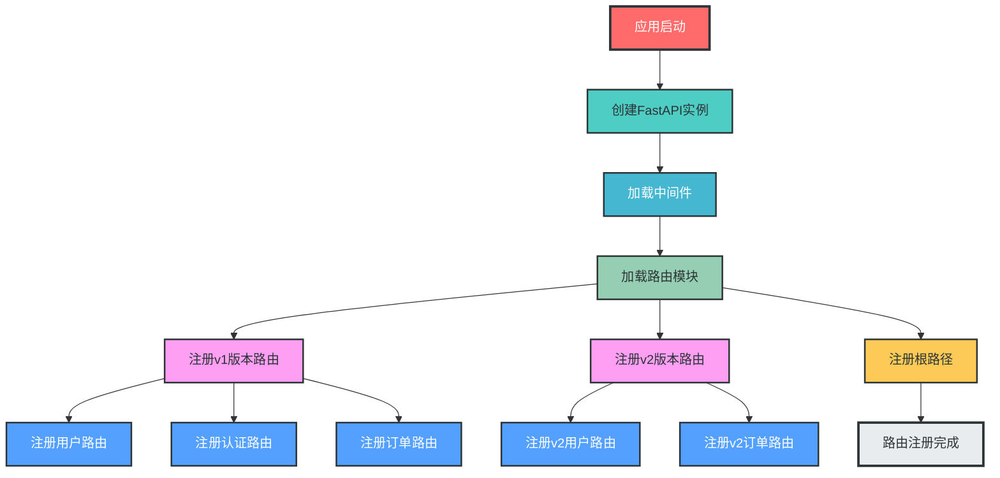
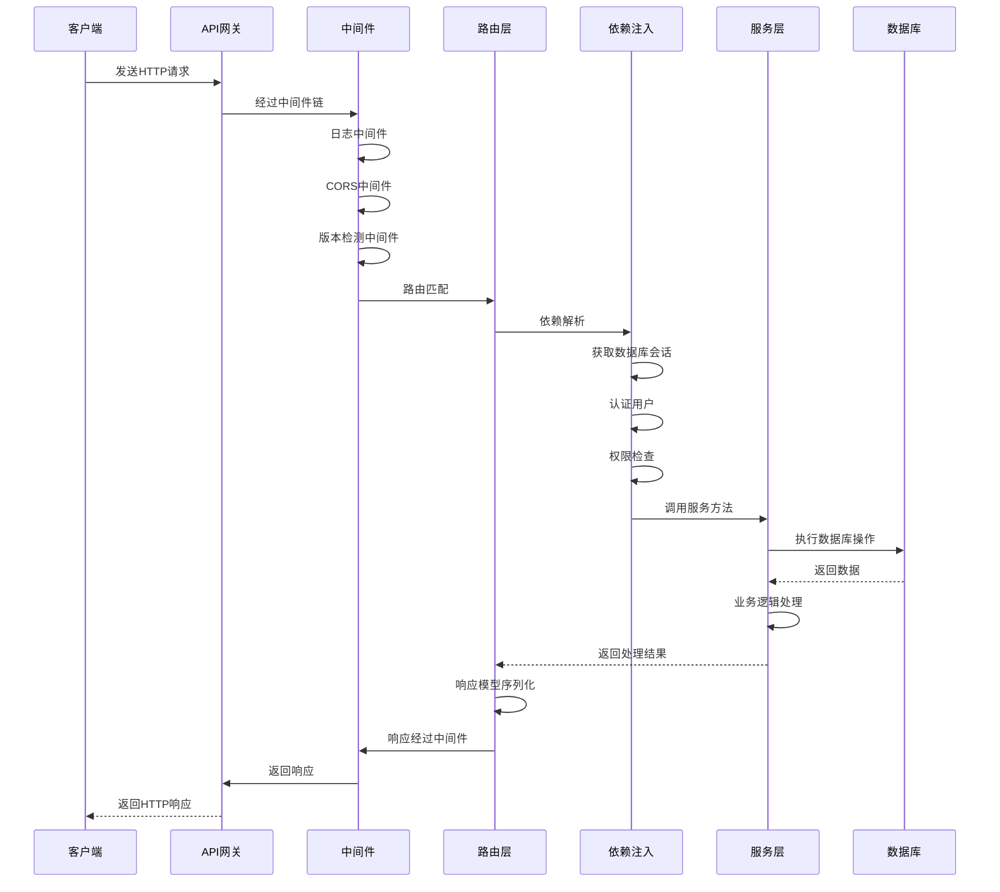
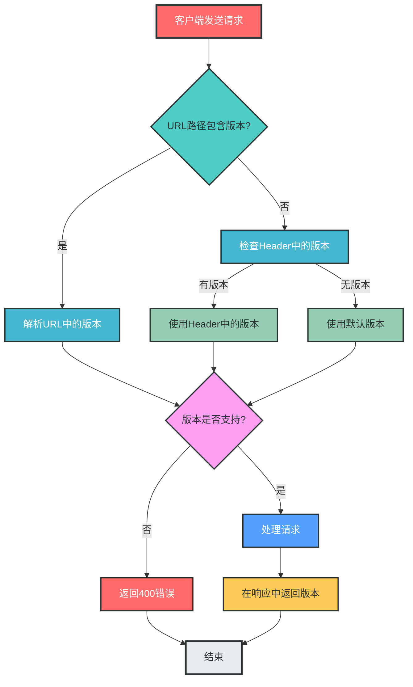
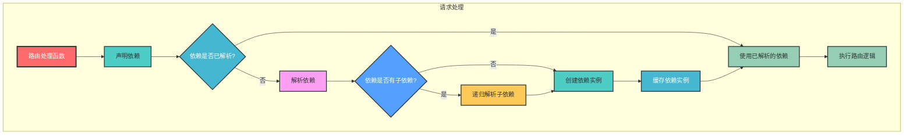
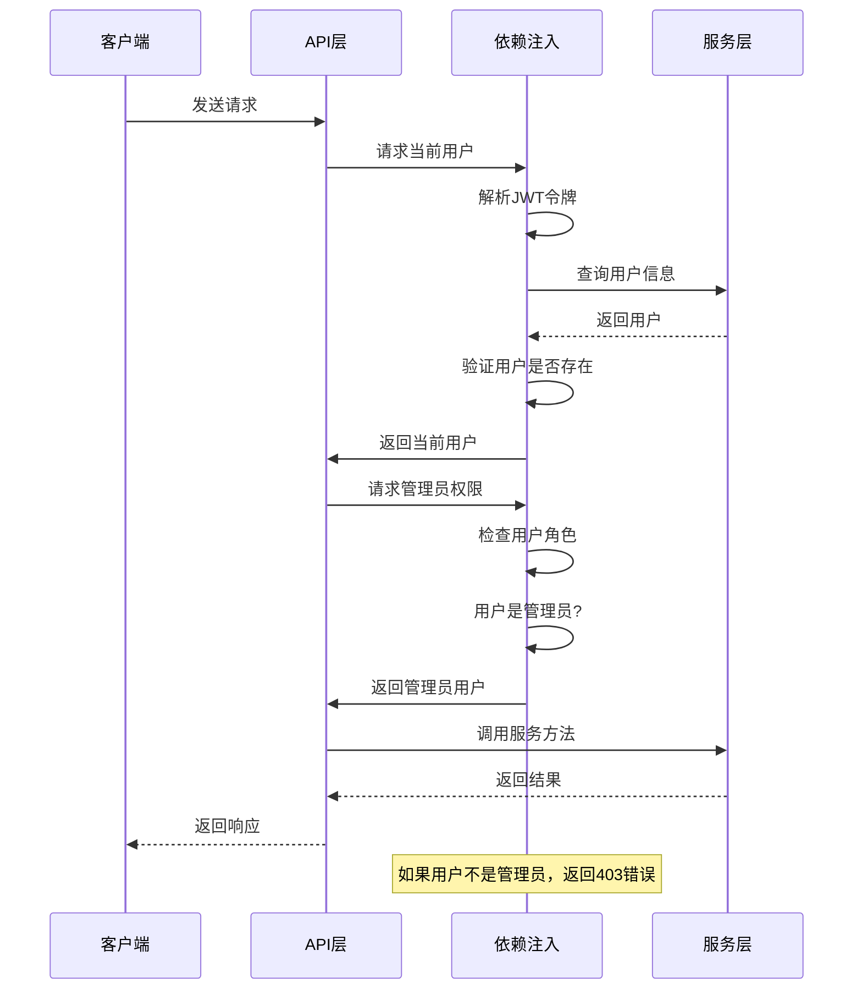

# FastAPI路由模块设计说明

## 一、路由设计原则

1. **RESTful API设计**：遵循RESTful设计规范，使用合适的HTTP方法和状态码
2. **清晰的URL结构**：URL应简洁、直观，反映资源层级关系
3. **API版本控制**：支持多版本API共存，便于平滑升级
4. **模块化设计**：按业务域划分路由，保持代码组织清晰
5. **依赖注入**：充分利用FastAPI的依赖注入系统，实现关注点分离
6. **中间件机制**：使用中间件处理横切关注点，如日志、认证、限流等
7. **自动文档生成**：利用FastAPI的自动文档功能，提高开发效率
8. **类型安全**：使用Pydantic模型进行请求和响应验证
9. **权限控制**：实现细粒度的权限控制，确保API安全
10. **可测试性**：设计易于测试的路由结构

## 二、路由目录结构

```
fastapi_mvc/
├── app/                     # 应用核心目录
│   ├── __init__.py
│   ├── main.py              # 应用入口（路由注册）
│   ├── routes/              # 路由模块（按业务域和版本划分）
│   │   ├── __init__.py      # 路由注册入口
│   │   ├── v1/              # v1版本路由
│   │   │   ├── __init__.py  # v1版本路由注册
│   │   │   ├── user.py       # 用户相关路由
│   │   │   ├── auth.py       # 认证相关路由
│   │   │   ├── order.py      # 订单相关路由
│   │   │   └── health.py     # 健康检查路由
│   │   └── v2/              # v2版本路由
│   │       ├── __init__.py  # v2版本路由注册
│   │       ├── user.py       # v2用户相关路由
│   │       └── order.py      # v2订单相关路由
│   ├── dependencies/        # 依赖注入模块
│   │   ├── __init__.py
│   │   ├── auth.py          # 认证依赖
│   │   ├── db.py            # 数据库依赖
│   │   └── rate_limit.py    # 限流依赖
│   ├── middleware/          # 中间件模块
│   │   ├── __init__.py
│   │   ├── logging.py       # 日志中间件
│   │   ├── cors.py          # CORS中间件
│   │   └── version.py       # 版本检测中间件
│   └── ...                  # 其他模块
└── ...                      # 其他目录
```

## 三、路由注册机制

### 1. 路由模块设计

```python
# app/routes/v1/user.py
from fastapi import APIRouter, Depends, HTTPException, status
from sqlalchemy.orm import Session
from typing import List

from app.schemas.v1.user import UserCreate, UserUpdate, UserResponse
from app.services.v1.user_service import UserService
from app.dependencies.db import get_db
from app.dependencies.auth import get_current_user, get_admin_user
from app.models.user import User

# 创建路由实例
router = APIRouter(
    prefix="/users",          # 路由前缀
    tags=["[v1] 用户管理"],  # 文档标签
    dependencies=[Depends(get_current_user)],  # 路由级依赖
    responses={404: {"description": "Not Found"}},  # 响应模型
)

# GET /api/v1/users
@router.get("/", response_model=List[UserResponse])
def get_users(
    skip: int = 0, 
    limit: int = 100,
    db: Session = Depends(get_db),
    current_user: User = Depends(get_current_user)
):
    """获取用户列表"""
    user_service = UserService(db)
    return user_service.get_users(skip=skip, limit=limit)

# GET /api/v1/users/{user_id}
@router.get("/{user_id}", response_model=UserResponse)
def get_user(
    user_id: int,
    db: Session = Depends(get_db),
    current_user: User = Depends(get_current_user)
):
    """获取用户详情"""
    user_service = UserService(db)
    user = user_service.get_user(user_id)
    if not user:
        raise HTTPException(status_code=404, detail="用户不存在")
    return user

# POST /api/v1/users
@router.post("/", response_model=UserResponse, status_code=status.HTTP_201_CREATED)
def create_user(
    user_in: UserCreate,
    db: Session = Depends(get_db),
    current_user: User = Depends(get_admin_user)
):
    """创建用户（仅管理员）"""
    user_service = UserService(db)
    return user_service.create_user(user_in)

# PUT /api/v1/users/{user_id}
@router.put("/{user_id}", response_model=UserResponse)
def update_user(
    user_id: int,
    user_in: UserUpdate,
    db: Session = Depends(get_db),
    current_user: User = Depends(get_admin_user)
):
    """更新用户（仅管理员）"""
    user_service = UserService(db)
    return user_service.update_user(user_id, user_in)

# DELETE /api/v1/users/{user_id}
@router.delete("/{user_id}", status_code=status.HTTP_204_NO_CONTENT)
def delete_user(
    user_id: int,
    db: Session = Depends(get_db),
    current_user: User = Depends(get_admin_user)
):
    """删除用户（仅管理员）"""
    user_service = UserService(db)
    user_service.delete_user(user_id)
    return None
```

### 2. 版本路由注册

```python
# app/routes/v1/__init__.py
from fastapi import APIRouter
from app.routes.v1 import user, auth, order, health

# 创建v1版本路由集合
api_v1_router = APIRouter(prefix="/v1")

# 注册各业务路由
api_v1_router.include_router(user.router, tags=["[v1] 用户管理"])
api_v1_router.include_router(auth.router, tags=["[v1] 认证管理"])
api_v1_router.include_router(order.router, tags=["[v1] 订单管理"])
api_v1_router.include_router(health.router, tags=["[v1] 健康检查"])
```

```python
# app/routes/__init__.py
from fastapi import APIRouter
from app.routes import v1, v2

# 创建主路由集合
api_router = APIRouter(prefix="/api")

# 注册各版本路由
api_router.include_router(v1.api_v1_router)
api_router.include_router(v2.api_v2_router)
```

### 3. 应用入口注册

```python
# app/main.py
from fastapi import FastAPI
from fastapi.middleware.cors import CORSMiddleware
from app.routes import api_router
from app.middleware.logging import LoggingMiddleware
from app.middleware.version import VersionCheckMiddleware
from app.config.settings import settings

# 创建FastAPI实例
app = FastAPI(
    title="FastAPI MVC",
    version="1.0.0",
    description="FastAPI生产级应用架构",
    docs_url="/docs",
    redoc_url="/redoc",
    openapi_url="/openapi.json"
)

# 添加中间件
app.add_middleware(
    CORSMiddleware,
    allow_origins=settings.CORS_ORIGINS,
    allow_credentials=True,
    allow_methods=["*"],
    allow_headers=["*"],
)
app.add_middleware(LoggingMiddleware)
app.add_middleware(VersionCheckMiddleware)

# 注册路由
app.include_router(api_router)

# 根路径
@app.get("/")
def root():
    return {"message": "Welcome to FastAPI MVC", "version": "1.0.0"}
```

## 四、API版本控制

### 1. URL路径版本控制

```python
# 示例URL格式
# v1版本: /api/v1/users
# v2版本: /api/v2/users
```

### 2. Header版本控制

```python
# app/middleware/version.py
from fastapi import Request, HTTPException
from starlette.middleware.base import BaseHTTPMiddleware
from app.config.version import SUPPORTED_VERSIONS, DEFAULT_API_VERSION

class VersionCheckMiddleware(BaseHTTPMiddleware):
    """版本检测中间件"""
    async def dispatch(self, request: Request, call_next):
        # 从Header获取版本
        api_version = request.headers.get("X-API-Version", DEFAULT_API_VERSION)
        
        # 验证版本是否支持
        if api_version not in SUPPORTED_VERSIONS:
            raise HTTPException(
                status_code=400,
                detail=f"不支持的API版本，支持的版本: {SUPPORTED_VERSIONS}"
            )
        
        # 将版本存储到request.state
        request.state.api_version = api_version
        
        # 处理请求
        response = await call_next(request)
        
        # 在响应头中返回版本
        response.headers["X-API-Version"] = api_version
        
        return response
```

## 五、中间件与依赖注入

### 1. 中间件设计

```python
# app/middleware/logging.py
from fastapi import Request
from starlette.middleware.base import BaseHTTPMiddleware
from app.logger.config import logger
import time

class LoggingMiddleware(BaseHTTPMiddleware):
    """日志中间件"""
    async def dispatch(self, request: Request, call_next):
        # 请求开始时间
        start_time = time.time()
        
        # 记录请求信息
        logger.info(f"请求开始: {request.method} {request.url}")
        
        # 处理请求
        response = await call_next(request)
        
        # 请求处理时间
        process_time = time.time() - start_time
        
        # 记录响应信息
        logger.info(
            f"请求结束: {request.method} {request.url} "
            f"状态码: {response.status_code} "
            f"处理时间: {process_time:.3f}s"
        )
        
        # 在响应头中添加处理时间
        response.headers["X-Process-Time"] = str(process_time)
        
        return response
```

### 2. 依赖注入设计

```python
# app/dependencies/auth.py
from fastapi import Depends, HTTPException, status
from fastapi.security import OAuth2PasswordBearer
from jose import JWTError, jwt
from sqlalchemy.orm import Session
from typing import Optional

from app.config.settings import settings
from app.models.user import User
from app.dependencies.db import get_db

# OAuth2密码流
oauth2_scheme = OAuth2PasswordBearer(tokenUrl="/api/v1/auth/token")

def get_current_user(
    token: str = Depends(oauth2_scheme),
    db: Session = Depends(get_db)
) -> User:
    """获取当前登录用户"""
    credentials_exception = HTTPException(
        status_code=status.HTTP_401_UNAUTHORIZED,
        detail="无效的认证凭据",
        headers={"WWW-Authenticate": "Bearer"},
    )
    
    try:
        # 解码JWT令牌
        payload = jwt.decode(
            token,
            settings.SECRET_KEY,
            algorithms=[settings.ALGORITHM]
        )
        user_id: str = payload.get("sub")
        if user_id is None:
            raise credentials_exception
    except JWTError:
        raise credentials_exception
    
    # 获取用户
    user = db.query(User).filter(User.id == user_id).first()
    if user is None:
        raise credentials_exception
    
    return user

def get_admin_user(
    current_user: User = Depends(get_current_user)
) -> User:
    """获取管理员用户"""
    if not current_user.is_admin:
        raise HTTPException(
            status_code=status.HTTP_403_FORBIDDEN,
            detail="需要管理员权限"
        )
    return current_user
```

## 六、路由权限控制

### 1. 基于依赖的权限控制

```python
# 示例：需要管理员权限的路由
@router.post("/", response_model=UserResponse, status_code=status.HTTP_201_CREATED)
def create_user(
    user_in: UserCreate,
    db: Session = Depends(get_db),
    current_user: User = Depends(get_admin_user)  # 管理员权限依赖
):
    """创建用户（仅管理员）"""
    # 实现逻辑...
```

### 2. 基于角色的权限控制

```python
# app/dependencies/role.py
from fastapi import Depends, HTTPException, status
from typing import List

from app.dependencies.auth import get_current_user
from app.models.user import User

def get_user_with_roles(required_roles: List[str]):
    """基于角色的权限控制依赖"""
    def role_checker(current_user: User = Depends(get_current_user)) -> User:
        # 检查用户角色是否包含所需角色
        if not any(role in current_user.roles for role in required_roles):
            raise HTTPException(
                status_code=status.HTTP_403_FORBIDDEN,
                detail=f"需要以下角色之一: {required_roles}"
            )
        return current_user
    return role_checker

# 使用示例
@router.get("/admin", dependencies=[Depends(get_user_with_roles(["admin", "superuser"]))])
def admin_dashboard():
    return {"message": "管理员面板"}
```

## 七、路由文档生成

### 1. 自动文档配置

```python
# app/main.py
app = FastAPI(
    title="FastAPI MVC",
    version="1.0.0",
    description="FastAPI生产级应用架构",
    docs_url="/docs",          # Swagger UI
    redoc_url="/redoc",        # ReDoc
    openapi_url="/openapi.json" # OpenAPI Schema
)
```

### 2. 路由文档注释

```python
@router.get("/users/{user_id}", response_model=UserResponse)
def get_user(user_id: int, db: Session = Depends(get_db)):
    """获取用户详情
    
    - **user_id**: 用户ID
    
    返回用户的详细信息，包括：
    - 用户基本信息
    - 角色信息
    - 创建时间
    
    示例响应：
    ```json
    {
        "id": 1,
        "username": "admin",
        "email": "admin@example.com",
        "is_active": true,
        "is_admin": true,
        "created_at": "2023-01-01T00:00:00"
    }
    ```
    """
    # 实现逻辑...
```

## 八、路由测试策略

### 1. 单元测试

```python
# tests/unit/test_user_routes.py
from fastapi.testclient import TestClient
from app.main import app
from unittest.mock import patch

client = TestClient(app)

@patch("app.services.v1.user_service.UserService.get_user")
def test_get_user(mock_get_user):
    """测试获取用户详情"""
    # 模拟服务层返回
    mock_get_user.return_value = {
        "id": 1,
        "username": "test",
        "email": "test@example.com",
        "is_active": True,
        "is_admin": False,
        "created_at": "2023-01-01T00:00:00"
    }
    
    # 发送请求
    response = client.get("/api/v1/users/1", headers={"Authorization": "Bearer test_token"})
    
    # 验证响应
    assert response.status_code == 200
    assert response.json()["username"] == "test"
    mock_get_user.assert_called_once_with(1)
```

### 2. 集成测试

```python
# tests/integration/test_user_routes.py
from fastapi.testclient import TestClient
from app.main import app
from app.database.connection import get_db
from app.database.base import Base
from sqlalchemy import create_engine
from sqlalchemy.orm import sessionmaker
import pytest

# 创建测试数据库引擎
SQLALCHEMY_DATABASE_URL = "sqlite:///./test.db"
engine = create_engine(
    SQLALCHEMY_DATABASE_URL,
    connect_args={"check_same_thread": False}
)

# 创建测试会话
TestingSessionLocal = sessionmaker(autocommit=False, autoflush=False, bind=engine)

# 创建测试表
Base.metadata.create_all(bind=engine)

# 依赖覆盖
@pytest.fixture
def override_get_db():
    db = TestingSessionLocal()
    try:
        yield db
    finally:
        db.close()

app.dependency_overrides[get_db] = override_get_db

# 创建测试客户端
client = TestClient(app)

def test_create_user():
    """测试创建用户"""
    # 发送请求
    response = client.post(
        "/api/v1/users",
        json={
            "username": "test",
            "email": "test@example.com",
            "password": "test123"
        },
        headers={"Authorization": "Bearer admin_token"}
    )
    
    # 验证响应
    assert response.status_code == 201
    assert response.json()["username"] == "test"
    assert response.json()["email"] == "test@example.com"
```

## 九、关键流程流程图

### 1. 路由注册流程



### 2. 请求处理流程



### 3. API版本控制流程



### 4. 依赖注入流程



### 5. 权限控制流程



## 十、最佳实践

1. **合理划分路由模块**：按业务域和版本划分路由，保持模块清晰
2. **使用路由前缀和标签**：提高API文档的可读性和组织性
3. **充分利用依赖注入**：实现关注点分离，提高代码复用性和可测试性
4. **使用中间件处理横切关注点**：如日志、CORS、限流等
5. **实现细粒度的权限控制**：确保API安全
6. **编写详细的文档注释**：自动生成高质量的API文档
7. **设计可测试的路由**：便于编写单元测试和集成测试
8. **使用响应模型**：确保API响应的一致性和类型安全
9. **实现API版本控制**：支持平滑升级和向后兼容
10. **监控和日志记录**：便于排查问题和性能优化

## 十一、总结

FastAPI的路由模块设计是构建生产级API的核心部分。通过合理的路由设计、模块化组织、版本控制、中间件和依赖注入，可以构建出高效、安全、可维护的API服务。

本设计说明提供了一个完整的FastAPI路由模块设计方案，包括路由结构、注册机制、API版本控制、中间件设计、依赖注入、权限控制、文档生成和测试策略。同时，通过mermaid流程图展示了关键流程，帮助开发者更好地理解和实现FastAPI路由模块。

遵循上述设计原则和最佳实践，可以构建出符合RESTful规范、易于维护和扩展的API服务，满足生产级应用的需求。