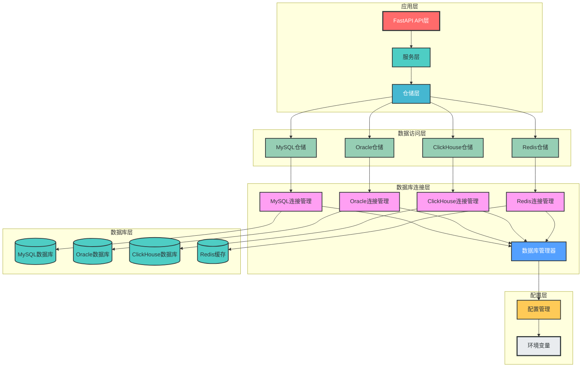
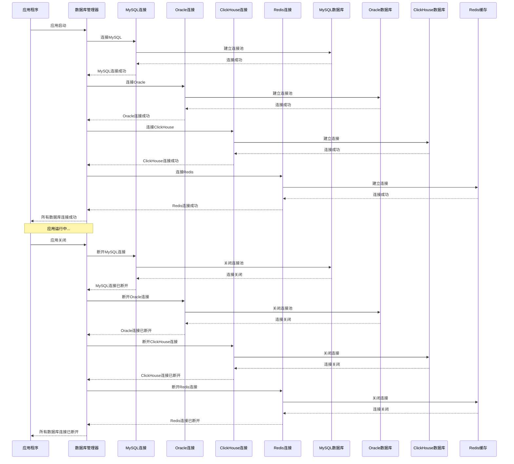
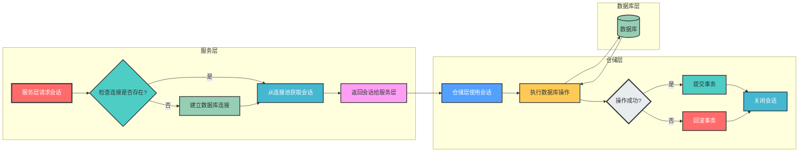
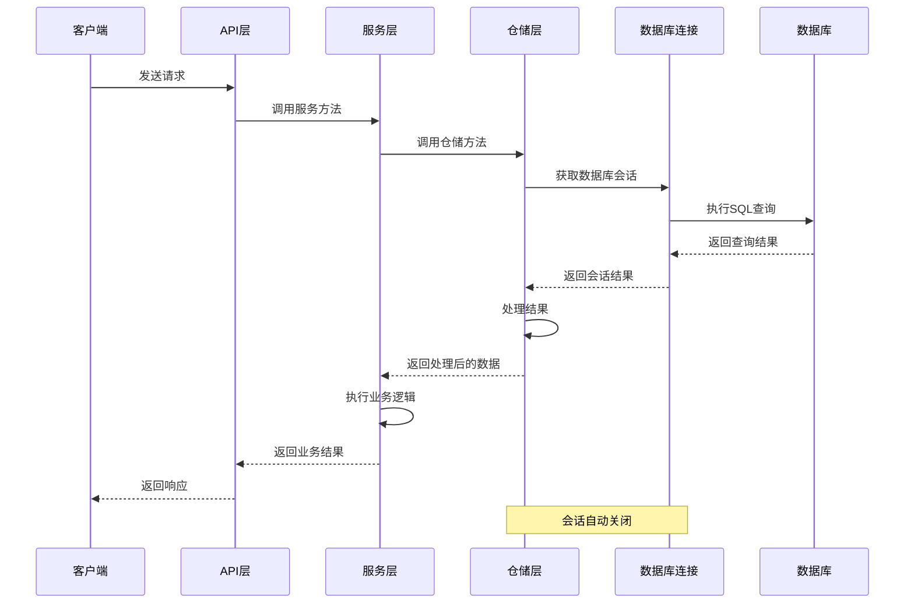
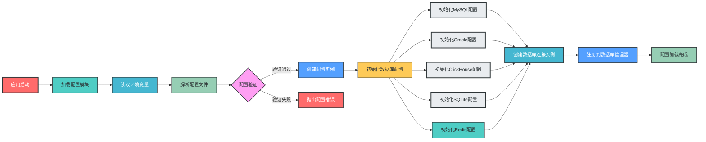

# 多数据库管理与配置设计

## 一、关键流程流程图

### 1. 多数据库架构整体架构图



### 2. 多数据库连接管理流程



### 3. 数据库会话获取流程



### 4. 仓储层调用流程



### 5. 配置加载流程



## 二、目录结构设计

```
fastapi_mvc/
├── app/                     # 应用核心目录
│   ├── __init__.py
│   ├── main.py              # 应用入口
│   ├── config/              # 配置模块
│   │   ├── __init__.py
│   │   ├── settings.py      # 主配置文件
│   │   ├── database.py      # 数据库配置
│   │   └── redis.py         # Redis配置
│   ├── databases/           # 多数据库管理模块
│   │   ├── __init__.py
│   │   ├── base.py          # 数据库基类和通用工具
│   │   ├── mysql/           # MySQL数据库模块
│   │   │   ├── __init__.py
│   │   │   ├── connection.py # MySQL连接管理
│   │   │   ├── session.py    # MySQL会话管理
│   │   │   └── base.py       # MySQL模型基类
│   │   ├── oracle/          # Oracle数据库模块
│   │   │   ├── __init__.py
│   │   │   ├── connection.py # Oracle连接管理
│   │   │   └── session.py    # Oracle会话管理
│   │   ├── clickhouse/      # ClickHouse数据库模块
│   │   │   ├── __init__.py
│   │   │   ├── connection.py # ClickHouse连接管理
│   │   │   └── session.py    # ClickHouse会话管理
│   │   ├── sqlite/          # SQLite数据库模块
│   │   │   ├── __init__.py
│   │   │   ├── connection.py # SQLite连接管理
│   │   │   └── base.py       # SQLite模型基类
│   │   └── redis/           # Redis缓存模块
│   │       ├── __init__.py
│   │       ├── client.py     # Redis客户端封装
│   │       └── cache.py      # 缓存工具类
│   ├── repositories/        # 仓储层（按业务域和数据库类型划分）
│   │   ├── mysql/           # MySQL仓储实现
│   │   │   ├── user_repository.py
│   │   │   └── order_repository.py
│   │   ├── clickhouse/      # ClickHouse仓储实现
│   │   │   └── analytics_repository.py
│   │   └── sqlite/          # SQLite仓储实现
│   │       └── test_repository.py
│   └── ...                  # 其他模块
├── .env                     # 开发环境变量
├── .env.prod                # 生产环境变量
└── .env.test                # 测试环境变量
```

## 三、配置管理设计

### 1. 主配置文件

```python
# app/config/settings.py
from pydantic_settings import BaseSettings
from typing import Optional

class Settings(BaseSettings):
    """主配置类"""
    
    # 应用基本配置
    APP_NAME: str = "FastAPI MVC"
    APP_VERSION: str = "1.0.0"
    DEBUG: bool = True
    
    # 环境变量配置
    class Config:
        env_file = ".env"
        env_file_encoding = "utf-8"

# 全局配置实例
settings = Settings()
```

### 2. 数据库配置

```python
# app/config/database.py
from pydantic_settings import BaseSettings
from typing import Dict, Any, Optional

class MySQLConfig(BaseSettings):
    """MySQL数据库配置"""
    HOST: str = "localhost"
    PORT: int = 3306
    USER: str = "root"
    PASSWORD: str = "password"
    DATABASE: str = "fastapi_mvc"
    CHARSET: str = "utf8mb4"
    POOL_SIZE: int = 10
    MAX_OVERFLOW: int = 20
    POOL_PRE_PING: bool = True
    
    @property
    def URL(self) -> str:
        """生成MySQL连接URL"""
        return f"mysql+pymysql://{self.USER}:{self.PASSWORD}@{self.HOST}:{self.PORT}/{self.DATABASE}?charset={self.CHARSET}"
    
    class Config:
        env_prefix = "MYSQL_"
        env_file = ".env"

class OracleConfig(BaseSettings):
    """Oracle数据库配置"""
    HOST: str = "localhost"
    PORT: int = 1521
    USER: str = "sys"
    PASSWORD: str = "password"
    SERVICE_NAME: str = "ORCLPDB1"
    
    @property
    def URL(self) -> str:
        """生成Oracle连接URL"""
        return f"oracle+cx_oracle://{self.USER}:{self.PASSWORD}@{self.HOST}:{self.PORT}/?service_name={self.SERVICE_NAME}"
    
    class Config:
        env_prefix = "ORACLE_"
        env_file = ".env"

class ClickHouseConfig(BaseSettings):
    """ClickHouse数据库配置"""
    HOST: str = "localhost"
    PORT: int = 8123
    USER: str = "default"
    PASSWORD: str = ""
    DATABASE: str = "default"
    
    @property
    def URL(self) -> str:
        """生成ClickHouse连接URL"""
        return f"clickhouse+http://{self.USER}:{self.PASSWORD}@{self.HOST}:{self.PORT}/{self.DATABASE}"
    
    class Config:
        env_prefix = "CLICKHOUSE_"
        env_file = ".env"

class SQLiteConfig(BaseSettings):
    """SQLite数据库配置"""
    DATABASE_FILE: str = "app.db"
    
    @property
    def URL(self) -> str:
        """生成SQLite连接URL"""
        return f"sqlite:///{self.DATABASE_FILE}"
    
    class Config:
        env_prefix = "SQLITE_"
        env_file = ".env"

# 数据库配置实例
mysql_config = MySQLConfig()
oracle_config = OracleConfig()
clickhouse_config = ClickHouseConfig()
sqlite_config = SQLiteConfig()
```

### 3. Redis配置

```python
# app/config/redis.py
from pydantic_settings import BaseSettings

class RedisConfig(BaseSettings):
    """Redis配置"""
    HOST: str = "localhost"
    PORT: int = 6379
    PASSWORD: str = ""
    DB: int = 0
    PREFIX: str = "fastapi_mvc"
    
    @property
    def URL(self) -> str:
        """生成Redis连接URL"""
        if self.PASSWORD:
            return f"redis://:{self.PASSWORD}@{self.HOST}:{self.PORT}/{self.DB}"
        return f"redis://{self.HOST}:{self.PORT}/{self.DB}"
    
    class Config:
        env_prefix = "REDIS_"
        env_file = ".env"

# Redis配置实例
redis_config = RedisConfig()
```

## 四、多数据库连接管理

### 1. 数据库基类

```python
# app/databases/base.py
from abc import ABC, abstractmethod
from typing import Any, Generator, Dict

class DatabaseConnection(ABC):
    """数据库连接基类"""
    
    @abstractmethod
    def connect(self) -> Any:
        """建立数据库连接"""
        pass
    
    @abstractmethod
    def disconnect(self) -> None:
        """断开数据库连接"""
        pass
    
    @abstractmethod
    def get_session(self) -> Generator[Any, None, None]:
        """获取数据库会话"""
        pass

class DatabaseManager:
    """数据库管理器，管理多个数据库连接"""
    
    def __init__(self):
        self._connections: Dict[str, DatabaseConnection] = {}
    
    def register(self, name: str, connection: DatabaseConnection) -> None:
        """注册数据库连接"""
        self._connections[name] = connection
    
    def get(self, name: str) -> DatabaseConnection:
        """获取数据库连接"""
        if name not in self._connections:
            raise ValueError(f"Database connection '{name}' not registered")
        return self._connections[name]
    
    def connect_all(self) -> None:
        """连接所有数据库"""
        for name, connection in self._connections.items():
            connection.connect()
    
    def disconnect_all(self) -> None:
        """断开所有数据库连接"""
        for name, connection in self._connections.items():
            connection.disconnect()

# 全局数据库管理器实例
database_manager = DatabaseManager()
```

### 2. MySQL连接管理

```python
# app/databases/mysql/connection.py
from sqlalchemy import create_engine
from sqlalchemy.ext.declarative import declarative_base
from sqlalchemy.orm import sessionmaker
from app.config.database import mysql_config
from app.databases.base import DatabaseConnection
from app.logger.config import logger

class MySQLConnection(DatabaseConnection):
    """MySQL数据库连接管理"""
    
    def __init__(self):
        self._engine = None
        self._SessionLocal = None
        self._Base = declarative_base()
    
    def connect(self):
        """建立MySQL连接"""
        try:
            self._engine = create_engine(
                mysql_config.URL,
                pool_size=mysql_config.POOL_SIZE,
                max_overflow=mysql_config.MAX_OVERFLOW,
                pool_pre_ping=mysql_config.POOL_PRE_PING
            )
            self._SessionLocal = sessionmaker(autocommit=False, autoflush=False, bind=self._engine)
            # 测试连接
            with self._engine.connect() as conn:
                conn.execute("SELECT 1")
            logger.info("MySQL连接成功")
        except Exception as e:
            logger.error(f"MySQL连接失败: {str(e)}")
            raise
    
    def disconnect(self):
        """断开MySQL连接"""
        if self._engine:
            self._engine.dispose()
            logger.info("MySQL连接已断开")
    
    def get_session(self):
        """获取MySQL会话"""
        if not self._SessionLocal:
            self.connect()
        db = self._SessionLocal()
        try:
            yield db
        finally:
            db.close()
    
    @property
    def engine(self):
        """获取MySQL引擎"""
        if not self._engine:
            self.connect()
        return self._engine
    
    @property
    def Base(self):
        """获取MySQL模型基类"""
        return self._Base

# MySQL连接实例
mysql_connection = MySQLConnection()
```

### 3. Oracle连接管理

```python
# app/databases/oracle/connection.py
from sqlalchemy import create_engine
from sqlalchemy.ext.declarative import declarative_base
from sqlalchemy.orm import sessionmaker
from app.config.database import oracle_config
from app.databases.base import DatabaseConnection
from app.logger.config import logger

class OracleConnection(DatabaseConnection):
    """Oracle数据库连接管理"""
    
    def __init__(self):
        self._engine = None
        self._SessionLocal = None
        self._Base = declarative_base()
    
    def connect(self):
        """建立Oracle连接"""
        try:
            self._engine = create_engine(
                oracle_config.URL,
                pool_size=10,
                max_overflow=20,
                pool_pre_ping=True
            )
            self._SessionLocal = sessionmaker(autocommit=False, autoflush=False, bind=self._engine)
            # 测试连接
            with self._engine.connect() as conn:
                conn.execute("SELECT 1 FROM DUAL")
            logger.info("Oracle连接成功")
        except Exception as e:
            logger.error(f"Oracle连接失败: {str(e)}")
            raise
    
    def disconnect(self):
        """断开Oracle连接"""
        if self._engine:
            self._engine.dispose()
            logger.info("Oracle连接已断开")
    
    def get_session(self):
        """获取Oracle会话"""
        if not self._SessionLocal:
            self.connect()
        db = self._SessionLocal()
        try:
            yield db
        finally:
            db.close()
    
    @property
    def engine(self):
        """获取Oracle引擎"""
        if not self._engine:
            self.connect()
        return self._engine
    
    @property
    def Base(self):
        """获取Oracle模型基类"""
        return self._Base

# Oracle连接实例
oracle_connection = OracleConnection()
```

### 4. ClickHouse连接管理

```python
# app/databases/clickhouse/connection.py
from clickhouse_driver import Client
from clickhouse_sqlalchemy import make_session
from sqlalchemy import create_engine
from app.config.database import clickhouse_config
from app.databases.base import DatabaseConnection
from app.logger.config import logger

class ClickHouseConnection(DatabaseConnection):
    """ClickHouse数据库连接管理"""
    
    def __init__(self):
        self._client = None
        self._engine = None
    
    def connect(self):
        """建立ClickHouse连接"""
        try:
            # 原生客户端连接
            self._client = Client(
                host=clickhouse_config.HOST,
                port=clickhouse_config.PORT,
                user=clickhouse_config.USER,
                password=clickhouse_config.PASSWORD,
                database=clickhouse_config.DATABASE
            )
            # SQLAlchemy引擎连接
            self._engine = create_engine(clickhouse_config.URL)
            # 测试连接
            self._client.execute("SELECT 1")
            logger.info("ClickHouse连接成功")
        except Exception as e:
            logger.error(f"ClickHouse连接失败: {str(e)}")
            raise
    
    def disconnect(self):
        """断开ClickHouse连接"""
        if self._client:
            self._client.disconnect()
            logger.info("ClickHouse连接已断开")
    
    def get_session(self):
        """获取ClickHouse会话"""
        if not self._engine:
            self.connect()
        session = make_session(self._engine)
        try:
            yield session
        finally:
            session.close()
    
    @property
    def client(self):
        """获取ClickHouse原生客户端"""
        if not self._client:
            self.connect()
        return self._client
    
    @property
    def engine(self):
        """获取ClickHouse引擎"""
        if not self._engine:
            self.connect()
        return self._engine

# ClickHouse连接实例
clickhouse_connection = ClickHouseConnection()
```

### 5. Redis连接管理

```python
# app/databases/redis/client.py
import redis
from app.config.redis import redis_config
from app.logger.config import logger
from typing import Any, Optional

class RedisClient:
    """Redis客户端封装"""
    
    def __init__(self):
        self._client = None
        self._prefix = redis_config.PREFIX
    
    def connect(self):
        """建立Redis连接"""
        try:
            self._client = redis.from_url(
                redis_config.URL,
                decode_responses=True
            )
            # 测试连接
            self._client.ping()
            logger.info("Redis连接成功")
        except Exception as e:
            logger.error(f"Redis连接失败: {str(e)}")
            raise
    
    def disconnect(self):
        """断开Redis连接"""
        if self._client:
            self._client.close()
            logger.info("Redis连接已断开")
    
    @property
    def client(self):
        """获取Redis客户端实例"""
        if not self._client:
            self.connect()
        return self._client
    
    def get_key(self, key: str) -> str:
        """添加前缀的完整键名"""
        return f"{self._prefix}:{key}"
    
    def get(self, key: str) -> Optional[str]:
        """获取缓存"""
        return self.client.get(self.get_key(key))
    
    def set(self, key: str, value: Any, expire: int = 3600) -> bool:
        """设置缓存"""
        return self.client.set(self.get_key(key), value, ex=expire)
    
    def delete(self, key: str) -> bool:
        """删除缓存"""
        return bool(self.client.delete(self.get_key(key)))

# Redis客户端实例
redis_client = RedisClient()
```

### 6. SQLite连接管理

```python
# app/databases/sqlite/connection.py
from sqlalchemy import create_engine
from sqlalchemy.ext.declarative import declarative_base
from sqlalchemy.orm import sessionmaker
from app.config.database import sqlite_config
from app.databases.base import DatabaseConnection
from app.logger.config import logger

class SQLiteConnection(DatabaseConnection):
    """SQLite数据库连接管理"""
    
    def __init__(self):
        self._engine = None
        self._SessionLocal = None
        self._Base = declarative_base()
    
    def connect(self):
        """建立SQLite连接"""
        try:
            self._engine = create_engine(
                sqlite_config.URL,
                connect_args={"check_same_thread": False}  # SQLite特定配置，允许在多线程中使用
            )
            self._SessionLocal = sessionmaker(autocommit=False, autoflush=False, bind=self._engine)
            # 测试连接
            with self._engine.connect() as conn:
                conn.execute("SELECT 1")
            logger.info("SQLite连接成功")
        except Exception as e:
            logger.error(f"SQLite连接失败: {str(e)}")
            raise
    
    def disconnect(self):
        """断开SQLite连接"""
        if self._engine:
            self._engine.dispose()
            logger.info("SQLite连接已断开")
    
    def get_session(self):
        """获取SQLite会话"""
        if not self._SessionLocal:
            self.connect()
        db = self._SessionLocal()
        try:
            yield db
        finally:
            db.close()
    
    @property
    def engine(self):
        """获取SQLite引擎"""
        if not self._engine:
            self.connect()
        return self._engine
    
    @property
    def Base(self):
        """获取SQLite模型基类"""
        return self._Base

# SQLite连接实例
sqlite_connection = SQLiteConnection()
```

## 五、数据库注册与初始化

```python
# app/databases/__init__.py
from app.databases.base import database_manager
from app.databases.mysql.connection import mysql_connection
from app.databases.oracle.connection import oracle_connection
from app.databases.clickhouse.connection import clickhouse_connection
from app.databases.sqlite.connection import sqlite_connection
from app.databases.redis.client import redis_client

# 注册数据库连接
database_manager.register("mysql", mysql_connection)
database_manager.register("oracle", oracle_connection)
database_manager.register("clickhouse", clickhouse_connection)
database_manager.register("sqlite", sqlite_connection)

# 导出数据库连接
export mysql = mysql_connection
export oracle = oracle_connection
export clickhouse = clickhouse_connection
export sqlite = sqlite_connection
export redis = redis_client
```

```python
# app/main.py
from fastapi import FastAPI
from app.databases import database_manager
from app.logger.config import logger

app = FastAPI(title="FastAPI MVC", version="1.0.0")

@app.on_event("startup")
async def startup_event():
    """应用启动事件"""
    logger.info("应用启动，正在连接数据库...")
    database_manager.connect_all()

@app.on_event("shutdown")
async def shutdown_event():
    """应用关闭事件"""
    logger.info("应用关闭，正在断开数据库连接...")
    database_manager.disconnect_all()
```

## 六、仓储层实现示例

### 1. MySQL仓储示例

```python
# app/repositories/mysql/user_repository.py
from sqlalchemy.orm import Session
from typing import Optional, List
from app.databases.mysql.connection import mysql_connection
from app.models.mysql.user import User
from app.schemas.v1.user import UserCreate, UserUpdate

class UserRepository:
    """用户仓储（MySQL）"""
    
    def __init__(self, db: Optional[Session] = None):
        self.db = db
    
    def get(self, user_id: int) -> Optional[User]:
        """根据ID获取用户"""
        return self.db.query(User).filter(User.id == user_id).first()
    
    def get_by_username(self, username: str) -> Optional[User]:
        """根据用户名获取用户"""
        return self.db.query(User).filter(User.username == username).first()
    
    def get_multi(self, skip: int = 0, limit: int = 100) -> List[User]:
        """获取用户列表"""
        return self.db.query(User).offset(skip).limit(limit).all()
    
    def create(self, user_in: UserCreate) -> User:
        """创建用户"""
        db_user = User(**user_in.dict())
        self.db.add(db_user)
        self.db.commit()
        self.db.refresh(db_user)
        return db_user
    
    def update(self, db_user: User, user_in: UserUpdate) -> User:
        """更新用户"""
        update_data = user_in.dict(exclude_unset=True)
        for field, value in update_data.items():
            setattr(db_user, field, value)
        self.db.add(db_user)
        self.db.commit()
        self.db.refresh(db_user)
        return db_user
    
    def delete(self, user_id: int) -> User:
        """删除用户"""
        user = self.db.query(User).get(user_id)
        self.db.delete(user)
        self.db.commit()
        return user
```

### 2. ClickHouse仓储示例

```python
# app/repositories/clickhouse/analytics_repository.py
from typing import List, Dict, Any
from app.databases.clickhouse.connection import clickhouse_connection

class AnalyticsRepository:
    """数据分析仓储（ClickHouse）"""
    
    def __init__(self):
        self._client = clickhouse_connection.client
    
    def get_user_activity(self, start_date: str, end_date: str) -> List[Dict[str, Any]]:
        """获取用户活动数据"""
        query = f"""
        SELECT 
            user_id,
            COUNT(*) as activity_count,
            toDate(event_time) as event_date
        FROM user_events
        WHERE event_time BETWEEN '{start_date}' AND '{end_date}'
        GROUP BY user_id, event_date
        ORDER BY event_date DESC
        """
        return self._client.execute(query, with_column_types=True)
    
    def insert_user_event(self, user_id: int, event_type: str, event_data: Dict[str, Any]) -> None:
        """插入用户事件"""
        query = """
        INSERT INTO user_events (user_id, event_type, event_data, event_time)
        VALUES (%(user_id)s, %(event_type)s, %(event_data)s, now())
        """
        self._client.execute(query, {
            'user_id': user_id,
            'event_type': event_type,
            'event_data': event_data
        })
```

## 七、服务层使用示例

```python
# app/services/v1/user_service.py
from typing import List, Optional
from fastapi import Depends
from sqlalchemy.orm import Session
from app.databases.mysql.connection import mysql_connection
from app.repositories.mysql.user_repository import UserRepository
from app.schemas.v1.user import UserCreate, UserUpdate, UserResponse
from app.exceptions.custom_exc import ResourceNotFound

class UserServiceV1:
    """V1版本用户业务服务"""
    
    def __init__(self, db: Session = Depends(mysql_connection.get_session)):
        self.user_repo = UserRepository(db)
    
    def create_user(self, user_in: UserCreate) -> UserResponse:
        """创建用户"""
        # 检查用户名是否已存在
        if self.user_repo.get_by_username(user_in.username):
            raise ValueError("用户名已存在")
        
        user = self.user_repo.create(user_in)
        return UserResponse.from_orm(user)
    
    def get_user(self, user_id: int) -> UserResponse:
        """获取用户详情"""
        user = self.user_repo.get(user_id)
        if not user:
            raise ResourceNotFound(detail=f"用户ID {user_id} 不存在")
        return UserResponse.from_orm(user)
    
    def get_user_list(self, skip: int = 0, limit: int = 100) -> List[UserResponse]:
        """获取用户列表"""
        users = self.user_repo.get_multi(skip=skip, limit=limit)
        return [UserResponse.from_orm(user) for user in users]
    
    def update_user(self, user_id: int, user_in: UserUpdate) -> UserResponse:
        """更新用户"""
        user = self.user_repo.get(user_id)
        if not user:
            raise ResourceNotFound(detail=f"用户ID {user_id} 不存在")
        
        user = self.user_repo.update(user, user_in)
        return UserResponse.from_orm(user)
    
    def delete_user(self, user_id: int) -> UserResponse:
        """删除用户"""
        user = self.user_repo.get(user_id)
        if not user:
            raise ResourceNotFound(detail=f"用户ID {user_id} 不存在")
        
        user = self.user_repo.delete(user_id)
        return UserResponse.from_orm(user)
```

## 八、环境变量配置示例

```env
# .env
# 应用配置
APP_NAME=FastAPI MVC
APP_VERSION=1.0.0
DEBUG=True

# MySQL配置
MYSQL_HOST=localhost
MYSQL_PORT=3306
MYSQL_USER=root
MYSQL_PASSWORD=password
MYSQL_DATABASE=fastapi_mvc
MYSQL_CHARSET=utf8mb4
MYSQL_POOL_SIZE=10
MYSQL_MAX_OVERFLOW=20
MYSQL_POOL_PRE_PING=True

# Oracle配置
ORACLE_HOST=localhost
ORACLE_PORT=1521
ORACLE_USER=sys
ORACLE_PASSWORD=password
ORACLE_SERVICE_NAME=ORCLPDB1

# ClickHouse配置
CLICKHOUSE_HOST=localhost
CLICKHOUSE_PORT=8123
CLICKHOUSE_USER=default
CLICKHOUSE_PASSWORD=
CLICKHOUSE_DATABASE=default

# Redis配置
REDIS_HOST=localhost
REDIS_PORT=6379
REDIS_PASSWORD=
REDIS_DB=0
REDIS_PREFIX=fastapi_mvc

# SQLite配置
SQLITE_DATABASE_FILE=app.db
```

## 九、设计说明

### 1. 核心设计原则

- **单一职责原则**：每个数据库模块只负责一种数据库的连接和管理
- **依赖倒置原则**：业务层依赖抽象接口，而非具体实现
- **开闭原则**：添加新数据库类型时，不需要修改现有代码
- **接口隔离原则**：每个数据库接口只定义必要的方法
- **里氏替换原则**：子类可以替换父类，保持接口一致性

### 2. 配置管理特点

- **集中配置**：所有数据库配置集中管理，便于维护
- **环境隔离**：支持多环境配置（开发、测试、生产）
- **类型安全**：使用Pydantic进行配置验证，确保类型安全
- **灵活扩展**：支持动态添加新的数据库配置

### 3. 数据库管理特点

- **统一接口**：所有数据库连接都实现相同的接口，便于使用
- **连接池管理**：自动管理数据库连接池，提高性能
- **会话管理**：提供安全的会话管理，自动关闭会话
- **异常处理**：统一的异常处理机制，便于排查问题
- **日志记录**：详细的日志记录，便于监控和调试

### 4. 扩展性设计

- **模块化设计**：每个数据库类型作为独立模块，便于扩展
- **插件式架构**：支持动态添加新的数据库类型
- **统一注册机制**：通过数据库管理器统一注册和管理数据库连接
- **灵活的依赖注入**：支持在服务层灵活注入不同的数据库连接

## 十、最佳实践

1. **合理选择数据库类型**：根据业务需求选择合适的数据库类型
   - MySQL/Oracle：关系型数据存储，适合生产环境
   - SQLite：轻量级本地数据库，适合开发测试和小型应用
   - ClickHouse：数据分析和报表
   - Redis：缓存和会话管理

2. **使用连接池**：启用数据库连接池，提高性能

3. **合理配置连接参数**：根据应用负载调整连接池大小和超时时间

4. **使用依赖注入**：在服务层使用依赖注入获取数据库会话，便于测试

5. **统一异常处理**：在数据库层统一处理异常，避免业务层处理数据库细节

6. **详细的日志记录**：记录数据库连接、查询和错误信息，便于监控和调试

7. **定期监控数据库性能**：监控数据库连接数、查询响应时间等指标

8. **使用事务管理**：对于复杂操作，使用事务确保数据一致性

9. **合理设计仓储层**：根据业务需求设计合适的仓储接口，避免过度设计

10. **测试驱动开发**：编写单元测试和集成测试，确保数据库操作的正确性

## 十一、总结

本设计实现了一个**灵活、可扩展的多数据库管理框架**，支持MySQL、Oracle、SQLite、ClickHouse和Redis等多种数据库类型。通过**统一的配置管理**和**数据库连接接口**，实现了**业务层与数据访问层的解耦**，提高了代码的**可维护性、可测试性和可扩展性**。

该设计适用于**中大型应用**，尤其是需要同时使用多种数据库的场景。通过**模块化设计**和**插件式架构**，可以轻松扩展支持新的数据库类型，满足不断变化的业务需求。