**详细版 Transformer 架构图**（NLP/时序SOTA模型，完整维度信息标注，严格贴合论文核心：**自注意力机制、编码器-解码器结构、位置编码、多头注意力**），风格和你之前全套深度学习架构完全统一，可直接用于技术文档/代码实现。

# Transformer 完整架构流程图（详细版）

```mermaid
flowchart LR
    %% 统一样式（和TimesNet/YOLO/SimCLR风格一致）
    classDef inputStyle fill:#f9f,stroke:#333,stroke-width:2px,rounded:8px
    classDef embedStyle fill:#ffd700,stroke:#333,stroke-width:2px,rounded:8px
    classDef blockStyle fill:#9ff,stroke:#333,stroke-width:2px,rounded:8px
    classDef attnStyle fill:#9f9,stroke:#333,stroke-width:2px,rounded:8px
    classDef ffStyle fill:#ff9,stroke:#333,stroke-width:2px,rounded:8px
    classDef headStyle fill:#f2e6ff,stroke:#333,stroke-width:2px,rounded:8px
    classDef activeStyle fill:#aaffaa,stroke:#333,stroke-width:2px,rounded:8px
    classDef subgraphStyle fill:#f5f5f5,stroke:#666,stroke-width:1px,rounded:10px
    classDef coreNoteStyle fill:#fff8e6,stroke:#ffb74d,stroke-width:1px,rounded:8px

    %% 1. 输入层
    subgraph InputLayer["输入层"]
        A["源序列<br/>Source Sequence [batch, src_len]"]:::inputStyle
        B["目标序列<br/>Target Sequence [batch, tgt_len]"]:::inputStyle
    end
    class InputLayer subgraphStyle

    %% 2. 嵌入层
    subgraph EmbedLayer["嵌入层"]
        subgraph SourceEmbed["源序列嵌入"]
            C["Token Embedding<br/>词元嵌入 [batch, src_len, d_model]"]:::embedStyle
            D["Positional Encoding<br/>位置编码 [batch, src_len, d_model]"]:::embedStyle
            E["Embedding Sum<br/>特征融合 [batch, src_len, d_model]"]:::embedStyle
        end
        class SourceEmbed subgraphStyle

        subgraph TargetEmbed["目标序列嵌入"]
            F["Token Embedding<br/>词元嵌入 [batch, tgt_len, d_model]"]:::embedStyle
            G["Positional Encoding<br/>位置编码 [batch, tgt_len, d_model]"]:::embedStyle
            H["Embedding Sum<br/>特征融合 [batch, tgt_len, d_model]"]:::embedStyle
        end
        class TargetEmbed subgraphStyle
    end
    class EmbedLayer subgraphStyle

    %% 3. 编码器
    subgraph Encoder["编码器（N层堆叠）"]
        %% 单个编码器层
        subgraph EncoderLayer["编码器层"]
            I["多头自注意力<br/>Multi-Head Self-Attention [batch, src_len, d_model]"]:::attnStyle
            J["Add & Norm<br/>残差连接+层归一化 [batch, src_len, d_model]"]:::blockStyle
            subgraph EncoderFF["前馈网络（核心）"]
                K1["Linear 1<br/>升维 [batch, src_len, 4×d_model]"]:::ffStyle
                K2["ReLU<br/>激活函数 [batch, src_len, 4×d_model]"]:::activeStyle
                K3["Linear 2<br/>降维 [batch, src_len, d_model]"]:::ffStyle
            end
            L["Add & Norm<br/>残差连接+层归一化 [batch, src_len, d_model]"]:::blockStyle
        end
        class EncoderLayer subgraphStyle
    end
    class Encoder subgraphStyle

    %% 4. 解码器
    subgraph Decoder["解码器（N层堆叠）"]
        %% 单个解码器层
        subgraph DecoderLayer["解码器层"]
            M["掩码多头自注意力<br/>Masked Multi-Head Self-Attention [batch, tgt_len, d_model]"]:::attnStyle
            N["Add & Norm<br/>残差连接+层归一化 [batch, tgt_len, d_model]"]:::blockStyle
            O["多头交叉注意力<br/>Multi-Head Cross-Attention [batch, tgt_len, d_model]"]:::attnStyle
            P["Add & Norm<br/>残差连接+层归一化 [batch, tgt_len, d_model]"]:::blockStyle
            subgraph DecoderFF["前馈网络（核心）"]
                Q1["Linear 1<br/>升维 [batch, tgt_len, 4×d_model]"]:::ffStyle
                Q2["ReLU<br/>激活函数 [batch, tgt_len, 4×d_model]"]:::activeStyle
                Q3["Linear 2<br/>降维 [batch, tgt_len, d_model]"]:::ffStyle
            end
            R["Add & Norm<br/>残差连接+层归一化 [batch, tgt_len, d_model]"]:::blockStyle
        end
        class DecoderLayer subgraphStyle
    end
    class Decoder subgraphStyle

    %% 5. 输出层
    subgraph OutputLayer["输出层"]
        S["线性层<br/>Linear Layer [batch, tgt_len, vocab_size]"]:::headStyle
        T["Softmax<br/>概率分布 [batch, tgt_len, vocab_size]"]:::headStyle
        U["预测结果<br/>Prediction Output [batch, tgt_len]"]:::inputStyle
    end
    class OutputLayer subgraphStyle

    %% 核心注释（Transformer创新点）
    Note["Transformer 核心创新：<br/>1. 自注意力机制捕获全局依赖<br/>2. 编码器-解码器结构<br/>3. 位置编码保留序列顺序<br/>4. 多头注意力学习多维度特征<br/>5. 并行计算提高训练速度<br/><br/>维度说明：batch=批量大小, src_len=源序列长度, tgt_len=目标序列长度, d_model=模型维度, vocab_size=词表大小"]:::coreNoteStyle

    %% 数据流（修正后的）
    A --> C --> E
    A --> D --> E
    B --> F --> H
    B --> G --> H

    E --> I --> J --> K1 --> K2 --> K3 --> L
    L --> O
    H --> M --> N --> O --> P --> Q1 --> Q2 --> Q3 --> R
    R --> S --> T --> U

    %% 连接线样式
    linkStyle 0,1,2,3 stroke:#ff7043,stroke-width:1.5px
    linkStyle 4,5,6,7,8,9,10,11 stroke:#4299e1,stroke-width:2px
    linkStyle 12,13,14,15,16,17,18,19 stroke:#9c27b0,stroke-width:2px

    %% 可选：将注释节点定位到合适位置（提升可读性）
    Note -.-> Encoder
```


---

# Transformer 详细数据流转逻辑

## 输入层
- **输入格式**：两个序列输入
  - 源序列：`[batch, src_len]`
  - 目标序列：`[batch, tgt_len]`
  - `batch`：批量大小
  - `src_len`：源序列长度
  - `tgt_len`：目标序列长度
- **输入示例**：机器翻译的源语言和目标语言句子

## 嵌入层
### 源序列嵌入
1. **词元嵌入（Token Embedding）**
   - 将词索引映射到高维嵌入空间
   - 输出形状：`[batch, src_len, d_model]`
   - `d_model`：模型维度（如 512）
2. **位置编码（Positional Encoding）**
   - 显式注入序列位置信息
   - 输出形状：`[batch, src_len, d_model]`
3. **特征融合（Embedding Sum）**
   - 词元嵌入与位置编码相加
   - 输出形状：`[batch, src_len, d_model]`

### 目标序列嵌入
1. **词元嵌入（Token Embedding）**
   - 输出形状：`[batch, tgt_len, d_model]`
2. **位置编码（Positional Encoding）**
   - 输出形状：`[batch, tgt_len, d_model]`
3. **特征融合（Embedding Sum）**
   - 输出形状：`[batch, tgt_len, d_model]`

## 编码器（N层堆叠）
### 单个编码器层
1. **多头自注意力（Multi-Head Self-Attention）**
   - 捕获源序列内部的依赖关系
   - 输出形状：`[batch, src_len, d_model]`
2. **残差连接 + 层归一化**
   - 与输入相加后应用层归一化
   - 输出形状：`[batch, src_len, d_model]`
3. **前馈网络（Feed Forward Network）**
   - Linear 1：升维 `[batch, src_len, d_model]` → `[batch, src_len, 4×d_model]`
   - ReLU：激活函数，保持维度
   - Linear 2：降维 `[batch, src_len, 4×d_model]` → `[batch, src_len, d_model]`
4. **残差连接 + 层归一化**
   - 与输入相加后应用层归一化
   - 输出形状：`[batch, src_len, d_model]`

## 解码器（N层堆叠）
### 单个解码器层
1. **掩码多头自注意力（Masked Multi-Head Self-Attention）**
   - 捕获目标序列内部的依赖关系，掩码防止未来信息泄露
   - 输出形状：`[batch, tgt_len, d_model]`
2. **残差连接 + 层归一化**
   - 输出形状：`[batch, tgt_len, d_model]`
3. **多头交叉注意力（Multi-Head Cross-Attention）**
   - Query来自解码器，Key/Value来自编码器
   - 输出形状：`[batch, tgt_len, d_model]`
4. **残差连接 + 层归一化**
   - 输出形状：`[batch, tgt_len, d_model]`
5. **前馈网络（Feed Forward Network）**
   - Linear 1：升维 `[batch, tgt_len, d_model]` → `[batch, tgt_len, 4×d_model]`
   - ReLU：激活函数，保持维度
   - Linear 2：降维 `[batch, tgt_len, 4×d_model]` → `[batch, tgt_len, d_model]`
6. **残差连接 + 层归一化**
   - 输出形状：`[batch, tgt_len, d_model]`

## 输出层
1. **线性层（Linear Layer）**
   - 将隐藏状态映射到词表大小
   - 输出形状：`[batch, tgt_len, vocab_size]`
   - `vocab_size`：词表大小
2. **Softmax**
   - 概率归一化（推理时使用）
   - 输出形状：`[batch, tgt_len, vocab_size]`
3. **预测结果**
   - 输出最终预测的词索引
   - 输出形状：`[batch, tgt_len]`

## 完整数据流转路径（含维度）

### 1. 编码器路径
```
源序列 [batch, src_len]
    ↓
词元嵌入 [batch, src_len, d_model] + 位置编码 [batch, src_len, d_model]
    ↓
特征融合 [batch, src_len, d_model]
    ↓
编码器层（N层堆叠，每层保持 [batch, src_len, d_model]）
    ↓
编码器输出 [batch, src_len, d_model]
```

### 2. 解码器路径
```
目标序列 [batch, tgt_len]
    ↓
词元嵌入 [batch, tgt_len, d_model] + 位置编码 [batch, tgt_len, d_model]
    ↓
特征融合 [batch, tgt_len, d_model]
    ↓
解码器层（N层堆叠）
    ├─ 掩码自注意力 [batch, tgt_len, d_model]
    ├─ 交叉注意力（使用编码器输出）[batch, tgt_len, d_model]
    └─ 前馈网络 [batch, tgt_len, d_model]
    ↓
解码器输出 [batch, tgt_len, d_model]
```

### 3. 输出路径
```
解码器输出 [batch, tgt_len, d_model]
    ↓
线性层 [batch, tgt_len, vocab_size]
    ↓
Softmax [batch, tgt_len, vocab_size]
    ↓
预测结果 [batch, tgt_len]
```

---

### 快速预览（一行式）
源序列 [batch, src_len] → 嵌入 [batch, src_len, d_model] → 编码器 [batch, src_len, d_model] → 交叉注意力 ← 目标序列 [batch, tgt_len] → 嵌入 [batch, tgt_len, d_model] → 掩码自注意力 → 解码器 [batch, tgt_len, d_model] → 线性层 [batch, tgt_len, vocab_size] → 预测 [batch, tgt_len]

## 关键技术点
- **自注意力机制**：直接计算序列中任意两个位置的依赖关系
- **掩码自注意力**：防止解码器看到未来的位置信息
- **交叉注意力**：连接编码器和解码器，使解码器能关注源序列
- **多头注意力**：并行学习多维度特征表示
- **位置编码**：显式注入序列位置信息
- **残差连接 + 层归一化**：Pre-LN架构，提升训练稳定性
- **并行计算**：摆脱RNN的顺序计算限制

