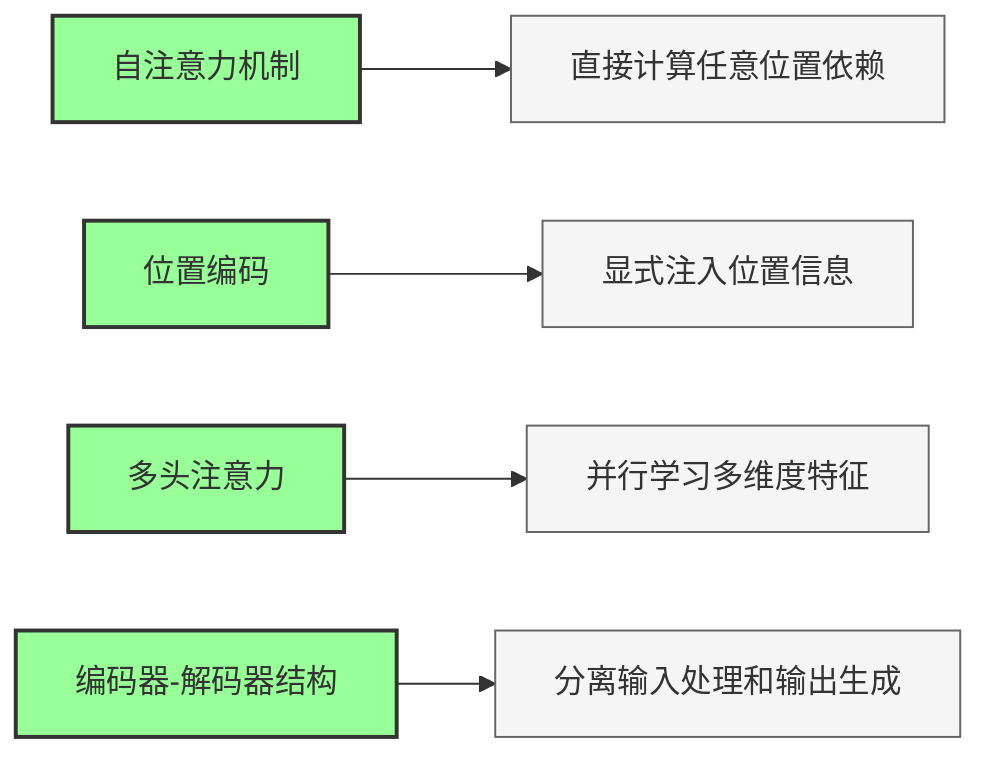
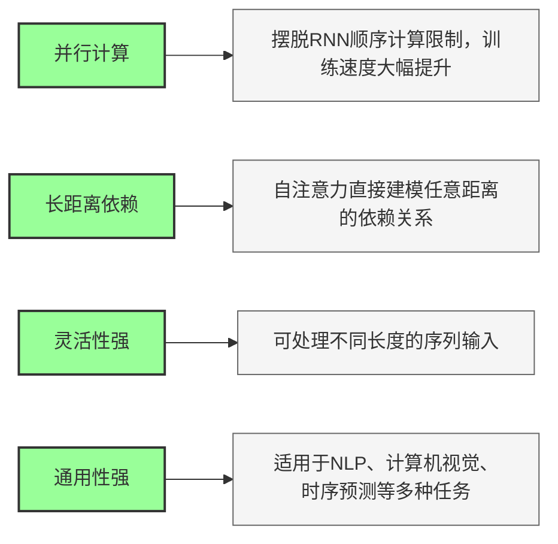

## 一、基础信息

- **任务**：机器翻译、文本摘要、问答系统、时序预测（通用序列到序列模型）
- **核心定位**：**抛弃RNN，用自注意力做序列SOTA**
- **对比**：并行计算速度远快于RNN/LSTM，能更好捕捉长距离依赖

---

## 二、4 大核心创新（必背）

1. **自注意力机制**（最核心）
直接计算序列中任意两个位置的依赖关系，不受距离限制。
2. **位置编码**
显式注入序列位置信息，解决自注意力无法感知顺序的问题。
3. **多头注意力**
并行学习多维度特征表示，捕获不同角度的依赖关系。
4. **编码器-解码器结构**
分离输入处理和输出生成，更适合序列到序列任务。

---

## 三、Transformer 层流程（默写版）

### 编码器层
1. 多头自注意力计算
2. 残差连接 + 层归一化
3. 前馈网络
4. 残差连接 + 层归一化

### 解码器层
1. 掩码多头自注意力（防止看到未来信息）
2. 残差连接 + 层归一化
3. 多头交叉注意力（关注编码器输出）
4. 残差连接 + 层归一化
5. 前馈网络
6. 残差连接 + 层归一化

---

## 四、完整架构流程

输入序列 → 词元嵌入+位置编码 → **N层编码器堆叠** → **N层解码器堆叠** → 线性层 → Softmax → 输出序列

---

## 五、核心优势

1. **并行计算**：摆脱RNN顺序计算限制，训练速度大幅提升
2. **长距离依赖**：自注意力直接建模任意距离的依赖关系
3. **灵活性强**：可处理不同长度的序列输入
4. **通用性强**：适用于NLP、计算机视觉、时序预测等多种任务

---

## 六、一句话金句（面试压轴）

Transformer 通过**自注意力机制**捕获全局依赖，结合**位置编码**和**多头注意力**，实现了高效并行的序列建模。

需要我把这份考点压缩成**3行超级精简背诵口诀**吗？

**口诀核心版（3行，直接背）**

1. 自注意力捕依赖，位置编码保顺序；

2. 多头并行学特征，编解码结构传信息；

3. 并行计算速度快，长序列建模显威力。

**口诀注解（帮你对应考点，不记混）**

1. 自注意力=核心机制；位置编码=解决顺序问题；

2. 多头=多维度特征；编解码结构=序列到序列框架；

3. 并行计算=速度优势；长序列建模=核心能力。