**标准 YOLOv5 架构图**（目标检测SOTA模型，严格贴合官方最新版本实现：**CSPDarknet骨干、FPN+PAN颈部、YOLO检测头**），风格和 TimesNet 架构图完全统一，可直接用于笔记/PPT。

# YOLOv5 完整架构流程图

```mermaid
flowchart LR
    %% 简化样式定义（仅保留基础属性，行尾加分号）
    classDef inputStyle fill:#f9f,stroke:#333,stroke-width:2px,rounded:8px;
    classDef backboneStyle fill:#ffd700,stroke:#333,stroke-width:2px,rounded:8px;
    classDef neckStyle fill:#9ff,stroke:#333,stroke-width:2px,rounded:8px;
    classDef headStyle fill:#9f9,stroke:#333,stroke-width:2px,rounded:8px;
    classDef subgraphStyle fill:#f5f5f5,stroke:#666,stroke-width:1px,rounded:10px;

    %% 1. 输入层
    subgraph InputLayer["输入层"]
        A["图像输入<br/>(Input Image)"]:::inputStyle;
        B["Mosaic<br/>数据增强"]:::inputStyle;
    end
    class InputLayer subgraphStyle;

    %% 2. 骨干网络：CSPDarknet
    subgraph Backbone["骨干网络：CSPDarknet"]
        C["Focus<br/>模块"]:::backboneStyle;
        D["Conv + BN + SiLU<br/>(64通道)"]:::backboneStyle;
        E["CSP1_1<br/>模块<br/>(128通道)"]:::backboneStyle;
        F["Conv + BN + SiLU<br/>(256通道)"]:::backboneStyle;
        G["CSP1_2<br/>模块<br/>(256通道)"]:::backboneStyle;
        H["Conv + BN + SiLU<br/>(512通道)"]:::backboneStyle;
        I["CSP1_3<br/>模块<br/>(512通道)"]:::backboneStyle;
        J["Conv + BN + SiLU<br/>(1024通道)"]:::backboneStyle;
        K["SPP<br/>模块"]:::backboneStyle;
    end
    class Backbone subgraphStyle;

    %% 3. 颈部网络：FPN + PAN
    subgraph Neck["颈部网络：FPN + PAN"]
        L["FPN<br/>上采样"]:::neckStyle;
        M["CSP2_1<br/>模块<br/>(512通道)"]:::neckStyle;
        N["FPN<br/>上采样"]:::neckStyle;
        O["CSP2_2<br/>模块<br/>(256通道)"]:::neckStyle;
        P["PAN<br/>下采样"]:::neckStyle;
        Q["CSP2_3<br/>模块<br/>(512通道)"]:::neckStyle;
        R["PAN<br/>下采样"]:::neckStyle;
        S["CSP2_4<br/>模块<br/>(1024通道)"]:::neckStyle;
    end
    class Neck subgraphStyle;

    %% 4. 检测头：YOLO Head
    subgraph Head["检测头：YOLO Head"]
        subgraph MultiScaleDet["多尺度检测"]
            T["小目标<br/>检测<br/> (80×80)"]:::headStyle;
            U["中目标<br/>检测<br/> (40×40)"]:::headStyle;
            V["大目标<br/>检测<br/> (20×20)"]:::headStyle;
        end
        class MultiScaleDet subgraphStyle;
        
        W["Conv 1×1<br/>预测层"]:::headStyle;
        X["Sigmoid<br/>激活<br/>(边界框/置信度)"]:::headStyle;
        Y["Softmax<br/>激活<br/>(类别预测)"]:::headStyle;
        Z["NMS<br/>后处理"]:::headStyle;
    end
    class Head subgraphStyle;

    %% 5. 输出层
    subgraph OutputLayer["输出层"]
        AA["检测<br/>结果"]:::inputStyle;
    end
    class OutputLayer subgraphStyle;

    %% 核心注释（简化换行）
    Note["YOLOv5 核心创新：<br/>1. Focus模块减少计算量<br/>2. CSP结构增强特征提取<br/>3. SPP模块融合多尺度特征<br/>4. FPN+PAN双向特征融合<br/>5. 多尺度检测适配不同大小目标<br/>6. 自适应锚框计算<br/>7. Mosaic数据增强提升泛化能力"];

    %% 数据流（添加必要的连接信息）
    A -->|输入图像| B -->|Mosaic增强| C -->|Focus处理| D -->|特征提取| E -->|特征提取| F -->|特征提取| G -->|特征提取| H -->|特征提取| I -->|特征提取| J -->|特征提取| K -->|多尺度融合| L --> M --> N --> O;
    O --> P --> Q --> R --> S;
    G -->|跳连| M;
    E -->|跳连| O;
    Q -->|特征传递| S;
    O -->|小目标检测| T;
    Q -->|中目标检测| U;
    S -->|大目标检测| V;
    T & U & V -->|多尺度特征| W -->|预测| X & Y -->|激活| Z -->|后处理| AA;
```

---

# YOLOv5 极简核心总结

1. **定位**：**实时目标检测** SOTA 模型，平衡精度与速度
2. **核心Backbone**：**CSPDarknet** + **SPP** 特征提取
3. **核心Neck**：**FPN + PAN** 双向特征融合
4. **核心Head**：**YOLO Head** 多尺度检测
5. **最大创新**
    - **Focus模块**：减少计算量，提升特征提取效率
    - **CSP结构**：增强梯度流动，提高模型性能
    - **SPP模块**：融合多尺度特征，提升检测精度
    - **FPN+PAN**：双向特征融合，增强多尺度检测能力
    - **SiLU激活函数**：提高模型性能和收敛速度
    - **Mosaic数据增强**：提升模型泛化能力
    - **自适应锚框**：自动计算最优锚框尺寸
    - **CIoU损失函数**：优化边界框回归精度
6. **结构范式**
输入 → Mosaic增强 → Focus → CSPDarknet → SPP → FPN+PAN → YOLO Head → NMS → 输出

## 关键技术点
- **Focus模块** (Focus)：减少计算量，提升特征提取效率
  - **工作原理**：将输入图像的宽高各减半，通道数翻倍，通过切片操作实现
  - **实现方法**：对输入特征图进行隔行隔列采样，然后将结果拼接
  - **输入输出**：输入 `[batch_size, 3, 640, 640]` → 输出 `[batch_size, 12, 320, 320]`
  - **优势**：减少计算量，提升特征提取效率，相当于在不增加参数量的情况下进行了下采样

- **CSP结构** (Cross Stage Partial Network 跨阶段部分网络结构)：增强梯度流动，提高模型性能
  - **工作原理**：将特征图分为两部分，一部分直接传递，另一部分经过卷积操作后再与前一部分融合
  - **实现方法**：使用跨阶段连接，将特征图分为主分支和残差分支，残差分支经过多层卷积后再与主分支融合
  - **优势**：减少计算冗余，增强梯度流动，提高模型的准确率和速度

- **SPP模块** (Spatial Pyramid Pooling 空间金字塔池化模块)：融合多尺度特征，提升检测精度
  - **工作原理**：使用不同大小的池化核对特征图进行池化，然后将结果拼接
  - **实现方法**：使用 1×1, 5×5, 9×9, 13×13 的池化核进行池化，然后将池化结果与原始特征图拼接
  - **输入输出**：输入 `[batch_size, 1024, 20, 20]` → 输出 `[batch_size, 1024, 20, 20]`
  - **优势**：融合不同尺度的特征，提升模型对不同大小目标的检测能力

- **FPN+PAN** (Feature Pyramid Network 特征金字塔网络 + Path Aggregation Network 路径聚合网络)：双向特征融合，增强多尺度检测能力
  - **工作原理**：FPN 自顶向下传递语义特征，PAN 自底向上传递定位特征
  - **实现方法**：
    - FPN：将高层特征通过上采样与低层特征融合
    - PAN：将低层特征通过下采样与高层特征融合
  - **优势**：双向特征融合，兼顾语义信息和定位精度，增强多尺度检测能力

- **SiLU激活函数** (Sigmoid Linear Unit)：提高模型性能和收敛速度
  - **工作原理**：`SiLU(x) = x * sigmoid(x)`，在负值区域有更小的梯度
  - **实现方法**：对输入特征应用 SiLU 激活函数
  - **优势**：相比 ReLU，SiLU 在负值区域有更小的梯度，有助于模型更好地学习，提高模型性能和收敛速度

- **Mosaic数据增强** (Mosaic Data Augmentation)：提升模型泛化能力
  - **工作原理**：将4张不同图像随机缩放后拼接成1张
  - **实现方法**：
    1. 随机选择4张图像
    2. 对每张图像进行随机缩放（0.5-1.5倍）
    3. 将4张图像放置在2×2的网格中
    4. 对拼接后的图像进行随机裁剪和翻转
    5. 自动调整标签坐标以适应新的图像尺寸
  - **优势**：丰富训练数据多样性，增强模型对小目标和遮挡目标的检测能力

- **自适应锚框** (Adaptive Anchor Boxes)：自动计算最优锚框尺寸
  - **工作原理**：在训练开始前，通过 K-means 聚类算法分析训练数据中的目标尺寸，自动计算出适合当前数据集的锚框尺寸
  - **实现方法**：遍历训练数据中的所有标注框，使用 K-means 算法对标注框的宽高进行聚类，通常选择 9 个聚类中心作为锚框尺寸
  - **分配策略**：小尺度锚框分配给大特征图（检测小目标），中尺度锚框分配给中等特征图（检测中目标），大尺度锚框分配给小特征图（检测大目标）
  - **优势**：针对不同数据集自动调整，提高模型初始化效果，加快收敛速度，提高检测精度，减少人工调参工作量

- **多尺度检测** (Multi-scale Detection)：同时检测不同大小的目标
  - **工作原理**：在三个不同尺度的特征图上进行检测
  - **实现方法**：
    - 小目标检测：使用 80×80 的特征图
    - 中目标检测：使用 40×40 的特征图
    - 大目标检测：使用 20×20 的特征图
  - **优势**：同时检测不同大小的目标，提高检测精度

- **CIoU损失函数** (Complete Intersection over Union 完全交并比损失函数)：优化边界框回归精度
  - **工作原理**：考虑边界框的重叠度、中心点距离和宽高比
  - **实现方法**：`CIoU = IoU - (d²/c²) - αv`，其中 d 是中心点距离，c 是最小包围框对角线长度，α 是权重，v 是宽高比一致性
  - **优势**：相比 IoU 和 GIoU，CIoU 考虑了更多因素，提高边界框回归的准确性

- **端到端学习** (End-to-End Learning)：从原始图像到检测结果的端到端训练
  - **工作原理**：整个网络从输入图像直接输出检测结果，无需人工干预
  - **实现方法**：将特征提取、特征融合、检测预测等步骤整合到一个网络中，端到端训练
  - **优势**：简化训练流程，减少人工干预，提高模型性能

---

# YOLOv5 数据流转逻辑详解

## 输入层
- **输入格式**：RGB图像，形状为 `[batch_size, 3, height, width]`
  - `batch_size`：批量大小
  - `3`：RGB通道
  - `height/width`：图像高度/宽度（通常为640x640）
- **Mosaic数据增强**：将4张不同图像随机缩放后拼接成1张，通过以下步骤实现：
  1. 随机选择4张图像
  2. 对每张图像进行随机缩放（0.5-1.5倍）
  3. 将4张图像放置在2×2的网格中
  4. 对拼接后的图像进行随机裁剪和翻转
  5. 自动调整标签坐标以适应新的图像尺寸
  作用：丰富训练数据多样性，增强模型对小目标和遮挡目标的检测能力

## 骨干网络：CSPDarknet
1. **Focus模块**
   - 将输入图像的宽高各减半，通道数翻倍
   - 输入：`[batch_size, 3, 640, 640]`
   - 输出：`[batch_size, 12, 320, 320]`

2. **Conv + BN + SiLU**
   - 64通道：`[batch_size, 12, 320, 320]` → `[batch_size, 64, 320, 320]`
   - 256通道：`[batch_size, 128, 160, 160]` → `[batch_size, 256, 80, 80]`
   - 512通道：`[batch_size, 256, 80, 80]` → `[batch_size, 512, 40, 40]`
   - 1024通道：`[batch_size, 512, 40, 40]` → `[batch_size, 1024, 20, 20]`

3. **CSP1_X模块**
   - **CSP1_1**：128通道，`[batch_size, 64, 320, 320]` → `[batch_size, 128, 160, 160]`
   - **CSP1_2**：256通道，`[batch_size, 256, 80, 80]` → `[batch_size, 256, 80, 80]`
   - **CSP1_3**：512通道，`[batch_size, 512, 40, 40]` → `[batch_size, 512, 40, 40]`
   - 采用跨阶段局部网络（CSP）结构，增强梯度流动

4. **SPP模块**
   - 空间金字塔池化，融合不同尺度的特征图
   - 输入：`[batch_size, 1024, 20, 20]`
   - 输出：`[batch_size, 1024, 20, 20]`
   - 提升模型对不同大小目标的检测能力

## 颈部网络：FPN + PAN
1. **FPN（特征金字塔网络）**
   - 自顶向下传递语义特征
   - 第一次上采样：`[batch_size, 1024, 20, 20]` → `[batch_size, 512, 40, 40]`
   - 第二次上采样：`[batch_size, 512, 40, 40]` → `[batch_size, 256, 80, 80]`

2. **PAN（路径聚合网络）**
   - 自底向上传递定位特征
   - 第一次下采样：`[batch_size, 256, 80, 80]` → `[batch_size, 512, 40, 40]`
   - 第二次下采样：`[batch_size, 512, 40, 40]` → `[batch_size, 1024, 20, 20]`

3. **CSP2_X模块**
   - **CSP2_1**：512通道，`[batch_size, 1024, 40, 40]` → `[batch_size, 512, 40, 40]`
   - **CSP2_2**：256通道，`[batch_size, 512, 80, 80]` → `[batch_size, 256, 80, 80]`
   - **CSP2_3**：512通道，`[batch_size, 512, 40, 40]` → `[batch_size, 512, 40, 40]`
   - **CSP2_4**：1024通道，`[batch_size, 1024, 20, 20]` → `[batch_size, 1024, 20, 20]`

## 检测头：YOLO Head
1. **多尺度检测**
   - **小目标检测**（大特征图）：`[batch_size, 256, 80, 80]` → `[batch_size, 3, 80, 80, 85]`
   - **中目标检测**（中等特征图）：`[batch_size, 512, 40, 40]` → `[batch_size, 3, 40, 40, 85]`
   - **大目标检测**（小特征图）：`[batch_size, 1024, 20, 20]` → `[batch_size, 3, 20, 20, 85]`
   - 其中85 = 4（边界框） + 1（置信度） + 80（类别）

2. **Conv 1×1 预测层**
   - 将多尺度特征映射到预测维度
   - 每个尺度使用1×1卷积将特征通道数转换为 `3 × (4 + 1 + 80) = 255`

3. **激活函数**
   - **边界框和置信度**：使用Sigmoid激活函数
   - **类别预测**：使用Softmax激活函数

4. **NMS后处理**
   - 非极大值抑制
   - 过滤冗余检测框
   - 输出最终检测结果

## 输出层
- **输出格式**：检测结果，包含目标的位置、类别和置信度
- **输出示例**：`[x, y, w, h, confidence, class_id]`

## 完整数据流转路径（文本描述）
## 1. 骨干网络：特征提取，逐步下采样
- Conv + BN + SiLU 是卷积层、批量归一化层和SiLU激活函数的组合，用于提取特征并增强模型性能
- 输入 → Focus → Mosaic增强 → CSP1_1 → CSP1_2 → CSP1_3 → SPP
- 作用 ：从原始图像中提取丰富的特征信息，通过逐步下采样生成不同尺度的特征图
## 2. 颈部网络：特征融合，形成三个尺度
- SPP → FPN上采样 → CSP2_1 → FPN上采样 → CSP2_2 （80×80，小目标）
- CSP2_2 → PAN下采样 → CSP2_3 （40×40，中目标）
- CSP2_3 → PAN下采样 → CSP2_4 （20×20，大目标）
- 作用 ：通过FPN+PAN双向特征融合，增强多尺度特征表达能力，形成三个优化后的检测尺度
## 3. 检测头：多尺度检测
- CSP2_2 → 小目标检测（80×80）
- CSP2_3 → 中目标检测（40×40）
- CSP2_4 → 大目标检测（20×20）
- 后续处理 ：多尺度检测 → Conv 1×1预测层 → Sigmoid/Softmax激活 → NMS后处理 → 检测结果
- 作用 ：基于融合后的特征进行目标检测预测，输出最终检测结果
## 4. 尺度对应关系
- 80×80特征图 ：对应小目标检测，由CSP2_2输出
- 40×40特征图 ：对应中目标检测，由CSP2_3输出
- 20×20特征图 ：对应大目标检测，由CSP2_4输出
## 5. 数据流转总结
输入图像 → Mosaic增强 → Focus模块 → Conv + BN + SiLU → CSP1_1 → Conv + BN + SiLU → CSP1_2 → Conv + BN + SiLU → CSP1_3 → Conv + BN + SiLU → SPP模块 → FPN上采样 → CSP2_1 → FPN上采样 → CSP2_2 → PAN下采样 → CSP2_3 → PAN下采样 → CSP2_4 → 多尺度检测（小目标+中目标+大目标） → Conv 1×1预测层 → Sigmoid/Softmax激活 → NMS后处理 → 检测结果

