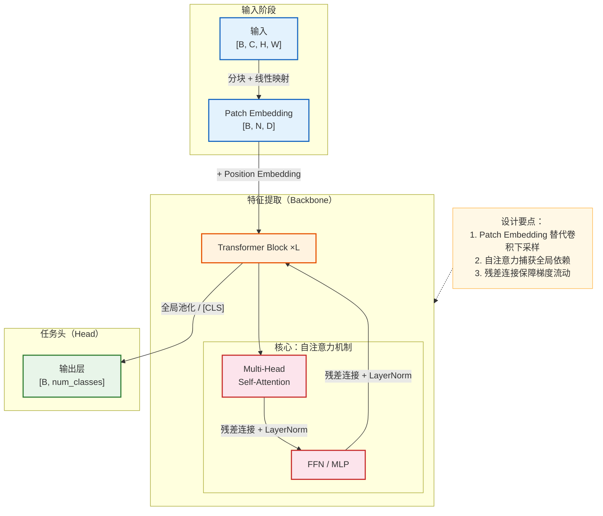

# 通用模型架构分析提示词

> 使用方式：根据需要选择「模型架构概览」「模型架构详情」或「关键组件架构」，将对应提示词发送给模型即可。
> 三者可以独立使用，也可以按 概览 → 详情 → 关键组件 的顺序逐步深入。
> 适用范围：深度学习模型、机器学习模型及相关算法架构。

---

## 一、模型架构概览（快速理解模型全貌）

**适用场景**：初次了解模型、笔记记录、PPT 展示、模型选型参考、团队分享

```
请对该模型进行架构概览分析，帮助我快速理解模型全貌。请涵盖以下方面，根据模型实际情况灵活调整侧重点：

1. **模型定位**
   - 模型解决什么问题？属于哪个研究领域或应用方向？
   - 模型的核心价值和典型应用场景是什么？
   - 与同领域的代表性模型相比，其定位和差异点是什么？

2. **核心思想与创新点**
   - 模型最关键的设计思路或技术突破是什么？
   - 相比前序工作，解决了什么痛点或带来了什么改进？

3. **整体架构概览**
   - 模型的整体结构和主要组成部分（如 Encoder/Decoder、Backbone/Head、Generator/Discriminator 等，视模型类型而定）
   - 模型的学习范式（如监督学习、自监督学习、强化学习、生成式建模等）
   - 输入与输出的基本形式和维度（仅标注输入输出即可）
   - 建议用 Mermaid 架构图展示模型的整体结构和数据流向

4. **输入输出示例**
   - 给出 1 个具体的输入数据示例（如一张图片、一段文本、一条序列等），说明其格式和含义
   - 给出对应的输出示例，说明模型产出的结果形式
   - 通过这个具体例子，帮助读者直观理解模型"接收什么、产出什么"

5. **关键模块一览**
   - 模型包含哪些核心模块？各模块的主要职责是什么？
   - 模块之间的连接方式和数据流转关系

6. **性能表现与评估概览**（如有公开数据）
   - 主要评估指标及其含义（如 Accuracy、mAP、BLEU、FID 等，视任务而定）
   - 在核心基准测试上的关键结果，以及与代表性基线模型的简要对比
   - 模型的规模与效率信息（参数量、计算量、推理速度等，如可获取）

7. **模型家族与演进脉络**（如适用）
   - 该模型是否属于某个模型系列？在系列中的位置和代际差异是什么？
   - 简要说明从前序版本到当前版本的关键演进路线

注意事项：
- 保持简洁精炼，突出架构重点，避免深入实现细节
- 建议用 Mermaid 流程图辅助展示整体架构，仅需体现主要模块和数据流方向
- 如果模型有特别突出的设计特色，可以额外提及
- 对于不确定或信息不足的部分，可以标注说明
```

---

## 二、模型架构详情（深入理解设计与实现）

**适用场景**：深入学习、技术文档撰写、代码实现参考、学术研究

```
请对该模型进行深入的架构与实现分析。请涵盖以下方面，根据模型实际情况灵活调整深度和侧重点：

1. **数据集构成与数据示例**
   - 模型使用的主要数据集（名称、规模、数据类型、标注方式等）
   - 数据集的构建方法或来源（如何收集、标注流程、质量控制等，如有相关信息）
   - 数据集的划分策略（训练集 / 验证集 / 测试集的比例和划分方式）
   - 类别分布或数据特征分布情况，以及对数据不均衡的处理方式（如适用）
   - 给出具体的数据样例，展示一条典型的训练数据长什么样（输入 + 标签/目标）
   - 展示数据在关键处理阶段的形态变化（如原始数据 → 预处理后 → 模型输入 → 模型输出），帮助读者理解数据如何"流过"模型
   - 如有多种数据集或多阶段训练数据，分别说明

2. **数据处理与输入规范**
   - 模型对输入数据的要求和预处理流程（如 tokenization、归一化、resize、数据格式等）
   - 输入数据的组织方式和批处理策略
   - 如有特殊的数据增强或预处理技巧，简要说明

3. **架构全景与数据流**
   - 模型的完整架构拆解，包含各阶段的模块组成
   - 数据从输入到输出的完整流转路径，标注每个关键节点的维度变化
   - 建议用 Mermaid 架构图详细展示各模块关系和数据流（标注维度信息）

4. **核心模块深入分析**
   - 各核心模块的内部结构和工作原理
   - 模块间的依赖关系和信息传递方式
   - 对关键模块，建议用 Mermaid 内部结构图辅助说明

5. **维度变换路径**
   - 从输入到输出，数据在每个关键步骤的维度变化
   - 对重要的维度变换（如 reshape、projection、pooling 等），说明其目的
   - 可通过表格或流程图清晰展示维度变化链路

6. **数学表达与关键公式**（如适用）
   - 核心计算过程的数学表达式（如注意力计算、损失函数等）
   - 关键公式中各符号的含义说明

7. **损失函数与优化策略**（如适用）
   - 损失函数的设计和组成（如有多个损失项，说明各项的作用和权重策略）
   - 优化器选择、学习率调度等训练策略

8. **训练流程与策略**（如适用）
   - 学习范式与训练目标（如监督学习、自监督学习、对比学习、生成式建模、强化学习等，明确模型"学什么"）
   - 训练的整体流程（预训练、微调、多阶段训练等），建议用 Mermaid 流程图辅助展示
   - 模型初始化策略（随机初始化、预训练权重加载、迁移学习来源等）
   - 数据增强、正则化等关键训练技巧
   - 关键超参数及其影响
   - 训练基础设施与成本（GPU 型号、分布式训练方式、训练时长等，如可获取）
   - 训练收敛行为（训练曲线的典型特征、是否容易过拟合等，如有相关信息）

9. **推理与预测流程**（如适用）
   - 推理阶段的完整处理流程，从原始输入到最终可用输出的端到端链路
   - 对于生成式模型，说明采样/生成过程（如自回归逐步生成、扩散模型的多步去噪、VAE 的采样等）
   - 输出后处理步骤（如 NMS、beam search、解码、阈值选择、CTC 解码等，视任务而定）
   - 相比训练阶段的差异（如 Dropout 关闭、BN 切换、Teacher Forcing 移除等）
   - 给出一个完整的预测示例：原始输入 → 预处理 → 模型推理 → 后处理 → 最终输出
   - 推理加速或部署优化手段（如量化、蒸馏、ONNX 导出等，如有）

10. **评估指标与实验分析**
    - 评估指标的选择和含义（说明为什么选用这些指标来衡量模型表现）
    - 在主要基准数据集上的详细实验结果，与 SOTA 或基线模型的对比分析
    - 消融实验：各关键组件对最终性能的贡献（如论文中有提供）
    - 效率指标：参数量、FLOPs、推理延迟、内存占用等（如可获取）
    - 结果可视化与定性分析（如注意力热力图、特征可视化、典型成功/失败案例分析等，如适用）
    - 泛化能力分析：跨数据集表现、领域迁移效果等（如有相关实验）
    - 如有条件，可用表格汇总关键对比数据

11. **设计亮点与思考**
   - 架构设计中值得学习的思路或模式
   - 设计中的权衡与取舍（如精度 vs 速度、通用性 vs 专用性等）
   - 已知的局限性或可改进方向（如能观察到）

注意事项：
- 根据模型类型和复杂度灵活调整各部分深度，并非所有模型都涉及上述全部方面
- 建议用 Mermaid 图辅助说明整体架构、关键模块内部结构、数据流转等
- 重点分析"为什么这样设计"，而不仅仅是"结构是什么"
- 对于不确定的部分，可以标注为推测并说明依据
```

---

## 三、关键组件架构（组件级深度拆解）

**适用场景**：针对模型中某个或某几个关键组件进行深度分析，适合代码复现、组件改进、学术研究

```
请对该模型的关键组件进行深度架构分析。请涵盖以下方面，根据组件实际情况灵活调整：

1. **组件定位与职责**
   - 该组件在整体模型中的位置和作用
   - 它解决了什么具体问题？为什么需要这个组件？

2. **内部结构拆解**
   - 组件的内部子模块组成和层次结构
   - 各子模块的职责和连接方式
   - 建议用 Mermaid 图展示组件的内部结构

3. **计算流程与维度变换**
   - 数据进入该组件后的完整处理流程
   - 每一步的维度变化和计算操作
   - 关键计算的数学表达式

4. **设计细节与技巧**
   - 组件中使用的关键设计模式或技巧（如残差连接、门控机制、归一化策略等）
   - 这些设计选择的原因和带来的效果

5. **变体与演进**（如适用）
   - 该组件在不同模型版本中的变化
   - 社区或后续工作中对该组件的改进方案

6. **代码级参考**（如适用）
   - 组件实现的伪代码或关键代码片段
   - 实现中需要注意的细节（如数值稳定性、内存优化等）

注意事项：
- 如未指定具体组件，请自行识别模型中最核心、最具特色的 1~3 个组件进行分析
- 建议每个组件配合 Mermaid 图展示内部结构和计算流程
- 从"输入→处理→输出"的角度完整描述组件行为
- 关注实现细节和设计意图，适合作为复现参考
```

---

## 四、概览 vs 详情 vs 关键组件 对照


| 维度 | 模型架构概览 | 模型架构详情 | 关键组件架构 |
|------|------------|------------|------------|
| 目标 | 快速理解模型做什么、整体长什么样 | 深入理解完整架构与设计决策 | 深度拆解特定组件的实现原理 |
| 分析粒度 | 模块级：关注整体结构和模块关系 | 模块+子模块级：关注完整数据流和设计原理 | 子模块+算子级：关注内部计算和实现细节 |
| 数据与示例 | 1 个输入输出具体示例 | 数据集构成 + 各阶段数据形态变化 | 组件内部的数据变换细节 |
| 维度标注 | 仅输入和输出 | 每个关键节点 | 组件内每一步 |
| 评估指标 | 关键指标 + 简要对比 | 详细实验结果 + 消融实验 + 效率指标 | 组件级消融贡献（如适用） |
| Mermaid 图 | 整体架构流程图 | 架构图 + 关键模块内部图 | 组件内部结构图 + 计算流程图 |
| 篇幅 | 简洁精炼 | 详尽充分 | 针对性深入 |
| 适合 | 快速了解、展示分享、模型选型 | 深入学习、技术文档、学术研究 | 代码复现、组件改进、学术分析 |


---

## 五、Mermaid 作图风格参考

> 在模型架构分析中使用 Mermaid 图表时，可参考以下风格规范。
> 这是一份风格参考而非硬性要求，根据图表复杂度灵活取舍。

### 风格要点

1. **配色区分**：通过 `classDef` 为不同类型的模块定义不同颜色（如输入层、特征提取、注意力模块、输出层等使用不同配色），便于视觉区分
2. **分层布局**：使用 `subgraph` 按逻辑阶段分组（如 Encoder、Decoder、Head 等），体现架构的层次关系
3. **维度标注**：在节点标签中标注关键维度信息（如 `[B, N, D]`），帮助理解数据形状变化
4. **连接线语义**：连接线标签描述数据操作或变换类型（如 "Linear Projection"、"Concat" 等）
5. **辅助注释**：对核心计算或设计要点，通过 `Note` 节点附加简要说明
6. **文本换行**：节点标签内的换行一律使用 `<br/>` 标签，**禁止使用 `\n`**，否则 Mermaid 无法正确渲染换行效果

### 模型架构图示例




