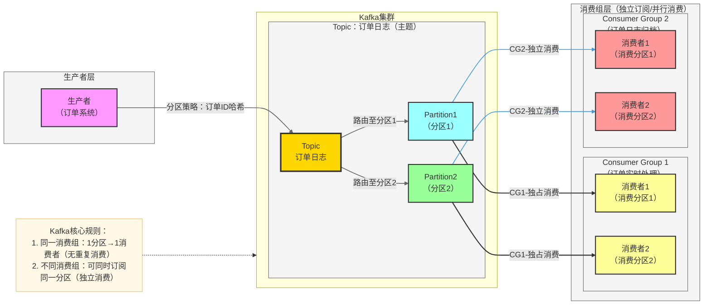

# 通用项目架构分析提示词

> 使用方式：根据需要选择「项目概览」或「项目详情」，将对应提示词发送给模型即可。
> 两者可以独立使用，也可以先概览再详情，由浅入深逐步理解项目。
> 适用范围：后端服务、前端应用、全栈项目、CLI 工具、SDK/库等各类 GitHub 项目。

---

## 一、项目概览（快速理解项目全貌）

**适用场景**：初次接触项目、项目评估、团队沟通、技术选型参考

```
请对该项目进行整体概览分析，帮助我快速理解项目全貌。请涵盖以下方面，根据项目实际情况灵活调整侧重点：

1. **项目定位**
   - 项目解决什么问题？面向哪些用户或场景？
   - 项目的核心价值和主要功能是什么？

2. **技术栈概览**
   - 主要使用的语言、框架、核心依赖
   - 如有明显的技术选型特点（如微服务、Serverless 等），请简要说明

3. **项目结构**
   - 顶层目录结构及各目录的职责概述
   - 项目的组织方式（如单体应用、Monorepo、多模块等）

4. **核心模块与关系**
   - 项目包含哪些主要功能模块？各模块的核心职责是什么？
   - 模块之间的主要依赖和交互关系（建议用简要的架构图或关系图辅助说明）

5. **快速上手与入口**
   - 项目的入口文件或启动方式是什么？（如 `main.py`、`app.ts`、`docker-compose up` 等）
   - 如何快速将项目运行起来？（关键的安装和启动步骤）
   - 项目运行后，用户或开发者如何与之交互？（如访问 API、打开 Web 页面、执行命令等）

6. **关键业务流程**
   - 挑选 1~2 个最能体现项目核心功能的业务流程，简要描述其主要步骤
   - 建议用 Mermaid 流程图辅助展示

注意事项：
- 保持简洁，突出重点，避免过多实现细节
- 建议用 Mermaid 架构图或流程图辅助说明模块关系和业务流程
- 如果项目某些方面特别突出或有特色，可以额外提及
- 对于不确定或信息不足的部分，可以标注说明
```

---

## 二、项目详情（深入理解架构与实现）

**适用场景**：技术深入分析、架构设计参考、源码学习、开发参与准备

```
请对该项目进行深入的架构与实现分析。请涵盖以下方面，根据项目实际情况灵活调整深度和侧重点：

1. **模块详细拆解**
   - 各功能模块的内部结构和关键组件
   - 模块间的依赖关系、调用方式和数据流向
   - 用架构图或模块关系图辅助说明（建议使用 Mermaid 等格式）

2. **核心业务流程与数据流**
   - 主要业务流程的详细步骤和参与组件
   - 数据在各模块间的流转路径
   - 如有典型的请求处理链路，请完整描述

3. **数据层设计**（如适用）
   - 数据模型 / 数据库设计的主要结构
   - ORM 或数据访问层的组织方式
   - 缓存、消息队列等中间件的使用情况

4. **接口与 API 设计**（如适用）
   - API 的组织方式和设计风格（REST / GraphQL / RPC 等）
   - 主要接口的分类和职责
   - 接口版本管理方式（如有）

5. **配置与部署**
   - 配置管理方式（环境变量、配置文件等）
   - 部署方式和相关基础设施（Docker、CI/CD 等）
   - 环境区分（开发 / 测试 / 生产）

6. **安全性设计**（如适用）
   - 认证与鉴权机制（如 JWT、OAuth、Session、RBAC 等）
   - 输入校验、数据脱敏、敏感信息管理等安全实践
   - 其他安全相关措施（如 CORS、限流、HTTPS、SQL 注入防护等，视项目情况而定）

7. **异常处理与可观测性**
   - 错误处理和异常传播的整体策略
   - 日志、监控、链路追踪等可观测性手段（如有）

8. **测试策略**（如适用）
   - 测试的类型和覆盖范围（单元测试、集成测试、E2E 等）
   - 测试框架和组织方式

9. **设计亮点与潜在关注点**
   - 项目中值得学习的设计模式或架构决策
   - 可能存在的技术债务或改进空间（如能观察到）

注意事项：
- 根据项目类型和规模灵活调整各部分的深度，并非所有项目都涉及上述全部方面
- 对于关键流程或复杂模块关系，建议使用 Mermaid 流程图辅助说明
- 重点分析"为什么这样设计"，而不仅仅是"是什么"
- 对于不确定的部分，可以标注为推测并说明依据
```

---

## 三、Mermaid 作图风格参考

> 在分析中使用 Mermaid 图表时，可参考以下风格规范，保持图表清晰美观。
> 这是一份风格参考而非硬性要求，根据实际图表复杂度灵活取舍。

### 风格要点

1. **配色与样式定义**：通过 `classDef` 预定义各类节点的颜色和边框样式，使不同层级或角色的组件在视觉上易于区分
2. **分层布局**：使用 `subgraph` 对节点进行逻辑分组，体现架构的层次关系（如生产者层、服务层、消费层等）
3. **连接线区分**：通过 `linkStyle` 对不同类型的连接线设置不同颜色和粗细，区分调用类型或数据流方向
4. **标签说明**：连接线上使用简明标签描述交互语义（如调用方式、数据类型等）
5. **辅助注释**：对核心规则或易混淆的概念，可通过 `Note` 节点附加说明

### 参考示例



---

## 四、概览 vs 详情 对照

| 维度 | 项目概览 | 项目详情 |
|------|---------|---------|
| 目标 | 快速理解项目做什么、怎么组织、怎么跑 | 深入理解怎么实现、为什么这样设计 |
| 分析粒度 | 模块级：关注模块职责和关系 | 组件级：关注内部实现和设计决策 |
| 业务流程 | 1~2 个核心流程的简要步骤 | 主要流程的完整链路与数据流转 |
| 技术实现 | 技术栈 + 项目结构概述 | 数据层、API、安全、部署、测试等各维度 |
| Mermaid 图 | 整体架构图 + 核心流程图 | 模块关系图 + 详细数据流图 + 部署架构图 |
| 篇幅 | 简洁精炼 | 详尽充分 |
| 适合 | 项目评估、团队沟通、快速上手 | 源码学习、架构参考、深度参与 |