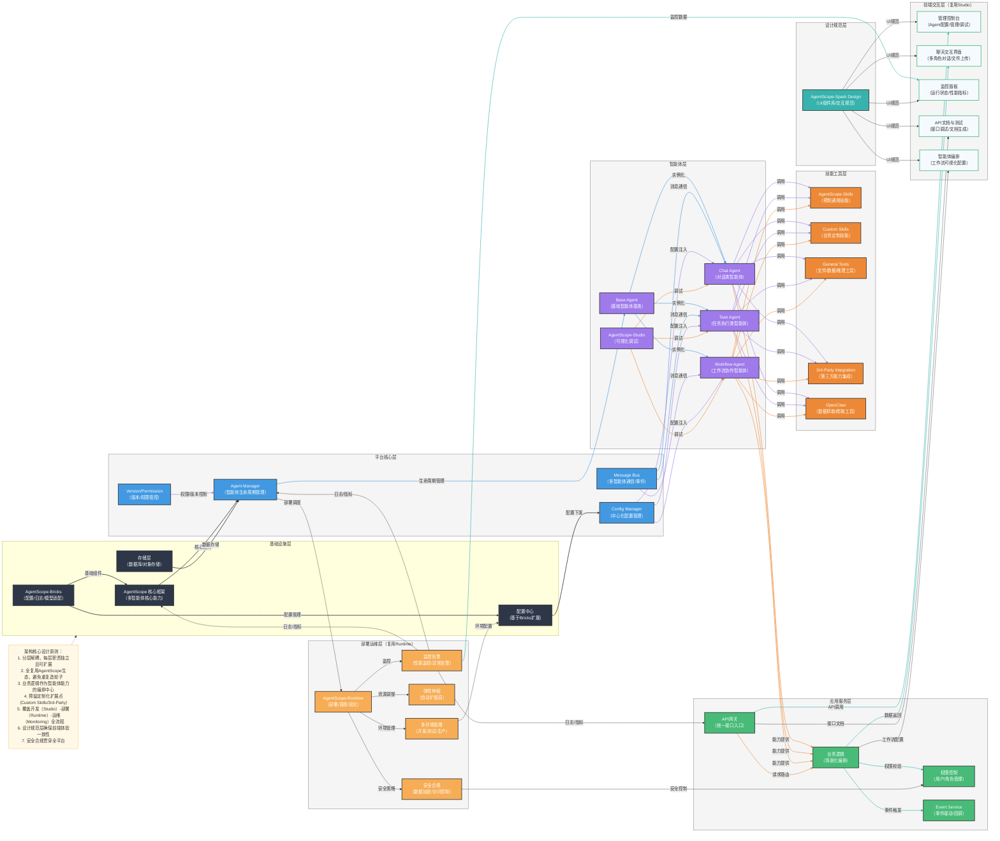

# 智能体平台完整开发规划方案

## 一、技术方案选型

### 1. 核心框架
- **智能体框架**：AgentScope（选择理由：提供完整的多智能体通信、协作机制，支持大模型适配）
- **AgentScope-Bricks**：提供基础组件，如消息解析、模型适配器、配置管理器、日志/监控工具等
- **Web框架**：FastAPI（选择理由：高性能、自动API文档生成、类型提示支持）
- **数据库**：PostgreSQL（选择理由：强大的关系型数据库，支持JSON类型，适合存储复杂的智能体配置）
- **缓存**：Redis（选择理由：用于缓存会话数据、配置信息，提高性能）
- **消息队列**：RabbitMQ（选择理由：可靠的消息传递，支持智能体间异步通信）

### 2. 前端技术
- **框架**：React（选择理由：生态成熟，组件化开发，适合复杂的管理控制台）
- **UI组件库**：AgentScope-Spark Design（选择理由：与AgentScope生态一致，提供统一的UI组件和交互规范）
- **状态管理**：Redux Toolkit（选择理由：统一状态管理，适合复杂应用）
- **图表库**：ECharts（选择理由：强大的可视化能力，适合监控面板）
- **工作流可视化**：React Flow（选择理由：专业的流程图库，适合智能体编排）
- **AgentScope-Studio**：可视化开发/调试平台，提供图形化配置智能体、定义协作逻辑、实时调试多智能体交互过程等功能

### 3. 部署运维
- **容器化**：Docker（选择理由：环境一致性，便于部署）
- **编排**：Kubernetes（选择理由：自动化运维，弹性伸缩）
- **AgentScope-Runtime**：运行时环境，负责多智能体应用的部署、调度、资源管理
- **监控**：Prometheus + Grafana（选择理由：强大的监控和告警能力）
- **日志**：ELK Stack（选择理由：集中式日志管理和分析）
- **CI/CD**：GitHub Actions（选择理由：与代码仓库集成，自动化构建和部署）

## 二、架构设计

### 1. 架构图



### 2. 架构设计原则

1. **分层解耦**：各层职责独立且可扩展，通过接口通信，降低耦合度
2. **全复用AgentScope生态**：充分利用AgentScope生态能力，避免重复造轮子
3. **业务逻辑作为智能体能力的编排中心**：协调智能体能力实现业务场景
4. **预留定制化扩展点**：支持Custom Skills和第三方集成
5. **覆盖全流程**：覆盖开发（Studio）-部署（Runtime）-运维（Monitoring）全流程
6. **设计规范层确保前端体验一致性**：统一UI组件库和交互规范
7. **安全合规贯穿全平台**：包括认证、授权、数据加密等
8. **可观测性**：完善的监控、日志和告警体系，确保系统稳定运行

## 三、项目开发流程

### 1. 阶段划分

#### 阶段一：项目初始化与基础设施搭建
- 环境搭建：Python 3.10+，虚拟环境配置
- 依赖管理：pyproject.toml 配置
- 项目结构：初始化目录结构
- 基础设施：数据库、缓存、消息队列部署

#### 阶段二：平台核心开发
- Agent Manager：智能体生命周期管理
- Message Bus：多智能体通信机制
- Config Manager：配置中心化管理
- Permission Manager：权限与认证

#### 阶段三：智能体与技能开发
- 智能体基类实现
- 标准智能体类型开发（Chat、Task、Workflow）
- 技能框架实现
- 预制技能开发
- OpenClaw 集成

#### 阶段四：应用服务开发
- API Gateway 实现
- RESTful API 开发
- WebSocket 服务实现
- 业务逻辑编排
- 事件服务实现

#### 阶段五：前端开发
- 管理控制台
- 聊天交互界面
- 监控面板
- 智能体编排
- API文档与测试

#### 阶段六：部署与运维
- 容器化配置
- Kubernetes 部署
- 监控告警配置
- 日志系统搭建
- CI/CD 配置

#### 阶段七：测试与优化
- 单元测试
- 集成测试
- 端到端测试
- 性能优化
- 安全审计

### 2. 开发规范

1. **代码规范**：
   - Python：PEP 8 规范
   - JavaScript/TypeScript：ESLint + Prettier
   - 代码审查：Pull Request 机制

2. **文档规范**：
   - 架构决策记录（ADR）
   - API 文档（Swagger/OpenAPI）
   - 开发指南
   - 运维手册

3. **版本控制**：
   - Git 工作流：Feature Branch 模式
   - 语义化版本号

## 四、目录规划方案

```
智能体平台/
├── 0.项目文档/
│   ├── README.md                    # 项目导航与简介
│   ├── 技术方案选型.md               # 技术栈选择与理由
│   ├── 架构设计.md                   # 架构图与设计原则
│   ├── 开发流程.md                   # 项目开发阶段划分
│   ├── 部署指南.md                   # 部署步骤与配置
│   └── 架构决策记录/                 # ADR 文档
│       ├── ADR-001-技术选型.md
│       ├── ADR-002-数据库选型.md
│       └── ADR-003-通信协议选型.md
│
├── 1.基础设施模块/
│   ├── agentscope_integration/      # AgentScope 集成
│   │   ├── __init__.py
│   │   ├── config.py
│   │   └── models.py
│   ├── agentscope_bricks/           # AgentScope-Bricks 集成
│   │   ├── __init__.py
│   │   ├── message_parser.py
│   │   ├── model_adapter.py
│   │   └── logger.py
│   ├── database/                    # 数据库
│   │   ├── __init__.py
│   │   ├── models.py
│   │   └── migrations/
│   ├── cache/                       # 缓存
│   │   ├── __init__.py
│   │   └── redis_client.py
│   ├── message_queue/               # 消息队列
│   │   ├── __init__.py
│   │   └── rabbitmq_client.py
│   └── config_center/               # 配置中心
│       ├── __init__.py
│       ├── config_manager.py
│       └── secret_manager.py
│
├── 2.平台核心模块/
│   ├── agent_manager/               # 智能体管理
│   │   ├── __init__.py
│   │   ├── agent_registry.py
│   │   ├── lifecycle.py
│   │   └── health_check.py
│   ├── message_bus/                 # 消息总线
│   │   ├── __init__.py
│   │   ├── message_queue.py
│   │   └── publisher.py
│   ├── config_manager/              # 配置管理
│   │   ├── __init__.py
│   │   ├── config_store.py
│   │   └── version_control.py
│   └── permission/                  # 权限管理
│       ├── __init__.py
│       ├── auth.py
│       ├── roles.py
│       └── access_control.py
│
├── 3.智能体模块/
│   ├── base/                        # 基础智能体
│   │   ├── __init__.py
│   │   └── base_agent.py
│   ├── chat/                        # 对话智能体
│   │   ├── __init__.py
│   │   └── chat_agent.py
│   ├── task/                        # 任务智能体
│   │   ├── __init__.py
│   │   └── task_agent.py
│   ├── workflow/                    # 工作流智能体
│   │   ├── __init__.py
│   │   └── workflow_agent.py
│   └── studio/                      # AgentScope-Studio 集成
│       ├── __init__.py
│       └── debug_tools.py
│
├── 4.技能工具模块/
│   ├── skills/                      # 技能框架
│   │   ├── __init__.py
│   │   ├── skill_registry.py
│   │   └── base_skill.py
│   ├── agentscope_skills/           # AgentScope-Skills 集成
│   │   ├── __init__.py
│   │   └── adapters.py
│   ├── prebuilt_skills/             # 预制技能
│   │   ├── text/                    # 文本处理
│   │   ├── code/                    # 代码处理
│   │   ├── data/                    # 数据处理
│   │   └── file/                    # 文件处理
│   ├── tools/                       # 通用工具
│   │   ├── __init__.py
│   │   ├── http_client.py
│   │   ├── db_client.py
│   │   └── file_utils.py
│   ├── openclaw/                    # OpenClaw 集成
│   │   ├── __init__.py
│   │   ├── client.py
│   │   └── crawlers/
│   └── third_party/                 # 第三方能力集成
│       ├── __init__.py
│       └── adapters.py
│
├── 5.应用服务模块/
│   ├── api_gateway/                 # API 网关
│   │   ├── __init__.py
│   │   ├── router.py
│   │   └── middleware.py
│   ├── rest_api/                    # RESTful API
│   │   ├── __init__.py
│   │   ├── agents.py
│   │   ├── skills.py
│   │   ├── config.py
│   │   └── users.py
│   ├── websocket/                   # WebSocket 服务
│   │   ├── __init__.py
│   │   └── connection.py
│   ├── business/                    # 业务逻辑
│   │   ├── __init__.py
│   │   ├── orchestration.py
│   │   └── workflows/
│   └── event/                       # 事件服务
│       ├── __init__.py
│       ├── event_bus.py
│       └── handlers/
│
├── 6.前端模块/
│   ├── packages/                    # 前端包
│   │   ├── admin-console/           # 管理控制台
│   │   ├── chat-interface/          # 聊天交互界面
│   │   ├── monitoring-panel/        # 监控面板
│   │   ├── agent-orchestrator/      # 智能体编排
│   │   └── api-docs/                # API文档与测试
│   ├── shared/                      # 共享组件
│   │   ├── components/
│   │   ├── hooks/
│   │   └── utils/
│   ├── spark_design/                # AgentScope-Spark Design 集成
│   │   ├── __init__.py
│   │   └── components/
│   └── config/                      # 前端配置
│       ├── webpack.config.js
│       └── env.js
│
├── 7.部署运维模块/
│   ├── docker/                      # Docker 配置
│   │   ├── Dockerfile
│   │   └── docker-compose.yml
│   ├── kubernetes/                  # Kubernetes 配置
│   │   ├── deployments/
│   │   ├── services/
│   │   └── helm/
│   ├── agentscope_runtime/          # AgentScope-Runtime 配置
│   │   ├── __init__.py
│   │   ├── deployment.py
│   │   └── scaling.py
│   ├── monitoring/                  # 监控配置
│   │   ├── prometheus.yml
│   │   └── grafana/
│   ├── logging/                     # 日志配置
│   │   ├── logstash.conf
│   │   └── filebeat.yml
│   └── ci-cd/                       # CI/CD 配置
│       ├── github-actions/
│       └── gitlab-ci.yml
│
├── 8.测试模块/
│   ├── unit/                        # 单元测试
│   ├── integration/                 # 集成测试
│   ├── e2e/                         # 端到端测试
│   └── performance/                 # 性能测试
│
├── 9.脚本与工具/
│   ├── scripts/                     # 辅助脚本
│   └── utils/                       # 工具函数
│
├── 10.文档/
│   ├── user/                        # 用户文档
│   ├── developer/                   # 开发者文档
│   └──运维/                         # 运维手册
│
├── pyproject.toml                   # Python 项目配置
├── requirements.txt                 # 依赖管理
├── main.py                          # 应用入口
└── .env.example                     # 环境变量示例
```

## 五、实施计划

### 1. 第一阶段：项目初始化（2周）
- 搭建开发环境
- 初始化项目结构
- 配置依赖管理
- 部署基础设施服务

### 2. 第二阶段：平台核心开发（4周）
- 实现 Agent Manager
- 实现 Message Bus
- 实现 Config Manager
- 实现 Permission Manager

### 3. 第三阶段：智能体与技能开发（4周）
- 开发智能体基类和标准类型
- 实现技能框架
- 开发预制技能
- 集成 OpenClaw

### 4. 第四阶段：应用服务开发（3周）
- 实现 API Gateway
- 开发 RESTful API
- 实现 WebSocket 服务
- 开发业务逻辑

### 5. 第五阶段：前端开发（4周）
- 开发管理控制台
- 开发聊天交互界面
- 开发监控面板
- 开发智能体编排
- 集成 API 文档

### 6. 第六阶段：部署与运维（2周）
- 配置容器化
- 部署 Kubernetes
- 配置监控告警
- 搭建日志系统
- 配置 CI/CD

### 7. 第七阶段：测试与优化（2周）
- 执行单元测试
- 执行集成测试
- 执行端到端测试
- 性能优化
- 安全审计

## 六、技术风险与应对策略

### 1. 技术风险
- **大模型依赖风险**：大模型服务不稳定或API变更
- **性能风险**：多智能体协作时的性能瓶颈
- **安全风险**：敏感信息泄露或未授权访问
- **扩展性风险**：业务增长时的系统扩展性

### 2. 应对策略
- **大模型依赖**：实现模型适配器，支持多模型切换，添加重试机制
- **性能优化**：使用缓存、异步处理、负载均衡，优化智能体通信
- **安全措施**：实现严格的认证授权，数据加密，安全审计
- **扩展性设计**：采用微服务架构，容器化部署，弹性伸缩

## 七、总结

本规划方案基于 AgentScope 生态，采用分层架构设计，覆盖智能体平台的全生命周期开发。通过明确的技术选型、详细的架构设计、规范的开发流程和合理的目录规划，确保项目的可维护性、可扩展性和生产就绪性。

实施过程中，将按照阶段划分有序推进，注重代码质量和文档完整性，确保项目能够按时交付并满足业务需求。同时，通过持续的测试和优化，不断提升平台的性能和用户体验。