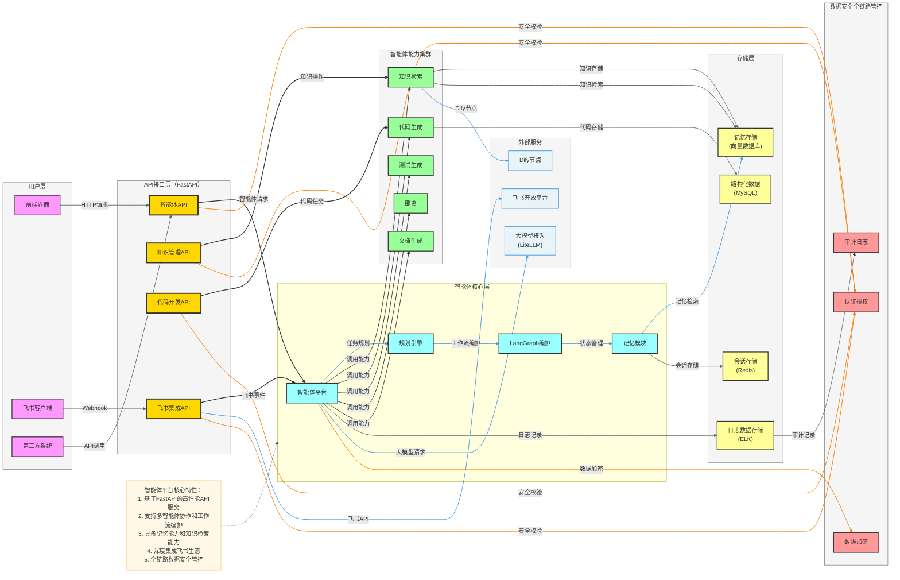

# 智能体平台架构设计

## 1. 架构概述

基于FastAPI构建的企业级智能体平台，整合RAG知识库和AI编程智能体功能，实现知识管理、代码自动化、智能客服等核心业务目标。



## 2. 核心功能模块详解

### 2.1 大模型接入能力

- **技术实现**：使用LiteLLM库实现统一的大模型调用接口
- **支持模型**：OpenAI、Anthropic、Google、本地部署模型等
- **核心功能**：
  - 模型参数管理和配置
  - 请求限流和重试机制
  - 响应缓存和结果优化
  - 模型性能监控和统计

### 2.2 会话存储

- **技术实现**：基于Redis的分布式缓存
- **核心功能**：
  - 会话状态管理
  - 临时上下文存储
  - 会话过期策略
  - 分布式会话同步

### 2.3 日志数据存储

- **技术实现**：ELK Stack（Elasticsearch + Logstash + Kibana）
- **核心功能**：
  - 结构化日志收集
  - 日志索引和检索
  - 日志分析和可视化
  - 异常检测和告警

### 2.4 记忆存储

- **技术实现**：向量数据库（Pinecone/Milvus）
- **核心功能**：
  - 长期记忆存储
  - 向量相似度检索
  - 记忆优先级管理
  - 多模态记忆支持

### 2.5 记忆架构设计（最简知识问答示例）

**记忆模块架构**：
1. **短期记忆**：存储会话级别的上下文信息
2. **长期记忆**：存储知识库级别的持久化信息
3. **记忆检索**：基于向量相似度的快速检索
4. **记忆更新**：自动学习和记忆增强

**最简知识问答示例**：
```python
# 基础工具类设计
class MemoryManager:
    def __init__(self, vector_db_client):
        self.vector_db = vector_db_client
        self.session_memory = {}
    
    def store_memory(self, user_id, memory_type, content, metadata=None):
        """存储记忆"""
        if memory_type == "session":
            if user_id not in self.session_memory:
                self.session_memory[user_id] = []
            self.session_memory[user_id].append({"content": content, "metadata": metadata})
        elif memory_type == "long_term":
            # 向量化并存储到向量数据库
            embedding = self._generate_embedding(content)
            self.vector_db.insert(embedding, content, metadata)
    
    def retrieve_memory(self, user_id, query, top_k=5):
        """检索记忆"""
        # 结合会话记忆和长期记忆
        session_memories = self.session_memory.get(user_id, [])
        
        # 向量化查询并检索长期记忆
        query_embedding = self._generate_embedding(query)
        long_term_memories = self.vector_db.query(query_embedding, top_k)
        
        return session_memories + long_term_memories
    
    def _generate_embedding(self, text):
        """生成文本嵌入"""
        # 调用嵌入模型生成向量
        pass

# 知识问答工具类
class KnowledgeQA:
    def __init__(self, memory_manager, llm_client):
        self.memory_manager = memory_manager
        self.llm_client = llm_client
    
    def answer_question(self, user_id, question):
        """回答问题"""
        # 检索相关记忆
        relevant_memories = self.memory_manager.retrieve_memory(user_id, question)
        
        # 构建上下文
        context = "".join([mem["content"] for mem in relevant_memories])
        
        # 调用大模型生成回答
        prompt = f"基于以下上下文回答问题：\n{context}\n\n问题：{question}"
        answer = self.llm_client.generate(prompt)
        
        # 存储对话到短期记忆
        self.memory_manager.store_memory(user_id, "session", f"问题：{question}\n回答：{answer}")
        
        return answer
```

### 2.6 智能体交互协议体系（基于FastAPI实现）

**API接口设计**：

| 接口路径 | 方法 | 功能描述 | 模块 |
|---------|------|---------|------|
| `/api/v1/agent/chat` | POST | 智能体对话 | 智能体核心 |
| `/api/v1/agent/memory/store` | POST | 存储记忆 | 记忆模块 |
| `/api/v1/agent/memory/retrieve` | GET | 检索记忆 | 记忆模块 |
| `/api/v1/knowledge/qa` | POST | 知识问答 | 知识管理 |
| `/api/v1/knowledge/ingest` | POST | 知识采集 | 知识管理 |
| `/api/v1/code/generate` | POST | 代码生成 | 代码开发 |
| `/api/v1/feishu/webhook` | POST | 飞书Webhook | 飞书集成 |

**交互流程**：
1. **请求处理**：FastAPI接收并验证请求
2. **认证授权**：JWT令牌验证和权限检查
3. **业务处理**：智能体核心逻辑执行
4. **数据存储**：会话、记忆、日志等存储
5. **响应返回**：结构化JSON响应

### 2.7 数据安全全链路管控

**安全措施**：
1. **认证与授权**：
   - JWT基于Token的认证
   - RBAC基于角色的访问控制
   - API速率限制和防护

2. **数据加密**：
   - 传输层加密（HTTPS）
   - 存储层加密（敏感数据）
   - 端到端加密（用户隐私数据）

3. **审计与监控**：
   - 操作审计日志
   - 异常行为检测
   - 安全事件响应

4. **合规性**：
   - 数据隐私保护
   - 合规性检查
   - 安全漏洞扫描

## 3. Dify节点集成方案

### 3.1 基础工具类设计

```python
class DifyNodeAdapter:
    def __init__(self, dify_api_key, dify_base_url):
        self.api_key = dify_api_key
        self.base_url = dify_base_url
    
    def call_node(self, node_id, inputs):
        """调用Dify节点"""
        headers = {
            "Authorization": f"Bearer {self.api_key}",
            "Content-Type": "application/json"
        }
        
        payload = {
            "node_id": node_id,
            "inputs": inputs
        }
        
        response = requests.post(
            f"{self.base_url}/api/v1/nodes/call",
            headers=headers,
            json=payload
        )
        
        return response.json()

# 集成到智能体平台
class DifyTool:
    def __init__(self, dify_adapter):
        self.dify_adapter = dify_adapter
    
    def run(self, node_id, inputs):
        """运行Dify工具"""
        result = self.dify_adapter.call_node(node_id, inputs)
        return result
```

### 3.2 集成流程

1. **配置Dify连接**：设置API密钥和基础URL
2. **注册Dify工具**：将Dify工具注册到智能体平台
3. **调用Dify节点**：智能体根据任务需要调用相应的Dify节点
4. **处理返回结果**：将Dify节点的返回结果整合到智能体的响应中

## 4. 技术栈选型

| 类别 | 技术 | 版本 | 用途 |
|------|------|------|------|
| Web框架 | FastAPI | 0.100+ | 构建高性能API服务 |
| ASGI服务器 | Uvicorn | 0.20+ | 运行FastAPI应用 |
| 关系型数据库 | MySQL | 8.0+ | 存储结构化数据 |
| 缓存 | Redis | 7.0+ | 会话存储和缓存 |
| 向量数据库 | Pinecone/Milvus | - | 记忆存储和检索 |
| 大模型接口 | LiteLLM | - | 统一大模型调用 |
| 多Agent编排 | LangGraph | - | 智能体工作流编排 |
| 日志系统 | ELK Stack | - | 日志收集和分析 |
| 安全框架 | JWT + RBAC | - | 认证授权 |

## 5. 实施路径

### 5.1 MVP实施计划

1. **阶段一**：基础架构搭建
   - 搭建FastAPI框架
   - 配置数据库和缓存
   - 实现基础认证授权

2. **阶段二**：核心功能实现
   - 大模型接入能力
   - 会话存储和管理
   - 基础记忆模块
   - 知识问答功能

3. **阶段三**：扩展功能开发
   - 智能体交互协议体系
   - Dify节点集成
   - 数据安全全链路管控

4. **阶段四**：性能优化和测试
   - 系统性能测试
   - 安全漏洞扫描
   - 优化系统架构

### 5.2 关键技术挑战

1. **大模型调用优化**：处理API限流和响应延迟
2. **记忆模块性能**：优化向量检索速度和准确性
3. **多智能体协作**：设计高效的工作流编排机制
4. **数据安全**：确保全链路数据安全和隐私保护

## 6. 结论

本架构设计提供了一个完整的智能体平台解决方案，基于FastAPI实现，包含大模型接入、会话存储、日志存储、记忆存储、知识问答、交互协议和数据安全等核心功能。通过抽象基础工具类，可以灵活接入Dify中的任意节点，实现更丰富的智能体能力。

该架构具有以下优势：
- 模块化设计，易于扩展和维护
- 高性能API服务，支持高并发
- 完整的记忆和知识管理能力
- 深度集成飞书生态
- 全链路数据安全管控
- 灵活的Dify节点集成能力

通过本架构的实施，可以构建一个功能强大、性能优异的企业级智能体平台，为企业的数字化转型提供有力支持。