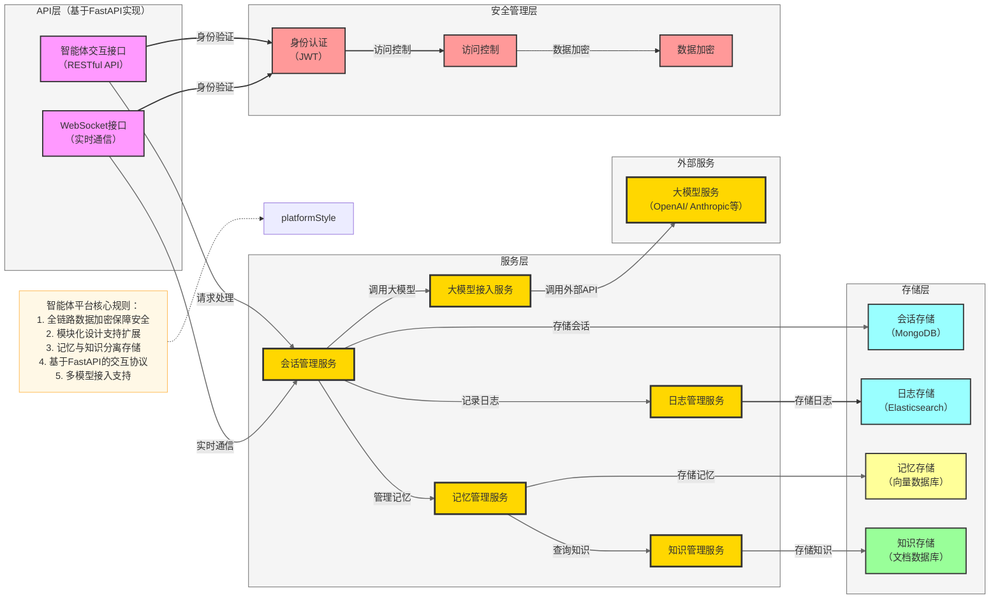

```mermaid
flowchart LR
    %% 样式定义（沿用参考风格，保持视觉一致性）
    classDef apiStyle fill:#f9f,stroke:#333,stroke-width:2px
    classDef serviceStyle fill:#ffd700,stroke:#333,stroke-width:3px
    classDef storageStyle1 fill:#9ff,stroke:#333,stroke-width:2px
    classDef storageStyle2 fill:#9f9,stroke:#333,stroke-width:2px
    classDef memoryStyle fill:#ff9,stroke:#333,stroke-width:2px
    classDef securityStyle fill:#f99,stroke:#333,stroke-width:2px
    classDef subgraphStyle fill:#f5f5f5,stroke:#666,stroke-width:1px,rounded:10px
    classDef platformStyle fill:#e8f4f8,stroke:#4299e1,stroke-width:1.5px,rounded:10px
    classDef ruleNoteStyle fill:#fff8e6,stroke:#ffb74d,stroke-width:1px,rounded:8px

    %% 1. API层
    subgraph apiLayer["API层（基于FastAPI实现）"]
        A[智能体交互接口<br/>（RESTful API）]:::apiStyle
        B[WebSocket接口<br/>（实时通信）]:::apiStyle
    end
    class apiLayer subgraphStyle

    %% 2. 服务层
    subgraph serviceLayer["服务层"]
        C[会话管理服务]:::serviceStyle
        D[大模型接入服务]:::serviceStyle
        E[记忆管理服务]:::serviceStyle
        F[知识管理服务]:::serviceStyle
        G[日志管理服务]:::serviceStyle
    end
    class serviceLayer subgraphStyle

    %% 3. 存储层
    subgraph storageLayer["存储层"]
        H[会话存储<br/>（MongoDB）]:::storageStyle1
        I[日志存储<br/>（Elasticsearch）]:::storageStyle1
        J[记忆存储<br/>（向量数据库）]:::memoryStyle
        K[知识存储<br/>（文档数据库）]:::storageStyle2
    end
    class storageLayer subgraphStyle

    %% 4. 外部服务
    subgraph externalLayer["外部服务"]
        L[大模型服务<br/>（OpenAI/ Anthropic等）]:::serviceStyle
    end
    class externalLayer subgraphStyle

    %% 5. 安全管理层
    subgraph securityLayer["安全管理层"]
        M[身份认证<br/>（JWT）]:::securityStyle
        N[数据加密]:::securityStyle
        O[访问控制]:::securityStyle
    end
    class securityLayer subgraphStyle

    %% 核心流转逻辑
    A -->|请求处理| C
    B -->|实时通信| C
    C -->|调用大模型| D
    C -->|存储会话| H
    C -->|记录日志| G
    C -->|管理记忆| E
    D -->|调用外部API| L
    E -->|存储记忆| J
    E -->|查询知识| F
    F -->|存储知识| K
    G -->|存储日志| I

    %% 安全管控
    A -->|身份验证| M
    B -->|身份验证| M
    M -->|访问控制| O
    O -->|数据加密| N

    %% 连接线统一样式
    linkStyle 0,1,2,3,4,5,6,7,8,9 stroke:#666,stroke-width:1.5px,arrowheadStyle:filled
    linkStyle 10,11,12,13 stroke:#333,stroke-width:2px,arrowheadStyle:filled

    %% 智能体平台核心规则说明
    Note[智能体平台核心规则：<br/>1. 全链路数据加密保障安全<br/>2. 模块化设计支持扩展<br/>3. 记忆与知识分离存储<br/>4. 基于FastAPI的交互协议<br/>5. 多模型接入支持]:::ruleNoteStyle
    %% 注释关联
    Note -.-> platformStyle
```