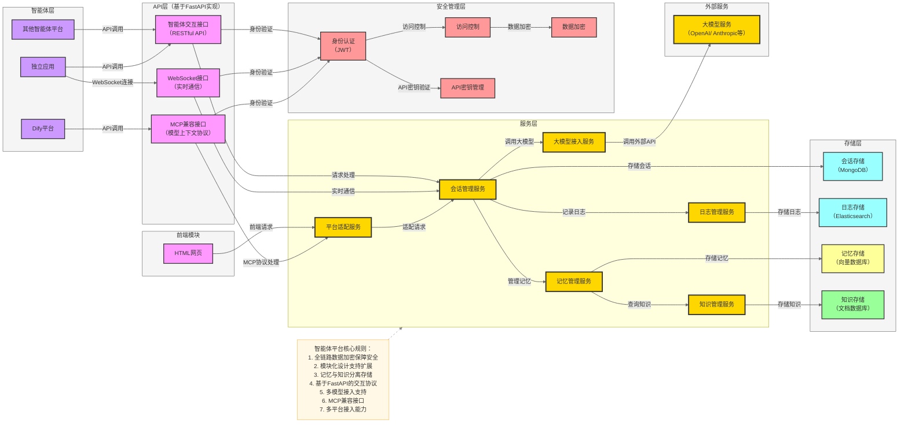

## 架构说明

### 1. 智能体层
- **Dify平台**：通过MCP兼容接口接入智能体平台
- **其他智能体平台**：通过RESTful API接入
- **独立应用**：通过RESTful API或WebSocket接口接入

### 1.1 前端模块
- **HTML网页**：通过平台适配服务接入智能体平台，提供用户交互界面

### 2. API层
- **智能体交互接口**：标准RESTful API，提供智能体核心功能
- **WebSocket接口**：支持实时通信，提供更好的用户体验
- **MCP兼容接口**：实现模型上下文协议，兼容Dify等平台

### 3. 服务层
- **会话管理服务**：管理用户会话，维护会话状态
- **大模型接入服务**：对接多种大模型API，统一接口
- **记忆管理服务**：管理智能体的记忆，支持记忆检索和存储
- **知识管理服务**：管理领域知识，支持知识检索和更新
- **日志管理服务**：记录系统和用户行为日志
- **平台适配服务**：适配不同平台的请求格式和协议

### 4. 存储层
- **会话存储**：使用MongoDB存储会话数据
- **日志存储**：使用Elasticsearch存储日志数据，支持全文搜索
- **记忆存储**：使用向量数据库存储记忆向量，支持相似度搜索
- **知识存储**：使用文档数据库存储结构化知识

### 5. 外部服务
- **大模型服务**：对接OpenAI、Anthropic等大模型API

### 6. 安全管理层
- **身份认证**：使用JWT进行身份验证
- **数据加密**：对敏感数据进行加密存储和传输
- **访问控制**：基于角色的访问控制
- **API密钥管理**：管理外部平台的API密钥

### 核心优势
1. **多平台接入**：支持Dify、其他智能体平台和独立应用
2. **MCP兼容**：实现模型上下文协议，便于与Dify等平台集成
3. **模块化设计**：各组件解耦，便于扩展和维护
4. **安全可靠**：全链路数据加密和访问控制
5. **灵活配置**：支持多种大模型和存储后端

### 实现建议
1. **优先实现MCP兼容接口**：确保与Dify平台的无缝集成
2. **完善API文档**：提供详细的API文档和SDK
3. **实现多租户隔离**：确保不同平台的数据安全
4. **优化性能**：实现缓存机制和异步处理
5. **提供管理界面**：方便配置和监控

此架构设计满足了作为中转站的需求，既可以独立运行，也可以接入Dify等平台，同时保持了系统的可扩展性和安全性。