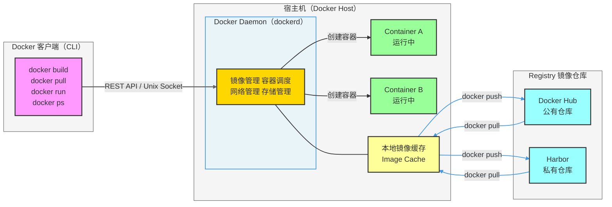
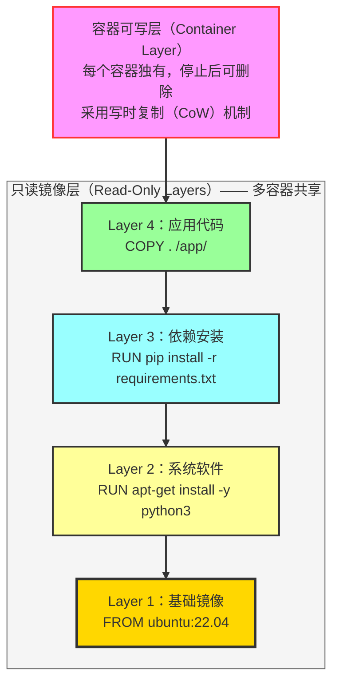
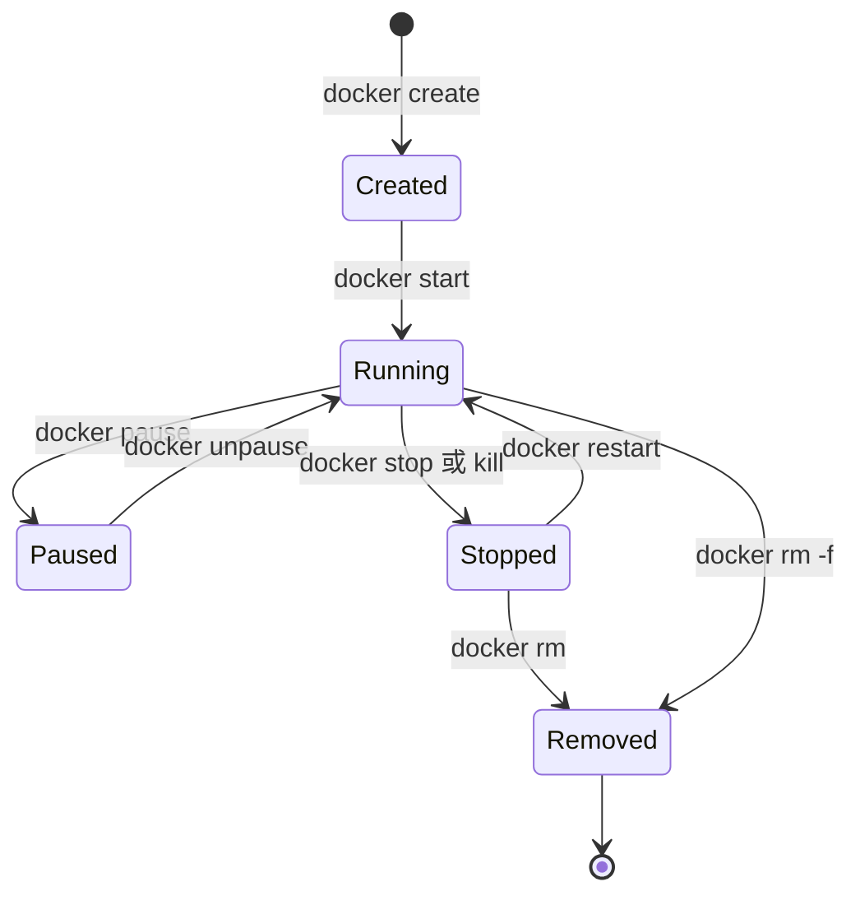
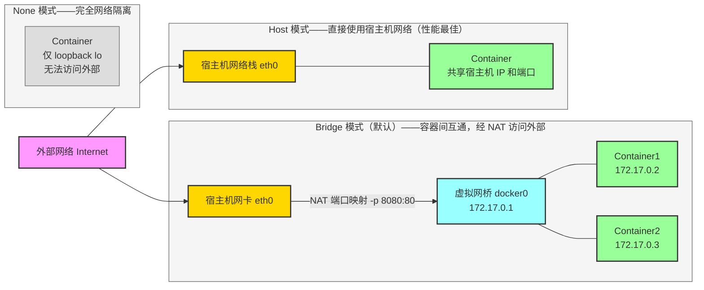

# Docker 与 Kubernetes（K8s）面试全攻略

> 系统梳理 Docker 与 K8s 核心知识、架构原理及高频面试考点，配合 Mermaid 架构图辅助理解，助你顺利通过容器化相关面试。

---

## 目录

- [一、Docker 核心知识](#一docker-核心知识)
- [二、面试 FAQ](#三面试-faq)

---

## 一、Docker 核心知识

### 1.1 Docker vs 虚拟机

| 对比维度 | 虚拟机（VM） | Docker 容器 |
|---|---|---|
| 隔离级别 | 硬件级（Hypervisor） | OS 级（namespace + cgroups） |
| 启动速度 | 分钟级 | 秒级 |
| 资源占用 | 重量级（含完整 OS） | 轻量级（共享宿主内核） |
| 镜像大小 | GB 级 | MB 级 |
| 可移植性 | 较差 | 优秀 |
| 隔离强度 | 强（完全隔离） | 相对较弱 |
| 适用场景 | 强隔离、多 OS 需求 | 微服务、快速迭代、CI/CD |

### 1.2 Docker 核心三要素

| 概念 | 说明 | 类比 |
|---|---|---|
| **镜像（Image）** | 只读模板，多层叠加，包含运行环境和应用代码 | 面向对象的**类** |
| **容器（Container）** | 镜像的运行实例，有独立的可写层和网络 | 面向对象的**对象** |
| **仓库（Registry）** | 存储和分发镜像的服务（Docker Hub / Harbor） | 代码托管的 **GitHub** |

### 1.3 Docker 整体架构

Docker 采用 **C/S（客户端-服务端）** 架构，客户端通过 REST API 或 Unix Socket 与 Docker Daemon 通信。



### 1.4 Docker 镜像层与联合文件系统（UnionFS）

Docker 镜像采用**分层存储**机制，每条 Dockerfile 指令生成一个只读层，多容器可共享相同的只读层，节省磁盘空间。



> **关键点**：镜像层是只读且可共享的，容器的改动只写入最顶层的可写层。`docker commit` 会把可写层固化成新的镜像层。

### 1.5 Docker 容器生命周期



### 1.6 Dockerfile 核心指令

| 指令 | 作用 | 注意事项 |
|---|---|---|
| `FROM` | 指定基础镜像 | 多阶段构建可多次使用 |
| `RUN` | 执行命令并生成新层 | 合并多条命令减少层数 |
| `COPY` | 复制本地文件到镜像 | 优先于 `ADD`（语义更清晰） |
| `ADD` | 复制并可自动解压 tar | 仅需解压时使用 |
| `CMD` | 容器启动的默认命令 | 可被 `docker run` 参数覆盖 |
| `ENTRYPOINT` | 容器入口点，不可轻易覆盖 | 常与 `CMD` 搭配使用 |
| `ENV` | 设置环境变量 | 运行时可用 `-e` 覆盖 |
| `EXPOSE` | 声明容器监听端口（仅文档作用） | 不自动映射宿主机端口 |
| `VOLUME` | 声明挂载点 | 持久化数据使用 |
| `WORKDIR` | 设置工作目录 | 推荐使用绝对路径 |
| `ARG` | 构建时参数（不进入镜像环境） | 仅 `docker build` 时有效 |
| `USER` | 切换运行用户 | 避免以 root 运行 |

**多阶段构建示例（减小镜像体积）**：

```dockerfile
# 阶段 1：构建阶段（包含编译工具）
FROM golang:1.21 AS builder
WORKDIR /app
COPY . .
RUN go build -o main .

# 阶段 2：运行阶段（仅包含可执行文件）
FROM alpine:3.18
WORKDIR /app
COPY --from=builder /app/main .
EXPOSE 8080
CMD ["./main"]
```

**Dockerfile 最佳实践**：
- 使用小体积基础镜像（`alpine`、`distroless`）
- 合并 `RUN` 指令减少层数：`RUN apt-get update && apt-get install -y curl && rm -rf /var/lib/apt/lists/*`
- 利用构建缓存：将不频繁变更的指令（如 `COPY requirements.txt`）放在前面
- 使用 `.dockerignore` 排除无关文件
- 避免以 `root` 用户运行容器

### 1.7 Docker 网络模式



| 网络模式 | 说明 | 适用场景 |
|---|---|---|
| `bridge`（默认） | 容器连接虚拟网桥，通过 NAT 访问外部 | 单机多容器，需端口映射 |
| `host` | 共享宿主机网络栈，无 NAT 开销 | 高性能网络，监控 Agent |
| `none` | 无网络，完全隔离 | 安全敏感场景，自定义网络 |
| `overlay` | 跨主机网络（Swarm / K8s） | 多主机容器互通 |
| `macvlan` | 容器拥有独立 MAC 地址 | 需要直接接入物理网络 |

### 1.8 Docker 数据持久化

| 存储类型 | 挂载方式 | 说明 | 适用场景 |
|---|---|---|---|
| **Volume** | `-v myvolume:/data` | Docker 管理的持久卷，存于 `/var/lib/docker/volumes/` | 生产数据持久化（推荐） |
| **Bind Mount** | `-v /host/path:/container/path` | 直接挂载宿主机目录 | 开发调试、配置文件注入 |
| **tmpfs** | `--tmpfs /tmp` | 数据存于内存，重启即删 | 临时敏感数据（不落盘） |

### 1.9 Docker Compose

Docker Compose 用于定义和管理**多容器应用**，通过 `docker-compose.yml` 描述服务拓扑。

```yaml
version: "3.9"
services:
  web:
    build: .
    ports:
      - "8000:8000"
    environment:
      - DATABASE_URL=postgresql://user:pass@db:5432/mydb
    depends_on:
      - db
    volumes:
      - ./app:/app
    restart: always

  db:
    image: postgres:15
    environment:
      POSTGRES_USER: user
      POSTGRES_PASSWORD: pass
      POSTGRES_DB: mydb
    volumes:
      - postgres_data:/var/lib/postgresql/data

  redis:
    image: redis:7-alpine
    ports:
      - "6379:6379"

volumes:
  postgres_data:
```

---


## 二、面试 FAQ

### 3.1 Docker 高频面试题

---

**Q1：Docker 容器与虚拟机的核心区别是什么？**

> Docker 容器与宿主机共享操作系统内核，通过 Linux Namespace（进程、网络、文件系统隔离）和 cgroups（CPU、内存限制）实现隔离，启动速度秒级，镜像 MB 级。虚拟机通过 Hypervisor 完整模拟硬件，含独立内核，隔离性更强但资源占用重（GB 级、分钟级启动）。

---

**Q2：Docker 镜像的分层存储有什么优势？**

> **优势**：
> 1. **共享复用**：多个镜像共享相同的基础层，节省磁盘空间
> 2. **加速构建**：未变更的层直接使用缓存，无需重新构建
> 3. **加速传输**：push/pull 时只传输变更的层
>
> **实现原理**：联合文件系统（UnionFS，如 OverlayFS）将多个只读层叠加，容器运行时在顶部添加一个可写层（CoW），修改文件时先复制到可写层再修改。

---

**Q3：COPY 和 ADD 的区别？**

> `COPY`：仅复制文件或目录，语义清晰，**推荐优先使用**。
>
> `ADD`：除复制外还支持：① 自动解压 `.tar`、`.tar.gz` 等压缩包；② 从 URL 下载文件（不推荐，无缓存且不安全）。
>
> **最佳实践**：仅需解压 tar 包时才使用 `ADD`，其他情况一律使用 `COPY`。

---

**Q4：CMD 和 ENTRYPOINT 的区别？**

> - `CMD`：容器默认启动命令，**可被** `docker run` 末尾的参数完全覆盖
> - `ENTRYPOINT`：容器的固定入口，`docker run` 的参数作为 **追加参数** 传入，不会被覆盖（除非 `--entrypoint` 显式指定）
>
> **配合使用**：`ENTRYPOINT ["python", "app.py"]` + `CMD ["--port=8080"]`，运行时 `CMD` 可作为默认参数被覆盖。

---

**Q5：如何缩小 Docker 镜像体积？**

> 1. 使用小基础镜像（`alpine`、`scratch`、`distroless`）
> 2. **多阶段构建**：构建产物复制到空镜像，丢弃编译工具
> 3. 合并 `RUN` 命令，并在同一层清理缓存（`rm -rf /var/cache/apt`）
> 4. 使用 `.dockerignore` 排除 `.git`、`node_modules`、测试文件等
> 5. 避免安装不必要的依赖（`apt-get install --no-install-recommends`）

---

**Q6：Docker 的网络模式有哪些？各适合什么场景？**

> - `bridge`（默认）：容器通过虚拟网桥互通，经 NAT 访问外部，适合单机多容器场景
> - `host`：容器直接使用宿主机网络，无 NAT 开销，适合高性能网络场景（监控 Agent）
> - `none`：无网络，完全隔离，适合安全敏感或自定义网络
> - `overlay`：跨主机网络（Docker Swarm / K8s），多主机容器互通
> - `macvlan`：容器拥有独立 MAC 地址，直接接入物理网络

---

**Q7：Volume 和 Bind Mount 的区别？**

> | | Volume | Bind Mount |
> |---|---|---|
> | 管理方 | Docker 管理（`/var/lib/docker/volumes/`） | 宿主机路径，用户管理 |
> | 可移植性 | 高（跨主机迁移方便） | 低（依赖宿主机路径） |
> | 权限控制 | Docker 控制 | 依赖宿主机权限 |
> | 推荐场景 | 生产数据持久化 | 开发时代码热重载 |

---

**Q8：如何查看容器日志、进入容器和查看资源使用？**

> ```bash
> docker logs -f --tail=100 <container>   # 实时查看日志
> docker exec -it <container> /bin/sh     # 进入容器
> docker stats                             # 查看资源使用（CPU/内存）
> docker inspect <container>              # 查看容器详细配置
> docker top <container>                  # 查看容器进程
> ```

---

**Q9：Docker Compose 的 depends_on 能保证服务就绪吗？**

> **不能完全保证**。`depends_on` 只保证容器的**启动顺序**（等待依赖容器 **created/started** 状态），不等待应用真正就绪（如数据库接受连接）。
>
> **解决方案**：
> 1. 在应用代码中加入重试逻辑
> 2. 使用 `healthcheck` + `condition: service_healthy`
> 3. 使用 `wait-for-it.sh` 等脚本等待端口可用

---

**Q10：什么是 Docker 的数据卷（Volume）生命周期？**

> Volume 独立于容器的生命周期：删除容器（`docker rm`）不会删除 Volume，需要 `docker rm -v` 或 `docker volume rm <name>` 显式删除。`docker volume prune` 可清理未被任何容器使用的 Volume。

---

**Q11：如何实现 Docker 镜像的安全扫描？**

> 1. 使用 `docker scout`（官方）或 `trivy`、`snyk` 扫描镜像漏洞
> 2. 不以 `root` 用户运行（`USER` 指令）
> 3. 使用官方或可信基础镜像，定期更新
> 4. 最小权限原则：只暴露必要端口，最小化安装包
> 5. 使用镜像签名（`docker trust`）验证镜像完整性

---

**Q12：什么是 Docker BuildKit？有什么优势？**

> BuildKit 是 Docker 新一代构建引擎（Docker 23.0+ 默认启用），优势：
> 1. **并行构建**：无依赖的构建步骤并行执行
> 2. **智能缓存**：更精细的缓存失效机制
> 3. **Secret 支持**：构建时安全传入敏感信息（不写入镜像层）
> 4. **多平台构建**：`docker buildx` 构建 ARM/x86 等多架构镜像
> 5. **内联缓存**：`--cache-to` / `--cache-from` 在 CI 中复用缓存

---

**Q13：容器退出后数据会丢失吗？**

> 容器的**可写层**在容器删除后会丢失。若要持久化数据需使用：
> - Volume（推荐）
> - Bind Mount
>
> 注意：`docker stop`（停止）不会丢失数据，`docker rm`（删除）才会删除容器可写层。

---

**Q14：如何限制容器的资源使用？**

> ```bash
> docker run \
>   --cpus=2 \           # 限制使用 2 个 CPU 核心
>   --memory=512m \      # 内存上限 512MB
>   --memory-swap=1g \   # 内存+Swap 上限 1GB
>   --pids-limit=100 \   # 最大进程数 100
>   myapp:latest
> ```

---

**Q15：什么是 OCI 标准？**

> OCI（Open Container Initiative）是容器行业标准：
> - **OCI Runtime Spec**：定义容器运行时规范（runc 是参考实现）
> - **OCI Image Spec**：定义容器镜像格式
> - **OCI Distribution Spec**：定义镜像仓库 API
>
> Docker、containerd、CRI-O 都遵循 OCI 标准，保证了容器生态的互操作性。

---