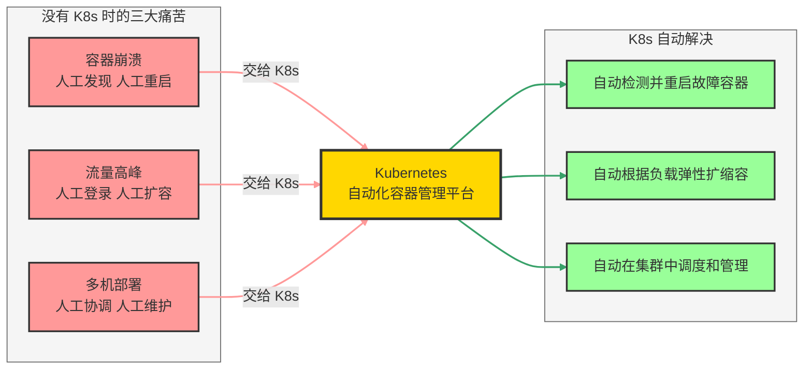
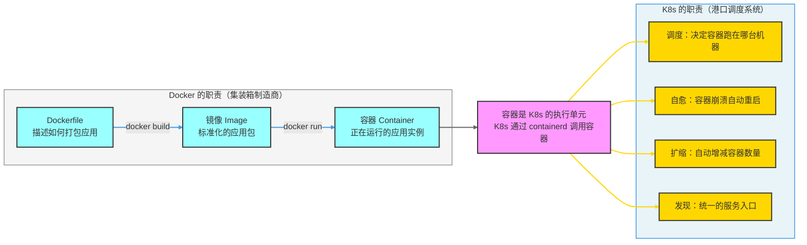
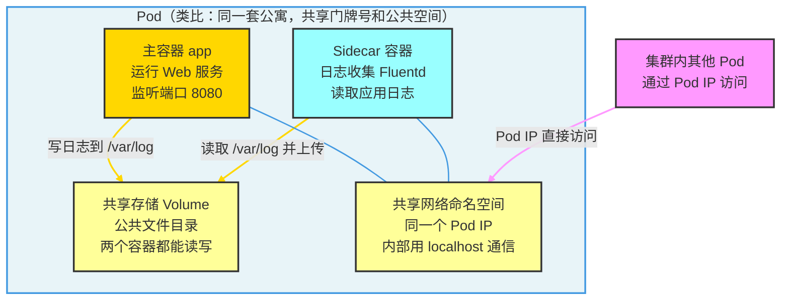
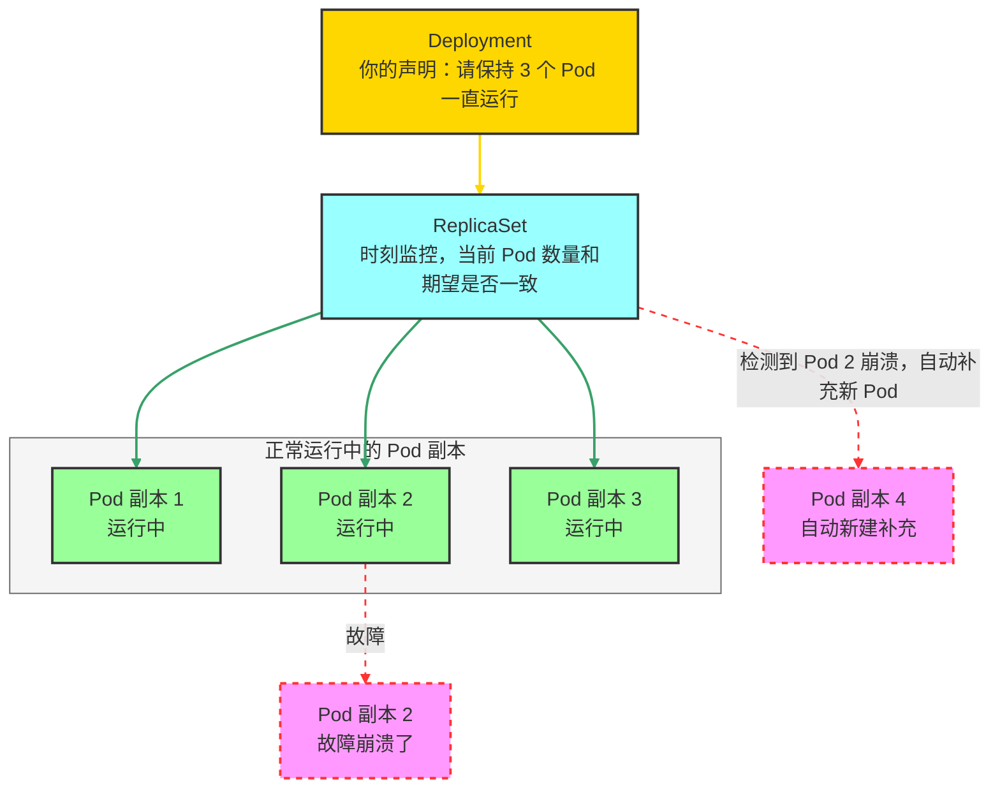
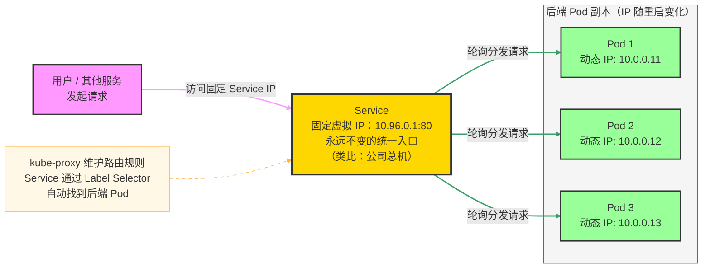
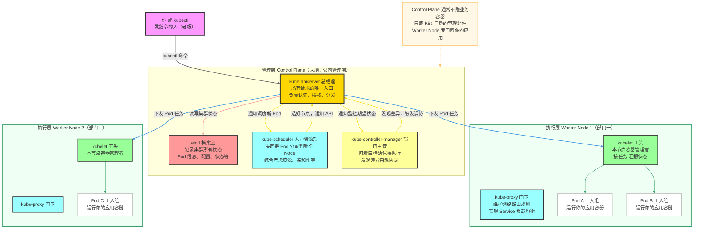
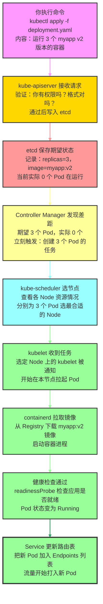
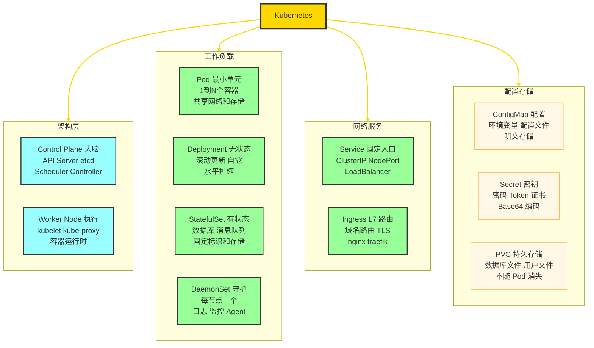

# K8s 入门指南（零基础版）

> **写给完全不了解 K8s 的你**。本文用大量生活类比和图解，从"为什么需要 K8s"出发，一步一步带你理解 Kubernetes 的核心概念和工作原理。读完后再去看面试攻略，会清晰很多。

---

## 目录

1. [先从 Docker 说起：单打独斗的局限](#一先从-docker-说起单打独斗的局限)
2. [Docker 与 K8s 的关系：制造 vs 管理](#二docker-与-k8s-的关系制造-vs-管理)
3. [K8s 是什么？用一句话理解](#三k8s-是什么用一句话理解)
4. [K8s 的核心概念逐一拆解](#四k8s-的核心概念逐一拆解)
5. [K8s 集群全景架构图解](#五k8s-集群全景架构图解)
6. [一次部署的完整旅程](#六一次部署的完整旅程)
7. [最小可用的 K8s 配置示例](#七最小可用的-k8s-配置示例)

---

## 一、先从 Docker 说起：单打独斗的局限

假设你用 Docker 部署了一个网站，运行在一台服务器上。一开始一切正常，但慢慢地你会遇到这些问题：

| 场景 | 没有 K8s 时 | 有 K8s 时 |
|---|---|---|
| **容器崩溃** | 你凌晨 3 点收到告警，手动 SSH 上去重启 | K8s 自动检测，秒级重启，你继续睡觉 |
| **流量暴增** | 你手动在多台服务器上部署更多容器 | K8s 根据 CPU 指标自动扩容 Pod |
| **服务器宕机** | 该机器上所有容器全部挂掉，手动迁移 | K8s 自动把容器迁移到健康的服务器 |
| **版本更新** | 停服维护，或者手动一台台更新 | K8s 滚动更新，零停机切换新版本 |
| **多服务部署** | 手动管理几十台服务器上的几百个容器 | K8s 统一管理，`kubectl` 一条命令搞定 |



---

## 二、Docker 与 K8s 的关系：制造 vs 管理

> **最常见的误解**：很多人以为 K8s 和 Docker 是竞争关系，或者用了 K8s 就不需要 Docker 了。

**正确理解**：它们是**分工合作**的关系，就像"集装箱制造商"和"港口调度系统"：

- **Docker**：负责**制造集装箱**（打包镜像、运行容器）
- **K8s**：负责**管理所有集装箱**（调度到哪艘船、出了问题怎么处理、数量不够怎么补充）



**一句话总结**：
- Docker = 把应用打包成"集装箱"的工具
- K8s = 管理成千上万个"集装箱"的自动化调度平台
- **两者不冲突，K8s 在底层仍然使用 containerd（Docker 的核心组件）来运行容器**

---

## 三、K8s 是什么？用一句话理解

> **Kubernetes（K8s）是一个自动化容器编排平台，帮你管理大量容器的部署、扩缩、自愈和服务发现。**

**为什么叫 K8s？**
K-u-b-e-r-n-e-t-e-s，中间有 8 个字母，所以缩写为 K8s。来自希腊语"舵手/领航员"的意思。

**K8s 能帮你做什么？**

| 能力 | 说明 |
|---|---|
| **自动部署** | 告诉 K8s"我要运行 5 个 Nginx"，它自动搞定 |
| **故障自愈** | 某个容器崩了，K8s 自动重启；某台服务器挂了，K8s 把容器迁移到健康机器 |
| **弹性扩缩** | CPU 高了自动加容器，低了自动减，省钱省心 |
| **服务发现** | 不用记容器的 IP（它随时变），K8s 给你一个固定入口 |
| **滚动更新** | 新版本发布，K8s 逐步替换旧容器，用户无感知 |
| **配置管理** | 统一管理环境变量、密码、证书，不用在代码里硬写 |

---

## 四、K8s 的核心概念逐一拆解

### 4.1 集群（Cluster）：K8s 管理的所有机器

**类比**：一家公司（K8s 集群）= 管理层（Control Plane）+ 若干个部门（Worker Node）

集群是 K8s 管理的一组服务器（物理机或虚拟机）的总称。你的应用运行在这些服务器上，K8s 统一调度和管理。

---

### 4.2 节点（Node）：集群里的一台服务器

**类比**：公司里的一个部门，或者一艘运载集装箱的货船

Node 就是集群里的一台实际机器（服务器）。K8s 集群里有两种 Node：
- **控制面节点（Control Plane / Master）**：大脑，负责管理
- **工作节点（Worker Node）**：执行层，负责跑你的应用

---

### 4.3 Pod：K8s 里最小的部署单元

> **Pod 是 K8s 里最重要的概念，没有之一**。所有应用最终都跑在 Pod 里。

**类比**：Pod = 一套公寓（宿舍）

- 一个 Pod 里可以有 **一个或多个容器**（就像宿舍里住 1-4 个人）
- Pod 里的所有容器**共享同一个网络**（同一个 IP，就像同一门牌号）
- Pod 里的容器可以**共享存储卷**（公共文件夹）
- Pod 里的容器**通过 localhost 直接互相访问**（室友之间直接喊话）



**为什么不直接用容器，而要用 Pod？**
- Pod 解决了"紧密协作的多容器"问题（主程序 + 日志收集器 + 配置监听器）
- Pod 是 K8s 的**调度原子单元**，K8s 总是整体调度一个 Pod，不拆开
- Pod 内的容器天然实现了**服务发现**（localhost 直接访问）

---

### 4.4 Deployment：管理 Pod 副本的"班组长"

> **问题**：Pod 如果直接手动创建，一旦崩溃就消失了，没人管。

**Deployment** 就是解决这个问题的——它是一个"班组长"：
- 你告诉 Deployment："帮我保持 3 个 Pod 一直运行"
- Deployment 通过 **ReplicaSet（副本集）** 时刻盯着，发现 Pod 少了就自动补充
- 支持滚动更新（升级新版本）和一键回滚



---

### 4.5 Service：固定的服务入口（对外的"总机"）

> **问题**：Pod 的 IP 地址随时会变（Pod 重启后 IP 不同），客户端怎么访问？

**Service** 是 K8s 提供的**固定虚拟 IP**，类比公司的"总机电话"：
- 无论员工（Pod）怎么换，总机号码（Service IP）永远不变
- Service 自动把请求**负载均衡**分发给后端健康的 Pod
- Pod 用**标签（Label）** 和 Service 关联，不是硬编码 IP



---

### 4.6 其他重要概念速览

| 概念 | 类比 | 一句话说明 |
|---|---|---|
| **Namespace** | 公司不同部门的隔离办公室 | 把资源分组隔离，同名资源在不同 Namespace 互不干扰 |
| **ConfigMap** | 配置文件柜 | 存储非敏感配置（端口号、URL 等），与代码分离 |
| **Secret** | 保险柜 | 存储敏感信息（密码、Token、证书），Base64 编码 |
| **Ingress** | 公司前台大厅 | 统一对外的 HTTP/HTTPS 入口，支持域名路由 |
| **PersistentVolume** | 公司的共享网盘 | 不随 Pod 消失的持久化存储 |
| **HPA** | 自动调班的 HR | 根据 CPU/内存自动增减 Pod 副本数 |

---

## 五、K8s 集群全景架构图解

K8s 集群 = **管理层（Control Plane）** + **执行层（Worker Nodes）**

用公司类比来理解：



### 各组件一句话解释

| 组件 | 公司类比 | 一句话职责 |
|---|---|---|
| **kube-apiserver** | 总经理 / 总台 | 所有请求的唯一入口，负责认证、授权，将结果存入 etcd |
| **etcd** | 公司档案室 | 存储整个集群的所有状态数据（唯一真实来源） |
| **kube-scheduler** | 人力资源部 | 为新 Pod 选择最合适的 Node（Filter 过滤 + Score 打分） |
| **kube-controller-manager** | 部门主管 | 持续监控期望状态 vs 实际状态，发现差异自动协调 |
| **kubelet** | 工头（在 Node 上） | 接收 API Server 的 Pod 任务，管理本节点容器生命周期 |
| **kube-proxy** | 门卫 / 路由器 | 维护 iptables/IPVS 规则，实现 Service 网络转发 |

---

## 六、一次部署的完整旅程

当你执行 `kubectl apply -f deployment.yaml` 时，发生了什么？



### 关键时间线

```
T+0s   你执行 kubectl apply
T+1s   API Server 验证通过，etcd 写入期望状态
T+2s   Controller Manager 发现差距，创建 Pod 对象
T+3s   Scheduler 完成节点选择
T+5s   kubelet 开始拉取镜像（如果本地有缓存则跳过）
T+15s  容器启动，readinessProbe 开始检查
T+20s  健康检查通过，Pod Running，流量开始进入
```

---

## 七、最小可用的 K8s 配置示例

下面是一个完整的"Hello World"级别 K8s 部署，包含一个 Web 应用的全部必要配置。

### 7.1 Deployment：声明应用运行方式

```yaml
# deployment.yaml
apiVersion: apps/v1
kind: Deployment
metadata:
  name: myapp              # Deployment 的名字
  namespace: default       # 所在的命名空间
spec:
  replicas: 3              # 告诉 K8s：帮我保持 3 个副本一直运行
  selector:
    matchLabels:
      app: myapp           # 这个 Deployment 管理带 app=myapp 标签的 Pod
  template:                # Pod 模板（每个副本长什么样）
    metadata:
      labels:
        app: myapp         # Pod 的标签（Service 靠这个找到 Pod）
    spec:
      containers:
      - name: app
        image: nginx:1.25  # 使用的镜像
        ports:
        - containerPort: 80
        resources:
          requests:        # 调度时保证的最低资源
            cpu: "100m"    # 0.1 个 CPU 核心
            memory: "128Mi"
          limits:          # 使用上限，超出会被限制或 OOMKill
            cpu: "500m"
            memory: "512Mi"
        readinessProbe:    # 就绪检查：通过后才开始接流量
          httpGet:
            path: /
            port: 80
          initialDelaySeconds: 5
          periodSeconds: 10
        livenessProbe:     # 存活检查：失败则重启容器
          httpGet:
            path: /
            port: 80
          initialDelaySeconds: 15
          periodSeconds: 20
```

### 7.2 Service：暴露服务入口

```yaml
# service.yaml
apiVersion: v1
kind: Service
metadata:
  name: myapp-svc
spec:
  selector:
    app: myapp             # 找到所有带 app=myapp 标签的 Pod
  ports:
  - protocol: TCP
    port: 80               # Service 对外暴露的端口
    targetPort: 80         # 转发到 Pod 的哪个端口
  type: ClusterIP          # 仅集群内访问（默认类型）
```

### 7.3 ConfigMap：注入配置

```yaml
# configmap.yaml
apiVersion: v1
kind: ConfigMap
metadata:
  name: myapp-config
data:
  APP_ENV: "production"
  LOG_LEVEL: "info"
  MAX_CONNECTIONS: "100"
```

### 7.4 常用 kubectl 命令

```bash
# 部署应用
kubectl apply -f deployment.yaml
kubectl apply -f service.yaml

# 查看状态
kubectl get pods                         # 查看所有 Pod
kubectl get pods -o wide                 # 附带 IP 和所在节点
kubectl get deployments                  # 查看 Deployment 状态
kubectl get services                     # 查看 Service

# 查看详情和日志
kubectl describe pod <pod-name>          # 查看 Pod 详细信息（排错利器）
kubectl logs <pod-name>                  # 查看容器日志
kubectl logs <pod-name> -f               # 实时跟踪日志
kubectl logs <pod-name> -c <container>   # 多容器 Pod 指定容器

# 进入容器调试
kubectl exec -it <pod-name> -- /bin/sh

# 扩缩容
kubectl scale deployment myapp --replicas=5

# 更新镜像（触发滚动更新）
kubectl set image deployment/myapp app=nginx:1.26

# 查看更新进度
kubectl rollout status deployment/myapp

# 回滚
kubectl rollout undo deployment/myapp

# 删除资源
kubectl delete -f deployment.yaml
```

---

## 总结：K8s 核心知识脑图



---

> **下一步**：理解了这份入门文档后，推荐阅读同目录下的 [K8s 面试全攻略](./K8s面试全攻略.md) 深入掌握细节，以及 [Docker 面试全攻略](./Docker面试全攻略.md) 夯实 Docker 基础。
