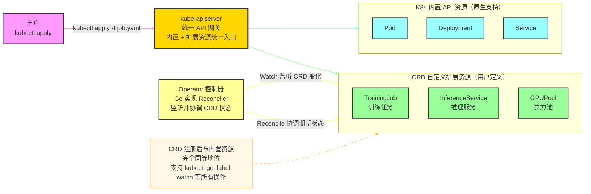
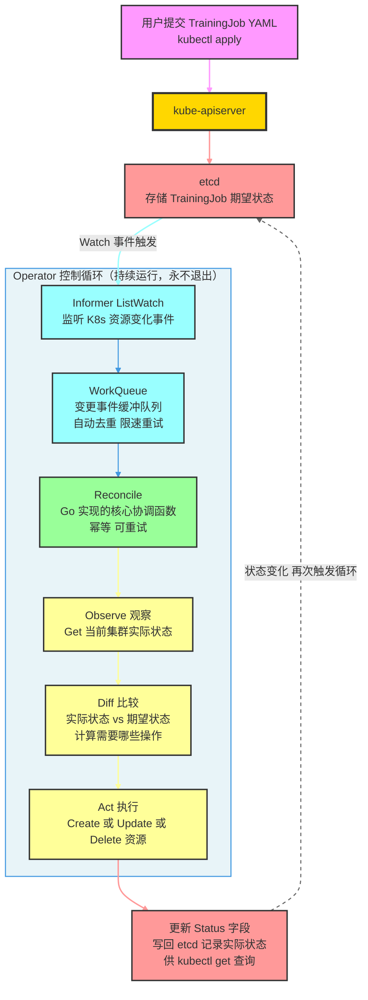
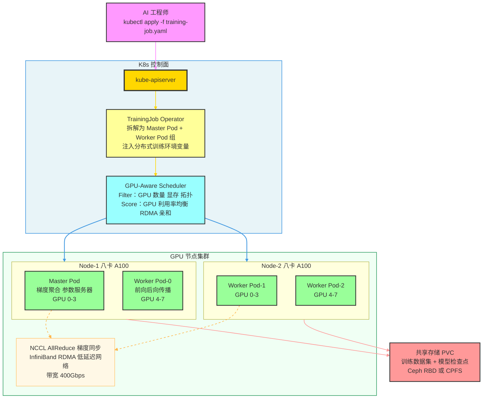
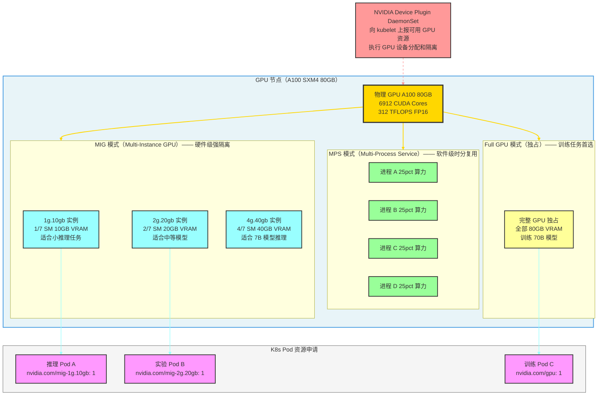
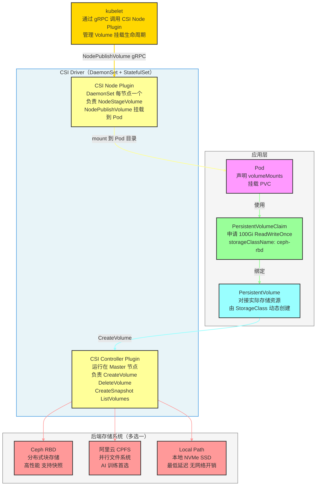
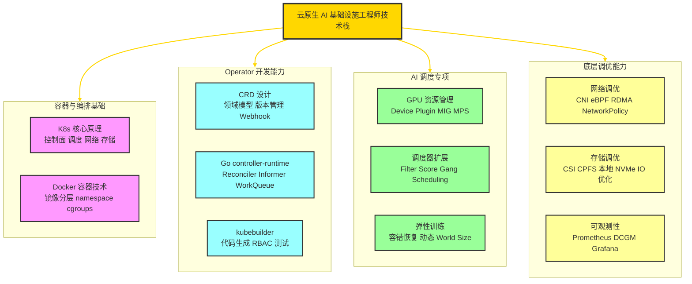

# K8s 进阶：AI 基础设施与云原生深度实践

> 本文面向已掌握 K8s 基础的读者，深度讲解 **CRD/Operator 开发（Go 语言）**、**AI 训练推理任务资源调度**、**GPU 算力池精细化管理**、**K8s 网络与存储底层调优**，是通往云原生 AI 基础设施工程师的核心知识图谱。

---

## 目录

1. [CRD 与 Operator 原理深度解析](#一crd-与-operator-原理深度解析)
2. [Go 实现 TrainingJob Operator 全流程](#二go-实现-trainingjob-operator-全流程)
3. [AI 训练与推理任务动态资源调度](#三ai-训练与推理任务动态资源调度)
4. [GPU 算力池精细化管理](#四gpu-算力池精细化管理)
5. [K8s 调度器深度扩展](#五k8s-调度器深度扩展)
6. [K8s 底层网络深度解析](#六k8s-底层网络深度解析)
7. [K8s 底层存储调优](#七k8s-底层存储调优)

---

## 一、CRD 与 Operator 原理深度解析

### 1.1 为什么需要 CRD / Operator？

K8s 内置资源（Pod、Deployment、Service）只能处理通用场景。当面对 AI 训练任务、GPU 算力池等领域专属需求时，内置资源力不从心：

| 需求场景 | 内置资源的局限 | CRD/Operator 的解决方案 |
|---|---|---|
| PyTorch 分布式训练 | 需要手动协调 Master/Worker 启动顺序 | `TrainingJob` CRD 自动编排 |
| 弹性推理扩缩容 | HPA 只支持 CPU/Memory，不懂 GPU 利用率 | `InferenceService` CRD + 自定义 HPA 指标 |
| GPU 显存切分 | 无法感知 MIG 实例，资源浪费严重 | `GPUPool` CRD + Device Plugin 联动 |
| 训练任务抢占 | 默认调度无优先级感知 | Operator 实现优先级调度与抢占逻辑 |

**核心公式**：

```
Operator = CRD（定义领域资源） + Controller（实现领域逻辑）
```

### 1.2 CRD 扩展 K8s API 架构



### 1.3 Operator 控制循环：Reconcile Loop

Operator 的核心是**永不停歇的控制循环**，通过 `Watch → Enqueue → Reconcile` 持续将集群状态拉向期望状态。



**Reconcile 三大设计原则**：

| 原则 | 说明 | 实现要点 |
|---|---|---|
| **幂等性** | 多次执行结果相同，避免重复创建 | 操作前先 Get，用 `CreateOrUpdate` |
| **可重试** | 失败后自动重入队列，返回 `err` 或 `RequeueAfter` | 合理设置退避时间 |
| **无假设** | 不依赖事件类型（Create/Update/Delete），只看当前状态 | 从 API Server Get 最新状态 |

---

## 二、Go 实现 TrainingJob Operator 全流程

### 2.1 开发工具链

```bash
# 安装 kubebuilder（Operator 开发脚手架）
curl -L -o kubebuilder "https://go.kubebuilder.io/dl/latest/$(go env GOOS)/$(go env GOARCH)"
chmod +x kubebuilder && mv kubebuilder /usr/local/bin/

# 初始化项目
mkdir training-operator && cd training-operator
kubebuilder init --domain ai.company.com --repo github.com/company/training-operator

# 创建 API（自动生成 CRD 模板和 Controller 框架）
kubebuilder create api --group training --version v1 --kind TrainingJob
```

生成的项目结构：

```
training-operator/
├── api/v1/
│   ├── trainingjob_types.go      ← CRD 类型定义（核心）
│   └── zz_generated.deepcopy.go  ← 自动生成
├── internal/controller/
│   └── trainingjob_controller.go ← Reconciler 实现（核心）
├── config/
│   ├── crd/bases/                ← 自动生成的 CRD YAML
│   └── rbac/                     ← RBAC 权限配置
└── main.go                       ← Manager 启动入口
```

### 2.2 CRD 类型定义（types.go）

```go
// api/v1/trainingjob_types.go
package v1

import (
    corev1 "k8s.io/api/core/v1"
    metav1 "k8s.io/apimachinery/pkg/apis/meta/v1"
    "k8s.io/apimachinery/pkg/api/resource"
)

// TrainingJobSpec 定义训练任务的期望状态
type TrainingJobSpec struct {
    // 训练框架类型：PyTorch / TensorFlow / JAX
    Framework string `json:"framework"`

    // Master 节点配置（参数聚合）
    Master ReplicaSpec `json:"master"`

    // Worker 节点配置（实际计算）
    Worker ReplicaSpec `json:"worker"`

    // 训练优先级：high / medium / low（影响调度抢占）
    Priority string `json:"priority,omitempty"`
}

// ReplicaSpec 定义单类副本的配置
type ReplicaSpec struct {
    // 副本数量
    Replicas int32 `json:"replicas"`

    // Pod 模板（继承 K8s 原生 PodTemplateSpec）
    Template corev1.PodTemplateSpec `json:"template"`
}

// TrainingJobStatus 记录任务实际运行状态
type TrainingJobStatus struct {
    // 任务阶段：Pending / Running / Succeeded / Failed
    Phase string `json:"phase,omitempty"`

    // 开始和结束时间
    StartTime      *metav1.Time `json:"startTime,omitempty"`
    CompletionTime *metav1.Time `json:"completionTime,omitempty"`

    // 当前正在运行的 Pod 数量
    ActivePods int32 `json:"activePods,omitempty"`

    // 条件列表（可观测性）
    Conditions []TrainingJobCondition `json:"conditions,omitempty"`
}

// TrainingJob 是 CRD 的顶层结构（对应 YAML 中的一个资源对象）
// +kubebuilder:object:root=true
// +kubebuilder:subresource:status
// +kubebuilder:printcolumn:name="Phase",type="string",JSONPath=".status.phase"
// +kubebuilder:printcolumn:name="Age",type="date",JSONPath=".metadata.creationTimestamp"
type TrainingJob struct {
    metav1.TypeMeta   `json:",inline"`
    metav1.ObjectMeta `json:"metadata,omitempty"`

    Spec   TrainingJobSpec   `json:"spec,omitempty"`
    Status TrainingJobStatus `json:"status,omitempty"`
}
```

### 2.3 Reconciler 核心实现

```go
// internal/controller/trainingjob_controller.go
package controller

import (
    "context"
    "fmt"

    batchv1 "k8s.io/api/batch/v1"
    corev1 "k8s.io/api/core/v1"
    "k8s.io/apimachinery/pkg/api/errors"
    metav1 "k8s.io/apimachinery/pkg/apis/meta/v1"
    ctrl "sigs.k8s.io/controller-runtime"
    "sigs.k8s.io/controller-runtime/pkg/client"

    trainingv1 "github.com/company/training-operator/api/v1"
)

// TrainingJobReconciler 实现核心控制循环
type TrainingJobReconciler struct {
    client.Client  // K8s API 客户端（读写资源）
    Scheme *runtime.Scheme
}

// Reconcile 是控制器的核心函数，每次 TrainingJob 状态变化都会触发
// req.NamespacedName 指定了触发本次调协的具体资源
func (r *TrainingJobReconciler) Reconcile(ctx context.Context, req ctrl.Request) (ctrl.Result, error) {
    log := log.FromContext(ctx)

    // ① Observe：获取当前 TrainingJob 对象（期望状态）
    job := &trainingv1.TrainingJob{}
    if err := r.Get(ctx, req.NamespacedName, job); err != nil {
        if errors.IsNotFound(err) {
            // 对象已被删除，清理关联资源
            log.Info("TrainingJob not found, may have been deleted")
            return ctrl.Result{}, nil
        }
        return ctrl.Result{}, err
    }

    // ② Diff：获取关联的 Pod 列表（实际状态）
    podList := &corev1.PodList{}
    if err := r.List(ctx, podList,
        client.InNamespace(job.Namespace),
        client.MatchingLabels{"training-job": job.Name},
    ); err != nil {
        return ctrl.Result{}, err
    }

    // ③ Act：根据差距执行操作
    // 情况一：Master Pod 不存在，创建它
    if !r.masterExists(podList) {
        if err := r.createMasterPod(ctx, job); err != nil {
            return ctrl.Result{}, fmt.Errorf("failed to create master pod: %w", err)
        }
        // 创建后重新入队，等待 Master Ready 再创建 Worker
        return ctrl.Result{RequeueAfter: 5 * time.Second}, nil
    }

    // 情况二：Master Ready，创建 Worker Pod 组
    if r.masterReady(podList) && !r.workersCreated(podList, job) {
        for i := int32(0); i < job.Spec.Worker.Replicas; i++ {
            if err := r.createWorkerPod(ctx, job, i); err != nil {
                return ctrl.Result{}, err
            }
        }
    }

    // ④ 更新 Status
    newStatus := r.computeStatus(job, podList)
    if !reflect.DeepEqual(job.Status, newStatus) {
        job.Status = newStatus
        if err := r.Status().Update(ctx, job); err != nil {
            return ctrl.Result{}, err
        }
    }

    return ctrl.Result{}, nil
}

// createMasterPod 创建 Master 角色的 Pod，注入分布式训练环境变量
func (r *TrainingJobReconciler) createMasterPod(ctx context.Context, job *trainingv1.TrainingJob) error {
    pod := &corev1.Pod{
        ObjectMeta: metav1.ObjectMeta{
            Name:      fmt.Sprintf("%s-master-0", job.Name),
            Namespace: job.Namespace,
            Labels: map[string]string{
                "training-job": job.Name,
                "role":         "master",
            },
            // 设置 OwnerReference，TrainingJob 删除时 Pod 自动级联删除
            OwnerReferences: []metav1.OwnerReference{
                *metav1.NewControllerRef(job, trainingv1.GroupVersion.WithKind("TrainingJob")),
            },
        },
        Spec: job.Spec.Master.Template.Spec,
    }

    // 注入 PyTorch 分布式训练必要的环境变量
    pod.Spec.Containers[0].Env = append(pod.Spec.Containers[0].Env,
        corev1.EnvVar{Name: "MASTER_ADDR", Value: fmt.Sprintf("%s-master-0.%s.svc.cluster.local", job.Name, job.Namespace)},
        corev1.EnvVar{Name: "MASTER_PORT", Value: "23456"},
        corev1.EnvVar{Name: "WORLD_SIZE", Value: fmt.Sprintf("%d", job.Spec.Worker.Replicas+1)},
        corev1.EnvVar{Name: "RANK", Value: "0"},
    )

    return r.Create(ctx, pod)
}

// SetupWithManager 注册控制器：监听 TrainingJob 和关联 Pod 的变化
func (r *TrainingJobReconciler) SetupWithManager(mgr ctrl.Manager) error {
    return ctrl.NewControllerManagedBy(mgr).
        For(&trainingv1.TrainingJob{}).   // 主要监听对象
        Owns(&corev1.Pod{}).              // 当 owned Pod 变化时也触发 Reconcile
        WithOptions(controller.Options{
            MaxConcurrentReconciles: 10,  // 并发协调数
        }).
        Complete(r)
}
```

### 2.4 完整 CRD 使用示例（YAML）

```yaml
# training-job.yaml
apiVersion: training.ai.company.com/v1
kind: TrainingJob
metadata:
  name: llm-finetune-job
  namespace: ai-training
spec:
  framework: PyTorch
  priority: high

  master:
    replicas: 1
    template:
      spec:
        containers:
        - name: trainer
          image: pytorch:2.1-cuda12.1
          command: ["torchrun", "--nnodes=3", "--master-addr=$(MASTER_ADDR)", "train.py"]
          resources:
            limits:
              nvidia.com/gpu: "4"         # 申请 4 张 GPU
              memory: "64Gi"

  worker:
    replicas: 2                           # 2 个 Worker Node，加 Master 共 3 节点
    template:
      spec:
        containers:
        - name: trainer
          image: pytorch:2.1-cuda12.1
          resources:
            limits:
              nvidia.com/gpu: "4"
```

---

## 三、AI 训练与推理任务动态资源调度

### 3.1 AI 工作负载特点分析

| 特点 | 训练任务（Training） | 推理任务（Inference） |
|---|---|---|
| 资源需求 | 高 GPU 算力、大显存、RDMA 网络 | 低延迟、GPU 利用率要求高 |
| 时长 | 小时到天级别 | 毫秒级响应 |
| 可中断性 | 支持检查点续训 | 不可中断，需要 SLA 保证 |
| 扩缩模式 | 固定 World Size，不支持动态扩缩 | 支持水平弹性扩缩 |
| 典型框架 | PyTorch DDP、Megatron-LM、DeepSpeed | vLLM、TensorRT、TGI |

### 3.2 AI 任务全链路调度架构



### 3.3 动态资源分配关键策略

**训练任务队列管理**：

```go
// 基于优先级的抢占逻辑（在 Reconciler 中实现）
func (r *TrainingJobReconciler) handlePreemption(ctx context.Context, job *trainingv1.TrainingJob) error {
    if job.Spec.Priority != "high" {
        return nil
    }
    // 查找低优先级正在运行的训练任务
    lowPriorityJobs := &trainingv1.TrainingJobList{}
    r.List(ctx, lowPriorityJobs, client.MatchingLabels{"priority": "low"})

    for _, victim := range lowPriorityJobs.Items {
        if victim.Status.Phase == "Running" {
            // 触发检查点保存，然后驱逐
            r.triggerCheckpoint(ctx, &victim)
            r.evictJob(ctx, &victim)
        }
    }
    return nil
}
```

**推理服务弹性扩缩（自定义 HPA 指标）**：

```yaml
# custom-metrics-hpa.yaml
apiVersion: autoscaling/v2
kind: HorizontalPodAutoscaler
metadata:
  name: inference-hpa
spec:
  scaleTargetRef:
    apiVersion: serving.ai.company.com/v1
    kind: InferenceService
    name: llm-inference
  minReplicas: 1
  maxReplicas: 10
  metrics:
  - type: Pods
    pods:
      metric:
        name: gpu_utilization          # 自定义指标（由 Prometheus Adapter 暴露）
      target:
        type: AverageValue
        averageValue: "70"             # GPU 利用率超过 70% 时扩容
  - type: Pods
    pods:
      metric:
        name: request_queue_depth      # 请求队列深度
      target:
        type: AverageValue
        averageValue: "100"
```

---

## 四、GPU 算力池精细化管理

### 4.1 K8s GPU 调度基础：Device Plugin

NVIDIA Device Plugin 是 K8s GPU 调度的关键桥梁：
1. 以 `DaemonSet` 形式运行在每个 GPU 节点
2. 通过 gRPC 向 kubelet 上报 GPU 资源（`nvidia.com/gpu`）
3. 在 Pod 调度时，kubelet 将 GPU 设备分配给容器，并设置 cgroups 隔离

```bash
# 查看节点 GPU 资源上报情况
kubectl describe node gpu-node-1 | grep -A 10 "Capacity:"
# 输出：
# Capacity:
#   nvidia.com/gpu: 8
#   nvidia.com/mig-1g.10gb: 14     ← MIG 实例资源
#   nvidia.com/mig-4g.40gb: 2
```

### 4.2 GPU 算力池显存切分架构



### 4.3 三种 GPU 切分技术对比

| 技术 | 隔离级别 | 显存隔离 | 算力隔离 | 支持 GPU | 适用场景 |
|---|---|---|---|---|---|
| **MIG** | 硬件级 | ✅ 硬隔离 | ✅ 硬隔离 | A100/H100 | 多租户生产环境，强隔离要求 |
| **MPS** | 软件级 | ❌ 共享 | 部分（时间片） | 所有 CUDA GPU | 同信任域内的多任务复用 |
| **vGPU（NVIDIA GRID）** | 虚拟化级 | ✅ 隔离 | ✅ 可配额 | 数据中心卡 | 虚拟机场景，需授权许可 |
| **Time-Slicing** | K8s 插件 | ❌ 共享 | 时间片轮转 | 所有 CUDA GPU | 开发测试，简单共享 |

### 4.4 GPU 调度优化策略

**策略一：拓扑感知调度（减少跨 NUMA 访问）**

```yaml
# 让 Pod 的 GPU 和 CPU 在同一 NUMA 节点
spec:
  topologySpreadConstraints:
  - maxSkew: 1
    topologyKey: kubernetes.io/hostname
    whenUnsatisfiable: DoNotSchedule
  
  # 配合 kubelet 的 topology manager
  # 在 kubelet 配置中开启：
  # --topology-manager-policy=best-effort
  # --cpu-manager-policy=static
```

**策略二：Gang Scheduling（All-or-Nothing 调度）**

分布式训练要求所有 Pod 同时就绪，否则会互相等待死锁：

```go
// 使用 volcano 或 coscheduling 插件实现 Gang Scheduling
// PodGroup 声明：至少 minMember 个 Pod 同时调度才开始
apiVersion: scheduling.sigs.k8s.io/v1alpha1
kind: PodGroup
metadata:
  name: training-job-pods
spec:
  minMember: 8          // 8 个 Worker Pod 必须同时可调度
  minResources:
    nvidia.com/gpu: "32" // 总计需要 32 张 GPU
```

**策略三：GPU 利用率感知驱逐（提升集群 GPU 利用率）**

```go
// Operator 定期检测低利用率 Job 并触发抢占
func (r *Reconciler) monitorGPUUtilization(ctx context.Context) {
    // 通过 DCGM Exporter 暴露的 Prometheus 指标查询 GPU 利用率
    query := `avg(DCGM_FI_DEV_GPU_UTIL{namespace="ai-training"}) by (pod) < 10`
    idleJobs := r.queryPrometheus(query)

    for _, pod := range idleJobs {
        // 低于 10% 利用率超过 30 分钟，发送通知并准备驱逐
        r.notifyAndEvict(ctx, pod, "GPU utilization < 10% for 30 minutes")
    }
}
```

---

## 五、K8s 调度器深度扩展

### 5.1 调度框架扩展点全景

K8s 调度框架（Scheduling Framework）将调度过程拆分为多个**扩展点（Extension Point）**，允许插件在任意阶段插入自定义逻辑。

```mermaid
flowchart LR
    %% 样式定义
    classDef queueStyle fill:#f9f,stroke:#333,stroke-width:2px
    classDef filterStyle fill:#f99,stroke:#333,stroke-width:2px
    classDef scoreStyle fill:#ff9,stroke:#333,stroke-width:2px
    classDef bindStyle fill:#9f9,stroke:#333,stroke-width:2px
    classDef pluginStyle fill:#9ff,stroke:#333,stroke-width:2px
    classDef subgraphStyle fill:#f5f5f5,stroke:#666,stroke-width:1px
    classDef phaseStyle fill:#e8f4f8,stroke:#4299e1,stroke-width:1.5px

    POD[待调度 Pod<br/>进入调度队列]:::queueStyle

    subgraph filterPhase["过滤阶段（并行执行所有候选节点）"]
        PF[PreFilter<br/>预计算资源需求<br/>GPU 拓扑需求]:::filterStyle
        F[Filter<br/>淘汰不满足节点<br/>GPU 数量不足<br/>显存不够<br/>污点不容忍]:::filterStyle
    end
    class filterPhase subgraphStyle

    subgraph scorePhase["打分阶段（对通过节点排序）"]
        PS[PreScore<br/>打分前置处理]:::scoreStyle
        SC[Score<br/>按策略打分<br/>GPU 利用率均衡<br/>NUMA 亲和性<br/>节点空闲资源]:::scoreStyle
        NS[NormalizeScore<br/>归一化到 0-100]:::scoreStyle
    end
    class scorePhase subgraphStyle

    subgraph bindPhase["绑定阶段（最终决策）"]
        RES[Reserve<br/>预留 GPU 资源<br/>防并发冲突]:::bindStyle
        PERM[Permit<br/>Gang Scheduling 等待<br/>All-or-Nothing 审批]:::bindStyle
        BIND[Bind<br/>写入 pod.Spec.NodeName<br/>kubelet 开始创建容器]:::bindStyle
    end
    class bindPhase subgraphStyle

    CUSTOM[自定义 GPU 调度插件<br/>实现 Filter 和 Score 接口<br/>用 Go 注册到 Scheduler]:::pluginStyle

    POD --> PF
    PF --> F
    F --> PS
    PS --> SC
    SC --> NS
    NS --> RES
    RES --> PERM
    PERM --> BIND
    CUSTOM -.->|"注入 GPU 感知过滤"| F
    CUSTOM -.->|"注入 GPU 利用率打分"| SC

    linkStyle 0 stroke:#f9f,stroke-width:2px
    linkStyle 1,2 stroke:#f99,stroke-width:2px
    linkStyle 3,4,5 stroke:#ff9,stroke-width:2px
    linkStyle 6,7 stroke:#9f9,stroke-width:2px
    linkStyle 8,9 stroke:#9ff,stroke-width:1.5px,stroke-dasharray:5 5
```



### 5.2 自定义 GPU 调度插件（Go 实现）

```go
// gpu_aware_plugin.go
package gpuplugin

import (
    "context"
    "fmt"

    corev1 "k8s.io/api/core/v1"
    "k8s.io/kubernetes/pkg/scheduler/framework"
)

const PluginName = "GPUAwarePlugin"

// GPUAwarePlugin 实现 GPU 感知的 Filter + Score 插件
type GPUAwarePlugin struct {
    handle framework.Handle
}

// ① Filter 扩展点：过滤不满足 GPU 要求的节点
func (p *GPUAwarePlugin) Filter(
    ctx context.Context,
    state *framework.CycleState,
    pod *corev1.Pod,
    nodeInfo *framework.NodeInfo,
) *framework.Status {
    // 获取 Pod 申请的 GPU 数量
    requestedGPU := getGPURequest(pod)
    if requestedGPU == 0 {
        return framework.NewStatus(framework.Success) // 非 GPU 任务直接通过
    }

    // 检查节点可用 GPU
    node := nodeInfo.Node()
    availableGPU := getNodeAvailableGPU(node)

    if availableGPU < requestedGPU {
        return framework.NewStatus(
            framework.Unschedulable,
            fmt.Sprintf("node %s: insufficient GPU, requested %d, available %d",
                node.Name, requestedGPU, availableGPU),
        )
    }

    // 检查 GPU 拓扑（同一 NUMA 节点上是否有足够 GPU）
    if !p.checkGPUTopology(node, requestedGPU) {
        return framework.NewStatus(framework.Unschedulable, "GPU topology requirement not met")
    }

    return framework.NewStatus(framework.Success)
}

// ② Score 扩展点：为候选节点打分（返回 0-100 分）
func (p *GPUAwarePlugin) Score(
    ctx context.Context,
    state *framework.CycleState,
    pod *corev1.Pod,
    nodeName string,
) (int64, *framework.Status) {
    // 查询节点当前 GPU 利用率（通过 DCGM Prometheus 指标）
    gpuUtil := p.getNodeGPUUtilization(nodeName)

    // 利用率越低，分数越高（优先选择空闲节点，实现均衡）
    score := int64(100 - gpuUtil)

    // 加分：如果该节点已有相同 Job 的其他 Pod（减少跨节点通信）
    if p.hasSiblingPods(nodeName, pod) {
        score += 20
        if score > 100 {
            score = 100
        }
    }

    return score, framework.NewStatus(framework.Success)
}

// 注册插件到调度器框架
func New(obj runtime.Object, h framework.Handle) (framework.Plugin, error) {
    return &GPUAwarePlugin{handle: h}, nil
}

// 在 scheduler 配置中引用
// KubeSchedulerConfiguration:
// profiles:
// - schedulerName: gpu-scheduler
//   plugins:
//     filter:
//       enabled:
//       - name: GPUAwarePlugin
//     score:
//       enabled:
//       - name: GPUAwarePlugin
//         weight: 10
```

---

## 六、K8s 底层网络深度解析

### 6.1 CNI 与数据包传输路径

**CNI（Container Network Interface）** 是 K8s 网络插件标准，负责为 Pod 分配 IP 和配置路由。

```mermaid
flowchart LR
    %% 样式定义
    classDef podStyle fill:#9f9,stroke:#333,stroke-width:2px
    classDef netStyle fill:#9ff,stroke:#333,stroke-width:2px
    classDef nicStyle fill:#ffd700,stroke:#333,stroke-width:2px
    classDef wanStyle fill:#f9f,stroke:#333,stroke-width:2px
    classDef subgraphStyle fill:#f5f5f5,stroke:#666,stroke-width:1px
    classDef nodeStyle fill:#e8f4f8,stroke:#4299e1,stroke-width:1.5px

    subgraph nodeA["Node A（10.0.0.1）"]
        PA[Pod A<br/>IP: 10.244.1.10]:::podStyle
        VETHA[veth pair<br/>eth0 @ Pod<br/>vethXXX @ Host]:::netStyle
        CNI_A[cni0 网桥<br/>或 eBPF 直接路由<br/>10.244.1.1]:::netStyle
        NICA[物理网卡 eth0<br/>10.0.0.1]:::nicStyle
    end
    class nodeA nodeStyle

    NETWORK[物理网络 Underlay<br/>VXLAN Overlay 封装<br/>或 BGP 直接路由]:::wanStyle

    subgraph nodeB["Node B（10.0.0.2）"]
        NICB[物理网卡 eth0<br/>10.0.0.2]:::nicStyle
        CNI_B[cni0 网桥<br/>10.244.2.1]:::netStyle
        VETHB[veth pair<br/>vethYYY @ Host<br/>eth0 @ Pod]:::netStyle
        PB[Pod B<br/>IP: 10.244.2.20]:::podStyle
    end
    class nodeB nodeStyle

    PA --> VETHA
    VETHA --> CNI_A
    CNI_A --> NICA
    NICA --> NETWORK
    NETWORK --> NICB
    NICB --> CNI_B
    CNI_B --> VETHB
    VETHB --> PB

    linkStyle 0,1,2,3 stroke:#4299e1,stroke-width:2px
    linkStyle 4 stroke:#f9f,stroke-width:2px
    linkStyle 5,6,7 stroke:#38a169,stroke-width:2px
```



### 6.2 主流 CNI 插件深度对比

| CNI 插件 | 数据面技术 | 跨节点路由 | 网络策略 | 性能 | AI 场景建议 |
|---|---|---|---|---|---|
| **Flannel** | VXLAN Overlay | UDP 封装 | ❌ 不支持 | 低 | 不推荐 |
| **Calico** | eBPF 或 iptables | BGP 直接路由 | ✅ 支持 L3/L4 | 高 | ✅ 推荐 |
| **Cilium** | eBPF（内核态） | BGP 或 VXLAN | ✅ 支持 L3/L4/L7 | 极高 | ✅ AI 场景首选 |
| **Whereabouts** | IPAM 插件 | 配合其他 CNI | — | — | RDMA 场景 |

### 6.3 eBPF 技术：Cilium 的核心优势

**传统 iptables 的问题**：规则数量线性增长，10,000 个 Service 时转发性能下降 70%。

**eBPF 的解决方案**：
- 直接在内核网络栈的 XDP/TC Hook 处理数据包，绕过 iptables
- 不需要 kube-proxy，减少网络跳数
- 支持 L7 策略（HTTP 路径、gRPC 方法级别的流量控制）

```bash
# 开启 Cilium eBPF 替换 kube-proxy
cilium install \
  --set kubeProxyReplacement=strict \
  --set bandwidthManager.enabled=true \    # 出口带宽限速
  --set hubble.enabled=true                # 网络可观测性

# 查看 eBPF 程序挂载情况
cilium bpf lb list   # 查看负载均衡表
cilium bpf nat list  # 查看 NAT 映射表
```

### 6.4 NetworkPolicy：Pod 间网络隔离

```yaml
# 只允许 ai-training 命名空间内的 Pod 访问 GPU 节点服务
# 其他命名空间的访问一律拒绝（零信任网络）
apiVersion: networking.k8s.io/v1
kind: NetworkPolicy
metadata:
  name: gpu-service-isolation
  namespace: ai-training
spec:
  podSelector:
    matchLabels:
      role: gpu-worker              # 作用于 GPU Worker Pod
  policyTypes:
  - Ingress
  - Egress
  ingress:
  - from:
    - namespaceSelector:
        matchLabels:
          name: ai-training         # 仅允许同命名空间
    - podSelector:
        matchLabels:
          role: master              # 仅允许 Master Pod 访问
    ports:
    - protocol: TCP
      port: 23456                   # NCCL 通信端口
  egress:
  - to:
    - ipBlock:
        cidr: 10.244.0.0/16        # 允许访问集群内 Pod 网络
  - ports:
    - protocol: UDP
      port: 53                      # 允许 DNS 查询
```

---

## 七、K8s 底层存储调优

### 7.1 CSI 存储驱动架构

**CSI（Container Storage Interface）** 是 K8s 存储插件标准，将存储厂商的实现与 K8s 核心解耦。



### 7.2 AI 训练场景存储选型

| 存储类型 | 顺序读写 | 随机读写 | 多节点共享 | 适用场景 |
|---|---|---|---|---|
| **本地 NVMe SSD** | 极高（7GB/s+） | 高 | ❌ 不支持 | 单节点训练，Checkpoint 临时存储 |
| **Ceph RBD** | 高（1-4GB/s） | 中 | ❌ RWO 单节点 | 有状态服务持久化 |
| **NFS / CephFS** | 中 | 低 | ✅ RWX 多节点 | 训练数据集共享读取 |
| **CPFS / GPFS** | 极高（并行 IO） | 高 | ✅ 多节点并行 | ✅ 大规模分布式训练首选 |
| **对象存储（OSS/S3）** | 高（大文件顺序） | 低 | ✅ 无限扩展 | 原始数据集存储，通过 FUSE 挂载 |

### 7.3 存储性能调优关键配置

```yaml
# 高性能本地存储 StorageClass 配置
apiVersion: storage.k8s.io/v1
kind: StorageClass
metadata:
  name: local-nvme-fast
provisioner: kubernetes.io/no-provisioner
volumeBindingMode: WaitForFirstConsumer   # 延迟绑定，等待 Pod 调度后再绑定
reclaimPolicy: Delete

---
# 高性能 PVC（AI 训练数据集）
apiVersion: v1
kind: PersistentVolumeClaim
metadata:
  name: training-dataset-pvc
spec:
  accessModes: [ReadWriteMany]            # 多节点并行读取
  storageClassName: cpfs-high-performance
  resources:
    requests:
      storage: 10Ti                       # 10TB 训练数据集

---
# Pod 挂载配置优化
volumes:
- name: dataset
  persistentVolumeClaim:
    claimName: training-dataset-pvc
- name: checkpoint
  emptyDir:
    medium: Memory                        # tmpfs，用于高频 Checkpoint 写入（内存速度）
    sizeLimit: 32Gi
```

**存储 IO 调优参数（kubelet 配置）**：

```bash
# 开启 IO 拓扑感知（让 Pod 和存储在同一存储控制器域）
--topology-manager-policy=best-effort

# 调整本地存储预留
--system-reserved=ephemeral-storage=20Gi

# 开启 CSI 存储容量感知调度
# 在 kube-scheduler 开启 StorageVersionMigrator feature gate
```

---

## 总结：云原生 AI 基础设施技术栈



---

> **延伸阅读**：
> - [Kubebuilder Book](https://book.kubebuilder.io/) — Go Operator 开发权威指南
> - [NVIDIA GPU Operator](https://github.com/NVIDIA/gpu-operator) — GPU 设备管理参考实现
> - [Volcano](https://volcano.sh/) — AI/HPC 批调度系统（Gang Scheduling 实现参考）
> - [Cilium Docs](https://docs.cilium.io/) — eBPF 网络深度参考
> - [CSI Spec](https://github.com/container-storage-interface/spec) — 存储接口标准规范
