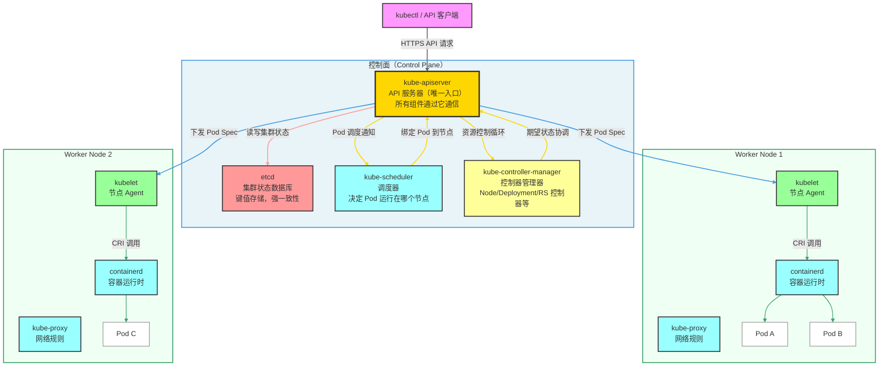
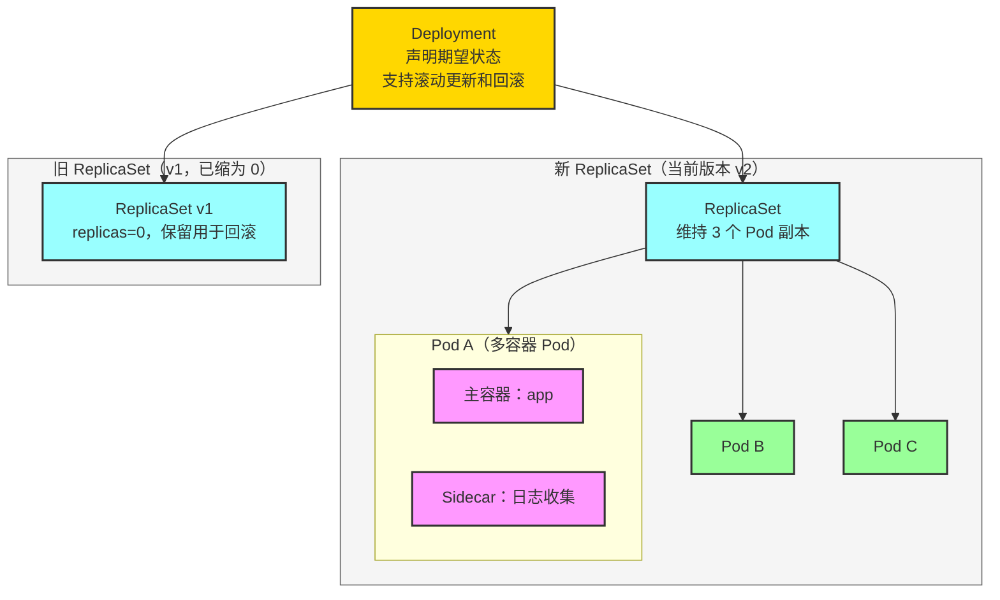
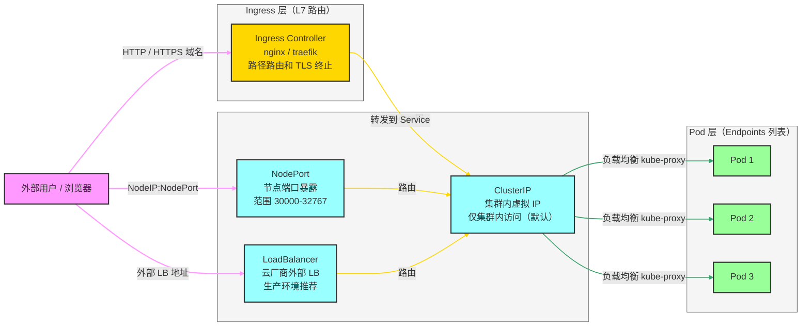
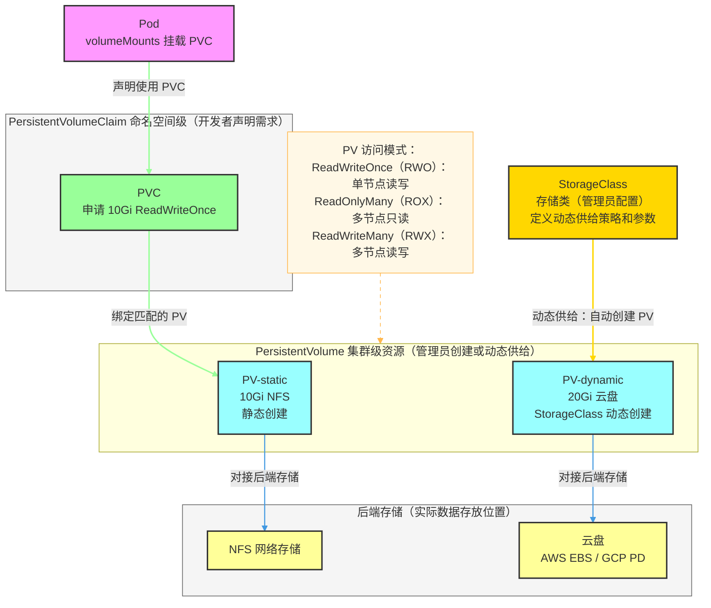
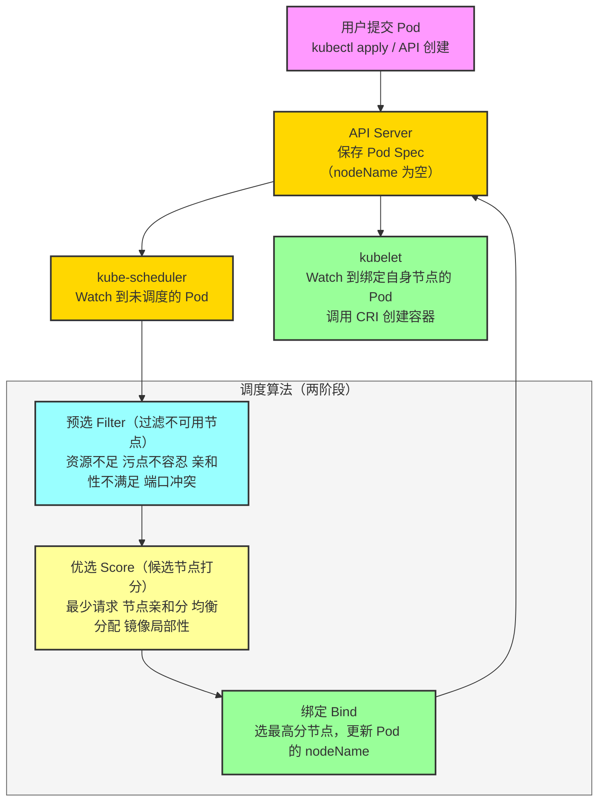
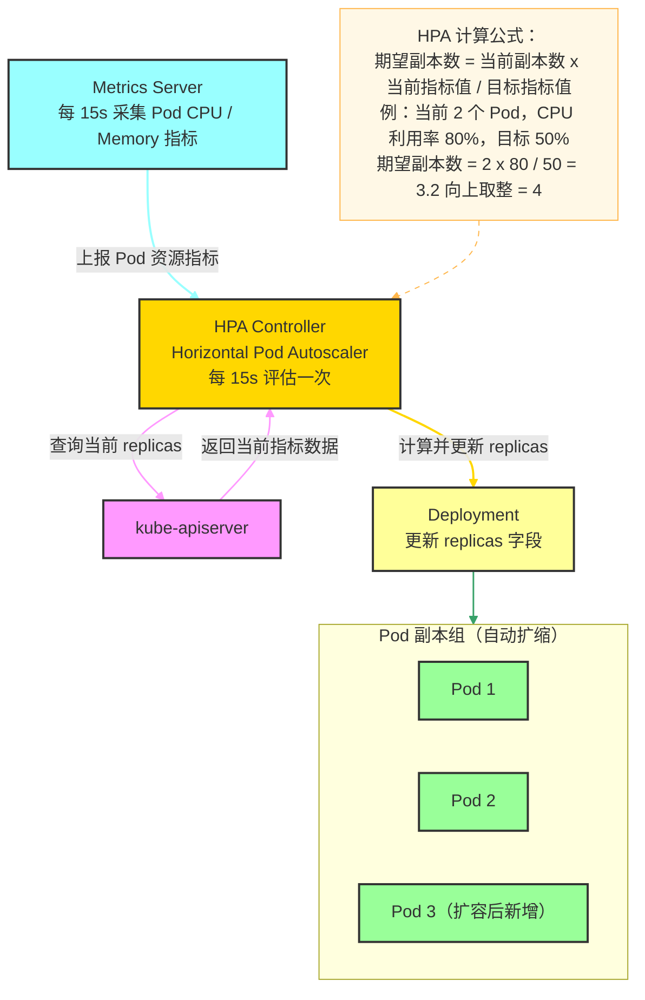

# Docker 与 Kubernetes（K8s）面试全攻略

> 系统梳理 Docker 与 K8s 核心知识、架构原理及高频面试考点，配合 Mermaid 架构图辅助理解，助你顺利通过容器化相关面试。

---

## 目录

- [一、Kubernetes 核心知识](#二kubernetes-核心知识)
- [二、面试 FAQ](#三面试-faq)

---

## 一、Kubernetes 核心知识

### 2.1 K8s 设计理念

| 核心理念 | 说明 |
|---|---|
| **声明式 API** | 描述"期望状态"，由控制器持续协调实现，而非命令式操作 |
| **控制循环** | 控制器不断 Watch → 比较 → 协调（Reconcile）实现自愈 |
| **不可变基础设施** | 更新不修改容器，而是替换新版本容器 |
| **面向微服务** | Pod 是最小调度单元，通过 Service 解耦服务发现 |

### 2.2 K8s 整体架构



### 2.3 控制面组件详解

| 组件 | 职责 | 关键特性 |
|---|---|---|
| **kube-apiserver** | 集群的 REST API 入口，所有操作必须经过它 | 水平可扩展，支持认证/授权/准入控制 |
| **etcd** | 保存整个集群的状态数据（Pod、Service、ConfigMap 等） | Raft 共识算法，强一致性，需定期备份 |
| **kube-scheduler** | 为新 Pod 选择合适的 Worker 节点 | 两阶段：Filter（过滤）+ Score（打分） |
| **kube-controller-manager** | 运行各种控制器（Deployment、Node、Endpoint 等控制器） | 控制循环：Watch → 比较 → 协调 |
| **cloud-controller-manager** | 对接云厂商 API（LB、PV 等） | 仅云环境部署 |

### 2.4 工作节点组件详解

| 组件 | 职责 |
|---|---|
| **kubelet** | 节点上的 Agent，接收 Pod Spec，管理容器生命周期，上报节点状态 |
| **kube-proxy** | 维护 iptables/IPVS 规则，实现 Service 的负载均衡和服务发现 |
| **容器运行时（CRI）** | 实际运行容器（containerd、CRI-O），实现 OCI 标准 |

### 2.5 核心工作负载（Workload）



**Workload 控制器对比**：

| 控制器 | 适用场景 | 特性 |
|---|---|---|
| **Deployment** | 无状态应用（Web、API 服务） | 滚动更新、回滚、HPA |
| **StatefulSet** | 有状态应用（数据库、消息队列） | 固定网络标识、有序启停、独立 PVC |
| **DaemonSet** | 节点级 Agent（日志、监控） | 每个节点运行一个 Pod |
| **Job** | 一次性批处理任务 | 保证 Pod 成功完成 |
| **CronJob** | 定时任务 | 基于 cron 表达式定时触发 Job |

**多容器 Pod 设计模式**：

| 模式 | 说明 | 示例 |
|---|---|---|
| **Sidecar** | 辅助主容器（扩展功能） | Envoy 代理、日志收集（Fluentd） |
| **Ambassador** | 代理主容器对外通信 | 连接池、协议转换 |
| **Adapter** | 格式化主容器输出 | 指标格式转换（Prometheus exporter） |

### 2.6 Service 与 Ingress 流量路由



> **Service 通过 Label Selector 关联 Pod**：Service 不直接绑定 Pod，而是通过标签选择器动态维护 Endpoints 列表，kube-proxy 将流量路由到 Endpoints 中的 Pod。

### 2.7 K8s 存储架构



### 2.8 配置管理：ConfigMap vs Secret

| 对比维度 | ConfigMap | Secret |
|---|---|---|
| 存储内容 | 明文配置（环境变量、配置文件） | 敏感信息（密码、Token、证书） |
| 存储格式 | 明文 | Base64 编码（非加密，需配合 etcd 加密） |
| 使用方式 | 环境变量 / Volume 挂载 | 环境变量 / Volume 挂载 |
| 大小限制 | 1 MiB | 1 MiB |
| 典型用途 | 数据库地址、Feature Flag | 数据库密码、TLS 证书、镜像仓库凭证 |

```yaml
# ConfigMap 示例
apiVersion: v1
kind: ConfigMap
metadata:
  name: app-config
data:
  APP_ENV: production
  LOG_LEVEL: info
  config.yaml: |
    server:
      port: 8080

# Secret 示例（values 为 base64 编码）
apiVersion: v1
kind: Secret
metadata:
  name: db-secret
type: Opaque
data:
  DB_PASSWORD: cGFzc3dvcmQxMjM=  # echo -n 'password123' | base64
```

### 2.9 健康检查探针

| 探针类型 | 触发时机 | 失败处理 | 典型用途 |
|---|---|---|---|
| **livenessProbe** | 容器运行期间持续检查 | 杀死容器并重启（按 restartPolicy） | 检测死锁、内存泄漏等异常 |
| **readinessProbe** | 容器启动后持续检查 | 从 Service Endpoints 中摘除（不重启） | 应用未就绪时不接收流量 |
| **startupProbe** | 容器启动阶段（慢启动保护） | 超时后杀死容器 | 启动慢的应用（Java 应用等） |

**探针检测方式**：

```yaml
livenessProbe:
  httpGet:           # HTTP GET 请求
    path: /healthz
    port: 8080
  initialDelaySeconds: 30
  periodSeconds: 10
  failureThreshold: 3

readinessProbe:
  tcpSocket:         # TCP 端口连通性
    port: 3306

startupProbe:
  exec:              # 执行命令（exit code 0 为健康）
    command: ["cat", "/tmp/ready"]
  failureThreshold: 30
  periodSeconds: 10
```

### 2.10 资源管理（requests / limits）

| 参数 | 作用 | 调度影响 |
|---|---|---|
| `requests.cpu` | Scheduler 调度时保证节点有此资源 | 是调度依据，保证最低资源 |
| `requests.memory` | 同上 | 同上 |
| `limits.cpu` | CPU 使用上限，超出则被限速（Throttle） | 不影响调度 |
| `limits.memory` | 内存上限，超出则 OOMKilled | 不影响调度 |

> **QoS 等级**（资源服务质量）：`Guaranteed`（requests=limits）> `Burstable`（有 requests）> `BestEffort`（无 requests/limits，最先被驱逐）

### 2.11 调度机制



**调度策略**：

| 策略 | 实现方式 | 说明 |
|---|---|---|
| **nodeSelector** | Pod 标签匹配节点标签 | 最简单的节点选择 |
| **nodeAffinity** | 软/硬亲和规则 | 比 nodeSelector 更灵活（必须满足 / 尽量满足） |
| **podAffinity** | Pod 与特定 Pod 同节点 | 服务同机部署提升性能 |
| **podAntiAffinity** | Pod 分散到不同节点 | 高可用部署 |
| **taints & tolerations** | 节点打污点，Pod 声明容忍 | 专用节点（GPU 节点等） |

### 2.12 滚动更新与回滚

```mermaid
flowchart LR
    classDef oldStyle fill:#f99,stroke:#333,stroke-width:2px
    classDef newStyle fill:#9f9,stroke:#333,stroke-width:2px
    classDef ctrlStyle fill:#ffd700,stroke:#333,stroke-width:2px
    classDef subStyle fill:#f5f5f5,stroke:#666,stroke-width:1px

    CTRL["Deployment 控制器<br/>maxSurge=1 maxUnavailable=1"]:::ctrlStyle

    subgraph s1["① 初始状态（v1）"]
        A1["Pod v1"]:::oldStyle
        A2["Pod v1"]:::oldStyle
        A3["Pod v1"]:::oldStyle
    end
    class s1 subStyle

    subgraph s2["② 创建新 Pod（v2）"]
        B1["Pod v1"]:::oldStyle
        B2["Pod v1"]:::oldStyle
        B3["Pod v2 新建"]:::newStyle
    end
    class s2 subStyle

    subgraph s3["③ 终止旧 Pod（v1）"]
        C1["Pod v1 终止"]:::oldStyle
        C2["Pod v2"]:::newStyle
        C3["Pod v2"]:::newStyle
    end
    class s3 subStyle

    subgraph s4["④ 完成替换（v2）"]
        D1["Pod v2"]:::newStyle
        D2["Pod v2"]:::newStyle
        D3["Pod v2"]:::newStyle
    end
    class s4 subStyle

    CTRL --> s1
    s1 -->|"逐步创建新 Pod"| s2
    s2 -->|"健康检查通过后终止旧 Pod"| s3
    s3 -->|"重复直到全量替换"| s4
```



**常用滚动更新命令**：

```bash
# 更新镜像
kubectl set image deployment/myapp app=myapp:v2

# 查看更新状态
kubectl rollout status deployment/myapp

# 查看历史版本
kubectl rollout history deployment/myapp

# 回滚到上一版本
kubectl rollout undo deployment/myapp

# 回滚到指定版本
kubectl rollout undo deployment/myapp --to-revision=2
```

### 2.13 HPA 自动扩缩容



### 2.14 RBAC 权限控制

K8s 使用 RBAC（Role-Based Access Control）进行权限管理：

| 资源 | 作用域 | 说明 |
|---|---|---|
| `Role` | 命名空间级 | 定义命名空间内的权限规则 |
| `ClusterRole` | 集群级 | 定义跨命名空间或集群级资源的权限 |
| `RoleBinding` | 命名空间级 | 将 Role 绑定到用户/ServiceAccount |
| `ClusterRoleBinding` | 集群级 | 将 ClusterRole 绑定到用户/ServiceAccount |

---

## 三、面试 FAQ

### 3.2 Kubernetes 高频面试题

---

**Q1：K8s 的架构是什么？各组件的职责是什么？**

> K8s 采用 Master-Worker 架构：
>
> **控制面（Control Plane）**：
> - `kube-apiserver`：唯一入口，所有操作通过 REST API 进行，负责认证/授权/准入控制
> - `etcd`：集群状态数据库，保存所有资源对象，使用 Raft 保证强一致性
> - `kube-scheduler`：为新 Pod 选择节点，Filter + Score 两阶段
> - `kube-controller-manager`：运行各类控制器，实现期望状态协调
>
> **工作节点（Worker Node）**：
> - `kubelet`：节点 Agent，接收 Pod Spec，管理容器生命周期，上报状态
> - `kube-proxy`：维护 iptables/IPVS 规则实现 Service 负载均衡
> - 容器运行时（containerd）：实际创建和管理容器

---

**Q2：Pod 是什么？为什么需要 Pod 而不直接用容器？**

> Pod 是 K8s **最小调度单元**，包含一个或多个容器，共享：
> - 网络命名空间（同 Pod 内容器通过 `localhost` 通信）
> - 存储 Volume（可共享数据卷）
> - 生命周期（同生同死）
>
> **为什么需要 Pod**：
> 1. 支持紧密耦合的多容器协作（Sidecar 模式）
> 2. 提供统一的调度和资源管理单元
> 3. 一个 Pod 内的容器天然实现服务发现（localhost）

---

**Q3：Deployment、StatefulSet、DaemonSet 分别适合什么场景？**

> - **Deployment**：无状态应用，Pod 可任意替换，支持滚动更新和回滚。适合 Web 服务、API 服务
> - **StatefulSet**：有状态应用，Pod 有固定网络标识（`pod-0`、`pod-1`）、有序启停、各自独立 PVC。适合 MySQL、Kafka、Redis 集群
> - **DaemonSet**：每个节点运行且仅运行一个 Pod，适合日志采集（Fluentd）、监控 Agent（Node Exporter）、网络插件（Calico）

---

**Q4：Service 的 ClusterIP、NodePort、LoadBalancer 有什么区别？**

> - `ClusterIP`（默认）：集群内部虚拟 IP，仅集群内访问，Pod 到 Pod 间通信的标准方式
> - `NodePort`：在每个节点上开放一个固定端口（30000-32767），外部可通过 `NodeIP:NodePort` 访问，适合测试环境
> - `LoadBalancer`：在 NodePort 基础上对接云厂商外部负载均衡器，生产环境推荐，需要云环境支持
> - `ExternalName`：将 Service 映射到外部 DNS 名称（CNAME），用于访问集群外部服务

---

**Q5：什么是 Ingress？和 Service 有什么区别？**

> `Service` 是 L4 负载均衡（TCP/UDP 层），`Ingress` 是 L7 负载均衡（HTTP/HTTPS 层）。
>
> Ingress 提供：
> - **域名路由**：`api.example.com` → API Service，`app.example.com` → Frontend Service
> - **路径路由**：`/api` → API Service，`/static` → Static Service
> - **TLS 终止**：统一管理 HTTPS 证书
>
> Ingress 需要 Ingress Controller（nginx、traefik、Istio Gateway 等）才能生效。

---

**Q6：K8s 如何实现服务发现？**

> 1. **环境变量**：Pod 创建时，K8s 将同命名空间的 Service 信息注入环境变量（`SERVICE_HOST`、`SERVICE_PORT`），但有创建顺序限制
> 2. **DNS**（推荐）：CoreDNS 为每个 Service 创建 DNS 记录，格式：`<service>.<namespace>.svc.cluster.local`，Pod 直接通过域名访问 Service

---

**Q7：etcd 在 K8s 中的作用是什么？为什么要备份？**

> etcd 是 K8s 的"大脑"，保存整个集群的所有状态：Pod、Service、Deployment、ConfigMap、Secret、RBAC 规则等。使用 Raft 共识算法保证强一致性。
>
> **为什么备份**：一旦 etcd 数据丢失，整个集群状态无法恢复。备份方式：`etcdctl snapshot save backup.db`。
>
> **生产实践**：etcd 通常部署为 3 或 5 个节点奇数集群（保证 Raft 多数派选举）。

---

**Q8：Pod 的生命周期和重启策略是什么？**

> **Pod 阶段（Phase）**：
> - `Pending`：Pod 被创建，等待调度或镜像拉取
> - `Running`：至少一个容器在运行
> - `Succeeded`：所有容器成功退出（exit 0）
> - `Failed`：至少一个容器失败退出
> - `Unknown`：节点失联，状态未知
>
> **重启策略（restartPolicy）**：
> - `Always`（默认）：容器退出即重启，适合 Deployment
> - `OnFailure`：非正常退出才重启，适合 Job
> - `Never`：不重启，适合一次性任务

---

**Q9：liveness、readiness、startup 三种探针的区别？**

> - **livenessProbe**：检测容器是否存活，失败则**重启容器**（解决死锁、内存泄漏）
> - **readinessProbe**：检测容器是否就绪接收流量，失败则**从 Service Endpoints 摘除**（不重启，保证零停机）
> - **startupProbe**：容器启动阶段保护，防止慢启动应用被 liveness 误杀，失败则**重启容器**
>
> **关键区别**：readiness 失败不重启容器，只是暂停接收流量；liveness 和 startup 失败会重启容器。

---

**Q10：K8s 如何实现滚动更新？如何保证零停机？**

> Deployment 通过控制新旧 ReplicaSet 的副本数量实现滚动更新：
> - `maxSurge`：更新期间允许超出期望副本数的 Pod 数量（默认 25%）
> - `maxUnavailable`：更新期间允许不可用的 Pod 数量（默认 25%）
>
> **零停机保障**：
> 1. 配置 `readinessProbe`，确保新 Pod 就绪后才接收流量
> 2. 配置 `preStop Hook`，容器终止前先等待请求处理完成
> 3. 设置合理的 `terminationGracePeriodSeconds`（默认 30s）
> 4. `maxUnavailable=0` 确保始终有足够可用 Pod

---

**Q11：什么是 PV、PVC 和 StorageClass？**

> - **PV（PersistentVolume）**：集群管理员预先创建或动态供给的存储资源（对接 NFS、云盘等）
> - **PVC（PersistentVolumeClaim）**：开发者声明的存储需求（容量、访问模式），K8s 自动为其绑定匹配的 PV
> - **StorageClass**：定义动态存储供给策略（Provisioner 参数等），PVC 引用 StorageClass 后自动创建 PV
>
> **绑定关系**：Pod → PVC → PV → 后端存储（一对一绑定，绑定后状态为 `Bound`）

---

**Q12：ConfigMap 和 Secret 的区别？Secret 安全吗？**

> ConfigMap 存储明文配置，Secret 存储 Base64 编码的敏感数据。
>
> **Secret 不是真正安全的**：Base64 可以直接解码，并非加密。真正的安全措施：
> 1. 开启 etcd 静态加密（`EncryptionConfiguration`）
> 2. 使用 Vault、AWS Secrets Manager 等外部密钥管理系统
> 3. 通过 RBAC 严格控制 Secret 的访问权限
> 4. 避免在日志、环境变量中打印 Secret 内容

---

**Q13：K8s 中的污点（Taint）和容忍（Toleration）是什么？**

> **Taint（污点）**：打在节点上的标记，阻止 Pod 调度到该节点
> ```bash
> kubectl taint nodes gpu-node gpu=true:NoSchedule
> ```
>
> **Toleration（容忍）**：Pod 声明可以容忍某个污点，才能调度到被污染的节点
> ```yaml
> tolerations:
> - key: "gpu"
>   operator: "Equal"
>   value: "true"
>   effect: "NoSchedule"
> ```
>
> **Effect 类型**：
> - `NoSchedule`：不调度（不影响已运行的 Pod）
> - `PreferNoSchedule`：尽量不调度（软限制）
> - `NoExecute`：不调度且驱逐已运行的不容忍 Pod

---

**Q14：什么是 HPA？如何触发扩缩容？**

> HPA（Horizontal Pod Autoscaler）根据指标自动调整 Pod 副本数：
>
> **触发条件**：`期望副本数 = ceil(当前副本数 × 当前指标 / 目标指标)`
>
> **支持的指标类型**：
> - CPU 利用率（最常用，需 Metrics Server）
> - 内存利用率
> - 自定义指标（通过 Custom Metrics API，如 QPS、队列深度）
>
> **注意**：HPA 有扩容和缩容冷却时间（`--horizontal-pod-autoscaler-sync-period`，默认 15s；缩容稳定窗口默认 5 分钟），防止频繁波动。

---

**Q15：K8s 网络模型是什么？CNI 插件有哪些？**

> K8s 网络三原则：
> 1. **Pod 与 Pod 直通**：任意 Pod 可直接通过 IP 访问（无 NAT）
> 2. **Node 与 Pod 直通**：节点可直接访问 Pod IP（无 NAT）
> 3. **Pod 看到的自身 IP 与外部看到的一致**
>
> **CNI 插件对比**：
>
> | 插件 | 网络方案 | 特性 |
> |---|---|---|
> | Flannel | Overlay（VXLAN） | 简单，不支持网络策略 |
> | Calico | 纯路由（BGP）或 Overlay | 支持 NetworkPolicy，性能好，生产推荐 |
> | Cilium | eBPF | 高性能，支持 L7 策略，可观测性强 |
> | WeaveNet | Overlay | 多主机，支持加密 |

---

**Q16：什么是 Namespace？如何实现资源隔离？**

> Namespace 是 K8s 的逻辑隔离机制：
> - 同一 Namespace 内资源名称唯一，不同 Namespace 可重名
> - 通过 **RBAC** 实现权限隔离（限制用户只能操作某 Namespace）
> - 通过 **ResourceQuota** 限制 Namespace 的资源总量
> - 通过 **LimitRange** 设置 Namespace 内 Pod/Container 的默认资源限制
> - 通过 **NetworkPolicy** 控制 Namespace 间的网络访问
>
> **默认 Namespace**：`default`、`kube-system`（K8s 组件）、`kube-public`（公共数据）

---

**Q17：K8s 如何实现权限控制（RBAC）？**

> RBAC 四个核心对象：
> - `Role` / `ClusterRole`：定义权限规则（哪些资源，哪些动词：get、list、create、delete 等）
> - `RoleBinding` / `ClusterRoleBinding`：将角色绑定到用户/组/ServiceAccount
>
> **ServiceAccount**：Pod 的身份标识，Pod 通过 ServiceAccount 的 Token 调用 K8s API，遵循最小权限原则。

---

**Q18：什么是 Init Container？有什么用途？**

> Init Container 是在主容器启动前运行的**初始化容器**，必须成功退出才会启动主容器：
> 1. **等待依赖就绪**：等待数据库、中间件启动（`wait-for-it`）
> 2. **权限设置**：调整挂载目录权限
> 3. **配置生成**：动态生成配置文件写入共享 Volume
> 4. **代码同步**：从 Git 拉取最新配置
>
> 特点：顺序执行（多个 Init Container 串行），失败后重试，主容器无法访问 Init Container 的文件系统（除非通过共享 Volume）。

---

**Q19：Helm 是什么？解决了什么问题？**

> Helm 是 K8s 的**包管理器**，类比 apt/yum。解决的问题：
> 1. **复杂应用部署**：一个中间件可能涉及几十个 YAML 文件，Helm 打包成 Chart
> 2. **版本管理**：Chart 有版本号，支持回滚
> 3. **参数化部署**：通过 `values.yaml` 灵活配置环境差异
> 4. **依赖管理**：Chart 可依赖其他 Chart（如 WordPress 依赖 MySQL Chart）
>
> 常用命令：
> ```bash
> helm install myapp ./chart -f custom-values.yaml
> helm upgrade myapp ./chart --set image.tag=v2
> helm rollback myapp 1
> helm list
> ```

---

**Q20：生产环境部署 K8s 有哪些最佳实践？**

> 1. **高可用**：Master 节点 3+ 个（etcd 奇数节点），多 Worker 节点
> 2. **资源管理**：所有 Pod 设置 `requests` 和 `limits`，配置 `LimitRange`
> 3. **健康检查**：配置三种探针，避免流量打到未就绪 Pod
> 4. **镜像管理**：禁止使用 `latest` 标签，使用内容摘要（SHA256）
> 5. **安全**：启用 RBAC，最小权限 ServiceAccount，扫描镜像漏洞
> 6. **监控**：Prometheus + Grafana + AlertManager，配置关键告警
> 7. **日志**：EFK（Elasticsearch + Fluentd + Kibana）或 Loki + Grafana
> 8. **备份**：定期备份 etcd，使用 Velero 备份集群资源
> 9. **网络策略**：配置 NetworkPolicy 限制 Pod 间不必要的通信
> 10. **Pod 反亲和**：关键服务设置 `podAntiAffinity` 分散到不同节点，避免单点故障
