# Trinity-RFT Agent-RFT 完整流程（从 0 到 1 实战指南）

> **定位**：不只是"会跑流程"，而是"能讲透原理、看懂架构、做好评估、系统调优、自信应答面试"。  
> **对应仓库示例**：`examples/agentscope_react/gsm8k.yaml`、`examples/agentscope_websearch/agentscopev1_websearch_agent.yaml`

---

## 1. Agent-RFT 是什么：本质与价值

### 1.1 一句话定义

Agent-RFT = 让 Agent 在**多轮工具调用与环境交互**中，通过任务结果的奖励信号，强化**多步决策策略**，而不仅仅是优化单次回答质量。

> 类比：不是训练学生"背答案"，而是训练学生"在图书馆里查资料、制定解题计划、使用计算器，最终完成复杂研究任务"的完整策略。

### 1.2 三种训练范式的本质差异

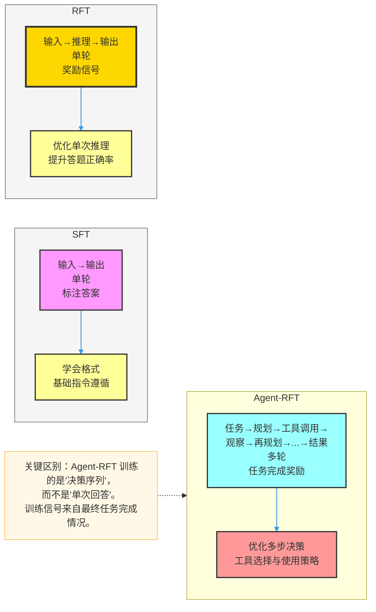

### 1.3 Agent-RFT 能解决哪些问题

| 问题 | SFT/RFT 的局限 | Agent-RFT 的解法 |
|------|--------------|----------------|
| 搜索任务 | 不能调用真实搜索引擎 | 在真实 web 环境中探索学习 |
| 代码调试 | 不能执行代码验证 | 通过代码执行反馈优化策略 |
| 数学多步推理 | 中间步骤质量无法评估 | 通过工具辅助验证每步正确性 |
| 复杂规划 | 单轮无法完成多步任务 | 多轮交互中学习任务分解 |

### 1.4 ReAct 范式：Agent-RFT 的基础交互模式

ReAct（Reason + Act）是 Agent-RFT 最常用的交互范式：

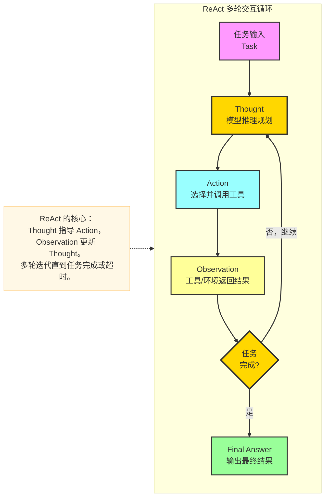

---

## 2. Multi-Step GRPO 算法原理

### 2.1 为什么普通 GRPO 不够用

普通 GRPO 处理的是**单轮**场景：一个 prompt → 一个 response → 一个 reward。

Agent-RFT 是**多轮**场景：一个 task → 多轮 (thought, action, observation) → 最终结果 → 一个 reward。

问题：如何把最终 reward 分配给每一轮的 token？

### 2.2 Multi-Step GRPO 的奖励分配机制

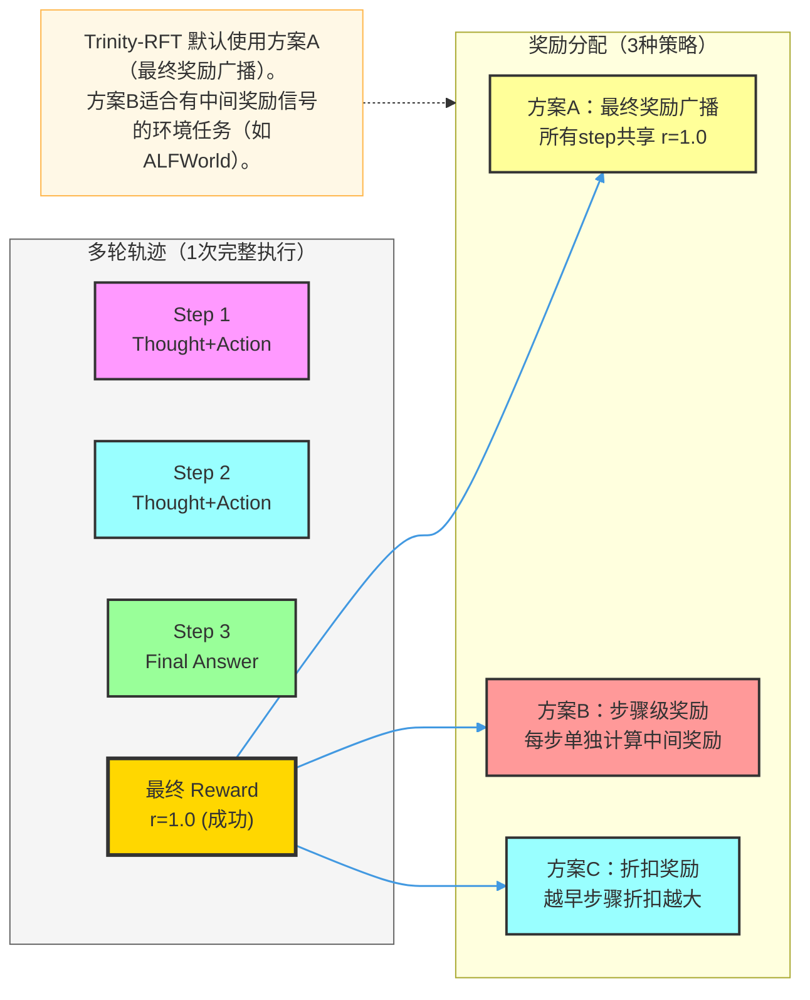

### 2.3 History 到 Experience 的转换

这是 Agent-RFT 最核心的工程点：

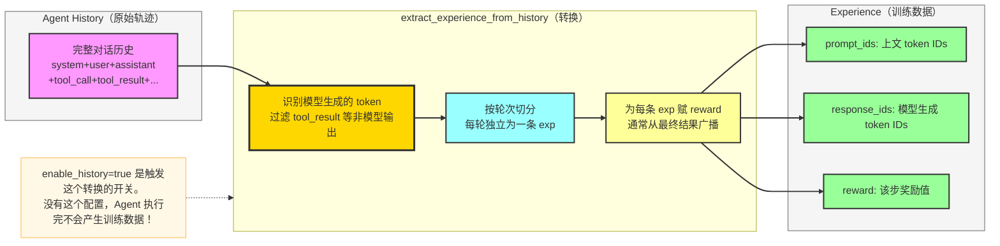

---

## 3. Trinity-RFT Agent-RFT 工程架构

### 3.1 完整全链路架构

```mermaid
flowchart LR
    classDef producerStyle fill:#f9f,stroke:#333,stroke-width:2px
    classDef topicStyle fill:#ffd700,stroke:#333,stroke-width:3px
    classDef partitionStyle1 fill:#9ff,stroke:#333,stroke-width:2px
    classDef partitionStyle2 fill:#9f9,stroke:#333,stroke-width:2px
    classDef consumerGroup1Style fill:#ff9,stroke:#333,stroke-width:2px
    classDef consumerGroup2Style fill:#f99,stroke:#333,stroke-width:2px
    classDef subgraphStyle fill:#f5f5f5,stroke:#666,stroke-width:1px,rounded:10px
    classDef kafkaClusterStyle fill:#e8f4f8,stroke:#4299e1,stroke-width:1.5px,rounded:10px
    classDef ruleNoteStyle fill:#fff8e6,stroke:#ffb74d,stroke-width:1px,rounded:8px

    subgraph agentLayer["Agent 执行层"]
        A[Taskset\n任务集/问题集]:::producerStyle
        B[Agent Workflow\nReAct/WebSearch/FrozenLake]:::partitionStyle1
        C[Tool/Env/MCP\n搜索/代码执行/游戏环境]:::partitionStyle1
        D[Trinity OpenAI Client\n替换模型调用入口]:::topicStyle
    end
    class agentLayer subgraphStyle

    subgraph historyLayer["History 记录层"]
        E[enable_history=true\n自动捕获所有对话轮次]:::consumerGroup1Style
        F[calculate_reward\n基于最终结果打分]:::consumerGroup1Style
    end
    class historyLayer subgraphStyle

    subgraph expLayer["Experience 构建层"]
        G[extract_experience_from_history\n轨迹→训练样本]:::topicStyle
        H[ExperienceBuffer\nqueue 存储]:::consumerGroup2Style
    end
    class expLayer kafkaClusterStyle

    subgraph trainLayer["训练与同步层"]
        I[Trainer\nmulti_step_grpo]:::partitionStyle2
        J[Synchronizer\nexplorer_driven]:::consumerGroup2Style
        K[Checkpoint/Log/Monitor]:::partitionStyle2
    end
    class trainLayer subgraphStyle

    A -->|驱动任务| B
    B -->|调用工具/环境| C
    B -->|使用 Trinity 模型| D
    D -->|推理返回| B
    B -->|完整交互历史| E
    E -->|最终结果| F
    F -->|打包 reward| G
    G -->|写入| H
    H -->|训练消费| I
    I -->|权重同步| J
    J -.->|刷新 Explorer 权重| D
    I -->|保存状态| K

    linkStyle 0,1,2,3,4,5,6,7,8,9,11 stroke:#333,stroke-width:2px,arrowheadStyle:filled
    linkStyle 10 stroke:#4299e1,stroke-width:2px,stroke-dasharray:5 5

    AgentNote["Agent-RFT 三要素：<br/>1. 用 Trinity client 替换模型调用（D）<br/>2. 开启 enable_history（E）<br/>3. 实现 calculate_reward（F）"]:::ruleNoteStyle
    AgentNote -.-> historyLayer
```

### 3.2 Agent Workflow 的三种实现方式

| 方式 | 代表示例 | 适用场景 | 复杂度 |
|------|---------|---------|--------|
| **内置 Workflow** | `math_workflow`、`code_workflow` | 数学/代码任务 | 低（配置即用） |
| **AgentScope ReAct** | `agentscope_react_workflow` | 通用工具调用任务 | 中（继承改写） |
| **自定义 Workflow** | 继承 `BaseWorkflow` | 特殊环境/任务 | 高（完全自定义） |

### 3.3 `sync_style: explorer_driven` 的含义

Agent-RFT 多用 `explorer_driven`（Explorer 驱动同步）而非 `trainer_driven`：

- **trainer_driven**：Trainer 训完一批，主动推送权重给 Explorer。适合 Explorer 速度快、任务短的场景。
- **explorer_driven**：Explorer 完成一批任务后，主动向 Trainer 请求最新权重。适合多轮任务场景，保证每批任务使用同一版本权重，轨迹内部一致。

---

## 4. 模型选择策略

### 4.1 Agent-RFT 的特殊选型考量

| 维度 | 一般 RFT | Agent-RFT |
|------|---------|---------|
| **工具调用能力** | 不关键 | **核心**（必须会 function calling） |
| **指令遵循** | 中等要求 | 高要求（多轮指令需严格遵循） |
| **上下文长度** | 中等 | 更长（多轮历史积累快） |
| **推理速度** | 重要 | 更重要（多轮调用，延迟叠加） |

### 4.2 模型能力要求与推荐

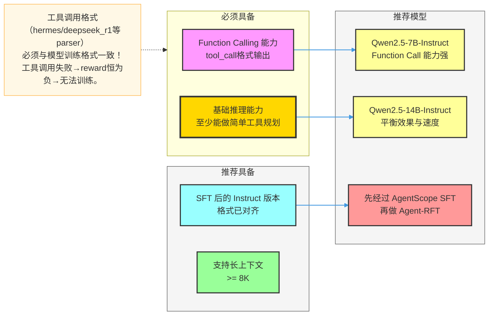

---

## 5. 任务与数据设计

### 5.1 Agent-RFT 任务数据的三个层次

**第一层：任务输入**（告诉 Agent 做什么）

```json
{
  "question": "Search for the population of Beijing in 2023 and calculate growth rate vs 2022.",
  "answer": "21.84 million"
}
```

**第二层：工具/环境配置**（告诉 Agent 能用什么）

```yaml
explorer:
  rollout_model:
    enable_auto_tool_choice: true   # 自动工具选择
    tool_call_parser: hermes        # 工具调用格式解析器
```

**第三层：评价机制**（告诉系统怎么打分）

```python
def calculate_reward(history, answer):
    final_output = extract_final_answer(history)
    return 1.0 if is_correct(final_output, answer) else 0.0
```

### 5.2 任务设计三要点

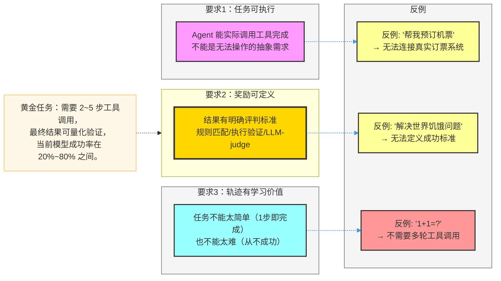

---

## 6. 关键配置深度解析

### 6.1 完整配置示例（含原理注释）

```yaml
mode: both                          # Explorer + Trainer 同时运行

algorithm:
  algorithm_type: multi_step_grpo   # 多步 GRPO，支持多轮轨迹
  repeat_times: 8                   # 同任务采样 8 次（构建组内对比）
  optimizer:
    lr: 1e-6                        # Agent 任务更复杂，lr 通常更小

buffer:
  batch_size: 32                    # 每轮并发执行的任务数
  train_batch_size: 256             # Trainer 每步消费的 experience token 数
  explorer_input:
    taskset:
      path: openai/gsm8k
      split: train
      default_workflow_type: agentscope_react_workflow  # 使用 ReAct workflow
    eval_tasksets:
      - path: openai/gsm8k
        split: test

explorer:
  runner_per_model: 8               # 并发 agent 任务数（多轮任务时不宜过大）
  max_timeout: 300                  # 单任务最大超时（秒），防止死循环阻塞
  rollout_model:
    enable_openai_api: true         # 使用 Trinity 提供的 OpenAI 接口（关键）
    enable_history: true            # 开启 history 记录（关键！不开则无训练数据）
    enable_auto_tool_choice: true   # 自动工具选择
    tool_call_parser: hermes        # 工具调用格式解析器（与模型格式匹配）
    reasoning_parser: deepseek_r1   # 推理格式解析器（有 <think> 标签时使用）
    max_model_len: 8192             # 长上下文支持（多轮积累）

synchronizer:
  sync_style: explorer_driven      # Explorer 完成任务后主动拉取新权重
  sync_method: nccl
  sync_interval: 2                  # 多轮任务建议 2~5

trainer:
  trainer_type: verl
  save_interval: 50
```

### 6.2 三大关键配置的深层含义

**`enable_openai_api: true`**（让 Agent 用 Trinity 的模型）

Agent 框架（如 AgentScope）原本调用外部 LLM API。`enable_openai_api` 让 Trinity-RFT 自己启动一个兼容 OpenAI 格式的本地 API 服务，AgentScope 无感知地调用这个本地服务。训练时 Trinity 可以拦截每次调用，自动记录 token level 的信息用于训练。

**`enable_history: true`**（打开训练数据的水龙头）

开启后，每次模型调用的 prompt + response 会被自动追踪记录到 history 对象中。训练完成后通过 `extract_experience_from_history` 将完整轨迹转换为 (prompt_ids, response_ids, reward) 格式的 Experience 写入 Buffer。**不开这个，Agent 跑再多轮也不会产生任何训练数据。**

**`tool_call_parser: hermes`**（工具调用的"翻译官"）

不同模型的工具调用输出格式不同（hermes/react/qwen 等）。parser 负责将模型的原始文本输出解析成结构化的 tool_name + arguments。parser 配置错误 → 工具调用全部解析失败 → reward 全为 0 → 无法训练。

---

## 7. 完整训练步骤

```bash
# 1. 安装 Agent 框架依赖
pip install agentscope
# 如需 web search
export SERPER_API_KEY=xxx  # 或其他搜索 API 配置

# 2. 准备模型（需支持工具调用）
# 确认模型支持 function calling，推荐 Qwen2.5-Instruct 系列

# 3. 修改配置文件关键字段
# - model_path
# - tool_call_parser（与模型格式匹配）
# - max_timeout（按任务复杂度调整）

# 4. 启动 Ray
ray start --head

# 5. 启动训练
trinity run --config examples/agentscope_react/gsm8k.yaml

# 6. 验证 Agent 链路正常（最关键的前 5 分钟）
tail -f ${checkpoint_dir}/log/explorer_runner_0.log
# 应看到：TaskInput → Tool call → Observation → Final answer → Reward

# 7. 监控训练指标
tensorboard --logdir ${checkpoint_dir}/monitor/
```

**前 5 分钟必须确认的 4 件事**：

1. explorer_runner 日志显示多轮交互在真实发生；
2. History 记录非空（日志中有 `history length: N` 且 N > 1）；
3. Experience 写入 Buffer（日志中有 `experience generated: N`）；
4. Reward 值有方差（不全 0 也不全 1）。

---

## 8. 评估体系：Agent-RFT 怎么判断训好了

### 8.1 Agent 专属四维评估框架

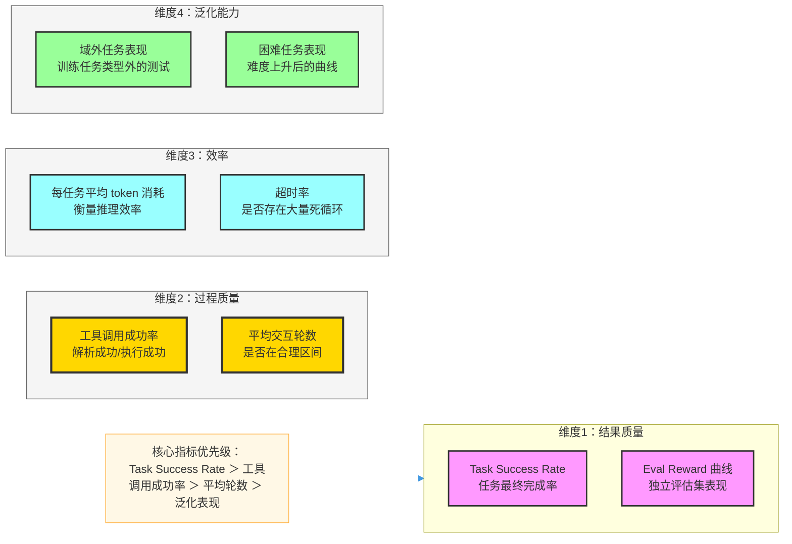

### 8.2 常见评估异常诊断

| 现象 | 诊断 | 应对 |
|------|------|------|
| 成功率为 0，reward 全为 0 | 工具调用解析失败 / 奖励函数 bug | 查 explorer_runner.log，逐步 debug |
| 成功率上升，但工具调用轮数爆炸 | 模型学会"多调工具"而非"准确调用" | 增加轮数惩罚，或增设中间奖励 |
| 训练集成功，测试集差 | 过拟合特定任务模板 | 增任务多样性，加难度分布 |
| 成功率时好时差 | 超时率高，随机因素大 | 调 `max_timeout`，稳定外部工具服务 |
| 模型输出乱码工具调用格式 | parser 不匹配 | 确认 `tool_call_parser` 与模型格式一致 |

---

## 9. 系统性调优策略

### 9.1 调优优先级（Agent-RFT 专属）

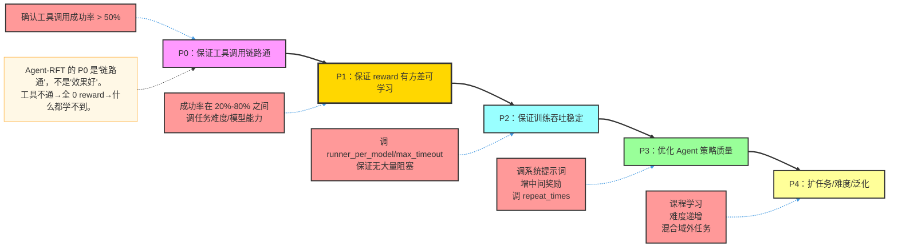

### 9.2 System Prompt 工程：被低估的调优手段

系统提示词对 Agent-RFT 效果影响巨大：

```markdown
# 优化前（过于简单）
你是一个 AI 助手。

# 优化后（明确格式约束）
你是一个专业的研究助手。完成任务时：
1. 先分析任务需求
2. 确定需要使用哪些工具
3. 按步骤调用工具
4. 综合工具返回结果给出最终答案
5. 最终答案用 <answer>...</answer> 标签包裹
```

为什么重要：
- 引导模型输出结构化的 Thought → Action → Observation 格式；
- 明确终止条件（何时输出最终答案），防止无限循环；
- 统一输出格式，让 reward 函数能稳定解析。

### 9.3 多轮任务效率优化

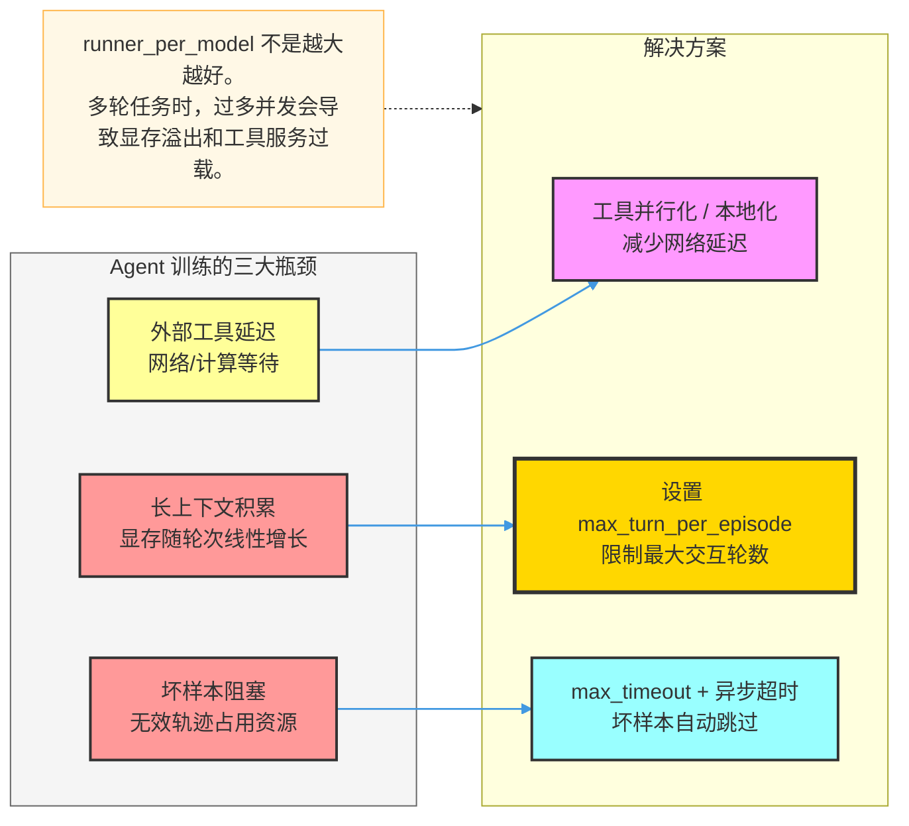

---

## 10. Agent-RFT 的核心实现：三步法

### 10.1 Workflow 实现的三步法

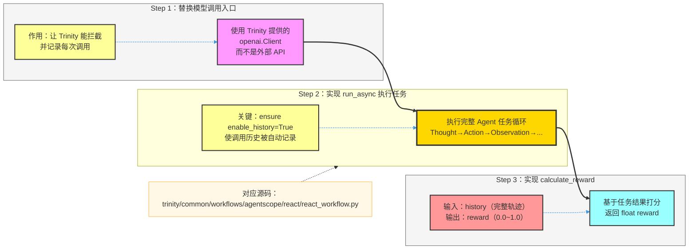

### 10.2 自定义 Workflow 的最小实现框架

```python
from trinity.common.workflows.base_workflow import BaseWorkflow

class MyAgentWorkflow(BaseWorkflow):
    async def run_async(self, task_input, rollout_model, **kwargs):
        # Step 1: 使用 Trinity client（关键）
        client = rollout_model.get_openai_client()
        history = rollout_model.get_history()  # enable_history 自动挂载

        # Step 2: 执行多轮 Agent 循环
        for turn in range(max_turns):
            response = await client.chat.completions.create(
                model="local",
                messages=history.to_messages(),
                tools=self.tools
            )
            # 解析工具调用、执行工具、记录结果...
            if is_finished(response):
                break

        # Step 3: 计算 reward
        reward = self.calculate_reward(history, task_input.answer)
        return reward

    def calculate_reward(self, history, ground_truth):
        final_answer = extract_final_answer(history)
        return 1.0 if match(final_answer, ground_truth) else 0.0
```

---

## 11. SFT + RFT + Agent-RFT 完整工程路线

### 11.1 从基座到 Agent 的完整训练路线

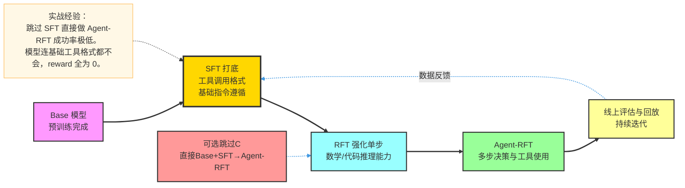

### 11.2 何时可以跳过某个阶段

| 场景 | 是否可跳过 SFT | 是否可跳过 RFT |
|------|-------------|-------------|
| 基座已经是 Instruct 版本 | 可以尝试（但建议做 Agent SFT） | 可以直接做 Agent-RFT |
| 需要最优工具调用格式 | 不建议跳过 | 取决于任务需求 |
| 资源极度有限 | 最少做 100 条 Agent SFT | 可跳过直接做 Agent-RFT |

---

## 12. 常见问题速查手册

| 问题 | 根因分析 | 解决方案 |
|------|---------|---------|
| Experience 为空 | `enable_history=false` | 检查并开启此配置 |
| Reward 恒为 0 | 工具解析失败/奖励 bug | 看 explorer_runner.log，逐行 debug |
| Reward 恒为 1 | 任务太简单/奖励函数 bug | 增加任务难度，检查奖励逻辑 |
| 工具调用格式乱 | parser 与模型不匹配 | 检查 `tool_call_parser` 配置 |
| 训练速度极慢 | 轨迹太长 / 工具延迟高 | 限制 `max_turn_per_episode`，本地化工具 |
| Explorer 频繁超时 | 外部服务不稳定 | 增大 `max_timeout`，增加重试逻辑 |
| 训练后工具调用退化 | KL 约束不足 / 过度训练 | 增大 KL 系数，减少训练步数 |

---

## 13. 面试应答指南

### 13.1 高频面试题与标准答法

**Q1：Agent-RFT 和普通 RFT 的根本区别？**

> 普通 RFT 处理的是单轮场景：一个 prompt 生成一个 response，用 reward 评价这个 response 的质量。Agent-RFT 处理的是多轮场景：Agent 执行一系列 Thought → Action → Observation 的交互循环，最终完成任务，reward 来自任务完成情况，需要将这个奖励分配到多轮交互的每个 token 上。训练的不是"如何回答问题"，而是"如何制定和执行多步决策策略"。

**Q2：为什么需要 `enable_history` 和 `enable_openai_api` 这两个配置？**

> `enable_openai_api` 让 Trinity-RFT 启动本地 OpenAI 兼容 API 服务，使 Agent 框架（AgentScope）透明地使用 Trinity 托管的模型，而不是外部 API。这样 Trinity 能追踪每次模型调用的 token 信息。`enable_history` 开启后，每次调用的上下文和回复会被记录到 history 对象，训练结束后通过 `extract_experience_from_history` 将完整轨迹转换为训练数据。两者缺一不可：前者保证调用被拦截，后者保证调用被记录。

**Q3：Multi-Step GRPO 如何处理多轮奖励分配问题？**

> 多轮轨迹结束后得到一个最终 reward（任务是否完成）。Multi-Step GRPO 最常用的方式是将最终 reward 广播给轨迹中所有模型生成的 token（最终奖励广播）。更复杂的实现是为每步设计中间奖励（如 ALFWorld 的环境反馈），或使用折扣机制让早期步骤的奖励打折。同组（同一任务的多次采样）之间仍然做相对归一化，高于组均值的轨迹增大概率，低于的降低概率。

**Q4：`sync_style: explorer_driven` 为什么在 Agent-RFT 中更合适？**

> Agent-RFT 的每个任务需要多轮交互，一次任务可能调用模型 5~10 次。如果用 `trainer_driven`（Trainer 训练完主动推送权重），中途可能权重更新导致同一任务的不同轮次使用了不同版本的模型，轨迹一致性被破坏，训练信号变脏。`explorer_driven` 是 Explorer 完成一批完整任务后，统一请求最新权重，保证同一任务的所有轮次都使用同一版本模型，轨迹内部一致，训练更稳定。

**Q5：如何设计一个好的 Agent-RFT 奖励函数？**

> 基本原则：首先要可计算（能从 history 中提取信息做判断）；其次要有方差（不能全 0 或全 1，GRPO 需要组内差异）；第三要鲁棒（对模型输出格式变化有容错，不能因为多了个空格就判错）。实践上通常先实现规则匹配（字符串/数值对比），验证流程通后再升级到执行验证（代码运行结果）或 LLM-as-Judge。也可以设计复合奖励：结果正确得 1 分，使用工具得 0.5 分，过程推理有效得 0.3 分。

**Q6：Agent-RFT 训练后常见的退化问题是什么？如何诊断？**

> 常见退化：工具调用轮数爆炸（模型学会不断调用工具而不终止）；输出格式退化（工具调用格式开始乱掉）；泛化能力差（训练任务变好，测试任务没提升）。诊断方法：看 "平均交互轮数" 指标是否异常上升；看 "工具调用成功率" 是否下降；看 eval 集和 train 集的 reward 差距是否在扩大。应对：增加最大轮数惩罚，增大 KL 系数，减少训练步数，增加任务多样性。

### 13.2 项目经历讲解模板

> "我在 Trinity-RFT 框架上实现了 Agent-RFT 训练，目标是让模型具备 [工具类型] 工具调用能力来完成 [任务类型] 任务。  
> 架构上：使用 AgentScope ReAct workflow，配置 `enable_openai_api` 和 `enable_history` 让 Trinity 能记录 Agent 的完整交互轨迹，通过 `extract_experience_from_history` 转换为多步 GRPO 的训练数据。  
> 关键挑战：工具调用 parser 不匹配导致初期 reward 全为 0，通过逐步 debug explorer_runner.log 定位到 `tool_call_parser` 配置错误。修复后 reward 从 0 开始上升，最终任务成功率从 [X%] 提升到 [Y%]。  
> 调优过程：发现模型倾向于调用过多轮次工具，通过在系统提示词中明确 "最多 [N] 步" 的限制，并增加轮数惩罚到奖励函数中，平均轮数从 8 轮降到 4 轮，同时成功率保持不变。"

---

## 14. 快速上手 Checklist

- [ ] 能解释 ReAct 范式的 Thought → Action → Observation 循环
- [ ] 能说清 `enable_openai_api` 和 `enable_history` 各自的作用
- [ ] 能区分 Agent-RFT 和普通 RFT 的根本差异
- [ ] 理解 History → Experience 的转换机制
- [ ] 跑通官方 `examples/agentscope_react/gsm8k.yaml`
- [ ] 确认多轮交互真实发生（看 explorer_runner.log）
- [ ] 验证 reward 有方差（非全 0 也非全 1）
- [ ] 观察 Eval Reward 曲线与工具调用成功率趋势
- [ ] 能定位和修复一次 workflow 执行问题
- [ ] 能用 5 分钟讲清楚 Agent-RFT 的原理、架构与自己的优化思路
