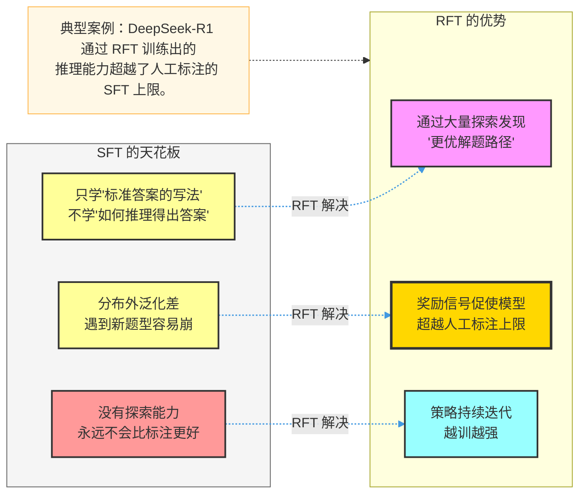
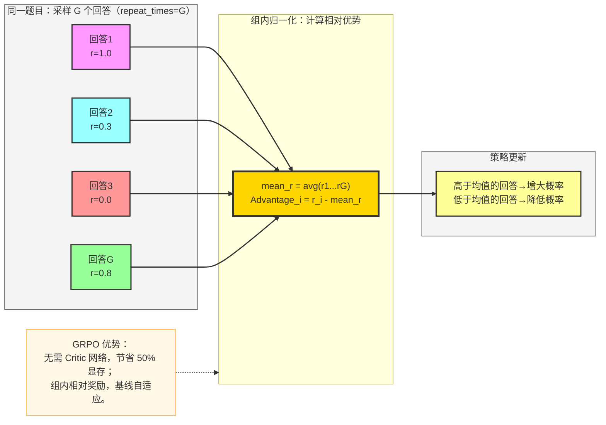
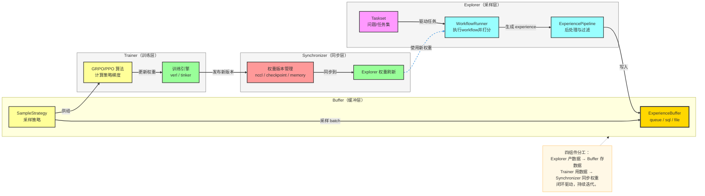
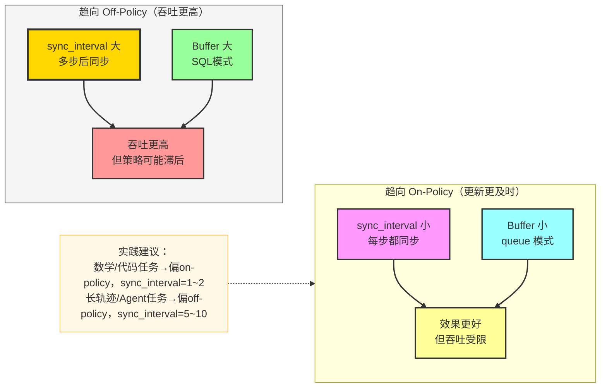
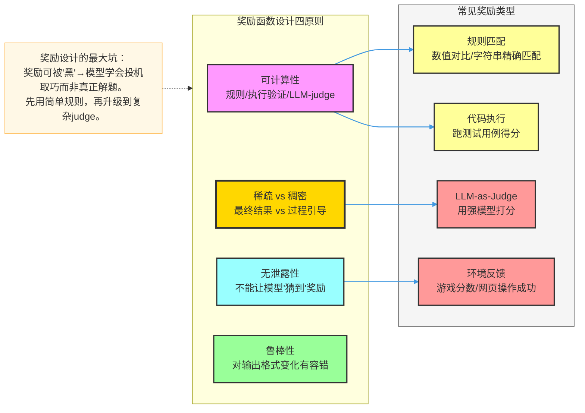
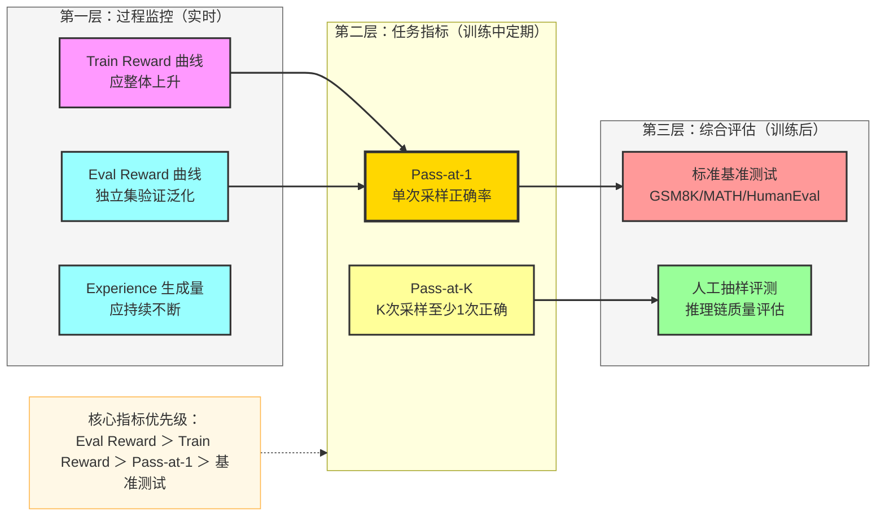
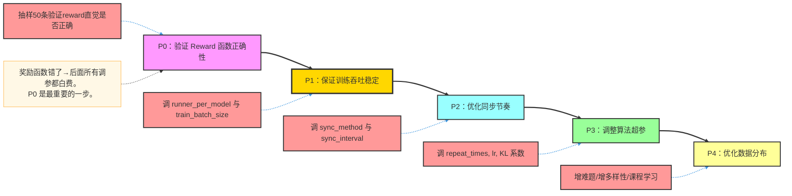
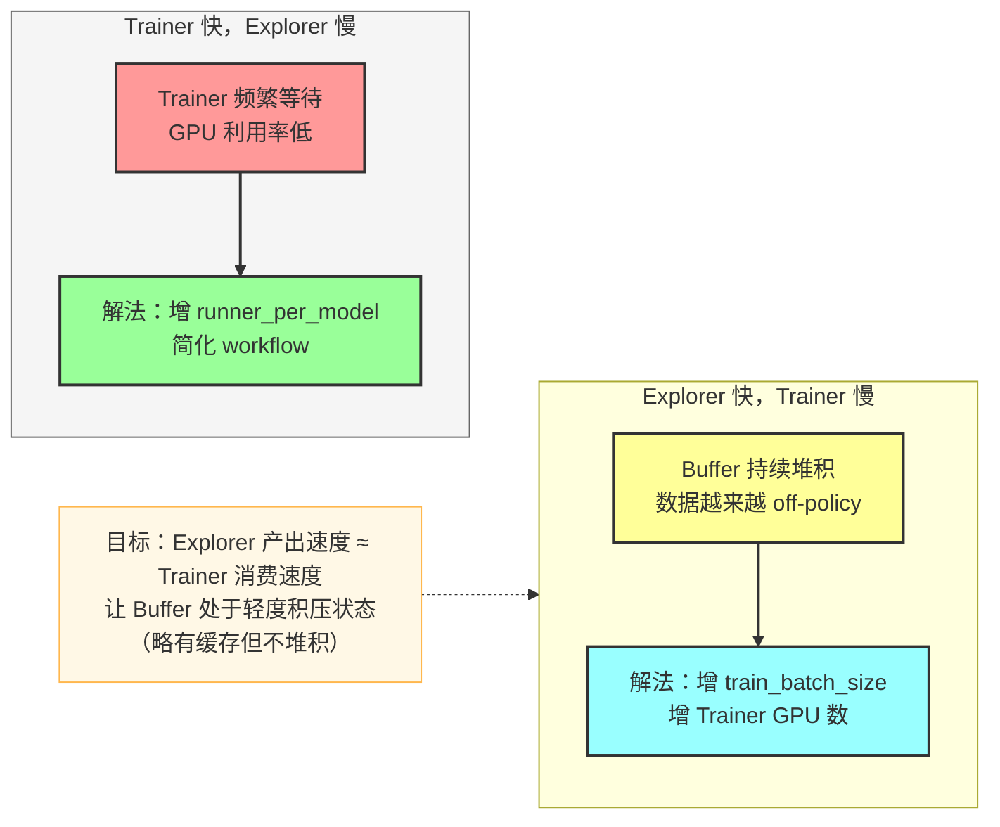
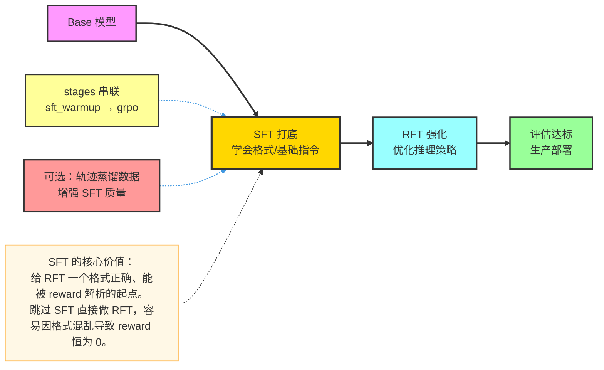

# Trinity-RFT RFT 完整流程（从 0 到 1 实战指南）

> **定位**：不只是"会跑流程"，而是"能讲透原理、看懂架构、做好评估、系统调优、自信应答面试"。  
> **对应仓库示例**：`examples/grpo_gsm8k/gsm8k.yaml`

---

## 1. RFT 是什么：本质与原理

### 1.1 一句话定义

RFT（Reinforcement Fine-Tuning，强化微调）= 让模型在做任务的过程中，通过奖励信号不断调整输出策略，而不是死记标准答案。

> 类比：学生不是背答案，而是做大量练习题，老师只给"对/错/得分"，学生自己调整解题思路。

### 1.2 为什么 SFT 不够用



### 1.3 RFT 的核心机制：策略梯度

RFT 本质是策略优化（Policy Optimization）。模型是"策略"（policy），生成的回答是"动作"（action），奖励函数对动作打分，反向传播的梯度朝向"更高奖励"的方向更新。

$$\mathcal{L}_{RFT} = -\mathbb{E}_{\tau \sim \pi_\theta}\left[\sum_t r_t \cdot \nabla_\theta \log \pi_\theta(a_t | s_t)\right]$$

- $\pi_\theta$：当前模型（策略）
- $a_t$：生成的第 $t$ 个 token（动作）
- $r_t$：该动作获得的奖励信号
- 优化目标：让模型倾向于生成获得高奖励的回复

### 1.4 GRPO 算法原理（Trinity-RFT 默认算法）

GRPO（Group Relative Policy Optimization）是 DeepSeek-R1 使用的核心算法，Trinity-RFT 的默认 RFT 算法。

**关键创新**：不需要单独训练 Critic/Value 网络（PPO 需要），直接用**组内相对奖励**作为基线。



**GRPO vs PPO 对比**：

| 维度 | PPO | GRPO |
|------|-----|------|
| Critic 网络 | 需要（额外显存） | 不需要 |
| 基线估计 | Value Function | 组内均值奖励 |
| 显存需求 | 高 | 低 |
| 实现复杂度 | 高 | 低 |
| 适用场景 | 复杂奖励 | 可量化奖励任务 |

---

## 2. Trinity-RFT 工程架构深度解析

### 2.1 四大核心组件



### 2.2 各组件职责深度解读

**Explorer（探索者）**：
- 持有当前模型权重，作为推理引擎；
- 从 Taskset 取任务，调用 Workflow 执行，计算 reward，打包成 Experience；
- 核心参数：`runner_per_model`（并发数）、`repeat_times`（同题多采）；

**Buffer（经验缓冲区）**：
- 解耦 Explorer 与 Trainer 的速度差异（生产者-消费者模式）；
- `storage_type: queue`（默认，实时）/ `sql`（持久化）/ `file`（离线）；
- 控制 on-policy 程度：Buffer 越大 → 越 off-policy；Buffer 越小 → 越 on-policy；

**Trainer（训练者）**：
- 从 Buffer 采样一批 Experience，计算 GRPO Loss，更新参数；
- 训练引擎 `verl`（分布式，生产推荐）/ `tinker`（轻量，快速实验）；

**Synchronizer（同步器）**：
- 解决 Explorer 用旧权重采样 vs Trainer 已更新权重的版本不一致问题；
- 同步方式：`nccl`（快，同机/RDMA）/ `checkpoint`（稳，跨机）/ `memory`（最快，单机实验）；

### 2.3 On-Policy vs Off-Policy 的工程含义



---

## 3. 模型选择策略

### 3.1 RFT 选模型的特殊考量

| 维度 | SFT 视角 | RFT 视角 |
|------|---------|---------|
| **基座 vs Instruct** | 推荐 Base | **推荐 Instruct** 或 SFT 后的模型（格式已对齐） |
| **推理能力** | 次要 | 核心（需要有一定基础推理才能学习） |
| **生成速度** | 次要 | 重要（Explorer 推理是瓶颈） |
| **模型规模** | 越大越好 | 先小后大，7B 验证 workflow 正确性 |

### 3.2 从零到生产的模型路线

```mermaid
flowchart LR
    classDef producerStyle fill:#f9f,stroke:#333,stroke-width:2px
    classDef topicStyle fill:#ffd700,stroke:#333,stroke-width:3px
    classDef partitionStyle1 fill:#9ff,stroke:#333,stroke-width:2px
    classDef partitionStyle2 fill:#9f9,stroke:#333,stroke-width:2px
    classDef consumerGroup1Style fill:#ff9,stroke:#333,stroke-width:2px
    classDef consumerGroup2Style fill:#f99,stroke:#333,stroke-width:2px
    classDef subgraphStyle fill:#f5f5f5,stroke:#666,stroke-width:1px,rounded:10px
    classDef ruleNoteStyle fill:#fff8e6,stroke:#ffb74d,stroke-width:1px,rounded:8px

    A[Qwen2.5-7B-Instruct\n验证 workflow 和 reward]:::producerStyle
    B[Qwen2.5-14B-Instruct\n验证效果是否可提升]:::topicStyle
    C[Qwen2.5-72B-Instruct\n生产级效果目标]:::partitionStyle1
    D[量化部署\nAWQ/GPTQ]:::partitionStyle2

    A -->|reward曲线上升| B
    B -->|效果达标| C
    C -->|部署优化| D

    Note[绝不在未验证 workflow 正确性时\n直接训大模型。]:::ruleNoteStyle
    Note -.-> A

    linkStyle 0,1,2 stroke:#333,stroke-width:2px,arrowheadStyle:filled
```



---

## 4. 数据与奖励函数设计

### 4.1 RFT 的"数据"是任务而非答案

SFT 数据 = 问题 + 标准答案（监督信号）  
RFT 数据 = 问题 + 评价规则（奖励来源）

```json
{
  "question": "Tom has 3 apples, buys 2 more, gives 1 away. How many left?",
  "answer": "4"
}
```

**数据要求**：
- `answer` 只用于计算奖励（比对），不用于监督梯度；
- 真正的训练信号来自"模型的回答是否正确"，而不是"模型是否复制了 answer"；

### 4.2 奖励函数设计原则



### 4.3 任务数据构建关键

| 维度 | 要求 | 原因 |
|------|------|------|
| **可评估性** | 必须能从输出计算奖励 | 没有奖励就没有训练信号 |
| **难度分布** | 过易（reward 恒 1）/ 过难（reward 恒 0）都无效 | GRPO 需要组内方差，全对/全错无梯度 |
| **数据量** | 通常需要 1000+ 条不同任务 | 同任务重复采样，不同任务保证覆盖 |
| **评估集独立** | `eval_tasksets` 严格分离 | 防止数据污染影响评估指标 |

---

## 5. 关键配置深度解析

### 5.1 完整配置示例（含解释）

```yaml
mode: both                          # Explorer + Trainer 同时运行

algorithm:
  algorithm_type: grpo              # 强化算法：grpo（推荐）/ ppo / dapo
  repeat_times: 8                   # 同一任务采样次数（GRPO 的 G）
  optimizer:
    lr: 1e-6                        # RFT 学习率比 SFT 更小（防止策略崩溃）
    lr_scheduler: cosine

buffer:
  batch_size: 96                    # Explorer 每轮处理的任务数（采样侧）
  train_batch_size: 256             # Trainer 每步处理的 experience 数
  explorer_input:
    taskset:
      path: openai/gsm8k            # 任务数据路径
      split: train
      prompt_key: question          # 任务问题字段
      response_key: answer          # 参考答案字段（用于计算 reward）
      default_workflow_type: math_workflow
    eval_tasksets:                  # 评估集（独立于训练集）
      - path: openai/gsm8k
        split: test
  trainer_input:
    experience_buffer:
      storage_type: queue           # RFT 用 queue（实时流），SFT 用 file

explorer:
  runner_per_model: 8               # 并发 workflow 数（提升采样吞吐）
  rollout_model:
    tensor_parallel_size: 1
    max_model_len: 4096

synchronizer:
  sync_method: nccl                 # 同步方式：nccl（快）/ checkpoint（稳）
  sync_interval: 1                  # 每训 N 步同步一次（越小越 on-policy）
  sync_style: trainer_driven        # 训练侧主导同步节奏

trainer:
  trainer_type: verl
  save_interval: 100
  grad_clip: 1.0
```

### 5.2 最关键参数及配置决策

| 参数 | 作用 | 配置原则 |
|------|------|---------|
| `repeat_times` | 同题采样次数（GRPO G） | 8~16：小 → 探索不足，大 → 计算浪费 |
| `batch_size` | Explorer 每轮任务数 | 按 GPU 数量和任务复杂度调整 |
| `train_batch_size` | Trainer 每步 experience 数 | `batch_size × repeat_times` 的整数倍 |
| `runner_per_model` | 并发推理数 | 推理是瓶颈时增大，受显存限制 |
| `sync_interval` | 同步频率 | 数学任务推荐 1~2，长轨迹推荐 5~10 |
| `sync_method` | 同步方式 | 同机优先 `nccl`，跨机用 `checkpoint` |
| `lr` | 学习率 | `1e-6`~`5e-6`，比 SFT 小 1~2 个数量级 |

---

## 6. 完整训练步骤

```bash
# 1. 准备环境与模型
pip install -e ".[train]"
# 下载模型到本地路径，或确认 HF Hub 可访问

# 2. 配置修改（关键字段）
# - model_path: 本地模型路径
# - buffer.explorer_input.taskset.path: 任务数据
# - explorer.rollout_model.max_model_len: 按任务长度设置

# 3. 启动 Ray
ray start --head

# 4. 启动训练（前台观察日志）
trinity run --config examples/grpo_gsm8k/gsm8k.yaml

# 5. 监控关键指标
# Explorer 日志：${checkpoint_dir}/log/explorer.log
# Trainer 日志：${checkpoint_dir}/log/trainer.log
# 可视化：tensorboard --logdir ${checkpoint_dir}/monitor/
```

**验证闭环是否正常运转**：

- Explorer 持续输出 experience（日志中有采样记录）；
- Buffer 有数据流动（不为空也不无限堆积）；
- Trainer loss 在波动中整体下降；
- Synchronizer 定期完成（日志中有 "sync done" 记录）；
- Eval reward 曲线整体上升。

---

## 7. 评估体系：怎么判断 RFT 训好了

### 7.1 RFT 评估三层框架



### 7.2 常见曲线形态诊断

| 现象 | 诊断 | 应对 |
|------|------|------|
| Reward 快速上升后稳定 | 正常收敛 | 继续训练或转难题 |
| Reward 始终在 0 附近 | 奖励函数问题 / 任务太难 | 优先检查奖励函数，调整任务难度 |
| Reward 上升后下降 | 过拟合训练集 / 奖励被 hack | 检查是否 reward hacking，增评估集 |
| Reward 剧烈震荡 | 学习率过大 / sync_interval 太小 | 降 lr，适当增 sync_interval |
| Train reward 高，Eval reward 低 | 泛化差 / 分布不匹配 | 扩充任务多样性，检查 eval 集分布 |

### 7.3 Pass@K 的含义与使用场景

- **Pass@1**：每题只采样 1 次，看是否正确 → 评估"确定性能力"
- **Pass@8**：每题采样 8 次，看是否至少 1 次正确 → 评估"探索能力上限"

> Pass@8 高但 Pass@1 低：模型有能力解题但不稳定 → 还需继续训练  
> Pass@1 接近 Pass@8：模型已相当稳定 → 考虑升难度或换任务

---

## 8. 系统性调优策略

### 8.1 调优优先级（严格按顺序）



### 8.2 Explorer 与 Trainer 速度失衡问题



### 8.3 常见问题速查处方

| 问题 | 根因 | 解决方案 |
|------|------|---------|
| Reward 长期为 0 | 奖励函数 bug / 任务全部太难 | 先抽样 debug reward，再调任务难度 |
| Reward 震荡剧烈 | lr 过大 / 梯度不稳 | 降 lr，检查 grad_clip |
| 同步超时报错 | nccl 超时 / 网络问题 | 换 `checkpoint` 同步，增加超时阈值 |
| Experience 生成空 | workflow 报错 / 格式解析失败 | 看 explorer_runner.log 定位 |
| 训练后模型退化 | KL 惩罚不足 / 过度优化 | 增大 KL 系数，或缩短训练步数 |
| OOM | batch 过大 / 序列过长 | 降 `train_batch_size`，降 `max_model_len` |

---

## 9. SFT + RFT 的组合工程路线

### 9.1 标准组合路线



### 9.2 Stages 串联配置（一份 yaml 完成全流程）

在 `gsm8k.yaml` 中已有注释模板：

```yaml
stages:
  - name: sft_warmup
    mode: train
    algorithm:
      algorithm_type: sft
    buffer:
      total_epochs: 1
      trainer_input:
        experience_buffer:
          storage_type: file
          path: your_sft_data
  - name: rft
    mode: both
    algorithm:
      algorithm_type: grpo
      repeat_times: 8
```

---

## 10. 输出产物与后处理

```bash
# 产物目录结构
${checkpoint_root_dir}/${project}/${name}/
├── global_step_100/        # 阶段 checkpoint（模型权重 + 优化器状态）
├── global_step_200/
├── buffer/                 # 经验缓存（queue 模式为空）
├── log/
│   ├── explorer.log        # Explorer 采样与 reward 日志
│   ├── trainer.log         # Trainer 训练过程日志
│   └── synchronizer.log    # 权重同步记录
├── monitor/                # tensorboard/wandb 可视化指标
├── explorer_meta.json      # Explorer 状态元数据
└── trainer_meta.json       # Trainer 状态元数据

# 转换为 HF 格式（用于部署/推理）
trinity convert --checkpoint-dir ${checkpoint_root_dir}/${project}/${name}
```

---

## 11. 面试应答指南

### 11.1 高频面试题与标准答法

**Q1：RFT 和 SFT 的本质区别是什么？**

> SFT 是有监督学习，用人工标注的"标准答案"告诉模型"应该输出什么"，优化 NLL Loss，模型上限受标注质量约束。  
> RFT 是强化学习，用奖励函数告诉模型"输出好不好"，通过探索发现 SFT 数据中没有的更优解，模型能超越标注上限。  
> 最直观的区别：SFT 数据驱动，RFT 奖励驱动。

**Q2：GRPO 和 PPO 有什么区别？为什么 Trinity-RFT 用 GRPO？**

> PPO 需要额外训练 Critic/Value 网络来估计每个状态的价值，显存需求高、实现复杂。GRPO 不需要 Critic，通过对同一任务采样 G 个回答，用组内奖励均值作为基线，计算相对优势（Advantage = reward_i - mean_reward）。这样不需要显式的价值估计，节省约 50% 显存，且在可量化奖励任务上效果与 PPO 相当。Trinity-RFT 选择 GRPO 主要考虑工程效率与资源成本。

**Q3：Trinity-RFT 的 Explorer-Buffer-Trainer-Synchronizer 各自的职责？**

> Explorer：持有当前模型权重，批量执行任务 workflow，计算 reward，生成 Experience 写入 Buffer。  
> Buffer：经验缓冲区，解耦 Explorer 和 Trainer 的速度差，支持 queue/sql/file 三种存储。  
> Trainer：从 Buffer 采样 Experience，计算 GRPO Loss，更新模型权重，定期保存 checkpoint。  
> Synchronizer：负责将 Trainer 的新权重同步给 Explorer，保证采样策略与训练策略版本一致，维持 on-policy 程度。

**Q4：sync_interval 参数的意义？设置大小各有什么影响？**

> sync_interval 控制 Trainer 每训练多少步同步一次权重到 Explorer。  
> 设置为 1（每步同步）：最接近 on-policy，训练信号最新鲜，效果通常更好，但同步开销大，吞吐低。  
> 设置为 10（每10步同步）：偏 off-policy，Explorer 用旧权重采样，同步开销小，吞吐高，但策略滞后可能影响效果。  
> 实践建议：数学/代码任务设 1~2，长轨迹 Agent 任务设 5~10。

**Q5：奖励函数设计有哪些坑？如何避免 Reward Hacking？**

> 常见坑：奖励函数只看表面字符串匹配，导致模型输出"4.0"而答案是"4"被判错；或奖励被模型"破解"——学会生成规则允许的无意义但得分高的格式。  
> 防止 Reward Hacking 的方法：多维度奖励（格式+内容+推理过程）；定期人工抽样检查高 reward 的回答是否真实正确；使用 LLM-as-Judge 而不是纯规则匹配；增加 KL 惩罚防止策略偏离过远。

**Q6：repeat_times（GRPO 的 G 值）设置多少合适？**

> G 值决定每道题采样多少个回答。G 太小（如 2~4）：组内奖励方差小，优势估计不准，梯度信号弱。G 太大（如 32）：计算成本高，但收益边际递减。通常 8~16 是实践中的平衡点。在任务难度较高（模型经常全错或全对）时，应增大 G 来捕捉更多多样性。

### 11.2 项目经历讲解模板

> "我在 Trinity-RFT 框架上做了 RFT 实验，目标是提升模型在 [任务领域] 的 [具体能力]。  
> 流程上：先用 SFT 让模型学会任务格式，再切换到 GRPO 做强化训练。Explorer 侧配置了 [N] 个并发 worker，每道题采样 8 次，通过 [奖励函数描述] 计算 reward。Trainer 侧用 verl 后端，学习率设为 1e-6，每 2 步同步一次权重。  
> 调优过程：先发现 reward 函数有 [具体 bug]，修复后 reward 曲线才开始上升。后来通过增加 runner_per_model 解决了 Explorer 吞吐不足的问题。  
> 最终效果：[指标] 从 [X%] 提升到 [Y%]，在独立测试集上也有 [Z%] 的提升。"

---

## 12. 快速上手 Checklist

- [ ] 能用一句话区分 SFT 和 RFT 的本质差异
- [ ] 能解释 GRPO 的"组内相对奖励"机制
- [ ] 能说清 Explorer / Buffer / Trainer / Synchronizer 各自的职责
- [ ] 跑通官方 `examples/grpo_gsm8k/gsm8k.yaml`
- [ ] 抽样 20 条验证 reward 函数输出是否符合直觉
- [ ] 观察 Eval Reward 曲线并能诊断曲线形态
- [ ] 完成一次"只改一个参数"的对照实验并记录结论
- [ ] 产出可加载 checkpoint 并转 HF 格式
- [ ] 能用 5 分钟完整讲述 RFT 的原理、架构与你的调优过程
