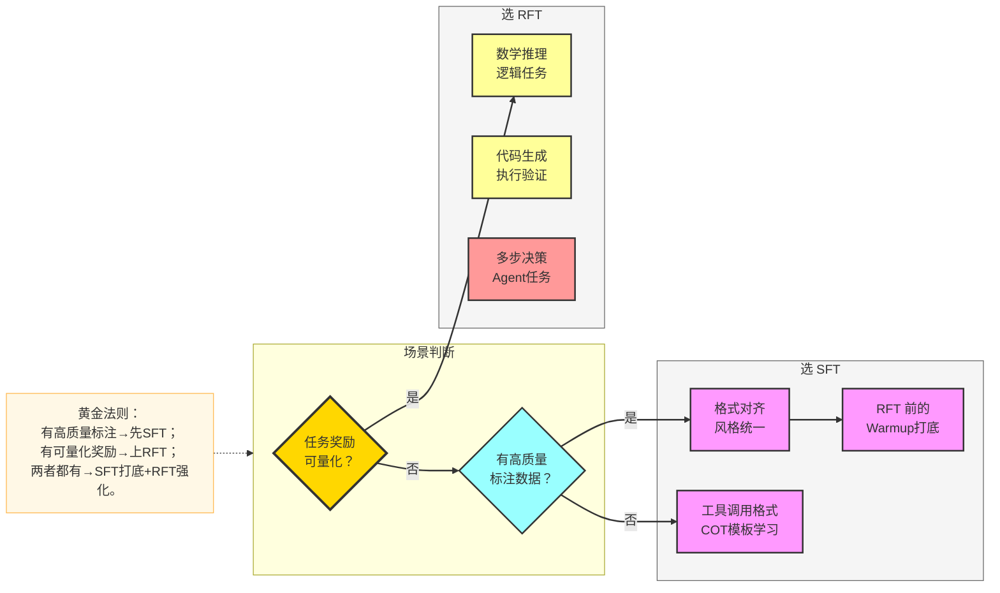
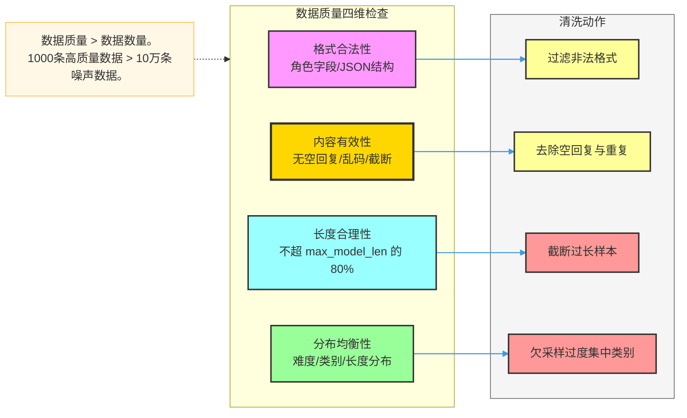
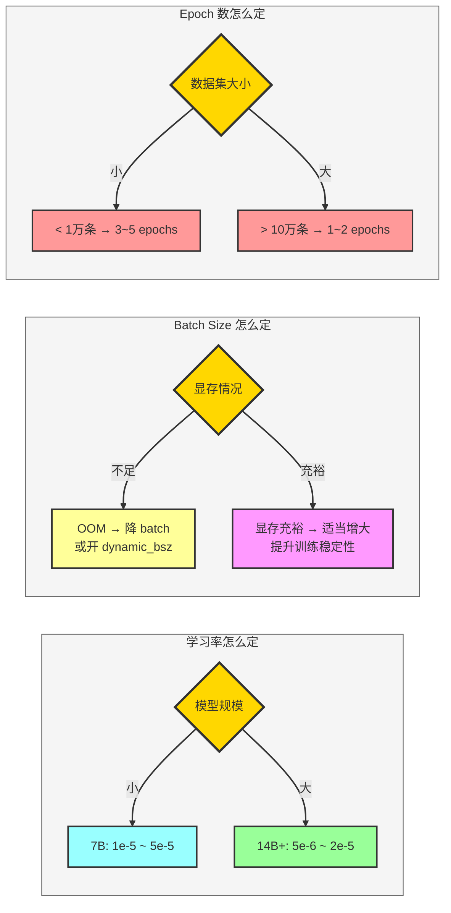
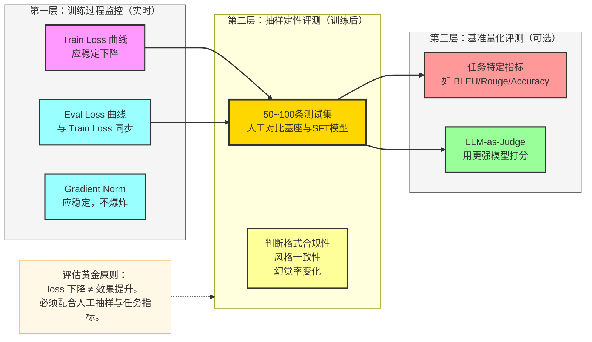
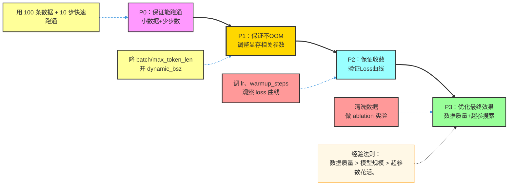
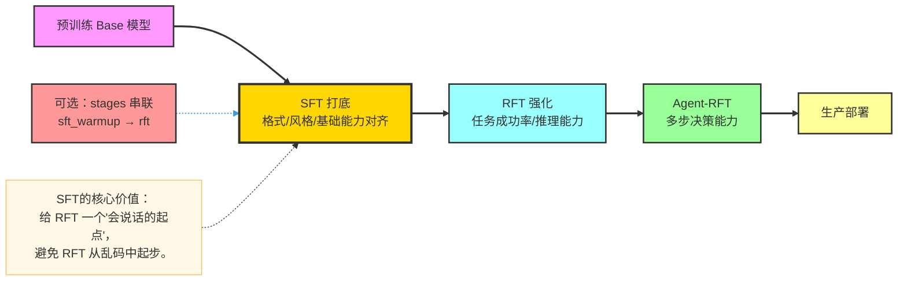

# Trinity-RFT SFT 完整流程（从 0 到 1 实战指南）

> **定位**：不只是"会跑流程"，而是"能讲透原理、看懂架构、做好评估、系统调优、自信应答面试"。  
> **对应仓库示例**：`examples/sft_mot/sft.yaml`

---

## 1. SFT 是什么：本质与原理

### 1.1 一句话定义

SFT（Supervised Fine-Tuning，监督微调）= 用人工标注的"问-答对"直接训练模型，让模型学会"在特定场景下输出特定风格的答案"。

> 类比：老师给出标准答案，学生反复抄写直到熟练。

### 1.2 训练目标（损失函数原理）

SFT 的优化目标是 **Next-Token Prediction Loss（负对数似然）**：

$$\mathcal{L}_{SFT} = -\sum_{t=1}^{T} \log P_\theta(y_t \mid x, y_{<t})$$

- $x$：输入（用户 prompt）  
- $y_t$：第 $t$ 个目标 token（assistant 回复）  
- 只对 **assistant 部分** 的 token 计算损失，输入部分 mask 掉

**为什么有效？**  
预训练模型已经具备语言能力，但不知道"该在什么时候输出什么"。SFT 通过有监督数据告诉模型"输入 X 时，正确输出是 Y"，本质上是在调整模型的条件分布，使其向目标分布靠拢。

### 1.3 SFT 与预训练的根本区别

| 维度 | 预训练 | SFT |
|------|--------|-----|
| 数据规模 | 万亿 token | 千~百万条 |
| 训练目标 | 无监督语言建模 | 有监督条件生成 |
| 更新幅度 | 从零学习 | 在已有能力上微调 |
| 成本 | 极高（GPU 月级别） | 较低（GPU 小时/天级别） |
| 产出 | 通用语言能力 | 特定任务/风格适配 |

### 1.4 什么时候应该用 SFT（而不是 RFT）



---

## 2. 模型选择策略

### 2.1 选模型的核心维度

| 维度 | 考量点 | 推荐原则 |
|------|--------|---------|
| **规模** | 任务复杂度 vs 显存成本 | 优先 7B/14B 验证，再扩至 72B |
| **基座类型** | Instruct vs Base | SFT 用 **Base 模型**效果通常更稳（Instruct 已有格式偏好，会干扰） |
| **架构** | GQA/MLA/MoE | 影响显存与推理速度，不影响 SFT 流程 |
| **许可证** | 商用/研究 | Qwen/LLaMA/Mistral 均支持，注意具体版本条款 |

### 2.2 典型选型路径


### 2.3 LoRA vs 全参微调的选择

| | LoRA | 全参 SFT |
|---|------|---------|
| **显存需求** | 低（只训适配器） | 高（全参更新） |
| **训练速度** | 快 | 慢 |
| **效果上限** | 略低（参数少） | 更高 |
| **何时选** | 资源有限/快速实验 | 数据充分/追求最优效果 |

> Trinity-RFT 中通过 `trainer.lora_config` 开启 LoRA，默认全参。

---

## 3. Trinity-RFT 中 SFT 的工程架构

### 3.1 SFT 完整数据流

```mermaid
flowchart LR
    classDef producerStyle fill:#f9f,stroke:#333,stroke-width:2px
    classDef topicStyle fill:#ffd700,stroke:#333,stroke-width:3px
    classDef partitionStyle1 fill:#9ff,stroke:#333,stroke-width:2px
    classDef partitionStyle2 fill:#9f9,stroke:#333,stroke-width:2px
    classDef consumerGroup1Style fill:#ff9,stroke:#333,stroke-width:2px
    classDef consumerGroup2Style fill:#f99,stroke:#333,stroke-width:2px
    classDef subgraphStyle fill:#f5f5f5,stroke:#666,stroke-width:1px,rounded:10px
    classDef kafkaClusterStyle fill:#e8f4f8,stroke:#4299e1,stroke-width:1.5px,rounded:10px
    classDef ruleNoteStyle fill:#fff8e6,stroke:#ffb74d,stroke-width:1px,rounded:8px

    subgraph dataLayer["数据准备层"]
        A[原始数据<br/>json/jsonl/parquet/HF Dataset]:::producerStyle
        B[字段映射与格式校验<br/>messages / prompt+response]:::partitionStyle1
        C[Tokenizer处理<br/>Apply chat template<br/>Mask input tokens]:::partitionStyle1
    end
    class dataLayer subgraphStyle

    subgraph configLayer["配置与调度层"]
        D[sft.yaml<br/>mode: train<br/>algorithm_type: sft]:::topicStyle
        E[ExperienceBuffer<br/>storage_type: file<br/>直接从文件读取]:::consumerGroup1Style
    end
    class configLayer kafkaClusterStyle

    subgraph trainLayer["训练执行层"]
        F[Trainer<br/>verl / tinker 后端]:::consumerGroup1Style
        G[前向传播<br/>计算NLL Loss]:::partitionStyle1
        H[反向传播<br/>梯度裁剪 + AdamW更新]:::partitionStyle1
    end
    class trainLayer subgraphStyle

    subgraph outputLayer["产物与验证层"]
        I[Checkpoint<br/>global_step_x/]:::partitionStyle2
        J[训练日志<br/>log/ + monitor/]:::consumerGroup2Style
        K[可选HF转换<br/>trinity convert]:::consumerGroup2Style
    end
    class outputLayer subgraphStyle

    A -->|字段清洗| B
    B -->|模板化编码| C
    C -->|写入 Buffer| E
    D -->|配置驱动| F
    E -->|批次采样| F
    F -->|前向计算| G
    G -->|梯度回传| H
    H -->|周期保存| I
    F -->|过程记录| J
    I -->|格式转换| K

    linkStyle 0,1,2,3,4,5,6,7,8,9 stroke:#333,stroke-width:2px,arrowheadStyle:filled

    SFTNote["SFT架构核心要点：<br/>1. mode=train → 只启动Trainer，无Explorer<br/>2. 数据走 trainer_input.experience_buffer<br/>3. 无需奖励函数，直接监督学习"]:::ruleNoteStyle
    SFTNote -.-> configLayer
```



### 3.2 SFT 与 RFT/Agent-RFT 的架构对比

| 维度 | SFT | RFT | Agent-RFT |
|------|-----|-----|-----------|
| `mode` | `train` | `both` | `both` |
| 数据来源 | 静态文件 | Explorer 实时生成 | Agent 轨迹 |
| 奖励函数 | 不需要 | 必须 | 必须（多步） |
| Explorer | 不启动 | 启动 | 启动 |
| 同步器 | 不启动 | 启动 | 启动 |
| 核心算法 | NLL Loss | GRPO 等 | multi_step_grpo |

### 3.3 为什么 SFT 不启动 Explorer

SFT 的训练信号来自**静态标注数据**，不需要在线采样。启动 Explorer 会浪费资源并引入不必要的复杂性。`mode: train` 告诉 Trinity-RFT 框架：只需要 Trainer 进程，Buffer 直接从文件读取即可。

---

## 4. 数据集构建：质量决定上限

### 4.1 推荐数据格式

**messages 格式**（推荐，与主流 Chat 模型对齐）：

```json
{
  "messages": [
    {"role": "system", "content": "你是一个专业的数学助手。"},
    {"role": "user", "content": "请解释牛顿第二定律"},
    {"role": "assistant", "content": "牛顿第二定律表达式为 F=ma，其中 F 是合外力..."}
  ]
}
```

**prompt + response 格式**（简单场景）：

```json
{
  "prompt": "请解释牛顿第二定律",
  "response": "牛顿第二定律表达式为 F=ma..."
}
```

### 4.2 数据质量判断框架



### 4.3 新手最容易踩的坑

| 错误 | 后果 | 正确做法 |
|------|------|---------|
| 把 DPO 数据（`chosen/rejected`）喂给 SFT | 字段读取报错 | 转换为 `messages` 格式 |
| `messages_key` 写错 | 所有样本为空，loss 为 0 | 先打印 1 条样本验证 |
| 长样本不过滤 | OOM 或吞吐极低 | 设置 `max_token_len_per_gpu` |
| 忘记 system prompt | 输出格式不一致 | 统一补充 system prompt |
| 标注数据包含占位符 | 模型学会输出 `[PLACEHOLDER]` | 清洗前抽样人工检查 |

---

## 5. 关键配置深度解析

### 5.1 完整配置示例（含注释）

```yaml
mode: train                         # 只启动 Trainer，不启动 Explorer

algorithm:
  algorithm_type: sft               # 监督微调
  optimizer:
    lr: 1e-5                        # 学习率：7B模型推荐 1e-5~5e-5
    lr_scheduler: cosine            # 余弦衰减；linear 也常用
    warmup_steps: 100               # 预热步数：约总步数的 5%~10%

buffer:
  total_epochs: 2                   # 训练轮数：先 1~2 轮验证，再增加
  train_batch_size: 64              # 全局 batch size（显存不足时降低）
  trainer_input:
    experience_buffer:
      storage_type: file            # SFT 固定用 file，不用 queue
      path: open-r1/Mixture-of-Thoughts  # 数据路径（HF Hub 或本地路径）
      format:
        prompt_type: messages       # messages / prompt_response
        messages_key: messages      # 数据集中对话字段名

trainer:
  trainer_type: verl                # 训练后端：verl（推荐）/ tinker
  save_interval: 50                 # 每 50 步保存一次 checkpoint
  grad_clip: 1.0                    # 梯度裁剪：防止梯度爆炸
  use_dynamic_bsz: true             # 动态 batch：按 token 数而非样本数批次
  max_token_len_per_gpu: 8192       # 每 GPU 每步最大 token 数
```

### 5.2 参数配置决策树



### 5.3 参数影响一览

| 参数 | 影响 | 经验值 |
|------|------|-------|
| `lr` | 收敛速度与稳定性 | 7B: `1e-5`；14B+: `5e-6` |
| `total_epochs` | 学习充分度 vs 过拟合 | 小数据集 3~5；大数据集 1~2 |
| `train_batch_size` | 稳定性 vs 显存 | 从 16 开始，逐步翻倍 |
| `warmup_steps` | 防止初期训练崩溃 | 总步数的 5%~10% |
| `grad_clip` | 梯度稳定性 | 固定 `1.0` 即可 |
| `max_token_len_per_gpu` | 显存上限 | 按实际显存二分调整 |

---

## 6. 完整训练步骤

```bash
# 1. 准备环境
pip install -e ".[train]"

# 2. 启动 Ray（分布式训练）
ray start --head

# 3. 检查配置文件（关键字段）
# - model_path: 模型路径
# - buffer.trainer_input.experience_buffer.path: 数据路径
# - trainer.save_interval, buffer.train_batch_size

# 4. 启动训练
trinity run --config examples/sft_mot/sft.yaml

# 5. 实时观察日志
tail -f ${checkpoint_root_dir}/${project}/${name}/log/trainer.log
```

---

## 7. 评估体系：怎么知道 SFT 训好了

### 7.1 三层评估框架



### 7.2 Loss 曲线诊断

| 现象 | 诊断 | 应对 |
|------|------|------|
| Train loss 下降，eval loss 也下降 | 正常收敛 | 继续训练 |
| Train loss 下降，eval loss 上升 | **过拟合** | 降 epochs，增数据，加正则 |
| Train loss 不下降 | 学习率过低或数据问题 | 先检查数据，再调 lr |
| Loss 剧烈震荡 | 学习率过高或梯度爆炸 | 降 lr，检查 grad_clip |
| Loss 快速收敛到很低值 | 数据太简单或数据泄露 | 检查 eval set 是否被污染 |

### 7.3 验收标准（可执行口径）

1. Checkpoint 正常保存且可加载；
2. 关键 loss 呈下降趋势且 eval loss 未明显反弹；
3. 抽样 50 条：格式合规率 > 95%；
4. 与基座模型对比：目标风格输出率显著提升。

---

## 8. 系统性调优策略

### 8.1 调优优先级



### 8.2 常见问题处方

| 问题 | 根因分析 | 解决方案 |
|------|---------|---------|
| OOM | batch 过大 / 序列过长 | 降 `train_batch_size`，开 `use_dynamic_bsz`，降 `max_token_len_per_gpu` |
| Loss 不收敛 | lr 过低 / 数据问题 | 先 `1e-4` 验证数据是否可学，再调回正常区间 |
| 训练后效果变差 | 过拟合 / 灾难性遗忘 | 减少 epochs，混入通用数据，降低 lr |
| 输出格式乱 | Chat template 未正确应用 | 检查 tokenizer 与 `prompt_type` 配置 |
| 吞吐太慢 | 序列长度不均匀 | 开启 `use_dynamic_bsz: true` |

---

## 9. SFT 在完整训练链路中的位置

### 9.1 SFT → RFT 的黄金路线



### 9.2 为什么要做 SFT Warmup

直接在 Base 模型上做 RFT，模型初期输出格式混乱（不遵循指令格式，不按要求输出 CoT），导致：
- 奖励函数无法解析输出；
- reward 恒为负，梯度信号无效；
- 训练崩溃或长期不收敛。

SFT 先让模型学会"基本格式"，再用 RFT 优化"策略质量"，事半功倍。

---

## 10. 面试应答指南

### 10.1 高频面试题与标准答法

**Q1：SFT 的训练目标是什么？为什么只对 assistant 部分计算 loss？**

> SFT 优化目标是最小化 assistant 回复部分的负对数似然。只对 assistant token 计算 loss，是因为 user 输入是已知条件，不应该让模型去"预测"条件本身，否则会让模型学到错误的分布。同时 mask 掉 input 部分也是防止梯度流向 prompt，避免模型"过拟合 prompt 的表达方式"。

**Q2：SFT 与预训练的区别？**

> 预训练是无监督语言建模，学习通用语言分布，数据量 TB 级，成本极高。SFT 是有监督条件生成，用标注的输入-输出对微调模型行为，数据量 KB~GB 级，成本可控。SFT 不会从零学习，而是在预训练能力基础上做行为对齐。

**Q3：什么情况下 SFT 会过拟合？如何防止？**

> 数据集小（<1000 条）但 epoch 多（>5），或数据分布过于单一时容易过拟合。表现为 train loss 很低但 eval loss 反弹，输出过于模板化、失去泛化能力。防止方法：减少 epochs，加大数据多样性，必要时加 dropout 或降 lr，也可以混入部分通用数据（数据增广）。

**Q4：SFT 和 RLHF 中的 SFT 阶段有何关系？**

> RLHF（ChatGPT 训练方式）的第一阶段就是 SFT，用人工标注的高质量对话数据微调 Base 模型，得到 SFT 模型；第二阶段训练 Reward Model；第三阶段用 PPO 强化学习进一步优化。Trinity-RFT 中 SFT 对应 RLHF 第一阶段，之后可以直接进入 RFT 替代 RLHF 后两阶段。

**Q5：在 Trinity-RFT 中，SFT 的 mode 为什么是 `train` 而非 `both`？**

> `mode: both` 表示同时启动 Explorer 和 Trainer，适用于需要在线采样的 RFT。SFT 的数据是预先准备好的静态数据集，不需要 Explorer 在线生成 experience，因此用 `mode: train` 只启动 Trainer，从 `experience_buffer` 的文件路径直接读取，节省资源且流程更简单。

### 10.2 项目经历讲解模板

> "我在 Trinity-RFT 框架上做了 SFT 实验。数据准备阶段，我将 [数据集] 转成 messages 格式，做了格式校验和长度过滤，保证每条样本符合 tokenizer 的 chat template。配置阶段，选择 [模型] 作为基座，设置学习率 [lr]、训练 [N] epochs、batch size [B]。训练过程中通过 tensorboard 监控 loss 曲线，发现 [X 问题] 后通过 [Y 方案] 解决。最终通过抽样评测验证了 [指标提升]，并将 checkpoint 转成 HF 格式供后续部署使用。"

---

## 11. 快速上手 Checklist

- [ ] 读懂 SFT 的 NLL Loss 公式，能解释为什么 mask input
- [ ] 跑通官方 `examples/sft_mot/sft.yaml`
- [ ] 把自己的数据转成 messages 格式并替换入配置
- [ ] 做 2 组对照实验（只改一个参数）
- [ ] 画出完整 loss 曲线并能解释曲线形态
- [ ] 产出 checkpoint 并做 50 条抽样人工评测
- [ ] 能用 3 分钟讲清楚 SFT 的完整链路和自己的优化思路
