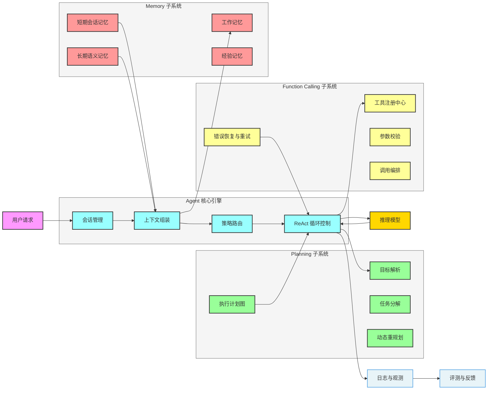
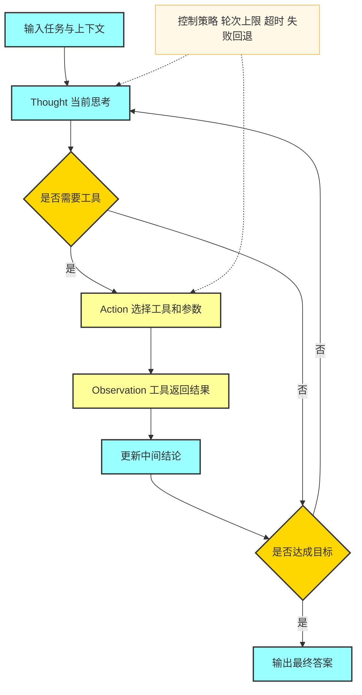
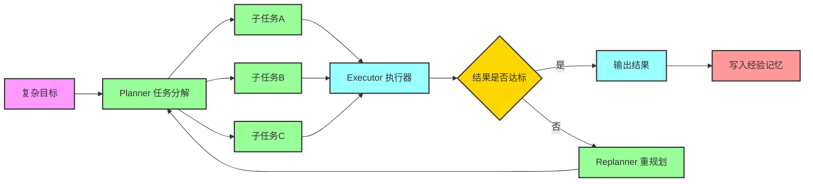
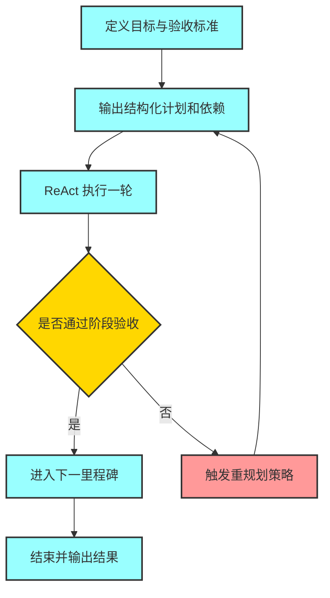

# Agent 核心引擎开发与面试实战指南

> 目标：帮助读者系统掌握 Agent 开发与核心引擎设计方法，能够在面试中讲清楚概念、架构、关键流程、工程取舍与落地细节。

## 1. 什么是 Agent 核心引擎

Agent 核心引擎本质是一个可循环推理的任务执行系统，不只是一次性问答。
它通常包含四类核心能力：

- **Memory（记忆）**：记录上下文、用户画像、历史任务和可复用经验。
- **Planning（规划）**：把复杂目标拆成可执行子任务，并动态调整路径。
- **Function Calling（工具调用）**：把语言能力连接到真实世界能力，如检索、数据库、API、代码执行等。
- **Reasoning Loop（推理循环）**：典型范式是 ReAct，交替进行思考与行动，直到达成目标。

---

## 2. 面试可复述的总体架构



### 面试表达模板

可以按这三句话回答：

1. **我把 Agent 引擎分成推理控制层、规划层、工具层、记忆层。**
2. **推理控制层负责 ReAct 循环，规划层负责把目标拆成任务图，工具层负责可靠执行外部能力，记忆层负责上下文与长期个性化。**
3. **工程上通过观测和评测闭环来持续提升成功率与稳定性。**

---

## 3. 关键流程一：请求到答案的主链路

1. **接收请求**：识别用户目标、约束、上下文窗口和安全边界。
2. **组装上下文**：注入历史消息、相关长期记忆、系统提示词和工具清单。
3. **规划任务**：判断是否需要分解，生成可执行步骤或任务图。
4. **执行循环**：ReAct 迭代，必要时调用工具并消费观察结果。
5. **更新记忆**：写入有价值事实、偏好、经验和失败案例。
6. **返回结果**：给出答案、证据、后续建议，并记录评测信号。

---

## 4. 关键流程二：ReAct 推理执行循环



### 面试官常追问点

- **为什么要 ReAct**：因为纯链式思维不能直接访问外部事实，ReAct 让推理和行动交替，减少幻觉。
- **如何防止死循环**：设置最大轮次、重复动作检测、目标进展检测、失败后降级策略。
- **如何减少无效调用**：增加工具选择器、置信度阈值和调用成本约束。

---

## 5. 关键流程三：复杂任务分解与重规划



### 分解策略（面试可说）

- **按阶段分解**：调研、设计、实现、验证。
- **按依赖分解**：先做上游输入，再做下游生成。
- **按风险分解**：优先执行高不确定环节，尽早暴露问题。
- **按资源分解**：把高成本步骤前置评估，避免浪费调用额度。

### ReAct 复杂任务拆分的提示词技巧

复杂任务提示词的关键不是让模型多写步骤，而是让它按“可执行结构”输出计划并可回退。

#### 技巧 1：先给验收标准，再要求拆分

- 先定义完成条件，例如正确性、完整性、时效性、格式、成本上限。
- 没有验收标准的拆分通常会变成“看起来合理但不可验证”的步骤列表。

#### 技巧 2：强制输出结构化计划

- 要求输出固定字段：`目标`、`里程碑`、`子任务`、`依赖`、`工具`、`验收点`、`失败回退`。
- 使用 JSON 或表格约束格式，避免模型输出散文。

#### 技巧 3：让每个子任务都带输入输出

- 每个子任务必须写清 `input` 和 `output`，否则无法做依赖编排。
- 复杂任务失败常见原因是“任务名存在，但输入输出未定义”。

#### 技巧 4：显式写入重规划触发器

- 触发条件可写为：关键依赖失败、阶段验收失败、预算超限、外部环境变化。
- 触发后要求模型执行：换工具、换路径、缩小范围、降级交付。

#### 技巧 5：给预算和停止条件

- 约束 `最大轮次`、`最大工具调用数`、`超时`、`token 上限`。
- 明确停止条件：达到验收标准或进入降级交付，避免 ReAct 循环漂移。

#### 技巧 6：Observation 必须先摘要再继续

- 工具返回通常很长，直接回灌会污染上下文。
- 要求先输出“证据摘要、置信度、下一步决策依据”。

#### 技巧 7：让 Action 说明“为什么选这个工具”

- 要求模型给出工具选择理由和备选工具。
- 面试中这能体现你在做“策略路由”，不是盲目调用。

#### 技巧 8：加入失败样本的反模式约束

- 显式禁止：重复调用同一失败工具、无依据重试、跨阶段跳步执行。
- 可加入规则：同类失败超过阈值必须触发重规划而非继续重试。

### 提示词骨架流程（用于复杂任务）



### 可直接复用的提示词模板

```text
你是一个 ReAct Planner-Executor，负责处理复杂任务。

任务目标:
{goal}

约束:
- 时间预算: {time_budget}
- 工具调用上限: {tool_budget}
- token 预算: {token_budget}
- 安全规则: {security_rules}

可用工具:
{tools}

执行要求:
1. 先输出验收标准，至少包含正确性、完整性、时效性、成本。
2. 输出结构化计划，包含里程碑、子任务、依赖、输入输出、验收点、失败回退策略。
3. 按 ReAct 循环执行，每轮输出 Thought、Action、ObservationSummary、Decision。
4. 当依赖失败、验收失败、预算超限时，必须触发重规划。
5. 达到验收标准后停止；若无法满足，输出降级方案和风险说明。

输出格式(JSON):
{
  "acceptance_criteria": [],
  "milestones": [
    {
      "name": "",
      "dependencies": [],
      "tasks": [
        {
          "name": "",
          "input": [],
          "output": [],
          "tool": "",
          "check": "",
          "fallback": ""
        }
      ]
    }
  ],
  "react_trace": [
    {
      "thought": "",
      "action": {"tool": "", "args": {}},
      "observation_summary": "",
      "decision": ""
    }
  ],
  "final_answer": "",
  "risks": []
}
```

### 面试表达一句话版本

我在 ReAct 提示词里不是只要求“拆步骤”，而是强制它输出“验收标准 + 依赖关系 + 失败回退 + 停止条件”，这样复杂任务才能稳定执行和可追溯。

---

## 6. Memory 设计：面试高频知识点

### 6.1 记忆分层模型

- **工作记忆**：当前推理窗口中的临时变量和中间结论。
- **短期记忆**：单会话历史、最近任务状态、工具返回摘要。
- **长期语义记忆**：用户偏好、常识化事实、领域知识片段。
- **经验记忆**：历史计划模板、成功路径、失败恢复策略。

### 6.2 写入策略

- **选择性写入**：不是所有对话都写长期记忆，只保留高价值、可复用、低噪声信息。
- **结构化写入**：建议使用统一 schema，如 `type`、`source`、`confidence`、`ttl`。
- **冲突处理**：新旧事实冲突时，引入时间戳与置信度，必要时请求用户确认。

### 6.3 检索策略

- **语义检索 + 规则过滤**：先向量召回，再按时间、业务域、权限过滤。
- **上下文预算控制**：限制注入 token，优先高相关、高置信、近时效记忆。

---

## 7. Planning 设计：从“会答题”到“会做事”

### 7.1 基础组件

- **Goal Parser**：把自然语言目标转成可执行目标对象。
- **Task Decomposer**：生成任务树或 DAG。
- **Plan Critic**：检查计划可行性、完整性、成本和风险。
- **Replanner**：当观察结果不满足预期时自动调整步骤。

### 7.2 常见规划算法思路

- **单步规划**：每轮只规划下一步，灵活但可能抖动。
- **全局规划**：先出完整计划，稳定但对动态环境适应慢。
- **混合规划**：先全局后局部修正，工程上最常用。

### 7.3 面试加分点

- 引入**任务状态机**（Pending、Running、Blocked、Done、Failed）。
- 引入**依赖拓扑排序**处理并行执行。
- 引入**预算约束**（时间、token、API 成本）驱动策略选择。

---

## 8. Function Calling 设计：可靠性是核心

### 8.1 标准调用链路

1. 工具注册：名称、描述、参数 schema、权限域。
2. 工具选择：模型决策或规则路由。
3. 参数生成与校验：类型、必填、取值范围、安全约束。
4. 执行调用：超时控制、重试、幂等键、熔断降级。
5. 结果标准化：统一结构返回给推理层。
6. 失败恢复：回退策略或换工具重试。

### 8.2 面试常见风险点

- **参数注入攻击**：需要 schema 校验和输入清洗。
- **越权调用**：需要工具级权限控制和审计日志。
- **结果不可复现**：需要固定随机种子、记录版本和外部依赖快照。
- **长链路失败**：需要重试策略分级，不是所有错误都应该重试。

---

## 9. ReAct 落地建议（工程视角）

- **提示词模板化**：固定 Thought、Action、Observation 格式，方便解析。
- **工具结果摘要化**：避免把原始长结果直接回灌模型，先压缩为关键信息。
- **动作白名单**：限制可执行工具集合，降低安全风险。
- **回合控制器**：统一处理轮次、超时、异常、终止条件。
- **可观测性埋点**：记录每轮思考摘要、动作、延迟、错误码和成本。

---

## 10. 面试必问：评测与监控怎么做

### 10.1 离线评测

- 任务成功率
- 计划正确率
- 工具调用成功率
- 平均轮次与平均 token
- 幻觉率与事实一致性

### 10.2 在线监控

- P50、P95 延迟
- 单请求成本
- 工具错误率
- 重规划触发率
- 用户满意度反馈

### 10.3 闭环优化

- 把失败样本沉淀为回归测试集。
- 高价值失败样本回灌到提示词与策略。
- 对 Memory、Planning、Tool 三层分别设 A/B 实验。

---

## 11. 高频面试 FAQ（经典与常考）

### Q1：Agent 和传统 ChatBot 的本质区别是什么
**A：** ChatBot 偏单轮生成，Agent 是目标驱动闭环系统，具备规划、行动、记忆与反馈优化能力。

### Q2：为什么 Agent 一定要有 Planning
**A：** 复杂任务通常超出单次推理能力，规划可以把问题降维，提升成功率与可控性。

### Q3：长期记忆为什么会引入噪声
**A：** 因为历史数据存在过期、冲突、低价值信息，需要选择性写入与检索过滤。

### Q4：如何做记忆遗忘机制
**A：** 常见方法是 TTL、衰减评分、基于访问频次的淘汰和人工确认删除。

### Q5：Function Calling 的核心难点是什么
**A：** 不是“能不能调”，而是“是否可靠可控”，包括 schema 校验、权限、安全、重试与回退。

### Q6：ReAct 相比 CoT 的优势
**A：** ReAct 能把外部观察引入推理，显著降低纯内部推理导致的幻觉。

### Q7：如何控制 Agent 成本
**A：** 减少无效回合、压缩上下文、工具结果摘要、低成本模型路由和缓存复用。

### Q8：如何避免工具调用死循环
**A：** 设置轮次上限、同动作重复阈值、进展分数门槛和强制终止条件。

### Q9：什么时候需要重规划
**A：** 当关键子任务失败、外部环境变化或中间结果偏离目标时触发。

### Q10：如何做多 Agent 协作
**A：** 通过角色分工与消息协议协作，通常使用调度 Agent 做任务分发与结果汇总。

### Q11：如何保证回答可追溯
**A：** 记录每轮 Thought 摘要、Action 参数、Observation 结果与最终决策依据。

### Q12：面试中如何讲你的 Agent 项目亮点
**A：** 按“问题背景、架构设计、关键机制、量化收益、踩坑复盘”五段式表达。

---

## 12. 面试答题模板（可直接背诵）

**模板一：系统设计题**
1. 先讲目标和约束（准确率、时延、成本、安全）。
2. 再讲四层架构（控制、规划、工具、记忆）。
3. 再讲关键链路（ReAct 循环 + 异常回退 + 观测评测）。
4. 最后讲量化指标和优化结果。

**模板二：深挖追问题**
1. 先给结论。
2. 再给工程取舍和替代方案。
3. 最后补充失败案例和改进闭环。

---

## 13. 一句话总结

面试想拿高分，不是只会说“我用了 Agent”，而是要讲清楚：**如何把 Memory、Planning、Function Calling 和 ReAct 组合成一个稳定、可控、可优化的工程系统**。
