以下是对 Dify 是否支持大模型网关的深度分析：

---

## Dify 大模型网关（LLM Gateway）能力全景分析

### 结论先行

Dify **原生具备 LLM Gateway 的核心能力**，但它是作为平台内部基础设施实现的，而非一个可独立暴露的标准 Gateway 服务。其覆盖情况如下：

| 能力 | 支持程度 | 实现方式 |
|------|---------|---------|
| 多模型鉴权 | ✅ 完整支持 | RSA 加密凭据 + 租户隔离 |
| 负载均衡 | ✅ 完整支持 | Round Robin + Cooldown 降级 |
| 流式限流 | ✅ 支持 | Redis 并发槽 + 流式包装器 |
| 计费监控 | ✅ 支持 | Token 用量 + 配额事件扣减 |
| 降级策略 | ⚠️ 部分支持 | 同模型多 Key 降级，无跨模型降级 |
| 独立 Gateway 接口 | ❌ 不支持 | 无对外 OpenAI 兼容 Gateway 接口 |

---

### 架构图：Dify LLM Gateway 内部结构

```mermaid
flowchart LR
    classDef appStyle fill:#f9f,stroke:#333,stroke-width:2px
    classDef gatewayStyle fill:#ffd700,stroke:#333,stroke-width:3px
    classDef lbStyle fill:#9ff,stroke:#333,stroke-width:2px
    classDef pluginStyle fill:#9f9,stroke:#333,stroke-width:2px
    classDef providerStyle fill:#ff9,stroke:#333,stroke-width:2px
    classDef storageStyle fill:#f99,stroke:#333,stroke-width:2px
    classDef subgraphStyle fill:#f5f5f5,stroke:#666,stroke-width:1px
    classDef kafkaClusterStyle fill:#e8f4f8,stroke:#4299e1,stroke-width:1.5px

    %% 1. 应用层
    subgraph appLayer["应用层（App Runtime）"]
        A1[Chat App]:::appStyle
        A2[Workflow App]:::appStyle
        A3[Agent App]:::appStyle
    end
    class appLayer subgraphStyle

    %% 2. Gateway 统一入口
    subgraph gatewayLayer["LLM Gateway（ModelManager）<br/>api/core/model_manager.py"]
        G1[get_model_instance<br/>统一调度入口]:::gatewayStyle
        G2[凭据解密<br/>RSA Decrypt]:::gatewayStyle
        G3[策略合规检查<br/>Policy Compliance]:::gatewayStyle
    end
    class gatewayLayer kafkaClusterStyle

    %% 3. 限流层
    subgraph rateLimitLayer["限流层"]
        RL1[RateLimit<br/>Redis 并发槽]:::lbStyle
        RL2[RateLimitGenerator<br/>流式包装器]:::lbStyle
    end
    class rateLimitLayer subgraphStyle

    %% 4. 负载均衡 + 降级层
    subgraph lbLayer["负载均衡 + 降级层（LBModelManager）"]
        LB1[Round Robin<br/>轮询选择 API Key]:::lbStyle
        LB2[Cooldown 机制<br/>Redis TTL 熔断]:::lbStyle
        LB3[错误分级降级<br/>RateLimit→60s / Auth→10s]:::lbStyle
    end
    class lbLayer subgraphStyle

    %% 5. 插件执行层
    subgraph pluginLayer["插件执行层（Plugin System）"]
        P1[PluginModelClient<br/>统一 RPC 调用]:::pluginStyle
        P2[invoke_llm<br/>invoke_embedding 等]:::pluginStyle
    end
    class pluginLayer subgraphStyle

    %% 6. 模型提供商
    subgraph providerLayer["模型提供商（100+ 插件）"]
        PR1[OpenAI]:::providerStyle
        PR2[Anthropic]:::providerStyle
        PR3[Google Gemini]:::providerStyle
        PR4[Azure / 本地模型...]:::providerStyle
    end
    class providerLayer subgraphStyle

    %% 7. 存储层
    subgraph storageLayer["存储层"]
        S1[PostgreSQL<br/>凭据/配额/用量]:::storageStyle
        S2[Redis<br/>限流/Cooldown/缓存]:::storageStyle
    end
    class storageLayer subgraphStyle

    %% 流转
    A1 & A2 & A3 -->|invoke_llm / invoke_embedding| G1
    G1 -->|解密 API Key| G2
    G2 -->|合规检查| G3
    G3 -->|并发检查| RL1
    RL1 -->|包装流式响应| RL2
    RL1 -->|选择凭据| LB1
    LB1 -->|凭据 Cooldown| LB2
    LB2 -->|错误驱动熔断| LB3
    LB3 -->|RPC 调用| P1
    P1 --> P2
    P2 --> PR1 & PR2 & PR3 & PR4

    G2 <-->|读写凭据/配额| S1
    LB2 <-->|Cooldown TTL| S2
    RL1 <-->|并发计数| S2

    linkStyle 0,1,2 stroke:#666,stroke-width:1.5px
    linkStyle 3,4,5,6,7,8,9,10 stroke:#333,stroke-width:1.5px
    linkStyle 11,12,13 stroke:#4299e1,stroke-width:1.5px
```



---

### 各项能力详解

#### 1. 多模型鉴权 ✅

Dify 的凭据体系是**租户级 RSA 加密**，支持多 Key 并存：

```
providers 表
├── credential_id → ProviderCredential.encrypted_config（RSA 加密的 API Key）
├── provider_model_credentials（模型级凭据，优先级高于 provider 级）
└── load_balancing_model_configs（同模型多 Key 负载均衡）
```

凭据获取优先级链：**模型级凭据 → Provider 级凭据 → 系统 Hosting 凭据**，对业务层完全透明。

#### 2. 流式限流 ✅

基于 Redis 实现应用级并发控制（`api/core/app/features/rate_limiting/rate_limit.py`）：

- 每个应用（`client_id`）维护一个 Redis Hash，记录活跃请求
- 并发数超限时抛出 `AppInvokeQuotaExceededError`
- `RateLimitGenerator` 包装流式 Generator，确保流结束或异常时自动释放并发槽，**防止流式请求泄漏**

#### 3. 计费监控 ✅

Token 用量追踪非常完整（`api/core/model_runtime/entities/llm_entities.py`）：

```python
class LLMUsage(ModelUsage):
    prompt_tokens: int          # 输入 Token 数
    prompt_unit_price: Decimal  # 输入单价（$/1K Token）
    prompt_price: Decimal       # 输入费用
    completion_tokens: int      # 输出 Token 数
    completion_price: Decimal   # 输出费用
    total_price: Decimal        # 总费用（USD）
    latency: float              # 请求耗时
    time_to_first_token: float  # 首 Token 延迟（流式专用）
```

配额扣减通过**事件驱动**（`message_was_created` 信号）异步触发，支持按次（TIMES）、按 Token（TOKENS）、按信用点（CREDITS）三种计费模式。

#### 4. 降级策略 ⚠️ 部分支持

**支持**：同一模型的多 API Key 之间的自动降级熔断

| 错误类型 | 行为 |
|---------|------|
| `InvokeRateLimitError` | 该 Key 熔断 60 秒，轮询到下一个 Key |
| `InvokeAuthorizationError` | 该 Key 熔断 10 秒 |
| `InvokeConnectionError` | 该 Key 熔断 10 秒 |
| 所有 Key 均熔断 | 抛出最后一个异常 |

**不支持**：跨模型降级（如 GPT-4 失败自动切换到 Claude）——这个需要业务层自己实现。

---

### 与标准 LLM Gateway 的差距

| 标准 Gateway 特性 | Dify 现状 | 差距说明 |
|-----------------|---------|---------|
| OpenAI 兼容 API 接口 | ❌ | 无法作为标准 Gateway 被第三方接入 |
| 跨模型 Fallback | ❌ | 只支持同模型多 Key 降级 |
| 全局 Token 速率限制（TPM/RPM）| ❌ | 只有并发数限制，无 TPM 控制 |
| 请求审计日志 | ⚠️ | 有 `OperationLog` 但不够细粒度 |
| 动态路由策略 | ❌ | 仅 Round Robin，无权重/延迟优先等策略 |

---

### 总结

Dify 的 `ModelManager`（`api/core/model_manager.py`）本质上是一个**平台内嵌的 LLM Gateway**，完整覆盖了多模型鉴权、负载均衡、限流、计费监控和同 Key 降级。如果你的目标是：

- **在 Dify 平台内使用**：开箱即用，能力完整
- **将 Dify 作为独立 Gateway 对外暴露**：需要额外开发 OpenAI 兼容接口层
- **跨模型降级（如 GPT-4 → Claude 自动切换）**：需要在 Workflow 层手动设计条件分支实现