# Dify 1.13.0 项目架构分析文档

> **版本**：Dify 1.13.0  
> **文档类型**：详细版（模块关系版）  
> **适用场景**：技术分析、架构设计参考、团队协作、面试准备

---

## 目录

1. [项目背景](#1-项目背景)
2. [项目目标](#2-项目目标)
3. [整体架构概览](#3-整体架构概览)
4. [核心模块与组件](#4-核心模块与组件)
   - 4.1 [前端层（Web）](#41-前端层web)
   - 4.2 [后端控制器层（Controllers）](#42-后端控制器层controllers)
   - 4.3 [服务层（Services）](#43-服务层services)
   - 4.4 [核心领域层（Core）](#44-核心领域层core)
   - 4.5 [数据持久层（Models）](#45-数据持久层models)
   - 4.6 [基础设施层（Infrastructure）](#46-基础设施层infrastructure)
5. [核心流程与工作原理](#5-核心流程与工作原理)
   - 5.1 [对话请求全链路流程](#51-对话请求全链路流程)
   - 5.2 [Workflow 引擎执行流程](#52-workflow-引擎执行流程)
   - 5.3 [RAG 知识库检索流程](#53-rag-知识库检索流程)
   - 5.4 [模型提供商适配流程](#54-模型提供商适配流程)
   - 5.5 [Agent 推理流程](#55-agent-推理流程)
6. [技术栈与工具](#6-技术栈与工具)
7. [部署架构](#7-部署架构)
8. [面试常见问题（FAQ）](#8-面试常见问题faq)

---

## 1. 项目背景

Dify 是一个开源的 **LLM 应用开发平台**，诞生于 2023 年，旨在降低大型语言模型（LLM）应用的开发门槛。随着 ChatGPT 等大模型的爆发式增长，企业和个人开发者对构建 AI 驱动应用的需求激增，但直接调用 LLM API 面临以下挑战：

- **复杂的提示工程**：系统提示、上下文管理、变量注入门槛高
- **多模型适配困难**：不同提供商 API 差异大，切换成本高
- **RAG 实现复杂**：知识库构建、向量检索、重排序等工程量庞大
- **工作流编排缺失**：多步骤 AI 流程缺乏可视化编排工具
- **生产化挑战**：监控、日志、多租户、权限、计费等配套设施缺失

Dify 通过提供一套完整的 **可视化低代码平台**，将上述复杂性封装为直观的界面操作和强大的 API，成为连接 LLM 与业务应用的核心中间层。

---

## 2. 项目目标

| 目标维度 | 具体目标 |
|---------|---------|
| **降低开发门槛** | 非工程师也能通过可视化界面构建 AI 应用，无需编码 |
| **模型中立** | 支持 OpenAI、Anthropic、Google、Azure 等 100+ 模型提供商 |
| **工作流编排** | 提供可视化 DAG（有向无环图）工作流编辑器，支持复杂多步骤 AI 流程 |
| **知识库管理** | 内置 RAG 管道，支持文档上传、向量化、语义检索 |
| **Agent 能力** | 支持工具调用、ReAct 推理、函数调用等 Agent 模式 |
| **企业级特性** | 多租户隔离、SSO、细粒度权限、审计日志、计费管理 |
| **可扩展性** | 插件系统支持自定义工具、模型、数据源、触发器 |
| **可观测性** | 集成 LangFuse、LangSmith 等可观测平台，追踪模型调用链 |

---

## 3. 整体架构概览

Dify 采用经典的 **前后端分离 + 领域驱动设计（DDD）** 架构，整体分为五层：

```mermaid
flowchart LR
    classDef frontendStyle fill:#e8f4f8,stroke:#4299e1,stroke-width:2px
    classDef gatewayStyle fill:#fef9e7,stroke:#f39c12,stroke-width:2px
    classDef serviceStyle fill:#eafaf1,stroke:#27ae60,stroke-width:2px
    classDef coreStyle fill:#fdf2f8,stroke:#8e44ad,stroke-width:2px
    classDef infraStyle fill:#fdedec,stroke:#e74c3c,stroke-width:2px
    classDef subgraphStyle fill:#f8f9fa,stroke:#adb5bd,stroke-width:1px

    %% 前端层
    subgraph frontendLayer["前端层（Next.js / React）"]
        A1[应用编辑器<br/>Workflow 可视化]:::frontendStyle
        A2[知识库管理<br/>文档上传/检索]:::frontendStyle
        A3[模型配置<br/>提供商管理]:::frontendStyle
        A4[探索市场<br/>应用分享]:::frontendStyle
    end
    class frontendLayer subgraphStyle

    %% API 网关层
    subgraph gatewayLayer["API 网关层（Nginx）"]
        B1[反向代理<br/>负载均衡]:::gatewayStyle
        B2[SSL 终止<br/>SSRF 防护]:::gatewayStyle
    end
    class gatewayLayer subgraphStyle

    %% 后端服务层
    subgraph backendLayer["后端服务层（Flask / Python）"]
        C1[Console API<br/>管理后台接口]:::serviceStyle
        C2[Service API<br/>对外服务接口 v1]:::serviceStyle
        C3[Web API<br/>Web 端接口]:::serviceStyle
        C4[MCP 接口<br/>模型协议]:::serviceStyle
    end
    class backendLayer subgraphStyle

    %% 核心领域层
    subgraph coreLayer["核心领域层（Core Domain）"]
        D1[Workflow 引擎<br/>DAG 图执行]:::coreStyle
        D2[App 运行时<br/>Chat/Completion/Agent]:::coreStyle
        D3[RAG 管道<br/>检索增强生成]:::coreStyle
        D4[模型运行时<br/>多提供商适配]:::coreStyle
        D5[插件系统<br/>工具/数据源]:::coreStyle
    end
    class coreLayer subgraphStyle

    %% 基础设施层
    subgraph infraLayer["基础设施层"]
        E1[(PostgreSQL<br/>关系型数据)]:::infraStyle
        E2[(Redis<br/>缓存/消息队列)]:::infraStyle
        E3[(向量数据库<br/>Weaviate/PgVector)]:::infraStyle
        E4[(对象存储<br/>S3/OSS/本地)]:::infraStyle
        E5[Celery Worker<br/>异步任务]:::infraStyle
    end
    class infraLayer subgraphStyle

    %% 连接关系
    frontendLayer -->|HTTP / SSE| gatewayLayer
    gatewayLayer -->|反向代理| backendLayer
    backendLayer -->|业务调用| coreLayer
    coreLayer -->|数据读写| infraLayer

    %% 外部 LLM 提供商
    LLM["外部 LLM 提供商<br/>OpenAI / Anthropic / Google 等"]:::gatewayStyle
    D4 -->|API 调用| LLM

    linkStyle 0,1,2,3 stroke:#666,stroke-width:1.5px
    linkStyle 4 stroke:#8e44ad,stroke-width:2px,stroke-dasharray:5
```

---

## 4. 核心模块与组件

### 4.1 前端层（Web）

前端基于 **Next.js App Router** 架构，采用 TypeScript 严格模式开发。

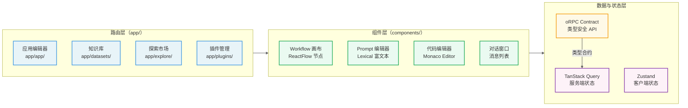

**关键目录说明：**

| 目录 | 职责 |
|------|------|
| `web/app/` | Next.js App Router 页面路由，按功能模块分组 |
| `web/service/` | API 请求封装层，对应后端各类接口 |
| `web/contract/` | oRPC 类型合约，确保前后端类型安全 |
| `web/hooks/` | 自定义 React Hooks，封装业务逻辑 |
| `web/i18n/` | 国际化文案，所有用户可见字符串必须通过此目录管理 |
| `web/components/` | 可复用 UI 组件库 |

---

### 4.2 后端控制器层（Controllers）

控制器层是纯路由层，**只负责参数解析和响应序列化**，不包含业务逻辑。

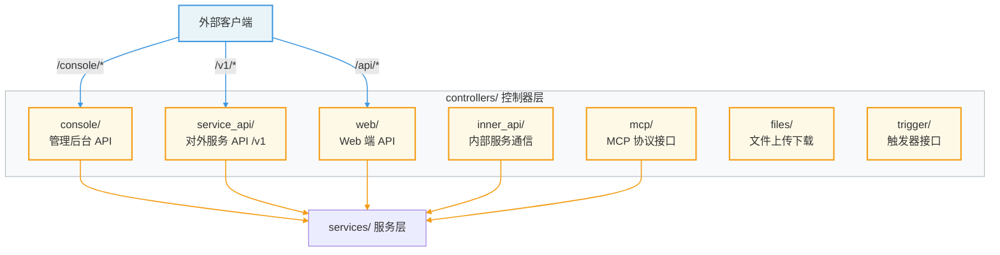

**API 路由分区：**

| 路由前缀 | 控制器目录 | 访问对象 |
|---------|-----------|---------|
| `/console/*` | `controllers/console/` | 管理员/开发者（需登录） |
| `/v1/*` | `controllers/service_api/` | 第三方应用（API Key 认证） |
| `/api/*` | `controllers/web/` | 前端 Web 用户（Session 认证） |
| `/files/*` | `controllers/files/` | 文件上传/下载 |
| `/inner/*` | `controllers/inner_api/` | 服务内部通信 |

---

### 4.3 服务层（Services）

服务层是业务协调中心，**负责编排多个领域对象和仓储完成业务用例**。

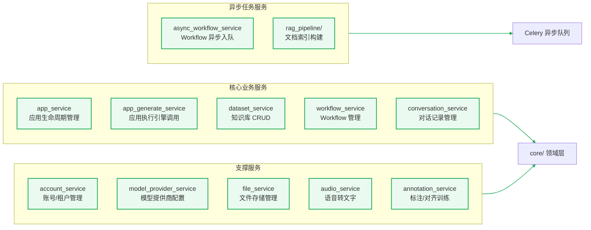

---

### 4.4 核心领域层（Core）

这是 Dify 最核心的业务逻辑实现层，包含五大子系统：

#### 4.4.1 Workflow 引擎

Dify 的可视化工作流基于 **有向无环图（DAG）** 设计，是整个平台最复杂的核心组件。

```mermaid
flowchart LR
    classDef entryStyle fill:#f9f,stroke:#333,stroke-width:2px
    classDef graphStyle fill:#ffd700,stroke:#333,stroke-width:2px
    classDef engineStyle fill:#9ff,stroke:#333,stroke-width:2px
    classDef nodeStyle fill:#9f9,stroke:#333,stroke-width:2px
    classDef eventStyle fill:#ff9,stroke:#333,stroke-width:2px
    classDef subgraphStyle fill:#f5f5f5,stroke:#666,stroke-width:1px

    Entry[workflow_entry.py<br/>执行入口]:::entryStyle

    subgraph graphDef["图定义层（graph/）"]
        G1[graph.py<br/>DAG 有向图]:::graphStyle
        G2[edge.py<br/>边/连接线]:::graphStyle
        G3[validation.py<br/>图校验]:::graphStyle
    end
    class graphDef subgraphStyle

    subgraph engineLayer["图执行引擎（graph_engine/）"]
        E1[graph_engine.py<br/>核心调度器]:::engineStyle
        E2[worker.py<br/>节点执行工作器]:::engineStyle
        E3[graph_state_manager<br/>状态管理]:::engineStyle
        E4[orchestration<br/>编排逻辑]:::engineStyle
    end
    class engineLayer subgraphStyle

    subgraph nodeTypes["节点类型（nodes/）"]
        N1[llm/<br/>LLM 调用节点]:::nodeStyle
        N2[knowledge_retrieval/<br/>知识检索节点]:::nodeStyle
        N3[if_else/<br/>条件判断节点]:::nodeStyle
        N4[code/<br/>代码执行节点]:::nodeStyle
        N5[http_request/<br/>HTTP 请求节点]:::nodeStyle
        N6[tool/<br/>工具调用节点]:::nodeStyle
        N7[agent/<br/>Agent 节点]:::nodeStyle
        N8[iteration/<br/>迭代节点]:::nodeStyle
        N9[human_input/<br/>人工介入节点]:::nodeStyle
    end
    class nodeTypes subgraphStyle

    subgraph eventSystem["事件系统"]
        EV1[graph_events/<br/>图级别事件]:::eventStyle
        EV2[node_events/<br/>节点级别事件]:::eventStyle
    end
    class eventSystem subgraphStyle

    Entry --> graphDef
    graphDef --> engineLayer
    engineLayer --> nodeTypes
    nodeTypes --> eventSystem

    linkStyle 0,1,2,3 stroke:#666,stroke-width:1.5px
```

**支持的 20+ 节点类型：**

| 节点类型 | 功能描述 |
|---------|---------|
| `start` / `end` | 流程开始/结束节点 |
| `llm` | 调用大语言模型进行推理 |
| `knowledge_retrieval` | 从知识库语义检索相关文档 |
| `if_else` | 条件分支（支持多条件组合） |
| `code` | 执行 Python/JavaScript 代码 |
| `http_request` | 调用外部 HTTP API |
| `tool` | 调用内置或自定义工具 |
| `agent` | 嵌入 Agent 推理子流程 |
| `iteration` | 对列表数据进行迭代处理 |
| `loop` | 条件循环（带次数上限） |
| `human_input` | 暂停等待人工输入或审批 |
| `question_classifier` | LLM 驱动的问题分类路由 |
| `parameter_extractor` | 从文本中结构化提取参数 |
| `variable_aggregator` | 聚合多个分支的变量 |
| `template_transform` | Jinja2 模板字符串转换 |

#### 4.4.2 App 运行时

支持四种 AI 应用形态：

| App 类型 | 适用场景 | 技术特点 |
|---------|---------|---------|
| **Chat App** | 多轮对话助手 | 维护对话历史，支持上下文记忆 |
| **Completion App** | 单轮文本生成 | 无状态，性能最优 |
| **Agent App** | 自主决策+工具调用 | ReAct/Function Calling 推理循环 |
| **Workflow App** | 复杂多步骤流程 | DAG 引擎驱动，支持并行分支 |

#### 4.4.3 RAG 知识库管道

RAG（Retrieval-Augmented Generation）是 Dify 的核心竞争力之一，实现了完整的知识库生命周期管理。

#### 4.4.4 模型运行时

通过统一的 `BaseModelProvider` 接口，实现对 100+ 模型提供商的透明适配，包括 LLM、Embedding、Rerank、STT/TTS 等多种模型类型。

#### 4.4.5 插件系统

插件系统支持动态注册工具、模型提供商、数据源和触发器，是 Dify 生态扩展的核心机制。

---

### 4.5 数据持久层（Models）

采用 SQLAlchemy ORM，所有数据模型继承 `TypeBase`，强制 `tenant_id` 多租户隔离。

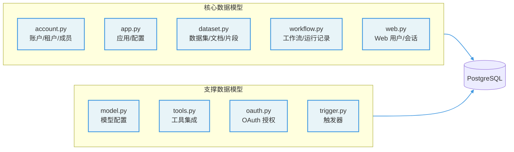

---

### 4.6 基础设施层（Infrastructure）

| 组件 | 技术选型 | 用途 |
|------|---------|------|
| **关系数据库** | PostgreSQL 15+ | 主业务数据存储，多租户隔离 |
| **缓存/消息队列** | Redis 6+ | Session 缓存、Celery 任务队列、SSE 消息中转 |
| **向量数据库** | Weaviate / PgVector / Elasticsearch / Qdrant 等 | 文档向量存储与语义检索 |
| **对象存储** | S3 / 阿里云 OSS / 本地文件系统（OpenDAL） | 文件、图片、文档存储 |
| **异步任务** | Celery 5.x | 文档索引、批量任务、定时任务 |
| **反向代理** | Nginx | SSL 终止、静态资源、负载均衡、SSRF 防护 |

---

## 5. 核心流程与工作原理

### 5.1 对话请求全链路流程

以用户发送对话消息为例，展示完整的请求链路：

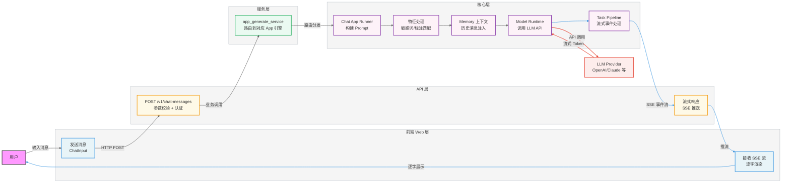

**关键技术点：**

- 使用 **SSE（Server-Sent Events）** 实现流式响应，用户看到逐字输出效果
- 通过 **Task Pipeline** 统一处理各类流式事件（token、tool_call、error 等）
- 请求过程中触发多个特征检查（敏感词过滤、标注问答匹配、上下文窗口管理）

---

### 5.2 Workflow 引擎执行流程

Workflow 是 Dify 最复杂的功能，基于 DAG 图引擎实现多节点并行/串行执行：

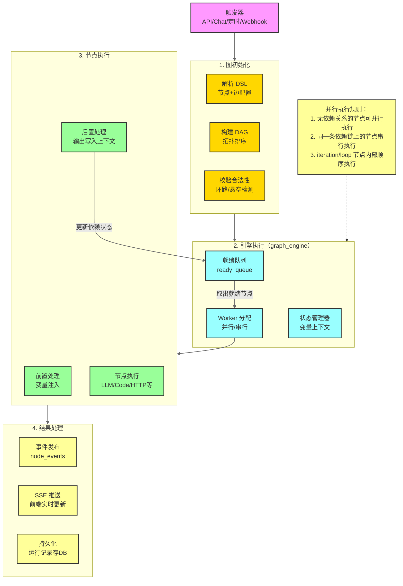

---

### 5.3 RAG 知识库检索流程

RAG 分为两个阶段：**索引构建**（离线）和 **检索推理**（在线）。

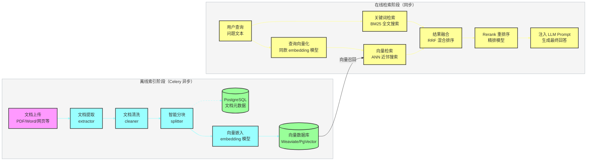

**RAG 检索模式：**

| 检索模式 | 说明 | 适用场景 |
|---------|-----|---------|
| **语义检索** | 纯向量 ANN 检索 | 语义相似、同义替换场景 |
| **关键词检索** | BM25 全文检索 | 精确词匹配、术语查询 |
| **混合检索** | 语义 + 关键词融合（RRF） | 大多数场景的最佳选择 |
| **全文检索** | 基于 PostgreSQL 全文索引 | 无向量库时的降级方案 |

---

### 5.4 模型提供商适配流程

Dify 通过 **统一接口抽象 + 插件化注册** 实现对多模型提供商的透明适配：

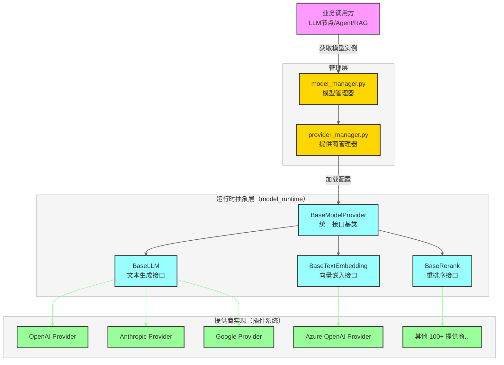

---

### 5.5 Agent 推理流程

Dify 支持两种 Agent 推理策略：

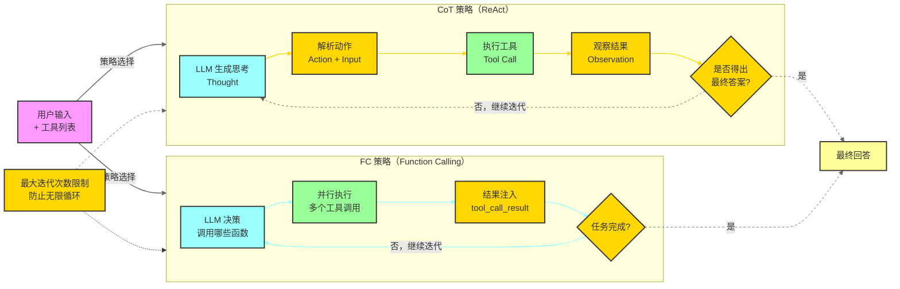

---

## 6. 技术栈与工具

### 后端技术栈

| 类别 | 技术 | 版本 | 用途 |
|-----|-----|-----|-----|
| **Web 框架** | Flask | ~3.1.2 | HTTP API 服务 |
| **API 文档** | Flask-RESTX + fastopenapi | 最新 | OpenAPI 规范生成 |
| **ORM** | SQLAlchemy | ~2.0.29 | 数据库操作 |
| **数据验证** | Pydantic | ~2.11.4 | 请求/响应模型验证 |
| **异步任务** | Celery | ~5.5.2 | 后台任务队列 |
| **LLM 适配** | LiteLLM | 1.77.1 | 统一 LLM API 调用 |
| **可观测性** | OpenTelemetry / LangFuse | 最新 | 调用链追踪 |
| **包管理** | uv | 最新 | Python 包管理 |
| **代码质量** | Ruff + Pyright | 最新 | Lint + 类型检查 |
| **测试** | Pytest | 最新 | 单元/集成测试 |
| **生产服务器** | Gunicorn + gevent | ~23.0.0 | WSGI 服务器 |

### 前端技术栈

| 类别 | 技术 | 用途 |
|-----|-----|-----|
| **框架** | Next.js（App Router）+ React | 页面路由 + UI 渲染 |
| **语言** | TypeScript（严格模式） | 类型安全开发 |
| **API 层** | oRPC | 合约优先类型安全 API |
| **服务端状态** | TanStack Query | 数据获取/缓存 |
| **客户端状态** | Zustand | 轻量级全局状态 |
| **样式** | Tailwind CSS | 原子化 CSS |
| **富文本** | Lexical | Prompt 编辑器 |
| **代码编辑** | Monaco Editor | 代码节点编辑 |
| **UI 组件** | Headless UI + Heroicons | 无障碍组件 |
| **国际化** | FormatJS | 多语言支持 |
| **测试** | Vitest + React Testing Library | 单元/组件测试 |
| **代码质量** | ESLint + tsgo | Lint + 类型检查 |

### 基础设施技术栈

| 组件 | 技术选型 | 说明 |
|-----|---------|-----|
| **容器化** | Docker + Docker Compose | 一键部署 |
| **反向代理** | Nginx | 流量入口、SSRF 防护 |
| **关系数据库** | PostgreSQL 15+ | 主存储 |
| **缓存** | Redis 6+ | 会话、队列、锁 |
| **向量数据库** | Weaviate / PgVector / Elasticsearch / Qdrant | 可插拔选择 |
| **文件存储** | OpenDAL（统一存储抽象） | 本地/S3/OSS 统一接口 |
| **数据库迁移** | Alembic | Schema 版本管理 |

---

## 7. 部署架构

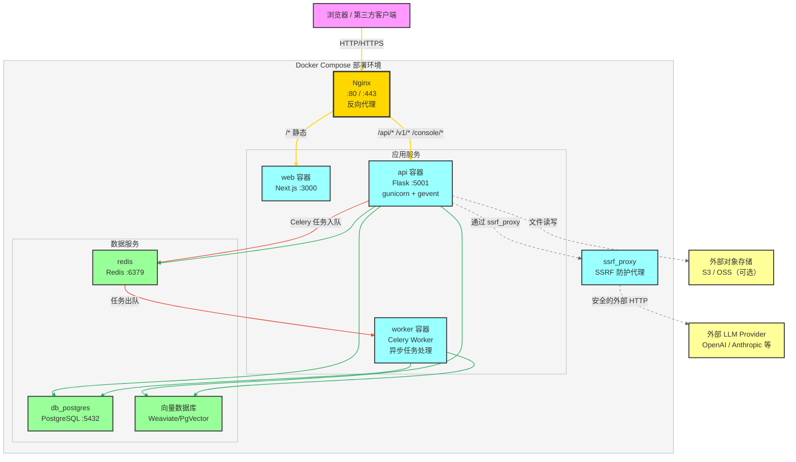

**SSRF 防护机制**：所有 Workflow 中的 HTTP 请求节点、Webhook 等对外请求，均通过 `ssrf_proxy` 容器进行代理，防止攻击者利用 Dify 作为跳板访问内网资源。

---

## 8. 面试常见问题（FAQ）

### 8.1 系统架构类

**Q1：Dify 采用了什么架构模式？为什么这样设计？**

> **A**：Dify 后端采用 **DDD（领域驱动设计）+ Clean Architecture（整洁架构）** 模式，分为 Controller（控制器）→ Service（服务）→ Core/Domain（领域）→ Models（数据模型）四层。
>
> 这样设计的原因：
> - **关注点分离**：Controller 只做路由，Service 只做业务协调，Core 只做领域逻辑，各层职责清晰
> - **可测试性**：领域层无框架依赖，可独立单元测试
> - **可扩展性**：新增模型提供商只需实现 `BaseModelProvider` 接口，无需修改上层代码（开闭原则）
> - **多租户隔离**：在数据模型层强制 `tenant_id` 过滤，从架构层面杜绝数据越权

---

**Q2：Dify 的 Workflow 引擎如何实现并行执行？**

> **A**：Workflow 引擎基于 **DAG（有向无环图）** 实现，核心逻辑在 `graph_engine.py` 中：
>
> 1. 首先对 DAG 进行**拓扑排序**，确定每个节点的前置依赖
> 2. 维护一个**就绪队列（ready_queue）**，将所有前置节点已执行完的节点加入队列
> 3. **Worker 机制**：多个 Worker 并发从就绪队列取节点执行
> 4. 节点执行完成后，检查其后继节点的依赖是否已全部满足，如满足则加入就绪队列
> 5. 通过**状态管理器（graph_state_manager）**维护全局变量上下文，各节点可读写共享变量
>
> 这样，没有数据依赖关系的节点（如并行分支）会被同时加入就绪队列，实现真正的并行执行。

---

**Q3：如何实现流式响应（Streaming）？**

> **A**：Dify 采用 **SSE（Server-Sent Events）** 实现流式响应，而非 WebSocket。原因是：
>
> - SSE 是单向推送，符合 LLM 流式输出的单向特性
> - SSE 基于 HTTP，可直接穿透大多数代理和防火墙
> - 实现更简单，客户端内置 EventSource API 支持
>
> **技术实现**：
> 1. Flask 响应设置 `Content-Type: text/event-stream`
> 2. 后端通过 **生成器（generator）** 逐步 yield SSE 事件数据
> 3. `Task Pipeline` 负责将 LLM 流式 Token 转换为标准化的 SSE 事件格式
> 4. 前端使用 `fetch` + `ReadableStream` 读取流数据并实时渲染

---

### 8.2 RAG 知识库类

**Q4：RAG 的向量检索和关键词检索如何融合？**

> **A**：Dify 支持**混合检索（Hybrid Search）**，通过 **RRF（Reciprocal Rank Fusion）** 算法融合两种结果：
>
> - **向量检索**：将查询文本转为 Embedding 向量，在向量数据库中做 ANN（近似近邻）检索，擅长处理语义相似
> - **BM25 关键词检索**：基于词频统计的全文检索，擅长精确词匹配
> - **RRF 融合**：对两个排序列表分别计算倒数排名得分（$\text{RRF}(d) = \sum \frac{1}{k + r_i(d)}$），加权求和后重新排序
>
> 融合后再通过 **Rerank 重排序模型**（如 Cohere Rerank、BGE-Reranker）进行精排，进一步提升召回质量。

---

**Q5：文档分块（Chunking）策略有哪些？各自适用场景？**

> **A**：Dify 的 `splitter` 模块支持多种分块策略：
>
> | 策略 | 原理 | 适用场景 |
> |-----|-----|---------|
> | **固定大小分块** | 按 Token 数固定切割，带重叠窗口 | 通用场景，简单高效 |
> | **递归字符分块** | 按段落 → 句子 → 词的优先级递归切割 | 结构化文档（文章、报告） |
> | **父子分块（Parent-Child）** | 小块用于检索，大块用于上下文 | 需要兼顾精确性和上下文的场景 |
> | **自定义规则** | 用户定义分隔符和大小 | 有特定格式的文档 |
>
> 选择分块策略时需权衡：**块越小**，检索精度越高但上下文信息少；**块越大**，上下文丰富但可能引入无关信息。

---

### 8.3 模型集成类

**Q6：Dify 如何实现对 100+ 模型提供商的支持？**

> **A**：Dify 通过**两层抽象**实现多模型适配：
>
> **第一层：LiteLLM 统一代理**
> - 对于大量主流模型，通过 `litellm` 库做统一调用，LiteLLM 内置了对 OpenAI、Anthropic、Google、Cohere 等主流提供商的适配
>
> **第二层：插件化提供商接口**
> - 每个提供商实现 `BaseModelProvider` 抽象基类
> - 通过 `model_provider_factory.py` 动态注册和加载提供商
> - 支持的模型类型枚举：`llm`、`text-embedding`、`rerank`、`speech2text`、`tts`、`moderation`
>
> **好处**：新增模型提供商只需编写插件，不影响核心代码，完全满足开闭原则。

---

**Q7：如何处理不同 LLM 的上下文窗口限制？**

> **A**：上下文管理是核心挑战之一，Dify 的处理策略：
>
> 1. **Token 计数**：使用 `tiktoken`（OpenAI 系）或各提供商提供的 tokenizer 精确计算 Token 数
> 2. **历史消息裁剪**：当对话历史超过上下文窗口时，按 FIFO 策略淘汰最早的消息（保留 System Prompt）
> 3. **缓冲区预留**：为模型回复预留足够的 Token 配额（max_tokens）
> 4. **Memory 模块**：支持外部记忆（如摘要记忆），将长对话压缩成摘要注入新对话

---

### 8.4 工程实践类

**Q8：Dify 如何保障多租户数据隔离？**

> **A**：Dify 的多租户隔离策略是**行级隔离**（Row-Level Security），实现在数据模型层：
>
> 1. **数据库层**：所有业务表都有 `tenant_id` 字段，所有查询必须带 `tenant_id` 过滤条件
> 2. **ORM 层**：基础模型类提供标准查询方法，内置 `tenant_id` 过滤
> 3. **请求上下文**：通过 Flask 请求上下文（`g.current_tenant_id`）传递当前租户信息
> 4. **Service 层规范**：AGENTS.md 明确规定所有数据库查询必须按 `tenant_id` 隔离，代码审查严格执行

---

**Q9：异步任务（Celery）如何与同步 API 协作？**

> **A**：Dify 使用 **Redis 作为 Celery Broker**，两种模式协作：
>
> **模式一：Fire-and-Forget（触发即忘）**
> - 文档索引构建等耗时任务，API 立即返回任务 ID，后台 Celery Worker 异步执行
> - 前端轮询任务状态接口获取进度
>
> **模式二：流式任务**
> - Workflow 异步执行时，Worker 通过 Redis Pub/Sub 发布事件，API 层订阅并转发为 SSE 流
> - 实现 Celery 异步计算 + 前端实时流式展示的结合
>
> **关键设计**：通过 `async_workflow_service` 封装入队逻辑，Worker 的结果通过共享 Redis 频道回传给 API 进程，最终推送给前端。

---

**Q10：SSRF（服务端请求伪造）攻击是如何防护的？**

> **A**：Dify 平台支持用户配置 HTTP 请求节点和 Webhook，存在 SSRF 风险。防护措施：
>
> 1. **SSRF Proxy 容器**：所有出站 HTTP 请求统一路由到 `ssrf_proxy` 容器
> 2. **IP 黑名单**：SSRF Proxy 拦截对私有 IP 段（10.x、192.168.x、172.16.x、127.x、169.254.x）的请求
> 3. **DNS 重绑定防护**：解析域名后再次检查目标 IP 是否为私有地址
> 4. **网络隔离**：Docker 网络配置确保应用容器不能直接访问宿主机内网，必须通过代理

---

**Q11：前端的 oRPC 合约优先模式有什么优势？**

> **A**：Dify 前端引入了 **oRPC（type-safe RPC）** 作为 API 类型合约层（位于 `web/contract/`），优势：
>
> 1. **端到端类型安全**：前端 API 调用参数和响应类型在编译期校验，消除运行时类型错误
> 2. **接口即文档**：Contract 文件同时作为前后端的接口协议文档
> 3. **配合 TanStack Query**：生成类型安全的 React Query Hooks，减少样板代码
> 4. **重构保障**：修改接口时 TypeScript 编译器立即报错，防止遗漏调用点

---

**Q12：如何理解 Dify 的插件系统架构？**

> **A**：Dify 的插件系统是平台扩展能力的核心，支持四类插件：
>
> | 插件类型 | 作用 | 例子 |
> |---------|-----|-----|
> | **工具插件** | 供 Agent/Workflow 调用的函数工具 | 搜索、计算、数据库查询 |
> | **模型提供商插件** | 新增 LLM/Embedding/Rerank 支持 | 自部署模型、新提供商 |
> | **数据源插件** | 接入新类型的数据源 | 企业数据库、第三方系统 |
> | **触发器插件** | 定义 Workflow 的触发方式 | 定时器、Webhook、消息队列 |
>
> 插件通过 `core/plugin/` 模块进行生命周期管理（注册、发现、执行、沙箱隔离），与核心代码解耦，支持热加载。

---

> **文档版本**：1.0.0  
> **分析基准版本**：Dify 1.13.0  
> **参考规范**：项目架构图详细版（模块关系版）
