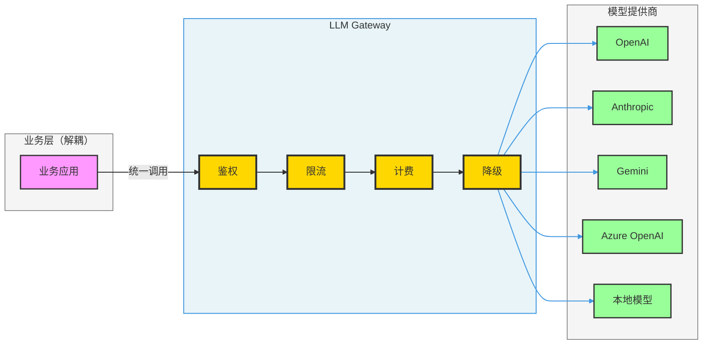
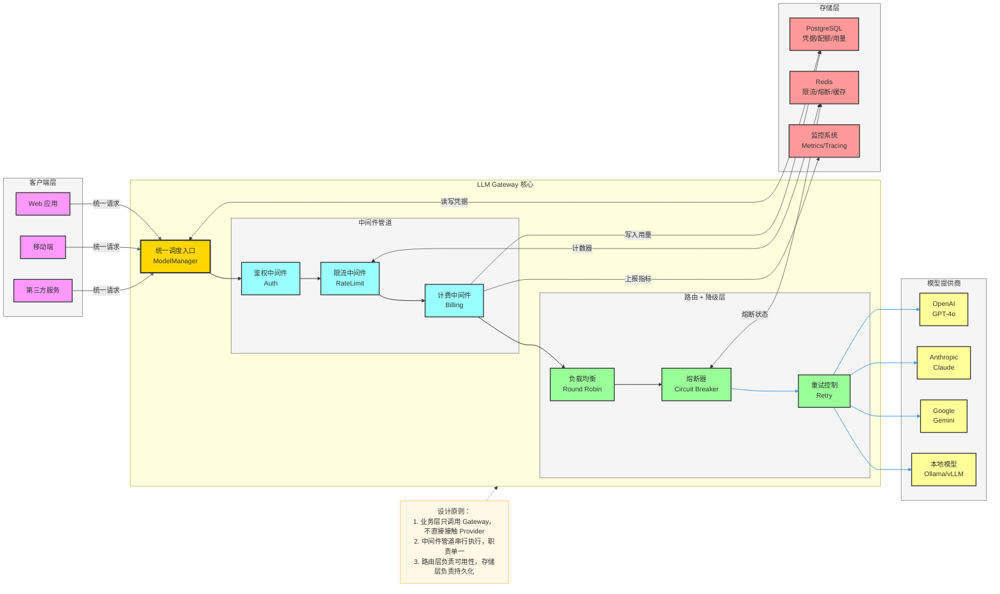
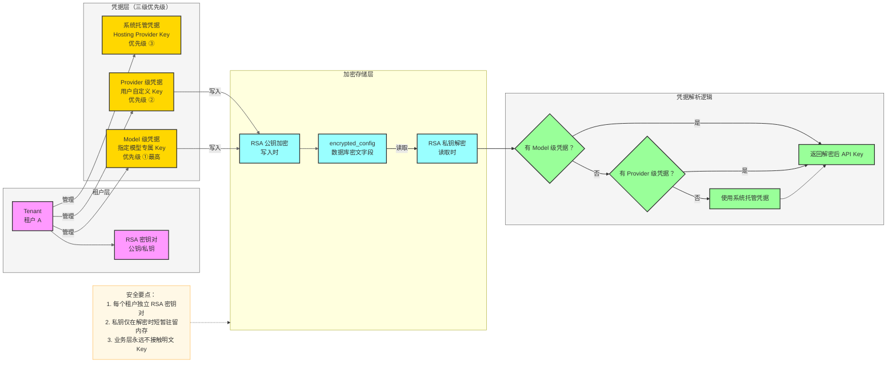
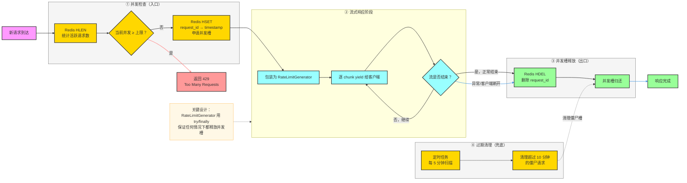
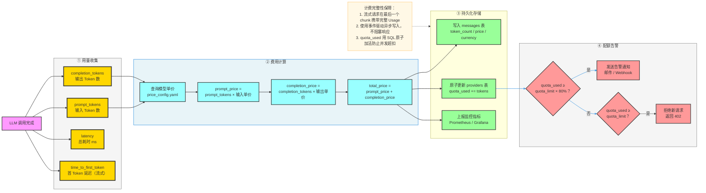
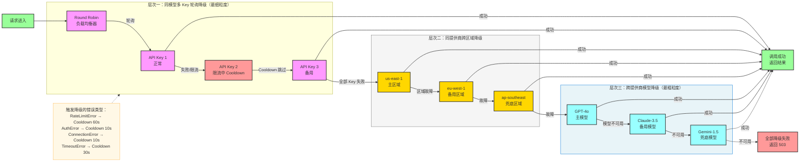
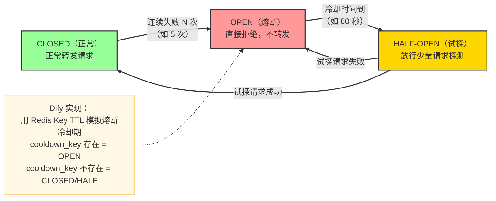

# 大模型网关（LLM Gateway）设计与实现指南

> 本文深入讲解如何从零构建一个生产级的统一大模型网关，覆盖多模型鉴权、流式限流、计费监控及降级策略四大核心能力，并结合 Dify 的真实实现加以说明。

---

## 目录

1. [什么是大模型网关](#一什么是大模型网关)
2. [整体架构设计](#二整体架构设计)
3. [多模型鉴权](#三多模型鉴权)
4. [流式限流](#四流式限流)
5. [计费监控](#五计费监控)
6. [降级策略](#六降级策略)
7. [数据库设计参考](#七数据库设计参考)
8. [面试常见问题（FAQ）](#八面试常见问题faq)

---

## 一、什么是大模型网关

### 1.1 背景与动机

随着企业接入的大模型提供商越来越多（OpenAI、Anthropic、Google Gemini、Azure、本地私有模型等），一个核心工程问题浮现：

- **业务层代码与模型 SDK 深度耦合**，每换一个模型就要改大量代码
- **API Key 分散管理**，安全风险高，难以审计
- **没有统一限流**，某个业务模块狂打 API 会拖垮整个系统的配额
- **费用黑盒**，各模型的 Token 用量和费用无法统一统计
- **没有容灾**，某个模型服务宕机或限流时业务直接报错

**大模型网关（LLM Gateway）** 的目标就是在业务层与各模型提供商之间插入一个统一的中间层，将上述问题集中解决：



### 1.2 核心价值

| 价值 | 说明 |
|------|------|
| **统一接口** | 业务层只需调用一套 API，无需关心底层是哪个模型 |
| **安全管控** | API Key 集中加密存储，业务层不接触明文密钥 |
| **成本可控** | 统一追踪 Token 用量和费用，支持配额限制 |
| **高可用** | 自动在多个模型/API Key 之间做负载均衡和容灾切换 |
| **可观测** | 所有请求的延迟、Token、费用、错误均可被监控 |

---

## 二、整体架构设计

### 2.1 分层架构总览



### 2.2 请求完整生命周期

```mermaid
flowchart LR
    classDef startStyle fill:#f9f,stroke:#333,stroke-width:2px
    classDef processStyle fill:#9ff,stroke:#333,stroke-width:2px
    classDef decisionStyle fill:#ffd700,stroke:#333,stroke-width:2px
    classDef errorStyle fill:#f99,stroke:#333,stroke-width:2px
    classDef successStyle fill:#9f9,stroke:#333,stroke-width:2px
    classDef subgraphStyle fill:#f5f5f5,stroke:#666,stroke-width:1px
    classDef coreStyle fill:#e8f4f8,stroke:#4299e1,stroke-width:1.5px

    REQ[客户端请求<br/>POST /v1/chat]:::startStyle

    subgraph authPhase["① 鉴权阶段"]
        A1[验证 JWT Token]:::processStyle
        A2{Token 有效？}:::decisionStyle
        A3[解析 tenant_id<br/>+ 用户角色]:::processStyle
    end
    class authPhase subgraphStyle

    subgraph rateLimitPhase["② 限流阶段"]
        R1[查询当前并发数<br/>Redis HLEN]:::processStyle
        R2{超过并发上限？}:::decisionStyle
        R3[申请并发槽<br/>Redis HSET]:::processStyle
    end
    class rateLimitPhase subgraphStyle

    subgraph routePhase["③ 路由阶段"]
        RT1[选择模型提供商<br/>+ API Key]:::processStyle
        RT2[解密 API Key<br/>RSA Decrypt]:::processStyle
        RT3[调用 Provider API<br/>流式/非流式]:::processStyle
    end
    class routePhase coreStyle

    subgraph billingPhase["④ 计费阶段"]
        B1[统计 Token 用量<br/>prompt + completion]:::processStyle
        B2[计算费用<br/>Token × 单价]:::processStyle
        B3[更新配额<br/>quota_used += N]:::processStyle
    end
    class billingPhase subgraphStyle

    RESP[返回响应<br/>流式 SSE / JSON]:::successStyle
    ERR401[返回 401<br/>鉴权失败]:::errorStyle
    ERR429[返回 429<br/>请求过载]:::errorStyle

    REQ --> A1 --> A2
    A2 -->|否| ERR401
    A2 -->|是| A3 --> R1 --> R2
    R2 -->|是| ERR429
    R2 -->|否| R3 --> RT1 --> RT2 --> RT3
    RT3 --> B1 --> B2 --> B3 --> RESP

    linkStyle 0,1,3,4,6,7,8,9,10,11,12 stroke:#333,stroke-width:1.5px
    linkStyle 2,5 stroke:#f99,stroke-width:2px
```



---

## 三、多模型鉴权

### 3.1 核心挑战

多模型鉴权需要解决三个问题：

1. **API Key 安全存储**：明文存储 Key 一旦数据库泄露后果严重
2. **多租户隔离**：租户 A 的 Key 不能被租户 B 使用
3. **凭据优先级**：系统托管 Key vs 用户自定义 Key，如何选择

### 3.2 凭据体系设计



### 3.3 关键实现代码

**凭据加密（写入时）：**

```python
import rsa
import base64

def encrypt_api_key(tenant_id: str, api_key: str) -> str:
    """写入时用租户公钥加密 API Key"""
    tenant = get_tenant(tenant_id)
    public_key = rsa.PublicKey.load_pkcs1(tenant.encrypt_public_key.encode())
    encrypted = rsa.encrypt(api_key.encode(), public_key)
    return base64.b64encode(encrypted).decode()

def decrypt_api_key(tenant_id: str, encrypted_key: str) -> str:
    """读取时用租户私钥解密 API Key"""
    private_key = get_tenant_private_key(tenant_id)  # 从安全存储读取
    decrypted = rsa.decrypt(base64.b64decode(encrypted_key), private_key)
    return decrypted.decode()
```

**凭据优先级解析：**

```python
def get_current_credentials(tenant_id: str, provider: str, model: str) -> dict:
    """
    凭据优先级：Model 级 > Provider 级 > 系统托管
    """
    # ① 优先查找模型级专属凭据
    model_cred = db.query(ProviderModelCredential).filter_by(
        tenant_id=tenant_id, provider_name=provider, model_name=model
    ).first()
    if model_cred:
        return decrypt_credentials(tenant_id, model_cred.encrypted_config)

    # ② 其次查找 Provider 级凭据
    provider_cred = db.query(ProviderCredential).filter_by(
        tenant_id=tenant_id, provider_name=provider
    ).first()
    if provider_cred:
        return decrypt_credentials(tenant_id, provider_cred.encrypted_config)

    # ③ 最后使用系统托管凭据（需校验 quota）
    return get_hosting_credentials(provider, model)
```

### 3.4 数据库表结构

```sql
-- 模型提供商凭据表
CREATE TABLE provider_credentials (
    id          UUID PRIMARY KEY,
    tenant_id   UUID NOT NULL,           -- 租户隔离
    provider_name VARCHAR(255) NOT NULL,
    encrypted_config TEXT NOT NULL,      -- RSA 加密后的 JSON {api_key, base_url, ...}
    created_at  TIMESTAMP DEFAULT NOW()
);

-- 模型级专属凭据表（优先级最高）
CREATE TABLE provider_model_credentials (
    id           UUID PRIMARY KEY,
    tenant_id    UUID NOT NULL,
    provider_name VARCHAR(255) NOT NULL,
    model_name   VARCHAR(255) NOT NULL,
    encrypted_config TEXT NOT NULL,
    created_at   TIMESTAMP DEFAULT NOW(),
    UNIQUE (tenant_id, provider_name, model_name)
);
```

---

## 四、流式限流

### 4.1 为什么流式请求的限流比普通限流更难

普通 HTTP 请求有明确的开始和结束，限流只需要在入口处判断并在响应后释放。**流式请求（SSE/WebSocket）** 的难点在于：

- 请求在发起后会长时间占用连接（几秒到几分钟）
- 如果只在入口限流，不在流结束时释放，会导致**并发槽永久泄漏**
- 如果出现异常，必须确保并发槽被正确释放

### 4.2 流式限流设计



### 4.3 关键实现代码

**Redis 并发槽管理：**

```python
import redis
import time
import uuid

class RateLimit:
    """基于 Redis Hash 的并发限流器"""
    
    # Redis Key 模板
    _ACTIVE_REQUESTS_KEY = "gateway:rate_limit:{client_id}:active"
    _MAX_REQUESTS_KEY    = "gateway:rate_limit:{client_id}:max"
    _REQUEST_TTL         = 10 * 60   # 10分钟：僵尸请求清理阈值
    _FLUSH_INTERVAL      = 5 * 60    # 5分钟：定期重算活跃请求数

    def __init__(self, client_id: str, redis_client: redis.Redis):
        self.client_id = client_id
        self.redis = redis_client
        self._active_key = self._ACTIVE_REQUESTS_KEY.format(client_id=client_id)
        self._max_key    = self._MAX_REQUESTS_KEY.format(client_id=client_id)

    def enter(self, request_id: str | None = None) -> str:
        """申请并发槽，超限时抛出异常"""
        max_requests = int(self.redis.get(self._max_key) or 0)
        
        if max_requests > 0:
            # 清理过期的僵尸请求
            self._flush_expired_requests()
            current = self.redis.hlen(self._active_key)
            if current >= max_requests:
                raise RateLimitExceededError(
                    f"并发请求超限：当前 {current}/{max_requests}"
                )
        
        request_id = request_id or str(uuid.uuid4())
        # 记录请求开始时间（用于僵尸清理）
        self.redis.hset(self._active_key, request_id, str(time.time()))
        return request_id

    def exit(self, request_id: str):
        """释放并发槽"""
        self.redis.hdel(self._active_key, request_id)

    def _flush_expired_requests(self):
        """清理超时的僵尸请求（兜底保障）"""
        now = time.time()
        all_requests = self.redis.hgetall(self._active_key)
        expired = [
            rid for rid, ts in all_requests.items()
            if now - float(ts) > self._REQUEST_TTL
        ]
        if expired:
            self.redis.hdel(self._active_key, *expired)
```

**流式生成器包装（核心：用 try/finally 保证释放）：**

```python
from typing import Generator, TypeVar
T = TypeVar("T")

class RateLimitGenerator:
    """
    包装流式 Generator，确保流结束或异常时都能释放并发槽。
    这是流式限流最关键的设计，防止并发槽泄漏。
    """
    
    def __init__(
        self,
        generator: Generator[T, None, None],
        rate_limit: RateLimit,
        request_id: str,
    ):
        self._generator = generator
        self._rate_limit = rate_limit
        self._request_id = request_id

    def __iter__(self):
        try:
            yield from self._generator
        finally:
            # 无论正常结束、异常、还是客户端断开，都释放并发槽
            self._rate_limit.exit(self._request_id)

    def __next__(self):
        return next(self._generator)
```

**在 Gateway 入口处集成：**

```python
def invoke_llm_with_rate_limit(
    client_id: str,
    request: LLMRequest,
    stream: bool = True,
) -> Generator | LLMResult:
    rate_limit = RateLimit(client_id, redis_client)
    request_id = rate_limit.enter()  # 申请并发槽，超限则抛出异常
    
    try:
        result = llm_provider.invoke(request, stream=stream)
        
        if stream:
            # 流式：用 RateLimitGenerator 包装，自动在流结束时释放槽
            return RateLimitGenerator(result, rate_limit, request_id)
        else:
            # 非流式：同步完成后立即释放
            rate_limit.exit(request_id)
            return result
    except Exception:
        rate_limit.exit(request_id)  # 调用前异常也要释放
        raise
```

### 4.4 多维度限流策略

| 维度 | 限制指标 | 实现方式 | 说明 |
|------|---------|---------|------|
| **并发限流** | 同时活跃请求数 | Redis Hash 计数 | 防止瞬时流量过载 |
| **QPM 限流** | 每分钟请求次数 | Redis 滑动窗口 | 防止高频调用 |
| **TPM 限流** | 每分钟 Token 用量 | Redis 计数器 + TTL | 控制模型费用 |
| **配额限流** | 总 Token/次数上限 | PostgreSQL quota 字段 | 租户级别费用管控 |

---

## 五、计费监控

### 5.1 Token 用量追踪数据模型



### 5.2 Token 用量数据结构

```python
from decimal import Decimal
from dataclasses import dataclass

@dataclass
class LLMUsage:
    """LLM 调用完整用量记录"""
    # Token 用量
    prompt_tokens: int          # 输入 Token 数
    completion_tokens: int      # 输出 Token 数
    total_tokens: int           # 总 Token 数

    # 费用（以模型计价货币为单位）
    prompt_unit_price: Decimal  # 输入单价（$/1K Token）
    prompt_price: Decimal       # 输入费用
    completion_unit_price: Decimal
    completion_price: Decimal
    total_price: Decimal        # 总费用
    currency: str               # 货币（USD / CNY）

    # 性能指标
    latency: float              # 总耗时（秒）
    time_to_first_token: float | None  # 首 Token 延迟，仅流式有值
    time_to_generate: float | None     # 纯生成耗时

    @classmethod
    def empty(cls) -> "LLMUsage":
        """无用量数据时的零值（避免 None 判断）"""
        return cls(
            prompt_tokens=0, completion_tokens=0, total_tokens=0,
            prompt_unit_price=Decimal("0"), prompt_price=Decimal("0"),
            completion_unit_price=Decimal("0"), completion_price=Decimal("0"),
            total_price=Decimal("0"), currency="USD",
            latency=0.0, time_to_first_token=None, time_to_generate=None,
        )
```

### 5.3 费用计算实现

```python
def calc_response_usage(
    model: str,
    credentials: dict,
    prompt_tokens: int,
    completion_tokens: int,
    latency: float,
) -> LLMUsage:
    """根据 Token 数量计算费用"""
    # 从配置文件读取模型单价
    price_config = get_model_price_config(model, credentials)

    prompt_price = (
        Decimal(str(prompt_tokens)) / 1000
        * price_config.input_price_per_1k
    ).quantize(Decimal("0.0000001"))

    completion_price = (
        Decimal(str(completion_tokens)) / 1000
        * price_config.output_price_per_1k
    ).quantize(Decimal("0.0000001"))

    return LLMUsage(
        prompt_tokens=prompt_tokens,
        completion_tokens=completion_tokens,
        total_tokens=prompt_tokens + completion_tokens,
        prompt_unit_price=price_config.input_price_per_1k,
        prompt_price=prompt_price,
        completion_unit_price=price_config.output_price_per_1k,
        completion_price=completion_price,
        total_price=prompt_price + completion_price,
        currency=price_config.currency,
        latency=latency,
        time_to_first_token=None,
        time_to_generate=None,
    )
```

### 5.4 配额原子扣减（防止并发超扣）

```python
def deduct_quota(tenant_id: str, provider: str, tokens_used: int) -> bool:
    """
    原子性扣减配额，防止并发条件下超扣。
    使用 UPDATE ... WHERE quota_used + tokens_used <= quota_limit
    让数据库保证原子性，而不是先读后写。
    """
    result = db.execute(
        """
        UPDATE providers
        SET quota_used = quota_used + :tokens
        WHERE tenant_id = :tenant_id
          AND provider_name = :provider
          AND (quota_limit = -1 OR quota_used + :tokens <= quota_limit)
        """,
        {"tokens": tokens_used, "tenant_id": tenant_id, "provider": provider},
    )
    if result.rowcount == 0:
        raise QuotaExceededError("配额已耗尽，无法继续调用")
    return True
```

---

## 六、降级策略

### 6.1 降级层次设计

LLM Gateway 的降级分为三个层次，从细到粗依次触发：



### 6.2 熔断器（Circuit Breaker）实现



### 6.3 完整降级实现

```python
import redis
from typing import Generator

class LoadBalancingManager:
    """多 API Key 负载均衡 + 降级管理器"""

    COOLDOWN_KEY = "gateway:lb:cooldown:{provider}:{key_id}"
    ROUND_ROBIN_KEY = "gateway:lb:index:{provider}"

    def __init__(self, provider: str, api_keys: list[dict], redis: redis.Redis):
        self.provider = provider
        self.api_keys = api_keys
        self.redis = redis

    def fetch_next_available(self) -> dict | None:
        """Round Robin 选择下一个可用 Key，跳过 Cooldown 中的 Key"""
        total = len(self.api_keys)
        cooldown_count = 0

        for _ in range(total):
            # 原子递增，实现全局 Round Robin
            index = self.redis.incr(self.ROUND_ROBIN_KEY) % total
            key_config = self.api_keys[index]

            if not self._in_cooldown(key_config["id"]):
                return key_config

            cooldown_count += 1

        # 全部 Key 都在 Cooldown 中
        return None

    def cooldown(self, key_id: str, expire_seconds: int = 60):
        """将指定 Key 放入 Cooldown（熔断）"""
        cooldown_key = self.COOLDOWN_KEY.format(
            provider=self.provider, key_id=key_id
        )
        self.redis.setex(cooldown_key, expire_seconds, "1")

    def _in_cooldown(self, key_id: str) -> bool:
        cooldown_key = self.COOLDOWN_KEY.format(
            provider=self.provider, key_id=key_id
        )
        return self.redis.exists(cooldown_key) > 0


def invoke_with_fallback(
    lb_manager: LoadBalancingManager,
    request: LLMRequest,
) -> LLMResult:
    """带自动降级的 LLM 调用"""
    last_exception = None

    while True:
        key_config = lb_manager.fetch_next_available()

        if key_config is None:
            # 所有 Key 都熔断了，抛出最后一个异常
            raise last_exception or AllKeysExhaustedError("所有 API Key 均不可用")

        try:
            return call_provider(key_config, request)

        except InvokeRateLimitError as e:
            # 限流：较长冷却
            lb_manager.cooldown(key_config["id"], expire_seconds=60)
            last_exception = e

        except InvokeAuthorizationError as e:
            # 鉴权失败：短暂冷却（可能是临时问题）
            lb_manager.cooldown(key_config["id"], expire_seconds=10)
            last_exception = e

        except InvokeConnectionError as e:
            # 连接失败：短暂冷却
            lb_manager.cooldown(key_config["id"], expire_seconds=10)
            last_exception = e

        except InvokeTimeoutError as e:
            # 超时：中等冷却
            lb_manager.cooldown(key_config["id"], expire_seconds=30)
            last_exception = e

        except Exception:
            # 未知错误：不降级，直接抛出
            raise
```

### 6.4 错误分级与冷却时长建议

| 错误类型 | 错误含义 | Cooldown 时长 | 原因 |
|---------|---------|-------------|------|
| `RateLimitError (429)` | API Key 被限流 | 60 秒 | 等待提供商限流窗口重置 |
| `AuthorizationError (401/403)` | Key 无效或权限不足 | 10 秒 | 可能是临时问题，快速重试 |
| `ConnectionError` | 网络连接失败 | 10 秒 | 网络可能短暂抖动 |
| `TimeoutError` | 请求超时 | 30 秒 | 服务可能过载 |
| `ServerError (500/503)` | 提供商服务故障 | 120 秒 | 等待服务恢复 |
| `InvalidRequestError (400)` | 请求参数错误 | 不冷却 | 是客户端问题，不应熔断 |

---

## 七、数据库设计参考

```sql
-- ① 提供商配置表
CREATE TABLE providers (
    id            UUID PRIMARY KEY DEFAULT gen_random_uuid(),
    tenant_id     UUID NOT NULL,
    provider_name VARCHAR(255) NOT NULL,
    -- 凭据类型：system（系统托管）/ custom（用户自定义）
    provider_type VARCHAR(40) NOT NULL DEFAULT 'custom',
    -- 配额管理
    quota_type    VARCHAR(40),           -- trial / paid / free
    quota_limit   BIGINT DEFAULT -1,     -- -1 表示无限制
    quota_used    BIGINT DEFAULT 0,
    -- 状态
    is_valid      BOOLEAN DEFAULT TRUE,
    last_used     TIMESTAMP,
    created_at    TIMESTAMP DEFAULT NOW(),
    UNIQUE (tenant_id, provider_name, provider_type)
);

-- ② 凭据存储表（加密）
CREATE TABLE provider_credentials (
    id               UUID PRIMARY KEY DEFAULT gen_random_uuid(),
    tenant_id        UUID NOT NULL,
    provider_name    VARCHAR(255) NOT NULL,
    encrypted_config TEXT NOT NULL,   -- RSA 加密的 JSON
    created_at       TIMESTAMP DEFAULT NOW()
);

-- ③ 负载均衡 Key 池（同一 Provider 多 Key）
CREATE TABLE load_balancing_configs (
    id               UUID PRIMARY KEY DEFAULT gen_random_uuid(),
    tenant_id        UUID NOT NULL,
    provider_name    VARCHAR(255) NOT NULL,
    model_name       VARCHAR(255) NOT NULL,
    encrypted_config TEXT NOT NULL,   -- 每个 Key 独立加密存储
    enabled          BOOLEAN DEFAULT TRUE,
    created_at       TIMESTAMP DEFAULT NOW()
);

-- ④ Token 用量记录表（按消息粒度）
CREATE TABLE message_token_usages (
    id                UUID PRIMARY KEY DEFAULT gen_random_uuid(),
    tenant_id         UUID NOT NULL,
    app_id            UUID NOT NULL,
    message_id        UUID NOT NULL,
    provider_name     VARCHAR(255),
    model_name        VARCHAR(255),
    prompt_tokens     INTEGER DEFAULT 0,
    completion_tokens INTEGER DEFAULT 0,
    total_tokens      INTEGER DEFAULT 0,
    total_price       DECIMAL(10, 7) DEFAULT 0,
    currency          VARCHAR(10) DEFAULT 'USD',
    latency           FLOAT,
    created_at        TIMESTAMP DEFAULT NOW()
);

-- 索引优化（按租户统计费用的高频查询）
CREATE INDEX idx_token_usage_tenant_created
    ON message_token_usages (tenant_id, created_at);
CREATE INDEX idx_provider_quota
    ON providers (tenant_id, provider_name);
```

---

## 八、面试常见问题（FAQ）

### Q1：LLM Gateway 和传统 API Gateway 有什么区别？

**A：** 传统 API Gateway（如 Kong、APISIX）主要处理 HTTP 协议层面的路由、鉴权、限流，对内容是无感知的。LLM Gateway 需要额外处理：

- **Token 计量**：需要理解 LLM 的输入/输出 Token 概念，按 Token 计费而非按请求次数
- **流式感知**：SSE 流式响应需要特殊的限流释放机制（否则并发槽泄漏）
- **模型语义路由**：根据任务类型（分类/生成/嵌入）路由到不同模型类型
- **上下文管理**：多轮对话需要传递历史上下文，普通 Gateway 无需关心请求体语义

---

### Q2：流式请求（SSE）的并发槽为什么容易泄漏？如何防止？

**A：** 流式请求的并发槽泄漏有三种场景：

1. **客户端断开连接**：SSE 连接中途断开，服务端的 Generator 还在运行
2. **服务端抛出异常**：中途出现错误，控制流跳出，槽没被释放
3. **超长流式响应**：响应耗时过长导致系统认为请求"消失"

防止方案：
```python
# 方案一（推荐）：用 try/finally 包装 Generator
class RateLimitGenerator:
    def __iter__(self):
        try:
            yield from self._generator
        finally:
            self._rate_limit.exit(self._request_id)  # 必然执行

# 方案二：定时清理僵尸槽
# Redis Hash 中存储 request_id → timestamp
# 定时任务扫描超过 10 分钟的记录并删除
```

---

### Q3：如何设计多层降级策略，优先级如何排序？

**A：** 推荐三层降级，优先级从高到低：

```
层次一（最优先）：同模型多 API Key 轮询
  → 触发条件：单个 Key 被限流/鉴权失败
  → 成本：零，对用户无感知

层次二：同提供商跨区域切换
  → 触发条件：某个区域/端点不可用
  → 成本：可能有轻微延迟增加

层次三：跨提供商模型切换（需业务配置）
  → 触发条件：整个提供商服务不可用
  → 成本：可能有模型能力差异，需业务评估
```

**关键原则**：降级策略需要业务方配置允许，不能由 Gateway 自动决定跨模型切换，因为不同模型的输出格式、能力可能不同。

---

### Q4：配额扣减如何避免并发超扣（Race Condition）？

**A：** 常见的错误做法是"先读后写"：

```python
# ❌ 错误：有 Race Condition
current = db.query("SELECT quota_used FROM providers WHERE id=?")
if current + tokens <= quota_limit:
    db.execute("UPDATE providers SET quota_used = quota_used + ? WHERE id=?")
```

两个并发请求同时读到 `quota_used = 900`，配额上限是 `1000`，都通过检查，结果 `quota_used` 变成 `1100`，超扣了 100。

正确做法——用数据库原子操作：

```python
# ✅ 正确：原子操作，数据库层保证
result = db.execute("""
    UPDATE providers
    SET quota_used = quota_used + :tokens
    WHERE id = :id
      AND (quota_limit = -1 OR quota_used + :tokens <= quota_limit)
""", {"tokens": tokens, "id": provider_id})

if result.rowcount == 0:
    raise QuotaExceededError("配额已耗尽")
```

`WHERE` 条件中的检查和 `UPDATE` 操作在同一个 SQL 语句中原子完成，不存在 Race Condition。

---

### Q5：Redis 在 LLM Gateway 中承担哪些角色？

**A：** Redis 在 LLM Gateway 中是不可缺少的基础设施，承担多个角色：

| 角色 | Redis 数据结构 | Key 示例 |
|------|--------------|---------|
| **并发限流** | Hash（request_id → timestamp）| `gateway:ratelimit:{client_id}:active` |
| **熔断状态** | String + TTL | `gateway:lb:cooldown:{provider}:{key_id}` |
| **Round Robin 计数** | String（INCR）| `gateway:lb:index:{provider}` |
| **凭据缓存** | String（JSON）| `gateway:cred:{tenant_id}:{provider}` |
| **QPM 限流窗口** | String + TTL | `gateway:qpm:{client_id}:{minute}` |

关键考虑：Redis 宕机时 Gateway 需要有 Fallback 策略（如允许所有请求通过），避免 Redis 成为单点故障。

---

### Q6：如何追踪流式响应的 Token 用量？

**A：** 流式响应的 Token 用量追踪有两种方案：

**方案一：依赖 Provider 的最后一个 Chunk（推荐）**

大多数 Provider（OpenAI/Anthropic 等）会在流式响应的最后一个 Chunk 携带完整的 `usage` 字段：

```python
for chunk in stream:
    yield chunk.delta.content
    if chunk.usage:  # 最后一个 chunk 有 usage
        record_usage(chunk.usage.prompt_tokens, chunk.usage.completion_tokens)
```

**方案二：本地 Token 计数（不依赖 Provider）**

使用 `tiktoken`（OpenAI）或对应模型的 Tokenizer 在本地计算：

```python
import tiktoken
enc = tiktoken.encoding_for_model("gpt-4o")

# 流式过程中累积 completion
completion_text = ""
for chunk in stream:
    completion_text += chunk.delta.content or ""
    yield chunk.delta.content

# 流结束后计算
completion_tokens = len(enc.encode(completion_text))
```

推荐方案一，精确且零计算开销；方案二作为 Provider 不返回 usage 时的兜底。

---

### Q7：如何监控 LLM Gateway 的健康状态？

**A：** 建议从以下四个维度建立监控：

```
① 可用性指标
   - 各 Provider 的成功率（success_rate）
   - 各 Provider 的熔断状态（circuit_breaker_state）
   - P99 响应延迟（latency_p99）

② 流量指标
   - QPS / 并发请求数
   - 各租户的 Token 用量（token_usage_by_tenant）
   - 触发限流的请求比例（rate_limit_ratio）

③ 成本指标
   - 每日/月 Token 消耗趋势
   - 各模型的费用占比（cost_by_model）
   - 配额剩余量告警（quota_remaining_alert）

④ 错误指标
   - 各类错误的分布（error_type_distribution）
   - 降级触发次数（fallback_count）
   - 连续失败告警（consecutive_failure_alert）
```

推荐使用 Prometheus + Grafana 实现，在每次 LLM 调用的 callback 中上报指标，不影响主链路性能。

---

*文档版本：v1.0 | 最后更新：2026-03*
