# Dify 二次开发完全指南

> **版本**：Dify 1.13.0  
> **文档类型**：二次开发实战指南  
> **适用场景**：私有化部署、架构扩展、插件开发、MCP 集成、工作流优化、面试准备

---

## 目录

1. [二次开发概述](#1-二次开发概述)
2. [私有化部署实战](#2-私有化部署实战)
   - 2.1 [Docker Compose 快速部署](#21-docker-compose-快速部署)
   - 2.2 [生产级高可用部署](#22-生产级高可用部署)
   - 2.3 [关键配置项详解](#23-关键配置项详解)
   - 2.4 [数据持久化与备份策略](#24-数据持久化与备份策略)
3. [架构扩展与源码级二次开发](#3-架构扩展与源码级二次开发)
   - 3.1 [后端 DDD 架构层次解析](#31-后端-ddd-架构层次解析)
   - 3.2 [新增模型提供商](#32-新增模型提供商)
   - 3.3 [自定义 API 控制器与路由](#33-自定义-api-控制器与路由)
   - 3.4 [前端源码扩展](#34-前端源码扩展)
4. [编写高性能自定义插件](#4-编写高性能自定义插件)
   - 4.1 [插件系统架构](#41-插件系统架构)
   - 4.2 [插件开发环境搭建](#42-插件开发环境搭建)
   - 4.3 [Tool 类型插件开发](#43-tool-类型插件开发)
   - 4.4 [Model 类型插件开发](#44-model-类型插件开发)
   - 4.5 [插件高性能优化策略](#45-插件高性能优化策略)
5. [集成 MCP 服务](#5-集成-mcp-服务)
   - 5.1 [MCP 协议概述](#51-mcp-协议概述)
   - 5.2 [Dify MCP 架构](#52-dify-mcp-架构)
   - 5.3 [接入外部 MCP Server](#53-接入外部-mcp-server)
   - 5.4 [自建 MCP Server](#54-自建-mcp-server)
   - 5.5 [MCP 认证与安全](#55-mcp-认证与安全)
6. [工作流引擎优化](#6-工作流引擎优化)
   - 6.1 [工作流引擎内核解析](#61-工作流引擎内核解析)
   - 6.2 [新增自定义工作流节点](#62-新增自定义工作流节点)
   - 6.3 [工作流性能调优](#63-工作流性能调优)
   - 6.4 [业务场景定制化实践](#64-业务场景定制化实践)
7. [常见问题与解决方案](#7-常见问题与解决方案)
8. [面试常见问题（FAQ）](#8-面试常见问题faq)

---

## 1. 二次开发概述

Dify 作为开源的 LLM 应用开发平台，提供了完整的二次开发能力。二次开发的核心价值在于：

| 场景 | 典型需求 | 对应章节 |
|------|---------|---------|
| **私有化部署** | 数据不出域、合规审计、断网使用 | §2 |
| **模型扩展** | 接入私有大模型、国产模型、本地模型 | §3.2 |
| **业务集成** | 自定义 API、SSO 对接、企业数据接入 | §3.3 |
| **插件开发** | 封装内部服务为工具、自定义模型提供商 | §4 |
| **协议集成** | 接入 MCP 生态工具链、Claude Desktop 联动 | §5 |
| **流程定制** | 行业特定节点、循环优化、并发控制 | §6 |

### 二次开发技术路线选择

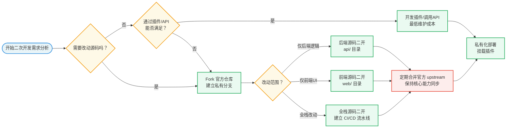

---

## 2. 私有化部署实战

### 2.1 Docker Compose 快速部署

Dify 官方提供了完整的 Docker Compose 编排文件，支持一键启动完整服务栈。

#### 部署架构概览

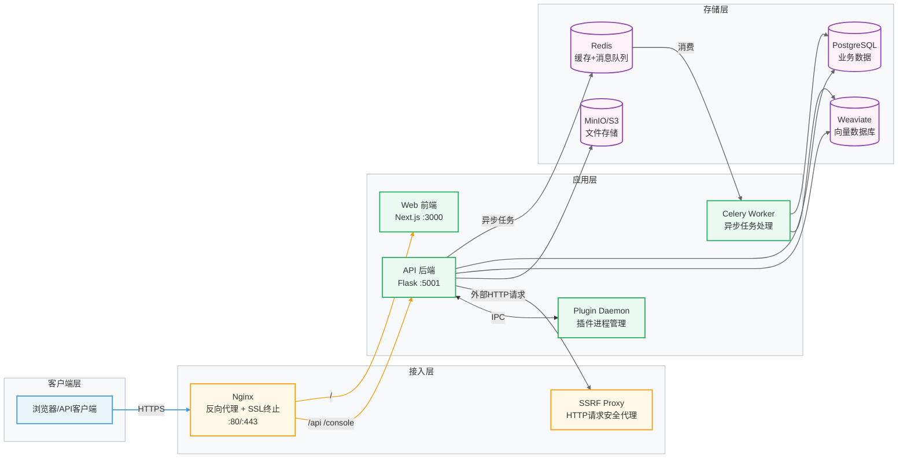

#### 快速启动步骤

```bash
# 1. 克隆仓库
git clone https://github.com/langgenius/dify.git
cd dify/docker

# 2. 复制环境变量配置
cp .env.example .env

# 3. 编辑关键配置（SECRET_KEY 必须修改！）
vim .env

# 4. 启动所有服务
docker compose up -d

# 5. 查看服务状态
docker compose ps

# 6. 初始化数据库（首次部署）
docker compose exec api flask db upgrade
```

#### `.env` 关键配置说明

```bash
# 安全密钥（生产环境必须修改为随机字符串）
SECRET_KEY=your-super-secret-key-change-this

# 数据库连接
DB_USERNAME=postgres
DB_PASSWORD=difyai123456
DB_HOST=db
DB_PORT=5432
DB_DATABASE=dify

# Redis 配置
REDIS_HOST=redis
REDIS_PASSWORD=difyai123456

# 向量数据库选择：weaviate/qdrant/pgvector/elasticsearch
VECTOR_STORE=weaviate

# 文件存储：local/s3/azure-blob/google-storage
STORAGE_TYPE=local
STORAGE_LOCAL_PATH=storage

# LLM 代理（企业网络需要代理时配置）
HTTP_PROXY=http://your-proxy:7890
HTTPS_PROXY=http://your-proxy:7890
```

### 2.2 生产级高可用部署

生产环境需要针对单点故障和性能瓶颈进行强化：

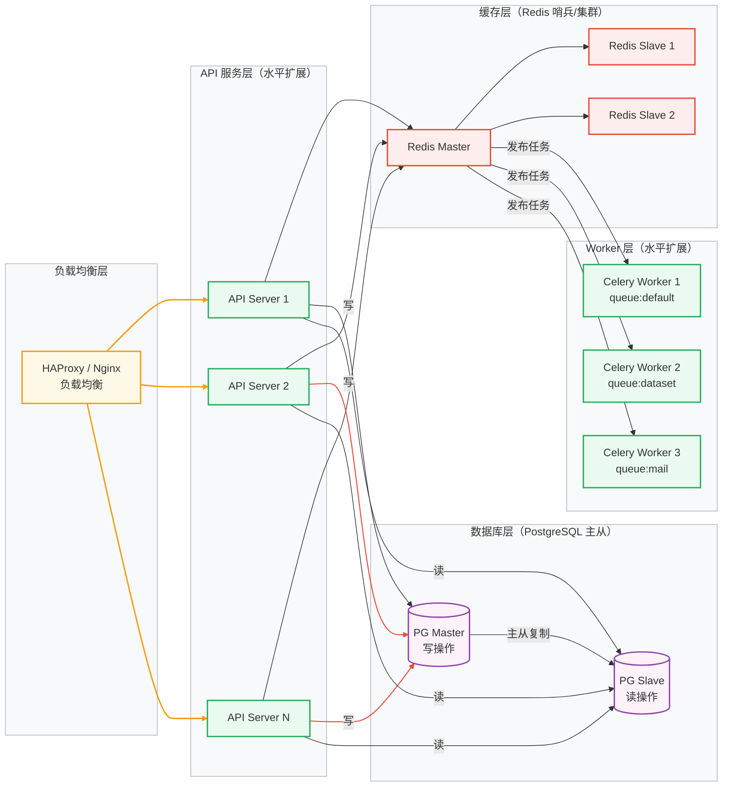

#### Celery Worker 队列分离配置

Dify 支持按业务优先级将任务分配到不同队列，避免耗时任务阻塞实时请求：

```bash
# 默认通用队列（高优先级）
celery -A app.celery worker -Q dataset,generation,mail,ops_trace,app_deletion \
  --loglevel=info --concurrency=4

# 数据集处理专用队列（可单独扩容）
celery -A app.celery worker -Q dataset \
  --loglevel=info --concurrency=8 -n dataset_worker@%h

# 邮件通知队列
celery -A app.celery worker -Q mail \
  --loglevel=info --concurrency=2 -n mail_worker@%h
```

### 2.3 关键配置项详解

#### 向量数据库切换

Dify 支持多种向量数据库，按场景选择：

| 向量数据库 | 适用场景 | 配置值 |
|-----------|---------|-------|
| Weaviate | 默认推荐，功能完善 | `weaviate` |
| pgvector | 已有 PostgreSQL，简化部署 | `pgvector` |
| Qdrant | 高性能、生产推荐 | `qdrant` |
| Elasticsearch | 已有 ES 集群，混合检索 | `elasticsearch` |
| Milvus | 超大规模向量检索 | `milvus` |

```bash
# pgvector 配置示例（与业务库分离，独立实例）
VECTOR_STORE=pgvector
PGVECTOR_HOST=pgvector-host
PGVECTOR_PORT=5432
PGVECTOR_USER=dify
PGVECTOR_PASSWORD=password
PGVECTOR_DATABASE=dify_vectors
```

### 2.4 数据持久化与备份策略

```bash
# PostgreSQL 全量备份
docker exec dify-db-1 pg_dump -U postgres dify | gzip > dify_backup_$(date +%Y%m%d).sql.gz

# 增量备份脚本（WAL 归档）
# 在 postgresql.conf 中启用：
# wal_level = replica
# archive_mode = on
# archive_command = 'cp %p /backup/wal/%f'

# 向量数据库备份（以 Weaviate 为例）
curl -X POST http://weaviate:8080/v1/backups/filesystem \
  -H 'Content-Type: application/json' \
  -d '{"id": "backup-daily", "include": ["DifyDocument"]}'

# 文件存储同步（MinIO → S3）
mc mirror minio/dify-storage s3/your-bucket --watch
```

---

## 3. 架构扩展与源码级二次开发

### 3.1 后端 DDD 架构层次解析

Dify 后端严格遵循领域驱动设计（DDD）和整洁架构，各层职责明确：

```mermaid
flowchart LR
    classDef controllerStyle fill:#e8f4f8,stroke:#4299e1,stroke-width:2px
    classDef serviceStyle fill:#eafaf1,stroke:#27ae60,stroke-width:2px
    classDef coreStyle fill:#fdf2f8,stroke:#8e44ad,stroke-width:2px
    classDef modelStyle fill:#fef9e7,stroke:#f39c12,stroke-width:2px
    classDef infraStyle fill:#fdedec,stroke:#e74c3c,stroke-width:2px
    classDef subgraphStyle fill:#f8f9fa,stroke:#adb5bd,stroke-width:1px
    classDef ruleStyle fill:#fff8e6,stroke:#ffb74d,stroke-width:1px

    subgraph controllerLayer["控制器层 controllers/"]
        C1[Console API<br/>管理后台]:::controllerStyle
        C2[Service API<br/>对外接口 v1]:::controllerStyle
        C3[Web API<br/>Web端]:::controllerStyle
        C4[MCP API<br/>MCP协议]:::controllerStyle
    end
    class controllerLayer subgraphStyle

    subgraph serviceLayer["服务层 services/"]
        S1[AppService<br/>应用管理]:::serviceStyle
        S2[DatasetService<br/>知识库服务]:::serviceStyle
        S3[WorkflowService<br/>工作流服务]:::serviceStyle
        S4[ModelService<br/>模型服务]:::serviceStyle
    end
    class serviceLayer subgraphStyle

    subgraph coreLayer["核心领域层 core/"]
        D1[workflow/<br/>工作流引擎]:::coreStyle
        D2[model_runtime/<br/>模型运行时]:::coreStyle
        D3[rag/<br/>RAG管道]:::coreStyle
        D4[plugin/<br/>插件系统]:::coreStyle
        D5[agent/<br/>Agent推理]:::coreStyle
    end
    class coreLayer subgraphStyle

    subgraph modelLayer["数据层 models/"]
        M1[ORM 模型<br/>SQLAlchemy]:::modelStyle
        M2[Repository<br/>数据仓库]:::modelStyle
    end
    class modelLayer subgraphStyle

    subgraph infraLayer["基础设施层 extensions/"]
        I1[PostgreSQL]:::infraStyle
        I2[Redis]:::infraStyle
        I3[向量数据库]:::infraStyle
        I4[对象存储]:::infraStyle
    end
    class infraLayer subgraphStyle

    controllerLayer -->|请求路由| serviceLayer
    serviceLayer -->|业务编排| coreLayer
    coreLayer -->|数据读写| modelLayer
    modelLayer -->|持久化| infraLayer

    Rule["二开原则：<br/>① 不跨层调用<br/>② 依赖注入<br/>③ 领域异常隔离"]:::ruleStyle
    Rule -.-> coreLayer

    linkStyle 0,1,2,3 stroke:#666,stroke-width:2px
```

#### 开发环境搭建

```bash
# 后端开发环境
cd api
cp .env.example .env
# 编辑 .env，配置本地数据库

# 使用 uv 管理依赖（项目规范）
pip install uv
uv sync --project api

# 运行数据库迁移
uv run --project api flask db upgrade

# 启动开发服务器
uv run --project api flask run --host 0.0.0.0 --port 5001 --debug

# 启动 Celery Worker
uv run --project api celery -A app.celery worker -Q dataset,generation,mail --loglevel=info
```

```bash
# 前端开发环境
cd web
cp .env.example .env.local
# 编辑 .env.local，设置 NEXT_PUBLIC_API_PREFIX=http://localhost:5001

pnpm install
pnpm dev
```

### 3.2 新增模型提供商

这是最常见的二次开发场景，用于接入私有部署的大模型（如企业内部 ChatGLM、Qwen 等）。

#### 模型提供商适配架构

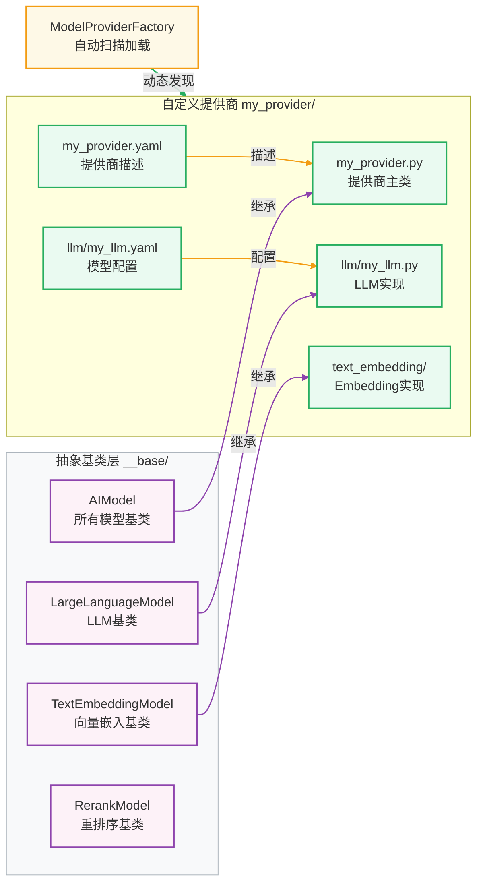

#### 完整实现示例：接入私有 OpenAI 兼容接口

**第一步：创建提供商目录结构**

```bash
mkdir -p api/core/model_runtime/model_providers/my_private_llm/llm
touch api/core/model_runtime/model_providers/my_private_llm/__init__.py
touch api/core/model_runtime/model_providers/my_private_llm/llm/__init__.py
```

**第二步：编写提供商 YAML 描述**

```yaml
# api/core/model_runtime/model_providers/my_private_llm/my_private_llm.yaml
provider: my_private_llm
label:
  en_US: My Private LLM
  zh_Hans: 私有大模型
icon_small:
  en_US: icon_s_en.png
icon_large:
  en_US: icon_l_en.png
background: "#f0f0f0"
help:
  title:
    en_US: How to get API key
    zh_Hans: 如何获取 API Key
  url:
    en_US: https://your-internal-docs/api-key
supported_model_types:
  - llm
  - text-embedding
configurate_methods:
  - customizable-model
model_credential_schema:
  model:
    label:
      en_US: Model Name
      zh_Hans: 模型名称
    placeholder:
      en_US: Enter model name, e.g. my-gpt-4
  credential_form_schemas:
    - variable: api_key
      label:
        en_US: API Key
        zh_Hans: API 密钥
      type: secret-input
      required: true
    - variable: api_base
      label:
        en_US: API Base URL
        zh_Hans: API 基础地址
      type: text-input
      required: true
      placeholder:
        en_US: "https://your-private-llm-api.com/v1"
```

**第三步：实现 LLM 类**

```python
# api/core/model_runtime/model_providers/my_private_llm/llm/llm.py
from collections.abc import Generator
from typing import Optional, Union

from openai import OpenAI

from core.model_runtime.entities.llm_entities import LLMResult, LLMResultChunk
from core.model_runtime.entities.message_entities import (
    PromptMessage,
    PromptMessageTool,
)
from core.model_runtime.entities.model_entities import AIModelEntity, FetchFrom, ModelType
from core.model_runtime.model_providers.__base.large_language_model import LargeLanguageModel


class MyPrivateLLM(LargeLanguageModel):
    """私有 LLM 提供商实现，兼容 OpenAI API 格式"""

    def _invoke(
        self,
        model: str,
        credentials: dict,
        prompt_messages: list[PromptMessage],
        model_parameters: dict,
        tools: Optional[list[PromptMessageTool]] = None,
        stop: Optional[list[str]] = None,
        stream: bool = True,
        user: Optional[str] = None,
    ) -> Union[LLMResult, Generator]:
        client = self._get_client(credentials)
        messages = self._convert_prompt_messages(prompt_messages)

        params = {
            "model": model,
            "messages": messages,
            "stream": stream,
            **model_parameters,
        }
        if stop:
            params["stop"] = stop

        if stream:
            return self._handle_stream_response(client.chat.completions.create(**params), model)
        return self._handle_response(client.chat.completions.create(**params), model, prompt_messages)

    def _get_client(self, credentials: dict) -> OpenAI:
        return OpenAI(
            api_key=credentials["api_key"],
            base_url=credentials["api_base"],
        )

    def validate_credentials(self, model: str, credentials: dict) -> None:
        """验证凭证有效性"""
        client = self._get_client(credentials)
        try:
            client.models.list()
        except Exception as e:
            raise ValueError(f"Invalid credentials: {e}") from e

    def get_num_tokens(
        self,
        model: str,
        credentials: dict,
        prompt_messages: list[PromptMessage],
        tools: Optional[list[PromptMessageTool]] = None,
    ) -> int:
        # 简化实现：按字符数估算 token
        total_chars = sum(len(str(msg.content)) for msg in prompt_messages)
        return total_chars // 4

    def _handle_stream_response(self, response, model: str) -> Generator:
        for chunk in response:
            if chunk.choices and chunk.choices[0].delta.content:
                yield LLMResultChunk(
                    model=model,
                    prompt_tokens=0,
                    completion_tokens=1,
                    delta=chunk.choices[0].delta.content,
                    finish_reason=chunk.choices[0].finish_reason,
                )
```

### 3.3 自定义 API 控制器与路由

当需要为二次开发添加新的 REST API 端点时，遵循以下模式：

```python
# api/controllers/custom/__init__.py
# api/controllers/custom/my_api.py

from flask import request
from flask_restful import Resource

from controllers.console import api
from controllers.console.wraps import account_initialization_required
from libs.login import login_required
from services.my_custom_service import MyCustomService


class MyCustomResource(Resource):
    """自定义 API 端点示例"""

    @login_required
    @account_initialization_required
    def get(self, app_id: str):
        """获取自定义业务数据"""
        service = MyCustomService()
        result = service.get_data(app_id=app_id, tenant_id=request.current_user.current_tenant_id)
        return {"data": result, "code": 200}

    @login_required
    def post(self, app_id: str):
        """提交自定义业务逻辑"""
        payload = request.get_json()
        service = MyCustomService()
        result = service.process(app_id=app_id, payload=payload)
        return {"result": result}, 201


# 注册路由
api.add_resource(MyCustomResource, "/apps/<uuid:app_id>/custom")
```

在应用工厂中注册蓝图：

```python
# api/app_factory.py（找到 initialize_extensions 区域添加）
from controllers.custom import bp as custom_bp
app.register_blueprint(custom_bp, url_prefix="/custom")
```

### 3.4 前端源码扩展

前端采用 Next.js App Router，扩展时遵循既有的目录约定：

```bash
web/app/
├── (commonLayout)/          # 公共布局（含侧边栏）
│   ├── apps/                # 应用列表页
│   ├── datasets/            # 知识库页面
│   └── my-feature/          # 新增自定义功能页 ← 在此添加
├── (shareLayout)/           # 共享布局（外部访问）
└── components/              # 全局复用组件
```

添加新功能页面：

```typescript
// web/app/(commonLayout)/my-feature/page.tsx
import type { FC } from 'react'
import { useTranslation } from 'react-i18next'

const MyFeaturePage: FC = () => {
  const { t } = useTranslation()

  return (
    <div className="flex flex-col h-full">
      <div className="px-6 py-4 border-b">
        <h1 className="text-xl font-semibold">
          {t('myFeature.title')}
        </h1>
      </div>
      <div className="flex-1 overflow-auto p-6">
        {/* 功能内容 */}
      </div>
    </div>
  )
}

export default MyFeaturePage
```

添加国际化文本（必须，不允许硬编码）：

```typescript
// web/i18n/en-US/my-feature.ts
const translation = {
  title: 'My Custom Feature',
  description: 'Custom feature for business needs',
}
export default translation

// web/i18n/zh-Hans/my-feature.ts
const translation = {
  title: '自定义功能',
  description: '满足业务需求的自定义功能',
}
export default translation
```

---

## 4. 编写高性能自定义插件

### 4.1 插件系统架构

Dify 1.x 引入了全新的插件系统，通过独立的 Plugin Daemon 进程管理插件生命周期，实现插件与主进程的进程隔离：

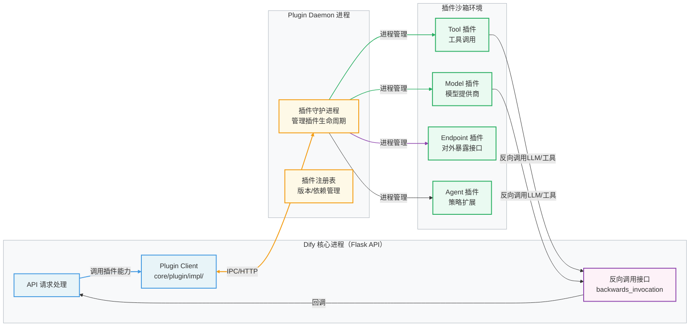

### 4.2 插件开发环境搭建

```bash
# 安装 Dify 插件开发 CLI
pip install dify-plugin-sdk

# 初始化新插件项目
dify plugin init --name my-tool-plugin --type tool

# 目录结构
my-tool-plugin/
├── manifest.yaml          # 插件元数据声明
├── requirements.txt       # Python 依赖
├── provider/
│   ├── my_tool.py         # 提供商实现类
│   └── my_tool.yaml       # 提供商声明
└── tools/
    ├── my_action.py       # 具体工具实现
    └── my_action.yaml     # 工具参数声明

# 本地调试
dify plugin run --debug
```

### 4.3 Tool 类型插件开发

Tool 插件是最常见的插件类型，用于封装外部服务为 Dify 可调用的工具。

#### Tool 插件完整实现示例

```yaml
# tools/search_database.yaml - 工具声明
identity:
  name: search_database
  author: your-org
  label:
    en_US: Search Internal Database
    zh_Hans: 搜索内部数据库
description:
  human:
    en_US: Search company's internal knowledge database
    zh_Hans: 搜索公司内部知识数据库
  llm: Search the internal database by keywords and return structured results.
parameters:
  - name: query
    type: string
    required: true
    label:
      en_US: Search Query
      zh_Hans: 搜索关键词
    human_description:
      en_US: Keywords to search for
      zh_Hans: 用于搜索的关键词
    llm_description: The search keywords for querying the database
    form: llm
  - name: max_results
    type: number
    required: false
    default: 10
    label:
      en_US: Max Results
      zh_Hans: 最大结果数
    form: form
output_schema:
  type: object
  properties:
    results:
      type: array
      items:
        type: object
```

```python
# tools/search_database.py - 工具实现
from collections.abc import Generator
from typing import Any

import httpx

from dify_plugin import Tool
from dify_plugin.entities.tool import ToolInvokeMessage


class SearchDatabaseTool(Tool):
    """内部数据库搜索工具"""

    def _invoke(
        self,
        tool_parameters: dict[str, Any],
    ) -> Generator[ToolInvokeMessage, None, None]:
        query = tool_parameters.get("query", "")
        max_results = tool_parameters.get("max_results", 10)

        if not query:
            yield self.create_text_message("请提供搜索关键词")
            return

        # 调用内部 API
        results = self._search_internal_api(query, max_results)

        if not results:
            yield self.create_text_message("未找到相关结果")
            return

        # 返回结构化 JSON 结果
        yield self.create_json_message({"results": results, "count": len(results)})

        # 同时返回可读文本摘要
        summary = self._format_summary(results)
        yield self.create_text_message(summary)

    def _search_internal_api(self, query: str, max_results: int) -> list[dict]:
        """调用内部数据库 API"""
        api_key = self.runtime.credentials.get("internal_api_key")
        api_base = self.runtime.credentials.get("api_base_url")

        try:
            with httpx.Client(timeout=10.0) as client:
                response = client.get(
                    f"{api_base}/search",
                    params={"q": query, "limit": max_results},
                    headers={"Authorization": f"Bearer {api_key}"},
                )
                response.raise_for_status()
                return response.json().get("items", [])
        except httpx.TimeoutException:
            raise RuntimeError("Internal API timeout, please retry")
        except httpx.HTTPStatusError as e:
            raise RuntimeError(f"Internal API error: {e.response.status_code}")

    def _format_summary(self, results: list[dict]) -> str:
        lines = [f"找到 {len(results)} 条结果："]
        for i, item in enumerate(results[:5], 1):
            lines.append(f"{i}. {item.get('title', 'Unknown')} - {item.get('summary', '')[:100]}")
        return "\n".join(lines)
```

### 4.4 Model 类型插件开发

Model 插件允许将自定义大模型封装为 Dify 可管理的提供商，适合企业内部私有模型：

```python
# provider/my_model_provider.py
from dify_plugin import ModelProvider
from dify_plugin.entities.model import ModelType


class MyModelProvider(ModelProvider):
    """自定义模型提供商插件"""

    def validate_provider_credentials(self, credentials: dict) -> None:
        """验证提供商级别的凭证"""
        required_fields = ["api_key", "api_base_url"]
        for field in required_fields:
            if not credentials.get(field):
                raise ValueError(f"Missing required credential: {field}")

        # 实际连通性测试
        self._test_connection(credentials)

    def _test_connection(self, credentials: dict) -> None:
        import httpx
        try:
            resp = httpx.get(
                f"{credentials['api_base_url']}/health",
                headers={"Authorization": f"Bearer {credentials['api_key']}"},
                timeout=5.0,
            )
            resp.raise_for_status()
        except Exception as e:
            raise ValueError(f"Cannot connect to model API: {e}") from e
```

### 4.5 插件高性能优化策略

高性能插件的关键在于合理的并发控制、连接复用和结果缓存：

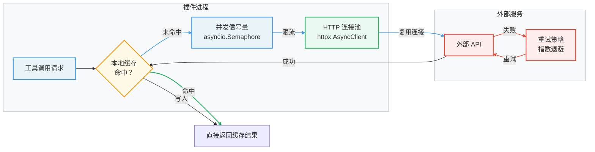

**核心优化代码**：

```python
import asyncio
from functools import lru_cache
from typing import Any

import httpx
from dify_plugin import Tool

# 全局连接池（插件进程内复用）
_http_client: httpx.AsyncClient | None = None
_semaphore: asyncio.Semaphore | None = None

def get_http_client() -> httpx.AsyncClient:
    global _http_client
    if _http_client is None or _http_client.is_closed:
        _http_client = httpx.AsyncClient(
            timeout=httpx.Timeout(connect=5.0, read=30.0, write=10.0, pool=5.0),
            limits=httpx.Limits(max_connections=100, max_keepalive_connections=20),
        )
    return _http_client

def get_semaphore(max_concurrent: int = 20) -> asyncio.Semaphore:
    global _semaphore
    if _semaphore is None:
        _semaphore = asyncio.Semaphore(max_concurrent)
    return _semaphore


class HighPerfTool(Tool):
    """高性能插件工具示例"""

    # 简单内存缓存（生产建议用 Redis）
    _cache: dict[str, Any] = {}
    _cache_ttl: dict[str, float] = {}
    CACHE_SECONDS = 300  # 5 分钟

    async def _invoke_async(self, tool_parameters: dict) -> Any:
        import time
        cache_key = str(sorted(tool_parameters.items()))

        # 检查缓存
        if cache_key in self._cache:
            if time.time() - self._cache_ttl[cache_key] < self.CACHE_SECONDS:
                return self.create_json_message(self._cache[cache_key])

        # 并发限流
        async with get_semaphore():
            result = await self._call_external_api(tool_parameters)

        # 写入缓存
        self._cache[cache_key] = result
        self._cache_ttl[cache_key] = time.time()

        return self.create_json_message(result)

    async def _call_external_api(self, params: dict) -> dict:
        """带重试的 API 调用"""
        client = get_http_client()
        max_retries = 3
        for attempt in range(max_retries):
            try:
                resp = await client.post("/api/query", json=params)
                resp.raise_for_status()
                return resp.json()
            except (httpx.TimeoutException, httpx.NetworkError):
                if attempt == max_retries - 1:
                    raise
                await asyncio.sleep(2 ** attempt)  # 指数退避
```

---

## 5. 集成 MCP 服务

### 5.1 MCP 协议概述

MCP（Model Context Protocol）是 Anthropic 提出的开放标准，定义了 LLM 应用与外部数据源/工具之间的通信协议。它解决了工具调用的标准化问题：

| 对比维度 | 传统工具调用 | MCP 协议 |
|---------|------------|---------|
| **标准化** | 各平台自定义格式 | 统一标准协议 |
| **工具共享** | 不同平台重复开发 | 一次开发，多处复用 |
| **传输方式** | 通常仅 HTTP | SSE + Streamable HTTP |
| **生态** | 平台私有 | Claude、Cursor、Cline 等通用 |

### 5.2 Dify MCP 架构

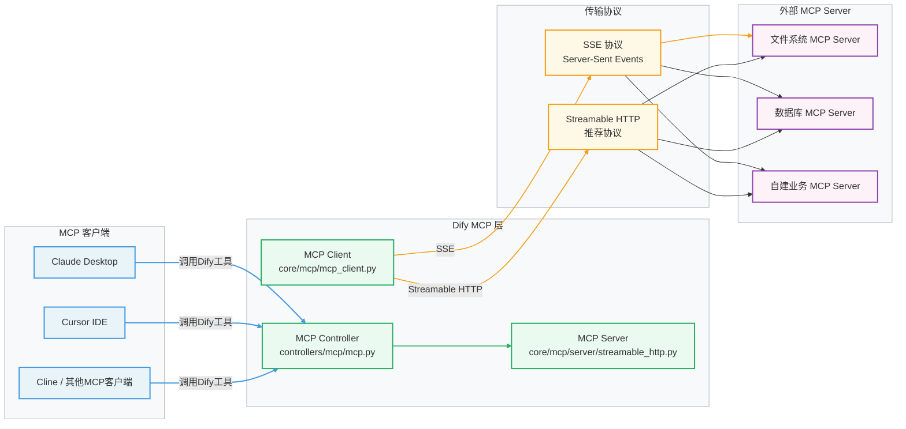

**Dify 在 MCP 生态中扮演双重角色**：
- **作为 MCP Server**：将 Dify 的工作流、知识库等能力通过 MCP 协议暴露给 Claude Desktop、Cursor 等客户端调用
- **作为 MCP Client**：在工作流中连接外部 MCP Server，调用文件系统、数据库等工具

### 5.3 接入外部 MCP Server

在 Dify 工作流中，可以通过工具调用节点连接外部 MCP Server：

#### 通过 UI 配置 MCP 工具

1. 进入 **工作区 → 工具 → 添加自定义工具**
2. 选择 **MCP 协议**
3. 填写 MCP Server 地址（支持两种格式）：
   - SSE 端点：`http://your-mcp-server/sse`
   - Streamable HTTP 端点：`http://your-mcp-server/mcp`

#### 通过代码集成 MCP Client

```python
# 在自定义服务或插件中使用 MCP Client
import asyncio
from core.mcp.mcp_client import MCPClient


async def call_mcp_tool(server_url: str, tool_name: str, args: dict) -> dict:
    """调用外部 MCP Server 的工具"""
    client = MCPClient(server_url=server_url)

    async with client:
        # 列出可用工具
        tools = await client.list_tools()
        tool_names = [t.name for t in tools]

        if tool_name not in tool_names:
            raise ValueError(f"Tool '{tool_name}' not found. Available: {tool_names}")

        # 调用工具
        result = await client.call_tool(tool_name, args)
        return {
            "content": result.content,
            "is_error": result.isError,
        }


# 使用示例
async def main():
    result = await call_mcp_tool(
        server_url="http://localhost:3000/mcp",
        tool_name="read_file",
        args={"path": "/data/report.pdf"},
    )
    print(result)


asyncio.run(main())
```

#### MCP Client 协议自动选择逻辑

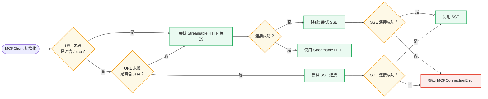

### 5.4 自建 MCP Server

将企业内部服务包装为 MCP Server，供 Dify 和其他 MCP 客户端调用：

```python
# 使用 mcp Python SDK 快速构建 MCP Server
# pip install mcp

from mcp.server import Server
from mcp.server.stdio import stdio_server
from mcp.types import Tool, TextContent
import json


app = Server("company-internal-mcp")


@app.list_tools()
async def list_tools() -> list[Tool]:
    """声明服务器提供的工具列表"""
    return [
        Tool(
            name="query_erp",
            description="Query company ERP system for order information",
            inputSchema={
                "type": "object",
                "properties": {
                    "order_id": {
                        "type": "string",
                        "description": "Order ID to query",
                    },
                    "include_details": {
                        "type": "boolean",
                        "description": "Include detailed line items",
                        "default": False,
                    },
                },
                "required": ["order_id"],
            },
        ),
        Tool(
            name="get_customer_info",
            description="Get customer information from CRM",
            inputSchema={
                "type": "object",
                "properties": {
                    "customer_id": {"type": "string"},
                },
                "required": ["customer_id"],
            },
        ),
    ]


@app.call_tool()
async def call_tool(name: str, arguments: dict) -> list[TextContent]:
    """处理工具调用请求"""
    if name == "query_erp":
        result = await query_erp_internal(arguments["order_id"], arguments.get("include_details", False))
        return [TextContent(type="text", text=json.dumps(result, ensure_ascii=False))]

    if name == "get_customer_info":
        result = await get_customer_from_crm(arguments["customer_id"])
        return [TextContent(type="text", text=json.dumps(result, ensure_ascii=False))]

    raise ValueError(f"Unknown tool: {name}")


async def query_erp_internal(order_id: str, include_details: bool) -> dict:
    """内部 ERP 查询逻辑"""
    # 实际调用 ERP API
    import httpx
    async with httpx.AsyncClient() as client:
        resp = await client.get(
            f"http://internal-erp/api/orders/{order_id}",
            params={"details": include_details},
        )
        return resp.json()


async def get_customer_from_crm(customer_id: str) -> dict:
    """CRM 客户信息查询"""
    # 实际调用 CRM API
    return {"id": customer_id, "name": "示例客户", "tier": "gold"}


if __name__ == "__main__":
    import asyncio
    asyncio.run(stdio_server(app))
```

**使用 HTTP 传输方式部署（Dify 推荐）**：

```python
# 使用 Starlette + mcp 启动 Streamable HTTP 服务
from starlette.applications import Starlette
from starlette.routing import Mount
from mcp.server.sse import SseServerTransport

transport = SseServerTransport("/messages")

async def handle_sse(request):
    async with transport.connect_sse(
        request.scope, request.receive, request._send
    ) as streams:
        await app.run(streams[0], streams[1], app.create_initialization_options())

starlette_app = Starlette(routes=[
    Mount("/sse", app=transport.handle_post_message),
])

# docker run -p 3000:3000 my-mcp-server
# Dify 中配置 URL: http://your-host:3000/sse
```

### 5.5 MCP 认证与安全

Dify 的 MCP 实现支持 OAuth 2.0 认证流程：

```python
# core/mcp/auth/auth_flow.py 的配置示例
mcp_config = {
    "server_url": "https://secure-mcp-server.com/mcp",
    "auth": {
        "type": "oauth2",
        "client_id": "dify-client",
        "client_secret": "your-secret",
        "token_url": "https://auth.example.com/token",
        "scope": "read:data write:data",
    }
}
```

---

## 6. 工作流引擎优化

### 6.1 工作流引擎内核解析

Dify 工作流引擎基于有向无环图（DAG）的图执行模型，核心组件协作关系如下：

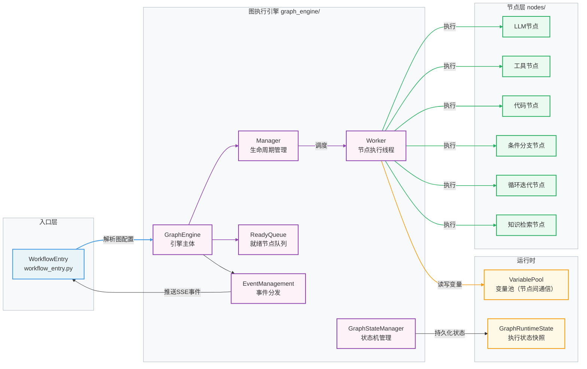

#### 变量池机制（节点间数据传递）

```python
# core/workflow/runtime/variable_pool.py
# 变量池是工作流节点间传递数据的核心机制

# 在自定义节点中读取上游节点输出
from core.workflow.runtime.variable_pool import VariablePool

class MyCustomNode(BaseNode):
    def _run(self) -> NodeRunResult:
        # 读取变量池中的变量
        # 格式：{节点ID}.{输出变量名}
        upstream_text = self.graph_runtime_state.variable_pool.get(
            ["node_abc123", "text"]
        )

        # 向变量池写入本节点的输出
        result_value = self._process(upstream_text.text if upstream_text else "")

        return NodeRunResult(
            status=WorkflowNodeExecutionStatus.SUCCEEDED,
            outputs={"my_output": result_value},
        )
```

### 6.2 新增自定义工作流节点

自定义节点是工作流引擎最核心的扩展点：

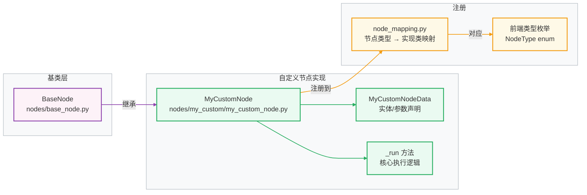

#### 完整自定义节点实现示例

```python
# api/core/workflow/nodes/data_transform/data_transform_node.py
from typing import TYPE_CHECKING

from core.workflow.entities.node_entities import NodeRunResult
from core.workflow.nodes.base import BaseNode
from core.workflow.nodes.enums import NodeType
from models.workflow import WorkflowNodeExecutionStatus

if TYPE_CHECKING:
    from core.workflow.graph_engine.entities.event import InNodeEvent


class DataTransformNodeData(BaseNodeData):
    """节点参数配置"""
    transform_type: str  # json_path / jinja2 / python_expr
    expression: str      # 转换表达式
    input_variable: str  # 输入变量引用（格式：nodeId.variableName）


class DataTransformNode(BaseNode[DataTransformNodeData]):
    """数据转换节点：支持 JSONPath / Jinja2 / Python 表达式"""

    _node_data_cls = DataTransformNodeData
    _node_type = NodeType.DATA_TRANSFORM  # 需在 NodeType 枚举中添加

    def _run(self) -> NodeRunResult:
        node_data: DataTransformNodeData = self.node_data

        # 从变量池获取输入数据
        var_selector = node_data.input_variable.split(".")
        input_var = self.graph_runtime_state.variable_pool.get(var_selector)
        input_value = input_var.to_object() if input_var else None

        # 执行转换
        try:
            output = self._do_transform(
                transform_type=node_data.transform_type,
                expression=node_data.expression,
                input_value=input_value,
            )
            return NodeRunResult(
                status=WorkflowNodeExecutionStatus.SUCCEEDED,
                outputs={"result": output},
                metadata={
                    "transform_type": node_data.transform_type,
                    "input_type": type(input_value).__name__,
                },
            )
        except Exception as e:
            return NodeRunResult(
                status=WorkflowNodeExecutionStatus.FAILED,
                error=str(e),
            )

    def _do_transform(self, transform_type: str, expression: str, input_value: any) -> any:
        if transform_type == "json_path":
            from jsonpath_ng import parse
            jsonpath_expr = parse(expression)
            matches = jsonpath_expr.find(input_value)
            return [m.value for m in matches] if matches else None

        if transform_type == "jinja2":
            from jinja2 import Template
            template = Template(expression)
            return template.render(data=input_value)

        if transform_type == "python_expr":
            # 注意：生产环境应在沙箱中执行，参考 code 节点实现
            result = eval(expression, {"data": input_value, "__builtins__": {}})
            return result

        raise ValueError(f"Unknown transform type: {transform_type}")
```

在节点映射中注册：

```python
# api/core/workflow/nodes/node_mapping.py
from core.workflow.nodes.data_transform.data_transform_node import DataTransformNode

NODE_TYPE_CLASSES_MAPPING: dict[NodeType, type[BaseNode]] = {
    # ... 现有节点 ...
    NodeType.DATA_TRANSFORM: DataTransformNode,  # 新增
}
```

### 6.3 工作流性能调优

#### 并发执行优化

工作流引擎默认按 DAG 依赖关系并发执行无依赖节点，可通过以下配置优化：

```python
# core/workflow/graph_engine/config.py 关键配置
class GraphEngineConfig:
    # 最大并发节点数（默认根据 CPU 核心数自动计算）
    MAX_CONCURRENT_NODES: int = 10

    # 节点执行超时（秒）
    NODE_EXECUTION_TIMEOUT: int = 180

    # 迭代节点最大并发（防止内存爆炸）
    ITERATION_MAX_CONCURRENT: int = 5
```

#### 针对 LLM 节点的流式优化

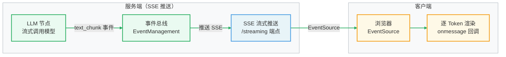

### 6.4 业务场景定制化实践

#### 场景一：RAG 增强检索策略

针对专业领域（如法律、医疗），需要定制检索策略：

```python
# api/core/workflow/nodes/knowledge_retrieval/knowledge_retrieval_node.py
# 二次开发：添加自定义重排序策略

class EnhancedKnowledgeRetrievalNode(KnowledgeRetrievalNode):
    """增强知识检索节点，支持领域专属重排序"""

    def _rerank_with_domain_model(
        self,
        query: str,
        docs: list[Document],
        domain: str,
    ) -> list[Document]:
        """使用领域专属模型进行二次重排序"""
        domain_rerankers = {
            "legal": "bge-reranker-legal-v1",
            "medical": "bge-reranker-medical-v1",
        }
        reranker_model = domain_rerankers.get(domain)

        if not reranker_model:
            return docs  # 无领域模型，使用默认排序

        # 调用专属重排序模型
        scores = self._call_reranker(query=query, docs=docs, model=reranker_model)
        return sorted(zip(docs, scores), key=lambda x: x[1], reverse=True)
```

#### 场景二：工作流执行状态监控

```python
# 扩展工作流执行事件，接入企业监控系统
from core.workflow.graph_engine.entities.event import (
    NodeRunSucceededEvent,
    NodeRunFailedEvent,
    WorkflowRunSucceededEvent,
)


class MonitoringEventHandler:
    """工作流执行监控，接入 Prometheus/企业监控"""

    def __init__(self, metrics_client):
        self.metrics = metrics_client

    def handle_node_succeeded(self, event: NodeRunSucceededEvent):
        self.metrics.histogram(
            "workflow_node_duration_seconds",
            value=event.execution_metadata.get("duration", 0),
            labels={
                "node_type": event.node_type.value,
                "workflow_id": event.workflow_id,
            },
        )

    def handle_node_failed(self, event: NodeRunFailedEvent):
        self.metrics.counter(
            "workflow_node_failures_total",
            labels={
                "node_type": event.node_type.value,
                "error_type": type(event.error).__name__,
            },
        )
```

---

## 7. 常见问题与解决方案

### 问题一：私有化部署后模型调用超时

**现象**：在内网环境部署后，调用 OpenAI 等海外模型频繁超时。

**排查与解决**：

```bash
# 1. 检查 API 容器网络连通性
docker exec dify-api-1 curl -v https://api.openai.com/v1/models \
  -H "Authorization: Bearer $OPENAI_API_KEY"

# 2. 配置代理（.env 文件）
HTTP_PROXY=http://your-proxy-host:7890
HTTPS_PROXY=http://your-proxy-host:7890
NO_PROXY=localhost,127.0.0.1,db,redis,weaviate

# 3. 重启 API 服务使配置生效
docker compose restart api worker
```

### 问题二：向量数据库迁移数据丢失

**现象**：切换向量数据库（如从 Weaviate 迁移到 pgvector）后，知识库搜索无结果。

**根因**：向量数据存储在旧的向量数据库中，切换后需重新索引文档。

**解决方案**：

```bash
# 触发知识库全量重新索引
docker exec dify-api-1 flask datasets re-index-dataset --all

# 或通过 API 对指定知识库重新索引
curl -X POST http://localhost:5001/console/api/datasets/{dataset_id}/documents/batch_index \
  -H "Authorization: Bearer $ADMIN_TOKEN" \
  -H "Content-Type: application/json"
```

### 问题三：插件调用失败 - Plugin Daemon 连接错误

**现象**：`PluginDaemonClientError: Connection refused`

**排查步骤**：

```bash
# 1. 检查 Plugin Daemon 是否运行
docker compose ps plugin_daemon

# 2. 查看 Daemon 日志
docker compose logs plugin_daemon --tail=100

# 3. 验证 API 配置
# .env 中确认以下配置
PLUGIN_DAEMON_URL=http://plugin_daemon:5002
PLUGIN_DAEMON_KEY=your-daemon-key  # 与 Daemon 端一致

# 4. 手动测试 Daemon 连通性
docker exec dify-api-1 curl http://plugin_daemon:5002/health
```

### 问题四：工作流执行卡死在某个节点

**现象**：工作流执行状态长时间停留在某节点，不超时也不失败。

**根因**：通常是节点内部 I/O 阻塞且未设置超时。

**解决方案**：

```python
# 在自定义节点中强制设置超时
import signal
from contextlib import contextmanager


@contextmanager
def timeout(seconds: int):
    def handler(signum, frame):
        raise TimeoutError(f"Node execution timeout after {seconds}s")
    signal.signal(signal.SIGALRM, handler)
    signal.alarm(seconds)
    try:
        yield
    finally:
        signal.alarm(0)


class MyNode(BaseNode):
    def _run(self) -> NodeRunResult:
        with timeout(30):  # 强制 30 秒超时
            result = self._external_call()
        return NodeRunResult(...)
```

### 问题五：多租户场景下的数据隔离

**现象**：多租户部署中，租户 A 的数据被租户 B 的请求访问到。

**根因**：数据库查询未过滤 `tenant_id`。

**正确实践**：

```python
# 正确：所有查询必须带 tenant_id 过滤
from flask_login import current_user

def get_app(app_id: str) -> App:
    # ✅ 正确：带租户过滤
    app = db.session.query(App).filter(
        App.id == app_id,
        App.tenant_id == current_user.current_tenant_id,
    ).first()

    # ❌ 错误：缺少租户隔离
    # app = db.session.query(App).filter(App.id == app_id).first()

    if not app:
        raise AppNotFoundError(f"App {app_id} not found")
    return app
```

### 问题六：大文档知识库索引内存溢出

**现象**：上传大型 PDF（>100MB）时，Worker 进程 OOM 被杀死。

**解决方案**：

```bash
# 1. 调整 Worker 内存限制（docker-compose.yaml）
services:
  worker:
    mem_limit: 4g
    mem_reservation: 2g

# 2. 调整文档分片策略（减小 chunk_size）
# 在知识库设置中：chunk_size=500（默认1000），chunk_overlap=50

# 3. 启用文档队列分离（避免大文件任务阻塞）
# dataset 专用队列，增加 worker 数量
celery -A app.celery worker -Q dataset --concurrency=2 --max-memory-per-child=1000000
```

---

## 8. 面试常见问题（FAQ）

### 8.1 私有化部署相关

**Q1：Dify 私有化部署有哪些核心要素？生产环境需要注意什么？**

> **A**：私有化部署核心要素包括：
>
> ① **安全密钥**：`SECRET_KEY` 必须设置为强随机字符串（至少 32 位），用于 JWT 签名和数据加密，泄露会导致安全漏洞。
>
> ② **数据持久化**：PostgreSQL（业务数据）、向量数据库（知识库向量）、对象存储（文件）三者均需配置持久化卷，不能使用临时容器存储。
>
> ③ **高可用设计**：生产环境 API 服务需水平扩展（多副本+负载均衡）；Worker 按队列类型分组部署；Redis 使用哨兵/集群模式。
>
> ④ **网络隔离**：通过 SSRF Proxy 代理所有出站 HTTP 请求，防止 SSRF 攻击；启用 Nginx SSL 终止；敏感端口不对外暴露。
>
> ⑤ **备份策略**：PostgreSQL 每日全量备份 + WAL 增量；向量数据库定期快照；文件存储异地同步。
>
> ⑥ **监控告警**：接入 Prometheus + Grafana 监控 API 响应时间、Worker 队列积压、LLM 调用延迟等关键指标。

---

**Q2：Dify 支持哪些向量数据库？生产环境如何选型？**

> **A**：Dify 支持 Weaviate、pgvector、Qdrant、Elasticsearch、Milvus、Chroma、OpenSearch 等 10+ 种向量数据库。
>
> 选型建议：
> - **已有 PostgreSQL**：选 pgvector，运维成本最低，中小规模完全够用（< 100 万向量）
> - **纯向量检索，追求性能**：选 Qdrant，Rust 实现性能优秀，支持过滤检索
> - **已有 Elasticsearch**：选 ES，可复用现有基础设施，同时支持全文+向量混合检索
> - **超大规模（亿级向量）**：选 Milvus，专为大规模向量设计
> - **快速验证/开发**：选 Weaviate（默认），开箱即用

---

**Q3：如何保证二开版本和官方版本的持续同步，避免合并冲突？**

> **A**：推荐以下 Git 分支策略：
>
> ```
> main (官方 upstream)
>   ↓ 定期 merge
> private/main (私有分支主干)
>   ↓ cherry-pick 或 feature branch
> private/feature-xxx (业务特性分支)
> ```
>
> 关键实践：
> ① **最小化侵入**：优先通过插件、配置、Hook 实现功能，避免修改核心文件
> ② **隔离二开代码**：自定义代码集中在 `api/core/custom/`、`api/controllers/custom/` 等独立目录
> ③ **定期 rebase upstream**：每 2 周从官方 upstream 拉取最新代码，优先解决冲突
> ④ **自动化测试**：建立 CI 流水线，每次合并后跑回归测试，快速发现兼容性问题

---

### 8.2 插件开发相关

**Q4：Dify 插件系统的架构设计有什么亮点？为什么采用进程隔离而非线程？**

> **A**：Dify 插件系统采用独立的 Plugin Daemon 进程管理所有插件实例，亮点在于：
>
> ① **故障隔离**：插件崩溃不影响主进程（API Server），符合"舱壁模式"
> ② **资源限制**：可对插件进程设置 CPU/内存 cgroup 限制，防止恶意插件耗尽系统资源
> ③ **多语言支持**：进程隔离使得插件可以用任意语言实现，通过 HTTP/IPC 与 Daemon 通信
> ④ **热更新**：插件更新无需重启主进程，只需重启插件进程
>
> 相比线程隔离，进程隔离的优势在于：Python GIL 限制了线程并发能力；进程拥有独立内存空间，彻底避免数据竞争；操作系统层面的资源配额更可靠。

---

**Q5：如何编写一个高性能的 Tool 类型插件？有哪些关键优化点？**

> **A**：高性能 Tool 插件的核心优化策略：
>
> ① **连接池复用**：使用模块级单例 `httpx.AsyncClient`，避免每次请求创建连接，节省 TCP 握手时间（通常 50-200ms）
>
> ② **并发控制**：使用 `asyncio.Semaphore` 限制并发请求数，防止下游服务过载
>
> ③**结果缓存**：对幂等查询（如数据库查询、API 检索）实现缓存层，推荐使用 Redis，TTL 根据业务时效性配置
>
> ④ **异步实现**：优先实现 `_invoke_async` 而非同步 `_invoke`，充分利用异步 I/O 优势
>
> ⑤ **超时兜底**：所有外部 I/O 调用均设置超时，且要分别设置连接超时（5s）和读取超时（30s）
>
> ⑥ **指数退避重试**：网络抖动时自动重试，使用指数退避（1s → 2s → 4s）避免重试风暴

---

**Q6：插件的反向调用（backwards_invocation）是什么？适用于哪些场景？**

> **A**：反向调用是 Dify 插件系统的特色能力，允许插件在执行过程中回调 Dify 主进程的核心能力（LLM 推理、工具调用、工作流节点执行等）。
>
> 适用场景举例：
> - **Agent 插件**：插件需要调用 LLM 进行推理后再执行下一步工具调用
> - **数据处理插件**：插件需要先调用 Embedding 模型向量化文本，再进行相似度计算
> - **编排插件**：插件内部需要触发一个子工作流来完成复杂的数据处理流程
>
> 调用链路：`插件进程 → Plugin Daemon → Dify API（backwards_invocation 路由）→ 核心能力（LLM/Tool/Node）→ 返回结果给插件`

---

### 8.3 MCP 集成相关

**Q7：MCP 协议相比传统 Function Calling 有什么优势？Dify 如何实现 MCP 双重角色？**

> **A**：MCP（Model Context Protocol）相比传统 Function Calling 的核心优势：
>
> | 维度 | Function Calling | MCP |
> |------|-----------------|-----|
> | 标准化 | 各平台格式不同 | 统一开放标准 |
> | 工具复用 | 工具只能在同一平台使用 | 跨 Claude/Cursor/Dify 通用 |
> | 传输层 | 通常单一 HTTP | SSE + Streamable HTTP |
> | 生态 | 封闭私有 | 开放生态，工具可共享 |
>
> Dify 在 MCP 生态中扮演双重角色：
> - **MCP Server 角色**（`controllers/mcp/` + `core/mcp/server/`）：将 Dify 的工作流应用、知识库等能力通过 MCP 协议对外暴露，Claude Desktop、Cursor 等 MCP 客户端可以直接调用 Dify 中的知识库搜索、工作流执行等功能
> - **MCP Client 角色**（`core/mcp/mcp_client.py`）：在工作流执行过程中，Dify 可作为 MCP 客户端连接外部 MCP Server（如文件系统、数据库、ERP 系统），将外部工具无缝集成到工作流节点中

---

**Q8：Dify MCP Client 如何处理协议选择和连接失败的 fallback？**

> **A**：`MCPClient`（`core/mcp/mcp_client.py`）实现了智能协议协商机制：
>
> ① **URL 路径推断**：解析 URL 末段判断服务器偏好
>    - `/mcp` 结尾 → 优先尝试 Streamable HTTP（新版协议）
>    - `/sse` 结尾 → 优先尝试 SSE（旧版协议）
>    - 其他 → 默认尝试 Streamable HTTP
>
> ② **自动降级**：若首选协议连接失败（连接拒绝、404 等），自动切换到另一种协议重试
>
> ③ **会话管理**：通过 `session/client_session.py` 维护连接状态，支持会话恢复和重连
>
> ④ **认证支持**：通过 `auth/auth_flow.py` 实现 OAuth 2.0 认证流程，支持企业级安全 MCP Server
>
> 这种设计使 Dify 能兼容不同版本的 MCP Server，降低了集成门槛。

---

### 8.4 工作流引擎相关

**Q9：Dify 工作流引擎如何实现节点间的数据传递？VariablePool 的设计思路是什么？**

> **A**：节点间数据传递通过 `VariablePool`（变量池）实现，这是工作流引擎的核心数据共享机制：
>
> **设计思路**：
> - 变量池是一个以 `{节点ID}.{变量名}` 为 key 的扁平字典结构
> - 每个节点执行完成后，将输出写入变量池
> - 下游节点通过 `[nodeId, variableName]` 路径从变量池读取上游输出
> - 系统变量（如 `sys.query`、`sys.user_id`）以 `sys.` 前缀存储
>
> **优势**：
> - 避免节点间的直接引用耦合，保持节点松耦合
> - 支持跨层级引用（迭代节点内部可引用外部节点的变量）
> - 变量池在工作流整个生命周期内持久，支持循环和条件分支场景
>
> **线程安全**：变量池的读写操作在工作线程中受 `Manager` 协调，多个并行节点写入时不会产生竞争条件

---

**Q10：如何为特定业务场景优化工作流引擎的性能？请列举具体措施。**

> **A**：工作流性能优化需从以下维度入手：
>
> **① 并发优化**
> - 识别 DAG 中无依赖关系的节点，确保它们被并发执行（引擎默认行为）
> - 对于大批量数据处理，使用迭代节点（Iteration Node）的并发模式（设置 `concurrent_limit`）
> - 避免不必要的串行化：不要为了简单而将本可并行的节点串联
>
> **② LLM 节点优化**
> - 使用流式输出（Streaming）而非等待完整响应，提升用户感知响应速度
> - 对于非关键路径的摘要/分类任务，切换为更快的小模型（如 GPT-3.5 替代 GPT-4）
> - 合理设置 `max_tokens`，避免 LLM 生成不必要的冗长输出
>
> **③ 知识检索优化**
> - 调整 `top_k` 参数（默认 4），过大会增加重排序延迟，过小会影响召回率
> - 对高频查询启用语义缓存：相似问题直接返回缓存的检索结果
> - 选择合适的向量数据库索引类型（HNSW 适合高召回率，IVF 适合大规模高速查询）
>
> **④ HTTP 节点优化**
> - 配置合理的超时时间，防止单个节点拖慢整个工作流
> - 对幂等外部 API 调用启用结果缓存（通过自定义 HTTP 节点实现）
>
> **⑤ 系统级优化**
> - 按工作流类型分离 Celery 队列：实时对话类 vs 批处理类，独立扩容
> - 监控 `workflow_node_duration_seconds` 等指标，针对性优化耗时节点
> - 对 PostgreSQL 工作流执行记录表添加复合索引（`workflow_id, status, created_at`）

---

**Q11：Dify 工作流引擎如何处理节点执行失败的错误恢复？**

> **A**：工作流引擎提供多层次的错误处理机制：
>
> **① 节点级错误处理**
> - 每个节点的 `_run()` 方法通过返回 `WorkflowNodeExecutionStatus.FAILED` 状态报告失败
> - 节点可以配置"失败时继续"模式，允许工作流在节点失败后通过默认值继续执行
>
> **② 重试机制**
> - 对于网络类错误（如 LLM API 超时），LLM 节点内置指数退避重试（默认 3 次）
> - 可在节点配置中设置 `max_retries` 和 `retry_interval`
>
> **③ 并行分支隔离**
> - 并行分支中一个分支失败，不会立即终止其他分支的执行
> - `GraphStateManager` 负责汇聚所有分支结果，统一决定工作流最终状态
>
> **④ 人工干预节点**
> - `human_input` 节点支持暂停工作流等待人工审核，超时后可配置自动继续或终止
>
> **⑤ 状态持久化**
> - 每个节点的执行状态实时写入 PostgreSQL，支持断点续跑（通过重新提交未完成的执行记录）

---

### 8.5 架构与源码开发相关

**Q12：Dify 采用 DDD 架构，如何在二次开发中保持架构边界？**

> **A**：保持 DDD 架构边界的核心原则：
>
> ① **单向依赖**：Controller → Service → Core（领域层）→ Model（数据层），严禁反向依赖
>
> ② **领域异常**：在 Core 层定义领域异常（如 `WorkflowNotFoundError`），在 Controller 层统一捕获并转换为 HTTP 错误响应，不要在 Core 层返回 HTTP 状态码
>
> ③ **依赖注入**：Core 层不直接实例化基础设施组件（数据库、Redis），通过构造函数注入 Repository 接口，便于测试时 Mock
>
> ④ **避免"贫血模型"**：领域实体（如 `App`、`Workflow`）应包含业务逻辑方法，不要将所有逻辑堆在 Service 层
>
> ⑤ **接口隔离**：自定义功能通过 Python Protocol（抽象接口）定义契约，具体实现在 `impl/` 下，便于替换和扩展
>
> 实践口诀："**数据向上传，能力向下封，边界不可越**"

---

**Q13：如何从零设计一个生产级的 Dify 私有化二开方案？请描述完整架构。**

> **A**：生产级 Dify 私有化二开方案设计：
>
> **阶段一：基础设施层（第 1-2 周）**
> - Kubernetes 编排：使用 Helm Chart 部署 Dify，实现弹性扩缩容
> - 数据层高可用：PostgreSQL 主从 + 连接池（PgBouncer）；Redis Sentinel；独立向量数据库集群
> - 对象存储：接入企业 MinIO 或云厂商 OSS，配置 CDN 加速
>
> **阶段二：安全加固（第 2-3 周）**
> - SSO 集成：对接企业 LDAP/OAuth2/SAML，替换默认邮箱登录
> - 网络隔离：API 接口层添加 WAF；SSRF Proxy 限制出站域名白名单
> - 数据加密：敏感配置（API Key）使用 KMS 管理，数据库落地加密
> - 审计日志：接入企业日志平台，记录所有 API 调用和数据访问
>
> **阶段三：能力扩展（第 3-6 周）**
> - 接入私有模型：开发内部大模型的 Provider 适配，通过 OpenAI 兼容层接入
> - 企业工具插件：将 ERP、CRM、OA 等系统封装为 Dify 工具插件
> - MCP 集成：搭建企业 MCP Server，统一管理内部服务工具
> - 自定义节点：开发行业专属工作流节点（如企业知识图谱检索、合规审查等）
>
> **阶段四：运营观测（持续迭代）**
> - 监控看板：Prometheus + Grafana 监控 LLM 调用量、Token 消耗、响应延迟
> - 成本分析：按租户、应用、模型维度统计 Token 消耗，接入企业成本核算系统
> - 定期合并官方更新：保持与上游社区同步，获取安全补丁和新功能

---

> **文档版本**：v1.0 | **最后更新**：2026-03-16  
> **对应 Dify 版本**：1.13.0  
> **参考文档**：[Dify 架构分析文档](./Dify架构分析文档.md) | [Python 高级开发面试 FAQ](./Python高级开发面试FAQ.md)
