# Kafka 与 RabbitMQ 深度解析

> 本文档系统讲解 Kafka 与 RabbitMQ 的原理、应用方法及对比分析，附带完整示例代码与面试 FAQ，适合中高级后端开发工程师阅读与参考。

---

## 目录

- [一、Kafka 原理与应用](#一kafka-原理与应用)
  - [1.1 基本概念与核心原理](#11-基本概念与核心原理)
  - [1.2 架构流程图](#12-架构流程图)
  - [1.3 应用步骤](#13-应用步骤)
  - [1.4 Python 示例代码](#14-python-示例代码)
  - [1.5 实战案例：电商订单日志流处理](#15-实战案例电商订单日志流处理)
- [二、RabbitMQ 原理与应用](#二rabbitmq-原理与应用)
  - [2.1 基本概念与核心原理](#21-基本概念与核心原理)
  - [2.2 架构流程图](#22-架构流程图)
  - [2.3 应用步骤](#23-应用步骤)
  - [2.4 Python 示例代码](#24-python-示例代码)
  - [2.5 实战案例：微服务异步任务调度](#25-实战案例微服务异步任务调度)
- [三、Kafka vs RabbitMQ 对比分析](#三kafka-vs-rabbitmq-对比分析)
  - [3.1 核心设计哲学对比](#31-核心设计哲学对比)
  - [3.2 关键指标对比表](#32-关键指标对比表)
  - [3.3 选型决策流程图](#33-选型决策流程图)
  - [3.4 典型应用场景对比](#34-典型应用场景对比)
- [四、面试常见问题 FAQ](#四面试常见问题-faq)

---

## 一、Kafka 原理与应用

### 1.1 基本概念与核心原理

Apache Kafka 是由 LinkedIn 开源、Apache 基金会维护的**分布式流处理平台**，其设计目标是以高吞吐量、低延迟、持久化的方式处理实时数据流。

#### 核心概念速览

| 概念 | 说明 |
|------|------|
| **Broker** | Kafka 集群中的单个服务节点，负责消息的存储与转发 |
| **Topic** | 消息的逻辑分类，类似于数据库中的"表" |
| **Partition** | Topic 的物理分片，每个分区是一个有序的、不可变的消息序列（追加写入） |
| **Producer** | 消息生产者，将消息发布到指定 Topic |
| **Consumer** | 消息消费者，从 Topic 拉取消息（Pull 模式） |
| **Consumer Group** | 消费者组，同一组内的消费者共享消费同一 Topic，实现负载均衡 |
| **Offset** | 消息在分区中的唯一顺序编号，消费者通过 Offset 追踪消费进度 |
| **ZooKeeper / KRaft** | 老版本依赖 ZooKeeper 做集群元数据管理；Kafka 2.8+ 引入 KRaft 模式取代 ZooKeeper |
| **Replica** | 分区副本，用于实现数据冗余和高可用（Leader + Follower 架构） |
| **ISR** | In-Sync Replica，与 Leader 保持同步的副本集合，用于故障切换 |

#### 核心设计原理

**1. 顺序追加写磁盘（Sequential I/O）**

Kafka 并不将消息存储在内存中，而是顺序追加写入磁盘日志文件（`.log` 文件）。顺序写磁盘的速度可达到 600 MB/s，远超随机写内存（约 100 MB/s），这是 Kafka 高吞吐的根本原因之一。

**2. 零拷贝（Zero-Copy）技术**

传统文件传输经历：磁盘 → 内核缓冲区 → 用户空间 → Socket 缓冲区 → 网卡，共 4 次拷贝。

Kafka 通过 Linux `sendfile()` 系统调用实现零拷贝：磁盘 → 内核缓冲区 → 网卡，仅 2 次拷贝，大幅提升网络传输效率。

**3. 分区并行处理**

Topic 分区使得多个消费者可以并行消费同一 Topic 的不同分区，吞吐量随分区数线性扩展。

**4. 消息持久化与可回溯**

消息默认持久化到磁盘，保留时间可配置（默认 7 天）。消费者可通过重置 Offset 重新消费历史消息，支持"事件溯源"场景。

**5. 批量压缩传输**

Producer 支持将多条消息打包成一个批次（Batch），并使用 Snappy、LZ4、Gzip 等算法压缩后发送，减少网络带宽占用。

**6. Pull 拉取模型**

Consumer 主动向 Broker 拉取消息，而非 Broker 推送。这使消费者可以按自身处理能力控制消费速率，避免被压垮。

---

### 1.2 架构流程图

#### Kafka 整体架构

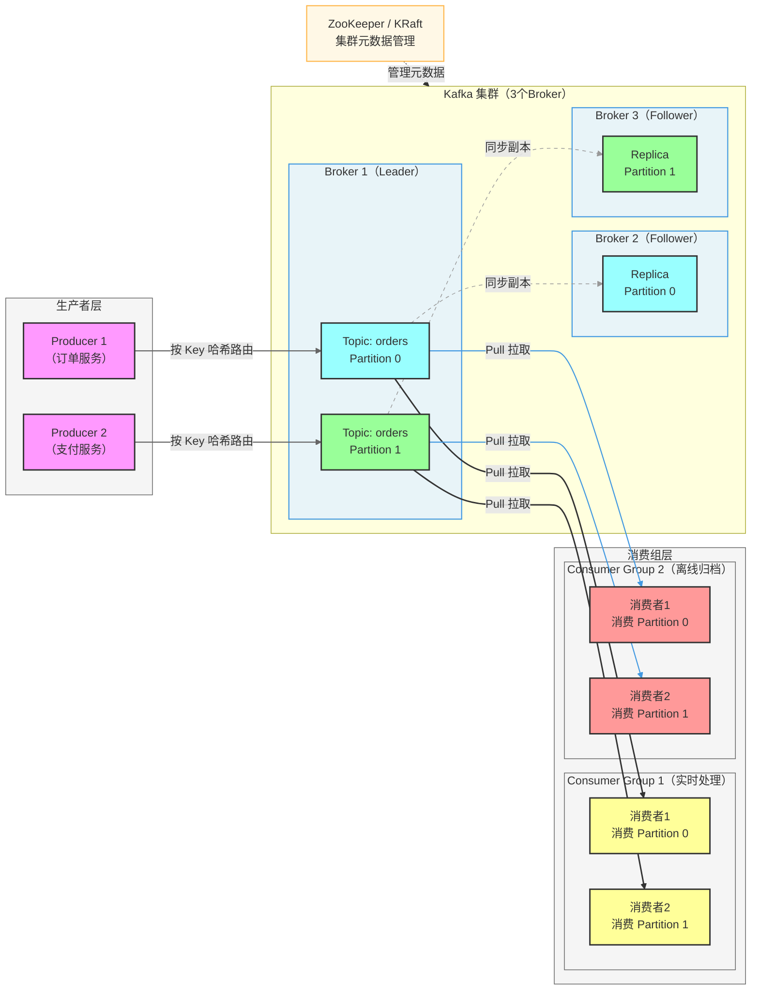

#### Kafka 消息生产与消费流程

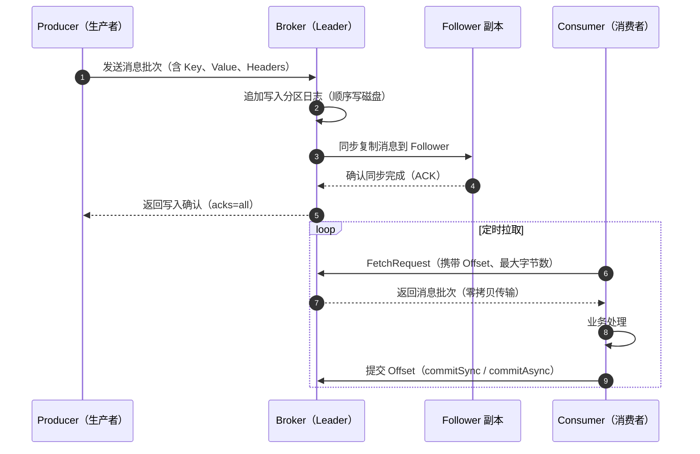

#### Kafka 分区与副本机制

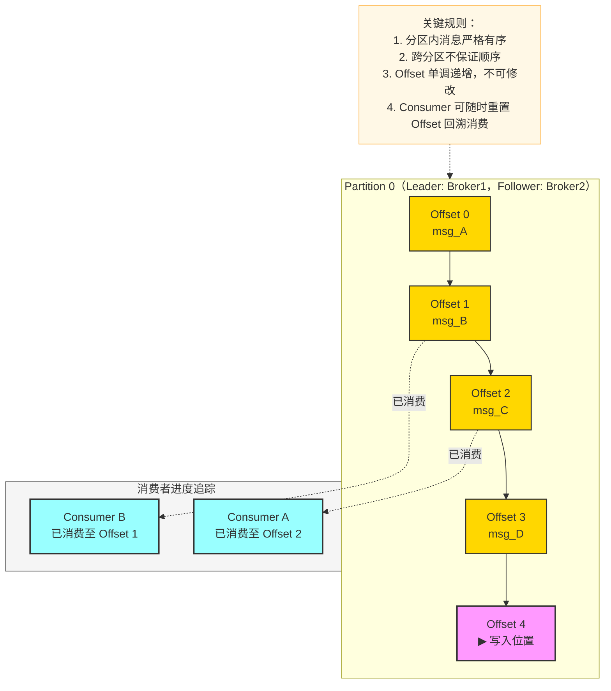

---

### 1.3 应用步骤

#### 步骤一：部署 Kafka（Docker 快速启动）

```bash
# 使用 docker-compose 启动 Kafka + ZooKeeper
cat > docker-compose-kafka.yml << 'EOF'
version: '3.8'
services:
  zookeeper:
    image: confluentinc/cp-zookeeper:7.5.0
    environment:
      ZOOKEEPER_CLIENT_PORT: 2181
    ports:
      - "2181:2181"

  kafka:
    image: confluentinc/cp-kafka:7.5.0
    depends_on:
      - zookeeper
    ports:
      - "9092:9092"
    environment:
      KAFKA_BROKER_ID: 1
      KAFKA_ZOOKEEPER_CONNECT: zookeeper:2181
      KAFKA_ADVERTISED_LISTENERS: PLAINTEXT://localhost:9092
      KAFKA_OFFSETS_TOPIC_REPLICATION_FACTOR: 1
      KAFKA_AUTO_CREATE_TOPICS_ENABLE: 'true'
EOF

docker-compose -f docker-compose-kafka.yml up -d
```

#### 步骤二：安装 Python 客户端

```bash
pip install kafka-python confluent-kafka
```

#### 步骤三：创建 Topic

```bash
# 创建 Topic（3个分区，1个副本）
docker exec -it <kafka-container-id> kafka-topics \
  --create \
  --topic orders \
  --bootstrap-server localhost:9092 \
  --partitions 3 \
  --replication-factor 1

# 查看 Topic 列表
kafka-topics --list --bootstrap-server localhost:9092

# 查看 Topic 详情
kafka-topics --describe --topic orders --bootstrap-server localhost:9092
```

#### 步骤四：配置关键参数

**Producer 关键配置：**

```python
producer_config = {
    'bootstrap.servers': 'localhost:9092',
    'acks': 'all',                    # 等待所有 ISR 副本确认，最高可靠性
    'retries': 3,                     # 失败重试次数
    'linger.ms': 5,                   # 等待批量发送的最大延迟（ms）
    'batch.size': 16384,              # 批次大小（字节）
    'compression.type': 'snappy',     # 消息压缩算法
    'max.in.flight.requests.per.connection': 1,  # 防止重试导致乱序
}
```

**Consumer 关键配置：**

```python
consumer_config = {
    'bootstrap.servers': 'localhost:9092',
    'group.id': 'order-processor',   # 消费者组 ID
    'auto.offset.reset': 'earliest', # 无 Offset 时从最早消息开始消费
    'enable.auto.commit': False,      # 关闭自动提交，手动控制
    'max.poll.records': 500,          # 每次 poll 的最大记录数
    'session.timeout.ms': 30000,      # 会话超时时间
}
```

---

### 1.4 Python 示例代码

#### Producer（生产者）

```python
# kafka_producer.py
import json
import time
from confluent_kafka import Producer
from confluent_kafka.admin import AdminClient, NewTopic


def create_topic_if_not_exists(bootstrap_servers: str, topic: str, num_partitions: int = 3):
    """若 Topic 不存在则自动创建"""
    admin = AdminClient({'bootstrap.servers': bootstrap_servers})
    existing = admin.list_topics(timeout=5).topics
    if topic not in existing:
        new_topic = NewTopic(topic, num_partitions=num_partitions, replication_factor=1)
        futures = admin.create_topics([new_topic])
        for t, f in futures.items():
            try:
                f.result()
                print(f"Topic '{t}' 创建成功")
            except Exception as e:
                print(f"Topic '{t}' 创建失败: {e}")


def delivery_callback(err, msg):
    """消息投递回调"""
    if err:
        print(f"[ERROR] 消息投递失败: {err}")
    else:
        print(
            f"[OK] 消息已投递 -> Topic: {msg.topic()}, "
            f"Partition: {msg.partition()}, "
            f"Offset: {msg.offset()}"
        )


class OrderProducer:
    def __init__(self, bootstrap_servers: str = 'localhost:9092'):
        self.topic = 'orders'
        self.producer = Producer({
            'bootstrap.servers': bootstrap_servers,
            'acks': 'all',
            'retries': 3,
            'linger.ms': 5,
            'batch.size': 16384,
            'compression.type': 'snappy',
            'max.in.flight.requests.per.connection': 1,
        })

    def send_order(self, order_id: str, order_data: dict) -> None:
        """
        发送订单消息。
        以 order_id 作为消息 Key，保证同一订单的消息路由到同一分区（有序）。
        """
        payload = json.dumps(order_data, ensure_ascii=False).encode('utf-8')
        self.producer.produce(
            topic=self.topic,
            key=order_id.encode('utf-8'),
            value=payload,
            callback=delivery_callback,
        )
        # 触发网络 I/O，非阻塞
        self.producer.poll(0)

    def flush(self) -> None:
        """等待所有消息发送完毕"""
        self.producer.flush()

    def __enter__(self):
        return self

    def __exit__(self, *args):
        self.flush()


if __name__ == '__main__':
    create_topic_if_not_exists('localhost:9092', 'orders')

    with OrderProducer() as producer:
        for i in range(10):
            order = {
                'order_id': f'ORD-{i:04d}',
                'user_id': f'USER-{i % 3}',
                'amount': round(99.9 + i * 10, 2),
                'items': [{'sku': f'SKU-{i}', 'qty': 1}],
                'status': 'created',
                'created_at': time.time(),
            }
            producer.send_order(order['order_id'], order)
            print(f"已发送订单: {order['order_id']}")
            time.sleep(0.1)

    print("所有消息发送完毕")
```

#### Consumer（消费者）

```python
# kafka_consumer.py
import json
import signal
import sys
from confluent_kafka import Consumer, KafkaError, KafkaException


class OrderConsumer:
    def __init__(
        self,
        bootstrap_servers: str = 'localhost:9092',
        group_id: str = 'order-processor',
    ):
        self.topic = 'orders'
        self.running = True
        self.consumer = Consumer({
            'bootstrap.servers': bootstrap_servers,
            'group.id': group_id,
            'auto.offset.reset': 'earliest',
            'enable.auto.commit': False,   # 手动提交，避免消息丢失
            'max.poll.records': 100,
            'session.timeout.ms': 30000,
        })

    def process_order(self, order: dict) -> None:
        """业务处理逻辑（此处仅打印，实际可写 DB/调用下游服务）"""
        print(
            f"[处理订单] ID={order.get('order_id')}, "
            f"金额={order.get('amount')}, "
            f"状态={order.get('status')}"
        )

    def run(self) -> None:
        self.consumer.subscribe([self.topic])
        signal.signal(signal.SIGINT, self._shutdown)
        signal.signal(signal.SIGTERM, self._shutdown)

        print(f"消费者启动，订阅 Topic: {self.topic}")
        try:
            while self.running:
                # 批量拉取，超时 1 秒
                messages = self.consumer.consume(num_messages=10, timeout=1.0)

                if not messages:
                    continue

                for msg in messages:
                    if msg.error():
                        if msg.error().code() == KafkaError._PARTITION_EOF:
                            print(f"已到达分区末尾: {msg.topic()}[{msg.partition()}]")
                        else:
                            raise KafkaException(msg.error())
                        continue

                    try:
                        order = json.loads(msg.value().decode('utf-8'))
                        self.process_order(order)
                    except json.JSONDecodeError as e:
                        print(f"[ERROR] 消息解析失败: {e}, raw={msg.value()}")
                        # 解析失败的消息记录到死信队列（此处省略）

                # 批量处理完成后手动提交 Offset
                self.consumer.commit(asynchronous=False)

        finally:
            self.consumer.close()
            print("消费者已关闭")

    def _shutdown(self, signum, frame):
        print("收到关闭信号，正在优雅退出...")
        self.running = False


if __name__ == '__main__':
    consumer = OrderConsumer()
    consumer.run()
```

---

### 1.5 实战案例：电商订单日志流处理

**场景描述：** 电商平台需要实时采集订单事件（创建、支付、发货、完成），分别流入实时风控系统和离线数仓归档。

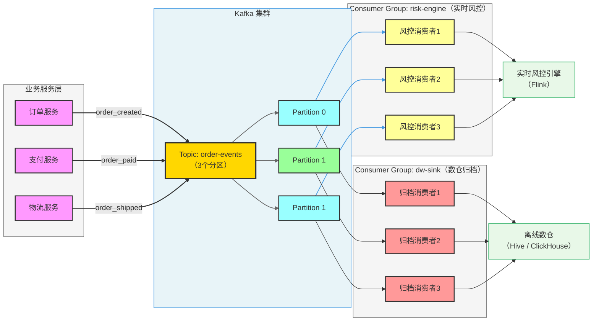

---

## 二、RabbitMQ 原理与应用

### 2.1 基本概念与核心原理

RabbitMQ 是基于 **AMQP（Advanced Message Queuing Protocol）** 协议的开源消息代理，由 Erlang 语言编写。它以可靠性、灵活的路由能力和完善的消息确认机制著称，是企业级消息中间件的标杆实现。

#### 核心概念速览

| 概念 | 说明 |
|------|------|
| **Broker** | RabbitMQ 服务节点，负责接收、路由、存储和转发消息 |
| **Virtual Host (vhost)** | 虚拟主机，类似命名空间，实现多租户隔离 |
| **Connection** | 客户端与 Broker 之间的 TCP 长连接 |
| **Channel** | 在 Connection 上复用的轻量级逻辑通道，避免频繁创建 TCP 连接的开销 |
| **Exchange** | 消息交换机，接收生产者消息并按路由规则转发到绑定的队列 |
| **Queue** | 消息队列，实际存储待消费的消息 |
| **Binding** | Exchange 与 Queue 之间的绑定关系，含路由规则（Routing Key / Pattern） |
| **Routing Key** | 消息的路由标签，Exchange 据此决定消息转发到哪个队列 |
| **Message Acknowledgement** | 消费者处理完消息后向 Broker 发送 ACK，Broker 才删除该消息 |
| **Dead Letter Exchange (DLX)** | 死信交换机，处理失败/过期/被拒绝的消息 |

#### Exchange 类型详解

RabbitMQ 支持 4 种 Exchange 类型，这是其路由灵活性的核心：

| Exchange 类型 | 路由规则 | 典型场景 |
|--------------|---------|---------|
| **Direct** | Routing Key 完全匹配 | 任务分发、点对点通信 |
| **Fanout** | 广播到所有绑定队列，忽略 Routing Key | 通知广播、发布订阅 |
| **Topic** | 通配符匹配（`*` 匹配单词，`#` 匹配多词） | 日志分级、多维度过滤 |
| **Headers** | 基于消息 Headers 属性匹配（忽略 Routing Key） | 复杂条件路由 |

#### 核心设计原理

**1. 推送模型（Push）**

与 Kafka 的 Pull 模式相反，RabbitMQ 采用 Push 模式将消息主动推送给消费者。通过 `prefetch_count`（QoS）控制每个消费者未确认消息的最大数量，实现流量控制。

**2. 消息确认机制（ACK）**

- **自动 ACK**：消息投递后立即确认（可能丢消息）
- **手动 ACK**：消费者处理完后显式确认，未确认消息在消费者断线后重新入队
- **Nack / Reject**：拒绝消息，可选择是否重新入队或转入死信队列

**3. 消息持久化**

同时设置 Exchange 持久化、Queue 持久化和消息持久化（`delivery_mode=2`），三者缺一不可，才能确保 Broker 重启后消息不丢失。

**4. 发布确认（Publisher Confirm）**

类似 Kafka 的 `acks=all`，生产者开启 Confirm 模式后，消息写入磁盘（持久化）或被路由到队列后，Broker 返回 ACK 给生产者，确保消息不丢。

**5. 死信队列（DLQ）**

当消息满足以下任一条件时，转入死信交换机：
- 消息被 Nack/Reject 且 `requeue=False`
- 消息 TTL 过期
- 队列达到最大长度（`x-max-length`）

---

### 2.2 架构流程图

#### RabbitMQ 整体架构

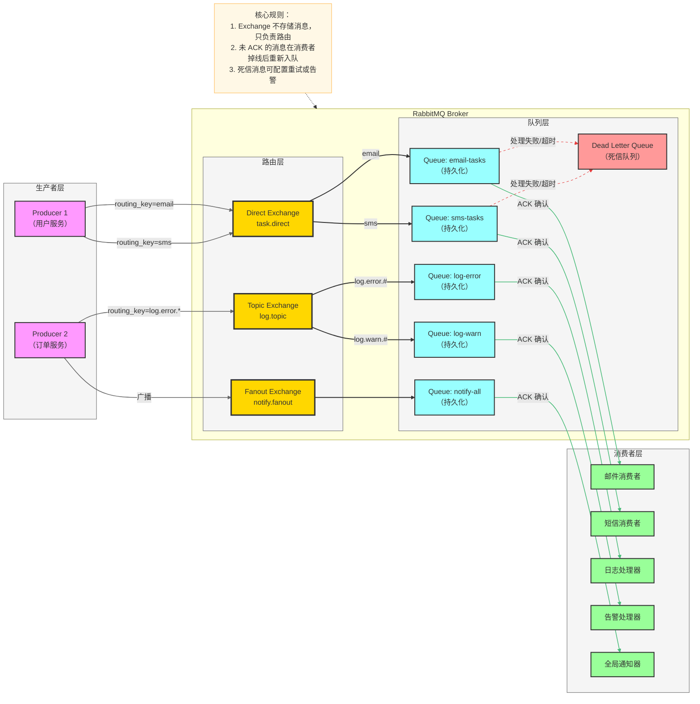

#### Exchange 路由类型详解

```mermaid
flowchart TB
    classDef exchangeStyle fill:#ffd700,stroke:#333,stroke-width:2px
    classDef queueStyle fill:#9ff,stroke:#333,stroke-width:2px
    classDef producerStyle fill:#f9f,stroke:#333,stroke-width:2px
    classDef subgraphStyle fill:#f5f5f5,stroke:#666,stroke-width:1px
    classDef labelStyle fill:#fff8e6,stroke:#ffb74d,stroke-width:1px

    %% Direct Exchange
    subgraph direct["① Direct Exchange（精确匹配）"]
        PD[Producer]:::producerStyle
        ED[Direct Exchange]:::exchangeStyle
        QD1[Queue: order.created]:::queueStyle
        QD2[Queue: order.paid]:::queueStyle
        PD -->|routing_key=order.created| ED
        ED -->|匹配 order.created| QD1
        ED -->|匹配 order.paid| QD2
    end
    class direct subgraphStyle

    %% Fanout Exchange
    subgraph fanout["② Fanout Exchange（广播）"]
        PF[Producer]:::producerStyle
        EF[Fanout Exchange]:::exchangeStyle
        QF1[Queue: svc-A]:::queueStyle
        QF2[Queue: svc-B]:::queueStyle
        QF3[Queue: svc-C]:::queueStyle
        PF -->|任意消息| EF
        EF -->|广播| QF1
        EF -->|广播| QF2
        EF -->|广播| QF3
    end
    class fanout subgraphStyle

    %% Topic Exchange
    subgraph topic["③ Topic Exchange（通配符匹配）"]
        PT[Producer]:::producerStyle
        ET[Topic Exchange]:::exchangeStyle
        QT1["Queue: 处理所有错误<br/>binding: log.#.error"]:::queueStyle
        QT2["Queue: 处理支付日志<br/>binding: log.payment.*"]:::queueStyle
        PT -->|routing_key=log.payment.error| ET
        ET -->|匹配 log.#.error| QT1
        ET -->|匹配 log.payment.*| QT2
    end
    class topic subgraphStyle
```

#### RabbitMQ 消息可靠性保障流程

```mermaid
flowchart LR
    classDef producerStyle fill:#f9f,stroke:#333,stroke-width:2px
    classDef brokerStyle fill:#ffd700,stroke:#333,stroke-width:2px
    classDef queueStyle fill:#9ff,stroke:#333,stroke-width:2px
    classDef consumerStyle fill:#9f9,stroke:#333,stroke-width:2px
    classDef dlqStyle fill:#f99,stroke:#333,stroke-width:2px
    classDef subgraphStyle fill:#f5f5f5,stroke:#666,stroke-width:1px
    classDef decisionStyle fill:#fff8e6,stroke:#ffb74d,stroke-width:1.5px

    P[Producer]:::producerStyle
    subgraph broker["Broker（持久化 Exchange + Queue）"]
        EX[Exchange]:::brokerStyle
        Q[Queue<br/>durable=True]:::queueStyle
        EX --> Q
    end
    class broker subgraphStyle
    C[Consumer]:::consumerStyle
    DLQ[死信队列 DLQ]:::dlqStyle
    RETRY{重试次数<br/>< 3次?}:::decisionStyle
    ALERT[告警通知]:::dlqStyle

    P -->|① 发送消息<br/>delivery_mode=2| EX
    EX -->|② 路由入队| Q
    broker -->|③ Publisher Confirm ACK| P
    Q -->|④ Push 推送| C
    C -->|⑤ 处理成功 → basicAck| Q
    C -->|⑤ 处理失败 → basicNack| RETRY
    RETRY -->|是，重新入队| Q
    RETRY -->|否，转死信| DLQ
    DLQ --> ALERT

    linkStyle 0,1 stroke:#666,stroke-width:1.5px
    linkStyle 2 stroke:#48bb78,stroke-width:1.5px,stroke-dasharray:5 5
    linkStyle 3 stroke:#333,stroke-width:2px
    linkStyle 4 stroke:#48bb78,stroke-width:1.5px
    linkStyle 5 stroke:#e53e3e,stroke-width:1.5px
    linkStyle 6 stroke:#4299e1,stroke-width:1px
    linkStyle 7 stroke:#e53e3e,stroke-width:1px
```

---

### 2.3 应用步骤

#### 步骤一：部署 RabbitMQ（Docker）

```bash
# 启动 RabbitMQ（含管理界面，端口 15672）
docker run -d \
  --name rabbitmq \
  -p 5672:5672 \
  -p 15672:15672 \
  -e RABBITMQ_DEFAULT_USER=admin \
  -e RABBITMQ_DEFAULT_PASS=admin123 \
  rabbitmq:3.12-management

# 访问管理界面：http://localhost:15672
# 用户名/密码：admin / admin123
```

#### 步骤二：安装 Python 客户端

```bash
pip install pika aio-pika  # pika（同步），aio-pika（异步）
```

#### 步骤三：命令行操作队列

```bash
# 进入容器
docker exec -it rabbitmq bash

# 声明队列
rabbitmqctl eval 'rabbit_amqqueue:declare({resource, <<"/">>, queue, <<"test-queue">>}, true, false, [], none, <<"cli">>).'

# 查看队列列表
rabbitmqctl list_queues name messages consumers

# 查看 Exchange
rabbitmqctl list_exchanges
```

---

### 2.4 Python 示例代码

#### 基础 Direct Exchange 示例

```python
# rabbitmq_basic.py
import pika
import json
import time
from typing import Optional


class RabbitMQConnection:
    """RabbitMQ 连接管理（支持上下文管理器）"""

    def __init__(
        self,
        host: str = 'localhost',
        port: int = 5672,
        username: str = 'admin',
        password: str = 'admin123',
        virtual_host: str = '/',
    ):
        credentials = pika.PlainCredentials(username, password)
        self._params = pika.ConnectionParameters(
            host=host,
            port=port,
            virtual_host=virtual_host,
            credentials=credentials,
            heartbeat=600,
            blocked_connection_timeout=300,
        )
        self._connection: Optional[pika.BlockingConnection] = None
        self._channel: Optional[pika.channel.Channel] = None

    def __enter__(self):
        self._connection = pika.BlockingConnection(self._params)
        self._channel = self._connection.channel()
        return self._channel

    def __exit__(self, *args):
        if self._connection and not self._connection.is_closed:
            self._connection.close()


class TaskProducer:
    """任务生产者（Direct Exchange）"""

    EXCHANGE = 'task.direct'
    QUEUES = {
        'email': 'email-tasks',
        'sms': 'sms-tasks',
        'push': 'push-tasks',
    }

    def __init__(self, host: str = 'localhost'):
        self.host = host
        self._setup_infrastructure()

    def _setup_infrastructure(self) -> None:
        """声明 Exchange 和 Queue（幂等操作，重复调用安全）"""
        with RabbitMQConnection(host=self.host) as channel:
            # 声明持久化 Exchange
            channel.exchange_declare(
                exchange=self.EXCHANGE,
                exchange_type='direct',
                durable=True,
            )
            for routing_key, queue_name in self.QUEUES.items():
                # 声明持久化 Queue，配置死信交换机
                channel.queue_declare(
                    queue=queue_name,
                    durable=True,
                    arguments={
                        'x-dead-letter-exchange': 'dlx.direct',
                        'x-message-ttl': 60000,  # 消息 TTL 60秒
                        'x-max-length': 10000,   # 队列最大容量
                    },
                )
                channel.queue_bind(
                    queue=queue_name,
                    exchange=self.EXCHANGE,
                    routing_key=routing_key,
                )
        print("基础设施初始化完成")

    def send_task(self, task_type: str, payload: dict) -> None:
        """发送任务消息，使用 Publisher Confirm 保证不丢失"""
        if task_type not in self.QUEUES:
            raise ValueError(f"不支持的任务类型: {task_type}")

        with RabbitMQConnection(host=self.host) as channel:
            # 开启发布确认模式
            channel.confirm_delivery()

            body = json.dumps(payload, ensure_ascii=False).encode('utf-8')
            channel.basic_publish(
                exchange=self.EXCHANGE,
                routing_key=task_type,
                body=body,
                properties=pika.BasicProperties(
                    delivery_mode=pika.DeliveryMode.Persistent,  # 持久化消息
                    content_type='application/json',
                    message_id=payload.get('task_id', ''),
                    timestamp=int(time.time()),
                ),
                mandatory=True,  # 若消息无法路由到队列则返回错误
            )
            print(f"[OK] 任务已发送: type={task_type}, id={payload.get('task_id')}")


class TaskConsumer:
    """任务消费者（手动 ACK + 有限重试）"""

    MAX_RETRY = 3
    PREFETCH_COUNT = 10  # 每次最多预取 10 条，避免消费者过载

    def __init__(self, queue_name: str, host: str = 'localhost'):
        self.queue_name = queue_name
        self.host = host

    def _handle_message(self, channel, method, properties, body: bytes) -> None:
        retry_count = (properties.headers or {}).get('x-retry-count', 0)

        try:
            payload = json.loads(body.decode('utf-8'))
            self._process(payload)
            # 处理成功：确认消息
            channel.basic_ack(delivery_tag=method.delivery_tag)
            print(f"[OK] 消息处理成功: {payload.get('task_id')}")

        except Exception as e:
            print(f"[ERROR] 处理失败（第{retry_count + 1}次）: {e}")
            if retry_count < self.MAX_RETRY:
                # 重新入队（带重试计数）
                channel.basic_nack(delivery_tag=method.delivery_tag, requeue=False)
                # 实际项目中应发到延迟队列再重新投递
            else:
                # 超过重试次数，拒绝并转入死信队列
                channel.basic_reject(delivery_tag=method.delivery_tag, requeue=False)
                print(f"[DEAD LETTER] 消息转入死信队列: {payload}")

    def _process(self, payload: dict) -> None:
        """具体业务逻辑（子类重写）"""
        print(f"处理任务: {payload}")
        # 模拟偶发性失败
        if payload.get('force_fail'):
            raise RuntimeError("模拟处理失败")

    def run(self) -> None:
        with RabbitMQConnection(host=self.host) as channel:
            # 设置 QoS，控制预取数量
            channel.basic_qos(prefetch_count=self.PREFETCH_COUNT)
            channel.basic_consume(
                queue=self.queue_name,
                on_message_callback=self._handle_message,
                auto_ack=False,  # 手动 ACK
            )
            print(f"消费者启动，监听队列: {self.queue_name}")
            channel.start_consuming()


if __name__ == '__main__':
    import sys

    if sys.argv[1] == 'produce':
        producer = TaskProducer()
        tasks = [
            {'task_id': 'T001', 'type': 'email', 'to': 'user@example.com', 'subject': '订单确认'},
            {'task_id': 'T002', 'type': 'sms', 'phone': '138xxxx0001', 'content': '您的订单已发货'},
            {'task_id': 'T003', 'type': 'email', 'to': 'vip@example.com', 'subject': 'VIP 通知', 'force_fail': True},
        ]
        for task in tasks:
            producer.send_task(task['type'], task)

    elif sys.argv[1] == 'consume':
        queue = sys.argv[2] if len(sys.argv) > 2 else 'email-tasks'
        consumer = TaskConsumer(queue_name=queue)
        consumer.run()
```

#### Topic Exchange 高级路由示例

```python
# rabbitmq_topic.py
"""
Topic Exchange 示例：日志分级路由
routing key 格式：<服务名>.<环境>.<级别>
例如：payment.prod.error, user.dev.warn, order.prod.info
"""
import pika
import json


EXCHANGE = 'log.topic'

def setup_topic_exchange(channel: pika.channel.Channel) -> None:
    channel.exchange_declare(exchange=EXCHANGE, exchange_type='topic', durable=True)

    bindings = [
        # 所有服务的生产环境错误日志
        ('log-prod-error', '*.prod.error'),
        # payment 服务的所有日志
        ('log-payment-all', 'payment.#'),
        # 所有服务的所有级别日志（监控大盘用）
        ('log-all', '#'),
    ]

    for queue_name, pattern in bindings:
        channel.queue_declare(queue=queue_name, durable=True)
        channel.queue_bind(queue=queue_name, exchange=EXCHANGE, routing_key=pattern)
        print(f"绑定: {queue_name} <- {pattern}")


def publish_log(channel: pika.channel.Channel, service: str, env: str, level: str, message: str) -> None:
    routing_key = f"{service}.{env}.{level}"
    body = json.dumps({'service': service, 'env': env, 'level': level, 'message': message})
    channel.basic_publish(
        exchange=EXCHANGE,
        routing_key=routing_key,
        body=body.encode(),
        properties=pika.BasicProperties(delivery_mode=2),
    )
    print(f"发布日志: [{routing_key}] {message}")


if __name__ == '__main__':
    conn = pika.BlockingConnection(pika.ConnectionParameters('localhost'))
    ch = conn.channel()
    setup_topic_exchange(ch)

    # 发布不同路由键的日志
    publish_log(ch, 'payment', 'prod', 'error', '支付超时，订单 ORD-001')
    publish_log(ch, 'user', 'prod', 'error', '登录失败超过5次，IP: 1.2.3.4')
    publish_log(ch, 'payment', 'dev', 'info', '测试环境支付成功')
    publish_log(ch, 'order', 'prod', 'warn', '库存不足预警')

    conn.close()
```

---

### 2.5 实战案例：微服务异步任务调度

**场景描述：** 用户注册后，需要异步发送欢迎邮件、初始化用户画像、同步到 CRM 系统，三个操作互不依赖，使用 Fanout Exchange 广播解耦。

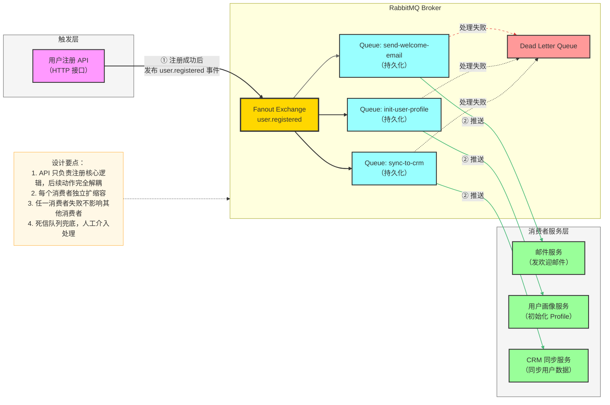

---

## 三、Kafka vs RabbitMQ 对比分析

### 3.1 核心设计哲学对比

| 维度 | Kafka | RabbitMQ |
|------|-------|----------|
| **设计定位** | 分布式日志/流处理平台 | 企业级消息代理（AMQP） |
| **消费模型** | Pull（消费者主动拉取） | Push（Broker 主动推送） |
| **消息存储** | 持久化磁盘日志，默认保留 7 天 | 消费后即删除（持久化仅用于防崩溃丢失） |
| **消息回溯** | 支持，通过重置 Offset | 不支持（消息一旦消费即删除） |
| **路由能力** | 简单（Topic + Partition） | 丰富（Direct/Fanout/Topic/Headers） |
| **消息顺序** | 分区内严格有序 | 单队列有序，多消费者时不保证 |
| **吞吐量** | 极高（百万级 TPS） | 中等（万~十万级 TPS） |
| **延迟** | 毫秒级（批量发送时稍高） | 微秒~毫秒级（单条低延迟更优） |
| **协议** | 自定义二进制协议 | AMQP 0-9-1、STOMP、MQTT |
| **语言** | Scala/Java | Erlang |
| **运维复杂度** | 较高（需管理分区、副本、ZooKeeper） | 中等（单机易用，集群配置复杂） |
| **生态集成** | Flink、Spark、Hadoop、Kafka Streams | Spring AMQP、Celery、Laravel Queue |

### 3.2 关键指标对比表

| 指标 | Kafka | RabbitMQ | 说明 |
|------|-------|----------|------|
| **吞吐量** | ★★★★★ | ★★★☆☆ | Kafka 顺序写磁盘 + 零拷贝，百万 TPS |
| **延迟** | ★★★☆☆ | ★★★★★ | RabbitMQ 单条消息延迟更低 |
| **可靠性** | ★★★★★ | ★★★★★ | 两者均支持持久化 + 确认机制 |
| **路由灵活性** | ★★☆☆☆ | ★★★★★ | RabbitMQ 4种Exchange，路由能力强 |
| **消息回溯** | ★★★★★ | ★☆☆☆☆ | Kafka 独有优势 |
| **顺序保证** | ★★★★☆ | ★★★☆☆ | Kafka 分区内严格有序 |
| **扩展性** | ★★★★★ | ★★★☆☆ | Kafka 分区机制天然水平扩展 |
| **易用性** | ★★★☆☆ | ★★★★☆ | RabbitMQ 概念更直观 |
| **社区生态** | ★★★★★ | ★★★★☆ | 均有庞大社区 |

### 3.3 选型决策流程图

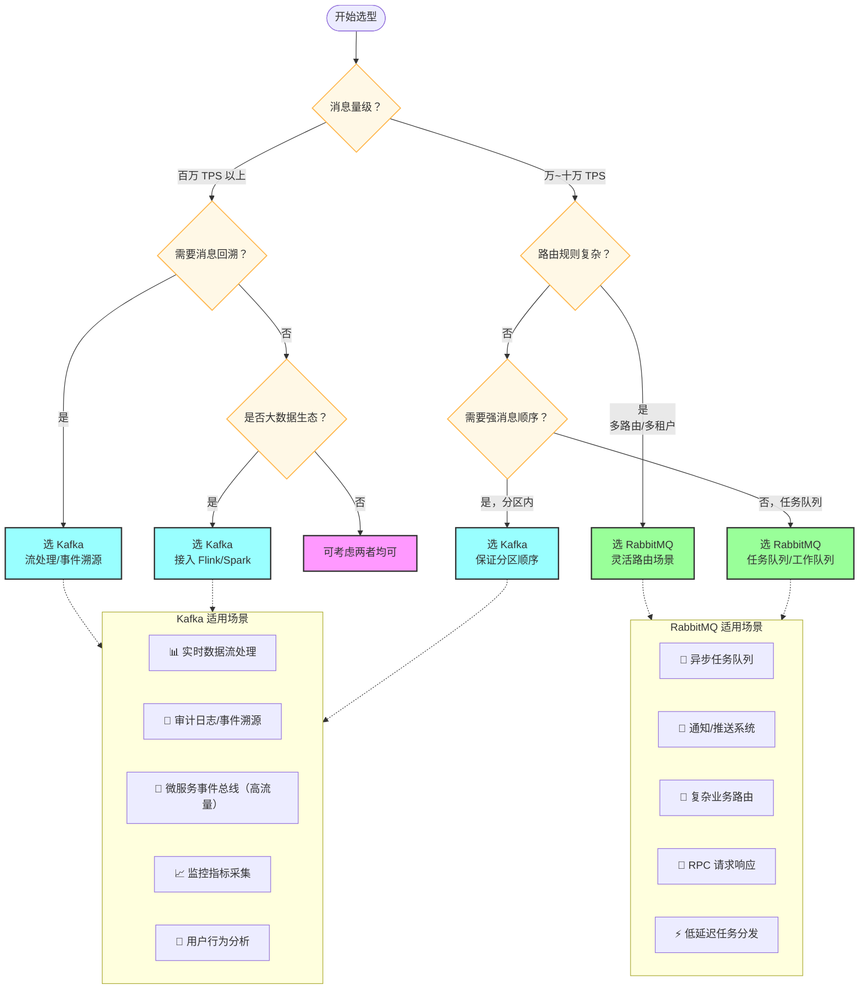

### 3.4 典型应用场景对比

#### 场景一：日志收集与分析

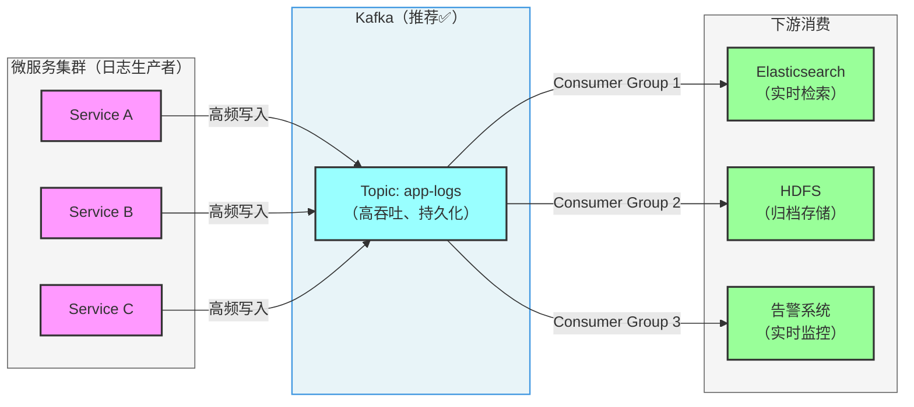

**为什么选 Kafka？**
- 日志量大，需要极高吞吐（每秒百万条）
- 需要多下游同时消费同一份日志（多 Consumer Group）
- 需要历史回溯（定位问题时重新消费历史日志）

#### 场景二：订单通知系统

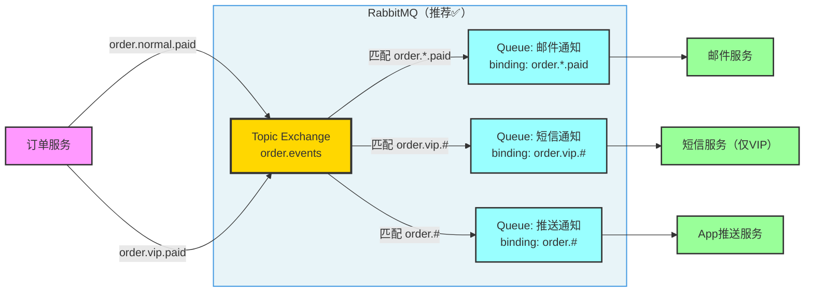

**为什么选 RabbitMQ？**
- 需要灵活的路由（VIP 订单额外发短信，普通订单只发邮件和推送）
- 消息量适中，不需要极高吞吐
- 每条消息消费一次即完成，不需要回溯

---

## 四、面试常见问题 FAQ

### Kafka 相关问题

---

**Q1：Kafka 如何保证消息不丢失？**

**A：** 需要从生产者、Broker、消费者三端同时保障：

| 环节 | 配置/措施 |
|------|---------|
| **生产者** | `acks=all`（等待所有 ISR 副本写入确认）；`retries=3`（失败重试）；`max.in.flight.requests.per.connection=1`（防止重试乱序） |
| **Broker** | `replication.factor≥3`（副本数）；`min.insync.replicas=2`（最少 ISR 副本数，低于此值拒绝写入）；`unclean.leader.election.enable=false`（禁止非 ISR 成员当选 Leader） |
| **消费者** | `enable.auto.commit=false`（关闭自动提交）；先处理完消息再手动提交 Offset |

---

**Q2：Kafka 消费者组的 Rebalance 是什么？何时触发？如何减少影响？**

**A：**

**Rebalance** 是消费者组内分区重新分配的过程，触发后所有消费者暂停消费（Stop The World）。

**触发条件：**
1. 消费者加入或退出消费者组
2. Topic 分区数变化
3. 消费者心跳超时（`session.timeout.ms` 内未发送心跳）
4. 消费者 `poll()` 间隔超过 `max.poll.interval.ms`

**减少影响：**
- 增大 `session.timeout.ms` 和 `heartbeat.interval.ms` 的比例（session/heartbeat ≥ 3）
- 增大 `max.poll.interval.ms`，避免业务处理慢导致误判超时
- 使用 Static Group Membership（`group.instance.id`），成员重启后保留分区分配，避免不必要 Rebalance
- 使用 Cooperative Sticky Assignor 替代 Eager 策略，减少重分配范围

---

**Q3：Kafka 中如何保证消息顺序性？**

**A：**
- Kafka 只保证**同一分区内**的消息顺序
- 要保证特定消息的顺序（如同一订单的所有事件），需要将相关消息发到同一分区：使用同一个 Key（Kafka 对 Key 哈希取模分配分区）
- 单分区只分配一个消费者，避免多消费者并发打乱顺序
- 若需全局顺序（极少见），则只能使用 1 个分区，但这会损失并行处理能力

---

**Q4：Kafka 的 ISR 机制是什么？Leader 和 Follower 如何选举？**

**A：**

**ISR（In-Sync Replica）** 是与 Leader 副本保持同步的副本集合。同步的判断标准：Follower 在 `replica.lag.time.max.ms`（默认 30 秒）内未落后于 Leader 超过阈值。

**Leader 选举流程：**
1. Leader 宕机后，Controller（由 ZooKeeper 选举产生的集群控制器）感知到
2. Controller 从 ISR 列表中选出新 Leader（ISR 中第一个可用副本）
3. 更新 ZooKeeper 中的元数据，通知其他 Broker 和 Producer/Consumer

若 ISR 为空：
- `unclean.leader.election.enable=true`：允许 OSR（Out-of-Sync Replica）成员当选，可能丢数据
- `unclean.leader.election.enable=false`（推荐）：宁可不可用也不丢数据

---

**Q5：Kafka 为什么比传统 MQ 吞吐量高？**

**A：** 主要有以下 5 点原因：

1. **顺序写磁盘**：追加写入日志文件，顺序 I/O 速度远超随机 I/O
2. **零拷贝（Zero-Copy）**：`sendfile()` 系统调用直接从内核缓冲区传输到网卡，减少 2 次数据拷贝和 2 次系统调用
3. **批量发送与压缩**：Producer 将多条消息打包成 Batch，压缩后发送，减少网络 RTT 和带宽
4. **Page Cache 利用**：消费者通常消费最新消息，命中 OS Page Cache，无需磁盘 I/O
5. **分区并行**：多分区多消费者并行处理，吞吐量线性扩展

---

**Q6：Kafka 的 Exactly-Once 语义如何实现？**

**A：** Kafka 通过两个机制组合实现 Exactly-Once：

**1. 幂等生产者（Idempotent Producer）：**
- 每条消息附带 PID（Producer ID）和 Sequence Number
- Broker 对同一 PID 的重复消息（相同 Sequence Number）进行去重
- 通过 `enable.idempotence=true` 开启

**2. 事务（Transactions）：**
- 跨分区的原子写入，多个分区的消息要么全部提交，要么全部回滚
- 通过 `transactional.id` 开启，支持跨会话的精确一次语义

```python
# 事务 Producer 示例
from confluent_kafka import Producer

producer = Producer({
    'bootstrap.servers': 'localhost:9092',
    'transactional.id': 'order-tx-001',
    'enable.idempotence': True,
})

producer.init_transactions()
try:
    producer.begin_transaction()
    producer.produce('orders', key='ORD-001', value='{"status":"created"}')
    producer.produce('inventory', key='SKU-001', value='{"qty":-1}')
    producer.commit_transaction()
except Exception as e:
    producer.abort_transaction()
    raise
```

---

**Q7：Kafka 的 Log Compaction 是什么？**

**A：** Log Compaction（日志压实）是 Kafka 的一种清理策略，与基于时间的 `log.retention.ms` 不同：

- **普通保留策略**：超过时间/大小阈值的整个日志段被删除
- **Log Compaction**：只保留每个 Key 的最新一条消息，删除旧版本

**适用场景：** 数据库变更日志（CDC）、用户最新配置、KV 状态存储等，消费者重启后只需读取最新状态而非全量历史。

**配置：** `cleanup.policy=compact`（或 `delete,compact` 两者兼用）

---

### RabbitMQ 相关问题

---

**Q8：RabbitMQ 如何保证消息不丢失？**

**A：** 同样需要三端配合：

| 环节 | 配置/措施 |
|------|---------|
| **生产者** | 开启 Publisher Confirm（`channel.confirm_delivery()`），等待 Broker ACK 后才确认发送成功；开启事务模式（性能差，不推荐） |
| **Broker** | Exchange 声明为 `durable=True`；Queue 声明为 `durable=True`；消息设置 `delivery_mode=2`（持久化） |
| **消费者** | 关闭 `auto_ack`，使用手动 `basic_ack`；设置死信队列兜底 |

**注意：** 三者缺一不可。仅持久化 Queue 而消息不持久化，重启后消息仍然丢失。

---

**Q9：RabbitMQ 的死信队列（DLQ）工作原理是什么？**

**A：** 死信队列本质上是一种路由机制，通过 **死信交换机（DLX）** 实现：

**触发条件（消息变为死信）：**
1. 消费者 `basic_nack` / `basic_reject` 且 `requeue=False`
2. 消息 TTL（`x-message-ttl`）过期
3. 队列达到最大长度（`x-max-length`）

**配置示例：**

```python
# 声明死信交换机和死信队列
channel.exchange_declare(exchange='dlx.direct', exchange_type='direct', durable=True)
channel.queue_declare(queue='dead-letter-queue', durable=True)
channel.queue_bind(queue='dead-letter-queue', exchange='dlx.direct', routing_key='dead')

# 业务队列绑定死信交换机
channel.queue_declare(
    queue='business-queue',
    durable=True,
    arguments={
        'x-dead-letter-exchange': 'dlx.direct',
        'x-dead-letter-routing-key': 'dead',
        'x-message-ttl': 30000,   # 30秒 TTL
    }
)
```

**常见用途：** 失败消息人工排查、延迟重试（TTL + DLX 实现延迟队列）

---

**Q10：RabbitMQ 如何实现延迟队列？**

**A：** RabbitMQ 原生不支持延迟队列，有两种实现方式：

**方式一：TTL + 死信队列（推荐，无需插件）**

```
消息 → 业务队列（设置 TTL=30s，无消费者）
         ↓ （TTL 到期，变为死信）
         → 死信交换机 → 目标队列（有消费者，实际处理）
```

**方式二：安装 `rabbitmq_delayed_message_exchange` 插件**

```bash
# 安装插件
rabbitmq-plugins enable rabbitmq_delayed_message_exchange

# 使用
channel.exchange_declare(
    exchange='delayed.exchange',
    exchange_type='x-delayed-message',
    arguments={'x-delayed-type': 'direct'}
)
channel.basic_publish(
    exchange='delayed.exchange',
    routing_key='task',
    body=b'delayed task',
    properties=pika.BasicProperties(
        headers={'x-delay': 30000}  # 延迟 30 秒
    )
)
```

---

**Q11：RabbitMQ 的 Channel 和 Connection 有什么区别？为什么要使用 Channel？**

**A：**

- **Connection**：客户端与 Broker 之间的物理 TCP 连接，创建成本高（TCP 三次握手 + TLS 协商）
- **Channel**：在 Connection 上复用的逻辑通道，一个 Connection 可以有多个 Channel，创建成本极低

**最佳实践：**
- 每个进程维护 1~2 个 Connection
- 每个线程/协程使用独立的 Channel（Channel 非线程安全）
- 不要在线程间共享 Channel

---

**Q12：RabbitMQ 集群模式与镜像队列（Mirrored Queue）是什么？**

**A：**

**普通集群：** 队列数据只存储在一个节点（主节点），其他节点只保存元数据。消费者连接到非主节点时，消息会通过节点间转发。主节点宕机，队列不可用。

**镜像队列（Quorum Queue 的前身）：** 队列在多个节点上各有一份完整副本。主节点宕机后，镜像节点自动接管，实现高可用。配置：
```bash
rabbitmqctl set_policy ha-all "^ha\." '{"ha-mode":"all"}'
```

**Quorum Queue（推荐，RabbitMQ 3.8+）：** 基于 Raft 协议的新型持久化队列，取代镜像队列，提供更强的一致性保证和更简单的运维。

---

### Kafka vs RabbitMQ 综合问题

---

**Q13：什么场景下选 Kafka，什么场景下选 RabbitMQ？**

**A：**

**选 Kafka 的场景：**
- 日志收集与实时分析（ELK Stack 的 K 通常用 Kafka 替代 Logstash Forwarder）
- 用户行为埋点数据收集
- 微服务事件溯源（Event Sourcing）
- 实时流处理（对接 Flink、Spark Streaming）
- 需要消息回溯（历史数据重放）
- 吞吐量要求极高（百万 TPS）

**选 RabbitMQ 的场景：**
- 异步任务队列（Celery + RabbitMQ 是 Python 生态的经典组合）
- 复杂业务路由（不同条件路由到不同处理器）
- RPC 请求/响应模式（`reply_to` 属性实现）
- 延迟任务（TTL + 死信队列）
- 消息量适中，对延迟敏感（微秒级延迟要求）
- 需要消费者处理完才删消息（精确的任务完成追踪）

---

**Q14：Kafka 和 RabbitMQ 都能保证 Exactly-Once 语义吗？**

**A：**

| | Kafka | RabbitMQ |
|--|-------|----------|
| **At-Most-Once** | Producer `acks=0` | `auto_ack=True` |
| **At-Least-Once** | `acks=all` + 手动提交 Offset | Publisher Confirm + 手动 ACK |
| **Exactly-Once** | 幂等 Producer + 事务（生产者侧）；消费者侧需业务幂等 | 不原生支持，需业务层实现幂等 |

**结论：** Kafka 在 Broker 层支持 Exactly-Once（通过幂等 + 事务），但端到端（含消费者业务处理）的 Exactly-Once 仍需业务幂等设计。RabbitMQ 不原生支持，需业务自行实现（如数据库唯一索引、Redis SETNX 去重）。

---

**Q15：如果让你在一个新项目中选型消息队列，你会如何评估？**

**A：** 按以下维度系统评估：

```
1. 消息量级：
   - 日均 10 亿+ 条 → Kafka（高吞吐设计）
   - 日均 1000 万以下 → RabbitMQ 或其他（Kafka 有一定运维成本）

2. 业务特性：
   - 需要消息回溯/事件溯源 → Kafka
   - 需要复杂路由/延迟队列 → RabbitMQ
   - 与大数据生态（Flink/Spark）集成 → Kafka

3. 团队技术栈：
   - Python + Celery → RabbitMQ（生态成熟）
   - Java + Spring → 两者均可
   - Go → 两者均有成熟客户端

4. 运维能力：
   - 运维资源有限 → RabbitMQ（单机运维简单）
   - 有专职中间件团队 → Kafka（性能更强）

5. 云原生环境：
   - AWS → Amazon MSK（托管 Kafka）/ SQS（托管队列）
   - 阿里云 → Confluent Kafka / RocketMQ（国内更常见）
   - 自建 → 根据上述原则选择
```

---

> **文档版本：** v1.0 | **最后更新：** 2026-03
> 
> **参考资料：**
> - [Apache Kafka 官方文档](https://kafka.apache.org/documentation/)
> - [RabbitMQ 官方文档](https://www.rabbitmq.com/documentation.html)
> - [Kafka: The Definitive Guide（O'Reilly）](https://www.confluent.io/resources/kafka-the-definitive-guide/)
> - [RabbitMQ in Action（Manning）](https://www.manning.com/books/rabbitmq-in-action)
