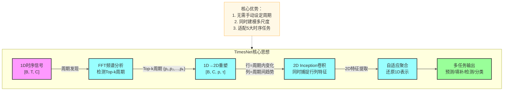
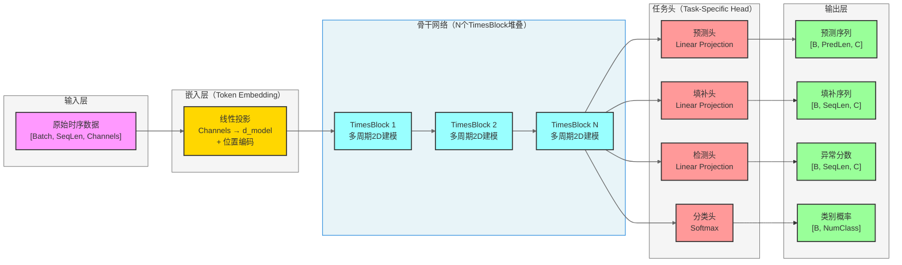
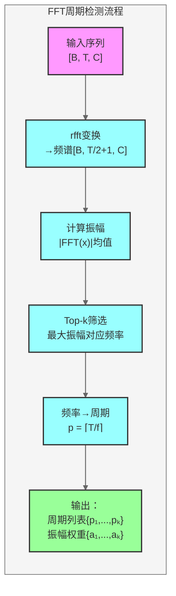
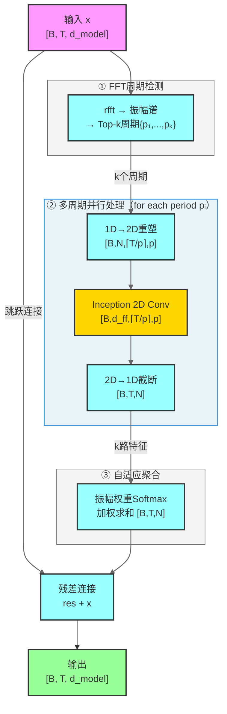
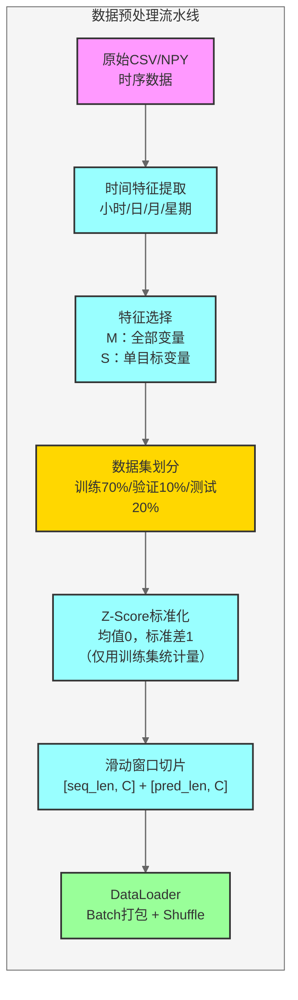
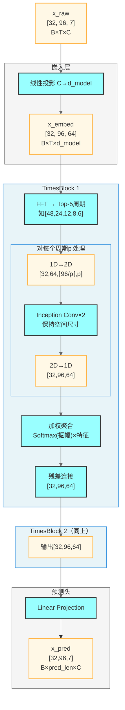
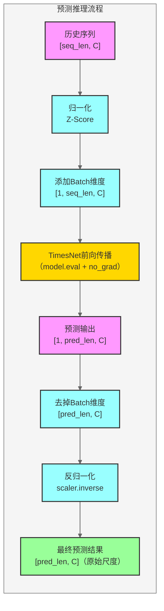

# TimesNet 时序模型深度解析

> 文档版本：v1.0 | 更新日期：2026-03-16  
> 论文来源：[TimesNet: Temporal 2D-Variation Modeling for General Time Series Analysis](https://arxiv.org/abs/2210.02186)（ICLR 2023）

---

## 目录

1. [模型概述与核心思想](#1-模型概述与核心思想)
2. [基础架构总览](#2-基础架构总览)
3. [核心组件详解](#3-核心组件详解)
   - 3.1 [FFT 周期检测模块](#31-fft-周期检测模块)
   - 3.2 [1D→2D 变换模块](#32-1d2d-变换模块)
   - 3.3 [TimesBlock](#33-timesblock)
   - 3.4 [Inception 二维卷积网络](#34-inception-二维卷积网络)
   - 3.5 [自适应聚合模块](#35-自适应聚合模块)
4. [数据构建与预处理](#4-数据构建与预处理)
5. [数据流转路径（含维度）](#5-数据流转路径含维度)
6. [训练流程](#6-训练流程)
7. [评估流程](#7-评估流程)
8. [预测流程](#8-预测流程)
9. [完整代码示例](#9-完整代码示例)
10. [面试常见问题 FAQ](#10-面试常见问题-faq)

---

## 1. 模型概述与核心思想

### 1.1 背景与动机

时间序列分析是许多现实场景的核心任务，包括：

- **长期预测**（Long-term Forecasting）：电力负荷预测、股票走势预测
- **短期预测**（Short-term Forecasting）：天气预报、流量预测
- **缺失值填补**（Imputation）：传感器数据补全
- **异常检测**（Anomaly Detection）：设备故障检测
- **分类**（Classification）：动作识别、EEG信号分类

传统时序方法（RNN、LSTM、Transformer）主要在**一维时间维度**上进行建模，难以同时捕捉多个时间尺度的周期性规律。

### 1.2 核心洞察：时序的二维周期性

TimesNet 的核心洞察是：**真实世界的时间序列在多个时间尺度上同时存在周期性**。

例如，用电量数据同时存在：
- **日内周期**（period=24）：白天高、夜晚低
- **周周期**（period=168）：工作日与周末的差异
- **年周期**（period=8760）：季节性变化

这些周期性规律可以通过**傅里叶变换（FFT）**自动检测，并将一维时序**重塑为二维矩阵**，从而用**二维卷积**同时捕捉：
- **行方向（intra-period）**：同一周期内的短程变化
- **列方向（inter-period）**：多个周期之间的长程趋势



---

## 2. 基础架构总览

TimesNet 是一个**通用时序分析框架**，通过堆叠多个 TimesBlock 构建深度网络，并根据不同任务配置不同的输入嵌入和输出头。



### 关键超参数说明

| 参数 | 含义 | 典型值 |
|------|------|--------|
| `seq_len` | 输入序列长度 | 96 / 336 / 720 |
| `pred_len` | 预测步长 | 96 / 192 / 336 / 720 |
| `d_model` | 模型隐层维度 | 32 / 64 |
| `d_ff` | FFN中间层维度 | 32 / 64 |
| `top_k` | 检测的主要周期数 | 5 |
| `num_kernels` | Inception卷积核数量 | 6 |
| `e_layers` | TimesBlock堆叠层数 | 2 |

---

## 3. 核心组件详解

### 3.1 FFT 周期检测模块

FFT（快速傅里叶变换）是 TimesNet 的第一步，用于自动发现时序中的主要周期。

**数学原理：**

对输入序列 $\mathbf{x} \in \mathbb{R}^T$ 做 FFT：

$$A = \text{Avg}\left(\left|\text{FFT}(\mathbf{x})\right|\right)$$

选取振幅最大的 Top-k 个频率 $\{f_1, f_2, \ldots, f_k\}$，对应周期为：

$$p_i = \left\lceil \frac{T}{f_i} \right\rceil$$

```python
import torch
import torch.fft

def fft_period_detection(x: torch.Tensor, top_k: int = 5):
    """
    FFT周期检测
    Args:
        x: [B, T, C] 输入时序
        top_k: 检测的主要周期数量
    Returns:
        period_list: 检测到的周期长度列表
        period_weight: 各周期对应的振幅权重
    """
    B, T, C = x.shape
    # 对时间维度做FFT，取正频率部分
    xf = torch.fft.rfft(x, dim=1)  # [B, T//2+1, C]
    
    # 计算振幅谱，在batch和channel维度取平均
    amplitude = torch.mean(torch.abs(xf), dim=[0, 2])  # [T//2+1]
    
    # 去掉直流分量（f=0）
    amplitude[0] = 0
    
    # 选Top-k频率
    _, top_freq_indices = torch.topk(amplitude, top_k)
    
    # 频率→周期（向上取整）
    period_list = []
    for freq_idx in top_freq_indices:
        period = (T // freq_idx.item()) if freq_idx.item() > 0 else T
        period_list.append(max(1, period))
    
    # 对应振幅作为权重
    period_weight = amplitude[top_freq_indices]
    return period_list, period_weight
```



---

### 3.2 1D→2D 变换模块

将一维时序重塑为二维矩阵，这是 TimesNet 的核心创新之一。

**变换逻辑：**

对于检测到的周期 $p$，将长度为 $T$ 的序列补零至 $p \times \lceil T/p \rceil$，然后重塑为：

$$\mathbf{X}_{2D} \in \mathbb{R}^{B \times C \times \lceil T/p \rceil \times p}$$

- **行维度** $\lceil T/p \rceil$：inter-period，周期间的**长程趋势**
- **列维度** $p$：intra-period，周期内的**短程变化**

```python
def reshape_1d_to_2d(x: torch.Tensor, period: int):
    """
    1D序列 → 2D矩阵
    Args:
        x: [B, T, C]
        period: 当前周期长度
    Returns:
        x_2d: [B, C, T//period + 1, period] (补零后)
        length: 原始序列长度T
    """
    B, T, C = x.shape
    # 计算需要的行数（向上取整）
    num_rows = (T + period - 1) // period  # ≈ ⌈T/p⌉
    
    # 补零到可被period整除
    pad_len = num_rows * period - T
    if pad_len > 0:
        x = torch.cat([x, torch.zeros(B, pad_len, C, device=x.device)], dim=1)
    
    # [B, T_padded, C] → [B, C, num_rows, period]
    x_2d = x.reshape(B, num_rows, period, C)   # [B, rows, period, C]
    x_2d = x_2d.permute(0, 3, 1, 2)            # [B, C, rows, period]
    
    return x_2d, T
```

**示例（T=100, period=24）：**

```
原始序列: [B, 100, C]
补零至:   [B, 120, C]  (5 × 24 = 120)
重塑为:   [B, C, 5, 24]
          ↑行=5个完整周期(inter-period趋势)
               ↑列=24个时间步(intra-period变化)
```

---

### 3.3 TimesBlock

TimesBlock 是整个模型的核心计算单元，它对每个检测到的周期分别进行 2D 建模，最后加权融合。

```python
import torch
import torch.nn as nn

class TimesBlock(nn.Module):
    def __init__(self, configs):
        super().__init__()
        self.seq_len = configs.seq_len
        self.pred_len = configs.pred_len
        self.top_k = configs.top_k
        
        # 2D卷积backbone（Inception模块）
        self.conv = nn.Sequential(
            Inception_Block_V1(
                in_channels=configs.d_model,
                out_channels=configs.d_ff,
                num_kernels=configs.num_kernels
            ),
            nn.GELU(),
            Inception_Block_V1(
                in_channels=configs.d_ff,
                out_channels=configs.d_model,
                num_kernels=configs.num_kernels
            )
        )
    
    def forward(self, x: torch.Tensor) -> torch.Tensor:
        """
        Args:
            x: [B, T, d_model]
        Returns:
            res: [B, T, d_model]  残差连接后的输出
        """
        B, T, N = x.shape
        
        # Step 1: FFT检测Top-k周期
        period_list, period_weight = fft_period_detection(x, self.top_k)
        
        res_list = []
        for period in period_list:
            # Step 2: 1D → 2D
            x_2d, length = reshape_1d_to_2d(x, period)   # [B, N, rows, period]
            
            # Step 3: 2D Inception卷积
            x_2d = self.conv(x_2d)                        # [B, N, rows, period]
            
            # Step 4: 2D → 1D，截断回原始长度
            x_2d = x_2d.permute(0, 2, 3, 1)              # [B, rows, period, N]
            x_1d = x_2d.reshape(B, -1, N)[:, :T, :]      # [B, T, N]
            res_list.append(x_1d)
        
        # Step 5: 自适应聚合（振幅权重Softmax加权求和）
        res_stack = torch.stack(res_list, dim=-1)          # [B, T, N, k]
        period_weight = torch.softmax(period_weight, dim=0)# [k]
        res = torch.sum(res_stack * period_weight, dim=-1) # [B, T, N]
        
        # Step 6: 残差连接
        return res + x
```



---

### 3.4 Inception 二维卷积网络

TimesNet 使用多核 Inception 风格的 2D 卷积，同时以不同尺度的卷积核感知局部特征，避免固定感受野的局限。

```python
class Inception_Block_V1(nn.Module):
    """
    多尺度Inception 2D卷积块
    使用多个不同尺寸卷积核并行提取特征后拼接
    """
    def __init__(self, in_channels: int, out_channels: int, num_kernels: int = 6):
        super().__init__()
        # 生成num_kernels个不同大小的卷积核（奇数，如1,3,5,7,9,11）
        self.kernels = nn.ModuleList([
            nn.Conv2d(
                in_channels, out_channels,
                kernel_size=(2 * i + 1, 2 * i + 1),
                padding=i  # 保持空间尺寸不变
            )
            for i in range(num_kernels)
        ])
        self._init_weights()
    
    def _init_weights(self):
        for conv in self.kernels:
            nn.init.kaiming_normal_(conv.weight, mode='fan_out')
    
    def forward(self, x: torch.Tensor) -> torch.Tensor:
        """
        Args:
            x: [B, in_channels, H, W]
        Returns:
            out: [B, out_channels, H, W]
        """
        # 每个卷积核独立计算，最终取平均
        outputs = [conv(x) for conv in self.kernels]
        return torch.stack(outputs, dim=-1).mean(dim=-1)
```

**Inception 多尺度优势：**

| 卷积核大小 | 感受野 | 捕捉能力 |
|-----------|--------|----------|
| 1×1 | 单点 | 通道融合 |
| 3×3 | 3×3 | 细粒度局部特征 |
| 5×5 | 5×5 | 中等范围依赖 |
| 7×7 | 7×7 | 较大范围模式 |
| ... | ... | ... |
| (2k+1)×(2k+1) | 大感受野 | 跨周期长程模式 |

---

### 3.5 自适应聚合模块

将 k 个周期对应的特征通过**振幅加权 Softmax** 融合，让数据主导哪个周期的贡献更大。

```python
def adaptive_aggregation(
    res_list: list[torch.Tensor],  # 每个: [B, T, N]
    period_weight: torch.Tensor    # [k]，来自FFT振幅
) -> torch.Tensor:
    """
    自适应聚合多周期特征
    振幅越大的周期，在融合中权重越高
    """
    # 堆叠 k 个周期的结果
    res_stack = torch.stack(res_list, dim=-1)          # [B, T, N, k]
    
    # Softmax归一化振幅权重
    weights = torch.softmax(period_weight, dim=0)       # [k]
    
    # 加权求和
    return torch.sum(res_stack * weights, dim=-1)       # [B, T, N]
```

---

## 4. 数据构建与预处理

### 4.1 常用数据集

TimesNet 论文中使用的基准数据集：

| 数据集 | 领域 | 通道数 | 时间步数 | 任务 |
|--------|------|--------|----------|------|
| ETTh1/ETTh2 | 电力变压器（小时级） | 7 | 17,420 | 预测 |
| ETTm1/ETTm2 | 电力变压器（分钟级） | 7 | 69,680 | 预测 |
| Weather | 气象数据 | 21 | 52,696 | 预测 |
| Traffic | 交通流量 | 862 | 17,544 | 预测 |
| Electricity | 电力消费 | 321 | 26,304 | 预测 |
| MSL/SMAP | 航天器遥测 | 55/25 | 73,729/427,617 | 异常检测 |
| UEA | 多变量时序分类 | 多种 | 多种 | 分类 |

### 4.2 数据集目录结构

```
dataset/
├── ETT-small/
│   ├── ETTh1.csv
│   ├── ETTh2.csv
│   ├── ETTm1.csv
│   └── ETTm2.csv
├── weather/
│   └── weather.csv
├── traffic/
│   └── traffic.csv
├── electricity/
│   └── electricity.csv
└── MSL/
    ├── MSL_train.npy
    └── MSL_test.npy
```

### 4.3 数据预处理流程

```python
import pandas as pd
import numpy as np
from sklearn.preprocessing import StandardScaler

class TimeSeriesDataset(torch.utils.data.Dataset):
    """
    通用时序数据集（支持预测/填补/检测/分类任务）
    """
    def __init__(
        self,
        data_path: str,
        flag: str = "train",           # train/val/test
        seq_len: int = 96,
        pred_len: int = 96,
        features: str = "M",           # M=多变量, S=单变量
        target: str = "OT",            # 预测目标列（单变量时使用）
        scale: bool = True,            # 是否标准化
    ):
        self.seq_len = seq_len
        self.pred_len = pred_len
        self.features = features
        self.scale = scale
        self.scaler = StandardScaler()
        
        self._load_and_split(data_path, flag)
    
    def _load_and_split(self, path: str, flag: str):
        df = pd.read_csv(path)
        
        # 划分比例：训练70%，验证10%，测试20%
        n = len(df)
        borders = {
            "train": (0, int(n * 0.7)),
            "val":   (int(n * 0.7), int(n * 0.8)),
            "test":  (int(n * 0.8), n),
        }
        start, end = borders[flag]
        
        # 特征选择
        if self.features == "M":
            data = df.iloc[:, 1:].values  # 去掉时间戳列
        else:
            data = df[[self.target]].values
        
        # 标准化（仅用训练集统计量）
        if self.scale:
            train_data = df.iloc[:int(n * 0.7), 1:].values
            self.scaler.fit(train_data)
            data = self.scaler.transform(data)
        
        self.data = data[start:end]
    
    def __len__(self):
        return len(self.data) - self.seq_len - self.pred_len + 1
    
    def __getitem__(self, idx: int):
        x = self.data[idx : idx + self.seq_len]                              # [seq_len, C]
        y = self.data[idx + self.seq_len : idx + self.seq_len + self.pred_len]  # [pred_len, C]
        return torch.tensor(x, dtype=torch.float32), torch.tensor(y, dtype=torch.float32)
    
    def inverse_transform(self, data: np.ndarray) -> np.ndarray:
        """反归一化，用于预测结果还原"""
        return self.scaler.inverse_transform(data)
```



---

## 5. 数据流转路径（含维度）

以下以 **ETTh1 多变量预测** 为例，完整追踪数据在模型中的维度变化。

**配置参数：**
- `batch_size = 32`，`seq_len = 96`，`pred_len = 96`
- `channels C = 7`，`d_model = 64`，`d_ff = 64`
- `top_k = 5`，`num_kernels = 6`，`e_layers = 2`

### 5.1 前向传播维度追踪

```
步骤 1 - 原始输入
  x_raw:         [32, 96, 7]      (B, seq_len, C)

步骤 2 - 嵌入层（Token Embedding）
  线性投影:      [32, 96, 7] → [32, 96, 64]
  位置编码:      [32, 96, 64] + [1, 96, 64]
  x_embed:       [32, 96, 64]     (B, seq_len, d_model)

步骤 3 - TimesBlock 1
  ┌─ FFT检测
  │   xf (rfft): [32, 49, 64]     (B, seq_len//2+1, d_model)
  │   amplitude: [49]             (频域振幅，均值后)
  │   top-k周期: [48, 24, 12, 8, 6] (示例：检测到的5个周期)
  │
  ├─ 对周期 p=24 进行处理：
  │   1D→2D:     [32, 64, 4, 24]  (B, d_model, ⌈96/24⌉=4, 24)
  │   Conv2D 1:  [32, 64, 4, 24]  (B, d_ff, H, W) [padding保持尺寸]
  │   GELU激活
  │   Conv2D 2:  [32, 64, 4, 24]  (B, d_model, H, W)
  │   2D→1D:     [32, 96, 64]     截断补零部分
  │
  ├─ 对其余4个周期重复以上步骤...
  │
  ├─ 自适应聚合
  │   stack:     [32, 96, 64, 5]  (B, T, N, k)
  │   weights:   [5]              Softmax后的振幅权重
  │   加权求和:  [32, 96, 64]
  │
  └─ 残差连接:   [32, 96, 64] + [32, 96, 64]
  x_block1:      [32, 96, 64]     (B, seq_len, d_model)

步骤 4 - TimesBlock 2 (结构同上)
  x_block2:      [32, 96, 64]     (B, seq_len, d_model)

步骤 5 - 预测头（Linear Projection）
  展平:          [32, 96, 64] → [32, 96×64] → [32, 96, 7]
  或直接线性:    [32, 96, 64] → [32, 96, 7]  (逐通道)
  x_pred:        [32, 96, 7]      (B, pred_len, C)
```



### 5.2 各任务输出维度对比

| 任务 | 编码器输出 | 任务头操作 | 最终输出 |
|------|----------|-----------|----------|
| 长期预测 | [B, seq_len, d_model] | Linear: seq_len→pred_len | [B, pred_len, C] |
| 短期预测 | [B, seq_len, d_model] | Linear | [B, pred_len, C] |
| 填补 | [B, seq_len, d_model] | Linear: d_model→C | [B, seq_len, C] |
| 异常检测 | [B, seq_len, d_model] | Linear: d_model→C | [B, seq_len, C] |
| 分类 | [B, seq_len, d_model] | Flatten + Linear + Softmax | [B, num_classes] |

---

## 6. 训练流程

### 6.1 完整训练代码

```python
import torch
import torch.nn as nn
from torch.utils.data import DataLoader
from torch.optim import Adam
from torch.optim.lr_scheduler import OneCycleLR

class TimesNetTrainer:
    def __init__(self, model, configs):
        self.model = model
        self.configs = configs
        self.device = torch.device("cuda" if torch.cuda.is_available() else "cpu")
        self.model.to(self.device)
        
        self.optimizer = Adam(
            model.parameters(),
            lr=configs.learning_rate,
            weight_decay=configs.weight_decay
        )
        self.criterion = nn.MSELoss()
        self.early_stopping = EarlyStopping(patience=3, verbose=True)
    
    def train_epoch(self, train_loader: DataLoader) -> float:
        self.model.train()
        total_loss = 0.0
        
        for batch_x, batch_y in train_loader:
            batch_x = batch_x.to(self.device)   # [B, seq_len, C]
            batch_y = batch_y.to(self.device)   # [B, pred_len, C]
            
            self.optimizer.zero_grad()
            
            # 前向传播
            pred = self.model(batch_x)           # [B, pred_len, C]
            
            # 计算损失
            loss = self.criterion(pred, batch_y)
            
            # 反向传播
            loss.backward()
            nn.utils.clip_grad_norm_(self.model.parameters(), max_norm=1.0)
            self.optimizer.step()
            
            total_loss += loss.item()
        
        return total_loss / len(train_loader)
    
    def validate(self, val_loader: DataLoader) -> float:
        self.model.eval()
        total_loss = 0.0
        
        with torch.no_grad():
            for batch_x, batch_y in val_loader:
                batch_x = batch_x.to(self.device)
                batch_y = batch_y.to(self.device)
                pred = self.model(batch_x)
                loss = self.criterion(pred, batch_y)
                total_loss += loss.item()
        
        return total_loss / len(val_loader)
    
    def fit(self, train_loader, val_loader, epochs: int = 10):
        best_val_loss = float("inf")
        
        for epoch in range(epochs):
            train_loss = self.train_epoch(train_loader)
            val_loss = self.validate(val_loader)
            
            print(f"Epoch [{epoch+1}/{epochs}] "
                  f"Train Loss: {train_loss:.4f} | Val Loss: {val_loss:.4f}")
            
            # 早停
            self.early_stopping(val_loss, self.model)
            if self.early_stopping.early_stop:
                print("Early stopping triggered!")
                break
            
            # 保存最优模型
            if val_loss < best_val_loss:
                best_val_loss = val_loss
                torch.save(self.model.state_dict(), "best_model.pth")
        
        print(f"Training complete. Best Val Loss: {best_val_loss:.4f}")


class EarlyStopping:
    def __init__(self, patience: int = 3, verbose: bool = False, delta: float = 0.0):
        self.patience = patience
        self.verbose = verbose
        self.delta = delta
        self.counter = 0
        self.best_score = None
        self.early_stop = False
    
    def __call__(self, val_loss: float, model: nn.Module):
        score = -val_loss
        if self.best_score is None:
            self.best_score = score
        elif score < self.best_score + self.delta:
            self.counter += 1
            if self.verbose:
                print(f"EarlyStopping counter: {self.counter}/{self.patience}")
            if self.counter >= self.patience:
                self.early_stop = True
        else:
            self.best_score = score
            self.counter = 0
```



```mermaid
flowchart LR
    %% 样式定义
    classDef startStyle fill:#9f9,stroke:#333,stroke-width:2px
    classDef processStyle fill:#9ff,stroke:#333,stroke-width:2px
    classDef decisionStyle fill:#ffd700,stroke:#333,stroke-width:2px
    classDef endStyle fill:#f99,stroke:#333,stroke-width:2px
    classDef subgraphStyle fill:#f5f5f5,stroke:#666,stroke-width:1px
    classDef clusterStyle fill:#e8f4f8,stroke:#4299e1,stroke-width:1.5px

    A(["开始训练"]):::startStyle

    subgraph epoch_loop["Epoch循环"]
        subgraph train_loop["训练阶段"]
            B["遍历train_loader\n取(batch_x, batch_y)"]:::processStyle
            C["前向传播\npred = model(batch_x)"]:::processStyle
            D["计算MSE损失\nloss = MSE(pred, y)"]:::processStyle
            E["反向传播\nloss.backward()"]:::processStyle
            F["梯度裁剪\nmax_norm=1.0"]:::processStyle
            G["optimizer.step()"]:::processStyle
        end
        class train_loop subgraphStyle

        subgraph val_phase["验证阶段（no_grad）"]
            H["遍历val_loader\n计算验证Loss"]:::processStyle
        end
        class val_phase subgraphStyle

        I{"验证Loss\n是否改善?"}:::decisionStyle
        J["保存最优模型\nbest_model.pth"]:::processStyle
        K{"触发早停\ncounter≥patience?"}:::decisionStyle
    end
    class epoch_loop clusterStyle

    L(["训练结束\n加载最优权重"]):::endStyle

    A --> B --> C --> D --> E --> F --> G --> H --> I
    I -->|"是"| J --> K
    I -->|"否"| K
    K -->|"否，继续下一Epoch"| B
    K -->|"是，停止"| L

    linkStyle 0,1,2,3,4,5,6,7,8,9,10,11 stroke:#666,stroke-width:1.5px
```

### 6.2 损失函数选择

| 任务 | 推荐损失函数 | 说明 |
|------|------------|------|
| 长/短期预测 | MSELoss | 标准均方误差 |
| 填补 | MSELoss | 仅在mask位置计算 |
| 异常检测 | MSELoss | 重构误差作为异常分数 |
| 分类 | CrossEntropyLoss | 多类分类 |

---

## 7. 评估流程

### 7.1 评估指标

```python
import numpy as np

def compute_metrics(pred: np.ndarray, true: np.ndarray) -> dict:
    """
    计算时序预测标准评估指标
    Args:
        pred: [N, pred_len, C] 预测值
        true: [N, pred_len, C] 真实值
    Returns:
        指标字典
    """
    mae = np.mean(np.abs(pred - true))
    mse = np.mean((pred - true) ** 2)
    rmse = np.sqrt(mse)
    
    # 平均绝对百分比误差（避免除零）
    mask = np.abs(true) > 1e-6
    mape = np.mean(np.abs((pred[mask] - true[mask]) / true[mask])) * 100
    
    # 对称MAPE
    smape = np.mean(
        2 * np.abs(pred - true) / (np.abs(pred) + np.abs(true) + 1e-6)
    ) * 100
    
    return {
        "MAE": round(mae, 4),
        "MSE": round(mse, 4),
        "RMSE": round(rmse, 4),
        "MAPE(%)": round(mape, 4),
        "SMAPE(%)": round(smape, 4),
    }
```

### 7.2 完整测试评估

```python
def evaluate(model, test_loader, scaler=None, device="cuda"):
    model.eval()
    preds, trues = [], []
    
    with torch.no_grad():
        for batch_x, batch_y in test_loader:
            batch_x = batch_x.to(device)
            pred = model(batch_x).cpu().numpy()    # [B, pred_len, C]
            true = batch_y.numpy()                  # [B, pred_len, C]
            preds.append(pred)
            trues.append(true)
    
    preds = np.concatenate(preds, axis=0)          # [N, pred_len, C]
    trues = np.concatenate(trues, axis=0)          # [N, pred_len, C]
    
    # 反归一化（如果需要真实尺度的指标）
    if scaler is not None:
        B, L, C = preds.shape
        preds = scaler.inverse_transform(preds.reshape(-1, C)).reshape(B, L, C)
        trues = scaler.inverse_transform(trues.reshape(-1, C)).reshape(B, L, C)
    
    metrics = compute_metrics(preds, trues)
    print("=" * 40)
    for k, v in metrics.items():
        print(f"  {k:12s}: {v}")
    print("=" * 40)
    return metrics
```

### 7.3 TimesNet 基准性能（ETTh1，pred_len=96）

| 模型 | MSE | MAE |
|------|-----|-----|
| TimesNet | **0.384** | **0.402** |
| PatchTST | 0.414 | 0.419 |
| Autoformer | 0.449 | 0.459 |
| FEDformer | 0.376 | 0.419 |
| DLinear | 0.386 | 0.400 |

> 注：以上数据来自原论文，不同硬件和随机种子下可能略有差异。

---

## 8. 预测流程

### 8.1 单步预测推理

```python
import torch
import numpy as np

class TimesNetPredictor:
    def __init__(self, model_path: str, configs, scaler=None):
        self.configs = configs
        self.scaler = scaler
        self.device = torch.device("cuda" if torch.cuda.is_available() else "cpu")
        
        # 加载模型
        self.model = TimesNet(configs)
        self.model.load_state_dict(torch.load(model_path, map_location=self.device))
        self.model.eval()
        self.model.to(self.device)
    
    def predict(self, history: np.ndarray) -> np.ndarray:
        """
        单次预测
        Args:
            history: [seq_len, C] 历史序列（已归一化）
        Returns:
            pred: [pred_len, C] 预测序列（反归一化）
        """
        # 添加batch维度
        x = torch.tensor(history, dtype=torch.float32)
        x = x.unsqueeze(0).to(self.device)   # [1, seq_len, C]
        
        with torch.no_grad():
            pred = self.model(x)              # [1, pred_len, C]
        
        pred = pred.squeeze(0).cpu().numpy()  # [pred_len, C]
        
        # 反归一化
        if self.scaler is not None:
            pred = self.scaler.inverse_transform(pred)
        
        return pred
    
    def rolling_predict(self, data: np.ndarray, steps: int) -> np.ndarray:
        """
        滚动预测：每次预测后将结果拼接到历史中继续预测
        Args:
            data: [seq_len, C] 初始历史窗口
            steps: 滚动预测的总步数
        Returns:
            all_preds: [steps, C]
        """
        history = data.copy()
        all_preds = []
        
        pred_len = self.configs.pred_len
        total_preds = 0
        
        while total_preds < steps:
            pred = self.predict(history[-self.configs.seq_len:])  # [pred_len, C]
            remaining = steps - total_preds
            all_preds.append(pred[:remaining])
            total_preds += pred_len
            history = np.concatenate([history, pred], axis=0)
        
        return np.concatenate(all_preds, axis=0)[:steps]
```

### 8.2 推理流程示意

```python
# 完整预测示例
import pandas as pd

# 1. 加载原始数据
df = pd.read_csv("dataset/ETT-small/ETTh1.csv")
raw_data = df.iloc[:, 1:].values   # [17420, 7]

# 2. 准备历史窗口（取最后96个时间步）
from sklearn.preprocessing import StandardScaler
scaler = StandardScaler()
scaler.fit(raw_data[:int(len(raw_data) * 0.7)])  # 仅用训练集fit
normalized = scaler.transform(raw_data)

history_window = normalized[-96:]  # [96, 7]

# 3. 加载predictor
predictor = TimesNetPredictor(
    model_path="best_model.pth",
    configs=configs,
    scaler=scaler
)

# 4. 执行预测
pred_96h = predictor.predict(history_window)   # [96, 7]
print(f"预测未来96小时，形状: {pred_96h.shape}")
print(f"目标变量(OT)预测值:\n{pred_96h[:5, -1]}")

# 5. 滚动预测未来720步
pred_720h = predictor.rolling_predict(history_window, steps=720)  # [720, 7]
print(f"滚动预测720小时，形状: {pred_720h.shape}")
```



---

## 9. 完整代码示例

### 9.1 快速上手（端到端示例）

```python
"""
TimesNet 端到端快速示例
任务：ETTh1 多变量长期预测 (seq_len=96, pred_len=96)
"""
import torch
import torch.nn as nn
from dataclasses import dataclass

# ─────────────────────────────────────────────
# 1. 配置
# ─────────────────────────────────────────────
@dataclass
class TimesNetConfig:
    # 数据
    seq_len: int = 96
    pred_len: int = 96
    enc_in: int = 7          # 输入通道数（ETTh1有7个变量）
    c_out: int = 7           # 输出通道数
    
    # 模型
    d_model: int = 64
    d_ff: int = 64
    e_layers: int = 2
    top_k: int = 5
    num_kernels: int = 6
    
    # 训练
    learning_rate: float = 1e-4
    weight_decay: float = 1e-5
    batch_size: int = 32
    epochs: int = 10
    dropout: float = 0.1

configs = TimesNetConfig()

# ─────────────────────────────────────────────
# 2. 构建模型
# ─────────────────────────────────────────────
class TimesNet(nn.Module):
    def __init__(self, configs: TimesNetConfig):
        super().__init__()
        self.seq_len = configs.seq_len
        self.pred_len = configs.pred_len
        
        # Token嵌入：C → d_model
        self.enc_embedding = nn.Linear(configs.enc_in, configs.d_model)
        
        # 位置编码（可学习）
        self.pos_embedding = nn.Parameter(
            torch.randn(1, configs.seq_len, configs.d_model) * 0.02
        )
        
        # 堆叠TimesBlock
        self.model = nn.ModuleList([
            TimesBlock(configs) for _ in range(configs.e_layers)
        ])
        
        # LayerNorm
        self.layer_norm = nn.LayerNorm(configs.d_model)
        
        # 预测头
        self.predict_linear = nn.Linear(configs.seq_len, configs.pred_len)
        self.projection = nn.Linear(configs.d_model, configs.c_out)
        
        self.dropout = nn.Dropout(configs.dropout)
    
    def forward(self, x: torch.Tensor) -> torch.Tensor:
        # x: [B, seq_len, C]
        
        # 嵌入
        x = self.enc_embedding(x)           # [B, seq_len, d_model]
        x = self.dropout(x + self.pos_embedding)
        
        # 多层TimesBlock
        for block in self.model:
            x = self.layer_norm(block(x))   # [B, seq_len, d_model]
        
        # 预测头：时间维度映射
        x = x.permute(0, 2, 1)             # [B, d_model, seq_len]
        x = self.predict_linear(x)          # [B, d_model, pred_len]
        x = x.permute(0, 2, 1)             # [B, pred_len, d_model]
        
        # 通道映射
        x = self.projection(x)             # [B, pred_len, c_out]
        return x


# ─────────────────────────────────────────────
# 3. 数据准备
# ─────────────────────────────────────────────
train_dataset = TimeSeriesDataset(
    data_path="dataset/ETT-small/ETTh1.csv",
    flag="train", seq_len=96, pred_len=96, features="M"
)
val_dataset = TimeSeriesDataset(
    data_path="dataset/ETT-small/ETTh1.csv",
    flag="val", seq_len=96, pred_len=96, features="M"
)
test_dataset = TimeSeriesDataset(
    data_path="dataset/ETT-small/ETTh1.csv",
    flag="test", seq_len=96, pred_len=96, features="M"
)

train_loader = torch.utils.data.DataLoader(
    train_dataset, batch_size=32, shuffle=True, drop_last=True
)
val_loader = torch.utils.data.DataLoader(
    val_dataset, batch_size=32, shuffle=False
)
test_loader = torch.utils.data.DataLoader(
    test_dataset, batch_size=32, shuffle=False
)

# ─────────────────────────────────────────────
# 4. 训练
# ─────────────────────────────────────────────
model = TimesNet(configs)
trainer = TimesNetTrainer(model, configs)
trainer.fit(train_loader, val_loader, epochs=configs.epochs)

# ─────────────────────────────────────────────
# 5. 评估
# ─────────────────────────────────────────────
model.load_state_dict(torch.load("best_model.pth"))
metrics = evaluate(model, test_loader, scaler=train_dataset.scaler)
```

### 9.2 任务切换示例（异常检测）

```python
class TimesNetAnomalyDetection(nn.Module):
    """
    基于TimesNet的异常检测模型
    原理：重构误差大的时间步被视为异常
    """
    def __init__(self, configs):
        super().__init__()
        self.enc_embedding = nn.Linear(configs.enc_in, configs.d_model)
        self.model = nn.ModuleList([TimesBlock(configs) for _ in range(configs.e_layers)])
        self.layer_norm = nn.LayerNorm(configs.d_model)
        # 重构头（还原到原始通道数）
        self.projection = nn.Linear(configs.d_model, configs.c_out)
    
    def forward(self, x: torch.Tensor) -> torch.Tensor:
        """输出重构序列，与输入同形状"""
        enc = self.enc_embedding(x)
        for block in self.model:
            enc = self.layer_norm(block(enc))
        return self.projection(enc)   # [B, seq_len, C]
    
    def anomaly_score(self, x: torch.Tensor) -> torch.Tensor:
        """计算每个时间步的异常分数（重构误差）"""
        recon = self.forward(x)
        score = torch.mean((x - recon) ** 2, dim=-1)  # [B, seq_len]
        return score
```

---

## 10. 面试常见问题 FAQ

### Q1：TimesNet 的核心创新是什么？与 Transformer 系列的区别？

**答：** TimesNet 的核心创新是**将时序的一维建模问题转化为二维建模问题**。

具体来说：

1. **发现问题**：传统方法（包括 Transformer）在一维时间轴上建模，难以同时捕捉不同尺度的周期性；
2. **关键洞察**：真实时序存在多周期性，将序列按周期重塑为 2D 矩阵后，行方向对应跨周期趋势，列方向对应周期内变化；
3. **解决方案**：用 FFT 自动发现周期，用 2D Inception 卷积提取多尺度时空特征。

与 Transformer 的区别：

| 维度 | Transformer | TimesNet |
|------|-------------|----------|
| 核心操作 | 注意力机制 | 2D 卷积 |
| 时间复杂度 | O(T²) | O(T log T)（FFT）|
| 周期建模 | 隐式（依赖注意力） | 显式（FFT检测）|
| 多尺度 | 有限 | 天然多尺度 |
| 任务通用性 | 主要用于预测 | 5大任务统一框架 |

---

### Q2：FFT 检测到的周期 Top-k 中的 k 如何选择？k 值对性能有何影响？

**答：** 论文中默认 `top_k = 5`，这个选择基于以下考量：

- **k 太小**：遗漏重要周期，模型欠拟合；
- **k 太大**：引入噪声周期，增加计算开销，可能过拟合；
- **k=5** 在大多数现实时序数据集（日/周/月等多级周期）中能覆盖主要周期。

实践建议：
```python
# 通过可视化频谱来选择合适的k
import matplotlib.pyplot as plt

xf = torch.fft.rfft(x, dim=1)
amplitude = torch.mean(torch.abs(xf), dim=[0, 2]).numpy()
plt.bar(range(len(amplitude)), amplitude)
plt.xlabel("Frequency Index")
plt.ylabel("Amplitude")
plt.title("FFT Amplitude Spectrum")
plt.show()
# 观察明显的峰值数量来确定k
```

---

### Q3：1D→2D 变换时，如果序列长度不能被周期整除怎么处理？

**答：** TimesNet 使用**右端补零（zero-padding）**的方式处理：

```python
# 若 T=100, period=24，则 ⌈100/24⌉=5，需要 5×24=120 个时间步
pad_len = num_rows * period - T  # 120 - 100 = 20
x_padded = torch.cat([x, torch.zeros(B, pad_len, C)], dim=1)  # [B, 120, C]
x_2d = x_padded.reshape(B, num_rows, period, C)                # [B, 5, 24, C]
```

2D 卷积完成后，再**截断回原始长度 T**，补零部分不参与最终输出。

---

### Q4：TimesNet 如何适配不同下游任务（预测/填补/检测/分类）？

**答：** TimesNet 采用**共享骨干 + 任务特定头**的设计：

- **骨干（Backbone）**：嵌入层 + N×TimesBlock，所有任务共享，负责特征提取；
- **任务头（Head）**：轻量级，仅包含线性层或 Softmax，根据任务不同配置：

```
预测：  Linear(seq_len → pred_len) + Linear(d_model → C_out)
填补：  Linear(d_model → C_out)，仅计算mask位置的损失
检测：  Linear(d_model → C_out)，推理时计算重构误差作为异常分数
分类：  Flatten + Linear(seq_len×d_model → num_classes)
```

这种设计使得同一套预训练骨干可以在多个任务间迁移，减少任务特定的设计成本。

---

### Q5：Inception 卷积块相比普通 Conv2D 的优势是什么？

**答：** Inception 块使用**多个不同尺寸的卷积核并行提取特征后取平均**：

| 对比维度 | 普通 Conv2D | Inception Block |
|---------|-------------|-----------------|
| 感受野 | 固定（如3×3） | 多尺度（1×1到(2k+1)×(2k+1)）|
| 参数量 | 少 | 稍多（num_kernels倍）|
| 特征丰富度 | 单尺度 | 多尺度并行 |
| 适用场景 | 模式固定 | 时序周期多样 |

在时序 2D 矩阵中，不同变量、不同数据集的周期内部模式差异很大，Inception 多尺度卷积能自适应地提取有效特征。

---

### Q6：TimesNet 的时间复杂度是多少？

**答：**

- **FFT**：$O(T \log T)$，其中 $T$ 为序列长度；
- **1D→2D 重塑**：$O(T)$；
- **2D 卷积（对 k 个周期）**：每个周期卷积为 $O(k \cdot H \cdot W \cdot d^2)$，$H \cdot W = T$，故总计 $O(k \cdot T \cdot d^2)$；
- **整体**：$O(T \log T + k \cdot T \cdot d^2)$，比 Transformer 的 $O(T^2 \cdot d)$ 更优（在长序列下）。

---

### Q7：如何处理多变量时序中变量间的依赖关系？

**答：** TimesNet 通过以下方式建模变量间依赖：

1. **嵌入层**：输入 `[B, T, C]` 通过 `Linear(C → d_model)` 将所有变量信息融合到同一隐空间；
2. **2D 卷积**：在通道维度（等效于原始变量维度）上的卷积操作会隐式学习变量间的相关性；
3. **限制**：TimesNet 主要关注时间维度的建模，变量间显式依赖建模不如 iTransformer（其对变量维度做注意力）。

若需要更强的变量交叉建模，可以考虑在 TimesBlock 后加入通道注意力或 Cross-Channel Attention。

---

### Q8：训练不稳定或过拟合时有哪些调优建议？

**答：**

| 问题 | 原因 | 解决方案 |
|------|------|----------|
| 训练Loss震荡 | 学习率过大 | 降低lr（1e-4→1e-5），使用OneCycleLR |
| 验证Loss不下降 | 模型过拟合 | 增加Dropout，减少e_layers |
| 验证Loss比训练高得多 | 数据泄露 | 检查数据划分，确保标准化只fit训练集 |
| 预测曲线平滑无变化 | 模型退化为均值预测 | 检查pred_len是否过长，减小top_k |
| OOM显存溢出 | batch_size过大或序列过长 | 减小batch_size，使用梯度累积 |

常用调优技巧：
```python
# 学习率预热 + 余弦退火
scheduler = torch.optim.lr_scheduler.CosineAnnealingLR(
    optimizer, T_max=configs.epochs, eta_min=1e-6
)

# 混合精度训练（节省显存）
scaler = torch.cuda.amp.GradScaler()
with torch.cuda.amp.autocast():
    pred = model(batch_x)
    loss = criterion(pred, batch_y)
scaler.scale(loss).backward()
scaler.step(optimizer)
scaler.update()
```

---

### Q9：TimesNet 与 PatchTST、iTransformer 相比各自的适用场景？

**答：**

| 模型 | 核心机制 | 优势场景 | 劣势场景 |
|------|---------|----------|----------|
| **TimesNet** | FFT + 2D卷积 | 多任务通用、周期性强的数据 | 变量间依赖复杂的场景 |
| **PatchTST** | Patch分割 + 自注意力 | 长序列预测、局部模式提取 | 非平稳、短序列 |
| **iTransformer** | 对变量维度做注意力 | 多变量依赖强的场景（如气象、金融） | 单变量或通道独立场景 |
| **DLinear** | 线性分解 | 极简场景、计算资源受限 | 非线性复杂时序 |

选择建议：
- 数据有明显周期性（电力、气象） → **TimesNet**
- 需要建模多变量交叉依赖 → **iTransformer**
- 优先追求极低推理延迟 → **DLinear**
- 长序列（>720步）预测 → **PatchTST**

---

### Q10：如何将 TimesNet 部署到生产环境？

**答：** 生产部署推荐流程：

```python
# 1. 导出ONNX（跨平台部署）
dummy_input = torch.randn(1, configs.seq_len, configs.enc_in)
torch.onnx.export(
    model, dummy_input,
    "timesnet.onnx",
    input_names=["input"],
    output_names=["output"],
    dynamic_axes={"input": {0: "batch_size"}}
)

# 2. 使用TorchScript（纯Python环境）
scripted = torch.jit.script(model)
scripted.save("timesnet_scripted.pt")

# 3. 量化（减少模型体积和推理延迟）
quantized_model = torch.quantization.quantize_dynamic(
    model, {nn.Linear}, dtype=torch.qint8
)
```

生产注意事项：
- **输入归一化**：使用训练集的统计量，不要在推理时重新fit scaler；
- **周期性刷新模型**：时序数据分布会漂移（概念漂移），建议定期用新数据增量微调；
- **监控异常输入**：检测输入序列的统计分布是否偏离训练分布（如均值、标准差监控）；
- **批量推理**：生产环境中尽量使用 batch 推理，充分利用 GPU 并行能力。

---

> **参考文献**
> 
> - Wu, H., et al. "TimesNet: Temporal 2D-Variation Modeling for General Time Series Analysis." ICLR 2023. [[arxiv]](https://arxiv.org/abs/2210.02186)
> - 官方代码仓库：[https://github.com/thuml/Time-Series-Library](https://github.com/thuml/Time-Series-Library)
> - Zhou, T., et al. "FEDformer: Frequency Enhanced Decomposed Transformer for Long-term Series Forecasting." ICML 2022.
> - Nie, Y., et al. "A Time Series is Worth 64 Words: Long-term Forecasting with Transformers." ICLR 2023.
