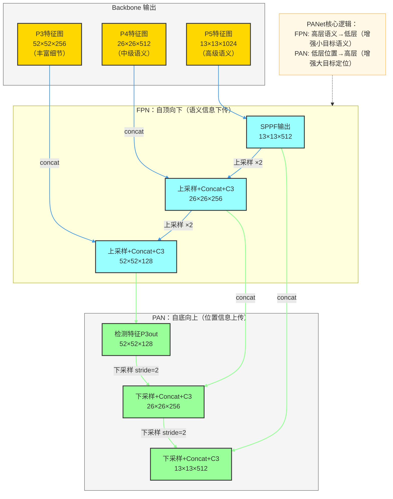

# YOLOv5 深度解析与实战指南

> **适用读者**：具备 Python 基础、希望系统掌握目标检测工程实践的开发者与算法工程师  
> **文档版本**：基于 YOLOv5 v7.0（ultralytics/yolov5）  
> **核心目标**：原理 → 架构 → 数据 → 训练 → 评估 → 部署，全链路贯通

---

## 目录

1. [YOLOv5 概述与原理](#1-yolov5-概述与原理)
2. [模型基础架构](#2-模型基础架构)
3. [核心组件详解](#3-核心组件详解)
4. [数据构建与标注](#4-数据构建与标注)
5. [数据处理流水线](#5-数据处理流水线)
6. [训练流程](#6-训练流程)
7. [评估流程](#7-评估流程)
8. [推理与预测](#8-推理与预测)
9. [数据流转路径（含维度）](#9-数据流转路径含维度)
10. [常见问题 FAQ](#10-常见问题-faq)

---

## 1. YOLOv5 概述与原理

### 1.1 YOLO 系列发展简史

| 版本 | 年份 | 核心贡献 |
|------|------|---------|
| YOLOv1 | 2016 | 首次将目标检测统一为单次回归问题 |
| YOLOv2 | 2017 | 引入 Anchor Box、BatchNorm、多尺度训练 |
| YOLOv3 | 2018 | 多尺度特征图预测（FPN 思想），Darknet53 |
| YOLOv4 | 2020 | CSPNet 骨干、Mosaic 增强、CIoU Loss |
| **YOLOv5** | **2020** | **PyTorch 重写，工程化极致，4 个尺寸版本** |
| YOLOv8 | 2023 | Anchor-Free，任务统一化 |

### 1.2 YOLOv5 核心思想

YOLOv5 的核心是**"一次前向传播，同时预测所有目标"**，将目标检测分解为三个子任务：

1. **定位（Localization）**：预测边界框 `(cx, cy, w, h)`
2. **置信度（Objectness）**：预测该锚框中是否存在目标
3. **分类（Classification）**：预测目标类别概率

### 1.3 检测头输出解码原理

对于特征图上每个网格点 `(i, j)`，每个 Anchor 输出 `5 + num_classes` 个值：

```
tx, ty, tw, th, obj_conf, cls1_prob, cls2_prob, ..., clsN_prob
```

最终边界框解码公式：

```
bx = sigmoid(tx) + cx      # cx 为网格左上角 x 坐标
by = sigmoid(ty) + cy      # cy 为网格左上角 y 坐标
bw = pw * exp(tw)          # pw 为对应 anchor 的宽度
bh = ph * exp(th)          # ph 为对应 anchor 的高度
obj = sigmoid(obj_conf)    # 目标置信度
cls = softmax(cls_probs)   # 类别概率
```

**最终得分** = `obj × max(cls_prob)`，超过阈值后进入 NMS 后处理。

### 1.4 多尺度检测策略

YOLOv5 在三个尺度输出检测结果，应对不同大小目标：

| 特征图层级 | 下采样倍率 | 感受野 | 擅长检测目标 | 对应 Anchor 尺寸示例 |
|-----------|-----------|--------|------------|-------------------|
| P3（大特征图）| 8× | 小 | 小目标 | 10×13, 16×30, 33×23 |
| P4（中特征图）| 16× | 中 | 中等目标 | 30×61, 62×45, 59×119 |
| P5（小特征图）| 32× | 大 | 大目标 | 116×90, 156×198, 373×326 |

### 1.5 YOLOv5 整体检测流程总览

```mermaid
flowchart LR
    %% 样式定义
    classDef inputStyle fill:#f9f,stroke:#333,stroke-width:2px
    classDef backboneStyle fill:#ffd700,stroke:#333,stroke-width:3px
    classDef neckStyle fill:#9ff,stroke:#333,stroke-width:2px
    classDef headStyle fill:#9f9,stroke:#333,stroke-width:2px
    classDef postStyle fill:#ff9,stroke:#333,stroke-width:2px
    classDef outputStyle fill:#f99,stroke:#333,stroke-width:2px
    classDef subgraphStyle fill:#f5f5f5,stroke:#666,stroke-width:1px
    classDef noteStyle fill:#fff8e6,stroke:#ffb74d,stroke-width:1px

    %% 输入层
    subgraph inputLayer["输入层"]
        A[原始图像<br/>H×W×3]:::inputStyle
        B[预处理<br/>Resize+Normalize]:::inputStyle
    end
    class inputLayer subgraphStyle

    %% 骨干网络层
    subgraph backboneLayer["Backbone（CSPDarknet53）"]
        C[Focus/Conv<br/>P1: 208×208×32]:::backboneStyle
        D[C3模块×3<br/>P2: 104×104×64]:::backboneStyle
        E[C3模块×6<br/>P3: 52×52×128]:::backboneStyle
        F[C3模块×9<br/>P4: 26×26×256]:::backboneStyle
        G[C3+SPPF<br/>P5: 13×13×512]:::backboneStyle
    end
    class backboneLayer subgraphStyle

    %% Neck层
    subgraph neckLayer["Neck（PANet）"]
        H[上采样+C3<br/>26×26×256]:::neckStyle
        I[上采样+C3<br/>52×52×128]:::neckStyle
        J[下采样+C3<br/>26×26×256]:::neckStyle
        K[下采样+C3<br/>13×13×512]:::neckStyle
    end
    class neckLayer subgraphStyle

    %% 检测头
    subgraph headLayer["Head（Detect）"]
        L[小目标检测头<br/>52×52×3×(5+C)]:::headStyle
        M[中目标检测头<br/>26×26×3×(5+C)]:::headStyle
        N[大目标检测头<br/>13×13×3×(5+C)]:::headStyle
    end
    class headLayer subgraphStyle

    %% 后处理
    subgraph postLayer["后处理"]
        O[解码边界框<br/>NMS过滤]:::postStyle
    end
    class postLayer subgraphStyle

    %% 输出
    P[检测结果<br/>boxes+scores+labels]:::outputStyle

    %% 连接线
    A -->|letterbox| B
    B --> C --> D --> E --> F --> G
    G -->|FPN下采样| H
    E -->|concat| H
    H -->|FPN下采样| I
    E -->|concat| I
    I -->|PAN上采样| J
    H -->|concat| J
    J -->|PAN上采样| K
    G -->|concat| K
    I --> L
    J --> M
    K --> N
    L & M & N -->|合并预测| O --> P

    linkStyle 0,1 stroke:#666,stroke-width:1.5px
    linkStyle 2,3,4,5,6 stroke:#ffd700,stroke-width:2px
    linkStyle 7,8,9,10,11,12 stroke:#4299e1,stroke-width:1.5px
    linkStyle 13,14,15,16,17 stroke:#9f9,stroke-width:2px
```

---

## 2. 模型基础架构

YOLOv5 采用经典的 **Backbone → Neck → Head** 三段式架构，同时提供 5 个尺寸版本适配不同算力需求。

### 2.1 模型尺寸版本对比

| 模型 | 参数量 | FLOPs | mAP@.5 (COCO) | 推理速度(V100) |
|------|--------|-------|---------------|--------------|
| YOLOv5n | 1.9M | 4.5G | 28.0% | 6.3ms |
| YOLOv5s | 7.2M | 16.5G | 37.4% | 6.4ms |
| YOLOv5m | 21.2M | 49.0G | 45.4% | 8.2ms |
| YOLOv5l | 46.5M | 109.1G | 49.0% | 10.1ms |
| YOLOv5x | 86.7M | 205.7G | 50.7% | 12.1ms |

### 2.2 配置文件驱动架构

YOLOv5 通过 YAML 配置文件定义网络结构，核心字段如下：

```yaml
# yolov5s.yaml 精简版
nc: 80          # 类别数（COCO）
depth_multiple: 0.33   # 网络深度缩放系数
width_multiple: 0.50   # 网络宽度缩放系数

anchors:
  - [10,13, 16,30, 33,23]       # P3/8 小目标
  - [30,61, 62,45, 59,119]      # P4/16 中目标
  - [116,90, 156,198, 373,326]  # P5/32 大目标

backbone:
  # [from, number, module, args]
  [[-1, 1, Conv, [64, 6, 2, 2]],       # 0-P1/2
   [-1, 1, Conv, [128, 3, 2]],          # 1-P2/4
   [-1, 3, C3, [128]],
   [-1, 1, Conv, [256, 3, 2]],          # 3-P3/8
   [-1, 6, C3, [256]],
   [-1, 1, Conv, [512, 3, 2]],          # 5-P4/16
   [-1, 9, C3, [512]],
   [-1, 1, Conv, [1024, 3, 2]],         # 7-P5/32
   [-1, 3, C3, [1024]],
   [-1, 1, SPPF, [1024, 5]],            # 9
  ]

head:
  [[-1, 1, Conv, [512, 1, 1]],
   [-1, 1, nn.Upsample, [None, 2, 'nearest']],
   [[-1, 6], 1, Concat, [1]],
   [-1, 3, C3, [512, False]],           # 13
   [-1, 1, Conv, [256, 1, 1]],
   [-1, 1, nn.Upsample, [None, 2, 'nearest']],
   [[-1, 4], 1, Concat, [1]],
   [-1, 3, C3, [256, False]],           # 17 (P3/8-small)
   [-1, 1, Conv, [256, 3, 2]],
   [[-1, 14], 1, Concat, [1]],
   [-1, 3, C3, [512, False]],           # 20 (P4/16-medium)
   [-1, 1, Conv, [512, 3, 2]],
   [[-1, 10], 1, Concat, [1]],
   [-1, 3, C3, [1024, False]],          # 23 (P5/32-large)
   [[17, 20, 23], 1, Detect, [nc, anchors]],  # 24 检测头
  ]
```

---

## 3. 核心组件详解

### 3.1 Conv 标准卷积模块

YOLOv5 中所有卷积操作均封装为 `Conv` 模块，包含 Conv + BN + SiLU：

```python
class Conv(nn.Module):
    """标准卷积：Conv + BN + SiLU 激活"""
    def __init__(self, c1, c2, k=1, s=1, p=None, g=1, d=1, act=True):
        super().__init__()
        # autopad 自动计算 padding，保持特征图尺寸
        self.conv = nn.Conv2d(c1, c2, k, s, autopad(k, p, d),
                              groups=g, dilation=d, bias=False)
        self.bn = nn.BatchNorm2d(c2)
        # SiLU = x * sigmoid(x)，比 ReLU 更平滑
        self.act = nn.SiLU() if act is True else (act if isinstance(act, nn.Module) else nn.Identity())

    def forward(self, x):
        return self.act(self.bn(self.conv(x)))
```

**SiLU 激活函数优势**：`f(x) = x * sigmoid(x)`，在负值区域有非零梯度，缓解梯度消失，比 ReLU 在深层网络中表现更稳定。

### 3.2 C3 模块（CSP Bottleneck）

C3 模块是 YOLOv5 骨干网络的核心，基于 CSPNet 思想，将特征图分为两路分别处理后合并：

```python
class C3(nn.Module):
    """CSP Bottleneck with 3 convolutions"""
    def __init__(self, c1, c2, n=1, shortcut=True, g=1, e=0.5):
        super().__init__()
        c_ = int(c2 * e)  # 隐层通道数（中间宽度）
        self.cv1 = Conv(c1, c_, 1, 1)   # 1×1 压缩
        self.cv2 = Conv(c1, c_, 1, 1)   # 旁路分支
        self.cv3 = Conv(2 * c_, c2, 1)  # 合并后输出
        # n 个 Bottleneck 串联
        self.m = nn.Sequential(*(Bottleneck(c_, c_, shortcut, g, e=1.0) for _ in range(n)))

    def forward(self, x):
        # 主路：通过 n 个 Bottleneck
        # 旁路：直接传递
        return self.cv3(torch.cat((self.m(self.cv1(x)), self.cv2(x)), dim=1))
```

**CSP 设计优势**：减少约 20% 计算量，同时保留完整的梯度流，有效缓解深层网络的梯度消失问题。

### 3.3 SPPF 模块（空间金字塔池化）

```python
class SPPF(nn.Module):
    """Spatial Pyramid Pooling - Fast（快速版 SPP）"""
    def __init__(self, c1, c2, k=5):
        super().__init__()
        c_ = c1 // 2
        self.cv1 = Conv(c1, c_, 1, 1)
        self.cv2 = Conv(c_ * 4, c2, 1, 1)
        # 三次串联 MaxPool 等效于 SPP 的 5/9/13 核
        self.m = nn.MaxPool2d(kernel_size=k, stride=1, padding=k // 2)

    def forward(self, x):
        x = self.cv1(x)
        y1 = self.m(x)
        y2 = self.m(y1)
        # 串联三次池化 + 原始特征 → 融合多尺度上下文
        return self.cv2(torch.cat([x, y1, y2, self.m(y2)], dim=1))
```

**SPPF vs SPP**：SPPF 通过三次串联 5×5 MaxPool 等效替代 SPP 的三个并行池化核（5×5、9×9、13×13），速度提升约 2 倍。

### 3.4 PANet Neck（路径聚合网络）



### 3.5 Anchor 机制与 K-Means 聚类

YOLOv5 使用 K-Means 算法在训练数据上自动聚类出最优 Anchor 尺寸：

```python
def kmean_anchors(dataset, n=9, img_size=640, thr=4.0, gen=1000):
    """
    通过 K-Means 聚类生成 Anchor 尺寸
    dataset: 数据集路径
    n: anchor 数量（默认 9 个）
    thr: anchor 宽高比阈值
    """
    from scipy.cluster.vq import kmeans

    # 1. 收集所有标注框的宽高（归一化）
    shapes = img_size * dataset.shapes / dataset.shapes.max(1, keepdims=True)
    wh0 = np.concatenate([l[:, 3:5] * s for s, l in zip(shapes, dataset.labels)])

    # 2. 过滤极小框（< 2 像素）
    wh = wh0[(wh0 >= 2.0).any(1)].astype(np.float32)

    # 3. K-Means 聚类
    k = kmeans(wh, n, iter=30)[0]  # k.shape: (9, 2)

    return k.round(1)
```

### 3.6 损失函数设计

YOLOv5 总损失由三部分加权组成：

```
Total Loss = λ_box × L_box + λ_obj × L_obj + λ_cls × L_cls

L_box = CIoU Loss（位置回归）
L_obj = BCEWithLogitsLoss（目标置信度）
L_cls = BCEWithLogitsLoss（类别分类）
```

**CIoU Loss 公式**：

```
CIoU = IoU - ρ²(b, b^gt) / c² - αv

其中：
  ρ²: 预测框与GT中心点欧式距离²
  c²: 最小外接矩形对角线长度²
  v = (4/π²)(arctan(wgt/hgt) - arctan(w/h))²  # 宽高比一致性
  α = v / (1 - IoU + v)                          # 权重系数
```

**CIoU 相比 IoU 的优势**：同时考虑重叠面积、中心距离、宽高比三个几何因素，梯度更稳定。

---

## 4. 数据构建与标注

### 4.1 数据集目录结构

```
dataset/
├── images/
│   ├── train/          # 训练图像
│   │   ├── img001.jpg
│   │   └── img002.jpg
│   ├── val/            # 验证图像
│   └── test/           # 测试图像（可选）
├── labels/
│   ├── train/          # 对应的标签文件（.txt）
│   │   ├── img001.txt
│   │   └── img002.txt
│   ├── val/
│   └── test/
└── dataset.yaml        # 数据集配置文件
```

### 4.2 标签格式（YOLO 格式）

每个图像对应一个同名 `.txt` 文件，每行代表一个目标：

```
# 格式：class_id  cx  cy  w  h（均为归一化值，相对于图像宽高）
0 0.5234 0.3125 0.2890 0.4562    # 类别0：人，中心(0.52,0.31)，宽0.29，高0.46
1 0.1250 0.7812 0.1406 0.2188    # 类别1：车
```

**坐标归一化说明**：假设图像 640×480，框像素坐标 `(x1=100, y1=50, x2=285, y2=270)`：

```python
cx = (100 + 285) / 2 / 640 = 0.3008
cy = (50 + 270) / 2 / 480 = 0.3333
w  = (285 - 100) / 640    = 0.2891
h  = (270 - 50) / 480     = 0.4583
```

### 4.3 dataset.yaml 配置

```yaml
# dataset.yaml
path: /data/my_dataset     # 数据集根目录
train: images/train        # 训练集相对路径
val: images/val            # 验证集相对路径
test: images/test          # 测试集相对路径（可选）

# 类别定义
nc: 3                      # 类别数量
names: ['person', 'car', 'bicycle']   # 类别名称列表
```

### 4.4 使用 LabelImg 标注工具

```bash
# 安装 LabelImg
pip install labelImg

# 启动，指定图像目录和标签保存目录（YOLO 格式）
labelImg /path/to/images /path/to/labels
# 在工具中选择 "YOLO" 格式保存

# 或使用 Roboflow、CVAT 等在线工具批量标注后导出 YOLO 格式
```

### 4.5 从 COCO/VOC 格式转换

```python
# COCO JSON → YOLO TXT 转换示例
import json
from pathlib import Path

def coco_to_yolo(coco_json_path: str, output_dir: str) -> None:
    """将 COCO 格式 JSON 转换为 YOLO TXT 格式"""
    with open(coco_json_path) as f:
        coco = json.load(f)

    # 构建图像ID→宽高映射
    images = {img['id']: img for img in coco['images']}
    # 构建类别ID→索引映射（从0开始）
    cat_ids = {cat['id']: i for i, cat in enumerate(coco['categories'])}

    output_path = Path(output_dir)
    output_path.mkdir(parents=True, exist_ok=True)

    # 按图像分组标注
    from collections import defaultdict
    ann_by_image: dict = defaultdict(list)
    for ann in coco['annotations']:
        ann_by_image[ann['image_id']].append(ann)

    for img_id, anns in ann_by_image.items():
        img_info = images[img_id]
        W, H = img_info['width'], img_info['height']
        file_name = Path(img_info['file_name']).stem

        lines = []
        for ann in anns:
            x, y, w, h = ann['bbox']  # COCO: [x_min, y_min, w, h]
            cx = (x + w / 2) / W
            cy = (y + h / 2) / H
            nw = w / W
            nh = h / H
            cls_id = cat_ids[ann['category_id']]
            lines.append(f"{cls_id} {cx:.6f} {cy:.6f} {nw:.6f} {nh:.6f}")

        with open(output_path / f"{file_name}.txt", 'w') as f:
            f.write('\n'.join(lines))

    print(f"转换完成，共处理 {len(ann_by_image)} 张图像")
```

---

## 5. 数据处理流水线

### 5.1 数据增强总览

```mermaid
flowchart LR
    %% 样式定义
    classDef inputStyle fill:#f9f,stroke:#333,stroke-width:2px
    classDef augStyle fill:#ffd700,stroke:#333,stroke-width:2px
    classDef mosaicStyle fill:#9ff,stroke:#333,stroke-width:3px
    classDef geomStyle fill:#9f9,stroke:#333,stroke-width:2px
    classDef colorStyle fill:#ff9,stroke:#333,stroke-width:2px
    classDef outputStyle fill:#f99,stroke:#333,stroke-width:2px
    classDef subgraphStyle fill:#f5f5f5,stroke:#666,stroke-width:1px
    classDef noteStyle fill:#fff8e6,stroke:#ffb74d,stroke-width:1px

    subgraph inputLayer["原始输入"]
        A[4张随机图像<br/>各自标签]:::inputStyle
    end
    class inputLayer subgraphStyle

    subgraph mosaicLayer["Mosaic增强（核心）"]
        B[拼接4张图<br/>1280×1280]:::mosaicStyle
        C[随机裁切<br/>至640×640]:::mosaicStyle
    end
    class mosaicLayer subgraphStyle

    subgraph geomLayer["几何变换"]
        D[随机透视变换<br/>Perspective]:::geomStyle
        E[随机翻转<br/>Flip LR/UD]:::geomStyle
        F[随机缩放<br/>Scale]:::geomStyle
    end
    class geomLayer subgraphStyle

    subgraph colorLayer["颜色增强"]
        G[HSV色彩抖动<br/>Hue/Sat/Val]:::colorStyle
        H[Albumentations<br/>（可选）]:::colorStyle
    end
    class colorLayer subgraphStyle

    subgraph outputLayer["输出"]
        I[640×640×3<br/>归一化张量]:::outputStyle
        J[对应标签<br/>N×5]:::outputStyle
    end
    class outputLayer subgraphStyle

    A -->|随机采样| B --> C --> D --> E --> F --> G --> H --> I
    B -.->|同步变换| J

    Note[Mosaic增强优势：<br/>1. 丰富背景多样性<br/>2. 单图包含4种场景<br/>3. 减少对大BatchSize依赖]:::noteStyle
    Note -.-> mosaicLayer

    linkStyle 0,1,2,3,4,5,6,7 stroke:#333,stroke-width:2px
```



### 5.2 Mosaic 数据增强实现

```python
def load_mosaic(self, index: int):
    """
    加载 4 张图像并拼接为 Mosaic
    随机选取中心点，将 4 张图放置到 4 个象限
    """
    labels4 = []
    s = self.img_size  # 目标尺寸，如 640
    # 随机中心点：在 [s*0.5, s*1.5] 范围内
    yc, xc = (int(random.uniform(-x, 2 * s + x)) for x in self.mosaic_border)

    # 随机选取另外 3 张图
    indices = [index] + random.choices(self.indices, k=3)
    random.shuffle(indices)

    for i, index in enumerate(indices):
        img, _, (h, w) = self.load_image(index)

        # 确定 4 张图在大画布（2s × 2s）中的放置位置
        if i == 0:   # 左上
            img4 = np.full((s * 2, s * 2, img.shape[2]), 114, dtype=np.uint8)
            x1a, y1a = max(xc - w, 0), max(yc - h, 0)
            x2a, y2a = xc, yc
        elif i == 1:  # 右上
            x1a, y1a = xc, max(yc - h, 0)
            x2a, y2a = min(xc + w, s * 2), yc
        elif i == 2:  # 左下
            x1a, y1a = max(xc - w, 0), yc
            x2a, y2a = xc, min(yc + h, s * 2)
        else:         # 右下
            x1a, y1a = xc, yc
            x2a, y2a = min(xc + w, s * 2), min(yc + h, s * 2)

        img4[y1a:y2a, x1a:x2a] = img[...]
        # 同步更新标签坐标（偏移到大画布坐标系）
        labels = self.labels[index].copy()
        if labels.size:
            labels[:, 1:] = xywhn2xyxy(labels[:, 1:], w, h, x1a - ..., y1a - ...)
        labels4.append(labels)

    # 随机透视变换后裁切至 s×s
    img4, labels4 = random_perspective(img4, labels4, ...)
    return img4, labels4
```

### 5.3 Letterbox 预处理（推理时）

```python
def letterbox(im, new_shape=(640, 640), color=(114, 114, 114)):
    """
    保持宽高比的等比缩放（推理时使用）
    不足部分用灰色填充，避免图像失真
    """
    shape = im.shape[:2]  # 原始 (H, W)
    r = min(new_shape[0] / shape[0], new_shape[1] / shape[1])

    # 计算缩放后尺寸（取整）
    new_unpad = (round(shape[1] * r), round(shape[0] * r))  # (W, H)
    dw = new_shape[1] - new_unpad[0]  # 横向填充总量
    dh = new_shape[0] - new_unpad[1]  # 纵向填充总量

    # 均匀分配两侧填充
    dw /= 2
    dh /= 2

    if shape[::-1] != new_unpad:
        im = cv2.resize(im, new_unpad, interpolation=cv2.INTER_LINEAR)

    # 上下左右填充灰色边框
    top, bottom = round(dh - 0.1), round(dh + 0.1)
    left, right = round(dw - 0.1), round(dw + 0.1)
    im = cv2.copyMakeBorder(im, top, bottom, left, right,
                            cv2.BORDER_CONSTANT, value=color)
    return im, r, (dw, dh)
```

### 5.4 DataLoader 构建

```python
from torch.utils.data import DataLoader
from models.datasets import LoadImagesAndLabels

def create_dataloader(
    path: str,
    imgsz: int,
    batch_size: int,
    stride: int,
    hyp: dict | None = None,
    augment: bool = False,
    workers: int = 8,
) -> tuple[DataLoader, LoadImagesAndLabels]:
    """创建训练/验证 DataLoader"""
    dataset = LoadImagesAndLabels(
        path,
        imgsz,
        batch_size,
        augment=augment,         # 训练时 True，验证时 False
        hyp=hyp,                 # 超参数（增强强度）
        rect=not augment,        # 矩形训练（验证时启用，节省内存）
        stride=int(stride),
        pad=0.0 if augment else 0.5,
    )

    loader = DataLoader(
        dataset,
        batch_size=batch_size,
        num_workers=workers,
        pin_memory=True,
        collate_fn=LoadImagesAndLabels.collate_fn,
    )
    return loader, dataset
```

---

## 6. 训练流程

### 6.1 训练流程总览

```mermaid
flowchart TB
    %% 样式定义
    classDef initStyle fill:#f9f,stroke:#333,stroke-width:2px
    classDef dataStyle fill:#ffd700,stroke:#333,stroke-width:2px
    classDef forwardStyle fill:#9ff,stroke:#333,stroke-width:2px
    classDef lossStyle fill:#9f9,stroke:#333,stroke-width:2px
    classDef backStyle fill:#ff9,stroke:#333,stroke-width:2px
    classDef evalStyle fill:#f99,stroke:#333,stroke-width:2px
    classDef subgraphStyle fill:#f5f5f5,stroke:#666,stroke-width:1px
    classDef noteStyle fill:#fff8e6,stroke:#ffb74d,stroke-width:1px
    classDef decisionStyle fill:#e8f4f8,stroke:#4299e1,stroke-width:1.5px

    %% 初始化阶段
    subgraph initPhase["初始化"]
        A[加载模型权重<br/>预训练/随机]:::initStyle
        B[构建优化器<br/>SGD/Adam]:::initStyle
        C[学习率调度器<br/>余弦退火/线性]:::initStyle
    end
    class initPhase subgraphStyle

    %% 数据阶段
    subgraph dataPhase["数据加载（每 Batch）"]
        D[DataLoader<br/>采样 batch]:::dataStyle
        E[Mosaic增强<br/>几何+颜色变换]:::dataStyle
        F[归一化<br/>0~255 → 0~1]:::dataStyle
    end
    class dataPhase subgraphStyle

    %% 前向传播
    subgraph forwardPhase["前向传播"]
        G[Backbone<br/>提取多尺度特征]:::forwardStyle
        H[Neck PANet<br/>特征融合]:::forwardStyle
        I[Head Detect<br/>三尺度预测输出]:::forwardStyle
    end
    class forwardPhase subgraphStyle

    %% 损失计算
    subgraph lossPhase["损失计算"]
        J[Anchor匹配<br/>正负样本分配]:::lossStyle
        K[CIoU Loss<br/>位置回归]:::lossStyle
        L[BCE Loss<br/>置信度+分类]:::lossStyle
        M[加权总损失<br/>L=λ1·Lbox+λ2·Lobj+λ3·Lcls]:::lossStyle
    end
    class lossPhase subgraphStyle

    %% 反向传播
    subgraph backPhase["反向传播与更新"]
        N[梯度清零<br/>optimizer.zero_grad]:::backStyle
        O[反向传播<br/>scaler.scale(loss).backward]:::backStyle
        P[梯度裁剪<br/>clip_grad_norm]:::backStyle
        Q[参数更新<br/>scaler.step(optimizer)]:::backStyle
        R[EMA 更新<br/>指数移动平均权重]:::backStyle
    end
    class backPhase subgraphStyle

    %% 评估与保存
    subgraph evalPhase["Epoch 结束评估"]
        S[验证集推理<br/>mAP计算]:::evalStyle
        T{mAP改善?}:::decisionStyle
        U[保存 best.pt]:::evalStyle
        V[保存 last.pt]:::evalStyle
    end
    class evalPhase subgraphStyle

    A --> B --> C --> D
    D --> E --> F --> G --> H --> I
    I --> J --> K & L --> M
    M --> N --> O --> P --> Q --> R
    R -->|下一 Batch| D
    R -->|Epoch 结束| S
    S --> T
    T -->|是| U
    T -->|否| V
    V -->|下一 Epoch| D

    linkStyle 0,1,2 stroke:#666,stroke-width:1.5px
    linkStyle 3,4,5 stroke:#ffd700,stroke-width:2px
    linkStyle 6,7,8,9,10,11 stroke:#4299e1,stroke-width:1.5px
    linkStyle 12,13,14,15,16,17 stroke:#9f9,stroke-width:2px
```

### 6.2 快速开始训练

```bash
# 克隆仓库
git clone https://github.com/ultralytics/yolov5
cd yolov5
pip install -r requirements.txt

# 基础训练（使用预训练权重 fine-tune）
python train.py \
    --img 640 \
    --batch 16 \
    --epochs 100 \
    --data dataset.yaml \
    --weights yolov5s.pt \
    --project runs/train \
    --name exp1

# 多 GPU 训练（DDP）
python -m torch.distributed.run --nproc_per_node 4 train.py \
    --img 640 --batch 64 --epochs 300 \
    --data dataset.yaml --weights yolov5m.pt \
    --device 0,1,2,3
```

### 6.3 关键超参数说明

```yaml
# hyp.scratch-low.yaml（轻量增强，小数据集适用）
lr0: 0.01          # 初始学习率
lrf: 0.01          # 最终学习率 = lr0 * lrf（余弦退火终止值）
momentum: 0.937    # SGD 动量
weight_decay: 0.0005  # 权重衰减（L2 正则）

# 损失权重
box: 0.05          # 位置损失权重（CIoU）
cls: 0.5           # 分类损失权重（BCE）
obj: 1.0           # 目标置信度损失权重（BCE）

# 数据增强强度
mosaic: 1.0        # Mosaic 概率
mixup: 0.0         # MixUp 概率（默认关闭）
degrees: 0.0       # 旋转角度范围（°）
translate: 0.1     # 平移范围（图像尺寸的比例）
scale: 0.5         # 缩放范围（±50%）
shear: 0.0         # 剪切角度（°）
perspective: 0.0   # 透视强度
flipud: 0.0        # 上下翻转概率
fliplr: 0.5        # 左右翻转概率（默认 50%）
hsv_h: 0.015       # HSV 色相抖动
hsv_s: 0.7         # HSV 饱和度抖动
hsv_v: 0.4         # HSV 亮度抖动
```

### 6.4 迁移学习策略

```python
# 冻结骨干网络，只训练 Head（适合小数据集）
import torch
from models.yolo import Model

model = Model('yolov5s.yaml', ch=3, nc=10)
# 加载预训练权重（忽略最后检测头）
ckpt = torch.load('yolov5s.pt')
model.load_state_dict(ckpt['model'].state_dict(), strict=False)

# 冻结前 10 层（Backbone）
freeze = [f'model.{x}.' for x in range(10)]
for k, v in model.named_parameters():
    v.requires_grad = True
    if any(x in k for x in freeze):
        v.requires_grad = False  # 冻结骨干参数
        print(f'冻结层: {k}')

# 只对 requires_grad=True 的参数创建优化器
optimizer = torch.optim.SGD(
    filter(lambda p: p.requires_grad, model.parameters()),
    lr=0.01, momentum=0.937
)
```

### 6.5 训练监控（TensorBoard）

```bash
# 训练同时开启 TensorBoard 监控
tensorboard --logdir runs/train

# 关键指标观察：
# - train/box_loss, train/obj_loss, train/cls_loss（应持续下降）
# - metrics/mAP_0.5（验证集 mAP，应持续上升）
# - lr/pg0, lr/pg1, lr/pg2（学习率曲线，余弦退火形状）
```

---

## 7. 评估流程

### 7.1 评估指标体系

```mermaid
flowchart LR
    %% 样式定义
    classDef metricStyle fill:#ffd700,stroke:#333,stroke-width:2px
    classDef calcStyle fill:#9ff,stroke:#333,stroke-width:2px
    classDef resultStyle fill:#9f9,stroke:#333,stroke-width:2px
    classDef subgraphStyle fill:#f5f5f5,stroke:#666,stroke-width:1px
    classDef noteStyle fill:#fff8e6,stroke:#ffb74d,stroke-width:1px

    subgraph detection["检测结果"]
        A[预测框 + 置信度<br/>Ground Truth框]:::metricStyle
    end
    class detection subgraphStyle

    subgraph matching["IoU 匹配（默认 ≥0.5）"]
        B[TP: 正确检测<br/>IoU≥阈值]:::calcStyle
        C[FP: 误检<br/>IoU＜阈值]:::calcStyle
        D[FN: 漏检<br/>未匹配GT]:::calcStyle
    end
    class matching subgraphStyle

    subgraph prCurve["P-R 曲线"]
        E[Precision=TP/（TP+FP）]:::calcStyle
        F[Recall=TP/（TP+FN）]:::calcStyle
        G[P-R曲线<br/>（按置信度排序）]:::calcStyle
    end
    class prCurve subgraphStyle

    subgraph apCalc["AP 计算"]
        H[AP = AUC（P-R曲线面积）<br/>单类别平均精度]:::resultStyle
        I[mAP@.5 = mean（AP）<br/>所有类别平均]:::resultStyle
        J[mAP@.5:.95 = mean（AP0.5:0.05:0.95）<br/>多IoU阈值平均]:::resultStyle
    end
    class apCalc subgraphStyle

    A --> B & C & D
    B --> E
    C --> E
    B --> F
    D --> F
    E & F --> G --> H --> I & J

    Note[mAP说明：<br/>mAP@.5: 主流指标（IoU=0.5）<br/>mAP@.5:.95: COCO标准指标（更严格）]:::noteStyle
    Note -.-> apCalc

    linkStyle 0,1,2 stroke:#333,stroke-width:1.5px
    linkStyle 3,4,5,6,7,8,9,10 stroke:#4299e1,stroke-width:1.5px
```

### 7.2 运行官方评估脚本

```bash
# 在验证集上评估已训练的模型
python val.py \
    --weights runs/train/exp1/weights/best.pt \
    --data dataset.yaml \
    --img 640 \
    --batch 32 \
    --conf 0.001 \   # 置信度阈值（评估时用低阈值保证召回率）
    --iou 0.65 \     # NMS IoU 阈值
    --task val \     # val / test / speed
    --verbose        # 输出每类 AP
```

**典型输出解读**：

```
Class     Images  Instances    P        R     mAP50   mAP50-95
  all       5000     36780  0.742    0.605     0.655      0.432
person      5000     10777  0.821    0.712     0.768      0.498
  car       5000      8956  0.794    0.651     0.703      0.471
bicycle     5000      1822  0.611    0.453     0.494      0.327
```

### 7.3 自定义评估代码

```python
import torch
from pathlib import Path
from models.common import DetectMultiBackend
from utils.dataloaders import create_dataloader
from utils.metrics import ap_per_class

def evaluate_model(weights: str, data_yaml: str, img_size: int = 640) -> dict:
    """评估模型性能，返回各类 AP 指标"""
    device = torch.device('cuda' if torch.cuda.is_available() else 'cpu')

    # 加载模型
    model = DetectMultiBackend(weights, device=device)
    model.eval()

    # 加载数据
    dataloader, dataset = create_dataloader(
        data_yaml, img_size, batch_size=32,
        stride=model.stride, augment=False
    )

    stats = []  # 收集每张图的统计信息
    with torch.no_grad():
        for batch_i, (imgs, targets, paths, shapes) in enumerate(dataloader):
            imgs = imgs.to(device).float() / 255  # 归一化
            preds = model(imgs)  # 前向推理

            # NMS 后处理
            from utils.general import non_max_suppression
            preds = non_max_suppression(preds, conf_thres=0.001, iou_thres=0.65)

            # 与 Ground Truth 计算 TP/FP
            for si, pred in enumerate(preds):
                labels = targets[targets[:, 0] == si, 1:]
                # ... 计算 IoU 匹配，收集 TP/FP 统计
                stats.append(...)

    # 计算 AP
    p, r, ap, f1, ap_class = ap_per_class(*[torch.cat(x, 0) for x in zip(*stats)])
    return {
        'mAP50': ap[:, 0].mean().item(),
        'mAP50-95': ap.mean().item(),
        'precision': p.mean().item(),
        'recall': r.mean().item(),
    }
```

### 7.4 混淆矩阵分析

```python
from utils.metrics import ConfusionMatrix

# 构建混淆矩阵
conf_matrix = ConfusionMatrix(nc=3)  # 3 个类别

for pred, labels in zip(predictions, ground_truths):
    conf_matrix.process_batch(pred, labels)

# 可视化
conf_matrix.plot(
    normalize=True,                      # 归一化显示
    save_dir='runs/val/exp1/',
    names=['person', 'car', 'bicycle']
)
```

---

## 8. 推理与预测

### 8.1 推理流程

```mermaid
flowchart LR
    %% 样式定义
    classDef inputStyle fill:#f9f,stroke:#333,stroke-width:2px
    classDef prepStyle fill:#ffd700,stroke:#333,stroke-width:2px
    classDef inferStyle fill:#9ff,stroke:#333,stroke-width:3px
    classDef postStyle fill:#9f9,stroke:#333,stroke-width:2px
    classDef outputStyle fill:#ff9,stroke:#333,stroke-width:2px
    classDef subgraphStyle fill:#f5f5f5,stroke:#666,stroke-width:1px
    classDef noteStyle fill:#fff8e6,stroke:#ffb74d,stroke-width:1px

    subgraph inputLayer["输入"]
        A[图像/视频/摄像头<br/>任意分辨率]:::inputStyle
    end
    class inputLayer subgraphStyle

    subgraph prepLayer["预处理"]
        B[Letterbox缩放<br/>→ 640×640]:::prepStyle
        C[BGR→RGB<br/>HWC→CHW]:::prepStyle
        D[归一化<br/>÷255.0]:::prepStyle
        E[添加Batch维度<br/>1×3×640×640]:::prepStyle
    end
    class prepLayer subgraphStyle

    subgraph inferLayer["模型推理"]
        F[前向传播<br/>GPU/CPU]:::inferStyle
        G[原始输出<br/>1×25200×85]:::inferStyle
    end
    class inferLayer subgraphStyle

    subgraph postLayer["后处理"]
        H[置信度过滤<br/>conf > 0.25]:::postStyle
        I[NMS去重<br/>IoU < 0.45]:::postStyle
        J[坐标还原<br/>缩放至原图尺寸]:::postStyle
    end
    class postLayer subgraphStyle

    subgraph outputLayer["输出结果"]
        K[边界框 xyxy<br/>置信度 conf<br/>类别 cls]:::outputStyle
    end
    class outputLayer subgraphStyle

    A --> B --> C --> D --> E --> F --> G --> H --> I --> J --> K

    Note[25200 = 80×80×3 + 40×40×3 + 20×20×3<br/>（三个尺度 × 3个Anchor）<br/>85 = 4（坐标）+1（置信度）+80（COCO类别数）]:::noteStyle
    Note -.-> inferLayer

    linkStyle 0,1,2,3,4,5,6,7,8,9,10 stroke:#333,stroke-width:2px
```



### 8.2 Python API 推理示例

```python
import torch
from pathlib import Path

# 方式一：使用官方 Hub 加载（最简单）
model = torch.hub.load('ultralytics/yolov5', 'yolov5s', pretrained=True)
# 或加载自定义训练权重
model = torch.hub.load('ultralytics/yolov5', 'custom',
                       path='runs/train/exp1/weights/best.pt')

# 单张图像推理
results = model('data/images/zidane.jpg')
results.print()    # 打印检测结果摘要
results.show()     # 显示带标注的图像
results.save('output/')  # 保存结果图像

# 获取原始检测数据
detections = results.xyxy[0]  # shape: (N, 6) → [x1, y1, x2, y2, conf, cls]
print(detections)
# tensor([[749.5, 43.5, 1148., 704.5, 0.879, 0.],
#         [433.4, 433.4,  517., 714.8, 0.659, 27.]])
```

### 8.3 批量推理脚本

```bash
# 对图像文件夹批量推理
python detect.py \
    --weights runs/train/exp1/weights/best.pt \
    --source data/images/ \    # 图像目录/单张图/视频/摄像头 0
    --img 640 \
    --conf 0.25 \              # 置信度阈值
    --iou 0.45 \               # NMS IoU 阈值
    --save-txt \               # 同时保存检测标签 .txt
    --save-conf \              # 标签中包含置信度
    --project runs/detect \
    --name exp1
```

### 8.4 完整推理代码（带坐标还原）

```python
import cv2
import torch
import numpy as np
from models.common import DetectMultiBackend
from utils.general import non_max_suppression, scale_boxes
from utils.augmentations import letterbox

class YOLOv5Detector:
    """封装 YOLOv5 推理流程"""

    def __init__(
        self,
        weights: str,
        device: str = 'cuda',
        img_size: int = 640,
        conf_thres: float = 0.25,
        iou_thres: float = 0.45,
    ) -> None:
        self.device = torch.device(device if torch.cuda.is_available() else 'cpu')
        self.img_size = img_size
        self.conf_thres = conf_thres
        self.iou_thres = iou_thres

        self.model = DetectMultiBackend(weights, device=self.device)
        self.model.eval()
        self.stride = self.model.stride
        self.names = self.model.names

    def preprocess(self, img_bgr: np.ndarray) -> tuple[torch.Tensor, tuple, tuple]:
        """BGR 图像预处理"""
        img0 = img_bgr  # 原图备用（用于坐标还原）
        # Letterbox 缩放（保持宽高比）
        img, ratio, pad = letterbox(img0, self.img_size, stride=self.stride)
        # HWC BGR → CHW RGB → float32 → normalize
        img = img[:, :, ::-1].transpose(2, 0, 1)
        img = np.ascontiguousarray(img)
        img_tensor = torch.from_numpy(img).to(self.device).float() / 255.0
        img_tensor = img_tensor.unsqueeze(0)  # 添加 batch 维度
        return img_tensor, img0.shape, (ratio, pad)

    @torch.no_grad()
    def detect(self, img_bgr: np.ndarray) -> list[dict]:
        """
        执行检测，返回检测结果列表
        每个结果: {'bbox': [x1,y1,x2,y2], 'conf': float, 'cls': int, 'name': str}
        """
        img_tensor, orig_shape, (ratio, pad) = self.preprocess(img_bgr)

        # 前向推理
        pred = self.model(img_tensor)

        # NMS 后处理
        pred = non_max_suppression(pred, self.conf_thres, self.iou_thres)

        results = []
        for det in pred:  # 每张图的检测结果
            if det is not None and len(det):
                # 坐标从缩放后的 640×640 还原到原图尺寸
                det[:, :4] = scale_boxes(
                    img_tensor.shape[2:],  # 缩放后尺寸
                    det[:, :4],
                    orig_shape[:2]         # 原图 (H, W)
                ).round()

                for *xyxy, conf, cls in det:
                    results.append({
                        'bbox': [int(x) for x in xyxy],
                        'conf': float(conf),
                        'cls': int(cls),
                        'name': self.names[int(cls)],
                    })
        return results

# 使用示例
detector = YOLOv5Detector('best.pt', conf_thres=0.3)
img = cv2.imread('test.jpg')
results = detector.detect(img)
for r in results:
    print(f"检测到 {r['name']}，置信度 {r['conf']:.3f}，位置 {r['bbox']}")
```

### 8.5 模型导出部署

```bash
# 导出为 ONNX（跨平台部署）
python export.py --weights best.pt --include onnx --img 640

# 导出为 TensorRT（NVIDIA GPU 加速）
python export.py --weights best.pt --include engine --device 0 --half

# 导出为 CoreML（苹果设备）
python export.py --weights best.pt --include coreml

# 导出为 TFLite（移动端）
python export.py --weights best.pt --include tflite --int8
```

---

## 9. 数据流转路径（含维度）

### 9.1 YOLOv5s 完整维度流转（输入 640×640×3，80 类）

```mermaid
flowchart TB
    %% 样式定义
    classDef inputStyle fill:#f9f,stroke:#333,stroke-width:2px
    classDef convStyle fill:#ffd700,stroke:#333,stroke-width:2px
    classDef c3Style fill:#9ff,stroke:#333,stroke-width:2px
    classDef sppfStyle fill:#ff9,stroke:#333,stroke-width:2px
    classDef neckStyle fill:#9f9,stroke:#333,stroke-width:2px
    classDef headStyle fill:#f99,stroke:#333,stroke-width:2px
    classDef subgraphStyle fill:#f5f5f5,stroke:#666,stroke-width:1px
    classDef noteStyle fill:#fff8e6,stroke:#ffb74d,stroke-width:1px

    %% 输入
    IN[输入图像<br/>B×3×640×640]:::inputStyle

    %% Backbone
    subgraph backbone["Backbone: CSPDarknet53（YOLOv5s: width=0.5, depth=0.33）"]
        L0[Conv P1/2<br/>B×32×320×320<br/>k=6,s=2,p=2]:::convStyle
        L1[Conv P2/4<br/>B×64×160×160<br/>k=3,s=2]:::convStyle
        L2[C3×1 P2<br/>B×64×160×160]:::c3Style
        L3[Conv P3/8<br/>B×128×80×80<br/>k=3,s=2]:::convStyle
        L4[C3×2 P3<br/>B×128×80×80]:::c3Style
        L5[Conv P4/16<br/>B×256×40×40<br/>k=3,s=2]:::convStyle
        L6[C3×3 P4<br/>B×256×40×40]:::c3Style
        L7[Conv P5/32<br/>B×512×20×20<br/>k=3,s=2]:::convStyle
        L8[C3×1 P5<br/>B×512×20×20]:::c3Style
        L9[SPPF<br/>B×512×20×20<br/>k=5×3]:::sppfStyle
    end
    class backbone subgraphStyle

    %% Neck FPN
    subgraph neck["Neck: PANet（FPN↑ + PAN↓）"]
        N0[Conv 1×1<br/>B×256×20×20]:::neckStyle
        N1[Upsample ×2<br/>B×256×40×40]:::neckStyle
        N2[Concat with L6<br/>B×512×40×40]:::neckStyle
        N3[C3×1<br/>B×256×40×40]:::neckStyle
        N4[Conv 1×1<br/>B×128×40×40]:::neckStyle
        N5[Upsample ×2<br/>B×128×80×80]:::neckStyle
        N6[Concat with L4<br/>B×256×80×80]:::neckStyle
        N7[C3×1<br/>B×128×80×80<br/>→ 小目标特征]:::neckStyle
        N8[Conv s=2<br/>B×128×40×40]:::neckStyle
        N9[Concat with N3<br/>B×256×40×40]:::neckStyle
        N10[C3×1<br/>B×256×40×40<br/>→ 中目标特征]:::neckStyle
        N11[Conv s=2<br/>B×256×20×20]:::neckStyle
        N12[Concat with N0<br/>B×512×20×20]:::neckStyle
        N13[C3×1<br/>B×512×20×20<br/>→ 大目标特征]:::neckStyle
    end
    class neck subgraphStyle

    %% Head
    subgraph head["Head: Detect（3 Anchors/格）"]
        H1[小目标检测头<br/>B×3×80×80×85<br/>= B×19200×85]:::headStyle
        H2[中目标检测头<br/>B×3×40×40×85<br/>= B×4800×85]:::headStyle
        H3[大目标检测头<br/>B×3×20×20×85<br/>= B×1200×85]:::headStyle
        H4[合并输出<br/>B×25200×85]:::headStyle
    end
    class head subgraphStyle

    %% 后处理
    POST[NMS后<br/>B×N×6<br/>x1,y1,x2,y2,conf,cls]:::headStyle

    IN --> L0 --> L1 --> L2 --> L3 --> L4 --> L5 --> L6 --> L7 --> L8 --> L9
    L9 --> N0 --> N1 --> N2 --> N3 --> N4 --> N5 --> N6 --> N7
    N7 --> N8 --> N9 --> N10
    N10 --> N11 --> N12 --> N13
    N7 --> H1
    N10 --> H2
    N13 --> H3
    H1 & H2 & H3 --> H4 --> POST

    Note[输出维度说明：<br/>25200 = 80×80×3 + 40×40×3 + 20×20×3<br/>85 = 4（bbox）+ 1（obj）+ 80（COCO类别数）<br/>YOLOv5s参数量约 7.2M]:::noteStyle
    Note -.-> head

    linkStyle 0,1,2,3,4,5,6,7,8,9 stroke:#ffd700,stroke-width:2px
    linkStyle 10,11,12,13,14,15,16,17,18,19,20,21,22 stroke:#4299e1,stroke-width:1.5px
    linkStyle 23,24,25,26,27,28 stroke:#9f9,stroke-width:2px
```



### 9.2 各层维度变化详细表格

| 层名称 | 输入维度 | 核心操作 | 输出维度 | 关键参数 |
|--------|---------|---------|---------|---------|
| 输入 | - | - | B×3×640×640 | - |
| Conv-P1 | B×3×640×640 | Conv+BN+SiLU | B×32×320×320 | k=6,s=2,p=2 |
| Conv-P2 | B×32×320×320 | Conv+BN+SiLU | B×64×160×160 | k=3,s=2 |
| C3-P2 | B×64×160×160 | CSP Bottleneck×1 | B×64×160×160 | n=1 |
| Conv-P3 | B×64×160×160 | Conv+BN+SiLU | B×128×80×80 | k=3,s=2 |
| C3-P3 | B×128×80×80 | CSP Bottleneck×2 | B×128×80×80 | n=2 |
| Conv-P4 | B×128×80×80 | Conv+BN+SiLU | B×256×40×40 | k=3,s=2 |
| C3-P4 | B×256×40×40 | CSP Bottleneck×3 | B×256×40×40 | n=3 |
| Conv-P5 | B×256×40×40 | Conv+BN+SiLU | B×512×20×20 | k=3,s=2 |
| C3-P5 | B×512×20×20 | CSP Bottleneck×1 | B×512×20×20 | n=1 |
| SPPF | B×512×20×20 | 3×MaxPool5+Concat | B×512×20×20 | k=5 |
| Neck-FPN1 | B×512×20×20 | Conv1×1+Upsample | B×256×40×40 | - |
| Neck-FPN1-Concat | B×256×40×40 | Concat with P4 | B×512×40×40 | - |
| Neck-C3-1 | B×512×40×40 | C3 | B×256×40×40 | - |
| Neck-FPN2 | B×256×40×40 | Conv1×1+Upsample | B×128×80×80 | - |
| Neck-FPN2-Concat | B×128×80×80 | Concat with P3 | B×256×80×80 | - |
| Neck-C3-2 | B×256×80×80 | C3（小目标） | B×128×80×80 | - |
| Neck-PAN1 | B×128×80×80 | Conv s=2 | B×128×40×40 | - |
| Neck-PAN1-Concat | B×128×40×40 | Concat | B×256×40×40 | - |
| Neck-C3-3 | B×256×40×40 | C3（中目标） | B×256×40×40 | - |
| Neck-PAN2 | B×256×40×40 | Conv s=2 | B×256×20×20 | - |
| Neck-PAN2-Concat | B×256×20×20 | Concat | B×512×20×20 | - |
| Neck-C3-4 | B×512×20×20 | C3（大目标） | B×512×20×20 | - |
| Head-P3 | B×128×80×80 | Conv | B×255×80×80 | 255=3×85 |
| Head-P4 | B×256×40×40 | Conv | B×255×40×40 | 255=3×85 |
| Head-P5 | B×512×20×20 | Conv | B×255×20×20 | 255=3×85 |
| 输出（合并） | - | Reshape+Concat | B×25200×85 | 25200=19200+4800+1200 |

### 9.3 Anchor 匹配与正样本分配维度示意

```
对于 P3 检测头（80×80 网格，3 个 Anchor）：
- 特征图：B × 3 × 80 × 80 × 85
- 每个网格预测 3 个框
- GT 框与 Anchor 的宽高比 ≤ 4.0 时视为正样本候选
- 每个 GT 框可匹配多尺度 Anchor（YOLOv5 允许跨网格匹配）

正样本分配示意（1 个 GT 框，匹配 3 个邻近网格）：
  网格 (i, j)     → Anchor k1 → 正样本 [tx, ty, tw, th, 1, cls_onehot]
  网格 (i-1, j)   → Anchor k1 → 正样本（扩展）
  网格 (i, j-1)   → Anchor k1 → 正样本（扩展）
```

---

## 10. 常见问题 FAQ

### Q1：YOLOv5 和 YOLOv8 该如何选择？

**答**：取决于具体场景：

| 维度 | YOLOv5 | YOLOv8 |
|------|--------|--------|
| 成熟度 | 极高，社区文档丰富 | 较新，迭代快 |
| 任务支持 | 目标检测、实例分割 | 检测、分割、分类、姿态估计 |
| Anchor | Anchor-Based | Anchor-Free |
| 导出格式 | 多种（ONNX/TRT/TFLite等） | 多种（更多） |
| 推理速度 | 极快 | 略慢（Anchor-Free解码开销） |
| 工程维护 | 稳定，适合生产 | 适合新项目 |

**建议**：生产环境优先考虑 YOLOv5（更稳定），新项目或需要多任务统一框架考虑 YOLOv8。

---

### Q2：训练 loss 不收敛或出现 NaN，如何排查？

**答**：按以下顺序排查：

1. **检查标签格式**：确认 YOLO 格式坐标均在 [0, 1] 范围内，无负值
   ```bash
   python utils/dataloaders.py  # 运行数据集检查
   ```

2. **检查 Anchor 匹配率**：训练开始输出的 `anchors/target` 应 > 0.5
   ```
   autoanchor: 4.74 anchors/target, 0.996 Best Possible Recall (BPR)
   ```

3. **降低学习率**：`lr0: 0.01 → 0.001`

4. **检查混合精度**：尝试关闭 AMP
   ```bash
   python train.py --noval --nosave  # 关闭验证，快速定位问题
   ```

5. **数据集问题**：空标签文件、图像损坏、极小目标（< 2 像素）

---

### Q3：小目标检测效果差，如何优化？

**答**：多策略组合使用：

1. **增大输入分辨率**：`--img 1280`（显存允许的情况下）
2. **添加 P2 检测头**（1/4 下采样）：修改 `yolov5s.yaml` 增加 P2 输出
3. **使用 SAHI 切片推理**：将大图切成小块推理，再合并
   ```python
   from sahi import AutoDetectionModel
   from sahi.predict import get_sliced_prediction
   model = AutoDetectionModel.from_pretrained('yolov5', 'best.pt')
   result = get_sliced_prediction('image.jpg', model,
                                   slice_height=320, slice_width=320,
                                   overlap_height_ratio=0.2)
   ```
4. **聚类 Anchor**：针对小目标数据集重新聚类 Anchor
   ```bash
   python utils/autoanchor.py --data dataset.yaml --img 640
   ```
5. **Mosaic 增强**：确保 `mosaic: 1.0`（默认开启）

---

### Q4：如何处理类别不平衡问题？

**答**：

1. **过采样稀少类别**：使用 `WeightedRandomSampler`
   ```python
   from torch.utils.data import WeightedRandomSampler
   # 计算每张图的权重（包含稀少类别的图权重更高）
   weights = compute_class_weight(dataset.labels)
   sampler = WeightedRandomSampler(weights, len(weights))
   ```

2. **调整损失权重**：在 `hyp.yaml` 中为稀少类别增加权重
   ```yaml
   cls_pw: 1.0   # 类别正样本权重
   obj_pw: 1.0   # 目标正样本权重
   ```

3. **数据增强**：对稀少类别图像加强 Mosaic、Copy-Paste 增强

4. **调整置信度阈值**：评估时降低稀少类别的阈值

---

### Q5：Anchor-Free 方法（如 YOLOX）和 YOLOv5 的 Anchor-Based 有何区别？

| 维度 | Anchor-Based（YOLOv5） | Anchor-Free（YOLOX） |
|------|----------------------|---------------------|
| 正样本分配 | 基于 IoU 与 Anchor 匹配 | SimOTA 动态分配 |
| 超参数 | 需调 Anchor 尺寸 | 无需 Anchor 设计 |
| 长尾类别 | 较难处理 | 更灵活 |
| 训练难度 | 较低 | 较高（对学习率敏感） |
| 推理速度 | 快 | 略慢（解码更复杂） |

**结论**：Anchor-Free 在通用场景下略有优势，但 YOLOv5 在工程部署和调参方便性上优势明显。

---

### Q6：mAP 高但实际落地效果差，原因是什么？

**答**：常见原因及对策：

1. **验证集分布与生产环境不一致**（最常见）
   - 对策：收集真实生产环境数据作为验证集，或做 Domain Adaptation

2. **mAP 阈值与业务需求不匹配**
   - mAP@0.5 宽松，IoU=0.5 就算检出，但业务可能需要更精准的定位
   - 对策：用 mAP@0.75 或 mAP@0.5:0.95 评估

3. **置信度阈值设置不合理**
   - 默认 `conf=0.25` 可能召回太多误检，或 `conf=0.5` 漏检太多
   - 对策：在业务场景上绘制 P-R 曲线，找最优工作点

4. **图像质量差异**：夜间、模糊、遮挡场景未充分训练
   - 对策：针对性采集困难样本，做 Hard Example Mining

---

### Q7：YOLOv5 如何实现实时目标追踪？

**答**：将 YOLOv5 检测结果作为追踪器输入，常用方案：

```python
# 使用 SORT（Simple Online and Realtime Tracking）
from sort import Sort

tracker = Sort(max_age=30, min_hits=3, iou_threshold=0.3)
detector = YOLOv5Detector('best.pt')

cap = cv2.VideoCapture('video.mp4')
while True:
    ret, frame = cap.read()
    if not ret:
        break

    # YOLOv5 检测
    detections = detector.detect(frame)
    # 转换为 SORT 输入格式 [x1, y1, x2, y2, conf]
    dets = np.array([[*d['bbox'], d['conf']] for d in detections])

    # 追踪更新（返回 [x1, y1, x2, y2, track_id]）
    tracks = tracker.update(dets if len(dets) else np.empty((0, 5)))

    for track in tracks:
        x1, y1, x2, y2, track_id = track.astype(int)
        cv2.rectangle(frame, (x1, y1), (x2, y2), (0, 255, 0), 2)
        cv2.putText(frame, f'ID:{track_id}', (x1, y1-10),
                    cv2.FONT_HERSHEY_SIMPLEX, 0.5, (0, 255, 0), 2)
```

更强的追踪方案：**ByteTrack**（处理遮挡更好）、**StrongSORT**（更鲁棒）、**BoT-SORT**。

---

### Q8：如何加速 YOLOv5 推理（从 PyTorch 到 TensorRT）？

**步骤**：

```bash
# Step 1：导出 ONNX
python export.py --weights best.pt --include onnx --opset 17

# Step 2：ONNX → TensorRT（FP16）
trtexec --onnx=best.onnx \
        --saveEngine=best_fp16.engine \
        --fp16 \
        --workspace=4096

# Step 3：验证加速效果
python detect.py --weights best_fp16.engine --source data/images/ --device 0
```

**典型加速效果**（以 YOLOv5s，V100 为例）：

| 格式 | 延迟（单图） | 加速比 |
|------|------------|--------|
| PyTorch FP32 | 6.4ms | 1× |
| ONNX Runtime | 4.8ms | 1.3× |
| TensorRT FP16 | 1.8ms | 3.6× |
| TensorRT INT8 | 1.2ms | 5.3× |

---

### Q9：YOLOv5 的 NMS 为何会导致密集目标漏检，如何解决？

**原因**：标准 NMS 的 "硬抑制" 策略：当两个目标 IoU > 阈值时，低置信度框直接被删除，但这两个框可能是真实的不同目标（如密集行人）。

**解决方案**：

1. **Soft-NMS**：不直接删除，而是按 IoU 衰减置信度
   ```python
   # conf *= (1 - iou)  或  conf *= exp(-iou²/σ)
   # 低置信度框最终被阈值过滤，而非直接删除
   ```

2. **降低 NMS IoU 阈值**：`--iou 0.3`（允许更多重叠目标存活）

3. **使用 WBF（加权框融合）**：多模型集成时效果更好
   ```bash
   pip install ensemble-boxes
   ```

4. **DIoU-NMS**：将 NMS 度量从 IoU 改为 DIoU（考虑中心距离），减少相邻非同类目标的误抑制

---

### Q10：Mosaic 增强在什么情况下需要关闭？

**答**：

1. **最后几个 Epoch 关闭**（官方推荐）：YOLOv5 在最后 10 个 Epoch 自动关闭 Mosaic，让模型在"干净"数据上微调，提升约 1-2% mAP

2. **小目标超密集数据集**：Mosaic 会将图像缩小到 1/4，极小目标可能消失

3. **医学图像等特殊领域**：图像尺寸比例敏感，Mosaic 会引入不自然的背景拼接

4. **数据量不足时**：少于 200 张图时，Mosaic 可能引入过多噪声

```yaml
# 关闭 Mosaic 的 hyp 配置
mosaic: 0.0       # 完全关闭
close_mosaic: 10  # 最后 10 Epoch 自动关闭（官方默认行为）
```

---

*文档持续更新，如有问题欢迎在社区反馈。*
