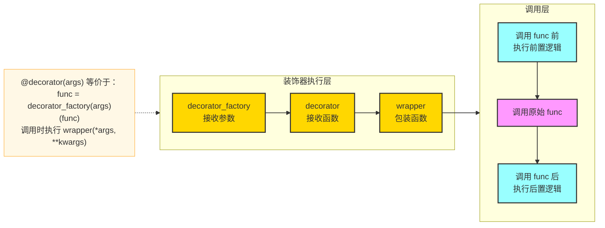
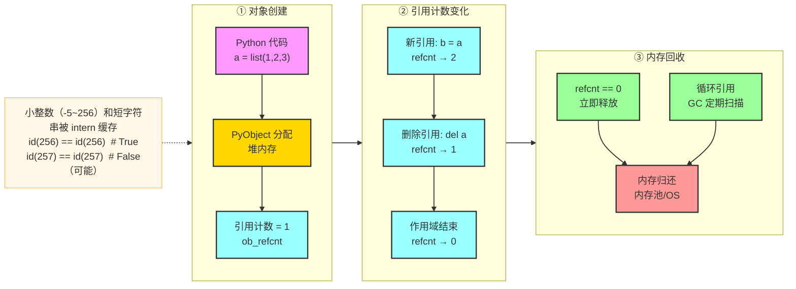
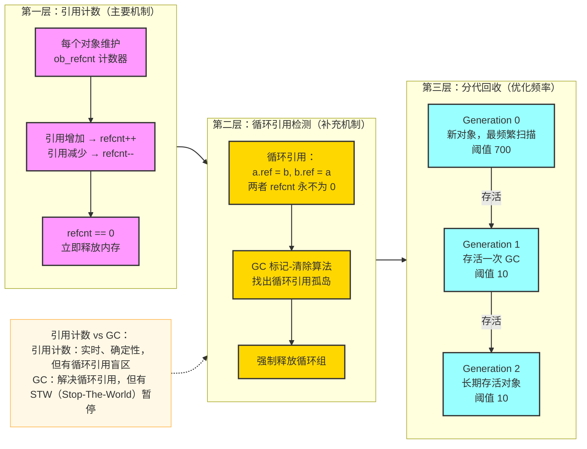
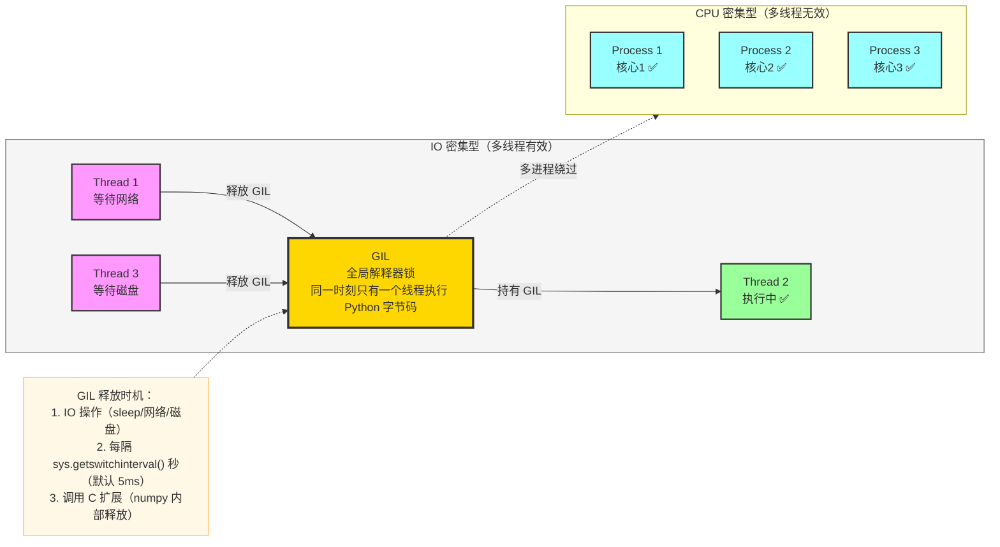
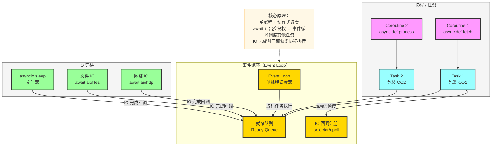
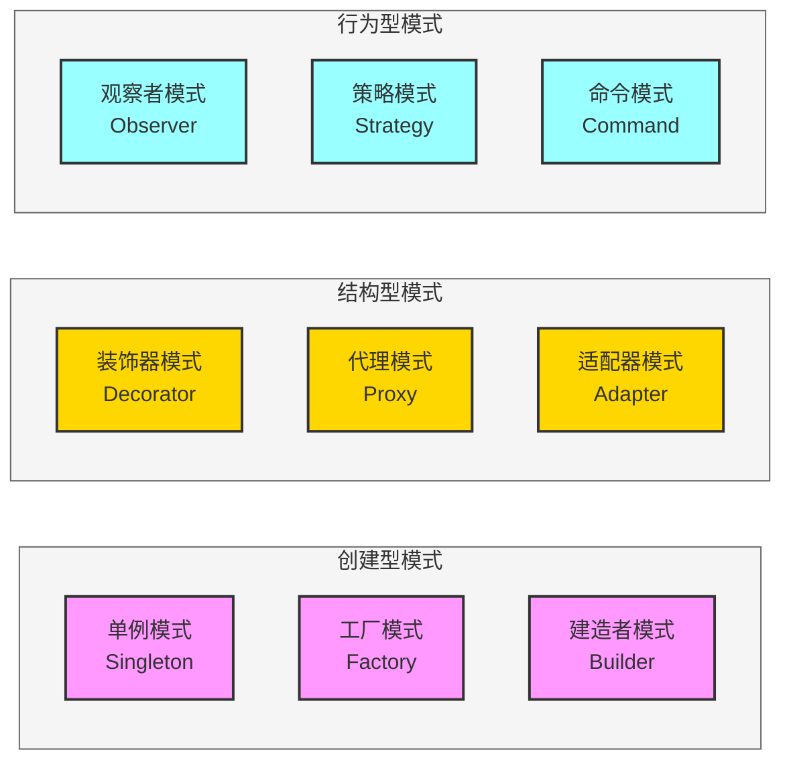
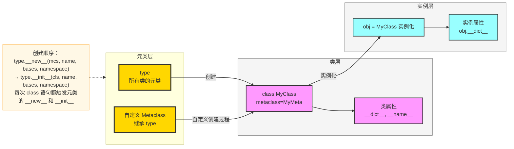

# Python 高级开发面试 FAQ

> 覆盖高级语法特性、性能优化、内存管理、垃圾回收、并发编程、设计模式等核心考点，每道题均配有原理分析与代码示例。

---

## 目录

1. [高级语法与特性](#一高级语法与特性)
2. [性能优化与内存管理](#二性能优化与内存管理)
3. [垃圾回收机制](#三垃圾回收机制)
4. [多线程与多进程编程](#四多线程与多进程编程)
5. [异步编程（asyncio）](#五异步编程asyncio)
6. [设计模式与最佳实践](#六设计模式与最佳实践)
7. [数据结构与算法考点](#七数据结构与算法考点)
8. [元编程与描述符](#八元编程与描述符)

---

## 一、高级语法与特性

### Q1：解释 Python 的装饰器原理，如何实现一个带参数的装饰器？

**原理：** 装饰器是一个高阶函数，接收函数作为参数，返回包装后的新函数。本质是语法糖，`@decorator` 等价于 `func = decorator(func)`。



```python
import functools
import time
import logging

# ① 无参数装饰器
def timer(func):
    @functools.wraps(func)   # 保留原函数元信息（__name__, __doc__）
    def wrapper(*args, **kwargs):
        start = time.perf_counter()
        result = func(*args, **kwargs)
        elapsed = time.perf_counter() - start
        print(f"{func.__name__} 耗时 {elapsed:.4f}s")
        return result
    return wrapper

# ② 带参数的装饰器（三层嵌套）
def retry(max_times: int = 3, exceptions: tuple = (Exception,)):
    """可配置重试次数和异常类型的装饰器"""
    def decorator(func):
        @functools.wraps(func)
        def wrapper(*args, **kwargs):
            for attempt in range(1, max_times + 1):
                try:
                    return func(*args, **kwargs)
                except exceptions as e:
                    if attempt == max_times:
                        raise
                    logging.warning(f"第 {attempt} 次失败: {e}，重试中...")
        return wrapper
    return decorator

# ③ 类装饰器（推荐用于有状态的装饰器）
class RateLimit:
    def __init__(self, calls_per_second: int):
        self.min_interval = 1.0 / calls_per_second
        self.last_call = 0.0

    def __call__(self, func):
        @functools.wraps(func)
        def wrapper(*args, **kwargs):
            elapsed = time.time() - self.last_call
            if elapsed < self.min_interval:
                time.sleep(self.min_interval - elapsed)
            self.last_call = time.time()
            return func(*args, **kwargs)
        return wrapper

@retry(max_times=3, exceptions=(ConnectionError, TimeoutError))
@timer
def fetch_data(url: str) -> dict:
    """示例：带重试和计时的网络请求"""
    ...
```

**考点追问：** `@functools.wraps` 的作用？
> 不加时，`func.__name__` 变为 `wrapper`，`func.__doc__` 丢失，会导致 API 文档、日志、调试信息混乱。`wraps` 将原函数的 `__name__`、`__doc__`、`__annotations__` 等属性复制到 `wrapper`。

---

### Q2：生成器（Generator）与迭代器（Iterator）的区别？`yield from` 的作用？

```python
# 迭代器协议：实现 __iter__ 和 __next__
class CountUp:
    def __init__(self, limit):
        self.limit = limit
        self.current = 0

    def __iter__(self):
        return self

    def __next__(self):
        if self.current >= self.limit:
            raise StopIteration
        self.current += 1
        return self.current

# 生成器：用 yield 的函数，自动实现迭代器协议
def count_up(limit):
    for i in range(1, limit + 1):
        yield i          # 暂停执行，返回值，下次 next() 从这里继续

# 生成器表达式（惰性求值，节省内存）
squares = (x ** 2 for x in range(10**8))  # 不会立即计算

# yield from：委托子生成器，等价于 for item in sub: yield item
def chain(*iterables):
    for it in iterables:
        yield from it    # 扁平化嵌套，并正确传递 send/throw/close

def flatten(nested):
    """递归展开任意深度嵌套列表"""
    for item in nested:
        if isinstance(item, list):
            yield from flatten(item)  # 递归委托
        else:
            yield item

list(flatten([1, [2, [3, 4]], [5, 6]]))  # [1, 2, 3, 4, 5, 6]
```

**核心区别：**

| 对比项 | 迭代器 | 生成器 |
|--------|--------|--------|
| 实现方式 | 实现 `__iter__` + `__next__` | 包含 `yield` 的函数 |
| 状态保存 | 手动维护实例属性 | 自动保存执行栈帧 |
| 内存占用 | 视实现而定 | 极低（惰性求值） |
| 支持 send/throw | 需手动实现 | 原生支持（协程基础） |

---

### Q3：`__slots__` 是什么？什么时候使用它？

```python
# 普通类：每个实例有 __dict__（字典），灵活但内存开销大
class PointDict:
    def __init__(self, x, y):
        self.x = x
        self.y = y

# 使用 __slots__：用固定数组代替 __dict__
class PointSlots:
    __slots__ = ("x", "y")   # 声明允许的属性，不能动态添加其他属性

    def __init__(self, x, y):
        self.x = x
        self.y = y

import sys
p1 = PointDict(1, 2)
p2 = PointSlots(1, 2)
print(sys.getsizeof(p1.__dict__))  # ~200 bytes（字典开销）
print(hasattr(p2, "__dict__"))      # False

# 性能对比（百万个实例）
# PointDict: ~180MB，PointSlots: ~56MB（节省约 70%）
```

**适用场景：** 需要创建大量实例的数据类（如坐标点、事件对象、ORM 行记录）。

**注意：** 继承时子类若不声明 `__slots__`，仍会有 `__dict__`；多继承时 `__slots__` 需谨慎处理。

---

### Q4：上下文管理器（`with` 语句）的实现原理？

```python
# 方式一：实现 __enter__ / __exit__ 协议
class ManagedResource:
    def __enter__(self):
        print("获取资源")
        return self          # 赋值给 as 子句的变量

    def __exit__(self, exc_type, exc_val, exc_tb):
        print("释放资源")
        # 返回 True 表示吞掉异常，False/None 表示异常继续传播
        return False

# 方式二：contextlib.contextmanager（推荐，更简洁）
from contextlib import contextmanager, asynccontextmanager

@contextmanager
def timer_ctx(label: str):
    start = time.perf_counter()
    try:
        yield              # yield 之前是 __enter__，之后是 __exit__
    finally:
        elapsed = time.perf_counter() - start
        print(f"{label}: {elapsed:.4f}s")

# 方式三：异步上下文管理器
@asynccontextmanager
async def db_transaction(conn):
    async with conn.transaction():
        try:
            yield conn
        except Exception:
            await conn.rollback()
            raise
        else:
            await conn.commit()

with timer_ctx("数据处理"):
    result = sum(range(10**7))
```

---

### Q5：Python 的描述符协议（Descriptor Protocol）

```python
# 描述符：实现了 __get__、__set__、__delete__ 之一的类
class TypedAttribute:
    """类型检查描述符"""
    def __set_name__(self, owner, name):   # Python 3.6+，自动获取属性名
        self.name = name
        self.private_name = f"_{name}"

    def __get__(self, obj, objtype=None):
        if obj is None:
            return self           # 通过类访问时返回描述符本身
        return getattr(obj, self.private_name, None)

    def __set__(self, obj, value):
        if not isinstance(value, self.expected_type):
            raise TypeError(f"{self.name} 必须是 {self.expected_type.__name__}")
        setattr(obj, self.private_name, value)

class IntAttribute(TypedAttribute):
    expected_type = int

class StrAttribute(TypedAttribute):
    expected_type = str

class Person:
    name = StrAttribute()
    age  = IntAttribute()

    def __init__(self, name, age):
        self.name = name    # 触发 StrAttribute.__set__
        self.age  = age     # 触发 IntAttribute.__set__

p = Person("Alice", 30)
p.age = "thirty"  # TypeError: age 必须是 int
```

**property 本质上也是描述符：**

```python
class Circle:
    def __init__(self, radius):
        self._radius = radius

    @property
    def radius(self):
        return self._radius

    @radius.setter
    def radius(self, value):
        if value < 0:
            raise ValueError("半径不能为负")
        self._radius = value

    @property
    def area(self):
        import math
        return math.pi * self._radius ** 2
```

---

## 二、性能优化与内存管理

### Q6：Python 的内存模型和对象生命周期



```python
import sys

a = [1, 2, 3]
print(sys.getrefcount(a))  # 2（a 本身 + getrefcount 参数）

b = a
print(sys.getrefcount(a))  # 3

del b
print(sys.getrefcount(a))  # 2

# 小整数缓存（-5 ~ 256）
x = 100; y = 100
print(x is y)   # True（同一对象）

x = 1000; y = 1000
print(x is y)   # False（不同对象，大整数不缓存）
```

---

### Q7：常见的 Python 性能优化手段有哪些？

```python
# ① 列表推导式 vs for 循环（字节码层面优化）
# 慢：
result = []
for x in range(1000):
    result.append(x ** 2)

# 快（推导式避免了方法查找开销）：
result = [x ** 2 for x in range(1000)]

# ② 使用 join 代替字符串拼接
# 慢：O(n²) 内存分配
s = ""
for word in words:
    s += word

# 快：O(n) 一次分配
s = "".join(words)

# ③ 使用 local 变量加速（避免全局/属性查找）
import math
def compute_slow(data):
    return [math.sqrt(x) for x in data]    # 每次查找全局 math.sqrt

def compute_fast(data):
    sqrt = math.sqrt                        # 缓存到局部变量
    return [sqrt(x) for x in data]

# ④ 使用 __slots__ 减少内存（见 Q3）

# ⑤ 使用 collections 替代原生结构
from collections import defaultdict, Counter, deque

# defaultdict：避免 KeyError 检查
word_count = defaultdict(int)
for word in text.split():
    word_count[word] += 1

# deque：O(1) 的两端操作（list 左端操作是 O(n)）
queue = deque(maxlen=100)
queue.appendleft(item)   # O(1)

# ⑥ NumPy 向量化（避免 Python 层循环）
import numpy as np
data = np.array(range(10**6))
result = np.sqrt(data)   # C 层循环，比 Python 快 100x+

# ⑦ lru_cache 缓存昂贵计算
from functools import lru_cache

@lru_cache(maxsize=128)
def fib(n: int) -> int:
    if n < 2:
        return n
    return fib(n - 1) + fib(n - 2)

# ⑧ 使用 array 模块代替 list 存储同类型数值
import array
int_array = array.array("i", range(10**6))  # 内存比 list 小 4~5 倍
```

---

### Q8：如何分析 Python 程序的性能瓶颈？

```python
# ① cProfile：函数级性能分析
import cProfile
import pstats

with cProfile.Profile() as pr:
    your_function()

stats = pstats.Stats(pr)
stats.sort_stats("cumulative")   # 按累计时间排序
stats.print_stats(20)            # 打印前 20 条

# ② line_profiler：行级分析（需 pip install line-profiler）
# 在函数上加 @profile，然后运行 kernprof -l -v script.py

# ③ memory_profiler：内存分析（需 pip install memory-profiler）
from memory_profiler import profile

@profile
def memory_heavy():
    data = [i for i in range(10**6)]
    return sum(data)

# ④ timeit：精确计时小代码片段
import timeit
t = timeit.timeit(
    stmt="[x**2 for x in range(1000)]",
    number=10000,
)
print(f"平均耗时: {t/10000*1000:.3f} ms")

# ⑤ tracemalloc：追踪内存分配
import tracemalloc

tracemalloc.start()
your_function()
snapshot = tracemalloc.take_snapshot()
top_stats = snapshot.statistics("lineno")
for stat in top_stats[:5]:
    print(stat)
```

---

## 三、垃圾回收机制

### Q9：Python 的垃圾回收机制是怎样的？



```python
import gc

# 演示循环引用
class Node:
    def __init__(self, name):
        self.name = name
        self.ref = None

a = Node("A")
b = Node("B")
a.ref = b    # A 引用 B
b.ref = a    # B 引用 A（循环引用）

del a, del b  # 删除外部引用，但两者 refcnt 仍为 1（互相引用）
              # 不会被引用计数回收！

gc.collect()  # 手动触发 GC，检测并回收循环引用

# 分代信息
print(gc.get_count())     # (eden代计数, 1代计数, 2代计数)
print(gc.get_threshold()) # (700, 10, 10) 各代触发阈值

# __del__ 方法会阻止 GC 回收循环引用（Python 3.4+ 已修复）
# 解决循环引用的正确方式：weakref
import weakref

class Parent:
    def __init__(self):
        self.children = []

class Child:
    def __init__(self, parent):
        self.parent = weakref.ref(parent)  # 弱引用，不增加 refcnt

parent = Parent()
child = Child(parent)
parent.children.append(child)
# parent 被删除后，child.parent() 返回 None，不产生循环引用
```

**分代回收原理：** 统计学规律"大多数对象生命周期很短"。新对象放 Generation 0 频繁扫描；存活下来的晋升到更老的代，扫描频率降低，减少 GC 开销。

---

### Q10：如何避免内存泄漏？

```python
# 常见内存泄漏场景及解决方案

# ① 全局变量积累
_cache = {}   # 全局缓存不加限制

# 解决：使用 LRU 缓存
from functools import lru_cache
from cachetools import TTLCache, cached

@lru_cache(maxsize=1000)       # 最多缓存 1000 条
def expensive_compute(x): ...

ttl_cache = TTLCache(maxsize=1000, ttl=300)  # 5分钟过期

# ② 未关闭的文件/连接
# 错误：
f = open("file.txt")
data = f.read()
# 忘记 f.close()

# 正确：
with open("file.txt") as f:
    data = f.read()   # 无论异常还是正常，文件都会被关闭

# ③ 事件监听器 / 回调未移除
class EventBus:
    _listeners: dict[str, list] = {}

    @classmethod
    def subscribe(cls, event, callback):
        cls._listeners.setdefault(event, []).append(callback)

    @classmethod
    def unsubscribe(cls, event, callback):
        cls._listeners.get(event, []).remove(callback)

# ④ 线程局部存储泄漏
import threading

local = threading.local()

def worker():
    local.data = [0] * 10**6   # 线程结束后若 local 对象仍存在，内存不释放
    # 用完后手动清理
    del local.data

# ⑤ 使用 weakref 避免缓存持有对象
import weakref

class ObjectPool:
    def __init__(self):
        self._pool = weakref.WeakValueDictionary()  # 对象无其他引用时自动从字典移除

    def get(self, key):
        return self._pool.get(key)

    def put(self, key, obj):
        self._pool[key] = obj
```

---

## 四、多线程与多进程编程

### Q11：GIL（全局解释器锁）是什么？它对并发编程有什么影响？



```python
# CPU 密集型：多线程 vs 多进程 对比
import threading
import multiprocessing
import time

def cpu_bound(n):
    """CPU 密集计算"""
    return sum(i * i for i in range(n))

N = 10**7

# 单线程基准
start = time.time()
cpu_bound(N)
cpu_bound(N)
print(f"单线程: {time.time() - start:.2f}s")

# 多线程（GIL 导致无加速，甚至更慢）
start = time.time()
threads = [threading.Thread(target=cpu_bound, args=(N,)) for _ in range(2)]
[t.start() for t in threads]
[t.join() for t in threads]
print(f"多线程: {time.time() - start:.2f}s")   # 与单线程相近

# 多进程（真正并行，加速约 2x）
start = time.time()
with multiprocessing.Pool(2) as pool:
    pool.map(cpu_bound, [N, N])
print(f"多进程: {time.time() - start:.2f}s")   # 约 0.5x 单线程时间
```

---

### Q12：线程安全问题与同步原语

```python
import threading
from queue import Queue

# ① 竞争条件（Race Condition）演示
counter = 0

def increment():
    global counter
    for _ in range(100000):
        counter += 1    # 非原子操作！read-modify-write 三步

threads = [threading.Thread(target=increment) for _ in range(10)]
[t.start() for t in threads]
[t.join() for t in threads]
print(counter)   # 预期 1000000，实际可能是 800000 左右

# ② Lock：互斥锁
lock = threading.Lock()
counter = 0

def safe_increment():
    global counter
    for _ in range(100000):
        with lock:          # 等价于 lock.acquire() ... lock.release()
            counter += 1    # 临界区

# ③ RLock：可重入锁（同一线程可多次获取）
rlock = threading.RLock()
def recursive_func(n):
    with rlock:
        if n > 0:
            recursive_func(n - 1)   # 同一线程再次获取 rlock，不会死锁

# ④ Event：线程间事件通知
event = threading.Event()

def producer():
    time.sleep(1)
    event.set()   # 发出信号

def consumer():
    event.wait()  # 阻塞等待信号
    print("收到信号，开始处理")

# ⑤ Semaphore：限制并发数
sem = threading.Semaphore(3)   # 最多 3 个线程同时进入

def limited_resource():
    with sem:
        print(f"线程 {threading.current_thread().name} 进入")
        time.sleep(1)

# ⑥ 线程安全队列（生产者-消费者模式）
task_queue = Queue(maxsize=10)

def producer_worker():
    for i in range(20):
        task_queue.put(i)        # 队满时阻塞
    task_queue.put(None)         # 哨兵值，通知消费者结束

def consumer_worker():
    while True:
        item = task_queue.get()  # 队空时阻塞
        if item is None:
            break
        process(item)
        task_queue.task_done()   # 通知 queue.join() 任务完成
```

---

### Q13：多进程编程的关键技术

```python
import multiprocessing as mp
from multiprocessing import Pool, Manager, Pipe, Queue

# ① 进程池（推荐用于 CPU 密集任务）
def process_item(item):
    return item ** 2

with Pool(processes=mp.cpu_count()) as pool:
    # map：阻塞等待所有结果
    results = pool.map(process_item, range(100))

    # imap：惰性迭代，内存友好
    for result in pool.imap(process_item, range(100), chunksize=10):
        print(result)

    # apply_async：异步提交单个任务
    future = pool.apply_async(process_item, args=(42,))
    result = future.get(timeout=5)

# ② 进程间通信（IPC）
# Queue（多进程安全）
q = mp.Queue()

def producer(q):
    q.put({"data": [1, 2, 3]})   # 数据会被 pickle 序列化

def consumer(q):
    item = q.get()
    print(item)

# Pipe（双向管道，比 Queue 更快，适合两个进程通信）
parent_conn, child_conn = Pipe()

def child_proc(conn):
    conn.send("hello from child")
    msg = conn.recv()
    print(f"child received: {msg}")

# ③ 共享内存（零拷贝，最高效）
from multiprocessing import shared_memory
import numpy as np

# 创建共享内存
shm = shared_memory.SharedMemory(create=True, size=1024)
array = np.ndarray((128,), dtype=np.float64, buffer=shm.buf)
array[:] = np.zeros(128)

# 子进程访问相同共享内存
def worker(shm_name):
    existing_shm = shared_memory.SharedMemory(name=shm_name)
    shared_array = np.ndarray((128,), dtype=np.float64, buffer=existing_shm.buf)
    shared_array[0] = 42.0
    existing_shm.close()

shm.close()
shm.unlink()  # 用完必须释放

# ④ Manager：共享复杂对象（慢但通用）
with Manager() as manager:
    shared_dict = manager.dict()
    shared_list = manager.list()
    lock = manager.Lock()

    def worker(d, l, lock):
        with lock:
            d["count"] = d.get("count", 0) + 1
            l.append(1)
```

---

## 五、异步编程（asyncio）

### Q14：asyncio 的工作原理？协程、任务、事件循环的关系？



```python
import asyncio
import aiohttp

# ① 基本协程
async def fetch(url: str, session: aiohttp.ClientSession) -> str:
    async with session.get(url) as response:
        return await response.text()   # await 让出控制权，等待 IO 完成

# ② 并发执行多个协程
async def fetch_all(urls: list[str]) -> list[str]:
    async with aiohttp.ClientSession() as session:
        tasks = [asyncio.create_task(fetch(url, session)) for url in urls]
        results = await asyncio.gather(*tasks, return_exceptions=True)
    return results

# ③ 超时控制
async def with_timeout(coro, timeout: float):
    try:
        return await asyncio.wait_for(coro, timeout=timeout)
    except asyncio.TimeoutError:
        print("超时！")
        return None

# ④ 信号量限制并发数
async def bounded_fetch(url, session, semaphore):
    async with semaphore:    # 最多 10 个协程同时执行
        return await fetch(url, session)

async def main():
    sem = asyncio.Semaphore(10)
    urls = [f"https://api.example.com/item/{i}" for i in range(100)]
    async with aiohttp.ClientSession() as session:
        tasks = [bounded_fetch(url, session, sem) for url in urls]
        results = await asyncio.gather(*tasks)

asyncio.run(main())

# ⑤ 异步生成器
async def async_paginate(api_url: str):
    """分页获取数据的异步生成器"""
    page = 1
    async with aiohttp.ClientSession() as session:
        while True:
            data = await fetch(f"{api_url}?page={page}", session)
            if not data:
                break
            yield data
            page += 1

async def process_all():
    async for page_data in async_paginate("https://api.example.com/items"):
        process(page_data)
```

---

### Q15：如何在同步代码中调用异步函数？线程与协程如何协作？

```python
import asyncio
from concurrent.futures import ThreadPoolExecutor

# ① 在同步代码中运行异步代码
result = asyncio.run(main())   # Python 3.7+，新建事件循环运行

# ② 在异步代码中运行同步阻塞代码（避免阻塞事件循环）
async def run_blocking():
    loop = asyncio.get_event_loop()
    # 将阻塞函数放到线程池执行，不阻塞事件循环
    result = await loop.run_in_executor(
        None,          # 使用默认线程池
        blocking_io_function,
        arg1, arg2,
    )
    return result

# ③ 自定义线程池
executor = ThreadPoolExecutor(max_workers=4)

async def cpu_in_async():
    loop = asyncio.get_event_loop()
    # CPU 密集任务放到进程池
    from concurrent.futures import ProcessPoolExecutor
    with ProcessPoolExecutor() as pool:
        result = await loop.run_in_executor(pool, cpu_bound_func, data)
    return result
```

---

## 六、设计模式与最佳实践

### Q16：Python 中常用的设计模式实现



**9 种设计模式概述：**

| 模式 | 类型 | 概述 |
|------|------|------|
| **① 单例模式** | 创建型 | 确保类只有一个实例，全局共享。常用于配置、连接池等。 |
| **② 工厂模式** | 创建型 | 将对象创建逻辑封装，通过名称/参数创建不同实现，解耦调用方与具体类。 |
| **③ 建造者模式** | 创建型 | 分步构建复杂对象，链式调用，使构建过程清晰、可读。 |
| **④ 装饰器模式** | 结构型 | 动态为对象/函数增加职责，不修改原实现，符合开闭原则。 |
| **⑤ 代理模式** | 结构型 | 为对象提供代理，控制访问（延迟加载、权限、缓存等）。 |
| **⑥ 适配器模式** | 结构型 | 将一个类的接口转换成调用方期望的接口，使不兼容类能协同工作。 |
| **⑦ 观察者模式** | 行为型 | 定义一对多依赖，主题状态变化时通知所有观察者，实现松耦合事件系统。 |
| **⑧ 策略模式** | 行为型 | 将算法族封装为可互换策略，通过依赖注入切换，避免 if-else。 |
| **⑨ 命令模式** | 行为型 | 将请求封装为对象，解耦调用者与执行者，支持撤销、队列、宏命令。 |

```python
# ① 单例模式（Singleton）—— 确保全局唯一实例，如配置、连接池
import threading

class Singleton:
    _instance = None
    _lock = threading.Lock()

    def __new__(cls):
        if cls._instance is None:
            with cls._lock:          # 双重检查锁（DCL）
                if cls._instance is None:
                    cls._instance = super().__new__(cls)
        return cls._instance

# 更 Pythonic 的方式：用模块级变量（模块本身是单例）
# config.py 中定义对象，import 它就是单例

# ② 工厂模式（注册表 + 反射）
class ModelFactory:
    _registry: dict[str, type] = {}

    @classmethod
    def register(cls, name: str):
        def decorator(model_class):
            cls._registry[name] = model_class
            return model_class
        return decorator

    @classmethod
    def create(cls, name: str, **kwargs):
        if name not in cls._registry:
            raise ValueError(f"未知模型类型: {name}")
        return cls._registry[name](**kwargs)

@ModelFactory.register("openai")
class OpenAIModel:
    def __init__(self, **kwargs): ...

@ModelFactory.register("anthropic")
class AnthropicModel:
    def __init__(self, **kwargs): ...

model = ModelFactory.create("openai", temperature=0.7)

# ③ 建造者模式（链式调用）
class QueryBuilder:
    def __init__(self):
        self._select = "*"
        self._table = ""
        self._where: list[str] = []

    def select(self, fields: str = "*"):
        self._select = fields
        return self

    def from_table(self, table: str):
        self._table = table
        return self

    def where(self, condition: str):
        self._where.append(condition)
        return self

    def build(self) -> str:
        sql = f"SELECT {self._select} FROM {self._table}"
        if self._where:
            sql += " WHERE " + " AND ".join(self._where)
        return sql

query = QueryBuilder().select("id, name").from_table("users").where("age > 18").build()

# ④ 装饰器模式（Decorator）—— 动态增强对象/函数职责，不修改原实现
from functools import wraps

def retry(max_attempts: int = 3):
    def decorator(func):
        @wraps(func)
        def wrapper(*args, **kwargs):
            for attempt in range(max_attempts):
                try:
                    return func(*args, **kwargs)
                except Exception as e:
                    if attempt == max_attempts - 1:
                        raise
        return wrapper
    return decorator

@retry(max_attempts=3)
def fetch_data(url: str): ...

# ⑤ 代理模式（Proxy）—— 为对象提供代理，控制访问（延迟加载、权限、缓存等）
class LazyImage:
    def __init__(self, filename: str):
        self._filename = filename
        self._image = None

    def display(self):
        if self._image is None:
            self._image = self._load_from_disk()
        return self._image.render()

    def _load_from_disk(self):
        return Image(self._filename)  # 模拟昂贵操作

# ⑥ 适配器模式（Adapter）—— 统一不同接口，使不兼容类能协同工作
class OldLogger:
    def log_message(self, msg: str): ...

class NewLogger:
    def log(self, level: str, message: str): ...

class LoggerAdapter:
    def __init__(self, old_logger: OldLogger):
        self._old = old_logger

    def log(self, level: str, message: str):
        self._old.log_message(f"[{level}] {message}")

# NewLogger 与 LoggerAdapter 接口一致，可互换使用
def use_logger(logger: object):
    logger.log("INFO", "hello")

# ⑦ 观察者模式（Observer）—— 一对多依赖，主题变化时通知所有观察者
from collections import defaultdict
from typing import Callable

class EventEmitter:
    def __init__(self):
        self._listeners: dict[str, list[Callable]] = defaultdict(list)

    def on(self, event: str, callback: Callable):
        self._listeners[event].append(callback)
        return lambda: self._listeners[event].remove(callback)  # 返回取消订阅函数

    def emit(self, event: str, *args, **kwargs):
        for callback in self._listeners[event]:
            callback(*args, **kwargs)

bus = EventEmitter()
unsubscribe = bus.on("user.login", lambda user: print(f"{user} 登录"))
bus.emit("user.login", "Alice")
unsubscribe()  # 取消订阅

# ⑧ 策略模式（Strategy）—— 封装可互换算法，通过依赖注入切换
from abc import ABC, abstractmethod

class SortStrategy(ABC):
    @abstractmethod
    def sort(self, data: list) -> list: ...

class QuickSort(SortStrategy):
    def sort(self, data):
        if len(data) <= 1:
            return data
        pivot = data[len(data) // 2]
        return (self.sort([x for x in data if x < pivot])
                + [x for x in data if x == pivot]
                + self.sort([x for x in data if x > pivot]))

class Sorter:
    def __init__(self, strategy: SortStrategy):
        self._strategy = strategy

    def sort(self, data):
        return self._strategy.sort(data)

sorter = Sorter(QuickSort())
result = sorter.sort([3, 1, 4, 1, 5, 9])

# ⑨ 命令模式（Command）—— 将请求封装为对象，解耦调用者与执行者
from abc import ABC, abstractmethod
from dataclasses import dataclass

class Command(ABC):
    @abstractmethod
    def execute(self) -> None: ...

@dataclass
class Light:
    on: bool = False

    def turn_on(self): self.on = True

    def turn_off(self): self.on = False

class LightOnCommand(Command):
    def __init__(self, light: Light):
        self._light = light

    def execute(self):
        self._light.turn_on()

class Invoker:
    def __init__(self):
        self._command: Command | None = None

    def set_command(self, cmd: Command):
        self._command = cmd

    def do_it(self):
        if self._command:
            self._command.execute()

light = Light()
invoker = Invoker()
invoker.set_command(LightOnCommand(light))
invoker.do_it()  # light.on == True
```

---

### Q17：Python 中的 SOLID 原则实践

```python
# 单一职责原则（SRP）：每个类只做一件事
class UserRepository:
    """只负责用户数据的读写"""
    def find_by_id(self, user_id: str): ...
    def save(self, user): ...

class EmailService:
    """只负责发送邮件"""
    def send(self, to: str, subject: str, body: str): ...

class UserService:
    """只负责业务协调"""
    def __init__(self, repo: UserRepository, email: EmailService):
        self.repo = repo
        self.email = email

    def register(self, user_data: dict):
        user = self.repo.save(user_data)
        self.email.send(user["email"], "欢迎注册", "...")
        return user

# 开放-封闭原则（OCP）：对扩展开放，对修改关闭
from abc import ABC, abstractmethod

class Exporter(ABC):
    @abstractmethod
    def export(self, data: list) -> bytes: ...

class CSVExporter(Exporter):
    def export(self, data):
        import csv, io
        buf = io.StringIO()
        writer = csv.writer(buf)
        writer.writerows(data)
        return buf.getvalue().encode()

class JSONExporter(Exporter):
    def export(self, data):
        import json
        return json.dumps(data).encode()

# 新增 Excel 导出只需新建类，无需修改现有代码
class ExcelExporter(Exporter):
    def export(self, data): ...

# 依赖倒置原则（DIP）：依赖抽象，不依赖具体
class ReportGenerator:
    def __init__(self, exporter: Exporter):   # 依赖抽象接口
        self.exporter = exporter              # 运行时注入具体实现

    def generate(self, data):
        return self.exporter.export(data)
```

---

## 七、数据结构与算法考点

### Q18：Python 内置数据结构的时间复杂度

| 操作 | list | dict | set | deque |
|------|------|------|-----|-------|
| 末尾追加 | O(1) | — | — | O(1) |
| 头部插入 | O(n) | — | — | O(1) |
| 随机访问 | O(1) | O(1) | — | O(n) |
| 查找元素 | O(n) | O(1) | O(1) | O(n) |
| 删除元素 | O(n) | O(1) | O(1) | O(1) 两端 |
| 排序 | O(n log n) | — | — | — |

```python
# 用对的数据结构解决问题

# ① 频繁查找 → dict/set（O(1) vs list O(n)）
seen = set()
def has_duplicate(nums):
    for n in nums:
        if n in seen:      # O(1)
            return True
        seen.add(n)
    return False

# ② 优先队列 → heapq
import heapq

tasks = [(3, "低优先级"), (1, "紧急"), (2, "普通")]
heapq.heapify(tasks)
priority, task = heapq.heappop(tasks)   # 弹出最小元素（最高优先级）

# ③ 有序字典（Python 3.7+ dict 已保序）
from collections import OrderedDict

# LRU 缓存实现
class LRUCache:
    def __init__(self, capacity: int):
        self.capacity = capacity
        self.cache = OrderedDict()

    def get(self, key: int) -> int:
        if key not in self.cache:
            return -1
        self.cache.move_to_end(key)   # 移到末尾（最近使用）
        return self.cache[key]

    def put(self, key: int, value: int):
        if key in self.cache:
            self.cache.move_to_end(key)
        self.cache[key] = value
        if len(self.cache) > self.capacity:
            self.cache.popitem(last=False)  # 弹出最旧的（头部）
```

---

### Q19：Python 的函数式编程工具

```python
from functools import reduce, partial
from itertools import chain, groupby, islice

# ① map/filter/reduce
numbers = [1, 2, 3, 4, 5, 6, 7, 8, 9, 10]

evens = list(filter(lambda x: x % 2 == 0, numbers))        # [2,4,6,8,10]
squares = list(map(lambda x: x ** 2, numbers))              # [1,4,9,...]
total = reduce(lambda acc, x: acc + x, numbers, 0)          # 55

# ② partial：偏函数应用
def power(base, exponent):
    return base ** exponent

square = partial(power, exponent=2)
cube   = partial(power, exponent=3)
print(square(5))   # 25
print(cube(3))     # 27

# ③ itertools：高效迭代
# chain：合并多个可迭代对象
for item in chain([1, 2], [3, 4], [5]):
    print(item)   # 1 2 3 4 5

# groupby：分组（需先排序）
data = [{"type": "A", "v": 1}, {"type": "B", "v": 2}, {"type": "A", "v": 3}]
data.sort(key=lambda x: x["type"])
for key, group in groupby(data, key=lambda x: x["type"]):
    print(key, list(group))

# islice：惰性切片大数据
def first_n(iterable, n):
    return list(islice(iterable, n))

# ④ 函数组合
def compose(*funcs):
    """从右到左组合函数：compose(f, g, h)(x) = f(g(h(x)))"""
    return reduce(lambda f, g: lambda x: f(g(x)), funcs)

pipeline = compose(
    lambda x: x * 2,
    lambda x: x + 1,
    lambda x: x ** 2,
)
print(pipeline(3))   # ((3**2)+1)*2 = 20
```

---

## 八、元编程与描述符

### Q20：元类（Metaclass）的原理与应用



```python
# ① 自定义元类：自动注册子类
class PluginMeta(type):
    _registry: dict[str, type] = {}

    def __new__(mcs, name, bases, namespace):
        cls = super().__new__(mcs, name, bases, namespace)
        # 跳过基类本身，只注册子类
        if bases:
            mcs._registry[name] = cls
        return cls

    @classmethod
    def get_plugin(mcs, name: str):
        return mcs._registry.get(name)

class BasePlugin(metaclass=PluginMeta):
    """所有插件的基类"""
    def execute(self): ...

class AudioPlugin(BasePlugin):
    def execute(self):
        print("处理音频")

class VideoPlugin(BasePlugin):
    def execute(self):
        print("处理视频")

plugin = PluginMeta.get_plugin("AudioPlugin")()
plugin.execute()   # 处理音频

# ② __init_subclass__（Python 3.6+，比元类更简洁）
class Registry:
    _subclasses: dict[str, type] = {}

    def __init_subclass__(cls, name: str = "", **kwargs):
        super().__init_subclass__(**kwargs)
        if name:
            Registry._subclasses[name] = cls

class SQLStore(Registry, name="sql"):
    pass

class RedisStore(Registry, name="redis"):
    pass

store = Registry._subclasses["sql"]()
```

---

### Q21：`__new__` vs `__init__` 的区别

```python
class Singleton:
    _instance = None

    def __new__(cls, *args, **kwargs):
        """控制对象创建（返回实例）"""
        if cls._instance is None:
            cls._instance = super().__new__(cls)
        return cls._instance    # 返回同一个实例

    def __init__(self, value):
        """初始化对象（每次调用都执行）"""
        self.value = value

s1 = Singleton(1)
s2 = Singleton(2)
print(s1 is s2)     # True（同一对象）
print(s1.value)     # 2（__init__ 被调用了两次）

# 不可变类型的创建（如自定义 int）
class PositiveInt(int):
    def __new__(cls, value):
        if value <= 0:
            raise ValueError("必须为正整数")
        return super().__new__(cls, value)
        # int 是不可变类型，值只能在 __new__ 中设置

n = PositiveInt(5)
print(n + 3)   # 8（继承了 int 的所有运算）
```

---

### Q22：`__getattr__` vs `__getattribute__` 的区别

```python
class SmartProxy:
    def __init__(self, target):
        # 用 object.__setattr__ 避免触发自定义 __setattr__
        object.__setattr__(self, "_target", target)

    def __getattribute__(self, name):
        """每次属性访问都触发（包括存在的属性）"""
        if name.startswith("_"):
            return object.__getattribute__(self, name)  # 避免递归
        print(f"访问属性: {name}")
        return object.__getattribute__(self, name)

    def __getattr__(self, name):
        """只在属性不存在时触发（__getattribute__ 抛出 AttributeError 后）"""
        target = object.__getattribute__(self, "_target")
        return getattr(target, name)   # 代理到目标对象

class API:
    def fetch(self): return "data"

proxy = SmartProxy(API())
proxy.fetch()   # 先触发 __getattribute__，然后代理到 API.fetch
proxy.nonexistent   # 触发 __getattr__，代理到 API
```

---

### Q23：高频面试快问快答

**Q：`is` 和 `==` 的区别？**
> `is` 比较对象**身份**（内存地址，等价于 `id(a) == id(b)`）；`==` 比较对象**值**（调用 `__eq__`）。`None` 判断应用 `is None`，不用 `== None`。

**Q：Python 中深拷贝和浅拷贝的区别？**
```python
import copy
a = [[1, 2], [3, 4]]

b = a.copy()         # 浅拷贝：外层新列表，内层列表共享
c = copy.deepcopy(a) # 深拷贝：完全独立的副本

a[0].append(99)
print(b[0])  # [1, 2, 99]（受影响）
print(c[0])  # [1, 2]（不受影响）
```

**Q：`*args` 和 `**kwargs` 的原理？**
> `*args` 收集位置参数为 `tuple`；`**kwargs` 收集关键字参数为 `dict`。调用时 `*iterable` 解包可迭代对象，`**mapping` 解包字典。

**Q：什么是 Python 的 MRO？**
```python
class A: pass
class B(A): pass
class C(A): pass
class D(B, C): pass

print(D.__mro__)
# (<class 'D'>, <class 'B'>, <class 'C'>, <class 'A'>, <class 'object'>)
# C3 线性化算法：保证每个类只出现一次，且继承顺序合理
```

**Q：`classmethod` vs `staticmethod` vs 实例方法？**
```python
class MyClass:
    count = 0

    def instance_method(self):
        """第一个参数是实例，可访问实例和类"""
        return self.count

    @classmethod
    def class_method(cls):
        """第一个参数是类本身，不能访问实例属性"""
        return cls.count

    @staticmethod
    def static_method():
        """无特殊第一个参数，就是普通函数，放在类里是为了逻辑分组"""
        return "与类/实例无关的工具函数"
```

**Q：`__call__` 有什么用？**
```python
class Multiplier:
    def __init__(self, factor):
        self.factor = factor

    def __call__(self, x):
        return x * self.factor

double = Multiplier(2)
print(double(5))    # 10，对象像函数一样被调用
print(callable(double))  # True
```

**Q：如何实现不可变对象？**
```python
from dataclasses import dataclass

@dataclass(frozen=True)        # frozen=True 使所有属性不可修改
class Point:
    x: float
    y: float

p = Point(1.0, 2.0)
p.x = 3.0   # FrozenInstanceError
hash(p)     # 可哈希，可作为 dict 键
```

**Q：`asyncio.gather` vs `asyncio.wait` 的区别？**

| 对比项 | `gather` | `wait` |
|--------|----------|--------|
| 返回 | 结果列表（保序） | `(done, pending)` 两个集合 |
| 异常处理 | 默认传播第一个异常 | 异常不自动传播 |
| 取消 | 取消 gather 会取消所有子任务 | 可部分取消 |
| 等待条件 | 等待全部完成 | 支持 `FIRST_COMPLETED`/`FIRST_EXCEPTION` |

---

*文档版本：v1.0 | 最后更新：2026-03*
