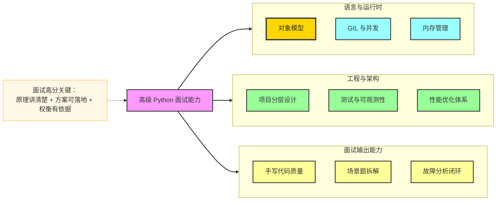
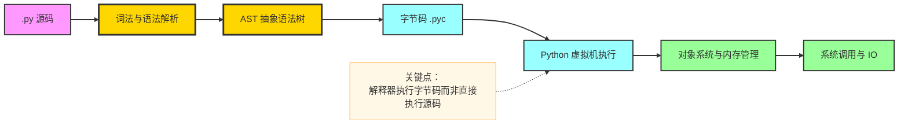
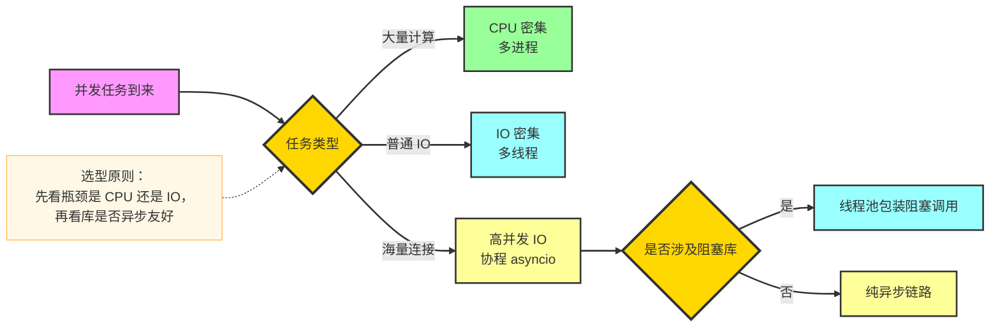
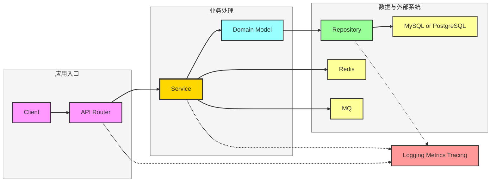
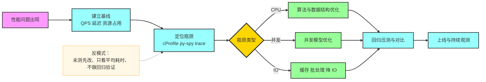
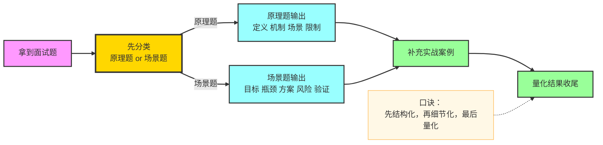

# 高级 Python 面试全景指南

本指南面向中高级 Python 岗位面试，目标是帮助你在“原理 + 架构 + 工程实践 + 场景题”四个维度构建完整知识闭环。  
内容覆盖语言核心机制、并发模型、内存与性能、工程架构、设计模式、常见框架与高频面试 FAQ，并附可直接渲染的 Mermaid 图示。

---

## 1. 面试能力地图

### 1.1 你会被考察的四层能力

- **语言底层能力**：对象模型、作用域、闭包、迭代器、生成器、装饰器、描述符、元类
- **并发与性能能力**：GIL、线程/进程/协程选型、异步 IO、性能分析与优化
- **工程设计能力**：项目分层、依赖管理、配置治理、日志与可观测性、测试策略
- **场景解决能力**：高并发接口、任务系统、缓存一致性、故障排查、线上稳定性

### 1.2 面试知识结构图

---

## 2. Python 核心机制必会

### 2.1 一切皆对象与对象模型

- Python 中函数、类、模块都属于对象
- 对象三要素：`id`、`type`、`value`
- 类本身也是对象，由元类创建，默认元类是 `type`
- 方法绑定本质：函数通过描述符协议绑定为实例方法

高频问法：
- `is` 和 `==` 区别是什么
- 可变对象和不可变对象如何影响参数传递
- `__dict__`、`__slots__` 的作用与权衡

### 2.2 作用域、闭包与 LEGB

- LEGB：Local -> Enclosing -> Global -> Builtins
- 闭包本质是函数携带其定义时环境
- `nonlocal` 修改外层函数变量，`global` 修改模块级变量

### 2.3 迭代器、生成器、协程基础

- 可迭代对象实现 `__iter__`
- 迭代器实现 `__iter__` 与 `__next__`
- 生成器函数通过 `yield` 产出惰性序列
- `yield from` 可将子生成器委托给外层生成器

### 2.4 装饰器、描述符、元类

- 装饰器是高阶函数，常用于鉴权、日志、缓存、重试
- 描述符协议：`__get__`、`__set__`、`__delete__`
- 元类用于控制“类的创建过程”，适合做类注册、接口约束

---

## 3. 运行时架构与执行流程

### 3.1 Python 执行主流程

### 3.2 内存管理

- **引用计数**：对象被引用次数为 0 时可立即回收
- **循环垃圾回收**：解决循环引用导致的泄漏
- **内存池机制**：小对象由 `pymalloc` 管理，降低频繁分配开销

高频追问：
- 为什么有了 GC 还会内存泄漏
- 如何定位 Python 进程内存持续增长

---

## 4. GIL 与并发编程体系

### 4.1 GIL 核心认知

- GIL 是 CPython 的全局解释器锁
- 同一时刻仅一个线程执行 Python 字节码
- IO 密集型可用多线程提升吞吐
- CPU 密集型建议多进程或 C 扩展释放 GIL

### 4.2 并发模型选型图

### 4.3 asyncio 高频点

- 事件循环：`event loop`
- 协程对象：`async def` 定义
- 任务调度：`create_task`、`gather`
- 边界处理：超时、取消、背压、异常聚合

---

## 5. 高级工程架构与分层设计

### 5.1 常见后端分层

- `API 层`：参数校验、鉴权、DTO 转换
- `Service 层`：编排业务流程、事务边界
- `Domain 层`：核心领域模型与规则
- `Repository 层`：持久化抽象
- `Infrastructure 层`：数据库、缓存、消息队列、第三方服务

### 5.2 典型请求链路

---

## 6. 常考设计模式与 Python 实践

### 6.1 单例模式

适用：全局配置、连接池管理器。  
风险：隐藏依赖，不利于测试隔离。

### 6.2 工厂模式

适用：根据配置动态创建不同实现，例如不同存储后端。  
优势：解耦“创建逻辑”和“业务逻辑”。

### 6.3 策略模式

适用：支付、风控、推荐等“可替换算法簇”场景。  
优势：避免大量 `if else` 分支膨胀。

### 6.4 观察者模式

适用：事件驱动、消息通知、任务状态回调。  
Python 中常结合 `signal`、事件总线、消息队列实现。

### 6.5 责任链模式

适用：中间件流水线，如认证、限流、审计、埋点。  
常见于 Web 框架请求处理链路。

---

## 7. 性能优化方法论

### 7.1 优化流程图

### 7.2 常见优化点

- 算法复杂度优先于微优化
- 减少不必要对象创建，复用热点数据结构
- 合理使用缓存，明确失效与一致性策略
- 数据库侧优化：索引、分页、批量操作、慢查询治理
- 异步任务削峰填谷，避免主链路阻塞

---

## 8. 测试、质量与可观测性

### 8.1 测试金字塔

- 单元测试：覆盖核心业务规则与边界条件
- 集成测试：验证数据库、缓存、MQ 等组件协作
- 端到端测试：验证关键用户流程

### 8.2 可观测性三件套

- **日志 Logging**：可检索、可追踪、带业务上下文
- **指标 Metrics**：吞吐、延迟、错误率、资源占用
- **链路 Tracing**：跨服务请求路径与瓶颈定位

高频问题：
- 如何设计结构化日志字段
- 如何定义接口 SLI 与 SLO
- 线上故障如何快速止血与复盘

---

## 9. 高级 Python 常考点清单

### 9.1 语言与实现

- 深浅拷贝、可变默认参数陷阱
- MRO 与 `super` 的真实行为
- GIL 对多线程计算任务的影响
- 生成器和协程的区别与联系
- 装饰器保留函数签名的处理方式

### 9.2 工程与架构

- 如何设计可扩展的插件化系统
- 配置分层与环境隔离如何实现
- 依赖注入在 Python 项目的实践方式
- 服务拆分边界与事务一致性策略

### 9.3 场景与排障

- 接口突增 10 倍流量如何应对
- Redis 缓存击穿、穿透、雪崩如何治理
- 队列堆积与消费者延迟如何定位
- 内存飙升如何快速定位对象来源

---

## 10. 经典与高频面试 FAQ

### FAQ 1：Python 参数传递是值传递还是引用传递

答：本质是“对象引用传递”。函数参数接收的是对象引用副本，是否影响外部取决于对象可变性与是否原地修改。

### FAQ 2：`list` 和 `tuple` 如何选

答：需要修改时用 `list`，强调不可变语义、可哈希键或轻量只读数据可用 `tuple`。不要把 `tuple` 仅理解为“性能更高”。

### FAQ 3：什么情况下 `__slots__` 有价值

答：大量小对象且属性集合固定时可减少内存占用并加速属性访问，但会降低动态扩展能力并影响某些序列化方式。

### FAQ 4：线程池和协程池怎么选

答：如果依赖库多为阻塞调用，线程池落地成本低；若链路可全异步化且连接规模大，协程并发效率更高。

### FAQ 5：多进程一定比多线程快吗

答：不一定。多进程绕开 GIL 但有进程创建和通信成本。任务粒度小、数据共享多时可能反而变慢。

### FAQ 6：如何解释 `async` 和 `await`

答：`async` 定义协程函数，`await` 表示挂起当前协程并把执行权交还事件循环，等待可等待对象完成后恢复。

### FAQ 7：如何设计一个高可用任务系统

答：核心要素包括任务幂等、重试策略、死信队列、延迟队列、监控告警、失败补偿和后台可视化运维能力。

### FAQ 8：线上 CPU 飙高如何排查

答：先确认是否业务流量激增，再通过采样火焰图定位热点函数，结合日志和最近发布记录缩小范围，最后回归验证。

### FAQ 9：如何回答“你做过哪些性能优化”

答：按“问题背景 -> 指标基线 -> 诊断过程 -> 优化动作 -> 结果量化 -> 副作用权衡”结构回答，避免只讲动作不讲收益。

### FAQ 10：怎么体现架构设计能力

答：展示你如何做边界划分、抽象稳定接口、控制复杂度、治理技术债，并给出在真实业务中的取舍依据。

---

## 11. 面试作答模板（建议背熟）

### 11.1 原理题模板

1. 先给定义  
2. 再讲底层机制  
3. 说明适用场景与限制  
4. 给一个线上例子或踩坑案例

### 11.2 场景题模板

1. 明确目标指标（吞吐、延迟、成本、稳定性）  
2. 拆分瓶颈点（CPU、IO、锁、网络、数据库）  
3. 给 2 到 3 个可落地方案并比较  
4. 说明风险、回滚、监控与验收方式

---

## 12. 冲刺建议（7 天）

- **Day 1 到 Day 2**：语言底层机制与高频陷阱
- **Day 3**：并发模型与 asyncio 体系
- **Day 4**：项目架构与设计模式
- **Day 5**：性能优化与排障实战
- **Day 6**：FAQ 模拟问答与手写题
- **Day 7**：复盘薄弱点，输出自己的“项目亮点故事”

最终目标：不是背答案，而是形成“可解释、可落地、可量化”的高级工程表达能力。

---

## 13. 高级 Python 2页速记版

### 13.1 第 1 页：原理与并发速记

#### A. 对象模型与语言机制

- Python 一切皆对象，函数和类也是对象
- 参数传递本质是对象引用传递
- 可变默认参数是创建时绑定，不是调用时绑定
- 闭包记住的是外层变量绑定，不是变量名本身
- MRO 决定多继承方法查找顺序，`super` 按 MRO 走

#### B. 内存与执行

- 源码 -> AST -> 字节码 -> 虚拟机执行
- 内存管理核心是引用计数 + 循环 GC + 内存池
- 常见泄漏不是“没 GC”，而是“对象仍被引用”
- 排查工具优先 `tracemalloc`、`objgraph`、采样火焰图

#### C. GIL 与并发选型

- GIL 限制同一时刻仅一个线程执行字节码
- CPU 密集优先多进程，IO 密集可用多线程
- 高并发网络 IO 优先协程
- 协程并不自动变快，前提是链路异步化完整

### 13.2 第 2 页：工程与面试输出速记

#### A. 架构分层记忆法

- API 做校验与鉴权
- Service 做流程编排与事务边界
- Domain 做核心规则
- Repository 做持久化抽象
- Infrastructure 对接 DB、Cache、MQ、外部 API

#### B. 性能优化 5 步

1. 建立基线（QPS、P95、错误率）  
2. 定位瓶颈（CPU、IO、锁、SQL）  
3. 设计方案（算法、并发、缓存、批处理）  
4. 回归压测（对照组）  
5. 上线观测（告警与回滚）

#### C. 场景题万能答题结构

1. 业务目标与约束  
2. 现状数据与瓶颈  
3. 方案对比与取舍  
4. 风险与回滚预案  
5. 结果量化与复盘

### 13.3 冲刺速记流程图

---

## 14. 面试官追问版（含标准回答）

### 14.1 语言底层追问

**Q1：`is` 和 `==` 在面试中怎么讲才完整**  
答：`is` 比较对象身份，`==` 比较值。大部分类型可重载 `__eq__` 改变 `==` 行为。面试中要补一句：小整数和短字符串驻留会让 `is` 在部分场景“看起来可用”，但不能依赖该行为写业务逻辑。

**Q2：为什么可变默认参数会出问题**  
答：默认参数在函数定义时只求值一次，后续调用共享同一对象。正确写法是默认值设为 `None`，函数内再初始化新对象。

**Q3：`deepcopy` 一定安全吗**  
答：不一定。深拷贝成本高，且自定义对象可能通过 `__deepcopy__` 改变行为。性能敏感场景更推荐按需拷贝和不可变数据结构。

### 14.2 并发与 asyncio 追问

**Q4：协程为什么适合高并发 IO**  
答：协程在等待 IO 时主动让出执行权，线程上下文切换开销更低，单线程可管理大量连接。前提是 IO 库支持异步，否则需要线程池桥接。

**Q5：`asyncio.gather` 和 `wait` 如何选**  
答：`gather` 更适合“批量拿结果”的场景，默认一个异常会传播；`wait` 更像任务编排器，可按完成条件分批处理，更灵活。

**Q6：如何优雅取消协程任务**  
答：先发取消信号，再在协程里捕获 `CancelledError` 做清理，最后保证幂等和资源释放。不要吞掉取消异常导致任务假成功。

### 14.3 架构设计追问

**Q7：为什么要分 Repository 层，直接写 SQL 不行吗**  
答：直接写 SQL 在小项目可行，但复杂系统会把业务逻辑和存储细节耦合。Repository 帮助隔离数据库实现、提高可测试性、支持未来迁移。

**Q8：如何做配置治理**  
答：按环境分层，配置集中管理，敏感信息走密钥系统，应用启动时做配置校验；同时保留配置变更审计和回滚能力。

**Q9：缓存一致性如何回答更专业**  
答：先说明读写模型，再给策略：旁路缓存、失效优先、延迟双删、消息通知更新。最后补充极端场景的短暂不一致容忍窗口。

### 14.4 性能与排障追问

**Q10：如何定位慢接口**  
答：先看链路分段耗时和 P95，再定位是应用层、数据库层还是下游依赖；对热点路径做采样分析和 SQL 执行计划对照，不盲目上缓存。

**Q11：CPU 满了但 QPS 不高可能是什么原因**  
答：常见是低效循环、序列化反序列化开销、锁竞争、自旋重试、日志过量。应以火焰图和热点函数数据驱动优化。

**Q12：线上故障你会怎么推进**  
答：止血优先（限流、降级、回滚）-> 快速定位 -> 修复验证 -> 复盘沉淀。复盘必须包含时间线、根因、改进项和负责人。

### 14.5 设计模式追问

**Q13：策略模式和工厂模式有什么关系**  
答：工厂负责“创建哪个策略对象”，策略模式负责“运行哪种算法”。二者常组合使用，一个管创建，一个管行为切换。

**Q14：责任链和中间件是什么关系**  
答：Web 中间件本质就是责任链，每个节点处理一部分职责并决定是否继续向后传递，天然适合鉴权、审计、限流等横切逻辑。

**Q15：单例模式为什么常被追问风险**  
答：因为它引入全局状态，易导致隐式耦合与测试困难。面试回答要体现权衡：能用依赖注入就尽量不用硬单例。

### 14.6 项目深挖追问模板

- 你负责的核心模块是什么，关键指标是什么  
- 为什么选这个技术方案，否定过哪些方案  
- 最大一次故障是什么，你如何定位和恢复  
- 做过最有价值的一次优化，收益如何量化  
- 如果业务规模再增长 10 倍，你会先改哪里

建议：把你自己项目按这 5 问准备成固定故事线，面试时稳定输出，远比零散知识点更有说服力。