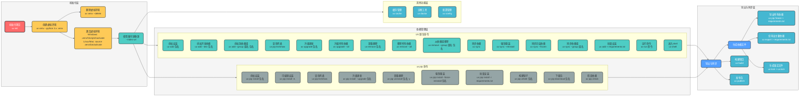

# UV 工具使用指南

## 命令流程图

```mermaid
flowchart LR
    %% 样式定义（参考 Kafka 架构图风格）
    classDef initStyle fill:#FF6B6B,stroke:#2D3436,stroke-width:3px,color:white,rx:8,ry:8
    classDef venvStyle fill:#FECA57,stroke:#2D3436,stroke-width:2px,color:#2D3436,rx:8,ry:8
    classDef mirrorStyle fill:#4ECDC4,stroke:#2D3436,stroke-width:2px,color:#2D3436,rx:8,ry:8
    classDef uvCommandStyle fill:#4ECDC4,stroke:#2D3436,stroke-width:2px,color:#2D3436,rx:8,ry:8
    classDef pipCommandStyle fill:#95A5A6,stroke:#2D3436,stroke-width:2px,color:#2D3436,rx:8,ry:8
    classDef exportStyle fill:#54A0FF,stroke:#2D3436,stroke-width:2px,color:white,rx:8,ry:8
    classDef exportFileStyle fill:#45B7D1,stroke:#2D3436,stroke-width:2px,color:white,rx:8,ry:8
    classDef subgraphStyle fill:#f5f5f5,stroke:#666,stroke-width:1px,rounded:10px
    classDef uvCommandSubgraphStyle fill:#E8F4F8,stroke:#4299e1,stroke-width:1.5px,rounded:10px
    classDef pipCommandSubgraphStyle fill:#F5F5F5,stroke:#95A5A6,stroke-width:1.5px,rounded:10px,dashed

    %% 1. 初始化层
    subgraph initLayer["初始化层"]
        A[初始化项目<br/>uv init]:::initStyle
        B[创建虚拟环境<br/>uv venv --python 3.x .venv]:::venvStyle
        Ba[删除虚拟环境<br/>uv venv --delete]:::venvStyle
        C[激活虚拟环境<br/>Windows: .venv\\Scripts\\activate<br/>Linux/Mac: source .venv/bin/activate]:::venvStyle
        H[使用国内镜像源<br/>--index-url <https://pypi.tuna.tsinghua.edu.cn/simple>]:::mirrorStyle
    end
    class initLayer subgraphStyle

    %% 2. 依赖管理层
    subgraph dependencyLayer["依赖管理层"]
        %% UV 原生命令
        subgraph uvCommands["UV 原生命令"]
            D1[添加安装<br/>uv add 包名]:::uvCommandStyle
            D1a[添加开发依赖<br/>uv add --dev 包名]:::uvCommandStyle
            D1b[添加到依赖组<br/>uv add --group 组名 包名]:::uvCommandStyle
            D2[查询列表<br/>uv pip list/show]:::uvCommandStyle
            D3[升级更新<br/>uv upgrade 包名]:::uvCommandStyle
            D3a[升级所有依赖<br/>uv upgrade --all]:::uvCommandStyle
            D4[卸载删除<br/>uv remove 包名]:::uvCommandStyle
            D4a[移除所有依赖<br/>uv remove --all]:::uvCommandStyle
            D4b[从依赖组移除<br/>uv remove --group 组名 包名]:::uvCommandStyle
            D5[同步依赖<br/>uv sync]:::uvCommandStyle
            D6[强制重装<br/>uv sync --reinstall]:::uvCommandStyle
            D6a[同步冻结依赖<br/>uv sync --frozen]:::uvCommandStyle
            D6b[同步依赖组<br/>uv sync --group 组名]:::uvCommandStyle
            D7[批量安装<br/>uv add -r requirements.txt]:::uvCommandStyle
            D8[运行命令<br/>uv run 命令]:::uvCommandStyle
            D9[进入shell<br/>uv shell]:::uvCommandStyle
        end
        class uvCommands uvCommandSubgraphStyle

        %% uv pip 命令
        subgraph pipCommands["uv pip 命令"]
            P1[添加安装<br/>uv pip install 包名]:::pipCommandStyle
            P1a[可编辑安装<br/>uv pip install -e .]:::pipCommandStyle
            P2[查询列表<br/>uv pip list/show]:::pipCommandStyle
            P3[升级更新<br/>uv pip install --upgrade 包名]:::pipCommandStyle
            P4[卸载删除<br/>uv pip uninstall 包名 -y]:::pipCommandStyle
            P5[强制重装<br/>uv pip install --force-reinstall 包名]:::pipCommandStyle
            P6[批量安装<br/>uv pip install -r requirements.txt]:::pipCommandStyle
            P7[构建轮子<br/>uv pip wheel 包名]:::pipCommandStyle
            P8[下载包<br/>uv pip download 包名]:::pipCommandStyle
            P9[检查依赖<br/>uv pip check]:::pipCommandStyle
        end
        class pipCommands pipCommandSubgraphStyle
    end
    class dependencyLayer subgraphStyle

    %% 3. 导出与同步层
    subgraph exportLayer["导出与同步层"]
        E[导出与同步]:::exportStyle
        I[生成依赖文件]:::exportStyle
        J[导出所有依赖<br/>uv pip freeze > requirements.txt]:::exportFileStyle
        K[仅导出主要依赖<br/>uv export > requirements.txt]:::exportFileStyle
        L[生成锁定文件<br/>uv lock > uv.lock]:::exportFileStyle
        M[构建项目<br/>uv build]:::exportFileStyle
        N[发布包<br/>uv publish]:::exportFileStyle
    end
    class exportLayer subgraphStyle

    %% 4. 其他功能层
    subgraph otherLayer["其他功能层"]
        O[缓存管理<br/>uv cache]:::exportFileStyle
        P[诊断工具<br/>uv doctor]:::exportFileStyle
        Q[配置管理<br/>uv config]:::exportFileStyle
    end
    class otherLayer subgraphStyle

    %% 核心流转逻辑
    A --> B
    B --> C
    B --> Ba
    C --> H
    H --> uvCommands
    H --> pipCommands
    uvCommands --> E
    pipCommands --> E
    E --> I
    I --> J
    I --> K
    I --> L
    E --> M
    E --> N
    H --> otherLayer

    %% 连接线统一样式
    linkStyle 0,1,2,3,4,5,6,7,8,9,10,11,12,13 stroke:#666,stroke-width:1.5px,arrowheadStyle:filled

```
