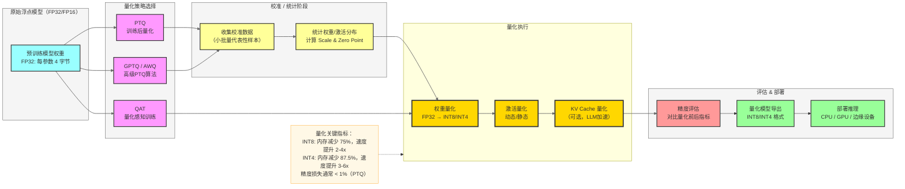
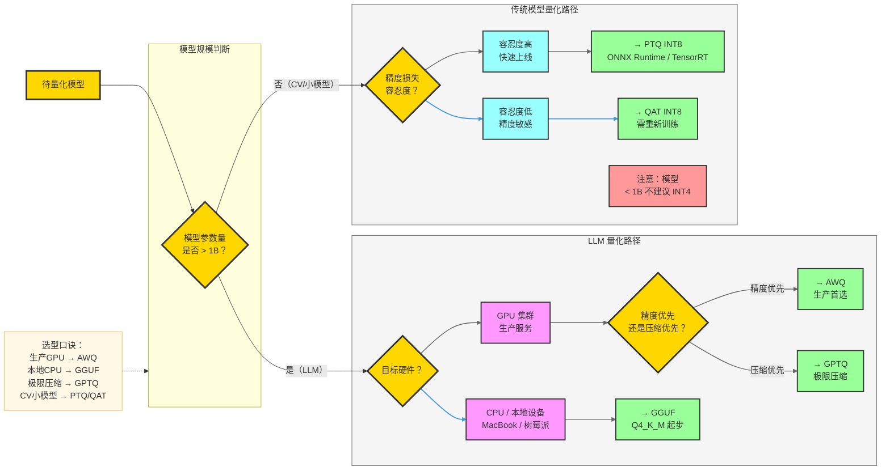
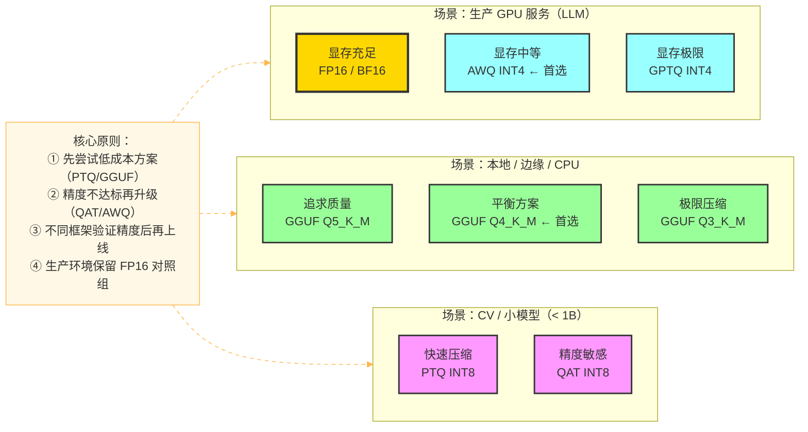
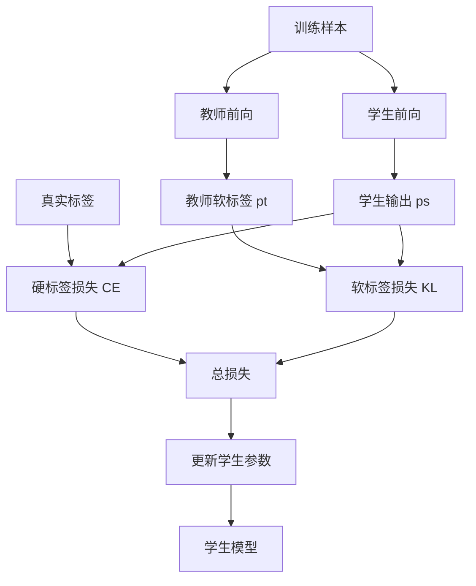
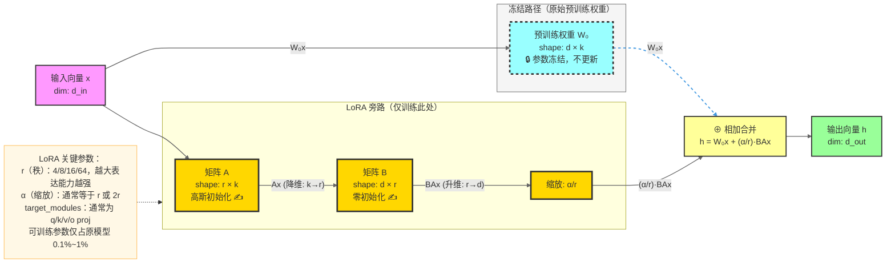
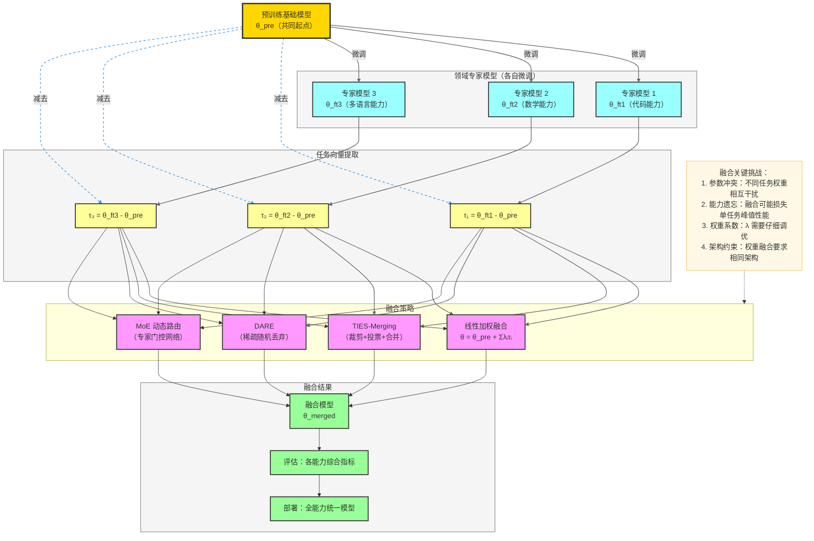
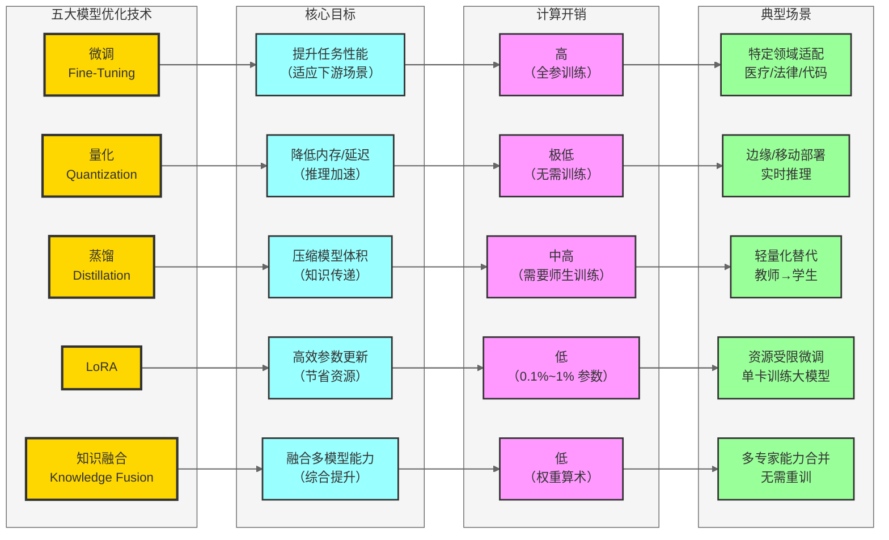

# 模型优化技术详解：微调、量化、蒸馏、LoRA 与知识融合

> **适用读者**：具备基础深度学习知识、希望系统掌握大模型优化技术的工程师与研究者。
>
> **文档结构**：每个技术模块包含「原理讲解 → 流程图 → 应用步骤 → 示例代码」四个层次，末尾附常见面试问题（FAQ）。

---

## 目录

1. [模型微调（Fine-Tuning）](#1-模型微调fine-tuning)
2. [模型量化（Quantization）](#2-模型量化quantization)
3. [模型蒸馏（Knowledge Distillation）](#3-模型蒸馏knowledge-distillation)
4. [LoRA（Low-Rank Adaptation）](#4-loralow-rank-adaptation)
5. [知识融合（Knowledge Fusion）](#5-知识融合knowledge-fusion)
6. [面试常见问题（FAQ）](#6-面试常见问题faq)

---

## 1. 模型微调（Fine-Tuning）

### 1.1 基本概念与原理

**模型微调**是迁移学习的核心手段之一，其核心思想是：在大规模数据上预训练得到的通用模型已经学到了丰富的语言/视觉表示，通过在特定下游任务的小规模标注数据上继续训练，使模型的参数向目标任务偏移，从而在不需要从零训练的前提下，高效获得任务专用能力。

#### 核心公式

给定预训练模型参数 $\theta_0$，微调目标为最小化下游任务损失：

$$\theta^* = \arg\min_\theta \mathcal{L}_{\text{task}}(\theta;\mathcal{D}_{\text{ft}})$$

其中 $\mathcal{D}_{\text{ft}}$ 为微调数据集，初始化 $\theta = \theta_0$，通过小学习率梯度下降更新所有（或部分）参数。

#### 微调策略对比

| 策略 | 更新范围 | 计算开销 | 适用场景 |
|------|---------|---------|---------|
| 全参数微调（Full Fine-Tuning） | 所有层 | 高 | 数据充足、资源充足 |
| 头部微调（Head-Only） | 仅分类头 | 极低 | 数据极少 |
| 层冻结微调（Layer Freezing） | 顶部若干层 | 中等 | 数据中等 |
| 指令微调（Instruction Tuning） | 全参数或部分 | 高 | LLM 对话能力激活 |
| PEFT（参数高效微调） | 少量新增参数 | 低 | 资源受限 |

### 1.2 微调流程图

```mermaid
flowchart LR
    %% 样式定义
    classDef dataStyle fill:#9ff,stroke:#333,stroke-width:2px
    classDef modelStyle fill:#ffd700,stroke:#333,stroke-width:3px
    classDef trainStyle fill:#f9f,stroke:#333,stroke-width:2px
    classDef evalStyle fill:#9f9,stroke:#333,stroke-width:2px
    classDef outputStyle fill:#ff9,stroke:#333,stroke-width:2px
    classDef decisionStyle fill:#f99,stroke:#333,stroke-width:2px
    classDef noteStyle fill:#fff8e6,stroke:#ffb74d,stroke-width:1px
    classDef subgraphStyle fill:#f5f5f5,stroke:#666,stroke-width:1px

    %% 数据准备阶段
    subgraph dataLayer["数据准备阶段"]
        A[原始任务数据]:::dataStyle
        B[数据清洗 & 格式化]:::dataStyle
        C[训练集 / 验证集 / 测试集]:::dataStyle
    end
    class dataLayer subgraphStyle

    %% 模型准备阶段
    subgraph modelLayer["模型准备阶段"]
        D[选择预训练模型<br/>BERT / LLaMA / GPT 等]:::modelStyle
        E{选择微调策略}:::decisionStyle
        F1[全参数微调]:::trainStyle
        F2[层冻结微调]:::trainStyle
        F3[指令微调]:::trainStyle
    end
    class modelLayer subgraphStyle

    %% 训练阶段
    subgraph trainLayer["训练阶段"]
        G[设置超参数<br/>lr / batch size / epochs]:::trainStyle
        H[前向传播计算损失]:::trainStyle
        I[反向传播更新参数]:::trainStyle
        J{验证集指标是否达标}:::decisionStyle
    end
    class trainLayer subgraphStyle

    %% 输出阶段
    subgraph outputLayer["输出部署阶段"]
        K[模型评估 & 测试]:::evalStyle
        L[导出微调模型]:::outputStyle
        M[部署上线服务]:::outputStyle
    end
    class outputLayer subgraphStyle

    %% 流程连接
    A --> B --> C
    C --> D --> E
    E -->|资源充足| F1
    E -->|数据较少| F2
    E -->|对话场景| F3
    F1 & F2 & F3 --> G
    G --> H --> I --> J
    J -->|未达标，继续训练| H
    J -->|达标| K --> L --> M

    %% 注释
    Note["微调关键：<br/>1. 学习率通常比预训练小 10~100 倍<br/>2. 注意过拟合，使用早停策略<br/>3. 数据质量 > 数据数量"]:::noteStyle
    Note -.-> trainLayer

    %% 连接线样式
    linkStyle 0,1,2,3,4,5,6,7,8 stroke:#666,stroke-width:1.5px
    linkStyle 9,10,11,12,13 stroke:#333,stroke-width:2px
```



### 1.3 应用步骤

**Step 1：准备数据集**

将任务数据整理为模型输入格式，例如指令微调常用 `{"instruction": ..., "input": ..., "output": ...}` 的 Alpaca 格式。

**Step 2：选择预训练模型**

根据任务类型选择合适的底座：
- 文本分类/NER → BERT、RoBERTa
- 对话/生成 → LLaMA、Qwen、GPT-2
- 多模态 → LLaVA、Qwen-VL

**Step 3：配置微调超参数**

- 学习率：1e-5 ～ 5e-5（全参数），1e-4 ～ 3e-4（PEFT）
- Batch Size：8 ～ 64
- Epochs：3 ～ 10
- 权重衰减：0.01

**Step 4：训练与监控**

使用 Trainer API 或自定义训练循环，监控 loss 和验证指标。

**Step 5：评估与导出**

在测试集上评估，保存最优 checkpoint。

### 1.4 示例代码

#### 示例 A：使用 HuggingFace Trainer 对 BERT 做情感分类微调

```python
from transformers import (
    BertTokenizer, BertForSequenceClassification,
    TrainingArguments, Trainer
)
from datasets import load_dataset
import numpy as np
from sklearn.metrics import accuracy_score

# 1. 加载数据集（以 SST-2 情感分类为例）
dataset = load_dataset("glue", "sst2")
tokenizer = BertTokenizer.from_pretrained("bert-base-uncased")

def tokenize_fn(examples):
    return tokenizer(
        examples["sentence"],
        padding="max_length",
        truncation=True,
        max_length=128
    )

tokenized = dataset.map(tokenize_fn, batched=True)

# 2. 加载预训练模型，指定分类类别数
model = BertForSequenceClassification.from_pretrained(
    "bert-base-uncased",
    num_labels=2
)

# 3. 定义评估指标
def compute_metrics(eval_pred):
    logits, labels = eval_pred
    preds = np.argmax(logits, axis=-1)
    return {"accuracy": accuracy_score(labels, preds)}

# 4. 配置训练参数
training_args = TrainingArguments(
    output_dir="./bert-sst2-finetuned",
    num_train_epochs=3,
    per_device_train_batch_size=32,
    per_device_eval_batch_size=64,
    learning_rate=2e-5,              # 微调学习率远小于预训练
    weight_decay=0.01,
    evaluation_strategy="epoch",
    save_strategy="epoch",
    load_best_model_at_end=True,
    metric_for_best_model="accuracy",
    logging_steps=100,
)

# 5. 创建 Trainer 并训练
trainer = Trainer(
    model=model,
    args=training_args,
    train_dataset=tokenized["train"],
    eval_dataset=tokenized["validation"],
    compute_metrics=compute_metrics,
)
trainer.train()

# 6. 保存微调后的模型
trainer.save_model("./bert-sst2-finetuned/best")
print("微调完成！模型已保存。")
```

#### 示例 B：使用 TRL + SFTTrainer 对 LLM 做指令微调

```python
from transformers import AutoModelForCausalLM, AutoTokenizer
from trl import SFTTrainer, SFTConfig
from datasets import Dataset
import torch

# 1. 准备指令数据（Alpaca 格式）
data = [
    {
        "instruction": "将下列句子翻译成英文",
        "input": "今天天气很好",
        "output": "The weather is great today."
    },
    {
        "instruction": "计算以下数学题",
        "input": "3 + 5 × 2 = ?",
        "output": "答案是 13。根据运算优先级，先乘后加：5×2=10，10+3=13。"
    },
]

def format_instruction(example):
    """将数据格式化为模型输入文本"""
    prompt = f"### 指令:\n{example['instruction']}\n"
    if example.get("input"):
        prompt += f"### 输入:\n{example['input']}\n"
    prompt += f"### 回答:\n{example['output']}"
    return {"text": prompt}

dataset = Dataset.from_list(data).map(format_instruction)

# 2. 加载基础模型（以小型模型为示例）
model_name = "Qwen/Qwen2.5-0.5B"
tokenizer = AutoTokenizer.from_pretrained(model_name)
model = AutoModelForCausalLM.from_pretrained(
    model_name,
    torch_dtype=torch.float16,
    device_map="auto"
)

# 3. 配置 SFT 训练参数
sft_config = SFTConfig(
    output_dir="./qwen-sft",
    num_train_epochs=3,
    per_device_train_batch_size=4,
    gradient_accumulation_steps=4,   # 等效 batch_size=16
    learning_rate=2e-4,
    max_seq_length=512,
    logging_steps=10,
)

# 4. 训练
trainer = SFTTrainer(
    model=model,
    args=sft_config,
    train_dataset=dataset,
)
trainer.train()
trainer.save_model("./qwen-sft/best")
```

---

## 2. 模型量化（Quantization）

### 2.1 基本概念与原理

**模型量化**是将浮点数（通常为 FP32 或 FP16）表示的模型权重和激活值，映射到低比特整数（INT8、INT4、INT2 等）表示的过程，从而减少内存占用和推理延迟，同时尽量保持模型精度。

#### 核心数学原理

量化的核心操作是线性映射（仿射量化）：

$$x_q = \text{round}\left(\frac{x}{\Delta}\right) + z$$

$$x_{\text{dequant}} = \Delta \cdot (x_q - z)$$

其中：
- $\Delta$（Scale）：缩放因子，$\Delta = \frac{x_{\max} - x_{\min}}{2^b - 1}$
- $z$（Zero Point）：零点偏移
- $b$：量化比特数
- 量化误差：$\epsilon = x - x_{\text{dequant}}$

#### 量化方案对比

| 方案 | 时机 | 精度损失 | 计算开销 |
|------|------|---------|---------|
| PTQ（Post-Training Quantization，训练后量化） | 推理前，无需训练 | 中等 | 极低（无需 GPU）|
| QAT（Quantization-Aware Training，量化感知训练） | 训练中模拟量化 | 最低 | 高（需重新训练）|
| GPTQ（GPT Quantization，逐层二阶量化） | PTQ，逐层二阶优化 | 低 | 中等 |
| AWQ（Activation-aware Weight Quantization，激活感知权重量化） | PTQ，激活感知权重量化 | 低 | 中等 |
| GGUF/GGML（GPT-Generated Unified Format，CPU推理量化格式） | 面向 CPU 推理的 k-quant | 可调 | 极低 |

### 2.2 量化流程图



### 2.3 应用步骤

**Step 1：选择量化方案**
- 资源极度受限（边缘/CPU）→ GGUF INT4
- 服务端高吞吐推理 → GPTQ INT4 或 AWQ
- 精度要求极高 → QAT INT8

**Step 2：准备校准数据集**

选取 128~512 条代表性数据（覆盖任务分布），用于统计激活值范围。

**Step 3：执行量化**

**Step 4：验证精度**

在标准 Benchmark（如 MMLU、HellaSwag）上评估量化前后性能差异，容忍度通常 <2%。

**Step 5：导出与部署**

### 2.4 示例代码

#### 示例 A：使用 `bitsandbytes` 进行 INT8 PTQ（LLM 推理）

```python
import torch
from transformers import AutoModelForCausalLM, AutoTokenizer, BitsAndBytesConfig

# 1. 配置 INT8 量化参数
quantization_config = BitsAndBytesConfig(
    load_in_8bit=True,           # 启用 INT8 量化
    llm_int8_threshold=6.0,      # 离群值阈值（超过此值保留 FP16）
    llm_int8_has_fp16_weight=False,
)

model_name = "meta-llama/Llama-2-7b-hf"

# 2. 加载量化模型（自动完成 PTQ）
tokenizer = AutoTokenizer.from_pretrained(model_name)
model = AutoModelForCausalLM.from_pretrained(
    model_name,
    quantization_config=quantization_config,
    device_map="auto",
)

# 3. 查看量化效果（内存对比）
print(f"量化后模型内存: {model.get_memory_footprint() / 1e9:.2f} GB")
# FP16 约 14GB → INT8 约 7GB

# 4. 正常推理（接口与原始模型完全相同）
inputs = tokenizer("请解释什么是量化：", return_tensors="pt").to("cuda")
with torch.no_grad():
    outputs = model.generate(**inputs, max_new_tokens=200)
print(tokenizer.decode(outputs[0], skip_special_tokens=True))
```

#### 示例 B：使用 `auto-gptq` 进行 GPTQ INT4 量化

```python
from auto_gptq import AutoGPTQForCausalLM, BaseQuantizeConfig
from transformers import AutoTokenizer
from datasets import load_dataset

model_name = "Qwen/Qwen2.5-7B-Instruct"
tokenizer = AutoTokenizer.from_pretrained(model_name)

# 1. 准备校准数据（128 条样本）
calibration_dataset = load_dataset("wikitext", "wikitext-2-raw-v1", split="train")
calibration_data = [
    tokenizer(text, return_tensors="pt", max_length=512, truncation=True)["input_ids"]
    for text in calibration_dataset["text"][:128]
    if len(text.strip()) > 50
]

# 2. 配置量化参数
quantize_config = BaseQuantizeConfig(
    bits=4,             # INT4 量化
    group_size=128,     # 每 128 个权重共享一组 scale
    damp_percent=0.01,  # GPTQ 阻尼系数
    desc_act=False,     # 是否按激活值排序
)

# 3. 加载原始模型
model = AutoGPTQForCausalLM.from_pretrained(
    model_name,
    quantize_config=quantize_config,
)

# 4. 执行量化（利用校准数据）
model.quantize(calibration_data)

# 5. 保存量化模型
model.save_quantized("./qwen2.5-7b-gptq-int4")
tokenizer.save_pretrained("./qwen2.5-7b-gptq-int4")
print("GPTQ INT4 量化完成！")
```

#### 示例 C：使用 `llama.cpp` 量化为 GGUF 格式（CPU 推理）

```bash
# 克隆 llama.cpp 并编译
git clone https://github.com/ggerganov/llama.cpp
cd llama.cpp && make -j8

# 将 HuggingFace 模型转换为 GGUF 格式
python convert_hf_to_gguf.py /path/to/model --outfile model-f16.gguf

# 执行 Q4_K_M 量化（平衡精度与速度的推荐方案）
./llama-quantize model-f16.gguf model-q4_k_m.gguf Q4_K_M

# 量化后大小对比：7B 模型
# FP16: ~14 GB → Q4_K_M: ~4.1 GB（缩小约 70%）

# 运行量化模型推理
./llama-cli -m model-q4_k_m.gguf -p "量化是什么？" -n 256
```

### 2.5 量化方案选择指南

量化方案的选型需权衡四个核心维度：**精度要求 × 硬件环境 × 工程成本 × 模型规模**。下面从决策流程、场景对比、指标参考和实用建议四个层次系统梳理。

#### 2.5.1 选型决策流程图



#### 2.5.2 五种方案全维度对比

| 维度 | PTQ<br/>（训练后量化） | QAT<br/>（量化感知训练） | GPTQ<br/>（逐层二阶量化） | AWQ<br/>（激活感知权重量化） | GGUF/GGML<br/>（CPU推理量化格式） |
|------|-----|-----|------|-----|-----------|
| **量化时机** | 训练后，无需 GPU | 训练中模拟量化 | 训练后，逐层二阶优化 | 训练后，激活感知 | 训练后，k-quant 分组 |
| **典型精度** | INT8 | INT8 | INT3 / INT4 | INT4 | Q2～Q8（可调） |
| **精度损失** | 中等（0.5-2%） | 最低（< 0.3%） | 低（INT4 约 1.5%） | 低（INT4 约 1%） | 可调（Q4 约 2%） |
| **工程成本** | 极低，无需训练 | 高，需重训 10-20% 步数 | 中，需校准数据 | 中，需校准数据 | 极低，命令行一步完成 |
| **推理加速** | 2-4x（GPU） | 2-4x（GPU） | 3-5x（GPU） | 3-5x（GPU） | CPU 友好，GPU 非最优 |
| **显存节省** | ~50%（INT8） | ~50%（INT8） | ~75%（INT4） | ~75%（INT4） | ~70%（Q4） |
| **适用模型规模** | < 1B 最佳 | < 7B 可行 | 7B-70B+ | 7B-70B+ | 任意，边缘设备首选 |
| **主流推理框架** | ONNX Runtime、TensorRT | TensorRT（QAT engine） | vLLM、ExLlamaV2 | vLLM、TGI | llama.cpp、Ollama |
| **代表工具** | `bitsandbytes` INT8 | PyTorch QAT API | `auto-gptq` | `autoawq` | `llama.cpp` quantize |

#### 2.5.3 精度-压缩比参考（以 7B LLM 为例）

| 格式 | 模型大小 | vs FP16 PPL 变化 | GPU 推理速度 | CPU 可用 |
|------|---------|-----------------|------------|---------|
| FP32 | 28 GB | 基准 | 基准 | ✗（过慢）|
| FP16 / BF16 | 14 GB | ≈ 基准 | 基准 | ✗ |
| INT8 PTQ | 7 GB | +0.1～0.5 | 1.5-2x | △（有限支持）|
| AWQ INT4 | 4.2 GB | +0.8～1.2 | 2.5-3.5x | ✗ |
| GPTQ INT4 | 4.2 GB | +1.0～1.8 | 2.5-3.5x | ✗ |
| GGUF Q4_K_M | 4.1 GB | +1.5～2.5 | 2x（GPU）| ✓ |
| GGUF Q5_K_M | 4.8 GB | +0.8～1.5 | 1.8x（GPU）| ✓ |
| GPTQ INT3 | 3.2 GB | +3.0～5.0 | 3-4x | ✗ |

> **PPL（Perplexity）**：困惑度，越低越好。PPL 上升 < 1 通常不影响实际使用体验；上升 > 3 则明显可感知质量下降。

#### 2.5.4 各方案详细使用建议

**PTQ（训练后量化）**

适用于 CV 模型（ResNet/YOLO/BERT-base 等）的快速压缩，以及业务迭代频繁、无时间重训的场景。

- ✅ 推荐搭配 ONNX Runtime 或 TensorRT 的校准流程
- ✅ 校准集建议 200～512 条有代表性的样本，覆盖任务数据分布
- ❌ 避免用纯随机噪声做校准，会导致 Scale 估计失准
- ❌ 激活值分布极度长尾（如 LLM 中存在大量离群值）时，PTQ 精度损失会显著放大

```python
# 典型 PTQ 失败信号：量化后精度骤降 > 5%
# 排查方向：检查激活值分布，考虑升级到 GPTQ/AWQ 或改用 QAT
```

**QAT（量化感知训练）**

适用于精度损失容忍度极低（医疗影像、金融风控）以及模型参数 < 7B 的场景。

- ✅ 只需在 PTQ 精度不达标时启用，通常微调 10%～20% 的训练步数即可收敛
- ✅ 学习率建议降低到原始训练的 1/10，避免过拟合
- ❌ 不适用于 70B+ 大模型（重训成本极高）
- ❌ 量化节点（FakeQuant）会增加约 30% 训练显存占用

**GPTQ**

适用于 LLM 显存严重不足、追求极致压缩比（INT3/INT4）的 GPU 部署场景。

- ✅ 优先使用 4-bit（`bits=4, group_size=128`），这是精度与压缩的最佳平衡点
- ✅ 搭配 `ExLlamaV2` 后端推理效率比 `auto-gptq` 高约 20-30%
- ✅ vLLM 原生支持 GPTQ：`--quantization gptq`
- ❌ 不建议使用 3-bit（PPL 上升明显，实际效果较差）
- ❌ 每次模型更新都需要重新跑 GPTQ 校准，CI/CD 成本较高

**AWQ（激活感知权重量化）**

**生产级 LLM GPU 部署的首选方案**，在相同压缩比下精度优于 GPTQ 约 0.5-1 PPL 点。

- ✅ HuggingFace Hub 已有大量预量化 AWQ 模型，直接下载即用（如 `Qwen2.5-7B-Instruct-AWQ`）
- ✅ vLLM 和 TGI 原生支持：`--quantization awq`，无需额外配置
- ✅ 支持 Fused Modules（将 QKV 投影等算子融合），推理速度比标准 AWQ 再快 15-20%
- ❌ AWQ 量化工具（`autoawq`）对某些非标准模型架构支持不完善，可能需要手动适配

**GGUF/GGML（llama.cpp 生态）**

适用于本地开发、个人使用、CPU 推理、边缘端部署，是 Ollama / LM Studio 等工具的默认格式。

- ✅ GGUF 量化级别推荐优先级：`Q5_K_M` > `Q4_K_M` > `Q3_K_M`（显存充足优先选前者）
- ✅ `Q4_K_M` 是大小与质量的最佳平衡点，也是社区最广泛分发的格式
- ✅ 支持 CPU+GPU 混合推理：`--n-gpu-layers 35`（部分层卸载至 GPU）
- ❌ 不建议使用低于 `Q3` 的量化（`Q2_K` 质量明显劣化）
- ❌ 生产 GPU 集群不推荐 GGUF，应选 AWQ/GPTQ（GPU 利用率更高）

#### 2.5.5 一张图总结



---

## 3. 模型蒸馏（Knowledge Distillation）

### 3.1 基本概念与原理

**知识蒸馏**由 Hinton 等人在 2015 年提出，核心思想是：让一个小型「学生」模型（Student）学习大型「教师」模型（Teacher）的行为，而不仅仅是学习硬标签（one-hot 标签）。教师模型的**软标签**（Soft Labels）携带了类间相关性等丰富信息，能帮助学生更有效地学习。

#### 核心损失函数

$$\mathcal{L}_{\text{KD}} = (1 - \alpha) \cdot \mathcal{L}_{\text{CE}}(y, \hat{y}_s) + \alpha \cdot T^2 \cdot \text{KL}(p_T \| p_S)$$

其中：
- $\mathcal{L}_{\text{CE}}$：学生与真实标签的交叉熵损失（硬标签损失）
- $\text{KL}(p_T \| p_S)$：教师与学生软概率分布的 KL 散度（软标签损失）
- $T$：温度参数（Temperature），$T > 1$ 使概率分布更平滑，暴露更多类间关系
- $\alpha$：控制两种损失的权重比例

$$p_T^{(i)} = \frac{\exp(z_T^{(i)} / T)}{\sum_j \exp(z_T^{(j)} / T)}$$

#### 蒸馏类型

| 类型 | 蒸馏对象 | 典型方法 |
|------|---------|---------|
| 响应蒸馏（Response-Based） | 最终输出 logits | KD（Hinton 2015） |
| 特征蒸馏（Feature-Based） | 中间层特征 | FitNets、PKT |
| 关系蒸馏（Relation-Based） | 样本间关系 | RKD、CRD |
| 在线蒸馏 | 多个模型互相学习 | DML |
| LLM 数据蒸馏 | 教师生成训练数据 | Alpaca、WizardLM |

### 3.2 蒸馏流程图



### 3.3 应用步骤

**Step 1：选择教师模型**

选取在目标任务上性能最优的大模型作为教师，通常不更新其参数。

**Step 2：设计学生架构**

学生模型通常是教师的缩小版（层数减少、隐藏维度缩小），或换用轻量架构。

**Step 3：生成软标签（或教师输出）**

使用教师模型对训练集做前向传播，保存 logits 或按温度 $T$ 软化的概率分布。

**Step 4：训练学生模型**

同时计算硬标签损失与软标签 KL 散度，按权重融合后反向传播。

**Step 5：评估与迭代**

对比学生与教师在下游任务的指标差距，调整 $T$ 和 $\alpha$。

### 3.4 示例代码

#### 示例 A：标准响应蒸馏（图像分类任务）

```python
import torch
import torch.nn as nn
import torch.nn.functional as F
from torchvision import datasets, transforms, models
from torch.utils.data import DataLoader

# ===================== 定义蒸馏损失 =====================
class KnowledgeDistillationLoss(nn.Module):
    def __init__(self, temperature: float = 4.0, alpha: float = 0.7):
        super().__init__()
        self.T = temperature
        self.alpha = alpha

    def forward(self, student_logits, teacher_logits, true_labels):
        # 软标签损失（KL 散度）：教师指导学生学习类间关系
        soft_loss = F.kl_div(
            F.log_softmax(student_logits / self.T, dim=-1),
            F.softmax(teacher_logits / self.T, dim=-1),
            reduction="batchmean"
        ) * (self.T ** 2)

        # 硬标签损失（交叉熵）：保证学生与真实标签对齐
        hard_loss = F.cross_entropy(student_logits, true_labels)

        return (1 - self.alpha) * hard_loss + self.alpha * soft_loss

# ===================== 准备数据 =====================
transform = transforms.Compose([
    transforms.Resize(224),
    transforms.ToTensor(),
    transforms.Normalize([0.485, 0.456, 0.406], [0.229, 0.224, 0.225])
])
train_dataset = datasets.CIFAR10(root="./data", train=True, transform=transform, download=True)
train_loader = DataLoader(train_dataset, batch_size=64, shuffle=True, num_workers=4)

# ===================== 教师模型（大）=====================
teacher = models.resnet50(pretrained=True)
teacher.fc = nn.Linear(2048, 10)
teacher.eval()  # 教师固定，不更新参数
for param in teacher.parameters():
    param.requires_grad = False

# ===================== 学生模型（小）=====================
student = models.resnet18(pretrained=False)
student.fc = nn.Linear(512, 10)

device = torch.device("cuda" if torch.cuda.is_available() else "cpu")
teacher, student = teacher.to(device), student.to(device)

# ===================== 训练 =====================
optimizer = torch.optim.AdamW(student.parameters(), lr=1e-3, weight_decay=1e-4)
kd_loss_fn = KnowledgeDistillationLoss(temperature=4.0, alpha=0.7)
scheduler = torch.optim.lr_scheduler.CosineAnnealingLR(optimizer, T_max=30)

for epoch in range(30):
    student.train()
    total_loss = 0.0
    for images, labels in train_loader:
        images, labels = images.to(device), labels.to(device)

        # 教师推理（无梯度）
        with torch.no_grad():
            teacher_logits = teacher(images)

        # 学生推理
        student_logits = student(images)

        # 计算蒸馏损失并更新
        loss = kd_loss_fn(student_logits, teacher_logits, labels)
        optimizer.zero_grad()
        loss.backward()
        optimizer.step()
        total_loss += loss.item()

    scheduler.step()
    print(f"Epoch [{epoch+1}/30] Loss: {total_loss/len(train_loader):.4f}")
```

#### 示例 B：LLM 数据蒸馏（用 GPT-4 生成训练数据）

```python
from openai import OpenAI
import json

client = OpenAI()

def generate_training_data_via_distillation(seeds: list[str], n_samples: int = 100):
    """使用 GPT-4（教师）生成指令数据，用于训练小模型（学生）"""
    generated_data = []

    for seed in seeds[:n_samples]:
        # 向教师模型请求生成高质量回答
        response = client.chat.completions.create(
            model="gpt-4o",
            messages=[
                {"role": "system", "content": "你是一个专业的AI助手，请提供详细、准确、结构清晰的回答。"},
                {"role": "user", "content": seed}
            ],
            temperature=0.7,
            max_tokens=1024
        )

        answer = response.choices[0].message.content
        generated_data.append({
            "instruction": seed,
            "input": "",
            "output": answer,
            "source": "gpt-4o-distillation"
        })
        print(f"生成第 {len(generated_data)} 条数据")

    # 保存蒸馏数据集
    with open("distilled_dataset.json", "w", encoding="utf-8") as f:
        json.dump(generated_data, f, ensure_ascii=False, indent=2)

    return generated_data

# 使用种子问题触发教师生成
seed_questions = [
    "解释量子纠缠的基本原理",
    "如何设计一个高并发的分布式系统",
    "机器学习中的偏差-方差权衡是什么",
]

dataset = generate_training_data_via_distillation(seed_questions)
print(f"共生成 {len(dataset)} 条蒸馏训练数据")
```

---

## 4. LoRA（Low-Rank Adaptation）

### 4.1 基本概念与原理

**LoRA** 由 Hu 等人（2021）提出，属于参数高效微调（PEFT）方法。其核心洞察是：大模型在下游任务微调过程中，**权重更新矩阵的本征维度（Intrinsic Rank）远小于其完整维度**，因此可以用低秩矩阵分解来近似权重更新。

#### 核心数学原理

对于预训练权重矩阵 $W_0 \in \mathbb{R}^{d \times k}$，LoRA 将权重更新分解为：

$$W = W_0 + \Delta W = W_0 + BA$$

其中：
- $B \in \mathbb{R}^{d \times r}$，$A \in \mathbb{R}^{r \times k}$（$r \ll \min(d, k)$）
- $r$ 为 LoRA 秩（rank），通常取 4、8、16、64
- 训练时 $W_0$ 冻结（不更新），仅训练 $A$ 和 $B$
- 初始化：$A$ 使用随机高斯初始化，$B$ 初始化为全零（确保训练开始时 $\Delta W = 0$）

#### 前向传播

$$h = W_0 x + \frac{\alpha}{r} \cdot BAx$$

其中 $\alpha$ 是缩放系数，通常与 $r$ 相同或为 $r$ 的倍数。

#### 参数量对比

以 GPT-3 中一个 $d=12288$ 的注意力权重矩阵为例：
- 原始参数量：$12288 \times 12288 = 1.5 \times 10^8$
- LoRA（r=8）参数量：$12288 \times 8 + 8 \times 12288 = 196608$（减少 99.87%）

#### LoRA 系列变体

| 方法 | 改进点 | 优势 |
|------|--------|------|
| LoRA | 低秩分解权重更新 | 简单高效 |
| QLoRA | INT4 量化底座 + LoRA | 单 GPU 微调 65B 模型 |
| LoRA+ | $A$、$B$ 使用不同学习率 | 收敛更快 |
| DoRA | 将权重分解为幅度 + 方向 | 精度更高 |
| rsLoRA | 缩放因子改为 $\alpha/\sqrt{r}$ | 大秩时更稳定 |
| LoftQ | 量化感知 LoRA 初始化 | 减少量化误差 |

### 4.2 LoRA 原理流程图



### 4.3 应用步骤

**Step 1：选择插入层**

LoRA 通常应用于 Transformer 的注意力层（Q、K、V、O 投影矩阵）和前馈层（MLP）。

**Step 2：配置超参数**

- `r`：秩，资源受限时用 4～8，追求精度用 16～64
- `lora_alpha`：缩放因子，通常等于 `r` 或 `2*r`
- `lora_dropout`：0.05～0.1，防止过拟合
- `target_modules`：指定应用 LoRA 的模块名称

**Step 3：训练**

仅训练 LoRA 参数（A、B 矩阵），冻结原始权重。

**Step 4：合并与导出**

推理前可将 LoRA 权重合并回原始权重（$W = W_0 + BA$），合并后无额外推理开销。

### 4.4 示例代码

#### 示例 A：使用 PEFT 库为 LLaMA 添加 LoRA

```python
import torch
from transformers import AutoModelForCausalLM, AutoTokenizer, TrainingArguments
from peft import LoraConfig, get_peft_model, TaskType, PeftModel
from trl import SFTTrainer, SFTConfig
from datasets import load_dataset

model_name = "meta-llama/Llama-2-7b-hf"

# 1. 加载基础模型
tokenizer = AutoTokenizer.from_pretrained(model_name)
tokenizer.pad_token = tokenizer.eos_token
model = AutoModelForCausalLM.from_pretrained(
    model_name,
    torch_dtype=torch.float16,
    device_map="auto",
)

# 2. 配置 LoRA 参数
lora_config = LoraConfig(
    task_type=TaskType.CAUSAL_LM,
    r=16,                                   # 秩：控制低秩矩阵的维度
    lora_alpha=32,                           # 缩放因子（通常 = 2*r）
    lora_dropout=0.05,                       # Dropout 防过拟合
    target_modules=["q_proj", "k_proj",      # 应用 LoRA 的层
                    "v_proj", "o_proj",
                    "gate_proj", "up_proj", "down_proj"],
    bias="none",                             # 不修改偏置项
)

# 3. 将 LoRA 注入模型
model = get_peft_model(model, lora_config)
model.print_trainable_parameters()
# 输出示例：trainable params: 33,554,432 || all params: 6,771,970,048 || trainable%: 0.4955

# 4. 准备数据
dataset = load_dataset("tatsu-lab/alpaca", split="train[:5000]")

def format_alpaca(example):
    text = f"### 指令:\n{example['instruction']}\n"
    if example.get("input"):
        text += f"### 输入:\n{example['input']}\n"
    text += f"### 回答:\n{example['output']}"
    return {"text": text}

dataset = dataset.map(format_alpaca)

# 5. 训练配置
sft_config = SFTConfig(
    output_dir="./llama2-lora",
    num_train_epochs=3,
    per_device_train_batch_size=4,
    gradient_accumulation_steps=8,       # 有效 batch_size = 32
    learning_rate=2e-4,                  # LoRA 可用更大学习率
    fp16=True,
    logging_steps=50,
    save_steps=500,
    max_seq_length=512,
)

trainer = SFTTrainer(
    model=model,
    args=sft_config,
    train_dataset=dataset,
)
trainer.train()

# 6. 保存 LoRA 权重（仅保存增量，通常几十 MB）
model.save_pretrained("./llama2-lora/adapter")
print("LoRA adapter 保存完成（仅增量权重，约 60MB）")
```

#### 示例 B：QLoRA（INT4 + LoRA，单卡微调 70B 模型）

```python
import torch
from transformers import AutoModelForCausalLM, AutoTokenizer, BitsAndBytesConfig
from peft import LoraConfig, get_peft_model, prepare_model_for_kbit_training

model_name = "meta-llama/Llama-2-70b-hf"

# 1. INT4 量化配置（QLoRA 核心）
bnb_config = BitsAndBytesConfig(
    load_in_4bit=True,
    bnb_4bit_use_double_quant=True,      # 双重量化进一步压缩
    bnb_4bit_quant_type="nf4",           # NormalFloat4：对正态分布权重最优
    bnb_4bit_compute_dtype=torch.bfloat16  # 计算时反量化为 BF16
)

# 2. 加载 INT4 量化模型（70B 在单张 A100 80G 上可运行）
tokenizer = AutoTokenizer.from_pretrained(model_name)
model = AutoModelForCausalLM.from_pretrained(
    model_name,
    quantization_config=bnb_config,
    device_map="auto",
)

# 3. 为 kbit 训练做准备（添加梯度检查点等优化）
model = prepare_model_for_kbit_training(model)

# 4. 添加 LoRA
lora_config = LoraConfig(
    r=64,
    lora_alpha=16,
    target_modules=["q_proj", "v_proj"],
    lora_dropout=0.05,
    bias="none",
    task_type="CAUSAL_LM"
)
model = get_peft_model(model, lora_config)
model.print_trainable_parameters()
# 即使是 70B 模型，可训练参数也只有 ~0.5%

print("QLoRA 模型准备完成！可在单张 A100 80G 上微调 70B 模型。")
```

#### 示例 C：合并 LoRA 权重并导出完整模型

```python
from peft import PeftModel
from transformers import AutoModelForCausalLM, AutoTokenizer
import torch

# 1. 加载基础模型和 LoRA adapter
base_model = AutoModelForCausalLM.from_pretrained(
    "meta-llama/Llama-2-7b-hf",
    torch_dtype=torch.float16,
    device_map="cpu"
)
model = PeftModel.from_pretrained(base_model, "./llama2-lora/adapter")

# 2. 合并权重：将 ΔW = BA 合并到 W₀ 中
model = model.merge_and_unload()
print("LoRA 权重已合并：推理时无额外开销")

# 3. 保存完整模型
model.save_pretrained("./llama2-merged")
tokenizer = AutoTokenizer.from_pretrained("meta-llama/Llama-2-7b-hf")
tokenizer.save_pretrained("./llama2-merged")
print("完整模型保存完成，可直接用于生产部署！")
```

---

## 5. 知识融合（Knowledge Fusion）

### 5.1 基本概念与原理

**知识融合**是将多个模型（可以是同架构或不同架构、同任务或不同任务）的"知识"整合到一个模型中的技术，目的是结合多个模型各自的优势，超越任意单一模型的性能。

与蒸馏不同，知识融合不仅仅是模仿教师的输出，而是在权重空间、表示空间或决策空间进行更深层次的整合。

#### 主要融合范式

```
知识融合
├── 权重空间融合（Weight Space Fusion）
│   ├── 模型平均（Model Averaging / Soup）
│   ├── 任务向量（Task Vectors / TIES / DARE）
│   └── 球面插值（SLERP）
├── 数据空间融合（Data-Level Fusion）
│   ├── 多任务联合训练
│   └── 课程学习（Curriculum Learning）
├── 特征空间融合（Feature-Level Fusion）
│   ├── 集成学习（Ensemble）
│   └── 混合专家（MoE, Mixture of Experts）
└── 决策空间融合（Decision-Level Fusion）
    ├── 投票（Voting）
    └── 堆叠泛化（Stacking）
```

#### 任务向量理论（Task Vectors）

Ilharco 等人（2023）发现，微调后模型权重与预训练权重的差值（任务向量）可以进行算术运算：

$$\tau_{\text{task}} = \theta_{\text{ft}} - \theta_{\text{pre}}$$

$$\theta_{\text{merged}} = \theta_{\text{pre}} + \lambda_1 \tau_1 + \lambda_2 \tau_2 + \cdots$$

这使得无需重新训练即可融合多个专家模型的能力。

#### TIES-Merging

解决多任务向量冲突的改进方法：
1. **Trim（裁剪）**：保留每个任务向量中幅值最大的 Top-k% 参数
2. **Elect（选举）**：对每个参数位置投票决定最终符号
3. **Disjoint Merge（不相交合并）**：仅合并符号一致的参数

### 5.2 知识融合流程图



### 5.3 应用步骤

**Step 1：确定融合目标**

明确需要融合哪些能力（代码+数学、中英双语、问答+推理等），选择同一底座微调的多个专家模型。

**Step 2：提取任务向量**

计算每个专家模型与基础模型的权重差值。

**Step 3：选择融合策略**

- 能力互补（无冲突）→ 线性加权平均
- 能力有冲突 → TIES-Merging 或 DARE
- 动态任务路由 → MoE 架构

**Step 4：确定融合权重**

在小规模验证集上搜索最优 $\lambda_i$（网格搜索或贝叶斯优化）。

**Step 5：评估融合效果**

在所有涉及任务的 Benchmark 上评估，确认各维度能力均未显著下降。

### 5.4 示例代码

#### 示例 A：模型权重线性平均（Model Soup）

```python
import torch
from transformers import AutoModelForCausalLM, AutoTokenizer
from collections import OrderedDict
from copy import deepcopy

def model_soup(model_paths: list[str], weights: list[float] = None):
    """
    将多个模型的权重进行加权平均（Model Soup）
    要求：所有模型必须具有相同的架构和词表
    """
    assert len(model_paths) >= 2, "至少需要 2 个模型"

    if weights is None:
        weights = [1.0 / len(model_paths)] * len(model_paths)
    assert abs(sum(weights) - 1.0) < 1e-6, "权重之和必须为 1"

    print(f"开始融合 {len(model_paths)} 个模型...")

    # 加载第一个模型作为基准
    base_model = AutoModelForCausalLM.from_pretrained(
        model_paths[0], torch_dtype=torch.float32
    )
    merged_state_dict = OrderedDict()

    # 初始化为第一个模型权重 × 对应权重系数
    for key, param in base_model.state_dict().items():
        merged_state_dict[key] = param.clone() * weights[0]

    # 累加其余模型的权重
    for i, (path, w) in enumerate(zip(model_paths[1:], weights[1:]), 1):
        print(f"  加载模型 {i+1}/{len(model_paths)}: {path}")
        model = AutoModelForCausalLM.from_pretrained(path, torch_dtype=torch.float32)
        for key, param in model.state_dict().items():
            merged_state_dict[key] = merged_state_dict[key] + param * w
        del model  # 释放内存

    # 将融合权重加载回模型
    base_model.load_state_dict(merged_state_dict)
    return base_model

# 使用示例：融合代码能力和数学能力专家
merged_model = model_soup(
    model_paths=[
        "./qwen-base",           # 基础模型
        "./qwen-code-expert",    # 代码微调专家
        "./qwen-math-expert",    # 数学微调专家
    ],
    weights=[0.2, 0.4, 0.4]    # 基础模型占20%，两个专家各占40%
)
merged_model.save_pretrained("./qwen-merged-soup")
print("Model Soup 融合完成！")
```

#### 示例 B：任务向量算术融合（Task Vectors）

```python
import torch
from transformers import AutoModelForCausalLM
from collections import OrderedDict

class TaskVector:
    """任务向量：微调权重与预训练权重的差"""

    def __init__(self, pretrained_path: str = None, finetuned_path: str = None,
                 vector: dict = None):
        if vector is not None:
            self.vector = vector
        else:
            print(f"提取任务向量：{finetuned_path}")
            pretrained = AutoModelForCausalLM.from_pretrained(
                pretrained_path, torch_dtype=torch.float32
            ).state_dict()
            finetuned = AutoModelForCausalLM.from_pretrained(
                finetuned_path, torch_dtype=torch.float32
            ).state_dict()
            self.vector = {
                k: finetuned[k] - pretrained[k]
                for k in pretrained.keys()
            }

    def __add__(self, other):
        """任务向量相加"""
        return TaskVector(vector={
            k: self.vector[k] + other.vector[k]
            for k in self.vector.keys()
        })

    def __mul__(self, scalar):
        """任务向量标量乘法"""
        return TaskVector(vector={
            k: self.vector[k] * scalar
            for k in self.vector.keys()
        })

    def __rmul__(self, scalar):
        return self.__mul__(scalar)

    def apply_to(self, pretrained_path: str, scaling_coef: float = 1.0):
        """将任务向量应用到预训练模型"""
        model = AutoModelForCausalLM.from_pretrained(
            pretrained_path, torch_dtype=torch.float32
        )
        new_state_dict = {
            k: model.state_dict()[k] + scaling_coef * self.vector[k]
            for k in self.vector.keys()
        }
        model.load_state_dict(new_state_dict)
        return model

# ===== 使用示例 =====
PRETRAINED = "./qwen2.5-7b-base"

# 1. 提取各专家的任务向量
tv_code = TaskVector(pretrained_path=PRETRAINED, finetuned_path="./qwen-code-expert")
tv_math = TaskVector(pretrained_path=PRETRAINED, finetuned_path="./qwen-math-expert")
tv_chat = TaskVector(pretrained_path=PRETRAINED, finetuned_path="./qwen-chat-expert")

# 2. 任务向量算术融合（可调整各能力权重）
combined_vector = 0.5 * tv_code + 0.3 * tv_math + 0.2 * tv_chat

# 3. 应用融合向量到预训练模型
merged_model = combined_vector.apply_to(PRETRAINED, scaling_coef=1.0)
merged_model.save_pretrained("./qwen-task-vector-merged")
print("任务向量融合完成！代码:数学:对话 = 5:3:2")
```

#### 示例 C：TIES-Merging（处理参数冲突）

```python
import torch
from transformers import AutoModelForCausalLM
from typing import list

def ties_merging(
    pretrained_path: str,
    finetuned_paths: list[str],
    top_k_ratio: float = 0.2,
    scaling_coef: float = 1.0
) -> AutoModelForCausalLM:
    """
    TIES-Merging: Trim-Elect-Disjoint-Merge
    解决多任务向量参数冲突问题
    """
    # 加载预训练权重
    pretrained_sd = AutoModelForCausalLM.from_pretrained(
        pretrained_path, torch_dtype=torch.float32
    ).state_dict()

    # 提取所有任务向量
    task_vectors = []
    for path in finetuned_paths:
        ft_sd = AutoModelForCausalLM.from_pretrained(
            path, torch_dtype=torch.float32
        ).state_dict()
        tv = {k: ft_sd[k] - pretrained_sd[k] for k in pretrained_sd}
        task_vectors.append(tv)

    merged = {}
    for key in pretrained_sd.keys():
        stacked = torch.stack([tv[key] for tv in task_vectors])  # [n_models, ...]

        # Step 1: Trim — 保留 Top-K% 幅值的参数，其余归零
        threshold = torch.quantile(stacked.abs().flatten(), 1 - top_k_ratio)
        trimmed = stacked * (stacked.abs() >= threshold).float()

        # Step 2: Elect — 对每个参数投票决定符号
        sign_sum = trimmed.sum(dim=0)
        elected_sign = torch.sign(sign_sum)
        elected_sign[elected_sign == 0] = 1  # 平票默认正号

        # Step 3: Disjoint Merge — 仅合并与选举符号一致的参数
        consistent_mask = (torch.sign(trimmed) == elected_sign.unsqueeze(0)).float()
        disjoint_merged = (trimmed * consistent_mask).sum(dim=0)

        # 计数归一化
        count = consistent_mask.sum(dim=0).clamp(min=1)
        merged[key] = pretrained_sd[key] + scaling_coef * (disjoint_merged / count)

    # 加载融合权重
    model = AutoModelForCausalLM.from_pretrained(
        pretrained_path, torch_dtype=torch.float32
    )
    model.load_state_dict(merged)
    return model

# 使用示例
merged = ties_merging(
    pretrained_path="./qwen2.5-7b-base",
    finetuned_paths=[
        "./qwen-code-expert",
        "./qwen-math-expert",
        "./qwen-reasoning-expert"
    ],
    top_k_ratio=0.2,    # 保留幅值最大的 20% 参数
    scaling_coef=0.8    # 缩放系数防止过度偏移
)
merged.save_pretrained("./qwen-ties-merged")
print("TIES-Merging 完成！已解决参数冲突。")
```

---

## 6. 五大技术对比总览



---

## 6. 面试常见问题（FAQ）

### 🔷 模型微调相关

---

**Q1：全参数微调和参数高效微调（PEFT）的本质区别是什么？各自适用什么场景？**

> **A**：全参数微调更新模型所有参数，通常能达到最优性能，但需要与原模型相同量级的显存（存储梯度和优化器状态需要额外 6~8 倍参数量的显存）。PEFT（如 LoRA、Prefix Tuning、Adapter）只训练少量新增参数（通常 <1%），显存需求极低，适合资源受限场景。
>
> **场景选择**：
> - 数据 >100K 条、资源充足 → 全参数微调
> - 数据 <10K 条、资源受限（单卡）→ PEFT（如 LoRA）
> - 部署多个任务共用底座 → PEFT（共享底座，每个任务独立 adapter）

---

**Q2：微调时为什么学习率要远小于预训练？如何选择合适的学习率？**

> **A**：预训练权重已学到丰富的通用表示，大学习率会造成"灾难性遗忘"（Catastrophic Forgetting），破坏这些表示。微调的目标是**在通用表示基础上细微调整**，而不是推倒重来。
>
> **经验规则**：
> - 全参数微调：1e-5 ~ 5e-5（BERT 系列）；1e-5 ~ 2e-5（LLM）
> - PEFT（LoRA）：1e-4 ~ 3e-4
> - 实践中用学习率 warmup（前 5%~10% 步线性预热）+ 余弦衰减

---

**Q3：什么是灾难性遗忘？如何缓解？**

> **A**：灾难性遗忘（Catastrophic Forgetting）指模型在新任务上微调后，原有能力显著下降（如 LLM 微调中文对话后英文能力退化）。
>
> **缓解方法**：
> 1. **EWC（弹性权重整合）**：对重要参数施加正则化约束
> 2. **混合预训练数据**：将少量预训练数据混入微调数据（通常比例 1%~5%）
> 3. **LoRA**：冻结预训练权重，本质上避免了遗忘
> 4. **低学习率 + 早停**：减少对原有权重的破坏

---

### 🔷 模型量化相关

---

**Q4：PTQ 和 QAT 的精度差距主要来自哪里？什么时候必须用 QAT？**

> **A**：PTQ 在量化时没有利用梯度信息调整权重，量化误差直接作用于最终权重。QAT 在训练中模拟量化过程（假量化节点），模型可以学习适应量化误差，因此精度更高。
>
> **必须用 QAT 的场景**：
> - 目标精度要求极高（如 ImageNet Top-1 与 FP32 差 <0.5%）
> - 低比特量化（INT2/INT4 对 CNN 的 PTQ 精度下降明显）
> - 模型激活值分布极不均匀（如含大量激活异常值的 LLM 早期层）

---

**Q5：LLM 中出现激活值"异常值"（Outliers）的问题，主流方案如何解决？**

> **A**：LLM（尤其是 GPT 系列）的激活值中存在少量极大值（可达正常值的 100 倍），导致量化范围被严重拉大，精度下降。主流解法：
>
> 1. **LLM.int8()（Dettmers 2022）**：对含异常值的通道保留 FP16 计算，其余量化为 INT8（混合精度分解）
> 2. **SmoothQuant**：将激活的量化难度迁移到权重上（激活 ÷ s，权重 × s），使激活分布更平坦
> 3. **AWQ**：识别对量化敏感的权重通道，对其缩放保护
> 4. **GPTQ**：逐层二阶优化，补偿量化误差

---

**Q6：INT4 量化后精度下降 3%，如何快速诊断问题并改进？**

> **A**：
> 1. **定位问题层**：逐层分析量化前后权重分布（看是否有长尾/异常值），或用 perplexity 增量快速评估
> 2. **增大 group_size 或改用混合精度**：对敏感层（通常是第一层、最后一层、注意力层 O 投影）保留 FP16 或 INT8
> 3. **换更好的量化算法**：从 Round-to-Nearest 换到 GPTQ/AWQ
> 4. **QAT 微调**：如果数据可得，在量化后做少量步数的 QAT 恢复精度

---

### 🔷 模型蒸馏相关

---

**Q7：蒸馏中温度参数 T 的物理含义是什么？T 太大或太小会有什么影响？**

> **A**：温度 $T$ 控制 softmax 输出的"软硬程度"：
> - $T = 1$：标准 softmax，概率分布尖锐
> - $T > 1$：分布变平滑，小概率类也能获得非零概率，暴露更多类间关系信息（"暗知识"）
> - $T \to \infty$：所有类均等概率（无信息）
>
> **T 太小**（≈1）：软标签接近硬标签，蒸馏效果退化，等同于普通交叉熵训练。
> **T 太大**（>20）：所有类概率趋于相同，信号过于模糊，学生无法区分哪个类更可能。
>
> **实践建议**：T=3~10 通常效果较好，在验证集上做超参搜索。

---

**Q8：蒸馏与知识融合的核心区别是什么？**

> **A**：
> - **蒸馏**：信息流是单向的（教师 → 学生），目的是**压缩模型体积**，学生通常远小于教师，架构可以不同。
> - **知识融合**：信息流是横向的（多模型 → 单模型），目的是**融合多个模型的不同能力**，通常模型大小相近，架构必须相同（权重空间融合）。
>
> 简言之：蒸馏是「传授给下一代」，融合是「取百家之长」。

---

### 🔷 LoRA 相关

---

**Q9：LoRA 为什么要初始化 B=0，A 随机初始化，而不是两者都随机？**

> **A**：LoRA 设计目标是：训练开始时增量矩阵 $\Delta W = BA = 0$，即微调的起点与预训练模型完全一致，模型从一个稳定状态开始学习，而不是从一个随机扰动开始。
>
> 如果 $A$ 和 $B$ 都随机初始化，$\Delta W \neq 0$，会引入随机扰动，破坏预训练权重，导致训练初期不稳定（loss spike）。
>
> **$A$ 使用随机初始化（而非全零）的原因**：如果 $A$ 也全零，则整个训练过程 $A$ 始终为零（梯度也为零），LoRA 失效；$A$ 随机初始化 + $B$ 零初始化，保证 $\Delta W = 0$ 的同时，使 $A$ 有非零梯度可以更新。

---

**Q10：LoRA 的秩 r 如何选择？秩太小或太大分别有什么问题？**

> **A**：
> - **r 太小**（如 r=1/2）：表达能力不足，无法学到复杂任务的增量知识，性能差
> - **r 太大**（如 r=256）：可训练参数接近全参数微调，失去参数高效的优势；且过大的 r 可能引入过拟合风险
>
> **选择经验**：
> - 简单任务（文本分类、翻译）：r=4~8
> - 中等复杂度（代码生成、问答）：r=16~32
> - 复杂推理/创作：r=64~128
> - 可用秩分析工具（如 `peft` 的 SVD 分析）确定有效秩

---

**Q11：QLoRA 相比 LoRA 的核心创新点是什么？**

> **A**：QLoRA（Dettmers 2023）的核心创新有三点：
> 1. **NF4（NormalFloat4）量化**：针对正态分布权重设计的信息论最优 4-bit 格式，比标准 INT4 精度更高
> 2. **双重量化（Double Quantization）**：对量化常数本身再次量化，平均每参数额外节省 0.37 bit
> 3. **分页优化器（Paged Optimizer）**：利用 NVIDIA 统一内存机制，在 GPU OOM 时自动将优化器状态换页到 CPU，避免训练中断
>
> 实际效果：在单张 A100 80G 上可微调 65B 参数的 LLaMA 模型，且精度与 FP16 全参数微调相当。

---

### 🔷 知识融合相关

---

**Q12：多个模型权重直接平均（Model Averaging）为什么有时有效，有时无效？**

> **A**：权重平均在以下条件下有效：
> - 所有模型**从同一预训练底座微调而来**（在权重空间中处于同一"损失盆地"）
> - 各模型之间的**权重差异较小**（参数流形连通）
>
> **无效的情况**：
> - 从不同随机种子从头训练的模型（处于不同损失盆地，权重空间不对齐）
> - 架构不同的模型（无法直接平均）
> - 微调差异极大（参数偏移方向冲突严重）
>
> **理论基础**：Frankle 等（2020）的"线性模式连通性"研究表明，从同一预训练模型出发的微调模型之间，往往存在连通的低损失路径，权重平均可以找到路径上的一个合理点。

---

**Q13：MoE（Mixture of Experts）和传统知识融合的根本区别是什么？**

> **A**：
> - **传统融合**（模型 Soup、任务向量）：**静态融合**，融合后是一个单一模型，对所有输入使用相同权重
> - **MoE**：**动态融合**，不同输入（token）由**门控网络**（Gating Network）动态分配给不同的专家（Expert FFN），每次推理只激活部分专家（稀疏激活）
>
> MoE 本质上不是模型合并，而是一种**条件计算**（Conditional Computation）架构，可实现"参数量大但计算量不增"的效果（如 Mixtral 8×7B，有 46.7B 参数，但每 token 只激活约 12.9B 参数）。

---

**Q14：在实际工程中，如何选择这五种技术？**

> **A**：根据实际需求选择，以下是决策树：

```
目标是什么？
├── 提升特定任务性能（如医疗问答）
│   ├── 资源充足（多 GPU）→ 全参数微调
│   └── 资源受限（单 GPU）→ LoRA / QLoRA
│
├── 加速推理 / 降低部署成本
│   ├── 精度要求极高 → INT8 PTQ（bitsandbytes）
│   ├── 边缘/CPU 部署 → GGUF INT4（llama.cpp）
│   └── 服务端高吞吐 → GPTQ / AWQ INT4
│
├── 压缩模型体积（模型太大无法部署）
│   └── 知识蒸馏（训练轻量学生模型）
│
├── 融合多个专家能力（不想重新训练）
│   ├── 模型来自同一底座 → 任务向量 / TIES-Merging
│   └── 能力需要动态路由 → 升级为 MoE 架构
│
└── 组合使用（最常见的工程实践）
    └── QLoRA（量化+LoRA）→ 微调后蒸馏 → 量化部署
```

---

> **文档版本**：v1.0
>
> **参考资料**：
> - Hu et al., "LoRA: Low-Rank Adaptation of Large Language Models", ICLR 2022
> - Hinton et al., "Distilling the Knowledge in a Neural Network", NeurIPS 2015
> - Dettmers et al., "QLoRA: Efficient Finetuning of Quantized LLMs", NeurIPS 2023
> - Ilharco et al., "Editing Models with Task Arithmetic", ICLR 2023
> - Yadav et al., "TIES-Merging: Resolving Interference When Merging Models", NeurIPS 2023
> - Frantar et al., "GPTQ: Accurate Post-Training Quantization for Generative Pre-trained Transformers", ICLR 2023
> - Lin et al., "AWQ: Activation-aware Weight Quantization for LLM Compression and Acceleration", MLSys 2024
