# 模型优化技术问题排查与解决方案

> **适用读者**：正在实践模型微调、量化、蒸馏、LoRA 及知识融合的工程师与研究者，希望系统掌握这些技术中的常见陷阱、诊断方法和解决方案。
>
> **文档结构**：每个技术模块包含「问题分类 → 诊断流程图 → 根因分析 → 解决方案 → 代码示例」，末尾附面试常见问题（FAQ）。

---

## 目录

1. [模型微调（Fine-Tuning）常见问题](#1-模型微调fine-tuning常见问题)
2. [模型量化（Quantization）常见问题](#2-模型量化quantization常见问题)
3. [模型蒸馏（Knowledge Distillation）常见问题](#3-模型蒸馏knowledge-distillation常见问题)
4. [LoRA 低秩适应常见问题](#4-lora-低秩适应常见问题)
5. [知识融合（Knowledge Fusion）常见问题](#5-知识融合knowledge-fusion常见问题)
6. [面试常见问题（FAQ）](#6-面试常见问题faq)

---

## 1. 模型微调（Fine-Tuning）常见问题

### 1.1 问题全景图

微调中的问题大致归属于三大类别：**数据问题**、**训练稳定性问题**、**泛化问题**。

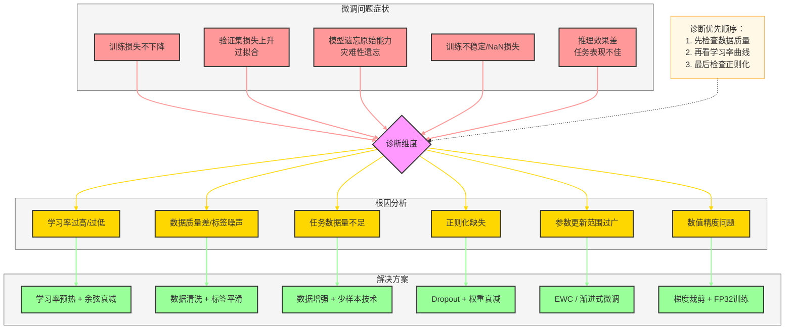

---

### 1.2 灾难性遗忘（Catastrophic Forgetting）

**症状**：微调特定任务后，模型在原始任务（如通用问答）上表现大幅下滑。

**根因**：标准反向传播无差别地覆盖了与原始任务相关的权重。

#### 诊断流程

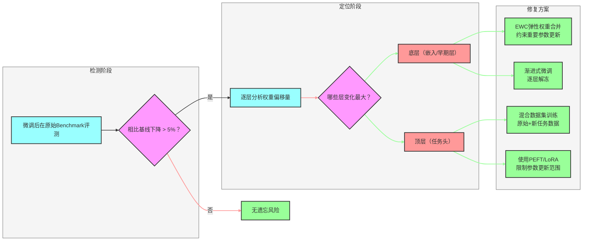

**解决方案详解**：

| 方法 | 核心思想 | 适用场景 | 计算开销 |
|------|---------|---------|---------|
| EWC（弹性权重合并） | Fisher信息矩阵约束重要参数 | 持续学习场景 | 中等 |
| 渐进式解冻（ULMFiT） | 从顶层到底层逐层解冻训练 | 迁移学习 | 低 |
| 混合回放（Replay） | 保留部分原始数据混入训练 | 数据可获取场景 | 低 |
| LoRA/PEFT | 仅训练新增少量参数 | 资源受限 | 极低 |

**EWC 实现示例**：

```python
import torch

class EWC:
    """弹性权重合并：保护重要参数不被过度修改"""
    def __init__(self, model, dataset, device='cuda'):
        self.model = model
        self.params = {n: p.clone().detach()
                       for n, p in model.named_parameters() if p.requires_grad}
        self.fisher = self._compute_fisher(dataset, device)

    def _compute_fisher(self, dataset, device):
        fisher = {n: torch.zeros_like(p)
                  for n, p in self.model.named_parameters() if p.requires_grad}
        self.model.eval()
        for batch in dataset:
            self.model.zero_grad()
            input_ids = batch['input_ids'].to(device)
            output = self.model(input_ids, labels=input_ids)
            output.loss.backward()
            for n, p in self.model.named_parameters():
                if p.requires_grad and p.grad is not None:
                    fisher[n] += p.grad.pow(2).detach()
        # 归一化
        for n in fisher:
            fisher[n] /= len(dataset)
        return fisher

    def penalty(self, model, lambda_ewc=0.4):
        """计算EWC惩罚项并叠加到主损失"""
        loss = 0.0
        for n, p in model.named_parameters():
            if p.requires_grad and n in self.fisher:
                loss += (self.fisher[n] * (p - self.params[n]).pow(2)).sum()
        return lambda_ewc * loss

# 训练循环中使用
# total_loss = task_loss + ewc.penalty(model)
```

---

### 1.3 过拟合与欠拟合

**诊断矩阵**：

| 现象 | 训练Loss | 验证Loss | 诊断结论 | 首选解法 |
|------|---------|---------|---------|---------|
| 两者均高 | 高 | 高 | 欠拟合 | 增大模型容量/降低正则化/增加训练轮次 |
| 训练低验证高 | 低 | 高 | 过拟合 | 数据增强/Dropout/提早停止 |
| 两者均低 | 低 | 低 | 正常拟合 | 可尝试进一步优化 |
| 验证抖动剧烈 | 波动 | 波动 | 学习率过高 | 降低lr/增大批次 |

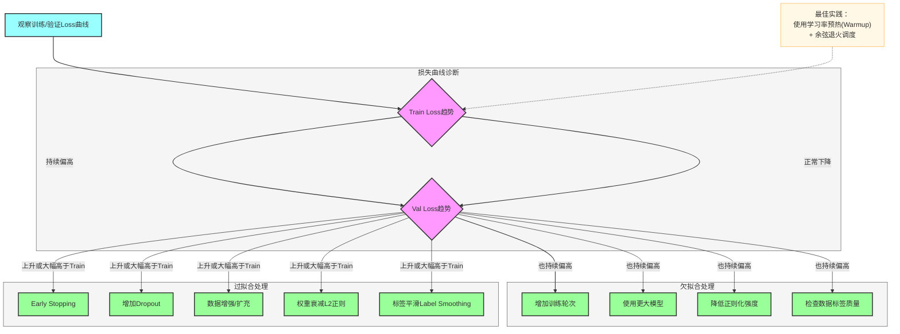

**学习率调度代码示例**：

```python
from transformers import get_cosine_schedule_with_warmup

optimizer = torch.optim.AdamW(model.parameters(), lr=2e-5, weight_decay=0.01)

# 预热10%步数 + 余弦衰减
scheduler = get_cosine_schedule_with_warmup(
    optimizer,
    num_warmup_steps=total_steps * 0.1,
    num_training_steps=total_steps
)

# 梯度裁剪防止爆炸
torch.nn.utils.clip_grad_norm_(model.parameters(), max_norm=1.0)
```

---

### 1.4 训练不稳定与 NaN 损失

**根因树**：

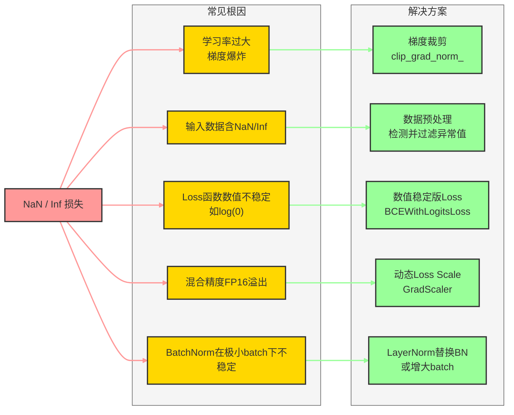

**混合精度训练稳定性示例**：

```python
from torch.cuda.amp import autocast, GradScaler

scaler = GradScaler()  # 动态Loss缩放，防止FP16下溢

for batch in dataloader:
    optimizer.zero_grad()
    with autocast():
        outputs = model(**batch)
        loss = outputs.loss

    # 缩放梯度，防止FP16梯度下溢
    scaler.scale(loss).backward()

    # 梯度裁剪：先unscale再clip
    scaler.unscale_(optimizer)
    torch.nn.utils.clip_grad_norm_(model.parameters(), max_norm=1.0)

    scaler.step(optimizer)
    scaler.update()

    # 检测NaN
    if torch.isnan(loss):
        print(f"NaN detected at step {step}, skipping...")
        continue
```

---

## 2. 模型量化（Quantization）常见问题

### 2.1 量化问题全景

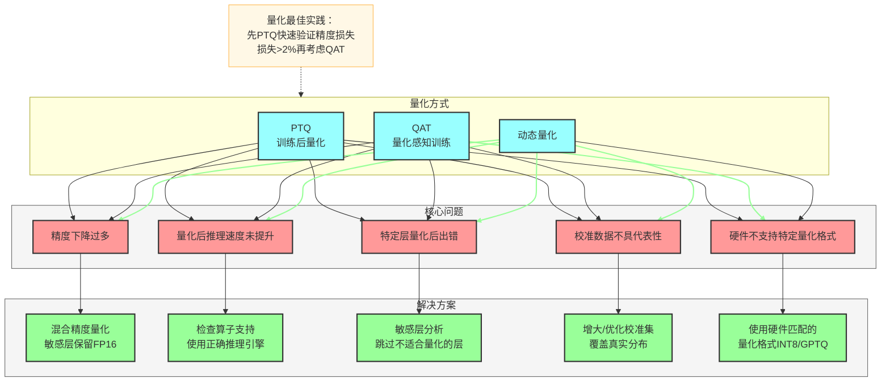

---

### 2.2 精度下降过多

**问题**：INT8 量化后模型准确率下降超过 2%，不可接受。

#### 量化敏感性分析流程

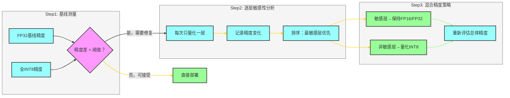

**混合精度量化（使用 bitsandbytes）**：

```python
from transformers import AutoModelForCausalLM, BitsAndBytesConfig

# 混合精度量化：大部分层INT4，敏感层保留FP16
bnb_config = BitsAndBytesConfig(
    load_in_4bit=True,
    bnb_4bit_compute_dtype=torch.float16,  # 计算仍用FP16保证精度
    bnb_4bit_use_double_quant=True,         # 嵌套量化进一步压缩
    bnb_4bit_quant_type="nf4",              # NF4比INT4对正态分布更友好
)

model = AutoModelForCausalLM.from_pretrained(
    "meta-llama/Llama-2-7b-hf",
    quantization_config=bnb_config,
    device_map="auto"
)
```

**逐层敏感性分析**：

```python
import copy

def layer_sensitivity_analysis(model, eval_fn, baseline_acc):
    """逐层量化分析敏感性"""
    sensitivity = {}

    for name, module in model.named_modules():
        if isinstance(module, torch.nn.Linear):
            # 临时量化该层
            original_weight = module.weight.data.clone()
            module.weight.data = module.weight.data.to(torch.float16).to(torch.float32)

            acc = eval_fn(model)
            sensitivity[name] = baseline_acc - acc

            # 恢复
            module.weight.data = original_weight

    # 按敏感性排序（敏感层应保留高精度）
    return sorted(sensitivity.items(), key=lambda x: x[1], reverse=True)
```

---

### 2.3 校准数据问题

**问题**：PTQ 校准集不代表真实分布，导致量化范围设置不当，推理时出现大量截断误差。

**解决方案**：

```python
from torch.quantization import prepare, convert, get_default_qconfig

def calibrate_with_representative_data(model, calibration_loader, num_batches=200):
    """使用代表性数据进行校准"""
    model.eval()
    model.qconfig = get_default_qconfig('fbgemm')  # x86平台
    prepare(model, inplace=True)

    # 关键：校准数据应覆盖真实分布的各种边界情况
    with torch.no_grad():
        for i, batch in enumerate(calibration_loader):
            if i >= num_batches:
                break
            model(batch['input_ids'])
            if i % 50 == 0:
                print(f"Calibrating: {i}/{num_batches}")

    convert(model, inplace=True)
    return model

# 校准集构建建议：
# 1. 从真实推理流量中采样（不要用训练集）
# 2. 覆盖长文本、短文本、特殊字符等边界情况
# 3. 至少 100-500 个样本，batch_size=1
```

---

### 2.4 GPTQ 量化常见问题

| 问题 | 根因 | 解决方案 |
|------|------|---------|
| GPTQ量化OOM | Hessian矩阵计算内存开销大 | 减小`percdamp`，分组处理 |
| 量化速度极慢 | 逐列优化，串行计算 | 使用`act-order=False`加速 |
| 量化后困惑度骤升 | 校准数据与预训练分布差异大 | 使用模型预训练同分布数据 |
| INT4量化推理无加速 | 缺少INT4 CUDA内核支持 | 使用`auto-gptq` + `exllama`后端 |

```python
from auto_gptq import AutoGPTQForCausalLM, BaseQuantizeConfig

quantize_config = BaseQuantizeConfig(
    bits=4,              # 量化位宽
    group_size=128,      # 分组大小，越小精度越高但速度越慢
    desc_act=False,      # act-order，False时速度更快
    damp_percent=0.01,   # Hessian矩阵稳定性参数
)

model = AutoGPTQForCausalLM.from_pretrained(model_path, quantize_config)

# 使用预训练同分布数据作为校准集
examples = [tokenizer(text, return_tensors="pt") for text in calibration_texts]
model.quantize(examples)
model.save_quantized(output_dir, use_safetensors=True)
```

---

## 3. 模型蒸馏（Knowledge Distillation）常见问题

### 3.1 蒸馏问题全景

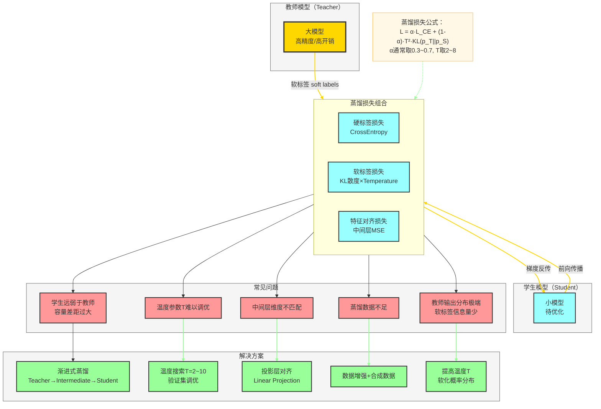

---

### 3.2 学生与教师容量差距过大

**问题**：学生模型参数量远小于教师（如 1B vs 70B），直接蒸馏效果不如从头训练。

**解决方案：渐进式蒸馏（Progressive Distillation）**：

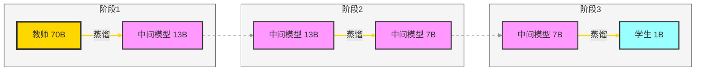

---

### 3.3 温度参数调优

**温度（Temperature）的作用**：

$$p_i^T = \frac{\exp(z_i / T)}{\sum_j \exp(z_j / T)}$$

- **T=1**：标准 Softmax，概率分布尖锐，负类信息丢失
- **T 增大**：概率分布软化，暗知识（Dark Knowledge）增多
- **T 过大**：分布趋于均匀，失去区分性信息

```python
import torch.nn.functional as F

def distillation_loss(student_logits, teacher_logits, labels,
                      temperature=4.0, alpha=0.5):
    """
    标准知识蒸馏损失
    alpha: 软标签损失权重
    temperature: 知识蒸馏温度，通常2-8
    """
    # 软标签损失（教师软化概率 vs 学生软化概率）
    soft_loss = F.kl_div(
        F.log_softmax(student_logits / temperature, dim=-1),
        F.softmax(teacher_logits / temperature, dim=-1),
        reduction='batchmean'
    ) * (temperature ** 2)  # 乘以T²补偿梯度缩放

    # 硬标签损失
    hard_loss = F.cross_entropy(student_logits, labels)

    return alpha * soft_loss + (1 - alpha) * hard_loss


def search_temperature(model_s, model_t, val_loader, T_range=(1, 2, 4, 6, 8)):
    """在验证集上搜索最优温度"""
    best_T, best_loss = 1, float('inf')
    for T in T_range:
        total_loss = 0
        for batch in val_loader:
            with torch.no_grad():
                s_logits = model_s(**batch).logits
                t_logits = model_t(**batch).logits
            loss = distillation_loss(s_logits, t_logits, batch['labels'], T)
            total_loss += loss.item()
        avg_loss = total_loss / len(val_loader)
        print(f"T={T}: val_loss={avg_loss:.4f}")
        if avg_loss < best_loss:
            best_T, best_loss = T, avg_loss
    return best_T
```

---

### 3.4 中间层特征对齐问题

**问题**：教师和学生中间层维度不一致，无法直接计算特征损失。

```python
class FeatureAlignmentLayer(torch.nn.Module):
    """投影层：将学生特征维度对齐到教师维度"""
    def __init__(self, student_dim, teacher_dim):
        super().__init__()
        self.projector = torch.nn.Linear(student_dim, teacher_dim, bias=False)

    def forward(self, student_feat, teacher_feat):
        projected = self.projector(student_feat)
        # MSE特征对齐损失
        return F.mse_loss(projected, teacher_feat.detach())


class DistillationTrainer:
    """包含特征对齐的完整蒸馏训练器"""
    def __init__(self, teacher, student, layer_pairs):
        self.teacher = teacher
        self.student = student
        # layer_pairs: [(student_layer_idx, teacher_layer_idx), ...]
        self.align_layers = torch.nn.ModuleList([
            FeatureAlignmentLayer(student.config.hidden_size,
                                  teacher.config.hidden_size)
            for _ in layer_pairs
        ])

    def compute_feature_loss(self, s_hidden_states, t_hidden_states, layer_pairs):
        feat_loss = 0.0
        for i, (s_idx, t_idx) in enumerate(layer_pairs):
            feat_loss += self.align_layers[i](
                s_hidden_states[s_idx],
                t_hidden_states[t_idx]
            )
        return feat_loss
```

---

## 4. LoRA 低秩适应常见问题

### 4.1 LoRA 问题全景

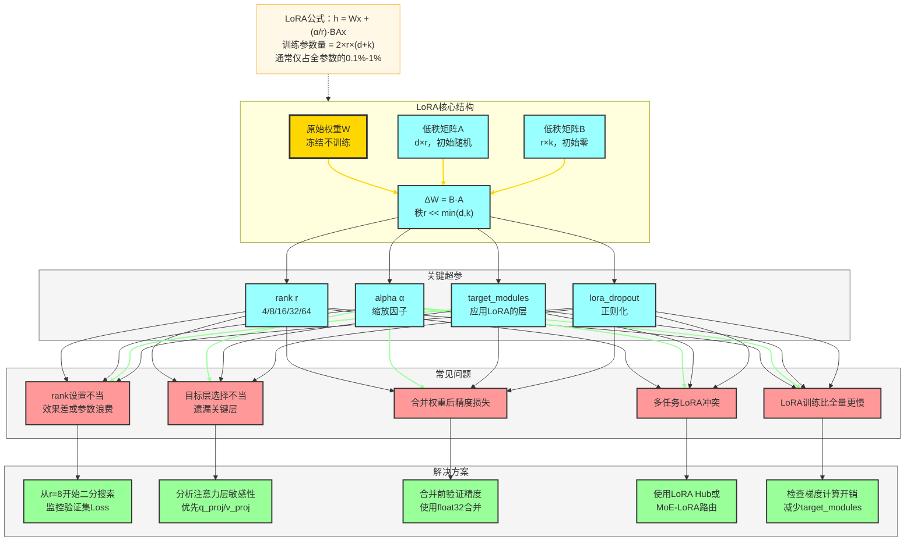

---

### 4.2 Rank 选择不当

**rank 影响分析**：

| rank | 参数量 | 表达能力 | 过拟合风险 | 适用场景 |
|------|--------|---------|-----------|---------|
| 1-4 | 极少 | 弱 | 低 | 极少数据，简单任务 |
| 8-16 | 少 | 中等 | 中低 | 大多数微调场景（推荐默认值） |
| 32-64 | 中等 | 较强 | 中等 | 复杂推理任务，数据充足 |
| 128+ | 较多 | 强 | 高 | 接近全参数微调效果 |

**自适应 rank 搜索**：

```python
from peft import LoraConfig, get_peft_model, TaskType

def find_optimal_rank(model, train_dataset, val_dataset,
                      rank_candidates=[4, 8, 16, 32]):
    """在验证集上搜索最优LoRA rank"""
    best_rank, best_metric = 8, float('inf')

    for rank in rank_candidates:
        lora_config = LoraConfig(
            r=rank,
            lora_alpha=rank * 2,   # alpha通常设为rank的2倍
            target_modules=["q_proj", "v_proj", "k_proj", "o_proj"],
            lora_dropout=0.05,
            bias="none",
            task_type=TaskType.CAUSAL_LM,
        )
        peft_model = get_peft_model(model, lora_config)
        peft_model.print_trainable_parameters()

        # 快速训练1个epoch
        metric = quick_train_and_eval(peft_model, train_dataset, val_dataset)
        print(f"rank={rank}: val_loss={metric:.4f}")

        if metric < best_metric:
            best_rank, best_metric = rank, metric

    print(f"Best rank: {best_rank} with val_loss={best_metric:.4f}")
    return best_rank
```

---

### 4.3 目标模块选择不当

**LoRA 目标层选择指南**：

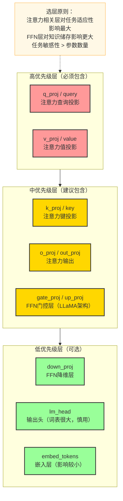

```python
# 针对不同架构的推荐target_modules
ARCH_TARGET_MODULES = {
    "llama": ["q_proj", "k_proj", "v_proj", "o_proj",
              "gate_proj", "up_proj", "down_proj"],
    "mistral": ["q_proj", "k_proj", "v_proj", "o_proj"],
    "falcon": ["query_key_value", "dense", "dense_h_to_4h", "dense_4h_to_h"],
    "chatglm": ["query_key_value", "dense", "dense_h_to_4h", "dense_4h_to_h"],
    "bert": ["query", "key", "value", "output.dense"],
}

lora_config = LoraConfig(
    r=16,
    lora_alpha=32,
    target_modules=ARCH_TARGET_MODULES["llama"],
    lora_dropout=0.05,
    bias="none",
    task_type=TaskType.CAUSAL_LM,
)
```

---

### 4.4 多任务 LoRA 冲突

**问题**：多个任务的 LoRA 权重合并后相互干扰，综合效果不如单任务。

**解决方案：LoRA Hub / 动态 LoRA 路由**：

```python
class MultiTaskLoRARouter(torch.nn.Module):
    """动态LoRA路由：根据输入内容选择合适的LoRA适配器"""
    def __init__(self, base_model, lora_adapters, num_tasks):
        super().__init__()
        self.base_model = base_model
        self.lora_adapters = torch.nn.ModuleDict(lora_adapters)
        # 轻量级路由器，判断任务类型
        self.router = torch.nn.Linear(base_model.config.hidden_size, num_tasks)

    def forward(self, input_ids, **kwargs):
        # 获取输入表示
        with torch.no_grad():
            hidden = self.base_model.get_input_embeddings()(input_ids).mean(dim=1)

        # 路由决策
        routing_weights = torch.softmax(self.router(hidden), dim=-1)

        # 加权融合各任务LoRA的输出（软路由）
        outputs = None
        for i, (task_name, adapter) in enumerate(self.lora_adapters.items()):
            task_output = adapter(input_ids=input_ids, **kwargs)
            if outputs is None:
                outputs = routing_weights[:, i:i+1, None] * task_output.logits
            else:
                outputs += routing_weights[:, i:i+1, None] * task_output.logits

        return outputs
```

---

### 4.5 LoRA 权重合并问题

**问题**：将 LoRA 权重合并到基础模型时出现精度损失。

```python
from peft import PeftModel

def safe_merge_lora(base_model_path, lora_adapter_path, output_path,
                    merge_dtype=torch.float32):
    """安全合并LoRA权重，使用float32确保精度"""
    from transformers import AutoModelForCausalLM

    # 用float32加载基础模型保证合并精度
    base_model = AutoModelForCausalLM.from_pretrained(
        base_model_path,
        torch_dtype=merge_dtype,  # 关键：合并时用float32
        device_map="cpu"          # CPU合并避免显存不足
    )

    # 加载LoRA适配器
    peft_model = PeftModel.from_pretrained(base_model, lora_adapter_path)

    # 合并并卸载LoRA权重
    merged_model = peft_model.merge_and_unload()

    # 验证合并后精度（关键步骤）
    print("Verifying merged model...")
    # 在验证集上对比合并前后的输出
    # ...

    # 保存
    merged_model.save_pretrained(output_path)
    print(f"Merged model saved to {output_path}")
    return merged_model
```

---

## 5. 知识融合（Knowledge Fusion）常见问题

### 5.1 知识融合问题全景

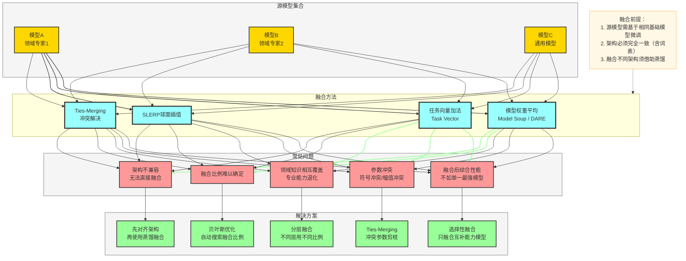

---

### 5.2 参数冲突问题（Ties-Merging）

**问题**：不同任务微调出的参数方向相反（符号冲突），简单平均后相互抵消。

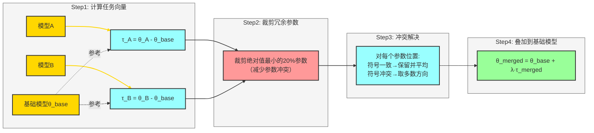

**Ties-Merging 实现**：

```python
import torch

def ties_merging(base_model_params, finetuned_params_list,
                 density=0.8, lambda_coef=1.0):
    """
    Ties-Merging: 解决模型融合中的参数冲突
    density: 保留参数的比例（裁剪低绝对值参数）
    lambda_coef: 任务向量缩放系数
    """
    # Step1: 计算各模型的任务向量
    task_vectors = []
    for ft_params in finetuned_params_list:
        tv = {k: ft_params[k] - base_model_params[k]
              for k in base_model_params}
        task_vectors.append(tv)

    # Step2: 对每个参数进行Trim（稀疏化）
    trimmed_tvs = []
    for tv in task_vectors:
        trimmed_tv = {}
        for k, v in tv.items():
            # 保留绝对值最大的density比例的参数
            threshold = torch.quantile(v.abs().flatten(), 1 - density)
            mask = v.abs() >= threshold
            trimmed_tv[k] = v * mask.float()
        trimmed_tvs.append(trimmed_tv)

    # Step3: Elect（冲突解决）
    merged_tv = {}
    for k in base_model_params:
        stacked = torch.stack([tv[k] for tv in trimmed_tvs], dim=0)

        # 对每个位置统计符号方向
        signs = torch.sign(stacked.sum(dim=0))  # 多数方向

        # 只保留与多数方向一致的参数
        consistent_mask = (torch.sign(stacked) == signs.unsqueeze(0)).float()
        merged_tv[k] = (stacked * consistent_mask).sum(dim=0) / \
                       (consistent_mask.sum(dim=0) + 1e-8)

    # Step4: 叠加到基础模型
    merged_params = {k: base_model_params[k] + lambda_coef * merged_tv[k]
                     for k in base_model_params}
    return merged_params
```

---

### 5.3 Model Soup 与任务向量

**Model Soup**（均匀或贪婪权重平均）：

```python
import torch
from transformers import AutoModelForCausalLM

def model_soup(model_paths, base_path, mode="uniform", val_fn=None):
    """
    Model Soup: 权重平均融合多个微调模型
    mode: "uniform"=均匀平均, "greedy"=贪婪搜索
    """
    base_model = AutoModelForCausalLM.from_pretrained(base_path)

    if mode == "uniform":
        # 均匀平均所有模型
        avg_state_dict = {}
        for i, path in enumerate(model_paths):
            model = AutoModelForCausalLM.from_pretrained(path)
            for k, v in model.state_dict().items():
                if k not in avg_state_dict:
                    avg_state_dict[k] = v.float()
                else:
                    avg_state_dict[k] += v.float()
        for k in avg_state_dict:
            avg_state_dict[k] /= len(model_paths)
        base_model.load_state_dict(avg_state_dict)
        return base_model

    elif mode == "greedy":
        # 贪婪搜索：每次加入能提升验证性能的模型
        best_metric = val_fn(base_model)
        soup_models = []
        soup_state = base_model.state_dict()

        for path in model_paths:
            candidate = AutoModelForCausalLM.from_pretrained(path)
            # 尝试将候选模型加入soup
            temp_state = {}
            n = len(soup_models) + 1
            for k in soup_state:
                temp_state[k] = (soup_state[k].float() * len(soup_models) +
                                  candidate.state_dict()[k].float()) / n

            base_model.load_state_dict(temp_state)
            metric = val_fn(base_model)
            if metric > best_metric:
                best_metric = metric
                soup_models.append(path)
                soup_state = temp_state
                print(f"Added {path}: metric={metric:.4f}")
            else:
                # 回滚
                base_model.load_state_dict(soup_state)
                print(f"Skipped {path}: metric={metric:.4f} < {best_metric:.4f}")

        return base_model
```

---

### 5.4 DARE（随机稀疏融合）

**问题**：模型参数冗余导致融合时噪声过多。

**DARE** 通过随机丢弃任务向量中的参数并进行重缩放来减少干扰：

```python
def dare_merge(base_params, finetuned_params, drop_rate=0.9, lambda_coef=1.0):
    """
    DARE: Drop And REscale
    随机丢弃大部分任务向量参数，保留核心变化并重缩放
    drop_rate: 参数丢弃率，通常0.8~0.99
    """
    merged_params = {}
    for k in base_params:
        task_vector = finetuned_params[k].float() - base_params[k].float()

        # 随机掩码：保留(1-drop_rate)比例的参数
        mask = torch.bernoulli(
            torch.ones_like(task_vector) * (1 - drop_rate)
        )

        # 重缩放：保持期望值不变
        rescaled_tv = task_vector * mask / (1 - drop_rate)

        merged_params[k] = base_params[k].float() + lambda_coef * rescaled_tv

    return merged_params
```

---

## 6. 面试常见问题（FAQ）

### 6.1 模型微调相关

---

**Q1：全参数微调（Full Fine-tuning）和参数高效微调（PEFT）有什么区别？各自适用场景是什么？**

> **A**：
> - **全参数微调**：更新模型所有参数，需要与预训练相当的显存（存储参数 + 梯度 + 优化器状态约需 4× 参数量显存），适合**数据充足（万级以上样本）且计算资源充足**的场景，效果上限更高。
> - **PEFT（如 LoRA、Prefix-Tuning、P-Tuning）**：只训练极少数新增参数（<1%），显存仅需约 1× 参数量，适合**资源受限、数据较少或需要多任务切换**的场景。
> - **核心权衡**：PEFT 在数据量充足时通常接近全参数微调效果，但在极度特化的领域任务上全参数微调可能略有优势。

---

**Q2：什么是灾难性遗忘？如何在微调中避免？**

> **A**：灾难性遗忘指模型在特定任务微调后，在原始通用任务上的能力大幅下降，根因是神经网络的共享参数空间。
> - **解决方案**：① **EWC**：Fisher 信息矩阵约束重要参数变化；② **渐进式解冻**：从顶层到底层逐层解冻训练；③ **混合数据回放**：在新任务数据中混入5~10%的原始任务数据；④ **LoRA/PEFT**：冻结原始参数，只训练新增参数，从架构上避免遗忘。

---

**Q3：如何调整学习率以获得最佳微调效果？**

> **A**：微调的学习率通常比预训练小 10~100 倍。推荐策略：
> - 基础模型较大（>7B）：`1e-5 ~ 5e-5`
> - 小模型（<1B）：`1e-4 ~ 5e-4`
> - **必须使用学习率调度**：线性预热（前10%步数）+ 余弦衰减或线性衰减
> - **不同层差异学习率**（Discriminative Learning Rates）：底层学习率更小，顶层更大，防止破坏预训练的低层表示

---

### 6.2 模型量化相关

---

**Q4：PTQ（训练后量化）和 QAT（量化感知训练）的区别与选择？**

> **A**：
> - **PTQ**：量化已训练好的模型，无需重新训练，速度快但精度损失较大（通常下降1~3%）。适合**快速部署验证**，或对精度损失不敏感的场景。
> - **QAT**：在训练过程中模拟量化噪声，让模型学会适应量化误差，精度接近浮点模型但需要重新训练（成本高）。适合**对精度要求高且有训练资源**的场景。
> - **选择建议**：先用 PTQ 快速验证，若精度损失可接受则直接使用；若 PTQ 精度损失 > 2%，再考虑 QAT。

---

**Q5：INT4 量化和 INT8 量化的区别？什么情况下选择哪种？**

> **A**：
> - **INT8**：精度损失小（通常<1%），大多数硬件均原生支持，推理加速约1.5~2×，是**生产部署的主流选择**。
> - **INT4**：模型体积减小约4×，适合**超大模型的内存受限部署**（如在消费级 GPU 上运行 7B/13B 模型），精度损失约2~5%（GPTQ/GGUF 等算法可缓解）。
> - **混合精度**：敏感层（如注意力层的 Softmax 后处理）保留 FP16，其余用 INT4/INT8，是平衡精度与效率的最佳方案。

---

**Q6：量化后推理速度没有提升，可能是什么原因？**

> **A**：常见原因：① 推理框架不支持该量化格式的硬件加速（如 PyTorch 的 INT8 kernel 在某些 GPU 上未优化）；② 模型太小，量化收益被框架 overhead 抵消；③ 使用了非原生量化操作（如 Python 实现的模拟量化）。解决：使用 TensorRT、vLLM、llama.cpp 等专为量化优化的推理引擎。

---

### 6.3 模型蒸馏相关

---

**Q7：知识蒸馏中温度参数（Temperature）的作用是什么？如何设置？**

> **A**：温度 T 控制教师模型 Softmax 输出的"软化程度"。T=1 时为标准 Softmax，概率分布尖锐，次优类别的信息（暗知识）几乎丢失。T 增大后分布软化，学生模型能学到"苹果更像橙子而非汽车"这样的类间相似性信息，这是蒸馏超越直接监督的关键。
> - **建议设置**：T=2~8，在验证集上搜索最优值；若教师模型输出已经很软（如经过 softmax 后最大概率<0.9），可以使用较小 T；若教师输出极为尖锐，使用较大 T（6~10）。

---

**Q8：特征蒸馏（Feature Distillation）相比输出蒸馏有什么优势？**

> **A**：
> - **输出蒸馏（Logit Distillation）**：只利用最后一层的软标签，信息量有限。
> - **特征蒸馏**：额外对齐中间层的隐层表示，将教师的中间表示作为学生的学习目标，让学生学到更丰富的中间特征，通常比纯输出蒸馏效果提升3~8%。
> - **挑战**：教师和学生中间层维度可能不同，需要投影层对齐；蒸馏哪些层的最优方案依赖实验验证。

---

### 6.4 LoRA 相关

---

**Q9：LoRA 的核心原理是什么？为什么低秩矩阵能有效适应模型？**

> **A**：LoRA 基于假设：预训练模型的权重更新矩阵 ΔW 具有**低内在秩**（intrinsic rank）。具体实现：将 ΔW 分解为两个低秩矩阵的乘积 ΔW = BA（B ∈ R^{d×r}, A ∈ R^{r×k}，r << min(d,k)），只训练 A 和 B，原始权重 W 冻结不变。推理时可将 ΔW 合并回 W，无额外延迟。**为什么有效**：NLP 任务的适应本质上是低维流形上的优化，实验证明 r=4~16 通常已足够捕获大多数任务的适应需求。

---

**Q10：LoRA 的 rank（r）和 alpha（α）如何设置？它们的关系是什么？**

> **A**：
> - **rank r**：控制 LoRA 矩阵的秩，即可表达的参数空间维度。r 越大，表达能力越强，参数越多。推荐从 r=8 或 r=16 开始，复杂任务用 r=32~64。
> - **alpha α**：实际缩放系数为 α/r，控制 LoRA 更新对原始权重的影响幅度。常见设置：α = r 或 α = 2r（如 r=16, α=32）。
> - **实践技巧**：固定 α/r 比例（如始终为2），只调节 r；或使用 RSLoRA（将缩放改为 1/√r 而非 1/r），在高 rank 时更稳定。

---

**Q11：QLoRA 相比 LoRA 有什么改进？**

> **A**：QLoRA（Quantized LoRA）= NF4 量化基础模型 + LoRA 微调，实现了在单张消费级 GPU（48GB）上微调 65B 参数模型的突破。核心创新：① **NF4 量化**（Normal Float 4-bit）：针对正态分布参数设计的量化格式，比 INT4 精度更高；② **双重量化**（Double Quantization）：对量化常数本身再量化，进一步减少内存；③ **分页优化器**（Paged Optimizer）：GPU OOM 时自动将优化器状态卸载到 CPU 内存。代价是训练速度比标准 LoRA 慢约 20~30%。

---

### 6.5 知识融合相关

---

**Q12：什么情况下适合用模型融合而非重新微调？**

> **A**：
> - **适合模型融合的场景**：① 已有多个在不同数据/任务上微调的同源模型（同一基础模型）；② 无法访问训练数据（隐私合规）；③ 需要快速综合多个专家模型的能力；④ 计算资源有限，无法重新训练。
> - **不适合融合的场景**：① 模型架构不同；② 词表不一致；③ 预训练基础模型不同；④ 目标任务与融合模型能力差距很大（此时蒸馏或微调更优）。

---

**Q13：Ties-Merging 和简单权重平均（Model Soup）的本质区别是什么？**

> **A**：
> - **Model Soup（均匀平均）**：对所有参数直接取均值，不处理符号冲突，若两模型某参数方向相反则相互抵消，综合效果差。适合多个相似任务的模型融合。
> - **Ties-Merging**：① 先稀疏化（Trim）：丢弃幅值小的参数（减少噪声）；② 再投票（Elect）：对每个参数位置取多数方向，丢弃少数方向；③ 最后合并（Merge）：将投票通过的参数取均值。有效解决了参数冲突，在多任务模型融合中显著优于简单平均。

---

**Q14：任务向量（Task Vector）是什么？为什么它在知识融合中如此重要？**

> **A**：任务向量 τ = θ_finetuned - θ_base，即微调后模型参数与基础模型参数的差值向量，代表了"微调在参数空间中引入的变化方向"。**重要性**：① 任务向量可以进行代数运算：加法（组合能力）、减法（消除能力）、缩放（调整强度）；② 不同任务的任务向量通常在参数空间中是近似正交的，使得加法组合成为可能；③ 是模型融合、知识迁移、能力拼接等技术的数学基础。

---

### 6.6 综合技术对比

---

**Q15：对于一个资源受限（单卡 A100 80GB）的生产环境，如何在有限数据下将 70B 模型部署给用户使用？**

> **A**：推荐技术路线（组合使用）：
> 1. **量化**：使用 GPTQ INT4 量化，将 70B 模型从约 140GB 压缩到约 35~40GB，可放入单卡
> 2. **训练**：用 QLoRA（NF4 量化基础模型 + LoRA 适配器）在下游任务数据上微调，仅需约 24GB 显存
> 3. **蒸馏（可选）**：若延迟要求高，可将 70B 知识蒸馏到 7B，配合全量 INT8 量化部署
> 4. **推理引擎**：使用 vLLM + PagedAttention 提升并发吞吐，支持连续批处理（continuous batching）
> - **最终方案**：QLoRA 微调 70B → GPTQ INT4 量化 → vLLM 部署，单卡可支持约 30~50 QPS

---

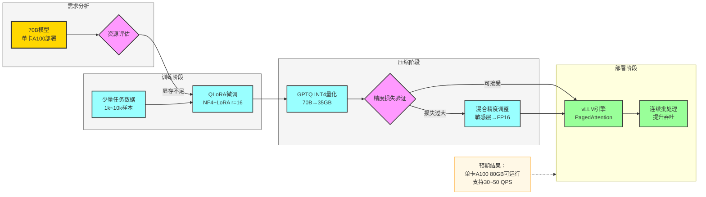

---

> **文档版本**：v1.0 | **最后更新**：2026-03
>
> **参考资料**：
> - [LoRA: Low-Rank Adaptation of Large Language Models](https://arxiv.org/abs/2106.09685)
> - [GPTQ: Accurate Post-Training Quantization for Generative Pre-trained Transformers](https://arxiv.org/abs/2210.17323)
> - [Distilling the Knowledge in a Neural Network](https://arxiv.org/abs/1503.02531)
> - [Resolving Interference When Merging Models (Ties-Merging)](https://arxiv.org/abs/2306.01708)
> - [Model soups: averaging weights of multiple fine-tuned models improves accuracy and robustness](https://arxiv.org/abs/2203.05482)
> - [DARE: Language Model Arithmetic with Task Vectors](https://arxiv.org/abs/2311.03099)
> - [QLoRA: Efficient Finetuning of Quantized LLMs](https://arxiv.org/abs/2305.14314)
