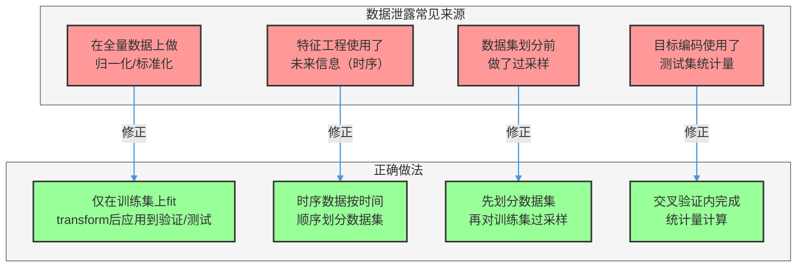
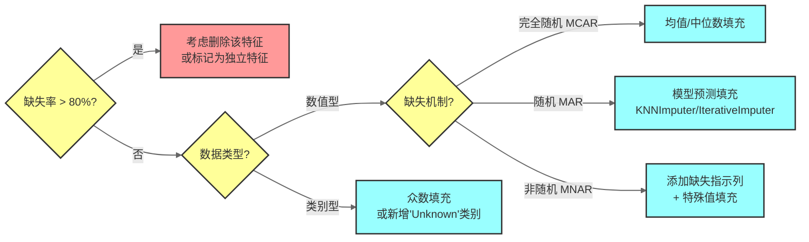
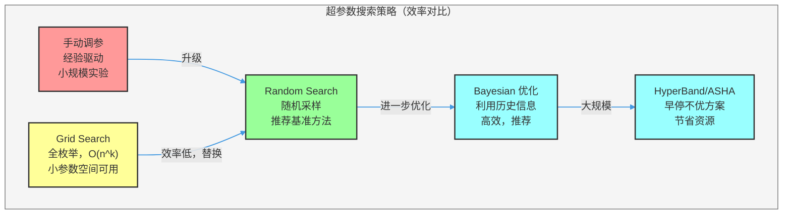
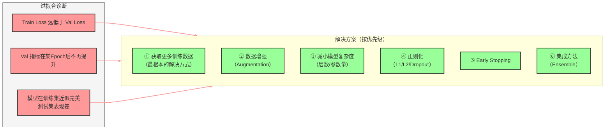
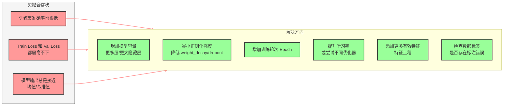
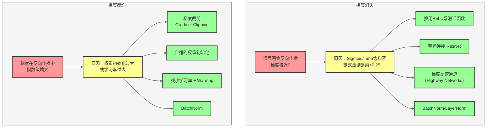
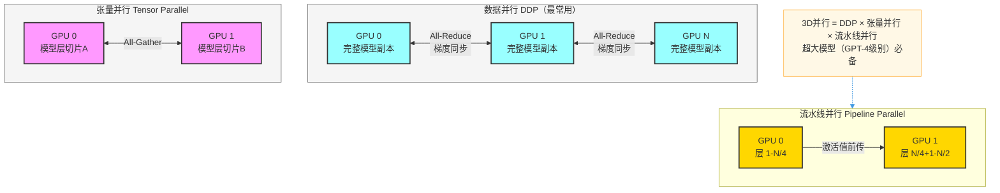
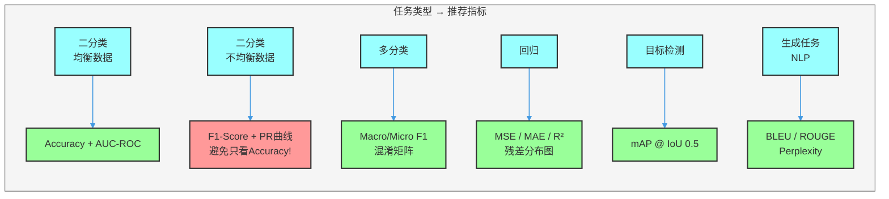

# 模型训练常见问题与解决方案

> 本文系统梳理深度学习/机器学习模型训练全流程中的高频问题，涵盖数据预处理、超参数调整、过拟合与欠拟合、训练稳定性等核心环节，并提供可落地的解决方案与工程实践建议。

---

## 目录

1. [训练流程总览](#一训练流程总览)
2. [数据预处理问题](#二数据预处理问题)
3. [模型结构与初始化问题](#三模型结构与初始化问题)
4. [超参数调整问题](#四超参数调整问题)
5. [过拟合问题](#五过拟合问题)
6. [欠拟合问题](#六欠拟合问题)
7. [训练稳定性问题](#七训练稳定性问题)
8. [分布式训练问题](#八分布式训练问题)
9. [评估与调试问题](#九评估与调试问题)
10. [面试常见问题 FAQ](#十面试常见问题-faq)

---

## 一、训练流程总览

在深入各类问题之前，先明确模型训练的标准流程及各阶段的关键决策点，这有助于我们在遇到问题时快速定位根因。

```mermaid
flowchart LR
    %% 样式定义
    classDef dataStyle fill:#9ff,stroke:#333,stroke-width:2px
    classDef modelStyle fill:#f9f,stroke:#333,stroke-width:2px
    classDef trainStyle fill:#ffd700,stroke:#333,stroke-width:2px
    classDef evalStyle fill:#9f9,stroke:#333,stroke-width:2px
    classDef problemStyle fill:#f99,stroke:#333,stroke-width:2px
    classDef decisionStyle fill:#ff9,stroke:#333,stroke-width:2px
    classDef subgraphStyle fill:#f5f5f5,stroke:#666,stroke-width:1px
    classDef noteStyle fill:#fff8e6,stroke:#ffb74d,stroke-width:1px

    %% 数据阶段
    subgraph dataPhase["① 数据阶段"]
        A[原始数据收集]:::dataStyle --> B[数据清洗<br/>去重/去噪/填充]:::dataStyle
        B --> C[特征工程<br/>归一化/编码]:::dataStyle
        C --> D[数据集划分<br/>Train/Val/Test]:::dataStyle
    end
    class dataPhase subgraphStyle

    %% 模型阶段
    subgraph modelPhase["② 模型阶段"]
        E[选择模型架构]:::modelStyle --> F[参数初始化<br/>Xavier/Kaiming]:::modelStyle
    end
    class modelPhase subgraphStyle

    %% 训练阶段
    subgraph trainPhase["③ 训练阶段"]
        G[前向传播]:::trainStyle --> H[计算损失函数]:::trainStyle
        H --> I[反向传播]:::trainStyle
        I --> J[梯度更新<br/>Optimizer]:::trainStyle
    end
    class trainPhase subgraphStyle

    %% 评估阶段
    subgraph evalPhase["④ 评估阶段"]
        K{验证集表现}:::decisionStyle
        K -->|欠拟合| L[增大模型/减小正则]:::problemStyle
        K -->|过拟合| M[正则化/Dropout/数据增强]:::problemStyle
        K -->|达标| N[测试集评估]:::evalStyle
    end
    class evalPhase subgraphStyle

    %% 主流程连接
    D --> E
    F --> G
    J -->|下一个Batch| G
    J -->|完成一个Epoch| K
    L --> G
    M --> G
    N --> O[模型部署]:::evalStyle

    %% 关键路径说明
    Note["训练核心循环：前向→损失→反向→更新<br/>评估驱动调整：欠拟合↔过拟合诊断"]:::noteStyle
    Note -.-> trainPhase

    linkStyle 0,1,2,3,4,5,6,7,8,9,10,11 stroke:#666,stroke-width:1.5px
    linkStyle 12,13 stroke:#f99,stroke-width:2px
```



---

## 二、数据预处理问题

数据质量直接决定模型上限。"Garbage in, garbage out"是训练失败的第一大根因。

### 2.1 数据不平衡

**问题表现**：分类任务中各类别样本数量差异悬殊（如正负样本比 1:100），模型倾向于预测多数类，少数类召回率极低。

**解决方案**：

| 方法 | 适用场景 | 注意事项 |
|------|----------|----------|
| **过采样（SMOTE）** | 少数类样本极少 | 可能引入噪声，避免在测试集使用 |
| **欠采样** | 多数类样本极多且冗余 | 可能丢失有用信息 |
| **类别权重** | 不想改变数据分布 | 在损失函数中设置 `class_weight` |
| **Focal Loss** | 目标检测/二分类 | 动态降低易分类样本权重 |
| **数据增强** | 图像/文本任务 | 针对少数类生成多样化样本 |

```python
# 方法1：sklearn 类别权重
from sklearn.utils.class_weight import compute_class_weight
class_weights = compute_class_weight('balanced', classes=np.unique(y), y=y)

# 方法2：PyTorch 加权采样
sampler = WeightedRandomSampler(weights=sample_weights, num_samples=len(dataset))

# 方法3：Focal Loss（二分类示例）
def focal_loss(pred, target, alpha=0.25, gamma=2.0):
    bce = F.binary_cross_entropy_with_logits(pred, target, reduction='none')
    pt = torch.exp(-bce)
    return (alpha * (1 - pt) ** gamma * bce).mean()
```

### 2.2 数据泄露（Data Leakage）

**问题表现**：训练集验证指标远高于线上效果；测试集准确率异常高（接近100%）。

**常见来源**：



**核心原则**：所有数据处理的 `fit` 操作只能在训练集上进行，然后 `transform` 应用到验证集和测试集。

### 2.3 特征归一化/标准化

**问题表现**：不同特征的数量级差异导致梯度下降路径扭曲，训练速度慢且容易陷入局部最优。

**选择指南**：

- **Min-Max 归一化** `[0,1]`：特征有明确边界（如图像像素值），对异常值敏感。
- **Z-score 标准化**：特征近似正态分布，大多数场景首选。
- **RobustScaler**：含有较多异常值时使用（基于中位数和 IQR）。
- **不需要归一化**：树模型（决策树、随机森林、XGBoost）。

```python
from sklearn.preprocessing import StandardScaler, MinMaxScaler, RobustScaler

# 关键：只在训练集 fit
scaler = StandardScaler()
X_train = scaler.fit_transform(X_train)  # fit + transform
X_val   = scaler.transform(X_val)        # 只 transform，不 fit
X_test  = scaler.transform(X_test)
```

### 2.4 缺失值处理

**处理策略决策树**：



---

## 三、模型结构与初始化问题

### 3.1 权重初始化不当

**问题表现**：梯度消失（输出层梯度接近0）或梯度爆炸（Loss 变为 NaN）在训练最初几步就出现。

**初始化方案对照表**：

| 激活函数 | 推荐初始化 | PyTorch API |
|----------|-----------|-------------|
| Sigmoid / Tanh | Xavier（Glorot）均匀/正态 | `nn.init.xavier_uniform_` |
| ReLU / LeakyReLU | Kaiming（He）初始化 | `nn.init.kaiming_normal_` |
| SELU | LeCun 正态初始化 | `nn.init.normal_(std=1/sqrt(fan_in))` |
| Transformer | 截断正态，std=0.02 | 参考 BERT 初始化代码 |

```python
def init_weights(module):
    if isinstance(module, nn.Linear):
        nn.init.kaiming_normal_(module.weight, mode='fan_out', nonlinearity='relu')
        if module.bias is not None:
            nn.init.zeros_(module.bias)
    elif isinstance(module, nn.LayerNorm):
        nn.init.ones_(module.weight)
        nn.init.zeros_(module.bias)

model.apply(init_weights)
```

### 3.2 激活函数选择


---

## 四、超参数调整问题

超参数调优是训练中最耗时的环节，需要系统化方法而非盲目尝试。

### 4.1 学习率问题

学习率是最重要的超参数，影响训练稳定性和收敛速度。

**学习率诊断图**：

| 现象 | 可能原因 | 解决方案 |
|------|----------|----------|
| Loss 不下降 | 学习率过小 | 增大 10x 后重试 |
| Loss 震荡/发散 | 学习率过大 | 缩小 10x，加 warmup |
| Loss 快速下降后平台期 | 需要 LR 衰减 | 加 scheduler |
| Loss 初期 NaN | 学习率极大或梯度爆炸 | 加梯度裁剪 + 减小 LR |

```mermaid
flowchart LR
    classDef startStyle fill:#9ff,stroke:#333,stroke-width:2px
    classDef processStyle fill:#ffd700,stroke:#333,stroke-width:2px
    classDef decisionStyle fill:#ff9,stroke:#333,stroke-width:2px
    classDef actionStyle fill:#9f9,stroke:#333,stroke-width:2px
    classDef warnStyle fill:#f99,stroke:#333,stroke-width:2px
    classDef subgraphStyle fill:#f5f5f5,stroke:#666,stroke-width:1px
    classDef noteStyle fill:#fff8e6,stroke:#ffb74d,stroke-width:1px

    A[开始：设置初始 LR=1e-3]:::startStyle --> B[LR Finder<br/>从小到大扫描LR]:::processStyle
    B --> C{Loss 曲线}:::decisionStyle
    C -->|找到损失最速下降点| D[选择该点 LR 的 1/10<br/>作为训练 LR]:::actionStyle
    C -->|曲线无规律| E[检查数据/模型结构]:::warnStyle

    D --> F[训练阶段]:::processStyle
    F --> G{Epoch N 后验证Loss}:::decisionStyle
    G -->|持续下降| F
    G -->|停滞不降| H[触发 LR 衰减 Scheduler]:::actionStyle
    G -->|验证Loss上升| I[触发 Early Stopping]:::warnStyle

    subgraph schedulers["常用 LR Scheduler"]
        S1[StepLR：固定步长衰减]:::processStyle
        S2[CosineAnnealingLR：余弦退火]:::processStyle
        S3[ReduceLROnPlateau：自适应衰减]:::processStyle
        S4[WarmupCosine：先升后降（LLM常用）]:::processStyle
    end
    class schedulers subgraphStyle

    H --> schedulers

    Note["LR Warmup：前N步从0线性升到目标LR<br/>防止训练初期不稳定，Transformer必备"]:::noteStyle
    Note -.-> schedulers

    linkStyle 0,1,2,3,4,5,6,7,8,9 stroke:#666,stroke-width:1.5px
```



**Warmup + Cosine Decay 实现**：

```python
from torch.optim.lr_scheduler import CosineAnnealingLR
from transformers import get_cosine_schedule_with_warmup

# transformers 库（推荐用于 LLM）
scheduler = get_cosine_schedule_with_warmup(
    optimizer,
    num_warmup_steps=total_steps * 0.1,   # 前10%步做warmup
    num_training_steps=total_steps
)
```

### 4.2 Batch Size 的影响

```
小 Batch（8-32）：
  ✅ 正则化效果强（梯度噪声）
  ✅ 内存友好
  ❌ 训练速度慢
  ❌ 梯度估计不准确

大 Batch（512+）：
  ✅ GPU 利用率高，训练快
  ✅ 梯度估计稳定
  ❌ 泛化性能可能下降（sharp minima）
  ❌ 需要相应增大学习率（Linear Scaling Rule）
```

**Linear Scaling Rule**：当 Batch Size 扩大 k 倍时，学习率也扩大 k 倍（配合 Warmup 使用）。

### 4.3 超参数搜索策略



**推荐工具**：Optuna（Bayesian + HyperBand）、Ray Tune（分布式超参搜索）、W&B Sweeps。

```python
import optuna

def objective(trial):
    lr = trial.suggest_float('lr', 1e-5, 1e-2, log=True)
    dropout = trial.suggest_float('dropout', 0.1, 0.5)
    hidden_size = trial.suggest_categorical('hidden_size', [128, 256, 512])
    # ... 训练并返回验证集指标
    return val_accuracy

study = optuna.create_study(direction='maximize')
study.optimize(objective, n_trials=50)
```

---

## 五、过拟合问题

### 5.1 过拟合诊断

**诊断标准**：训练集 Loss 持续下降，验证集 Loss 先降后升，两者 Gap 持续拉大。



### 5.2 正则化技术详解

**L1 vs L2 正则化**：

| 对比项 | L1（Lasso） | L2（Ridge/Weight Decay） |
|--------|------------|------------------------|
| 惩罚项 | `λ·Σ|w|` | `λ·Σw²` |
| 效果 | 产生稀疏权重（特征选择） | 权重趋向均匀小值 |
| 适用场景 | 高维稀疏特征 | 大多数深度学习场景 |
| PyTorch | 手动添加 | `optimizer` 的 `weight_decay` |

```python
# L2 正则化（推荐方式）
optimizer = torch.optim.AdamW(model.parameters(), lr=1e-3, weight_decay=1e-4)

# L1 正则化（手动实现）
l1_lambda = 1e-4
l1_norm = sum(p.abs().sum() for p in model.parameters())
loss = criterion(output, target) + l1_lambda * l1_norm
```

**Dropout**：

```python
class MyModel(nn.Module):
    def __init__(self, dropout_rate=0.3):
        super().__init__()
        self.layers = nn.Sequential(
            nn.Linear(512, 256),
            nn.ReLU(),
            nn.Dropout(p=dropout_rate),  # 训练时随机置零，推理时自动关闭
            nn.Linear(256, 128),
            nn.ReLU(),
            nn.Dropout(p=dropout_rate),
        )

# 推理时必须调用 model.eval()，Dropout 会自动关闭
model.eval()
with torch.no_grad():
    predictions = model(X_test)
```

**数据增强（以图像为例）**：

```python
from torchvision import transforms

train_transform = transforms.Compose([
    transforms.RandomResizedCrop(224),         # 随机裁剪
    transforms.RandomHorizontalFlip(p=0.5),    # 随机水平翻转
    transforms.ColorJitter(0.4, 0.4, 0.4),    # 颜色抖动
    transforms.RandomRotation(15),             # 随机旋转
    transforms.ToTensor(),
    transforms.Normalize(mean=[0.485, 0.456, 0.406],
                         std=[0.229, 0.224, 0.225]),
])
# 验证集只做必要的预处理，不做随机增强
val_transform = transforms.Compose([
    transforms.Resize(256),
    transforms.CenterCrop(224),
    transforms.ToTensor(),
    transforms.Normalize(mean=[0.485, 0.456, 0.406],
                         std=[0.229, 0.224, 0.225]),
])
```

### 5.3 Early Stopping 实现

```python
class EarlyStopping:
    def __init__(self, patience=7, delta=0.001):
        self.patience = patience
        self.delta = delta
        self.best_score = None
        self.counter = 0
        self.early_stop = False

    def __call__(self, val_loss, model):
        score = -val_loss
        if self.best_score is None:
            self.best_score = score
            self.save_checkpoint(model)
        elif score < self.best_score + self.delta:
            self.counter += 1
            if self.counter >= self.patience:
                self.early_stop = True
        else:
            self.best_score = score
            self.save_checkpoint(model)
            self.counter = 0

    def save_checkpoint(self, model):
        torch.save(model.state_dict(), 'best_model.pth')
```

---

## 六、欠拟合问题

### 6.1 欠拟合诊断

**诊断标准**：训练集和验证集的 Loss 都很高，模型无法在训练数据上达到预期性能。



### 6.2 偏差-方差分解（Bias-Variance Tradeoff）

```
总误差 = 偏差² + 方差 + 不可约误差

偏差高（欠拟合）→ 增大模型复杂度、减小正则化
方差高（过拟合）→ 减小模型复杂度、增大正则化、更多数据
```

**诊断流程**：

1. 评估训练误差是否接近理想误差（贝叶斯误差）。
2. 若训练误差高 → 高偏差 → 欠拟合方向处理。
3. 若训练误差低但验证误差高 → 高方差 → 过拟合方向处理。
4. 两者都高 → 同时存在偏差和方差问题，优先处理偏差。

---

## 七、训练稳定性问题

### 7.1 梯度消失与梯度爆炸



**梯度裁剪实现**：

```python
# 在优化器更新前裁剪梯度
loss.backward()
torch.nn.utils.clip_grad_norm_(model.parameters(), max_norm=1.0)  # L2范数裁剪
optimizer.step()

# 监控梯度范数
total_norm = 0
for p in model.parameters():
    if p.grad is not None:
        param_norm = p.grad.data.norm(2)
        total_norm += param_norm.item() ** 2
total_norm = total_norm ** 0.5
print(f"Gradient norm: {total_norm:.4f}")
```

### 7.2 批归一化（Batch Normalization）

**BN 解决的核心问题**：Internal Covariate Shift（内部协变量偏移）——网络中间层输入分布随训练动态改变，导致后续层需要不断适应新分布。

```
BN 公式：
  μ_B = mean(x_i)         # 批次均值
  σ_B² = var(x_i)         # 批次方差
  x̂_i = (x_i - μ_B) / √(σ_B² + ε)   # 标准化
  y_i = γ · x̂_i + β       # 缩放+偏移（可学习参数）
```

**BN vs LN vs GN 对比**：

| 方法 | 归一化维度 | 适用场景 |
|------|-----------|----------|
| Batch Norm（BN） | batch 维度 | CNN，batch_size 较大 |
| Layer Norm（LN） | feature 维度 | Transformer，RNN，NLP |
| Group Norm（GN） | channel 分组 | 小 batch 的 CV 任务 |
| Instance Norm | 单样本 channel | 风格迁移 |

### 7.3 Loss 变为 NaN 的排查

**排查清单**（按顺序检查）：

1. **检查输入数据**：`assert not torch.isnan(X).any()`，是否有 inf 或 nan 值。
2. **检查学习率**：是否过大导致参数更新后溢出。
3. **检查损失函数输入**：交叉熵的输入概率是否经过正确的 softmax/log_softmax；`log(0)` 会产生 -inf。
4. **添加梯度裁剪**：`clip_grad_norm_(model.parameters(), max_norm=1.0)`。
5. **检查权重初始化**：是否存在极端初始化值。
6. **降低数值精度风险**：FP16 训练时使用 GradScaler 或切换回 FP32。

```python
# 使用 anomaly detection 定位 NaN 来源
torch.autograd.set_detect_anomaly(True)
# 运行训练，会在产生 NaN 的层抛出异常并显示调用栈
```

---

## 八、分布式训练问题

### 8.1 分布式训练模式



### 8.2 常见分布式训练问题

| 问题 | 原因 | 解决方案 |
|------|------|----------|
| 各 GPU 训练进度不同步 | 数据分发不均或某卡计算慢 | 检查 DataSampler，使用 `DistributedSampler` |
| 显存 OOM | 模型或 batch 太大 | 梯度累积、混合精度、模型并行 |
| 多卡 Loss 不收敛 | BN 跨卡统计量不一致 | 换用 `SyncBatchNorm` 或 `LayerNorm` |
| 通信瓶颈 | GPU 间带宽不足 | 减少通信频率（梯度累积），使用 gradient compression |

**梯度累积（模拟大 Batch Size）**：

```python
accumulation_steps = 4  # 模拟 batch_size × 4 的效果
optimizer.zero_grad()

for i, (X, y) in enumerate(dataloader):
    output = model(X)
    loss = criterion(output, y) / accumulation_steps  # 注意除以步数
    loss.backward()

    if (i + 1) % accumulation_steps == 0:
        optimizer.step()
        optimizer.zero_grad()
```

---

## 九、评估与调试问题

### 9.1 选择合适的评估指标



### 9.2 交叉验证策略

| 策略 | 适用场景 | 注意事项 |
|------|----------|----------|
| K-Fold CV（k=5/10） | 通用场景，数据量适中 | 计算成本 = k × 单次训练 |
| Stratified K-Fold | 分类任务，尤其是不均衡数据 | 保持每折类别比例一致 |
| Time Series Split | 时序数据 | 严格按时间顺序划分，防止未来数据泄露 |
| Leave-One-Out（LOO） | 极小数据集（<100样本） | 计算成本极高 |
| Group K-Fold | 样本存在组结构（如同一患者多条记录） | 同组样本不能跨折 |

### 9.3 调试检查清单

训练效果不达预期时，按以下顺序逐项排查：

```
□ 数据层
  ├─ 打印几个样本，确认标签/特征对应正确
  ├─ 检查数据归一化是否在正确的集合上 fit
  ├─ 确认 train/val/test 无数据泄露
  └─ 检查类别分布是否符合预期

□ 模型层
  ├─ 打印模型结构，确认参数量合理
  ├─ 使用单个样本过拟合测试（loss 能降到接近0？）
  ├─ 检查权重初始化
  └─ 确认 eval() 和 no_grad() 在推理时被调用

□ 训练层
  ├─ 确认 optimizer.zero_grad() 在每步 step 前调用
  ├─ 确认 loss.backward() 和 optimizer.step() 顺序正确
  ├─ 监控梯度范数（是否消失或爆炸）
  └─ 确认学习率 scheduler 调用时机正确

□ 评估层
  ├─ 使用与业务对齐的评估指标
  ├─ 确认 val 和 test 数据集的预处理与 train 一致
  └─ 对比随机基线和简单基线的性能
```

---

## 十、面试常见问题 FAQ

### 数据预处理类

**Q1：为什么归一化要在划分训练集之后进行？**

A：如果在全量数据上 fit 归一化参数（如均值、标准差），那么训练集的统计量中包含了验证集和测试集的信息，造成数据泄露。正确做法是只在训练集上 `fit()`，然后将同一个 scaler `transform` 应用到验证集和测试集。

---

**Q2：SMOTE 过采样的原理是什么？有什么缺点？**

A：SMOTE（Synthetic Minority Over-sampling Technique）通过在少数类样本之间进行插值来生成新样本。对于每个少数类样本，找到其 k 个近邻，在样本和近邻之间随机选取一点作为新样本。**缺点**：①可能在类边界处生成不合理样本；②只适用于数值特征；③如果少数类本身有噪声，会被放大；④必须只在训练集上使用。

---

**Q3：处理时序数据时，为什么不能随机划分训练集和测试集？**

A：时序数据存在时间依赖性，如果随机划分，测试集中可能包含训练集之前的数据，模型实际上"看到了未来"，导致测试指标虚高，在真实部署（未来数据）时效果大幅下降。正确做法是按时间顺序划分：前 80% 为训练集，后 20% 为测试集。

---

### 超参数调整类

**Q4：学习率衰减的意义是什么？余弦退火相比 StepLR 有什么优势？**

A：训练初期需要较大学习率快速收敛，后期需要较小学习率在最优解附近精细搜索。**余弦退火优势**：①平滑的衰减曲线，避免 StepLR 的突变；②可以配合 warm restart 跳出局部最优；③在 LLM 训练中已成为标准配置，余弦退火的最终性能通常优于 StepLR。

---

**Q5：Adam 相比 SGD 有哪些优缺点？什么场景下用 SGD？**

A：  
- **Adam 优点**：自适应学习率，对稀疏梯度表现好，超参数不敏感，收敛快。  
- **Adam 缺点**：可能泛化性能略差于精调过的 SGD（sharp minima 问题），内存占用是 SGD 的3倍。  
- **用 SGD 的场景**：图像分类任务（ResNet+SGD+Momentum 是经典组合），有充足的调参时间，追求极致泛化性能时。  
- **实践建议**：LLM 和 NLP 用 AdamW，快速迭代实验用 Adam，追求 SOTA 的 CV 任务可以尝试 SGD with Momentum + Cosine LR。

---

**Q6：Batch Size 增大时，为什么要同比增大学习率（Linear Scaling Rule）？**

A：梯度下降的更新量 = 学习率 × 梯度。Batch Size 增大 k 倍时，每步的梯度估计方差减小了 k 倍，但梯度均值不变，相当于每步"更确定"的方向。为了保持与小 Batch 相同的参数更新幅度，学习率需要乘以 k。但该规则在 Batch Size 极大时失效，需要配合 Warmup 使用。

---

### 过拟合与欠拟合类

**Q7：Dropout 的原理是什么？为什么推理时不能用 Dropout？**

A：Dropout 在训练时随机以概率 p 将某些神经元输出置零，迫使网络不依赖特定神经元，学习更鲁棒的特征表示，等效于训练了指数级数量的子网络的集成。推理时需要使用完整网络（相当于所有子网络的集成），并且将权重乘以 `(1-p)` 缩放（或训练时乘以 `1/(1-p)` 的 Inverted Dropout），以保持输出期望值不变。PyTorch 的 `model.eval()` 会自动关闭 Dropout。

---

**Q8：什么情况下 L1 正则化比 L2 更好？**

A：当需要**特征选择**时 L1 更好。L1 正则化的梯度在权重非零处为常数（±λ），会产生稀疏解（大量权重被压缩到精确的0），自动实现特征选择。L2 正则化的梯度与权重成正比，只会让权重趋向小值但不会变为0。**适用 L1 的场景**：高维稀疏数据、需要解释哪些特征重要、原始特征中有大量冗余特征。

---

### 训练稳定性类

**Q9：梯度消失和梯度爆炸如何检测？分别如何解决？**

A：  
**检测方法**：监控每层的梯度范数 `param.grad.norm()`，若某层接近 0 说明梯度消失，若某层远大于1（甚至 NaN）说明梯度爆炸。  
**梯度消失解决**：换 ReLU 系激活函数、添加残差连接（ResNet/LSTM中的门控机制）、使用 BatchNorm/LayerNorm、合理初始化。  
**梯度爆炸解决**：梯度裁剪 `clip_grad_norm_`（最直接有效）、减小学习率、合理初始化。

---

**Q10：BatchNorm 在训练和推理时的行为有什么不同？**

A：  
- **训练时**：使用当前 mini-batch 的均值和方差进行归一化，并通过滑动平均（EMA）更新全局统计量。  
- **推理时**：使用训练阶段积累的全局均值和方差（running_mean, running_var），而非当前 batch 的统计量（因为推理时可能只有单个样本）。  
- **常见错误**：推理时忘记调用 `model.eval()`，导致单样本推理时 BN 使用 batch 统计量（方差为0），产生错误输出。

---

**Q11：什么是 Internal Covariate Shift？BatchNorm 是如何解决的？**

A：深度网络训练时，每层参数更新后，下一层的输入分布会随之改变，后续层需要不断适应这种变化，减慢了训练速度。BatchNorm 通过在每层激活前强制归一化（使该层输入均值为0、方差为1），再通过可学习的 γ（缩放）和 β（偏移）参数还原网络表达能力，从而稳定了各层的输入分布，允许使用更大的学习率，加速训练。

---

**Q12：什么是混合精度训练（AMP）？它带来了哪些风险？**

A：混合精度训练使用 FP16（半精度）存储权重和激活值以减少显存占用（节省约50%），同时保留 FP32（单精度）的 master weights 进行梯度累积和参数更新。  
**风险**：FP16 的数值范围远小于 FP32，梯度可能因为过小而下溢为0（梯度消失）。  
**解决方案**：使用 `GradScaler` 动态缩放损失值：`scaler.scale(loss).backward() → scaler.step(optimizer) → scaler.update()`，在反向传播前放大梯度，更新前还原，避免下溢。

---

**Q13：如何判断模型是否已经收敛？**

A：通常通过以下几个维度综合判断：①**Loss 曲线**：训练 Loss 和验证 Loss 趋于稳定，波动幅度在可接受范围内；②**验证指标**：目标指标（如 F1、AUC）在连续多个 Epoch 内无显著提升（Early Stopping 的判断依据）；③**梯度范数**：梯度范数趋于稳定的小值；④**参数变化量**：相邻 Epoch 间参数的 L2 距离趋近于0。实践中通常配合 Early Stopping（patience=5~20 个 Epoch）自动判断。

---

**Q14：为什么 Transformer 比 RNN 更容易训练？**

A：主要原因有三：①**梯度路径更短**：Attention 机制通过直接连接任意两个位置，避免了 RNN 中信息需要经过 T 步才能从序列尾部传回序列头部的长梯度链，大幅缓解了梯度消失问题；②**并行计算**：Transformer 可以并行处理整个序列，RNN 必须串行，训练效率更高；③**LayerNorm 的稳定化**：Transformer 在每个子层后使用 LayerNorm，有效稳定了训练过程。代价是 Transformer 的内存复杂度为 O(n²)（n为序列长度），不适合超长序列。

---

*文档持续更新中。如有勘误或补充，欢迎提交 Issue 或 PR。*
