# 模型部署原理与实践指南

> 本文系统讲解模型部署的核心原理、主流技术栈、完整工作流程及实战示例，适合 AI/ML 工程师、后端开发者及对模型上线感兴趣的读者参考学习。

---

## 目录

1. [什么是模型部署](#1-什么是模型部署)
2. [核心概念与基础原理](#2-核心概念与基础原理)
3. [部署架构与策略选型](#3-部署架构与策略选型)
4. [推理优化核心技术](#4-推理优化核心技术)
5. [主流技术栈详解](#5-主流技术栈详解)
6. [完整部署工作流程](#6-完整部署工作流程)
7. [大语言模型（LLM）专项部署](#7-大语言模型llm专项部署)
8. [监控、可观测性与运维](#8-监控可观测性与运维)
9. [实战示例](#9-实战示例)
10. [面试常见问题（FAQ）](#10-面试常见问题faq)

---

## 1. 什么是模型部署

**模型部署**（Model Deployment / Model Serving）是将训练好的机器学习或深度学习模型集成到生产环境，使其能够接收真实输入、执行推理并返回预测结果的完整工程过程。

### 1.1 训练 vs 推理的本质区别

| 维度 | 模型训练 | 模型推理（部署） |
|------|----------|------------------|
| 目标 | 优化模型参数，最小化损失 | 利用固定参数，最大化吞吐和最小化延迟 |
| 计算模式 | 前向传播 + 反向传播 | 仅前向传播 |
| 数据规模 | 大批量（Batch）训练 | 单条或小批量实时请求 |
| 硬件要求 | 高显存多卡并行 | 可 CPU/GPU/边缘设备 |
| 关注指标 | Loss、Accuracy、F1 | 延迟（Latency）、吞吐（QPS）、成本 |
| 梯度计算 | 必须开启 | 关闭（`torch.no_grad()`） |

### 1.2 模型部署的核心挑战

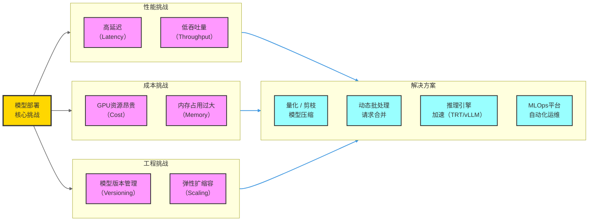

---

## 2. 核心概念与基础原理

### 2.1 推理（Inference）流程

模型推理的完整链路如下：

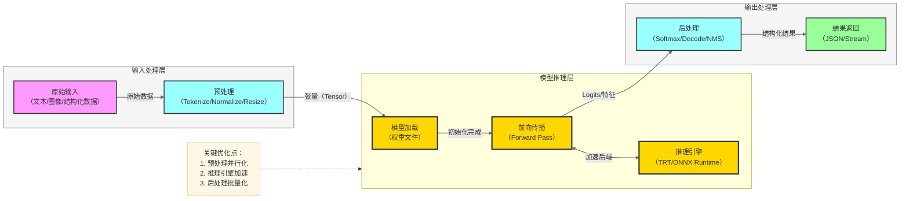

### 2.2 关键性能指标

| 指标 | 英文 | 定义 | 优化方向 |
|------|------|------|----------|
| 延迟 | Latency (P50/P99) | 单次请求从发送到响应的时间 | 越低越好，通常要求 < 200ms |
| 吞吐量 | Throughput / QPS | 每秒处理的请求数 | 越高越好 |
| 首 Token 延迟 | TTFT | LLM 生成第一个 Token 的时间 | LLM 专项指标 |
| Token 生成速率 | TPS (Token/s) | 每秒生成的 Token 数 | LLM 专项指标 |
| GPU 利用率 | GPU Utilization | GPU 计算核心的使用率 | 目标 > 80% |
| 显存占用 | GPU Memory | 模型权重 + KV Cache 占用 | 越低越好 |
| 成本效益 | Cost per 1k tokens | 生成 1000 Token 的费用 | 商业化关键指标 |

### 2.3 计算图与静态/动态图

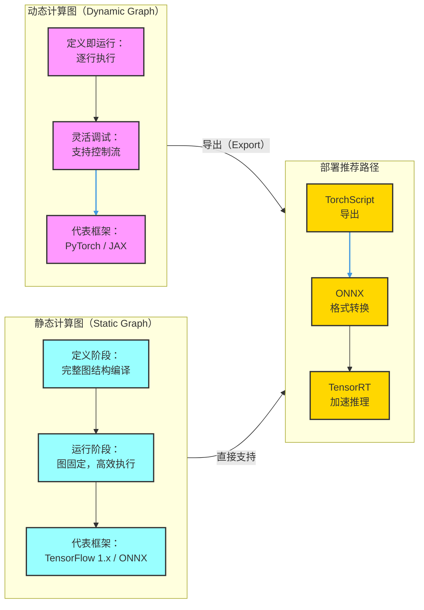

---

## 3. 部署架构与策略选型

### 3.1 四大部署策略对比

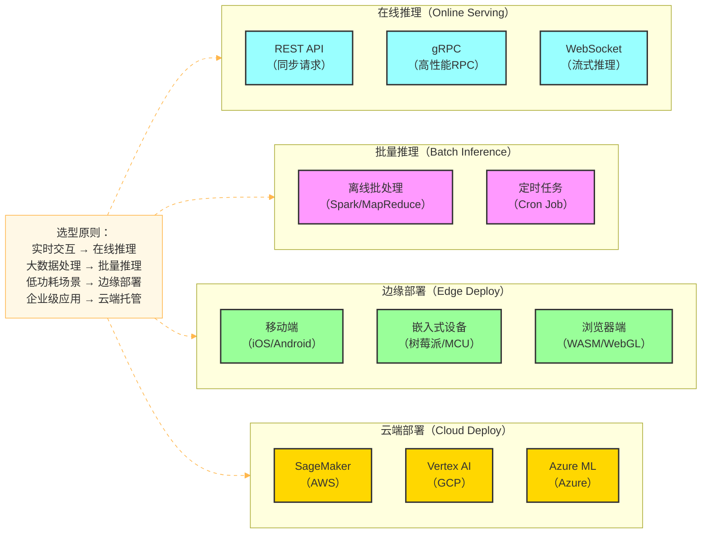

### 3.2 在线推理架构详解

在线推理是最主流的部署方式，架构如下：

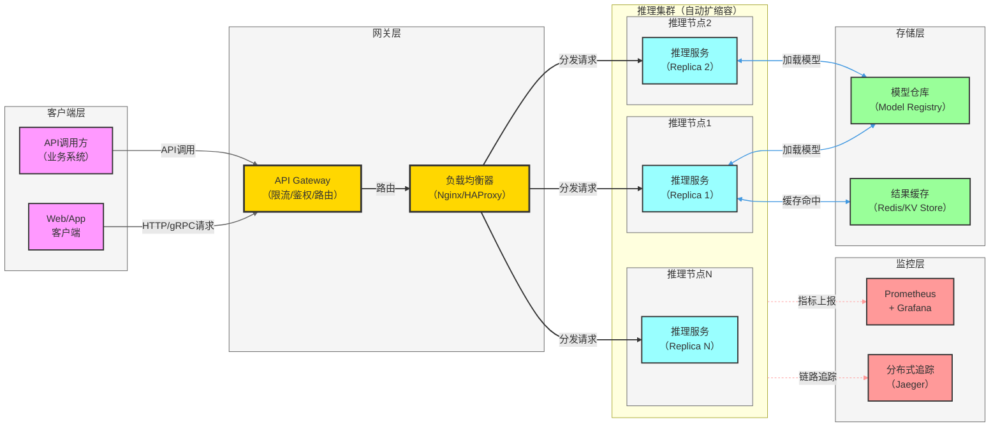

### 3.3 蓝绿部署与金丝雀发布

生产环境模型更新通常采用渐进式发布策略：

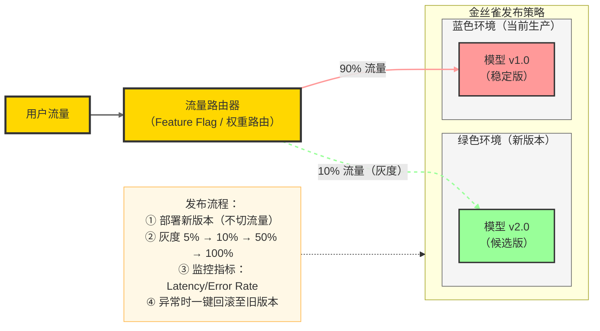

---

## 4. 推理优化核心技术

### 4.1 优化技术全景图

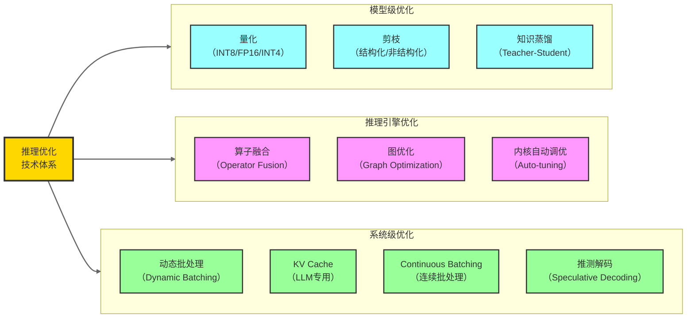

### 4.2 量化（Quantization）

量化是将模型权重和激活值从高精度浮点数（FP32）转换为低精度数值（INT8/FP16/INT4）的技术。

**量化类型对比：**

| 量化类型 | 精度 | 显存节省 | 推理加速 | 精度损失 | 适用场景 |
|----------|------|----------|----------|----------|----------|
| FP32（原始） | 32bit | 基准 | 基准 | 无 | 训练 |
| FP16 / BF16 | 16bit | ~50% | 1.5-2x | 极小 | GPU 推理标配 |
| INT8 PTQ | 8bit | ~75% | 2-4x | 小 | CV 模型常用 |
| INT8 QAT | 8bit | ~75% | 2-4x | 极小 | 精度敏感场景 |
| INT4 GPTQ | 4bit | ~87.5% | 3-5x | 中等 | LLM 压缩 |
| INT4 AWQ | 4bit | ~87.5% | 3-5x | 小 | LLM 高质量压缩 |

**量化原理示意：**

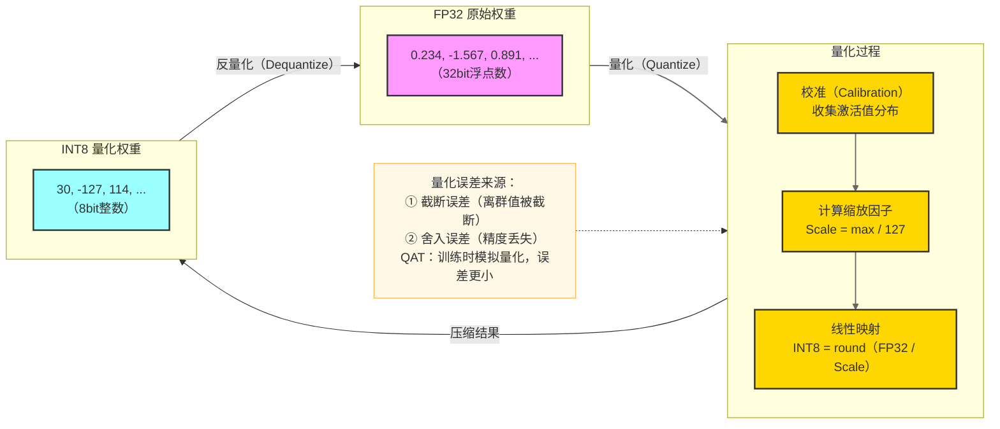

### 4.3 动态批处理（Dynamic Batching）

将多个并发请求合并为一个大 Batch 交给 GPU 处理，显著提升 GPU 利用率：

```mermaid
flowchart LR
    %% 样式定义
    classDef reqStyle fill:#f9f,stroke:#333,stroke-width:2px
    classDef batcherStyle fill:#ffd700,stroke:#333,stroke-width:3px
    classDef gpuStyle fill:#9ff,stroke:#333,stroke-width:2px
    classDef subgraphStyle fill:#f5f5f5,stroke:#666,stroke-width:1px
    classDef noteStyle fill:#fff8e6,stroke:#ffb74d,stroke-width:1px

    subgraph requestLayer["并发请求层"]
        R1[请求1<br/>t=0ms]:::reqStyle
        R2[请求2<br/>t=2ms]:::reqStyle
        R3[请求3<br/>t=5ms]:::reqStyle
        R4[请求N<br/>t=8ms]:::reqStyle
    end
    class requestLayer subgraphStyle

    BATCHER[动态批处理器<br/>（等待窗口：10ms<br/>最大BatchSize：32）]:::batcherStyle

    subgraph gpuLayer["GPU批量推理"]
        GPU[Batch推理<br/>Batch=[R1,R2,R3,...,RN]<br/>一次GPU调用完成]:::gpuStyle
    end
    class gpuLayer subgraphStyle

    Note[核心参数：<br/>max_batch_size：最大合并数量<br/>max_queue_delay：最大等待时间<br/>trade-off：延迟 vs 吞吐量]:::noteStyle

    R1 -->|入队| BATCHER
    R2 -->|入队| BATCHER
    R3 -->|入队| BATCHER
    R4 -->|入队| BATCHER
    BATCHER -->|"窗口满/超时触发"| GPU

    Note -.-> BATCHER

    linkStyle 0,1,2,3 stroke:#666,stroke-width:1.5px
    linkStyle 4 stroke:#4299e1,stroke-width:2.5px
```

### 4.4 推测解码（Speculative Decoding）

利用小草稿模型预测多个 Token，大模型并行验证，显著降低 LLM 推理延迟：

| 步骤 | 操作 | 说明 |
|------|------|------|
| 1 | 草稿模型生成 | 小模型（Draft Model）连续生成 K 个 Token |
| 2 | 目标模型并行验证 | 大模型（Target Model）一次前向通过验证所有 K 个 Token |
| 3 | 接受或拒绝 | 接受概率匹配的 Token，拒绝后截断 |
| 4 | 迭代 | 重复以上步骤 |

**理论加速比：** 草稿接受率越高，加速比越大，通常可达 **2-4x** 的推理加速。

---

## 5. 主流技术栈详解

### 5.1 技术栈全景

```mermaid
flowchart LR
    %% 样式定义
    classDef formatStyle fill:#f9f,stroke:#333,stroke-width:2px
    classDef engineStyle fill:#9ff,stroke:#333,stroke-width:2px
    classDef frameworkStyle fill:#ffd700,stroke:#333,stroke-width:2px
    classDef orchestStyle fill:#9f9,stroke:#333,stroke-width:2px
    classDef subgraphStyle fill:#f5f5f5,stroke:#666,stroke-width:1px
    classDef clusterStyle fill:#e8f4f8,stroke:#4299e1,stroke-width:1.5px

    subgraph formatLayer["模型格式层"]
        F1[PyTorch<br/>(.pt/.pth)]:::formatStyle
        F2[ONNX<br/>(.onnx)]:::formatStyle
        F3[TensorFlow<br/>SavedModel]:::formatStyle
        F4[GGUF<br/>（llama.cpp）]:::formatStyle
    end
    class formatLayer subgraphStyle

    subgraph engineLayer["推理引擎层"]
        E1[TensorRT<br/>（NVIDIA GPU）]:::engineStyle
        E2[ONNX Runtime<br/>（跨平台）]:::engineStyle
        E3[OpenVINO<br/>（Intel）]:::engineStyle
        E4[CoreML<br/>（Apple）]:::engineStyle
    end
    class engineLayer subgraphStyle

    subgraph frameworkLayer["服务框架层"]
        S1[Triton<br/>Inference Server]:::frameworkStyle
        S2[vLLM<br/>（LLM专用）]:::frameworkStyle
        S3[TorchServe<br/>（PyTorch官方）]:::frameworkStyle
        S4[TGI<br/>（HuggingFace）]:::frameworkStyle
    end
    class frameworkLayer subgraphStyle

    subgraph orchestLayer["编排与管理层"]
        O1[Kubernetes<br/>+ KServe]:::orchestStyle
        O2[Docker<br/>容器化]:::orchestStyle
        O3[MLflow<br/>模型管理]:::orchestStyle
    end
    class orchestLayer subgraphStyle

    formatLayer -->|"格式转换"| engineLayer
    engineLayer -->|"集成部署"| frameworkLayer
    frameworkLayer -->|"集群编排"| orchestLayer

    linkStyle 0,1,2 stroke:#4299e1,stroke-width:2px
```

### 5.2 ONNX：跨框架模型中间格式

ONNX（Open Neural Network Exchange）是连接训练框架与推理引擎的桥梁：

**PyTorch → ONNX → TensorRT 转换流程：**

```python
import torch
import torch.onnx

# Step 1: 加载训练好的模型
model = MyModel()
model.load_state_dict(torch.load("model.pt"))
model.eval()

# Step 2: 创建示例输入（定义输入形状）
dummy_input = torch.randn(1, 3, 224, 224)

# Step 3: 导出为 ONNX 格式
torch.onnx.export(
    model,
    dummy_input,
    "model.onnx",
    export_params=True,       # 导出权重
    opset_version=17,         # ONNX opset 版本
    do_constant_folding=True, # 常量折叠优化
    input_names=["input"],
    output_names=["output"],
    dynamic_axes={            # 支持动态 Batch
        "input": {0: "batch_size"},
        "output": {0: "batch_size"}
    }
)

print("ONNX 模型导出成功！")
```

```python
# Step 4: 使用 ONNX Runtime 推理验证
import onnxruntime as ort
import numpy as np

session = ort.InferenceSession(
    "model.onnx",
    providers=["CUDAExecutionProvider", "CPUExecutionProvider"]
)

# 执行推理
input_data = np.random.randn(1, 3, 224, 224).astype(np.float32)
outputs = session.run(
    output_names=["output"],
    input_feed={"input": input_data}
)
print(f"推理结果 shape: {outputs[0].shape}")
```

### 5.3 TensorRT：NVIDIA 高性能推理引擎

TensorRT 通过图优化、算子融合、精度校准将模型加速 **2-10x**：

```python
import tensorrt as trt
import numpy as np

# Step 1: 创建 TensorRT Logger 和 Builder
logger = trt.Logger(trt.Logger.WARNING)
builder = trt.Builder(logger)
network = builder.create_network(
    1 << int(trt.NetworkDefinitionCreationFlag.EXPLICIT_BATCH)
)
parser = trt.OnnxParser(network, logger)

# Step 2: 解析 ONNX 模型
with open("model.onnx", "rb") as f:
    parser.parse(f.read())

# Step 3: 配置构建参数
config = builder.create_builder_config()
config.set_memory_pool_limit(trt.MemoryPoolType.WORKSPACE, 1 << 30)  # 1GB
config.set_flag(trt.BuilderFlag.FP16)  # 开启 FP16 精度

# Step 4: 构建 TensorRT Engine（耗时操作，生产环境缓存 engine）
serialized_engine = builder.build_serialized_network(network, config)
with open("model.trt", "wb") as f:
    f.write(serialized_engine)

print("TensorRT Engine 构建完成！")
```

```python
# Step 5: TensorRT 推理
import tensorrt as trt
import pycuda.driver as cuda
import pycuda.autoinit

def load_engine(engine_path):
    runtime = trt.Runtime(trt.Logger(trt.Logger.WARNING))
    with open(engine_path, "rb") as f:
        return runtime.deserialize_cuda_engine(f.read())

engine = load_engine("model.trt")
context = engine.create_execution_context()

# 分配 GPU 内存并执行推理
input_data = np.random.randn(1, 3, 224, 224).astype(np.float16)
# ... 内存分配与推理执行代码
```

### 5.4 vLLM：大语言模型高效服务框架

vLLM 是目前最主流的 LLM 推理框架，核心创新是 **PagedAttention** 技术：

```python
# vLLM 快速启动：作为服务部署
# 命令行方式
# python -m vllm.entrypoints.openai.api_server \
#     --model meta-llama/Llama-3-8B-Instruct \
#     --tensor-parallel-size 2 \
#     --max-model-len 8192 \
#     --gpu-memory-utilization 0.9 \
#     --served-model-name llama3-8b

# Python API 方式
from vllm import LLM, SamplingParams

# 初始化 LLM（自动管理 KV Cache）
llm = LLM(
    model="meta-llama/Llama-3-8B-Instruct",
    tensor_parallel_size=2,          # 张量并行度
    gpu_memory_utilization=0.9,      # GPU 显存利用率
    max_model_len=8192,              # 最大上下文长度
    quantization="awq",              # AWQ 量化
)

# 设置采样参数
sampling_params = SamplingParams(
    temperature=0.7,
    top_p=0.9,
    max_tokens=512,
)

# 批量推理（自动 Continuous Batching）
prompts = [
    "请介绍一下深度学习的发展历史",
    "什么是 Transformer 架构？",
    "解释一下注意力机制的原理",
]

outputs = llm.generate(prompts, sampling_params)
for output in outputs:
    print(f"Prompt: {output.prompt[:30]}...")
    print(f"输出: {output.outputs[0].text}\n")
```

### 5.5 Triton Inference Server：生产级多模型服务

```
# Triton 模型仓库目录结构
model_repository/
├── resnet50/
│   ├── config.pbtxt          # 模型配置
│   └── 1/
│       └── model.onnx        # 模型文件（版本 1）
├── bert_classifier/
│   ├── config.pbtxt
│   └── 1/
│       └── model.plan        # TensorRT engine
└── llm_pipeline/
    ├── config.pbtxt
    └── 1/
        └── model.py          # Python 自定义后端
```

```protobuf
# resnet50/config.pbtxt 配置示例
name: "resnet50"
backend: "onnxruntime"
max_batch_size: 32

input [{
  name: "input"
  data_type: TYPE_FP32
  dims: [3, 224, 224]
}]

output [{
  name: "output"
  data_type: TYPE_FP32
  dims: [1000]
}]

dynamic_batching {
  preferred_batch_size: [8, 16, 32]
  max_queue_delay_microseconds: 10000  # 等待 10ms 凑 batch
}

instance_group [{
  count: 2           # 2 个模型实例
  kind: KIND_GPU
  gpus: [0, 1]       # 使用 GPU 0 和 1
}]
```

---

## 6. 完整部署工作流程

### 6.1 从训练到生产的完整 Pipeline

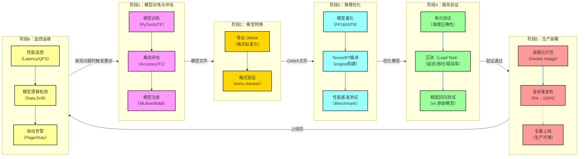

### 6.2 Docker 容器化部署实战

```dockerfile
# Dockerfile 示例：基于 NVIDIA Triton 的推理服务
FROM nvcr.io/nvidia/tritonserver:24.01-py3

# 安装 Python 依赖
COPY requirements.txt /tmp/
RUN pip install --no-cache-dir -r /tmp/requirements.txt

# 复制模型仓库
COPY model_repository/ /models/

# 复制自定义脚本
COPY scripts/ /opt/scripts/

# 设置环境变量
ENV CUDA_VISIBLE_DEVICES=0,1
ENV OMP_NUM_THREADS=4

# 健康检查
HEALTHCHECK --interval=30s --timeout=10s --start-period=60s \
    CMD curl -f http://localhost:8000/v2/health/ready || exit 1

# 启动 Triton Server
ENTRYPOINT ["tritonserver", \
    "--model-repository=/models", \
    "--strict-model-config=false", \
    "--log-verbose=1", \
    "--metrics-interval-ms=1000"]
```

```yaml
# docker-compose.yml：本地开发环境
version: "3.8"
services:
  triton:
    image: inference-server:latest
    build: .
    runtime: nvidia
    environment:
      - NVIDIA_VISIBLE_DEVICES=all
    ports:
      - "8000:8000"  # HTTP
      - "8001:8001"  # gRPC
      - "8002:8002"  # Metrics
    volumes:
      - ./model_repository:/models
    deploy:
      resources:
        reservations:
          devices:
            - driver: nvidia
              count: all
              capabilities: [gpu]

  prometheus:
    image: prom/prometheus:latest
    ports:
      - "9090:9090"
    volumes:
      - ./prometheus.yml:/etc/prometheus/prometheus.yml

  grafana:
    image: grafana/grafana:latest
    ports:
      - "3000:3000"
    depends_on:
      - prometheus
```

### 6.3 Kubernetes + KServe 云原生部署

```yaml
# InferenceService：KServe 自定义资源
apiVersion: serving.kserve.io/v1beta1
kind: InferenceService
metadata:
  name: llm-service
  namespace: ml-serving
  annotations:
    autoscaling.knative.dev/target: "5"       # 每实例并发数
    autoscaling.knative.dev/scale-to-zero-pod-retention-period: "5m"
spec:
  predictor:
    minReplicas: 1                             # 最小副本数（避免冷启动）
    maxReplicas: 10                            # 最大副本数
    containerConcurrency: 5
    containers:
      - name: kserve-container
        image: your-registry/llm-server:v2.1
        resources:
          limits:
            nvidia.com/gpu: "1"
            memory: "32Gi"
          requests:
            nvidia.com/gpu: "1"
            memory: "16Gi"
        env:
          - name: MODEL_NAME
            value: "llama3-8b"
          - name: MAX_MODEL_LEN
            value: "8192"
        ports:
          - containerPort: 8080
        readinessProbe:
          httpGet:
            path: /health/ready
            port: 8080
          initialDelaySeconds: 60             # 模型加载时间
          periodSeconds: 10
```

---

## 7. 大语言模型（LLM）专项部署

### 7.1 LLM 推理的独特挑战

LLM 推理与传统模型推理存在本质差异：

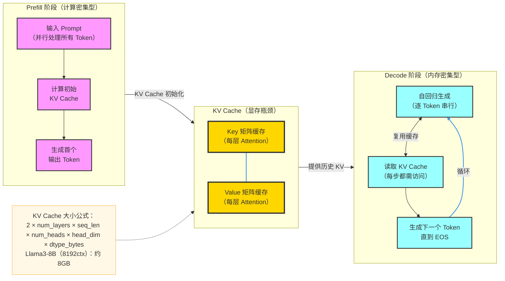

### 7.2 PagedAttention：vLLM 的核心技术

PagedAttention 借鉴操作系统虚拟内存分页机制，解决 KV Cache 显存碎片化问题：

```mermaid
flowchart LR
    %% 样式定义
    classDef seqStyle fill:#f9f,stroke:#333,stroke-width:2px
    classDef blockStyle fill:#9ff,stroke:#333,stroke-width:2px
    classDef freeStyle fill:#9f9,stroke:#333,stroke-width:2px
    classDef subgraphStyle fill:#f5f5f5,stroke:#666,stroke-width:1px
    classDef clusterStyle fill:#e8f4f8,stroke:#4299e1,stroke-width:1.5px
    classDef noteStyle fill:#fff8e6,stroke:#ffb74d,stroke-width:1px

    subgraph seqLayer["并发请求序列"]
        SEQ1[序列1<br/>（已生成200 Token）]:::seqStyle
        SEQ2[序列2<br/>（已生成50 Token）]:::seqStyle
        SEQ3[序列3<br/>（已生成150 Token）]:::seqStyle
    end
    class seqLayer subgraphStyle

    subgraph blockTable["Block Table（逻辑→物理映射）"]
        BT1[序列1: [3,7,12,...]<br/>逻辑块→物理块]:::blockStyle
        BT2[序列2: [1,9]<br/>逻辑块→物理块]:::blockStyle
        BT3[序列3: [5,2,11,...]<br/>逻辑块→物理块]:::blockStyle
    end
    class blockTable subgraphStyle

    subgraph physMem["物理显存（分块管理）"]
        PB1[Block 1<br/>（SEQ2-L1）]:::blockStyle
        PB2[Block 2<br/>（SEQ3-L2）]:::blockStyle
        PB3[Block 3<br/>（SEQ1-L1）]:::blockStyle
        PB4[Block 4<br/>空闲]:::freeStyle
        PB5[Block 5<br/>（SEQ3-L1）]:::blockStyle
        PB6[Block 6<br/>空闲]:::freeStyle
        PB7[Block 7<br/>（SEQ1-L2）]:::blockStyle
    end
    class physMem clusterStyle

    Note[核心优势：<br/>① 消除显存碎片（利用率从 55%→97%）<br/>② 支持 Prefix Sharing（共享前缀块）<br/>③ 支持 Beam Search 时 Copy-on-Write<br/>④ 吞吐量提升 2-4x]:::noteStyle

    SEQ1 --> BT1
    SEQ2 --> BT2
    SEQ3 --> BT3
    BT1 -->|映射| PB3
    BT1 -->|映射| PB7
    BT2 -->|映射| PB1
    BT3 -->|映射| PB5
    BT3 -->|映射| PB2
    Note -.-> physMem

    linkStyle 0,1,2 stroke:#666,stroke-width:1.5px
    linkStyle 3,4,5,6,7 stroke:#4299e1,stroke-width:1.5px
```

### 7.3 并行策略（大模型多卡部署）

```mermaid
flowchart LR
    %% 样式定义
    classDef tensorStyle fill:#f9f,stroke:#333,stroke-width:2px
    classDef pipeStyle fill:#9ff,stroke:#333,stroke-width:2px
    classDef dataStyle fill:#ffd700,stroke:#333,stroke-width:2px
    classDef subgraphStyle fill:#f5f5f5,stroke:#666,stroke-width:1px
    classDef noteStyle fill:#fff8e6,stroke:#ffb74d,stroke-width:1px

    subgraph tensorParallel["张量并行（Tensor Parallel）"]
        TP1[GPU 0<br/>矩阵左半部分]:::tensorStyle
        TP2[GPU 1<br/>矩阵右半部分]:::tensorStyle
        TP3[All-Reduce<br/>合并结果]:::tensorStyle
        TP1 -->|同层并行| TP3
        TP2 -->|同层并行| TP3
    end
    class tensorParallel subgraphStyle

    subgraph pipeParallel["流水线并行（Pipeline Parallel）"]
        PP1[GPU 0<br/>Layer 1-8]:::pipeStyle
        PP2[GPU 1<br/>Layer 9-16]:::pipeStyle
        PP3[GPU 2<br/>Layer 17-32]:::pipeStyle
        PP1 -->|激活值传递| PP2 -->|激活值传递| PP3
    end
    class pipeParallel subgraphStyle

    subgraph dataParallel["数据并行（Data Parallel）"]
        DP1[GPU 0<br/>Batch A（完整模型）]:::dataStyle
        DP2[GPU 1<br/>Batch B（完整模型）]:::dataStyle
    end
    class dataParallel subgraphStyle

    Note[推荐配置（70B模型）：<br/>张量并行 × 4 + 流水线并行 × 2 = 8张GPU<br/>vLLM: --tensor-parallel-size 4<br/>DeepSpeed: --pipeline-parallel-size 2]:::noteStyle

    Note -.-> tensorParallel

    linkStyle 5,6 stroke:#4299e1,stroke-width:1.5px,stroke-dasharray:5 5
```

### 7.4 LLM 服务关键配置参数

```python
# vLLM 生产环境推荐配置
from vllm import AsyncLLMEngine, AsyncEngineArgs

engine_args = AsyncEngineArgs(
    model="Qwen/Qwen2.5-72B-Instruct",
    
    # 并行配置
    tensor_parallel_size=4,           # 4 张 GPU 张量并行
    pipeline_parallel_size=1,         # 流水线并行（通常不用）
    
    # 显存配置
    gpu_memory_utilization=0.92,      # 留 8% 给 CUDA 操作
    max_model_len=32768,              # 最大上下文长度
    
    # 量化配置
    quantization="awq",               # AWQ 量化（降低显存）
    
    # 批处理配置
    max_num_seqs=256,                 # 最大并发序列数
    max_num_batched_tokens=32768,     # 每次最大批处理 Token 数
    
    # 调度配置
    scheduler_delay_factor=0.0,       # 调度延迟因子
    enable_chunked_prefill=True,      # 分块 Prefill（降低延迟波动）
    
    # 推测解码（可选，需要草稿模型）
    # speculative_model="ngram",
    # num_speculative_tokens=5,
    
    # 服务配置
    served_model_name="qwen2.5-72b",  # API 中的模型名称
    dtype="bfloat16",                 # 计算精度
    seed=42,
)
```

---

## 8. 监控、可观测性与运维

### 8.1 监控体系架构

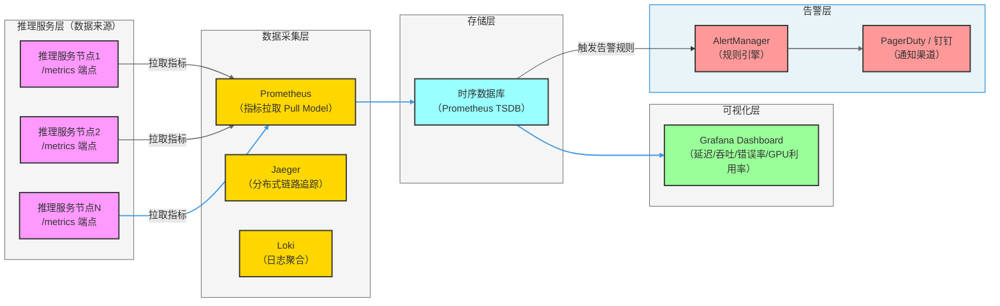

### 8.2 核心告警规则配置

```yaml
# prometheus_rules.yml
groups:
  - name: inference_service_alerts
    rules:
      # 高延迟告警（P99 > 500ms）
      - alert: HighInferenceLatency
        expr: histogram_quantile(0.99, rate(inference_duration_seconds_bucket[5m])) > 0.5
        for: 2m
        labels:
          severity: warning
        annotations:
          summary: "推理延迟过高"
          description: "P99 延迟 {{ $value }}s，超过 500ms 阈值"

      # 高错误率告警（> 1%）
      - alert: HighErrorRate
        expr: rate(inference_errors_total[5m]) / rate(inference_requests_total[5m]) > 0.01
        for: 1m
        labels:
          severity: critical
        annotations:
          summary: "推理错误率过高"
          description: "错误率 {{ $value | humanizePercentage }}"

      # GPU 显存不足（> 95%）
      - alert: GPUMemoryHigh
        expr: nvidia_smi_memory_used_bytes / nvidia_smi_memory_total_bytes > 0.95
        for: 5m
        labels:
          severity: warning
        annotations:
          summary: "GPU 显存告急"
          description: "GPU {{ $labels.gpu }} 显存使用率 {{ $value | humanizePercentage }}"
```

### 8.3 模型漂移检测

```python
# 数据漂移检测示例（使用 evidently）
from evidently.report import Report
from evidently.metric_preset import DataDriftPreset, DataQualityPreset
import pandas as pd

# 加载参考数据集（训练时的数据分布）
reference_data = pd.read_parquet("reference_dataset.parquet")

# 加载当前生产数据（滑动窗口，如最近7天）
current_data = pd.read_parquet("production_data_last_7days.parquet")

# 生成漂移报告
report = Report(metrics=[
    DataDriftPreset(),      # 特征漂移检测
    DataQualityPreset(),    # 数据质量检测
])
report.run(reference_data=reference_data, current_data=current_data)
report.save_html("drift_report.html")

# 告警逻辑
results = report.as_dict()
if results["metrics"][0]["result"]["dataset_drift"]:
    print("⚠️ 检测到数据漂移！触发模型重训流程")
    trigger_retraining_pipeline()
```

---

## 9. 实战示例

### 9.1 示例一：图像分类模型全流程部署

#### Step 1：训练模型并导出

```python
import torch
import torchvision.models as models

# 加载预训练 ResNet50，微调输出层
model = models.resnet50(pretrained=True)
model.fc = torch.nn.Linear(2048, 10)  # 10 分类任务

# 假设已完成微调训练...
model.eval()

# 导出 ONNX
dummy_input = torch.randn(1, 3, 224, 224)
torch.onnx.export(
    model, dummy_input, "resnet50_custom.onnx",
    opset_version=17,
    input_names=["image"],
    output_names=["logits"],
    dynamic_axes={"image": {0: "batch"}, "logits": {0: "batch"}}
)
```

#### Step 2：使用 FastAPI 构建推理服务

```python
# inference_server.py
import io
import numpy as np
from PIL import Image
from fastapi import FastAPI, UploadFile, File
from fastapi.responses import JSONResponse
import onnxruntime as ort
import uvicorn

app = FastAPI(title="图像分类推理服务", version="1.0")

# 全局加载模型（服务启动时只加载一次）
session = ort.InferenceSession(
    "resnet50_custom.onnx",
    providers=["CUDAExecutionProvider", "CPUExecutionProvider"]
)

LABELS = ["猫", "狗", "鸟", "鱼", "马", "牛", "羊", "猪", "鸡", "鸭"]

def preprocess(image: Image.Image) -> np.ndarray:
    """图像预处理：Resize + Normalize"""
    image = image.resize((224, 224)).convert("RGB")
    img_array = np.array(image, dtype=np.float32) / 255.0
    mean = np.array([0.485, 0.456, 0.406])
    std = np.array([0.229, 0.224, 0.225])
    img_array = (img_array - mean) / std
    return img_array.transpose(2, 0, 1)[np.newaxis, :]  # [1, 3, 224, 224]

@app.get("/health")
async def health():
    return {"status": "ok"}

@app.post("/predict")
async def predict(file: UploadFile = File(...)):
    # 读取图像
    contents = await file.read()
    image = Image.open(io.BytesIO(contents))
    
    # 预处理
    input_tensor = preprocess(image)
    
    # 推理
    outputs = session.run(["logits"], {"image": input_tensor})
    logits = outputs[0][0]
    
    # 后处理：Softmax + Top-3
    probs = np.exp(logits) / np.sum(np.exp(logits))
    top3_idx = probs.argsort()[-3:][::-1]
    
    results = [
        {"label": LABELS[i], "confidence": float(probs[i])}
        for i in top3_idx
    ]
    
    return JSONResponse({"predictions": results})

if __name__ == "__main__":
    uvicorn.run(app, host="0.0.0.0", port=8080, workers=4)
```

#### Step 3：压力测试

```python
# benchmark.py
import asyncio
import aiohttp
import time
import statistics

async def send_request(session, url, image_path):
    start = time.time()
    with open(image_path, "rb") as f:
        data = aiohttp.FormData()
        data.add_field("file", f, filename="test.jpg")
        async with session.post(url, data=data) as resp:
            await resp.json()
    return time.time() - start

async def benchmark(url, image_path, total_requests=1000, concurrency=50):
    latencies = []
    async with aiohttp.ClientSession() as session:
        semaphore = asyncio.Semaphore(concurrency)
        
        async def bounded_request():
            async with semaphore:
                latency = await send_request(session, url, image_path)
                latencies.append(latency)
        
        start = time.time()
        await asyncio.gather(*[bounded_request() for _ in range(total_requests)])
        total_time = time.time() - start
    
    print(f"总请求数: {total_requests}")
    print(f"并发数: {concurrency}")
    print(f"总耗时: {total_time:.2f}s")
    print(f"QPS: {total_requests / total_time:.1f}")
    print(f"平均延迟: {statistics.mean(latencies)*1000:.1f}ms")
    print(f"P99 延迟: {statistics.quantiles(latencies, n=100)[98]*1000:.1f}ms")

asyncio.run(benchmark(
    "http://localhost:8080/predict",
    "test_image.jpg"
))
```

### 9.2 示例二：LLM OpenAI 兼容 API 服务

```bash
# 使用 vLLM 启动 OpenAI 兼容服务
python -m vllm.entrypoints.openai.api_server \
    --model Qwen/Qwen2.5-7B-Instruct \
    --host 0.0.0.0 \
    --port 8000 \
    --tensor-parallel-size 1 \
    --max-model-len 32768 \
    --gpu-memory-utilization 0.90 \
    --served-model-name qwen2.5-7b \
    --enable-prefix-caching \
    --dtype bfloat16
```

```python
# 使用 OpenAI SDK 调用（完全兼容）
from openai import OpenAI

client = OpenAI(
    base_url="http://localhost:8000/v1",
    api_key="not-needed"  # vLLM 默认不需要鉴权
)

# 普通对话
response = client.chat.completions.create(
    model="qwen2.5-7b",
    messages=[
        {"role": "system", "content": "你是一个有帮助的 AI 助手。"},
        {"role": "user", "content": "请用三句话解释什么是机器学习。"}
    ],
    temperature=0.7,
    max_tokens=512,
)
print(response.choices[0].message.content)

# 流式输出
stream = client.chat.completions.create(
    model="qwen2.5-7b",
    messages=[{"role": "user", "content": "写一首关于秋天的诗"}],
    stream=True,
    max_tokens=200,
)

print("流式输出：", end="", flush=True)
for chunk in stream:
    if chunk.choices[0].delta.content:
        print(chunk.choices[0].delta.content, end="", flush=True)
print()
```

### 9.3 示例三：边缘端部署（使用 llama.cpp）

```bash
# 安装 llama.cpp
git clone https://github.com/ggerganov/llama.cpp
cd llama.cpp
make -j4  # CPU 编译
# make LLAMA_CUDA=1 -j4  # GPU 编译

# 下载 GGUF 格式模型（已量化为 Q4_K_M）
# 文件大小约 4.1GB（原始 7B 模型约 14GB）
wget https://huggingface.co/Qwen/Qwen2.5-7B-Instruct-GGUF/resolve/main/qwen2.5-7b-instruct-q4_k_m.gguf

# 启动本地服务
./llama-server \
    --model qwen2.5-7b-instruct-q4_k_m.gguf \
    --ctx-size 8192 \
    --n-gpu-layers 35 \   # 35 层放 GPU，其余 CPU
    --threads 8 \
    --host 0.0.0.0 \
    --port 8080
```

```python
# Python 调用边缘端服务
import requests

response = requests.post(
    "http://localhost:8080/v1/chat/completions",
    json={
        "model": "qwen2.5-7b",
        "messages": [{"role": "user", "content": "你好！"}],
        "max_tokens": 200,
        "temperature": 0.7,
    }
)
print(response.json()["choices"][0]["message"]["content"])
```

---

## 10. 面试常见问题（FAQ）

### 基础概念类

**Q1：模型部署和模型训练的主要区别是什么？**

> **A：** 核心区别在于目标和约束不同：
> - **训练**关注模型质量（Loss 下降、指标提升），允许高延迟（一次训练数小时到数天），需要反向传播计算梯度。
> - **部署/推理**关注服务质量（延迟 P99 < 200ms、QPS > 1000），只进行前向传播，需要关闭梯度计算（`torch.no_grad()`）。生产环境通常还需要量化、引擎加速等优化，降低资源占用。

---

**Q2：什么是模型量化？INT8 量化会对精度产生多大影响？**

> **A：** 量化是将模型权重从高精度（FP32）映射到低精度（INT8/INT4）的过程，目的是减少显存占用和加速计算。
> - **PTQ（训练后量化）**：直接对训练好的模型量化，无需重训，但精度可能下降 0.5-2%。
> - **QAT（量化感知训练）**：在训练时模拟量化误差，精度损失极小（< 0.3%），但需要重训。
> - **实际影响**：INT8 量化对 CV 模型几乎无感知损失；对 LLM 使用 GPTQ/AWQ INT4 量化，PPL（困惑度）通常上升不超过 5%。

---

**Q3：解释一下动态批处理（Dynamic Batching）的原理和优缺点。**

> **A：** 动态批处理是将在短时间窗口内（如 10ms）到达的多个请求合并为一个大 Batch 送入 GPU 推理。
> - **优点**：GPU 利用率从单请求的 10-20% 提升到 80%+，大幅提升整体吞吐量（QPS）。
> - **缺点**：引入了额外的排队延迟（等待窗口时间），对延迟敏感型业务不友好。
> - **权衡**：`max_queue_delay` 越大，吞吐越高但延迟越大；需根据业务 SLA 调整。

---

**Q4：ONNX 是什么？为什么要用它？**

> **A：** ONNX（Open Neural Network Exchange）是一种开放的模型中间表示格式。之所以使用它：
> 1. **跨框架互操作**：PyTorch 训练的模型可以在 TensorFlow、TensorRT 等环境运行。
> 2. **推理引擎支持广泛**：ONNX Runtime、TensorRT、OpenVINO 等都原生支持。
> 3. **优化机会**：ONNX 支持常量折叠、算子融合等图优化，提升推理速度。

---

### 性能优化类

**Q5：TensorRT 是如何加速推理的？**

> **A：** TensorRT 通过以下几个核心技术加速推理：
> 1. **算子融合（Layer Fusion）**：将 Conv + BN + ReLU 三个算子合并为一个 CUDA Kernel，减少内存读写。
> 2. **精度校准（Precision Calibration）**：将 FP32 模型自动转换为 FP16/INT8，降低显存和计算量。
> 3. **内核自动调优（Kernel Auto-Tuning）**：针对特定 GPU 型号选择最优的 CUDA 实现。
> 4. **动态张量显存**：推理时动态分配显存，避免浪费。
> 综合效果：相比 PyTorch 原生推理加速 **2-10x**。

---

**Q6：LLM 推理中的 KV Cache 是什么？为什么重要？**

> **A：** KV Cache 是 Transformer 注意力机制的推理优化：在自回归解码时，每个新 Token 都需要与之前所有 Token 做注意力计算，KV Cache 将历史 Token 的 Key 和 Value 矩阵缓存在显存中，避免重复计算。
> - **大小**：约为 `2 × num_layers × seq_len × num_heads × head_dim × bytes`，Llama3-8B 在 8192 上下文时约占 **8GB**。
> - **瓶颈**：KV Cache 是 LLM 部署的核心显存瓶颈，决定了能同时处理多少并发请求。

---

**Q7：PagedAttention 解决了什么问题？原理是什么？**

> **A：** 传统 KV Cache 采用连续显存分配，存在两个问题：①提前为最大序列长度预留显存，导致显存浪费；②显存碎片化严重，实际利用率只有 55%。
>
> PagedAttention 借鉴操作系统的虚拟内存分页机制：
> - 将 KV Cache 分成固定大小的"物理块"（Block）
> - 通过"Block Table"映射逻辑序列位置到物理块地址
> - 按需分配物理块，消除碎片
> - 结果：显存利用率提升到 **97%**，吞吐量提升 **2-4x**。

---

**Q8：什么是推测解码（Speculative Decoding）？适用场景是什么？**

> **A：** 推测解码使用一个小的"草稿模型"（Draft Model，如 68M 参数）快速生成 K 个候选 Token，然后目标大模型通过一次前向传播并行验证这 K 个 Token 的接受概率，接受概率匹配的 Token，拒绝后截断。
> - **理论加速**：当草稿模型接受率高（> 80%）时，可实现 **2-4x** 加速。
> - **适用场景**：输出分布简单可预测的任务（代码补全、翻译），草稿接受率高；不适合创意写作等随机性强的任务。

---

### 架构设计类

**Q9：如何设计一个高可用的模型推理服务？**

> **A：** 核心设计要点：
> 1. **多副本部署**：至少 2 个推理实例，通过负载均衡分发请求。
> 2. **自动扩缩容（HPA）**：基于 GPU 利用率或请求队列长度自动伸缩。
> 3. **熔断与降级**：当推理超时时返回默认结果，避免雪崩。
> 4. **结果缓存**：对相同输入使用 Redis 缓存，减少重复推理。
> 5. **健康检查**：/health 端点，K8s 自动剔除异常节点。
> 6. **金丝雀发布**：模型更新时灰度 5%→100%，异常时秒级回滚。

---

**Q10：蓝绿部署和金丝雀发布的区别？什么时候用哪个？**

> **A：**
> | | 蓝绿部署 | 金丝雀发布 |
> |---|---|---|
> | 流量切换 | 100% 瞬时切换 | 渐进式（5%→100%） |
> | 风险 | 全量暴露风险，但可秒级回滚 | 只有小比例用户受影响 |
> | 资源消耗 | 需 2 倍资源 | 资源消耗较小 |
> | 适用场景 | 版本差异大，需彻底替换 | 新功能验证，风险评估 |
>
> **推荐**：模型更新通常用金丝雀发布，先验证新模型的推理质量和性能指标再全量。

---

**Q11：模型部署中的冷启动问题是什么？如何解决？**

> **A：** 冷启动指服务实例从零启动时需要加载模型权重（7B 模型约需 30-60s），期间无法响应请求。
> - **K8s 配置**：`minReplicas=1` 保留至少 1 个热实例；`readinessProbe` 延长就绪检测时间。
> - **模型预热（Warm-up）**：容器启动后先发送几次假请求，触发 JIT 编译和内存预分配。
> - **共享内存**：多实例使用 `mmap` 共享模型权重，加速加载。
> - **预测性扩容**：根据历史流量模式，在高峰前提前扩容（非响应式扩容）。

---

**Q12：张量并行（Tensor Parallelism）和流水线并行（Pipeline Parallelism）的区别？**

> **A：**
> - **张量并行**：将单个矩阵乘法拆分到多张 GPU 上计算（按行或列分割），每层都需要 All-Reduce 通信同步。延迟低，适合单机多卡（NVLink 高带宽）。
> - **流水线并行**：将模型的不同层（Layer）分配到不同 GPU，数据流水线式流经各 GPU。通信量少，适合跨机器部署；但存在"气泡"（bubble）问题（等待前级计算）。
> - **实际配置**：70B 模型通常用 **张量并行 × 4（单节点）+ 流水线并行 × 2（跨节点）= 8 卡**。

---

**Q13：如何检测模型在生产环境中的退化（Model Degradation）？**

> **A：** 模型退化通常由**数据漂移（Data Drift）**引起，检测方法：
> 1. **统计测试**：使用 KS 检验（Kolmogorov-Smirnov）或 PSI（Population Stability Index）比较输入特征分布与训练集的差异。
> 2. **业务指标监控**：监控转化率、点击率等下游业务指标，其下降往往是模型退化的先兆。
> 3. **影子模式（Shadow Mode）**：将新版本模型与生产版本并行运行（不影响用户），对比输出差异。
> 4. **定期评估**：对带标注的黄金数据集定期运行，监控准确率趋势。
> 5. **自动触发重训**：漂移检测超阈值时自动触发 MLOps 流水线重新训练。

---

**Q14：使用 FP16 代替 FP32 进行推理有什么风险？如何应对？**

> **A：** FP16 动态范围（`6e-5 ~ 65504`）远小于 FP32（`1.2e-38 ~ 3.4e38`），主要风险：
> 1. **溢出（Overflow）**：大数值超过 65504 变为 `inf`，导致 NaN 传播。
> 2. **下溢（Underflow）**：极小数值变为 0，影响梯度和激活精度。
>
> **应对方案**：
> - 使用 **BF16**（Brain Float 16）：动态范围与 FP32 相同，只是精度降低，更安全。
> - 混合精度：矩阵乘法用 FP16，Accumulator（累加器）保持 FP32。
> - Softmax、LayerNorm 等数值敏感操作保持 FP32。

---

**Q15：什么是 Continuous Batching（连续批处理）？它比 Static Batching 好在哪里？**

> **A：** 
> - **Static Batching**：一批请求必须等所有序列生成完毕才能处理下一批，短序列生成完后 GPU 闲置等待长序列，利用率低。
> - **Continuous Batching**：某个序列生成结束后，立即将新请求"插入"到当前 Batch 继续处理，不需要等待整个 Batch 完成。
>
> **效果**：吞吐量提升 **5-10x**，是 vLLM 和 TGI 的核心特性之一。这就是为什么 LLM 生产部署必须使用专业推理框架而非原生 Hugging Face `generate()`。

---

> **参考资料**
> - [vLLM 论文：Efficient Memory Management for Large Language Model Serving with PagedAttention](https://arxiv.org/abs/2309.06180)
> - [TensorRT 官方文档](https://docs.nvidia.com/deeplearning/tensorrt/developer-guide/)
> - [ONNX Runtime 官方文档](https://onnxruntime.ai/docs/)
> - [Triton Inference Server 官方文档](https://docs.nvidia.com/deeplearning/triton-inference-server/user-guide/)
> - [KServe 官方文档](https://kserve.github.io/website/)
> - [Speculative Decoding 论文](https://arxiv.org/abs/2211.17192)
